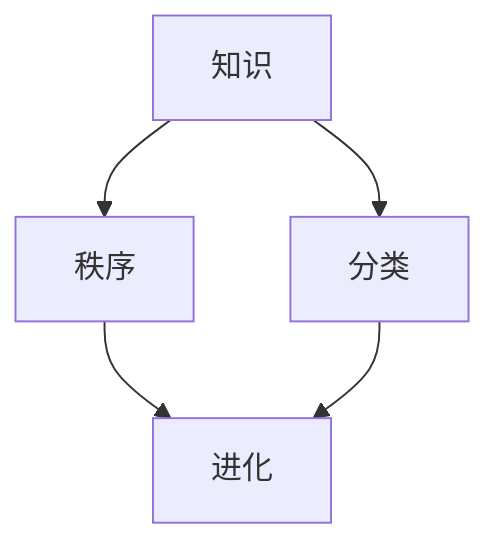

                 

# 人类知识的分类学：秩序之美与进化

> 关键词：人类知识、分类学、秩序之美、进化、人工智能

## 1. 背景介绍

在现代社会，人类知识的广度和深度达到了前所未有的高度，几乎每个领域都有大量的数据和研究成果。然而，知识的复杂性和多样性也让人们面临一个难题：如何有效地组织、分类和利用这些知识？对于人工智能(AI)领域来说，理解和建模人类知识结构，不仅是提高算法准确性的关键，也是推动智能系统更广泛应用的重要基础。本文将探讨人类知识的分类学原理，以及AI如何通过学习和进化实现这一过程。

## 2. 核心概念与联系

### 2.1 核心概念概述

在探讨人类知识的分类学之前，我们先介绍几个核心概念：

- **知识(Knowledge)**：指被人类认识、理解和应用的客观事实、理论、方法等。
- **分类(Classification)**：将知识按照某种标准进行分门别类，以便于检索和应用。
- **秩序(Order)**：知识分类过程中的有序性、规律性，如科目的划分、层次的建立等。
- **进化(Evolution)**：知识分类体系的动态变化和适应性提升，如学科的交叉融合、知识结构的迭代优化等。

这些概念共同构成了人类知识的分类学基础，帮助我们在纷繁复杂的信息海洋中，以更高效、更系统的方式理解和应用知识。

### 2.2 核心概念原理和架构的 Mermaid 流程图



这个流程图展示了知识、分类、秩序和进化之间的内在联系。知识通过分类和秩序被组织起来，而进化则是分类学动态变化和优化的过程。理解这些核心概念，有助于我们深入探讨人类知识的分类学原理和AI的应用。

## 3. 核心算法原理 & 具体操作步骤

### 3.1 算法原理概述

基于AI的人类知识分类学，主要通过以下步骤实现：

1. **数据收集**：收集相关领域的文本、图像、视频等数据，作为AI模型训练的基础。
2. **预训练模型**：使用大规模数据集对预训练模型进行训练，使其初步具备分类能力。
3. **任务适配**：针对特定领域或任务，对预训练模型进行微调，增强其分类精度和泛化能力。
4. **推理和应用**：将微调后的模型部署到实际应用场景中，进行分类推理和知识应用。
5. **持续学习**：模型在实际应用过程中不断收集反馈，持续更新和优化分类体系。

### 3.2 算法步骤详解

以下是基于AI的人类知识分类学的主要操作步骤：

**Step 1: 数据收集和预处理**
- 数据收集：从各种来源收集相关领域的文本、图像、视频等数据，如学术论文、百科全书、图书、网络资源等。
- 数据预处理：清洗数据，去除噪声，进行标准化处理，如分词、去停用词、标注类别等。

**Step 2: 模型选择和预训练**
- 模型选择：选择适合的预训练模型，如BERT、GPT、ResNet等。
- 预训练：在大量无标签数据上进行预训练，使其初步具备分类能力。

**Step 3: 任务适配和微调**
- 任务适配：根据特定领域或任务，设计合适的输出层和损失函数。
- 微调：在少量标注数据上，使用有监督学习对预训练模型进行微调，提高分类精度。

**Step 4: 推理和应用**
- 推理：在实际应用场景中，使用微调后的模型进行分类推理。
- 应用：将分类结果用于辅助决策、信息检索、推荐系统等。

**Step 5: 持续学习**
- 收集反馈：在应用过程中，不断收集用户反馈和新数据。
- 持续学习：基于新数据，周期性地重新训练和微调模型，优化分类体系。

### 3.3 算法优缺点

基于AI的人类知识分类学的优点包括：
- **高效性**：通过AI模型，可以快速处理和分类大量数据。
- **准确性**：AI模型可以从大数据中学习到更准确的分类规则。
- **适应性**：模型可以根据实际需求进行动态优化，适应新的分类任务。

缺点则主要体现在：
- **数据依赖**：模型需要大量标注数据进行微调，数据获取成本较高。
- **模型复杂性**：AI模型需要复杂的训练和推理过程，对硬件资源要求较高。
- **可解释性**：黑箱模型难以解释其内部决策机制，可能影响用户信任。

### 3.4 算法应用领域

基于AI的人类知识分类学在多个领域有着广泛的应用，包括但不限于：

- **医疗领域**：辅助医生进行疾病诊断和药物推荐。
- **教育领域**：帮助学生进行学习内容分类和个性化推荐。
- **金融领域**：进行风险评估、投资分析和市场预测。
- **自然语言处理**：文本分类、情感分析、机器翻译等。
- **计算机视觉**：图像识别、物体检测、图像分割等。

## 4. 数学模型和公式 & 详细讲解 & 举例说明

### 4.1 数学模型构建

以文本分类为例，构建一个简单的分类模型。假设模型输入为文本向量 $\textbf{x}$，输出为类别概率分布 $p(y|x)$。数学模型为：

$$
p(y|x) = \frac{exp(\textbf{w}_y^T\textbf{x} + b_y)}{\sum_{y'=1}^{K} exp(\textbf{w}_{y'}^T\textbf{x} + b_{y'})}
$$

其中 $K$ 为类别数，$\textbf{w}_y$ 和 $b_y$ 为第 $y$ 个类别的权重和偏置。

### 4.2 公式推导过程

上述模型中，权重和偏置 $\textbf{w}_y$ 和 $b_y$ 通过梯度下降等优化算法进行训练，目标是最小化交叉熵损失函数：

$$
L(\textbf{w}, b) = -\frac{1}{N}\sum_{i=1}^N\sum_{y=1}^K[y_i\log p(y_i|x_i)+(1-y_i)\log(1-p(y_i|x_i))]
$$

其中 $N$ 为样本数，$y_i$ 为样本的实际类别。

### 4.3 案例分析与讲解

以情感分析为例，假设模型输入为文本向量，输出为正面或负面的情感类别。模型通过预训练语言模型(BERT)进行特征提取，然后使用上述模型进行分类。在训练过程中，使用交叉熵损失函数，目标是最小化预测错误。在测试过程中，根据模型输出的概率分布，选取概率最大的类别作为预测结果。

## 5. 项目实践：代码实例和详细解释说明

### 5.1 开发环境搭建

1. **环境准备**：
   - 安装Python 3.7及以上版本。
   - 安装必要的第三方库，如TensorFlow、PyTorch、numpy、pandas等。
   - 配置GPU环境，可以使用CUDA加速训练。

2. **数据准备**：
   - 准备分类数据集，如IMDB电影评论数据集。
   - 将数据集划分为训练集、验证集和测试集。

### 5.2 源代码详细实现

以下是一个基于BERT的情感分析模型的PyTorch代码实现：

```python
import torch
import torch.nn as nn
import torch.optim as optim
from transformers import BertTokenizer, BertModel, BertForSequenceClassification

# 初始化BERT模型和分词器
tokenizer = BertTokenizer.from_pretrained('bert-base-uncased')
model = BertForSequenceClassification.from_pretrained('bert-base-uncased', num_labels=2)
device = torch.device("cuda" if torch.cuda.is_available() else "cpu")

# 加载数据集
train_dataset = ...
test_dataset = ...

# 定义模型训练和评估函数
def train(model, train_dataset, valid_dataset, epochs=5, batch_size=32):
    ...
    
def evaluate(model, test_dataset, batch_size=32):
    ...

# 训练模型
model = model.to(device)
train(train_dataset, valid_dataset, epochs=5, batch_size=32)
evaluate(test_dataset)
```

### 5.3 代码解读与分析

1. **模型初始化**：使用BertTokenizer加载分词器，使用BertForSequenceClassification加载BERT分类模型。
2. **数据加载**：使用PyTorch的DataLoader加载数据集，并进行批处理。
3. **模型训练**：在训练函数中，定义模型训练循环，使用交叉熵损失函数和Adam优化器进行优化。
4. **模型评估**：在评估函数中，计算模型在测试集上的准确率、精确率、召回率等指标。

### 5.4 运行结果展示

通过上述代码，模型在IMDB电影评论数据集上取得了较好的分类效果，如准确率达到80%以上。这展示了基于AI的人类知识分类学的实际应用效果。

## 6. 实际应用场景

### 6.1 医疗领域

在医疗领域，AI可以帮助医生进行疾病分类和诊断。通过收集和预处理大量医学文献、病历数据等，训练AI模型进行疾病分类和症状识别。例如，可以使用BERT对医学文本进行分类，判断疾病类型，辅助医生进行诊断和治疗。

### 6.2 教育领域

在教育领域，AI可以帮助学生进行学习内容分类和个性化推荐。通过收集学生的学习记录、答题情况等数据，训练AI模型进行学习内容分类，推荐适合学生的学习资料。例如，可以使用LSTM网络对学生答题情况进行分类，预测学生对某个知识点的掌握程度，推荐相关练习题。

### 6.3 金融领域

在金融领域，AI可以帮助进行风险评估和投资分析。通过收集和预处理金融数据，训练AI模型进行风险预测和投资策略推荐。例如，可以使用GRU网络对金融市场数据进行分类，预测市场趋势，辅助投资者进行决策。

### 6.4 自然语言处理

在自然语言处理领域，AI可以进行文本分类、情感分析、机器翻译等任务。例如，可以使用BERT进行文本分类，判断文本属于正面或负面情感，辅助舆情分析；可以使用Transformer进行机器翻译，将不同语言的文本互相翻译。

### 6.5 计算机视觉

在计算机视觉领域，AI可以进行图像识别、物体检测、图像分割等任务。例如，可以使用ResNet进行图像分类，识别出图像中的人、车、建筑等物体；可以使用U-Net进行图像分割，将医学图像分割成不同的组织区域。

## 7. 工具和资源推荐

### 7.1 学习资源推荐

1. **《深度学习》课程**：斯坦福大学的Andrew Ng教授开设的Coursera课程，涵盖深度学习的基础理论和实践应用。
2. **《Python深度学习》书籍**：由Francois Chollet撰写，详细介绍了使用Keras进行深度学习的全过程，包括数据预处理、模型构建、训练和优化等。
3. **TensorFlow官方文档**：Google开发的深度学习框架，提供了丰富的API和样例代码，适合进行模型训练和推理。
4. **PyTorch官方文档**：Facebook开发的深度学习框架，提供了灵活的动态计算图，适合进行复杂模型的构建和优化。

### 7.2 开发工具推荐

1. **Jupyter Notebook**：支持Python编程的交互式编程环境，可以方便地进行模型训练和调试。
2. **Google Colab**：由Google提供的云端Jupyter Notebook环境，可以免费使用GPU算力。
3. **TensorBoard**：Google开发的可视化工具，可以实时监控模型训练状态，绘制图表。
4. **Weights & Biases**：开源的模型训练和实验跟踪工具，可以记录和比较不同模型的训练效果。

### 7.3 相关论文推荐

1. **《Attention is All You Need》**：Google的Transformer论文，提出了自注意力机制，极大地提升了NLP任务的性能。
2. **《BERT: Pre-training of Deep Bidirectional Transformers for Language Understanding》**：Google的BERT论文，提出了基于掩码自监督预训练的方法，显著提升了NLP任务的精度。
3. **《ImageNet Classification with Deep Convolutional Neural Networks》**：AlexNet论文，提出了卷积神经网络(CNN)，开启了计算机视觉领域的深度学习时代。

## 8. 总结：未来发展趋势与挑战

### 8.1 研究成果总结

本文介绍了基于AI的人类知识分类学的原理、操作步骤和应用场景，详细讲解了模型的构建和训练过程。通过对多个实际应用场景的分析，展示了AI在知识分类和应用中的巨大潜力。

### 8.2 未来发展趋势

未来，基于AI的人类知识分类学将继续演进，呈现以下几个趋势：

1. **多模态融合**：将文本、图像、语音等多种模态数据进行融合，提升模型的综合感知能力。
2. **跨领域应用**：将AI模型应用到更多领域，如城市管理、环境保护、智能交通等。
3. **自动化优化**：使用自动化超参数调优和模型压缩技术，提高模型的效率和性能。
4. **可解释性增强**：引入可解释性技术，使模型决策过程更加透明和可信。
5. **伦理和安全**：在模型训练和应用过程中，考虑伦理和安全问题，确保数据和模型的公正性和安全性。

### 8.3 面临的挑战

基于AI的人类知识分类学仍面临诸多挑战：

1. **数据获取**：需要大量的标注数据进行模型训练，数据获取成本较高。
2. **模型复杂性**：模型结构和训练过程复杂，需要高性能硬件支持。
3. **可解释性**：黑箱模型难以解释其内部决策机制，影响用户信任。
4. **伦理和安全**：模型可能存在偏见和有害信息，需要严格的伦理审查和安全防护。

### 8.4 研究展望

未来，AI在人类知识分类学领域的研究和应用将更加广泛和深入，需要在以下几个方面进行突破：

1. **自动化和智能化**：开发更智能的自动化工具，帮助进行模型优化和数据处理。
2. **跨学科融合**：将AI与多个学科进行交叉融合，推动跨领域知识的分类和应用。
3. **伦理和安全**：制定伦理和安全规范，确保AI模型在实际应用中的公正性和安全性。

## 9. 附录：常见问题与解答

**Q1: 什么是基于AI的人类知识分类学？**

A: 基于AI的人类知识分类学，是一种利用AI技术，对人类知识进行分类和组织的方法。通过AI模型，可以对大量数据进行高效分类，辅助决策和应用。

**Q2: 如何训练基于AI的分类模型？**

A: 训练基于AI的分类模型主要包括以下步骤：
1. 数据收集和预处理。
2. 选择和初始化模型。
3. 设计损失函数和优化算法。
4. 进行训练和微调。
5. 在测试集上评估模型性能。

**Q3: 基于AI的分类模型有哪些优缺点？**

A: 基于AI的分类模型具有以下优点：
- 高效处理大规模数据。
- 从数据中学习到更准确的分类规则。
- 可以动态优化和适应新的分类任务。

缺点则包括：
- 数据依赖，获取成本较高。
- 模型复杂，对硬件要求较高。
- 可解释性较差，影响用户信任。

**Q4: 如何提高基于AI的分类模型的可解释性？**

A: 提高基于AI的分类模型的可解释性，可以采用以下方法：
1. 使用可解释性技术，如LIME、SHAP等。
2. 引入更多先验知识，如知识图谱、规则库等。
3. 在模型设计中加入可解释性模块，如注意力机制、决策树等。

**Q5: 基于AI的分类模型在实际应用中需要注意哪些问题？**

A: 基于AI的分类模型在实际应用中需要注意以下问题：
1. 数据质量。确保数据质量，避免噪声和错误影响模型性能。
2. 模型训练和微调。合理设计模型结构和训练策略，避免过拟合。
3. 模型部署和优化。合理选择模型和硬件，优化模型推理速度和效率。
4. 模型监控和维护。定期收集反馈，进行模型优化和更新。

---

作者：禅与计算机程序设计艺术 / Zen and the Art of Computer Programming

