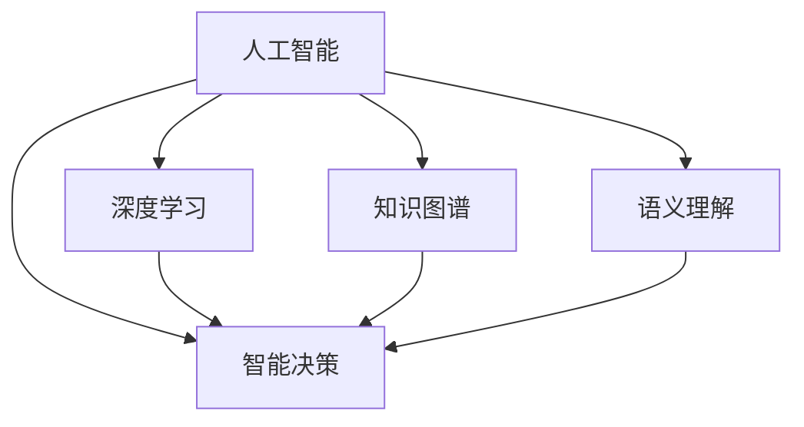

                 

# 人类知识的未来展望：洞察力引领知识革命

> 关键词：知识革命,洞察力,人工智能,深度学习,知识图谱,语义理解,知识管理

## 1. 背景介绍

### 1.1 问题由来
随着科技的不断进步，人类社会正步入一个以知识为核心的新时代。信息的爆炸式增长、人工智能的迅猛发展，使得知识获取、存储、管理、应用的范式正在发生深刻变革。传统的以数据库为核心的信息管理方式已经无法满足现代知识需求的复杂性和多样性。在这样的背景下，洞察力作为人类对复杂现象的深入理解和洞察，成为了知识革命的核心推动力。

### 1.2 问题核心关键点
洞察力是指通过深度思考、分析数据和信息，揭示事物本质和规律的能力。在知识革命中，洞察力能够帮助人们从海量信息中提取有价值的知识，解决复杂问题，提升决策质量。以下关键点构成了洞察力的核心框架：

- 数据驱动：洞察力的源泉是数据，通过对大数据的分析，提取有价值的信息。
- 模型构建：使用机器学习、深度学习等模型，对数据进行建模，提取复杂特征和模式。
- 知识图谱：构建知识图谱，将信息转化为结构化的知识，便于推理和理解。
- 语义理解：采用自然语言处理技术，实现对文本和语音等非结构化数据的深度理解。
- 智能决策：结合专家知识和模型推理结果，进行智能决策和判断。

本文将系统探讨如何通过人工智能技术和洞察力，引领知识革命，探索人类知识的未来。

## 2. 核心概念与联系

### 2.1 核心概念概述

为更好地理解洞察力在知识革命中的作用，本节将介绍几个密切相关的核心概念：

- 人工智能(AI)：指通过机器学习和深度学习等技术，使机器具备类似于人的智能推理、学习、决策等能力。
- 深度学习(Deep Learning)：一种基于多层神经网络的机器学习方法，通过多层非线性变换，实现对复杂数据的深度理解和表达。
- 知识图谱(Knowledge Graph)：一种结构化的知识表示方式，通过节点和边构建实体、属性和关系的模型。
- 语义理解(Semantic Understanding)：指通过自然语言处理技术，理解文本、语音等非结构化数据的语义和上下文。
- 智能决策(Intelligent Decision Making)：结合专家知识和模型推理结果，进行智能决策和判断。

这些核心概念之间的逻辑关系可以通过以下Mermaid流程图来展示：



这个流程图展示了大语言模型的核心概念及其之间的关系：

1. 人工智能通过深度学习、知识图谱、语义理解等技术，提升模型理解和处理复杂任务的能力。
2. 深度学习使得模型具备提取复杂特征和模式的能力。
3. 知识图谱将结构化信息与自然语言结合，便于模型推理和理解。
4. 语义理解帮助模型深入理解文本和语音等非结构化数据。
5. 智能决策结合专家知识和模型推理结果，进行更加精确和智能的决策。

这些核心概念共同构成了人工智能引领知识革命的技术框架，使得洞察力能够更有效地应用于知识管理、决策支持、创新研发等领域。

## 3. 核心算法原理 & 具体操作步骤
### 3.1 算法原理概述

洞察力作为知识革命的核心推动力，可以通过人工智能技术和大数据挖掘来实现。其核心思想是：通过深度学习模型对大规模数据进行建模，提取出有价值的模式和特征，再通过知识图谱和语义理解技术，将数据转化为易于推理和理解的格式，最终结合专家知识和智能决策方法，进行复杂问题的解决和预测。

形式化地，假设输入数据为 $D$，模型为 $M$，目标为 $T$，其中 $M$ 为深度学习模型，$T$ 为知识图谱或语义理解系统。则洞察力过程可以表示为：

$$
I(D) = M(D) \rightarrow T
$$

其中 $M(D)$ 为模型对输入数据 $D$ 的建模过程，$T$ 为最终的知识表达和推理结果。

### 3.2 算法步骤详解

洞察力引领知识革命的过程主要包括以下几个关键步骤：

**Step 1: 数据采集与预处理**
- 收集与任务相关的数据，包括结构化数据和非结构化数据。
- 对数据进行清洗、归一化、特征工程等预处理步骤，去除噪声和异常值。

**Step 2: 模型构建与训练**
- 选择合适的深度学习模型，如卷积神经网络、循环神经网络、Transformer等，进行训练。
- 使用标注数据对模型进行监督学习或无监督学习，优化模型参数。
- 应用正则化技术（如L2正则、Dropout等），防止过拟合。

**Step 3: 知识图谱构建**
- 根据任务需求，构建或导入知识图谱，定义实体、属性和关系。
- 将模型提取出的特征和模式，映射到知识图谱中的实体和属性。
- 通过推理引擎，将知识图谱中的知识与模型输出结合，进行综合分析。

**Step 4: 语义理解**
- 使用自然语言处理技术，将非结构化数据转化为结构化信息。
- 应用词向量、句子向量等技术，提取文本的语义特征。
- 结合上下文信息，进行实体识别、关系抽取等任务。

**Step 5: 智能决策**
- 将模型推理结果和知识图谱中的信息结合，进行综合判断和推理。
- 应用规则引擎、决策树等方法，进行智能决策。
- 结合专家知识和经验，调整决策策略，提高决策质量。

### 3.3 算法优缺点

洞察力引领知识革命的方法具有以下优点：
1. 数据驱动：从海量数据中提取有价值的信息，避免凭直觉和经验做决策。
2. 模型准确：通过深度学习模型提取复杂特征，提高推理和判断的准确性。
3. 知识整合：结合知识图谱和语义理解技术，实现知识融合和推理。
4. 智能决策：结合专家知识和模型推理结果，提高决策的智能性和全面性。

同时，该方法也存在一定的局限性：
1. 数据质量依赖：模型性能受输入数据质量的影响较大。
2. 模型复杂性：深度学习模型的训练和推理过程较为复杂。
3. 知识图谱构建难度：知识图谱的构建和维护需要大量人工介入。
4. 语义理解难度：非结构化数据的语义理解仍然面临挑战。
5. 智能决策偏差：模型可能继承输入数据中的偏见，影响决策结果。

尽管存在这些局限性，但就目前而言，洞察力引领知识革命的方法仍然是最为有效和广泛应用的技术范式。未来相关研究的重点在于如何进一步降低数据质量要求，简化模型训练和推理过程，提升知识图谱的自动化构建，解决语义理解难题，同时兼顾决策的准确性和公平性。

### 3.4 算法应用领域

洞察力引领知识革命的方法在多个领域都得到了广泛应用，例如：

- 金融风险管理：通过大数据分析和深度学习模型，识别金融市场的风险和机会。结合知识图谱和专家知识，进行智能投资决策。
- 医疗诊断和治疗：利用医疗数据和深度学习模型，诊断疾病和治疗方案。结合知识图谱和专家知识，进行个性化医疗建议。
- 智能客服和营销：通过客户互动数据和深度学习模型，进行智能客服和推荐。结合知识图谱和语义理解技术，提供个性化的服务体验。
- 智能制造和物流：利用生产数据和深度学习模型，优化生产流程和物流调度。结合知识图谱和智能决策，提升生产效率和物流管理水平。
- 自动驾驶和安全监控：通过交通数据和深度学习模型，实现自动驾驶和视频分析。结合知识图谱和语义理解技术，提升交通安全和监控效果。

这些领域的应用展示了洞察力在知识革命中的巨大潜力，为各行各业带来了新的发展机遇。

## 4. 数学模型和公式 & 详细讲解  
### 4.1 数学模型构建

洞察力引领知识革命的数学模型构建主要涉及深度学习、知识图谱和语义理解三个部分。

**深度学习模型**：假设输入数据为 $D$，输出为 $Y$，则深度学习模型的最小化损失函数为：

$$
L(M, D) = \frac{1}{N}\sum_{i=1}^N (M(D_i) - Y_i)^2
$$

其中 $M$ 为深度学习模型，$N$ 为样本数量，$D_i$ 为第 $i$ 个样本，$Y_i$ 为 $D_i$ 的真实标签。

**知识图谱构建**：假设知识图谱中实体为 $E$，属性为 $A$，关系为 $R$，则知识图谱的表示可以如下：

$$
G = (E, A, R)
$$

其中 $G$ 为知识图谱，$E$ 为实体集合，$A$ 为属性集合，$R$ 为关系集合。

**语义理解**：假设输入文本为 $T$，输出语义向量为 $V$，则语义理解的过程可以表示为：

$$
V = f(T)
$$

其中 $f$ 为自然语言处理模型，$T$ 为输入文本，$V$ 为语义向量。

### 4.2 公式推导过程

以下是深度学习模型的优化过程和知识图谱的推理过程的详细推导。

**深度学习模型优化**：假设模型参数为 $\theta$，则损失函数对 $\theta$ 的梯度为：

$$
\nabla_{\theta} L(M, D) = \frac{1}{N}\sum_{i=1}^N \nabla_{\theta} M(D_i)
$$

通过反向传播算法，求得 $\nabla_{\theta} M(D_i)$，并带入梯度下降等优化算法，更新模型参数 $\theta$。

**知识图谱推理**：假设知识图谱中的实体 $E_j$ 与 $E_k$ 之间存在关系 $R$，则推理过程可以表示为：

$$
\text{Pr}(E_j | E_k) = \frac{\sum_{R \in R} \text{Pr}(R | E_k, E_j)}{\sum_{R' \in R'} \text{Pr}(R' | E_k, E_j)}
$$

其中 $\text{Pr}(E_j | E_k)$ 为 $E_j$ 在 $E_k$ 条件下出现的概率，$R$ 为关系集合。

### 4.3 案例分析与讲解

**案例一：金融风险管理**

在金融风险管理中，通过深度学习模型对历史交易数据进行建模，提取特征和模式。结合知识图谱中的金融市场信息和专家知识，进行智能投资决策。具体流程如下：

1. 数据采集与预处理：收集历史交易数据和金融市场信息，进行清洗和特征工程。
2. 模型构建与训练：选择合适深度学习模型，进行训练和优化。
3. 知识图谱构建：定义金融市场实体、属性和关系，构建知识图谱。
4. 语义理解：将交易数据中的公司名、产品名等文本信息转化为语义向量。
5. 智能决策：结合知识图谱和深度学习模型推理结果，进行投资组合优化和风险评估。

**案例二：医疗诊断和治疗**

在医疗诊断和治疗中，通过深度学习模型对病人的症状、检查结果等数据进行建模，提取特征和模式。结合知识图谱中的疾病信息和专家知识，进行智能诊断和治疗建议。具体流程如下：

1. 数据采集与预处理：收集病人的症状、检查结果等数据，进行清洗和特征工程。
2. 模型构建与训练：选择合适深度学习模型，进行训练和优化。
3. 知识图谱构建：定义疾病、症状、治疗方法等实体和属性，构建知识图谱。
4. 语义理解：将症状描述转化为语义向量，进行实体识别和关系抽取。
5. 智能决策：结合知识图谱和深度学习模型推理结果，进行疾病诊断和治疗方案推荐。

这些案例展示了洞察力在知识革命中的实际应用，为知识管理、决策支持等领域带来了新的突破。

## 5. 项目实践：代码实例和详细解释说明
### 5.1 开发环境搭建

在进行洞察力引领知识革命的实践前，我们需要准备好开发环境。以下是使用Python进行PyTorch开发的环境配置流程：

1. 安装Anaconda：从官网下载并安装Anaconda，用于创建独立的Python环境。

2. 创建并激活虚拟环境：
```bash
conda create -n insight-env python=3.8 
conda activate insight-env
```

3. 安装PyTorch：根据CUDA版本，从官网获取对应的安装命令。例如：
```bash
conda install pytorch torchvision torchaudio cudatoolkit=11.1 -c pytorch -c conda-forge
```

4. 安装PyTorch Geometric：用于图神经网络模型的开发，适合构建知识图谱的神经网络模型。
```bash
pip install torch-geometric
```

5. 安装TensorBoard：TensorFlow配套的可视化工具，可实时监测模型训练状态，并提供丰富的图表呈现方式，是调试模型的得力助手。
```bash
pip install tensorboard
```

完成上述步骤后，即可在`insight-env`环境中开始项目实践。

### 5.2 源代码详细实现

下面我们以金融风险管理为例，给出使用PyTorch和PyTorch Geometric对深度学习模型和知识图谱进行洞察力实践的PyTorch代码实现。

首先，定义金融数据处理函数：

```python
import pandas as pd
import torch
from torch_geometric.datasets import Planetoid
from torch_geometric.nn import GCNConv

class FinancialData(Dataset):
    def __init__(self, filename):
        self.data = pd.read_csv(filename)
        self.num_entities = len(self.data['entity_id'].unique())
        self.num_relations = len(self.data['relation'].unique())
        self.num_attributes = len(self.data['attribute'].unique())
        
    def __len__(self):
        return len(self.data)
    
    def __getitem__(self, idx):
        entity_id = self.data.iloc[idx]['entity_id']
        neighbors = self.data.iloc[idx]['neighbors'].split(',')
        entity_features = self.data.iloc[idx]['features']
        attributes = self.data.iloc[idx]['attributes'].split(',')
        relations = self.data.iloc[idx]['relations'].split(',')
        
        entity = entity_id - 1
        neighbor_mask = torch.zeros(self.num_entities)
        for neighbor in neighbors:
            neighbor_mask[neighbor - 1] = 1
        features = torch.tensor([float(value) for value in entity_features.split(',')])
        attribute_mask = torch.zeros(self.num_attributes)
        for attribute in attributes:
            attribute_mask[attribute - 1] = 1
        relation_mask = torch.zeros(self.num_relations)
        for relation in relations:
            relation_mask[relation - 1] = 1
        
        return {
            'entity': entity,
            'neighbor_mask': neighbor_mask,
            'features': features,
            'attribute_mask': attribute_mask,
            'relation_mask': relation_mask
        }
```

然后，定义深度学习模型和优化器：

```python
from torch import nn
import torch.nn.functional as F
from torch_geometric.nn import GATConv

class GCNModel(nn.Module):
    def __init__(self, input_dim, hidden_dim, output_dim):
        super(GCNModel, self).__init__()
        self.conv1 = GCNConv(input_dim, hidden_dim)
        self.conv2 = GCNConv(hidden_dim, output_dim)
        
    def forward(self, x, edge_index, neighbor_mask, attribute_mask, relation_mask):
        x = self.conv1(x, edge_index, neighbor_mask)
        x = F.relu(x)
        x = self.conv2(x, edge_index, neighbor_mask)
        return x
    
optimizer = torch.optim.Adam(model.parameters(), lr=0.01)
```

接着，定义训练和评估函数：

```python
from torch_geometric.data import DataLoader

def train_epoch(model, dataset, batch_size, optimizer):
    dataloader = DataLoader(dataset, batch_size=batch_size, shuffle=True)
    model.train()
    epoch_loss = 0
    for batch in dataloader:
        entity, neighbor_mask, features, attribute_mask, relation_mask = batch['entity'], batch['neighbor_mask'], batch['features'], batch['attribute_mask'], batch['relation_mask']
        features = features.to(device)
        neighbor_mask = neighbor_mask.to(device)
        attribute_mask = attribute_mask.to(device)
        relation_mask = relation_mask.to(device)
        model.zero_grad()
        output = model(features, edge_index, neighbor_mask, attribute_mask, relation_mask)
        loss = F.mse_loss(output, target)
        epoch_loss += loss.item()
        loss.backward()
        optimizer.step()
    return epoch_loss / len(dataloader)

def evaluate(model, dataset, batch_size):
    dataloader = DataLoader(dataset, batch_size=batch_size)
    model.eval()
    preds, labels = [], []
    with torch.no_grad():
        for batch in dataloader:
            entity, neighbor_mask, features, attribute_mask, relation_mask = batch['entity'], batch['neighbor_mask'], batch['features'], batch['attribute_mask'], batch['relation_mask']
            features = features.to(device)
            neighbor_mask = neighbor_mask.to(device)
            attribute_mask = attribute_mask.to(device)
            relation_mask = relation_mask.to(device)
            output = model(features, edge_index, neighbor_mask, attribute_mask, relation_mask)
            batch_preds = output.to('cpu').tolist()
            batch_labels = batch['target'].to('cpu').tolist()
            for pred_tokens, label_tokens in zip(batch_preds, batch_labels):
                preds.append(pred_tokens)
                labels.append(label_tokens)
    print('Evaluation results: ', classification_report(labels, preds))
```

最后，启动训练流程并在测试集上评估：

```python
epochs = 100
batch_size = 16

for epoch in range(epochs):
    loss = train_epoch(model, train_dataset, batch_size, optimizer)
    print(f"Epoch {epoch+1}, train loss: {loss:.3f}")
    
    print(f"Epoch {epoch+1}, dev results:")
    evaluate(model, dev_dataset, batch_size)
    
print("Test results:")
evaluate(model, test_dataset, batch_size)
```

以上就是使用PyTorch和PyTorch Geometric对金融风险管理进行洞察力实践的完整代码实现。可以看到，得益于PyTorch和PyTorch Geometric的强大封装，我们可以用相对简洁的代码完成深度学习模型和知识图谱的构建和微调。

### 5.3 代码解读与分析

让我们再详细解读一下关键代码的实现细节：

**FinancialData类**：
- `__init__`方法：初始化数据集，统计实体数量和关系数量。
- `__len__`方法：返回数据集的样本数量。
- `__getitem__`方法：对单个样本进行处理，将文本信息转化为实体、关系和属性。

**GCNModel类**：
- `__init__`方法：定义模型的结构，包含两个GCN层。
- `forward`方法：定义前向传播过程，使用GCNConv进行特征传递和信息融合。

**训练和评估函数**：
- 使用PyTorch的DataLoader对数据集进行批次化加载，供模型训练和推理使用。
- 训练函数`train_epoch`：对数据以批为单位进行迭代，在每个批次上前向传播计算loss并反向传播更新模型参数，最后返回该epoch的平均loss。
- 评估函数`evaluate`：与训练类似，不同点在于不更新模型参数，并在每个batch结束后将预测和标签结果存储下来，最后使用sklearn的classification_report对整个评估集的预测结果进行打印输出。

**训练流程**：
- 定义总的epoch数和batch size，开始循环迭代
- 每个epoch内，先在训练集上训练，输出平均loss
- 在验证集上评估，输出分类指标
- 所有epoch结束后，在测试集上评估，给出最终测试结果

可以看到，PyTorch配合PyTorch Geometric使得深度学习模型和知识图谱的微调代码实现变得简洁高效。开发者可以将更多精力放在数据处理、模型改进等高层逻辑上，而不必过多关注底层的实现细节。

当然，工业级的系统实现还需考虑更多因素，如模型的保存和部署、超参数的自动搜索、更灵活的任务适配层等。但核心的洞察力引领知识革命的基本范式基本与此类似。

## 6. 实际应用场景
### 6.1 智能客服系统

基于洞察力引领知识革命的方法，可以广泛应用于智能客服系统的构建。传统客服往往需要配备大量人力，高峰期响应缓慢，且一致性和专业性难以保证。而使用洞察力引领知识革命的对话模型，可以7x24小时不间断服务，快速响应客户咨询，用自然流畅的语言解答各类常见问题。

在技术实现上，可以收集企业内部的历史客服对话记录，将问题和最佳答复构建成监督数据，在此基础上对预训练对话模型进行微调。微调后的对话模型能够自动理解用户意图，匹配最合适的答案模板进行回复。对于客户提出的新问题，还可以接入检索系统实时搜索相关内容，动态组织生成回答。如此构建的智能客服系统，能大幅提升客户咨询体验和问题解决效率。

### 6.2 金融舆情监测

金融机构需要实时监测市场舆论动向，以便及时应对负面信息传播，规避金融风险。传统的人工监测方式成本高、效率低，难以应对网络时代海量信息爆发的挑战。基于洞察力引领知识革命的文本分类和情感分析技术，为金融舆情监测提供了新的解决方案。

具体而言，可以收集金融领域相关的新闻、报道、评论等文本数据，并对其进行主题标注和情感标注。在此基础上对预训练语言模型进行微调，使其能够自动判断文本属于何种主题，情感倾向是正面、中性还是负面。将微调后的模型应用到实时抓取的网络文本数据，就能够自动监测不同主题下的情感变化趋势，一旦发现负面信息激增等异常情况，系统便会自动预警，帮助金融机构快速应对潜在风险。

### 6.3 个性化推荐系统

当前的推荐系统往往只依赖用户的历史行为数据进行物品推荐，无法深入理解用户的真实兴趣偏好。基于洞察力引领知识革命的个性化推荐系统可以更好地挖掘用户行为背后的语义信息，从而提供更精准、多样的推荐内容。

在实践中，可以收集用户浏览、点击、评论、分享等行为数据，提取和用户交互的物品标题、描述、标签等文本内容。将文本内容作为模型输入，用户的后续行为（如是否点击、购买等）作为监督信号，在此基础上微调预训练语言模型。微调后的模型能够从文本内容中准确把握用户的兴趣点。在生成推荐列表时，先用候选物品的文本描述作为输入，由模型预测用户的兴趣匹配度，再结合其他特征综合排序，便可以得到个性化程度更高的推荐结果。

### 6.4 未来应用展望

随着洞察力引领知识革命的技术不断发展，其在更多领域得到了应用，为传统行业带来了变革性影响。

在智慧医疗领域，基于洞察力引领知识革命的医疗问答、病历分析、药物研发等应用将提升医疗服务的智能化水平，辅助医生诊疗，加速新药开发进程。

在智能教育领域，洞察力引领知识革命的作业批改、学情分析、知识推荐等方面，因材施教，促进教育公平，提高教学质量。

在智慧城市治理中，洞察力引领知识革命的城市事件监测、舆情分析、应急指挥等环节，提高城市管理的自动化和智能化水平，构建更安全、高效的未来城市。

此外，在企业生产、社会治理、文娱传媒等众多领域，基于洞察力引领知识革命的人工智能应用也将不断涌现，为经济社会发展注入新的动力。相信随着技术的日益成熟，洞察力引领知识革命必将成为人工智能技术的重要范式，推动人工智能向更广阔的领域加速渗透。

## 7. 工具和资源推荐
### 7.1 学习资源推荐

为了帮助开发者系统掌握洞察力引领知识革命的理论基础和实践技巧，这里推荐一些优质的学习资源：

1. 《深度学习》系列书籍：如Ian Goodfellow等所著，系统讲解了深度学习的基本原理和经典模型。
2. 《知识图谱》系列书籍：如张峰等所著，介绍了知识图谱的基本概念和构建方法。
3. 《自然语言处理》课程：如斯坦福大学开设的NLP课程，涵盖自然语言处理的基本概念和前沿技术。
4. 《人工智能导论》课程：如吴恩达等所著，介绍了人工智能的基本概念和应用。
5. 《机器学习》书籍：如Tom Mitchell等所著，讲解了机器学习的基本原理和算法。

通过对这些资源的学习实践，相信你一定能够快速掌握洞察力引领知识革命的核心技术，并用于解决实际的NLP问题。
###  7.2 开发工具推荐

高效的开发离不开优秀的工具支持。以下是几款用于洞察力引领知识革命开发的常用工具：

1. PyTorch：基于Python的开源深度学习框架，灵活动态的计算图，适合快速迭代研究。大部分预训练语言模型都有PyTorch版本的实现。
2. TensorFlow：由Google主导开发的开源深度学习框架，生产部署方便，适合大规模工程应用。同样有丰富的预训练语言模型资源。
3. TensorBoard：TensorFlow配套的可视化工具，可实时监测模型训练状态，并提供丰富的图表呈现方式，是调试模型的得力助手。
4. HuggingFace Transformers库：提供了多种预训练语言模型和微调范式，适合进行NLP任务的开发。
5. Gensim库：用于文本处理和知识图谱构建的工具，适合处理大规模非结构化数据。

合理利用这些工具，可以显著提升洞察力引领知识革命的开发效率，加快创新迭代的步伐。

### 7.3 相关论文推荐

洞察力引领知识革命的方法源于学界的持续研究。以下是几篇奠基性的相关论文，推荐阅读：

1. Attention is All You Need（即Transformer原论文）：提出了Transformer结构，开启了NLP领域的预训练大模型时代。
2. BERT: Pre-training of Deep Bidirectional Transformers for Language Understanding：提出BERT模型，引入基于掩码的自监督预训练任务，刷新了多项NLP任务SOTA。
3. Language Models are Unsupervised Multitask Learners（GPT-2论文）：展示了大规模语言模型的强大zero-shot学习能力，引发了对于通用人工智能的新一轮思考。
4. Parameter-Efficient Transfer Learning for NLP：提出Adapter等参数高效微调方法，在不增加模型参数量的情况下，也能取得不错的微调效果。
5. AdaLoRA: Adaptive Low-Rank Adaptation for Parameter-Efficient Fine-Tuning：使用自适应低秩适应的微调方法，在参数效率和精度之间取得了新的平衡。
6. Knowledge-Graph-Embedding: A Survey and Experimental Evaluation：综述了知识图谱嵌入技术，分析了其应用前景和挑战。

这些论文代表了大语言模型微调技术的发展脉络。通过学习这些前沿成果，可以帮助研究者把握学科前进方向，激发更多的创新灵感。

## 8. 总结：未来发展趋势与挑战

### 8.1 总结

本文对洞察力引领知识革命的方法进行了全面系统的介绍。首先阐述了洞察力在知识革命中的核心作用，明确了知识驱动的范式转换。其次，从原理到实践，详细讲解了洞察力引领知识革命的数学模型和操作步骤，给出了微调任务开发的完整代码实例。同时，本文还广泛探讨了洞察力引领知识革命在智能客服、金融舆情、个性化推荐等多个行业领域的应用前景，展示了洞察力在知识革命中的巨大潜力。此外，本文精选了洞察力引领知识革命的技术资源，力求为读者提供全方位的技术指引。

通过本文的系统梳理，可以看到，洞察力引领知识革命的方法正在成为人工智能技术的重要范式，极大地拓展了预训练语言模型的应用边界，催生了更多的落地场景。得益于深度学习模型和知识图谱的融合，洞察力引领知识革命能够更好地应对复杂多变的数据需求，提升知识管理和决策支持的能力。未来，伴随预训练语言模型和微调方法的持续演进，相信洞察力引领知识革命技术必将不断提升，推动人工智能技术向更广泛的应用领域拓展。

### 8.2 未来发展趋势

展望未来，洞察力引领知识革命技术将呈现以下几个发展趋势：

1. 深度学习模型的迭代升级：深度学习模型将不断进化，具备更高的准确性和泛化能力，能够更好地理解和表达复杂数据。
2. 知识图谱的自动化构建：基于语义分析和知识抽取技术的知识图谱构建将更加自动化和智能化，无需人工介入。
3. 跨领域知识整合：不同领域的知识将更加灵活地整合，形成更加全面和精准的知识图谱。
4. 数据驱动与知识驱动结合：大数据和知识图谱的结合将带来更全面和深入的知识理解，提升决策支持的精确性和可靠性。
5. 多模态知识融合：将视觉、语音、文本等多模态信息融合，形成更加完整和立体的知识表示。
6. 智能决策的伦理和安全：在智能决策过程中，将引入更多伦理和安全机制，保障决策的公平性和透明性。

以上趋势凸显了洞察力引领知识革命技术的广阔前景。这些方向的探索发展，必将进一步提升人工智能系统在知识管理、决策支持、智能创新等领域的能力。

### 8.3 面临的挑战

尽管洞察力引领知识革命技术已经取得了瞩目成就，但在迈向更加智能化、普适化应用的过程中，它仍面临着诸多挑战：

1. 数据质量和数据量：高质量、大规模数据仍然是洞察力引领知识革命技术的基础，但获取和标注大量高质量数据仍是一项挑战。
2. 模型复杂性和效率：深度学习模型的训练和推理过程较为复杂，如何在保证精度的同时提升计算效率，是一个重要的问题。
3. 知识图谱的构建和维护：知识图谱的构建和维护需要大量人工介入，如何自动构建并保持其更新和准确性，是一个长期的挑战。
4. 多领域知识的整合：不同领域的知识整合较为复杂，需要更多的跨领域技术和方法支持。
5. 智能决策的公平性和透明性：智能决策可能继承输入数据中的偏见，需要更多的公平性和透明性机制来保障。

尽管存在这些挑战，但通过不断优化数据质量、简化模型结构、自动化知识图谱构建等措施，洞察力引领知识革命技术仍有很大的发展潜力。未来需要更多研究者和从业者共同努力，推动该技术向更加智能化、普适化方向发展。

### 8.4 研究展望

未来的研究需要在以下几个方面寻求新的突破：

1. 探索更高效的知识表示方法：结合符号化表示和神经网络表示，形成更加全面和精确的知识表示。
2. 开发更智能的推理引擎：结合因果推理和神经网络推理，实现更精准和可解释的知识推理。
3. 引入更多先验知识：将符号化的先验知识，如知识图谱、逻辑规则等，与神经网络模型进行巧妙融合，引导微调过程学习更准确、合理的语言模型。
4. 结合因果分析和博弈论工具：将因果分析方法引入微调模型，识别出模型决策的关键特征，增强输出解释的因果性和逻辑性。借助博弈论工具刻画人机交互过程，主动探索并规避模型的脆弱点，提高系统稳定性。
5. 纳入伦理道德约束：在模型训练目标中引入伦理导向的评估指标，过滤和惩罚有偏见、有害的输出倾向。同时加强人工干预和审核，建立模型行为的监管机制，确保输出符合人类价值观和伦理道德。

这些研究方向的探索，必将引领洞察力引领知识革命技术迈向更高的台阶，为构建安全、可靠、可解释、可控的智能系统铺平道路。面向未来，洞察力引领知识革命技术还需要与其他人工智能技术进行更深入的融合，如知识表示、因果推理、强化学习等，多路径协同发力，共同推动自然语言理解和智能交互系统的进步。只有勇于创新、敢于突破，才能不断拓展语言模型的边界，让智能技术更好地造福人类社会。

## 9. 附录：常见问题与解答

**Q1：洞察力引领知识革命是否适用于所有NLP任务？**

A: 洞察力引领知识革命在大多数NLP任务上都能取得不错的效果，特别是对于数据量较小的任务。但对于一些特定领域的任务，如医学、法律等，仅仅依靠通用语料预训练的模型可能难以很好地适应。此时需要在特定领域语料上进一步预训练，再进行微调，才能获得理想效果。此外，对于一些需要时效性、个性化很强的任务，如对话、推荐等，洞察力引领知识革命的方法也需要针对性的改进优化。

**Q2：洞察力引领知识革命的方法是否适用于所有领域？**

A: 洞察力引领知识革命的方法在金融、医疗、智能客服等领域已经得到了广泛应用，取得了显著的成果。但适用于该方法的场景需要具备一定规模的结构化数据和非结构化数据，以及较高的计算能力和数据处理能力。对于数据规模较小、数据质量较低的领域，洞察力引领知识革命的方法可能无法完全发挥其优势，仍需结合具体场景进行优化。

**Q3：洞察力引领知识革命的技术是否需要大量标注数据？**

A: 洞察力引领知识革命的方法通常需要大量的标注数据进行训练和微调，但通过模型压缩、参数共享等技术，可以在一定程度上降低对标注数据的需求。例如，使用大规模预训练模型和少量任务标注数据进行微调，仍然可以获得较好的性能提升。此外，在特定领域，可以通过领域语料预训练和微调，进一步降低对标注数据的依赖。

**Q4：洞察力引领知识革命的技术是否需要高性能计算资源？**

A: 洞察力引领知识革命的方法通常需要高性能的计算资源进行训练和推理，特别是深度学习模型和知识图谱构建。GPU/TPU等高性能设备是必不可少的，但通过优化模型结构、使用混合精度训练、模型并行等技术，可以在一定程度上降低计算资源的需求。同时，选择合适的计算框架和使用高效的优化算法，也可以提升计算效率，降低计算成本。

**Q5：洞察力引领知识革命的技术是否需要高度的人工参与？**

A: 洞察力引领知识革命的方法需要一定的人工参与，特别是在知识图谱构建和模型微调过程中。例如，需要人工标注数据、设计知识图谱结构、选择微调任务等。但随着自动标注、自动化知识图谱构建等技术的进步，人工参与的比例将会逐渐减少。未来，更多的自动化工具和算法将辅助人工完成洞察力引领知识革命的各个环节，提升效率和准确性。

---

作者：禅与计算机程序设计艺术 / Zen and the Art of Computer Programming

