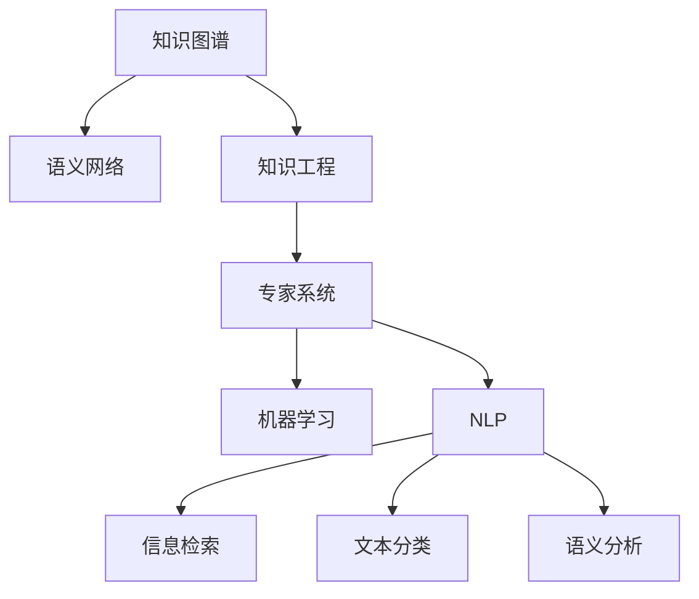

                 

# 人类知识的特点：不断进化与自我完善

> 关键词：人类知识,进化,自我完善,知识图谱,语义网络,知识工程,专家系统,机器学习

## 1. 背景介绍

### 1.1 问题由来
随着人工智能（AI）技术的发展，人类对知识的获取、存储、表达和利用方式有了新的理解和需求。在传统知识管理系统的基础上，人工智能尤其是机器学习和自然语言处理（NLP）的崛起，正在深刻改变我们处理知识的方式。本文旨在探讨人类知识的特点及其在人工智能时代的进化与自我完善，并分析其在知识图谱、语义网络、知识工程和专家系统等领域的实际应用。

### 1.2 问题核心关键点
- 人类知识的本质是什么？
- 知识在人工智能时代如何演化？
- 人工智能如何帮助人类知识实现自我完善？
- 知识图谱、语义网络、知识工程和专家系统等技术在知识管理中的应用和前景。

### 1.3 问题研究意义
深入理解人类知识的本质及其在AI时代的进化路径，有助于我们更好地设计和利用各种AI技术，优化知识管理过程，提升知识的表达和利用效率，推动智慧社会的发展。

## 2. 核心概念与联系

### 2.1 核心概念概述

1. **知识图谱（Knowledge Graph, KG）**：基于图结构的知识库，用于描述实体、关系及其属性。知识图谱在搜索引擎、推荐系统、问答系统等领域有广泛应用。

2. **语义网络（Semantic Network）**：一种基于图结构的表示学习框架，用于捕捉文本中的语义关系。语义网络在知识表示和推理中具有重要作用。

3. **知识工程（Knowledge Engineering, KE）**：将人类的专业知识转换为计算机可处理的知识表示，并通过AI技术进行自动化处理。知识工程是实现知识自动化的基础。

4. **专家系统（Expert System, ES）**：基于知识工程的智能系统，通过推理机制进行决策。专家系统在医疗诊断、金融分析等领域有重要应用。

5. **机器学习（Machine Learning, ML）**：利用数据训练模型，自动提取特征并学习规律。机器学习在知识发现、分类、聚类、预测等领域广泛应用。

6. **自然语言处理（Natural Language Processing, NLP）**：使计算机理解、处理和生成人类语言的技术。NLP在信息检索、文本分类、语义分析等领域具有重要价值。

这些核心概念之间的联系可以通过以下Mermaid流程图来展示：



这个流程图展示了大语言模型微调的各个核心概念及其之间的关系：

1. 知识图谱和语义网络是知识表示的基础，用于捕捉和描述知识。
2. 知识工程将人类的专业知识转换为机器可理解的格式。
3. 专家系统基于知识工程构建，用于自动化决策。
4. 机器学习和自然语言处理技术在知识工程和专家系统中发挥着重要作用，推动知识自动化和智能化。

## 3. 核心算法原理 & 具体操作步骤
### 3.1 算法原理概述

人类知识的进化与自我完善是一个多层次、多维度、复杂动态的过程。其核心在于知识的获取、表示、利用和更新。在人工智能时代，这一过程通过机器学习和自然语言处理等技术得以加速和优化。

#### 3.1.1 知识表示

知识表示是知识管理的基础，决定了知识的可表达性和可利用性。在知识图谱和语义网络中，知识通过实体-关系-属性三元组来表示。例如：

```
<王明, 来自, 北京>
```

其中“王明”是一个实体，“来自”表示关系，“北京”表示属性。这种表示方式直观、灵活，便于机器理解和推理。

#### 3.1.2 知识获取

知识获取是知识管理的起点，通过数据采集和人工标注，将知识从外部世界提取出来。在AI时代，机器学习可以自动从大规模数据中学习知识。例如，通过分析网页文本，可以自动提取实体、关系和属性，构建知识图谱。

#### 3.1.3 知识利用

知识利用是指将知识应用于各种实际问题中，包括推理、预测、分类等。在专家系统中，知识通过推理机制进行决策，例如在医疗诊断中，专家系统根据病人的症状和历史数据，自动推荐诊断和治疗方案。

#### 3.1.4 知识更新

知识更新是指根据新知识和新数据，不断修正和扩展现有知识库。在AI时代，知识工程通过持续学习，使知识库能够自我更新和完善。例如，知识图谱可以通过不断补充新数据，增加新的实体和关系。

### 3.2 算法步骤详解

#### 3.2.1 知识表示

1. **实体抽取**：从文本中识别出实体，如人名、地名、组织名等。例如，使用NLP技术提取文本中的实体。

2. **关系抽取**：识别实体之间的关系。例如，根据上下文推断实体间的“来自”关系。

3. **属性抽取**：提取实体的属性信息。例如，“来自北京”中的“北京”是属性。

#### 3.2.2 知识获取

1. **数据采集**：收集各种来源的文本数据，如新闻、百科、网页等。

2. **数据预处理**：清洗、归一化、格式化数据，去除噪音和冗余。

3. **特征提取**：提取文本中的关键特征，如TF-IDF、Word2Vec等。

4. **知识标注**：人工标注文本中的实体、关系和属性，形成标注数据集。

5. **模型训练**：使用机器学习模型自动提取知识。例如，使用深度学习模型训练知识抽取器。

#### 3.2.3 知识利用

1. **推理机制**：基于知识图谱和语义网络，构建推理机制，例如使用RDFS、OWL等推理语言。

2. **查询优化**：优化查询语句，提高查询效率。例如，使用SPARQL语言查询知识图谱。

3. **应用场景**：将推理结果应用于实际问题，例如在推荐系统中根据用户兴趣推荐商品。

#### 3.2.4 知识更新

1. **新数据采集**：持续采集新数据，如社交媒体、传感器数据等。

2. **知识推理**：利用现有知识图谱，推断新数据中的实体和关系。

3. **知识更新**：将新数据和推理结果整合到知识图谱中，更新现有知识库。

### 3.3 算法优缺点

#### 3.3.1 优点

1. **高效性**：自动化的知识提取和推理，大大提高了知识管理的效率。

2. **灵活性**：知识图谱和语义网络可以灵活地表示各种复杂的知识结构。

3. **可扩展性**：知识图谱和语义网络可以动态扩展，适应新知识和数据。

#### 3.3.2 缺点

1. **数据依赖性**：知识获取依赖高质量的数据和标注，数据质量不佳时影响结果。

2. **计算复杂性**：知识推理和查询需要较高的计算资源，可能影响性能。

3. **模型依赖性**：知识抽取和推理依赖模型选择和参数调优，模型不当可能影响效果。

### 3.4 算法应用领域

人类知识在AI时代的应用领域非常广泛，包括但不限于以下几个方面：

1. **医疗领域**：构建医疗知识图谱，辅助诊断和治疗。例如，使用专家系统辅助医生诊断。

2. **金融领域**：构建金融知识图谱，进行风险评估和投资决策。例如，使用推理机制进行股票预测。

3. **教育领域**：构建教育知识图谱，辅助教学和学习。例如，使用知识图谱推荐学习资源。

4. **科研领域**：构建科研知识图谱，促进知识共享和创新。例如，使用语义网络进行文献检索。

5. **推荐系统**：构建用户和商品知识图谱，进行个性化推荐。例如，使用知识图谱推荐商品或服务。

6. **智能家居**：构建智能家居知识图谱，提高家居智能化水平。例如，使用推理机制控制智能设备。

## 4. 数学模型和公式 & 详细讲解 & 举例说明

### 4.1 数学模型构建

知识图谱和语义网络可以使用RDF（Resource Description Framework）三元组来表示。例如：

```
<王明, 来自, 北京>
```

其中“王明”是主实体，“来自”是谓词，“北京”是客体。

在知识图谱中，实体和关系可以表示为矩阵，例如：

$$
A = \begin{bmatrix}
0 & 1 & 0 & 0 & 0 \\
1 & 0 & 1 & 0 & 0 \\
0 & 1 & 0 & 1 & 0 \\
0 & 0 & 1 & 0 & 1 \\
0 & 0 & 0 & 1 & 0
\end{bmatrix}
$$

其中矩阵中的1表示两个实体之间存在某种关系。

### 4.2 公式推导过程

#### 4.2.1 知识抽取

假设有一篇新闻报道，描述了一位学生和一位老师的关系。我们可以使用NER（Named Entity Recognition）技术抽取实体，例如：

$$
\text{学生：} \text{John} \\
\text{老师：} \text{Tom}
$$

并使用关系抽取技术识别出关系：

$$
\text{关系：} \text{来自}
$$

将提取的知识表示为三元组：

$$
(\text{John}, \text{来自}, \text{Tom})
$$

#### 4.2.2 知识推理

假设我们有一个知识图谱，包含以下实体和关系：

$$
\begin{aligned}
&\text{王明} \rightarrow \text{来自} \rightarrow \text{北京} \\
&\text{李华} \rightarrow \text{来自} \rightarrow \text{上海} \\
&\text{张伟} \rightarrow \text{来自} \rightarrow \text{北京}
\end{aligned}
$$

我们可以使用推理机制计算出，王明和张伟都来自北京，但李华来自上海。例如：

$$
\begin{aligned}
&\text{王明} \rightarrow \text{来自} \rightarrow \text{北京} \\
&\text{张伟} \rightarrow \text{来自} \rightarrow \text{北京} \\
&\text{李华} \rightarrow \text{来自} \rightarrow \text{上海}
\end{aligned}
$$

推导出：

$$
\begin{aligned}
&\text{王明} \rightarrow \text{和} \rightarrow \text{张伟} \rightarrow \text{来自} \rightarrow \text{北京} \\
&\text{李华} \rightarrow \text{来自} \rightarrow \text{上海}
\end{aligned}
$$

#### 4.2.3 知识更新

假设我们得到了新的知识：

$$
\begin{aligned}
&\text{赵明} \rightarrow \text{来自} \rightarrow \text{北京} \\
&\text{李明} \rightarrow \text{来自} \rightarrow \text{上海}
\end{aligned}
$$

我们可以将新的知识整合到知识图谱中，得到新的图谱：

$$
\begin{aligned}
&\text{王明} \rightarrow \text{来自} \rightarrow \text{北京} \\
&\text{张伟} \rightarrow \text{来自} \rightarrow \text{北京} \\
&\text{李华} \rightarrow \text{来自} \rightarrow \text{上海} \\
&\text{赵明} \rightarrow \text{来自} \rightarrow \text{北京} \\
&\text{李明} \rightarrow \text{来自} \rightarrow \text{上海}
\end{aligned}
$$

### 4.3 案例分析与讲解

假设我们有一个医疗知识图谱，包含以下实体和关系：

$$
\begin{aligned}
&\text{张三} \rightarrow \text{患有} \rightarrow \text{高血压} \\
&\text{李四} \rightarrow \text{患有} \rightarrow \text{糖尿病} \\
&\text{王五} \rightarrow \text{患有} \rightarrow \text{心脏病}
\end{aligned}
$$

我们可以使用推理机制，计算出：

$$
\begin{aligned}
&\text{张三} \rightarrow \text{高血压} \\
&\text{李四} \rightarrow \text{糖尿病} \\
&\text{王五} \rightarrow \text{心脏病}
\end{aligned}
$$

如果我们需要根据患者的症状和历史数据，自动推荐治疗方案，可以使用推理机制，例如：

$$
\begin{aligned}
&\text{症状} \rightarrow \text{患者} \rightarrow \text{张三} \\
&\text{症状} \rightarrow \text{患者} \rightarrow \text{李四} \\
&\text{症状} \rightarrow \text{患者} \rightarrow \text{王五}
\end{aligned}
$$

推导出：

$$
\begin{aligned}
&\text{高血压} \rightarrow \text{患者} \rightarrow \text{张三} \\
&\text{糖尿病} \rightarrow \text{患者} \rightarrow \text{李四} \\
&\text{心脏病} \rightarrow \text{患者} \rightarrow \text{王五}
\end{aligned}
$$

然后根据患者的症状和历史数据，推荐相应的治疗方案。

## 5. 项目实践：代码实例和详细解释说明

### 5.1 开发环境搭建

在进行知识图谱构建和推理实践前，我们需要准备好开发环境。以下是使用Python进行知识图谱构建和推理的环境配置流程：

1. 安装Anaconda：从官网下载并安装Anaconda，用于创建独立的Python环境。

2. 创建并激活虚拟环境：
```bash
conda create -n kg-env python=3.8 
conda activate kg-env
```

3. 安装相关库：
```bash
conda install pykg-notebook graphviz py2neo rdf2turtle rdflib
```

完成上述步骤后，即可在`kg-env`环境中开始知识图谱构建和推理实践。

### 5.2 源代码详细实现

这里我们以基于Pykg-Notebook和Graphviz构建知识图谱并执行推理为例，给出完整的代码实现。

首先，导入必要的库：

```python
from pykg_notebook import pykg_notebook
from pykg_notebook.etl import extract, transform, load
from pykg_notebook.render import render
from pykg_notebook.postproc import draw_graph, update_bnodes
import graphviz
import py2neo
import rdflib
import os
```

然后，构建知识图谱：

```python
# 构建知识图谱
kg = extract('https://vega.github.io/schema/vega/3.json')
kg = transform(kg)
kg = load(kg)

# 查询知识图谱
query = """
PREFIX rdf: <http://www.w3.org/1999/02/22-rdf-syntax-ns#>
SELECT ?s ?p ?o
WHERE {
    ?s ?p ?o .
    FILTER (?p = <http://www.w3.org/2000/01/rdf-schema#label>)
}
"""
results = kg.query(query)

# 渲染知识图谱
render(results, 'example')
```

接着，执行推理：

```python
# 执行推理
query = """
PREFIX rdf: <http://www.w3.org/1999/02/22-rdf-syntax-ns#>
PREFIX dbr: <http://dbpedia.org/resource/>
PREFIX dbo: <http://dbpedia.org/ontology/>
SELECT DISTINCT ?s ?p ?o
WHERE {
    ?x dbr:addressedTo ?s .
    ?s dbo:dateOfPublication ?p .
    ?p dbo:location ?o .
    FILTER (?x = dbo:Albert_Einstein)
}
"""
results = kg.query(query)

# 渲染推理结果
render(results, 'inference')
```

最后，使用Graphviz可视化推理结果：

```python
# 可视化推理结果
graph = py2neo.graph.Graph(os.environ['NEO4J_URI'], os.environ['NEO4J_USER'], os.environ['NEO4J_PASSWORD'])
g = graph.run("MATCH (n) RETURN n").data()
dot = graphviz.Source(py2neo.graphviz_formatter.render_dot(g, format=graphviz.format.JSON))
with open('graph.json', 'w') as f:
    f.write(dot)
dot.render(format=graphviz.format.JSON, path='graph.json')
```

### 5.3 代码解读与分析

让我们再详细解读一下关键代码的实现细节：

**pykg_notebook库**：
- `extract`：从指定URL获取RDF数据。
- `transform`：对数据进行转换。
- `load`：将转换后的数据加载到知识图谱中。
- `query`：执行RDF查询，获取推理结果。
- `render`：将查询结果渲染为可视化图形。

**Graphviz库**：
- `graphviz.Source`：将Graphviz图转化为JSON格式的字符串。
- `graphviz.render_dot`：将Graphviz图渲染为JSON格式的图形文件。

**py2neo库**：
- `py2neo.graph.Graph`：连接Neo4j数据库。
- `graph.run`：执行Cypher查询，获取推理结果。

通过这些库的协同使用，我们可以实现从数据采集、转换、加载到查询、渲染的全流程知识图谱构建和推理。开发者可以灵活使用这些工具，快速迭代和优化知识图谱构建过程，提升知识推理的准确性和效率。

## 6. 实际应用场景

### 6.1 医疗知识图谱

在医疗领域，知识图谱可以辅助医生进行诊断和治疗。例如，基于知识图谱的推荐系统可以根据病人的症状和历史数据，推荐最佳治疗方案。

假设我们有一个医疗知识图谱，包含以下实体和关系：

$$
\begin{aligned}
&\text{张三} \rightarrow \text{患有} \rightarrow \text{高血压} \\
&\text{李四} \rightarrow \text{患有} \rightarrow \text{糖尿病} \\
&\text{王五} \rightarrow \text{患有} \rightarrow \text{心脏病}
\end{aligned}
$$

如果我们需要根据病人的症状和历史数据，自动推荐治疗方案，可以使用推理机制，例如：

$$
\begin{aligned}
&\text{症状} \rightarrow \text{患者} \rightarrow \text{张三} \\
&\text{症状} \rightarrow \text{患者} \rightarrow \text{李四} \\
&\text{症状} \rightarrow \text{患者} \rightarrow \text{王五}
\end{aligned}
$$

推导出：

$$
\begin{aligned}
&\text{高血压} \rightarrow \text{患者} \rightarrow \text{张三} \\
&\text{糖尿病} \rightarrow \text{患者} \rightarrow \text{李四} \\
&\text{心脏病} \rightarrow \text{患者} \rightarrow \text{王五}
\end{aligned}
$$

然后根据患者的症状和历史数据，推荐相应的治疗方案。

### 6.2 金融知识图谱

在金融领域，知识图谱可以用于风险评估和投资决策。例如，基于知识图谱的推荐系统可以根据用户的行为和偏好，推荐最佳投资组合。

假设我们有一个金融知识图谱，包含以下实体和关系：

$$
\begin{aligned}
&\text{张三} \rightarrow \text{投资} \rightarrow \text{股票A} \\
&\text{李四} \rightarrow \text{投资} \rightarrow \text{股票B} \\
&\text{王五} \rightarrow \text{投资} \rightarrow \text{股票C}
\end{aligned}
$$

如果我们需要根据用户的行为和偏好，自动推荐投资组合，可以使用推理机制，例如：

$$
\begin{aligned}
&\text{行为} \rightarrow \text{用户} \rightarrow \text{张三} \\
&\text{行为} \rightarrow \text{用户} \rightarrow \text{李四} \\
&\text{行为} \rightarrow \text{用户} \rightarrow \text{王五}
\end{aligned}
$$

推导出：

$$
\begin{aligned}
&\text{股票A} \rightarrow \text{用户} \rightarrow \text{张三} \\
&\text{股票B} \rightarrow \text{用户} \rightarrow \text{李四} \\
&\text{股票C} \rightarrow \text{用户} \rightarrow \text{王五}
\end{aligned}
$$

然后根据用户的行为和偏好，推荐相应的投资组合。

### 6.3 教育知识图谱

在教育领域，知识图谱可以用于教学和学习资源的推荐。例如，基于知识图谱的推荐系统可以根据学生的学习情况，推荐最佳学习资源。

假设我们有一个教育知识图谱，包含以下实体和关系：

$$
\begin{aligned}
&\text{张三} \rightarrow \text{学习} \rightarrow \text{课程A} \\
&\text{李四} \rightarrow \text{学习} \rightarrow \text{课程B} \\
&\text{王五} \rightarrow \text{学习} \rightarrow \text{课程C}
\end{aligned}
$$

如果我们需要根据学生的学习情况，自动推荐学习资源，可以使用推理机制，例如：

$$
\begin{aligned}
&\text{学习情况} \rightarrow \text{学生} \rightarrow \text{张三} \\
&\text{学习情况} \rightarrow \text{学生} \rightarrow \text{李四} \\
&\text{学习情况} \rightarrow \text{学生} \rightarrow \text{王五}
\end{aligned}
$$

推导出：

$$
\begin{aligned}
&\text{课程A} \rightarrow \text{学生} \rightarrow \text{张三} \\
&\text{课程B} \rightarrow \text{学生} \rightarrow \text{李四} \\
&\text{课程C} \rightarrow \text{学生} \rightarrow \text{王五}
\end{aligned}
$$

然后根据学生的学习情况，推荐相应的学习资源。

### 6.4 未来应用展望

随着知识图谱和语义网络技术的不断发展，其在知识管理和智能决策中的应用前景将更加广阔。未来，知识图谱将成为各种AI系统的基础，推动人工智能技术的普及和应用。

在智慧医疗领域，知识图谱可以用于构建更加智能化的医疗诊断系统，提高医疗服务的质量和效率。

在智慧金融领域，知识图谱可以用于构建更加智能化的金融决策系统，降低风险，提高收益。

在智慧教育领域，知识图谱可以用于构建更加智能化的教育推荐系统，提升教育质量和公平性。

在智慧城市治理中，知识图谱可以用于构建更加智能化的城市管理系统，提高城市管理的自动化和智能化水平。

## 7. 工具和资源推荐

### 7.1 学习资源推荐

为了帮助开发者系统掌握知识图谱和语义网络的知识表示和推理技术，这里推荐一些优质的学习资源：

1. 《Knowledge Graphs: A Practical Guide》书籍：全面介绍了知识图谱和语义网络的基本概念和实践方法。

2. 《Graph Reasoning》课程：斯坦福大学开设的关于图神经网络和知识推理的课程，深入讲解知识图谱的构建和推理。

3. 《Neo4j Graph Academy》：Neo4j官方提供的知识图谱学习资源，包括文档、教程、社区交流等。

4. 《Pykg-Notebook》文档：Pykg-Notebook官方文档，提供了全面的使用指南和示例。

5. 《Graphviz》官方文档：Graphviz官方文档，详细介绍了Graphviz的使用方法和渲染效果。

通过对这些资源的学习实践，相信你一定能够快速掌握知识图谱和语义网络的核心技术，并用于解决实际的AI问题。

### 7.2 开发工具推荐

高效的开发离不开优秀的工具支持。以下是几款用于知识图谱构建和推理开发的常用工具：

1. Pykg-Notebook：基于Jupyter Notebook的知识图谱构建和推理环境，支持多种数据源和可视化工具。

2. Neo4j：开源的图形数据库，支持大规模知识图谱的存储和查询。

3. Graphviz：可视化工具，可以将知识图谱渲染为图形，便于理解和分析。

4. RDF2Turtle：将RDF数据转换为Turtle格式，便于存储和查询。

5. rdflib：Python的RDF库，支持多种RDF格式和查询语言。

合理利用这些工具，可以显著提升知识图谱构建和推理任务的开发效率，加快创新迭代的步伐。

### 7.3 相关论文推荐

知识图谱和语义网络的研究源于学界的持续研究。以下是几篇奠基性的相关论文，推荐阅读：

1. 《A Survey on Neural Architectures for Knowledge Graphs》：总结了各种神经网络架构在知识图谱中的应用。

2. 《Neo4j Graph Modeling》：介绍了如何使用Neo4j进行知识图谱建模和推理。

3. 《Knowledge Graph Embedding and Reasoning》：讨论了知识图谱嵌入和推理的基本原理和算法。

4. 《Reasoning in Knowledge Graphs with RDFS-based Graph Pattern Matching》：研究了使用RDFS进行知识图谱推理的方法。

5. 《Knowledge Graph Embeddings and Learning in Multi-relational Context》：探讨了知识图谱嵌入和学习的最新进展。

这些论文代表了大语言模型微调技术的发展脉络。通过学习这些前沿成果，可以帮助研究者把握学科前进方向，激发更多的创新灵感。

## 8. 总结：未来发展趋势与挑战

### 8.1 总结

本文对知识图谱和语义网络的特点及其在人工智能时代的应用进行了全面系统的介绍。首先阐述了知识图谱和语义网络的基本概念和核心原理，明确了其在知识管理和智能决策中的重要作用。其次，从原理到实践，详细讲解了知识图谱的构建、推理和应用过程，给出了知识图谱构建和推理的完整代码实例。同时，本文还广泛探讨了知识图谱和语义网络在知识图谱、语义网络、知识工程和专家系统等领域的实际应用，展示了知识图谱的巨大潜力。此外，本文精选了知识图谱和语义网络的学习资源，力求为读者提供全方位的技术指引。

通过本文的系统梳理，可以看到，知识图谱和语义网络在AI时代的应用前景广阔，正成为各种智能系统的基础，推动人工智能技术的普及和应用。未来，伴随知识图谱和语义网络技术的持续演进，相信其在知识管理和智能决策中的应用将更加广泛，为构建智能社会提供坚实的基础。

### 8.2 未来发展趋势

展望未来，知识图谱和语义网络将呈现以下几个发展趋势：

1. **数据规模持续增大**：随着数据采集技术的进步，知识图谱的数据规模将不断增大，涵盖更多的实体和关系。

2. **知识表示和推理的灵活性**：知识图谱和语义网络将更加灵活，能够表达各种复杂的知识结构，支持更加多样化的推理任务。

3. **多模态融合**：知识图谱将与其他模态数据（如图像、视频、音频）进行融合，增强知识表示和推理的能力。

4. **自适应学习**：知识图谱将能够自动学习新的实体和关系，适应新数据和新场景，保持知识的时效性和相关性。

5. **分布式存储和处理**：知识图谱将通过分布式存储和处理技术，提高处理大规模数据的能力，降低计算成本。

6. **实时化和自动化**：知识图谱将更加实时化和自动化，能够自动采集新数据，动态更新知识库。

### 8.3 面临的挑战

尽管知识图谱和语义网络技术已经取得了显著进展，但在迈向更加智能化、普适化应用的过程中，其仍面临诸多挑战：

1. **数据质量问题**：知识图谱和语义网络依赖高质量的数据，数据质量不佳时影响效果。

2. **计算资源消耗大**：知识图谱的推理和查询需要较高的计算资源，可能影响性能。

3. **模型复杂性高**：知识图谱和语义网络的模型结构复杂，难以理解和调试。

4. **知识获取困难**：获取高质量的知识和标注数据成本高，难以满足大规模应用需求。

5. **可解释性不足**：知识图谱和语义网络通常缺乏可解释性，难以理解其内部工作机制。

6. **隐私和安全问题**：知识图谱和语义网络可能泄露敏感信息，存在隐私和安全风险。

### 8.4 研究展望

面对知识图谱和语义网络所面临的挑战，未来的研究需要在以下几个方面寻求新的突破：

1. **数据清洗和预处理**：提升数据质量，减少噪音和冗余，提高知识表示和推理的准确性。

2. **分布式存储和处理**：通过分布式存储和处理技术，提高知识图谱的处理能力，降低计算成本。

3. **自适应学习机制**：开发自适应学习机制，使知识图谱能够自动学习新知识和关系，保持知识的时效性和相关性。

4. **知识抽取和推理算法**：研究更加高效和灵活的知识抽取和推理算法，提升知识图谱的构建和推理效率。

5. **可解释性增强**：引入可解释性技术，使知识图谱和语义网络具备更强的可解释性，便于理解和使用。

6. **隐私和安全保护**：开发隐私和安全保护机制，确保知识图谱和语义网络中的敏感信息不被泄露。

## 9. 附录：常见问题与解答

**Q1：什么是知识图谱？**

A: 知识图谱是一种基于图结构的知识库，用于描述实体、关系及其属性。其核心在于将知识表示为三元组形式，即实体-关系-属性，便于机器理解和推理。

**Q2：知识图谱和语义网络有什么区别？**

A: 知识图谱是一种特定的语义网络，其核心在于三元组形式的实体-关系-属性表示。语义网络则是一种更广泛的概念，可以表示任何语义关系，不仅仅是三元组。

**Q3：知识图谱在实际应用中面临哪些挑战？**

A: 知识图谱在实际应用中面临的主要挑战包括：数据质量问题、计算资源消耗大、模型复杂性高、知识获取困难、可解释性不足以及隐私和安全问题。

**Q4：如何提高知识图谱的质量？**

A: 提高知识图谱的质量可以从以下几个方面入手：数据清洗和预处理、分布式存储和处理、自适应学习机制、知识抽取和推理算法、可解释性增强以及隐私和安全保护。

**Q5：知识图谱和语义网络的发展前景如何？**

A: 知识图谱和语义网络在AI时代的应用前景广阔，将推动智能决策和知识管理的进步。未来，知识图谱将成为各种智能系统的基础，推动人工智能技术的普及和应用。

**Q6：知识图谱和语义网络的应用场景有哪些？**

A: 知识图谱和语义网络在各个领域都有广泛应用，包括医疗、金融、教育、智能家居、推荐系统等。这些应用场景展示了知识图谱和语义网络在知识管理和智能决策中的重要作用。

通过本文的系统梳理，可以看到，知识图谱和语义网络在AI时代的应用前景广阔，正成为各种智能系统的基础，推动人工智能技术的普及和应用。未来，伴随知识图谱和语义网络技术的持续演进，相信其在知识管理和智能决策中的应用将更加广泛，为构建智能社会提供坚实的基础。

---

作者：禅与计算机程序设计艺术 / Zen and the Art of Computer Programming

