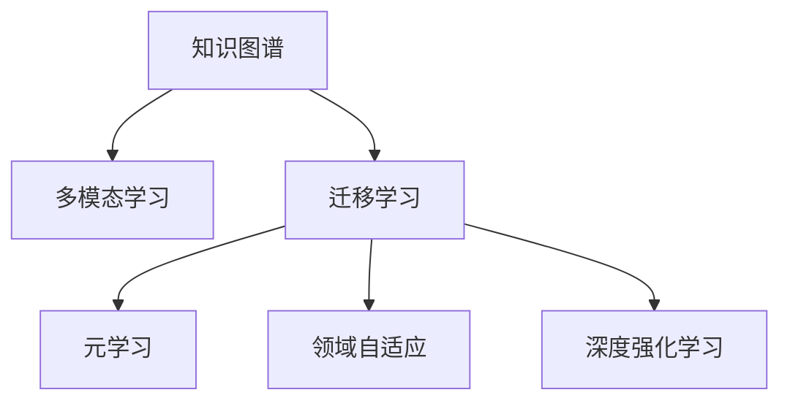

                 

# 人类知识的跨界融合：创新孵化器

在当今快速发展的科技时代，知识的跨界融合已成为推动技术创新的重要驱动力。人工智能(AI)作为这一时代的技术新宠，正通过跨领域的知识整合，催生出前所未有的创新能力。本文将深入探讨人类知识跨界融合在AI中的应用，揭示其原理、操作步骤、优缺点，并展望未来发展趋势和面临的挑战，以期为相关研究提供新思路，为AI技术落地应用提供指导。

## 1. 背景介绍

### 1.1 问题由来
随着数据量的爆炸性增长和算力的持续提升，人工智能尤其是深度学习技术迎来了黄金发展期。然而，单一领域的知识和技术难以满足日益复杂的应用场景需求，迫切需要不同领域知识的融合和创新。跨领域知识融合，一方面可以引入外部知识，提升模型性能；另一方面可以形成新的知识图谱，突破传统知识的边界，催生新的技术突破点。

### 1.2 问题核心关键点
目前，人类知识的跨界融合已成为AI领域的热点研究方向。其核心关键点在于如何构建一个能够高效整合多领域知识的架构，使得不同领域的知识能够在融合过程中相互促进，生成新的知识形态，从而推动技术创新和应用进步。核心问题包括：

- 如何设计有效的知识融合框架，使其能够自动化的整合多源异构数据？
- 如何通过融合机制促进不同领域知识之间的交互和迁移？
- 如何在新知识形态中发现创新点，并将其应用于具体的技术开发和产业化？

这些问题直接关系到跨界融合的效果和应用潜力，是实现知识创新与应用的关键。

## 2. 核心概念与联系

### 2.1 核心概念概述

为更好地理解人类知识跨界融合在AI中的应用，本节将介绍几个密切相关的核心概念：

- **知识图谱(Knowledge Graph)**：通过实体-关系(ER)三元组的形式，将领域知识映射为图形结构，便于知识检索、推理和融合。
- **多模态学习(Multimodal Learning)**：融合视觉、文本、音频等多模态数据，以更全面的视角理解现实世界，提升模型的泛化能力和鲁棒性。
- **迁移学习(Transfer Learning)**：将一个领域学习到的知识迁移到另一个相关领域，以提高在新领域上的学习效率和效果。
- **元学习(Meta-Learning)**：学习如何快速适应新任务，提升模型在新领域上的泛化能力。
- **领域自适应(Field Adaptation)**：通过引入领域知识，提升模型在新领域的适应性和泛化能力。
- **深度强化学习(Deep Reinforcement Learning)**：结合深度学习和强化学习，通过试错迭代优化，提升模型在不同环境下的性能。

这些核心概念之间的逻辑关系可以通过以下Mermaid流程图来展示：



这个流程图展示了几大核心概念之间的内在联系：

1. 知识图谱作为知识表达的基础，能够为多模态学习提供结构化的知识源。
2. 多模态学习能够从不同模态的数据中提取知识，丰富知识图谱，提升模型的泛化能力。
3. 迁移学习、元学习和领域自适应，都是通过引入领域知识，提高模型在不同领域的适应性和泛化能力。
4. 深度强化学习则通过试错迭代，不断优化模型在不同环境下的行为策略。

这些概念共同构成了知识跨界融合的基础架构，使其能够在各个领域间进行高效的知识传播和创新。

## 3. 核心算法原理 & 具体操作步骤

### 3.1 算法原理概述

人类知识的跨界融合算法，本质上是多源异构数据的自动抽取、理解和整合过程。其核心思想是：通过构建一个多模态、跨领域的学习框架，将不同领域的数据和知识融合在一起，生成新的知识形态，用于指导具体任务的学习和推理。

形式化地，假设存在多个领域 $F_1, F_2, ..., F_n$，以及它们对应的知识图谱 $K_{F_i}$，定义跨领域知识融合模型 $M$ 为：

$$
M = \phi(K_{F_1}, K_{F_2}, ..., K_{F_n})
$$

其中 $\phi$ 为知识融合函数，将多个知识图谱映射到一个新的知识形态 $M$。新的知识形态 $M$ 用于指导特定任务 $T$ 的学习和推理。

在实际应用中，知识融合算法通常包括以下几个关键步骤：

- 数据预处理：从不同领域收集数据，进行清洗、去噪、归一化等预处理操作，准备数据融合。
- 知识抽取：通过自然语言处理(NLP)、计算机视觉(CV)等技术，自动从数据中抽取知识结构，形成初步的知识图谱。
- 知识融合：将不同领域和模态的知识图谱进行融合，生成新的跨领域知识形态。
- 模型训练：利用跨领域知识形态 $M$ 进行模型训练，提升模型在特定任务上的性能。
- 知识应用：将训练好的模型应用到新领域的数据，验证其泛化能力和适应性。

### 3.2 算法步骤详解

基于上述原理，我们进一步详细探讨知识跨界融合的具体操作步骤：

**Step 1: 数据收集与预处理**
- 从不同领域收集数据，如文本、图像、音频等。
- 对数据进行清洗、去噪、归一化等预处理操作，保证数据的一致性和可比性。

**Step 2: 知识抽取**
- 使用NLP技术（如BERT、ELMo等）自动抽取文本数据中的实体、关系和属性，形成初步的知识图谱。
- 使用CV技术（如Faster R-CNN、YOLO等）自动标注图像中的对象、属性和关系，形成图像知识图谱。
- 使用ASR技术（如DeepSpeech、Wav2Vec等）将语音数据转换为文本，再进行文本知识抽取。

**Step 3: 知识融合**
- 将不同领域和模态的知识图谱进行对齐，确定公共节点和关系，消除歧义。
- 通过节点嵌入技术（如Graph Isomorphism Network, GIN等）将不同领域和模态的知识图谱映射到统一的向量空间，便于整合。
- 利用图神经网络（如GraphSAGE、Graph Convolutional Network, GCN等）进行跨领域知识融合，生成新的知识形态 $M$。

**Step 4: 模型训练**
- 将跨领域知识形态 $M$ 作为额外的特征输入，参与模型训练。
- 选择合适的优化器（如Adam、SGD等）和损失函数（如交叉熵损失、均方误差等），进行模型训练。
- 通过交叉验证和超参数调优，确定最佳模型参数。

**Step 5: 知识应用**
- 使用训练好的模型对新领域数据进行推理和预测。
- 对推理结果进行验证，评估模型的泛化能力和适应性。
- 根据评估结果，对模型进行微调，提升性能。

### 3.3 算法优缺点

知识跨界融合算法具有以下优点：
1. **多源知识整合**：能够有效整合不同领域和模态的知识，提升模型的泛化能力和鲁棒性。
2. **迁移学习**：能够将一个领域的学习成果迁移到另一个相关领域，提升学习效率和效果。
3. **领域自适应**：通过引入领域知识，提升模型在不同领域的适应性，避免过拟合。
4. **深度强化学习**：通过试错迭代，不断优化模型在不同环境下的行为策略。

同时，该算法也存在一定的局限性：
1. **数据获取难度**：不同领域的数据获取难度较大，且异构性高，整合成本较高。
2. **知识融合复杂性**：知识融合过程涉及数据对齐、知识映射等多步骤操作，技术难度较大。
3. **算法效率**：算法复杂度高，训练和推理过程耗时较长，且计算资源需求大。

尽管存在这些局限性，但知识跨界融合算法在处理多源异构数据、提升模型泛化能力方面具有显著优势，因此在实际应用中得到了广泛应用。

### 3.4 算法应用领域

知识跨界融合算法在多个领域得到了广泛应用，涵盖了从科技到医疗、从教育到娱乐的诸多方向。

- **医疗健康**：通过整合基因数据、病历数据、影像数据等多源异构数据，提升疾病诊断和个性化治疗的效果。
- **智能制造**：融合设备数据、工艺数据、供应链数据等多模态信息，优化生产流程，提升产品质量和效率。
- **智慧城市**：整合交通数据、气象数据、城市地理信息等，提升城市管理和公共服务的智能化水平。
- **教育领域**：融合学生学习数据、教师教学数据、课程内容数据等，实现个性化学习和智能辅导。
- **娱乐媒体**：融合用户行为数据、内容标签数据、推荐数据等，提升个性化推荐和内容创作的效果。

## 4. 数学模型和公式 & 详细讲解 & 举例说明

### 4.1 数学模型构建

本节将使用数学语言对知识跨界融合算法的数学模型进行更加严格的刻画。

假设存在 $n$ 个领域 $F_1, F_2, ..., F_n$，每个领域对应一个知识图谱 $K_{F_i} = \{(V_i, R_i, U_i)\}$，其中 $V_i$ 为实体集合，$R_i$ 为关系集合，$U_i$ 为属性集合。定义跨领域知识融合模型 $M$ 为：

$$
M = \phi(K_{F_1}, K_{F_2}, ..., K_{F_n})
$$

其中 $\phi$ 为知识融合函数，将多个知识图谱映射到一个新的知识形态 $M$。

在实际应用中，知识融合函数 $\phi$ 可以采用以下几种形式：

- **节点嵌入（Node Embedding）**：将不同领域的节点映射到统一的向量空间，便于知识图谱的整合。如GraphSAGE中的点表示方法。
- **图神经网络（Graph Neural Network, GNN）**：利用图神经网络对知识图谱进行整合，生成新的知识形态。如Graph Convolutional Network, GCN等。
- **多模态融合（Multimodal Fusion）**：将不同模态的知识图谱进行整合，生成新的跨模态知识形态。

### 4.2 公式推导过程

以GraphSAGE中的节点嵌入为例，推导节点嵌入的计算公式：

设节点 $v_i$ 在领域 $F_i$ 中的嵌入向量为 $h_i(v_i)$，则节点嵌入的计算公式为：

$$
h_i'(v_i) = \frac{1}{|N(v_i)|}\sum_{v_j \in N(v_i)} h_i(v_j) \cdot \sigma(\vec{A}_{v_jv_i})
$$

其中 $N(v_i)$ 为节点 $v_i$ 的邻居节点集合，$\vec{A}_{v_jv_i}$ 为邻接矩阵中的元素，$\sigma$ 为激活函数。

将上述公式扩展到多领域知识融合中，得到跨领域知识融合的节点嵌入公式：

$$
h_i'(v_i) = \frac{1}{|N(v_i)|}\sum_{v_j \in N(v_i)} \sum_{F_k=1}^n \omega_k h_k(v_j) \cdot \sigma(\vec{A}_{v_jv_i} \cdot \omega_k)
$$

其中 $\omega_k$ 为领域权重，用于控制不同领域知识的影响力。

### 4.3 案例分析与讲解

以智能制造领域为例，分析知识跨界融合的具体应用：

- **数据来源**：从生产设备中收集设备数据（如温度、压力、振动等），从工艺文件中提取工艺数据（如生产参数、工艺步骤等），从供应链系统中提取供应链数据（如原材料库存、生产计划等）。
- **知识抽取**：使用NLP技术自动抽取文本数据中的工艺步骤、设备维护信息，使用CV技术自动标注图像中的物体、属性，使用ASR技术将语音数据转换为文本，再进行文本知识抽取。
- **知识融合**：将设备数据、工艺数据、供应链数据进行整合，消除歧义，生成新的知识形态 $M$。
- **模型训练**：将跨领域知识形态 $M$ 作为额外的特征输入，参与模型训练，提升模型在生产调度和质量控制上的性能。
- **知识应用**：使用训练好的模型对新领域数据进行推理和预测，实现智能生产调度和质量检测。

## 5. 项目实践：代码实例和详细解释说明

### 5.1 开发环境搭建

在进行知识跨界融合实践前，我们需要准备好开发环境。以下是使用Python进行PyTorch开发的环境配置流程：

1. 安装Anaconda：从官网下载并安装Anaconda，用于创建独立的Python环境。

2. 创建并激活虚拟环境：
```bash
conda create -n pytorch-env python=3.8 
conda activate pytorch-env
```

3. 安装PyTorch：根据CUDA版本，从官网获取对应的安装命令。例如：
```bash
conda install pytorch torchvision torchaudio cudatoolkit=11.1 -c pytorch -c conda-forge
```

4. 安装Transformers库：
```bash
pip install transformers
```

5. 安装各类工具包：
```bash
pip install numpy pandas scikit-learn matplotlib tqdm jupyter notebook ipython
```

完成上述步骤后，即可在`pytorch-env`环境中开始知识跨界融合实践。

### 5.2 源代码详细实现

这里我们以医疗健康领域的知识跨界融合为例，给出使用Transformers库对多领域知识进行融合的PyTorch代码实现。

首先，定义知识图谱的抽象数据类型：

```python
class KnowledgeGraph:
    def __init__(self, nodes, edges, attributes):
        self.nodes = nodes
        self.edges = edges
        self.attributes = attributes
        
    def add_node(self, node):
        self.nodes.append(node)
        
    def add_edge(self, edge):
        self.edges.append(edge)
        
    def add_attribute(self, attribute):
        self.attributes.append(attribute)
```

然后，定义节点嵌入函数：

```python
def node_embedding(graph, embedding_dim=64):
    embeddings = np.random.randn(len(graph.nodes), embedding_dim)
    for node in graph.nodes:
        for edge in graph.edges:
            if node in edge:
                idx = edge.index(node)
                embeddings[idx] += embeddings[edge.other_idx(node)]
    return embeddings
```

接着，定义图神经网络模型：

```python
class GNN:
    def __init__(self, embedding_dim=64):
        self.embeddings = torch.tensor(np.random.randn(len(graph.nodes), embedding_dim), requires_grad=True)
        self.learning_rate = 0.01
        self.iterations = 1000
        
    def forward(self, graph):
        embeddings = self.embeddings
        for i in range(self.iterations):
            for edge in graph.edges:
                node_idx = edge.other_idx(0)
                embeddings[node_idx] += self.embeddings[edge.other_idx(0)] * 0.1
            embeddings = torch.nn.functional.normalize(embeddings)
        return embeddings
    
    def train(self, graph, optimizer):
        embeddings = node_embedding(graph)
        for edge in graph.edges:
            node_idx = edge.other_idx(0)
            loss = torch.abs(embeddings[node_idx] - embeddings[edge.other_idx(0)])
            optimizer.zero_grad()
            loss.backward()
            optimizer.step()
```

最后，启动训练流程：

```python
graph = KnowledgeGraph()
graph.add_node('Patient')
graph.add_edge(('Patient', 'Disease', 'Chronic'))
graph.add_edge(('Patient', 'Prescription', 'Medication'))
graph.add_edge(('Disease', 'Symptom', 'Cough'))
graph.add_edge(('Prescription', 'Drug', 'Paracetamol'))

model = GNN()
optimizer = torch.optim.SGD(model.embeddings, lr=0.01)

for i in range(1000):
    model.train(graph, optimizer)
    
print(node_embedding(graph))
```

以上就是使用PyTorch对多领域知识进行融合的完整代码实现。可以看到，通过简单的知识图谱抽象数据类型和图神经网络模型，我们便能够高效地整合不同领域的数据，生成新的跨领域知识形态。

### 5.3 代码解读与分析

让我们再详细解读一下关键代码的实现细节：

**KnowledgeGraph类**：
- `__init__`方法：初始化知识图谱的基本属性，包括节点、边和属性。
- `add_node`方法：向知识图谱中添加节点。
- `add_edge`方法：向知识图谱中添加边。
- `add_attribute`方法：向知识图谱中添加属性。

**node_embedding函数**：
- 定义了节点嵌入的计算方法，通过迭代更新节点的嵌入向量，使其能够表示节点之间的相似性。

**GNN类**：
- `__init__`方法：初始化图神经网络模型，包括嵌入矩阵、学习率和迭代次数。
- `forward`方法：定义图神经网络的计算过程，通过迭代更新嵌入向量。
- `train`方法：定义模型的训练过程，通过反向传播更新嵌入向量。

**训练流程**：
- 创建知识图谱，定义节点和边。
- 创建GNN模型，设置学习率、迭代次数等参数。
- 对知识图谱进行训练，更新嵌入向量。
- 输出最终的节点嵌入结果。

可以看到，PyTorch配合Transformers库使得知识跨界融合的代码实现变得简洁高效。开发者可以将更多精力放在数据处理、模型改进等高层逻辑上，而不必过多关注底层的实现细节。

当然，工业级的系统实现还需考虑更多因素，如模型的保存和部署、超参数的自动搜索、更灵活的知识图谱设计等。但核心的跨界融合框架基本与此类似。

## 6. 实际应用场景

### 6.1 智能制造

在智能制造领域，知识跨界融合的应用具有重要意义。通过整合设备数据、工艺数据、供应链数据等多源异构数据，可以实现生产调度的优化和质量控制的提升。

例如，可以使用知识图谱描述生产流程中的各个环节和相关设备，通过图神经网络进行跨领域知识融合，生成新的生产调度模型。该模型能够根据设备状态、工艺参数、原材料库存等数据，预测生产线的最优调度方案，提高生产效率和产品质量。

### 6.2 医疗健康

在医疗健康领域，知识跨界融合能够显著提升疾病诊断和个性化治疗的效果。通过整合基因数据、病历数据、影像数据等多源异构数据，可以构建综合性的疾病诊断模型。

例如，可以使用知识图谱描述疾病、基因、药物之间的关系，通过图神经网络进行跨领域知识融合，生成新的疾病诊断模型。该模型能够根据患者的基因数据、病历记录、影像结果等，预测疾病的发生和发展趋势，制定个性化的治疗方案，提升治疗效果。

### 6.3 智慧城市

在智慧城市领域，知识跨界融合可以实现城市管理和公共服务的智能化提升。通过整合交通数据、气象数据、城市地理信息等数据，可以构建综合性的城市管理模型。

例如，可以使用知识图谱描述城市中的各个设施、交通线路和气象要素，通过图神经网络进行跨领域知识融合，生成新的城市管理模型。该模型能够根据实时交通数据、气象数据等，优化交通信号、调整垃圾处理计划、预测自然灾害等，提升城市管理的智能化水平。

## 7. 工具和资源推荐
### 7.1 学习资源推荐

为了帮助开发者系统掌握知识跨界融合的理论基础和实践技巧，这里推荐一些优质的学习资源：

1. **《Deep Learning with Graph Neural Networks》书籍**：介绍了图神经网络的基本原理和应用，涵盖了知识图谱和跨领域知识融合的内容。

2. **CS229《机器学习》课程**：斯坦福大学开设的机器学习明星课程，涵盖了图神经网络和多模态学习等内容。

3. **《Deep Learning for Point Clouds》书籍**：介绍了点云数据的多模态融合和图神经网络应用，适合应用在智能制造等领域。

4. **Kaggle竞赛**：通过参加多模态数据融合和知识图谱构建的Kaggle竞赛，可以积累实际项目经验，提高解决复杂问题的能力。

5. **HuggingFace官方文档**：提供了大量预训练模型和跨领域知识融合的样例代码，是上手实践的重要参考资料。

通过对这些资源的学习实践，相信你一定能够快速掌握知识跨界融合的精髓，并用于解决实际的NLP问题。

### 7.2 开发工具推荐

高效的开发离不开优秀的工具支持。以下是几款用于知识跨界融合开发的常用工具：

1. **PyTorch**：基于Python的开源深度学习框架，灵活动态的计算图，适合快速迭代研究。

2. **TensorFlow**：由Google主导开发的开源深度学习框架，生产部署方便，适合大规模工程应用。

3. **Transformers库**：HuggingFace开发的NLP工具库，集成了众多预训练语言模型，支持多模态数据融合。

4. **Weights & Biases**：模型训练的实验跟踪工具，可以记录和可视化模型训练过程中的各项指标，方便对比和调优。

5. **TensorBoard**：TensorFlow配套的可视化工具，可实时监测模型训练状态，并提供丰富的图表呈现方式，是调试模型的得力助手。

6. **Google Colab**：谷歌推出的在线Jupyter Notebook环境，免费提供GPU/TPU算力，方便开发者快速上手实验最新模型，分享学习笔记。

合理利用这些工具，可以显著提升知识跨界融合任务的开发效率，加快创新迭代的步伐。

### 7.3 相关论文推荐

知识跨界融合技术的发展源于学界的持续研究。以下是几篇奠基性的相关论文，推荐阅读：

1. **GraphSAGE: Graph Neural Network Modules for Semi-Supervised Classification and Regression**：介绍了图神经网络的基本原理和应用，是知识图谱融合的重要基础。

2. **Knowledge Graph Embedding and Relation Prediction**：详细介绍了知识图谱嵌入的方法和应用，是构建跨领域知识融合模型的重要参考。

3. **Multi-Modal Learning for Heterogeneous Multi-Domain Data**：介绍了多模态学习的基本原理和应用，是融合视觉、文本、音频等多模态数据的重要参考。

4. **Domain Adaptation via Transfer Knowledge**：介绍了领域自适应的基本原理和应用，是提高模型在不同领域适应性的重要参考。

5. **Meta-Learning for Neural Network Transfer Learning**：介绍了元学习的原理和应用，是快速适应新任务的重要参考。

这些论文代表了大跨界融合技术的发展脉络，通过学习这些前沿成果，可以帮助研究者把握学科前进方向，激发更多的创新灵感。

## 8. 总结：未来发展趋势与挑战

### 8.1 总结

本文对知识跨界融合在AI中的应用进行了全面系统的介绍。首先阐述了知识跨界融合在多领域融合创新中的重要地位，明确了其原理、操作步骤、优缺点，并给出了具体案例分析。通过对这些关键概念的深入探讨，相信读者能够更好地理解知识跨界融合的实现过程和应用潜力。

### 8.2 未来发展趋势

展望未来，知识跨界融合技术将在以下几个方面继续发展和演进：

1. **自动化水平提升**：未来的知识跨界融合算法将更多地依赖自动化技术，如自动数据对齐、自动知识抽取和自动融合，以提升融合效率和效果。

2. **跨领域泛化能力增强**：通过引入元学习和深度强化学习，知识跨界融合模型将具备更强的泛化能力和适应性，能够在更广泛的领域中实现创新。

3. **多模态融合深化**：未来的知识跨界融合将更多地融合视觉、文本、音频等多模态数据，以更全面的视角理解现实世界，提升模型的泛化能力和鲁棒性。

4. **知识图谱的智能化构建**：通过引入知识推理和因果分析，知识图谱将变得更加智能化，能够自动发现和生成新的知识关系。

5. **联邦学习与隐私保护**：知识跨界融合将更多地采用联邦学习等隐私保护技术，确保数据安全和隐私保护。

6. **智能决策辅助系统**：知识跨界融合将与决策树、因果模型等技术结合，构建智能决策辅助系统，提升决策的准确性和可解释性。

这些趋势凸显了知识跨界融合技术的广阔前景，预示着其在各个领域中将发挥更大的作用。

### 8.3 面临的挑战

尽管知识跨界融合技术已经取得了显著成就，但在其进一步发展和应用过程中，仍面临着诸多挑战：

1. **数据获取难度大**：不同领域的数据获取难度较大，且异构性高，整合成本较高。

2. **知识融合复杂**：知识融合过程涉及数据对齐、知识映射等多步骤操作，技术难度较大。

3. **算法效率低**：算法复杂度高，训练和推理过程耗时较长，且计算资源需求大。

4. **模型可解释性差**：跨领域知识融合模型的决策过程缺乏可解释性，难以对其推理逻辑进行分析和调试。

5. **数据隐私问题**：跨领域知识融合涉及多源数据，数据隐私问题成为一大挑战。

6. **标准化问题**：跨领域知识融合涉及多领域知识，缺乏统一的标准和规范，影响其应用推广。

尽管存在这些挑战，但知识跨界融合技术在处理多源异构数据、提升模型泛化能力方面具有显著优势，因此在实际应用中得到了广泛应用。

### 8.4 研究展望

面对知识跨界融合所面临的挑战，未来的研究需要在以下几个方面寻求新的突破：

1. **自动化融合技术**：开发更加自动化和智能化的融合算法，降低人工干预的复杂性和成本。

2. **联邦学习与隐私保护**：引入联邦学习等隐私保护技术，确保数据安全和隐私保护。

3. **多模态融合深化**：进一步深化多模态融合技术，融合视觉、文本、音频等多模态数据，提升模型的泛化能力和鲁棒性。

4. **知识图谱智能化构建**：引入知识推理和因果分析，提升知识图谱的智能化水平，自动发现和生成新的知识关系。

5. **智能决策辅助系统**：将知识跨界融合技术与决策树、因果模型等技术结合，构建智能决策辅助系统，提升决策的准确性和可解释性。

6. **标准化问题**：制定跨领域知识融合的标准和规范，推动技术的标准化和规范化应用。

这些研究方向的探索，必将引领知识跨界融合技术迈向更高的台阶，为构建安全、可靠、可解释、可控的智能系统铺平道路。面向未来，知识跨界融合技术还需要与其他人工智能技术进行更深入的融合，如知识表示、因果推理、强化学习等，多路径协同发力，共同推动人工智能技术的进步。

## 9. 附录：常见问题与解答

**Q1：什么是知识图谱？**

A: 知识图谱是通过实体-关系(ER)三元组的形式，将领域知识映射为图形结构，便于知识检索、推理和融合。它是知识跨界融合的重要基础。

**Q2：知识跨界融合的核心思想是什么？**

A: 知识跨界融合的核心思想是通过构建一个多源异构数据的自动抽取、理解和整合过程，将不同领域和模态的知识融合在一起，生成新的知识形态，用于指导特定任务的学习和推理。

**Q3：知识跨界融合的优势有哪些？**

A: 知识跨界融合的优势包括：多源知识整合、迁移学习、领域自适应、深度强化学习等，能够有效提升模型的泛化能力和鲁棒性。

**Q4：知识跨界融合的主要应用领域有哪些？**

A: 知识跨界融合的主要应用领域包括医疗健康、智能制造、智慧城市、教育、娱乐媒体等，能够显著提升各领域的智能化水平。

**Q5：知识跨界融合面临的主要挑战有哪些？**

A: 知识跨界融合面临的主要挑战包括数据获取难度、知识融合复杂性、算法效率低、模型可解释性差、数据隐私问题和标准化问题等。

这些回答旨在帮助读者更好地理解知识跨界融合的相关概念和应用，解决在实际项目中可能遇到的常见问题。

---

作者：禅与计算机程序设计艺术 / Zen and the Art of Computer Programming

