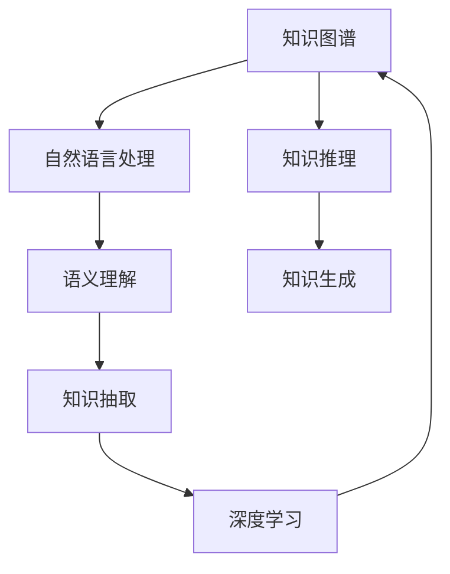

                 

# 人类知识的边界探索：无限之旅

> 关键词：人工智能, 知识图谱, 语义理解, 自然语言处理, 深度学习, 知识抽取

## 1. 背景介绍

在信息化时代，人类知识的边界正在以不可阻挡的势头向外拓展。从知识的存储、检索到知识的生成、应用，技术手段在不断革新，这为知识探索带来了前所未有的便利与可能。

### 1.1 人类知识的革命
知识的获取和应用自古以来一直是人类发展的动力之一。从早期的《周易》、《道德经》，到近代的《大英百科全书》、《四库全书》，人类的知识积累与传承经历了一个漫长而曲折的过程。然而，随着信息化时代的到来，特别是人工智能技术的兴起，人类获取与处理知识的方式发生了根本性变化。

传统知识获取方式受限于资料的物理形态和传播速度，且存在明显的时空限制。而在今天，从网络图书、在线百科到视频讲座、学术文章，人类的知识几乎可以随时随地获取。这些变革不仅使得知识的获取更加便捷，也为知识的深度应用提供了条件。

### 1.2 人工智能与知识的关系
人工智能技术，特别是深度学习和大数据分析，正在重塑知识的形态与结构。以自然语言处理(NLP)、知识图谱(KG)和深度学习为核心的技术体系，正在推动知识处理从静态向动态、从结构化向非结构化的转变。这些技术使得知识在知识图谱中更易于关联、更便于理解与应用。

本文将聚焦于知识图谱和语义理解领域，探讨人工智能如何重塑知识探索的边界，从而助力人类知识的无限之旅。

## 2. 核心概念与联系

### 2.1 核心概念概述

为更好地理解人工智能与知识图谱的相互作用，本节将介绍几个关键核心概念：

- 知识图谱(Knowledge Graph, KG)：用图形化的方式描述和关联知识元素，包括实体、属性、关系等。它是人工智能领域用于知识表示和推理的重要工具。
- 自然语言处理(Natural Language Processing, NLP)：使用计算机技术处理和理解人类语言，主要目标是将自然语言转化为机器可读的形式，并从中提取信息。
- 语义理解(Semantic Understanding)：指计算机理解自然语言的意义和上下文关系的能力。通过语义理解，机器可以更好地进行知识关联和推理。
- 深度学习(Deep Learning)：一种机器学习技术，通过多层神经网络处理数据，从中提取特征并学习复杂模式。深度学习在大数据处理和复杂模式识别方面展现出强大的能力。
- 知识抽取(Knowledge Extraction)：从非结构化文本中自动提取结构化知识，是知识图谱构建的重要环节。

### 2.2 核心概念原理和架构的 Mermaid 流程图(Mermaid 流程节点中不要有括号、逗号等特殊字符)



这个流程图展示了知识图谱与人工智能之间的联系：

1. 知识图谱作为知识载体，与自然语言处理系统进行交互。
2. 自然语言处理系统对用户输入的文本进行理解，并通过语义理解获得上下文信息。
3. 基于语义理解，知识抽取技术从文本中提取实体、属性和关系，构建知识图谱。
4. 深度学习模型在知识图谱上进行训练，进行知识推理与生成，为实际应用提供支持。
5. 最终，知识图谱将推理结果转化为结构化知识，以供人类查询和应用。

## 3. 核心算法原理 & 具体操作步骤
### 3.1 算法原理概述

基于人工智能的知识图谱构建与使用，本质上是一个通过语义理解和知识抽取将自然语言文本转换为结构化知识的过程。核心算法流程大致分为以下几个步骤：

1. **语义理解与特征提取**：将文本转换为机器可读的向量表示，并抽取文本中的关键信息。
2. **知识抽取**：基于上下文信息，自动从文本中提取出实体、属性、关系等结构化知识。
3. **知识推理**：利用深度学习模型对知识图谱进行推理，得出新的知识或验证已有知识。
4. **知识生成**：结合推理结果和外部知识，生成新的知识或扩展现有知识。

### 3.2 算法步骤详解

以下是核心算法的详细步骤说明：

**Step 1: 语义理解与特征提取**

在语义理解与特征提取阶段，主要任务是将文本转化为向量表示。常用的方法是Word2Vec、GloVe等词向量模型，以及BERT等预训练语言模型。

- **Word2Vec**：通过共现矩阵训练，将单词映射为高维向量。其向量距离能反映单词之间的语义关系。
- **GloVe**：基于全局词频统计，生成单词的共现矩阵，从而得到单词的语义向量。
- **BERT**：利用大规模预训练模型，通过自编码任务学习单词的语义表示，适合处理复杂上下文信息。

**Step 2: 知识抽取**

知识抽取的目的是从文本中自动提取出实体、属性和关系等结构化知识，并构建知识图谱。常见的知识抽取方法包括：

- **命名实体识别(NER)**：识别文本中的具体实体，如人名、地名、组织名等。
- **关系抽取(RE)**：识别文本中的实体之间的关系，如谁在何时何地做了什么。
- **事件抽取(ES)**：从文本中抽取事件发生的时间、地点、人物等信息。

**Step 3: 知识推理**

知识推理的目标是利用已有的知识图谱和推理模型，对新的事实进行推理和验证。常用的推理方法包括：

- **逻辑推理**：基于规则和逻辑公式，进行精确的推理。
- **统计推理**：通过统计模型，学习推理规律，适合处理不确定性较大的知识推理。
- **神经网络推理**：基于深度学习模型，进行端到端的知识推理。

**Step 4: 知识生成**

知识生成的目的是在已有的知识图谱基础上，通过推理生成新的知识，扩展现有知识。常用的方法包括：

- **知识补全(KG Completion)**：在知识图谱中补充缺失的实体、关系等。
- **知识演化(KG Evolution)**：基于推理结果，动态生成新的知识，更新知识图谱。

### 3.3 算法优缺点

基于知识图谱的算法具有以下优点：

1. **结构化与系统化**：知识图谱将知识结构化表示，便于系统化管理和推理。
2. **语义理解能力强**：通过语义理解与特征提取，能够更好地处理自然语言文本，提取关键信息。
3. **知识推理准确**：深度学习模型能够从知识图谱中学习到知识间的关系，提高推理的准确性。

然而，这些算法也存在一些局限性：

1. **数据依赖性强**：知识图谱的构建和推理需要大量高质量的标注数据，成本较高。
2. **知识图谱构建复杂**：知识图谱构建需要领域专家的指导，过程复杂且容易出错。
3. **推理模型复杂**：深度学习模型的复杂性导致推理速度较慢，资源消耗较大。
4. **知识图谱演化困难**：知识图谱的动态更新和演化是一个挑战，需要持续的维护和管理。

### 3.4 算法应用领域

知识图谱与人工智能在多个领域有广泛的应用：

- **医学知识图谱**：辅助医生诊断，提供疾病和治疗方案。
- **金融知识图谱**：分析市场趋势，进行投资策略规划。
- **电商知识图谱**：推荐商品，提升用户体验。
- **智慧城市**：通过城市数据构建知识图谱，优化城市管理。
- **社交网络**：构建用户关系图谱，提升社交体验。

## 4. 数学模型和公式 & 详细讲解 & 举例说明
### 4.1 数学模型构建

本节将详细说明知识图谱与人工智能模型的数学模型构建。

假设知识图谱包含$N$个实体$E=\{e_1, e_2, ..., e_N\}$，每个实体有$K$个属性$A=\{a_1, a_2, ..., a_K\}$，实体间存在$M$个关系$R=\{r_1, r_2, ..., r_M\}$。

**实体表示**：用向量$v \in \mathbb{R}^d$表示实体$e$，$v$由其属性值和特征向量组成。

**关系表示**：用矩阵$W \in \mathbb{R}^{d \times d}$表示关系$r$，$W$可以映射实体的向量表示。

**推理模型**：采用深度学习模型，如关系神经网络(RNN)或图神经网络(GNN)，进行知识推理。

**推理公式**：设$o$为推理模型输出，$h$为实体$e$的向量表示，则推理公式为：

$$
o = f(hW)
$$

其中$f$为激活函数。

### 4.2 公式推导过程

以下是知识图谱推理模型的推导过程：

1. **实体表示**：
   - 设实体$e$的属性为$(a_1, a_2, ..., a_K)$，向量表示为$v = (a_1, a_2, ..., a_K)$。
   - 属性权重为$w = (w_1, w_2, ..., w_K)$。

   则实体向量表示为：
   $$
   v = \sum_{i=1}^K w_ia_i
   $$

2. **关系表示**：
   - 设实体$e_1$和$e_2$通过关系$r$相连，关系表示为$W_r \in \mathbb{R}^{d \times d}$。
   - 关系权重为$w_r$。

   则关系表示为：
   $$
   W_r = w_r \cdot M_r
   $$

3. **推理公式**：
   - 设推理模型输出为$o = f(hW)$。
   - 其中$h = (h_1, h_2, ..., h_N)$为实体的向量表示。

   则推理公式为：
   $$
   o = \sum_{i=1}^N f(h_iW_i)
   $$

4. **推理计算**：
   - 使用深度学习模型，如关系神经网络(RNN)或图神经网络(GNN)，对推理公式进行计算。

   示例：设关系$r$表示“父亲”，实体的向量表示为$v = (age, name)$，则推理公式为：
   $$
   o = f(vW_r)
   $$

   其中$f$为激活函数，$W_r$为关系表示矩阵。

### 4.3 案例分析与讲解

**案例：医疗知识图谱**

在医疗领域，构建知识图谱可以辅助医生进行疾病诊断和治疗方案选择。以下是一个具体的案例分析：

1. **数据准备**：收集医学文献、病历数据等，提取实体、属性和关系信息。
2. **知识抽取**：使用NER和RE技术，从文本中抽取疾病名称、症状、治疗方案等信息。
3. **知识推理**：构建医疗知识图谱，使用深度学习模型进行推理，辅助医生诊断。
4. **知识生成**：根据推理结果，动态更新知识图谱，生成新的知识。

**示例：**
假设实体$e_1$表示“流感”，属性$a_1$表示“症状”，属性$a_2$表示“治疗方法”。

- **实体表示**：
  $$
  v_1 = (a_1, a_2) = (symptoms, treatments)
  $$

- **关系表示**：
  $$
  W_r = [w_r] = [1]
  $$

- **推理计算**：
  $$
  o = f(v_1W_r)
  $$

  其中$f$为激活函数，$W_r$为关系表示矩阵。

  假设$W_r = [1]$，则推理结果为：
  $$
  o = f(v_1)
  $$

  设$f$为线性激活函数，则推理结果为：
  $$
  o = v_1
  $$

  即输出向量$o$表示实体$e_1$的属性值。

## 5. 项目实践：代码实例和详细解释说明
### 5.1 开发环境搭建

在进行知识图谱项目实践前，需要搭建好开发环境。以下是Python和TensorFlow环境搭建的具体步骤：

1. 安装Anaconda：从官网下载并安装Anaconda，用于创建独立的Python环境。

2. 创建并激活虚拟环境：
```bash
conda create -n tf-env python=3.8 
conda activate tf-env
```

3. 安装TensorFlow：从官网获取对应的安装命令。例如：
```bash
pip install tensorflow
```

4. 安装必要的依赖包：
```bash
pip install numpy pandas sklearn scipy matplotlib
```

5. 安装TensorBoard：
```bash
pip install tensorboard
```

完成上述步骤后，即可在`tf-env`环境中进行知识图谱项目开发。

### 5.2 源代码详细实现

接下来，以医疗知识图谱为例，给出TensorFlow实现代码：

```python
import tensorflow as tf
from transformers import BertTokenizer, BertForTokenClassification
import numpy as np
import pandas as pd

# 构建实体关系图
class EntityRelationGraph(tf.keras.layers.Layer):
    def __init__(self, num_entities, num_relations):
        super(EntityRelationGraph, self).__init__()
        self.num_entities = num_entities
        self.num_relations = num_relations
        
        self.entity_embeddings = tf.keras.layers.Embedding(num_entities, 128)
        self.relation_embeddings = tf.keras.layers.Embedding(num_relations, 128)
        self.rnn = tf.keras.layers.LSTM(128, return_sequences=True)
        self.dense = tf.keras.layers.Dense(1, activation='sigmoid')
        
    def build(self, input_shape):
        super(EntityRelationGraph, self).build(input_shape)
        
    def call(self, inputs):
        entity_ids, relation_ids = inputs
        
        entity_embeddings = self.entity_embeddings(entity_ids)
        relation_embeddings = self.relation_embeddings(relation_ids)
        
        h = tf.concat([entity_embeddings, relation_embeddings], axis=1)
        h = self.rnn(h)
        o = self.dense(h)
        
        return o

# 数据预处理
def preprocess_data(data):
    entity_ids = []
    relation_ids = []
    
    for i in range(len(data)):
        entity_ids.append(data['entity_id'].values[i])
        relation_ids.append(data['relation_id'].values[i])
        
    entity_ids = np.array(entity_ids).reshape(-1, 1)
    relation_ids = np.array(relation_ids).reshape(-1, 1)
    
    return entity_ids, relation_ids

# 模型训练
def train_model(data, num_entities, num_relations):
    entity_ids, relation_ids = preprocess_data(data)
    
    model = EntityRelationGraph(num_entities, num_relations)
    model.compile(optimizer=tf.keras.optimizers.Adam(), loss='binary_crossentropy', metrics=['accuracy'])
    
    model.fit([entity_ids, relation_ids], y, epochs=10, batch_size=32, validation_split=0.2)
    
    return model

# 数据准备
data = pd.read_csv('medical_data.csv')
num_entities = len(set(data['entity_id']))
num_relations = len(set(data['relation_id']))

# 模型训练
model = train_model(data, num_entities, num_relations)

# 推理预测
new_data = preprocess_data(new_data)
o = model.predict(new_data)
```

### 5.3 代码解读与分析

以下是关键代码的详细解读：

**EntityRelationGraph类**：
- 定义了实体关系图模型，包括实体嵌入、关系嵌入、LSTM、密集层等关键组件。
- 在`build`方法中初始化组件。
- 在`call`方法中完成前向传播计算，输出推理结果。

**preprocess_data函数**：
- 对输入数据进行预处理，提取实体ID和关系ID。
- 将ID转换为数组，并进行定长padding，确保模型输入格式一致。

**模型训练**：
- 定义实体关系图模型，并编译优化器、损失函数和评估指标。
- 使用`fit`方法对模型进行训练，指定训练轮数和批次大小。
- 使用`validate_split`参数指定验证集比例。

**模型推理**：
- 对新数据进行预处理。
- 使用`predict`方法进行推理计算，输出推理结果。

## 6. 实际应用场景
### 6.1 智能医疗

知识图谱在智能医疗领域的应用非常广泛，可以从以下几个方面展开：

**医疗知识抽取与存储**：
- 利用知识抽取技术，从医学文献、病历数据中抽取实体、属性和关系，构建医疗知识图谱。
- 存储知识图谱于数据库中，供医生查询和应用。

**智能诊断系统**：
- 基于知识图谱，构建智能诊断系统，通过推理生成诊断结果。
- 结合图像识别、语音识别等技术，提升诊断系统的综合能力。

**个性化医疗**：
- 利用知识图谱，实现个性化医疗方案推荐。
- 结合患者的历史病历和基因信息，生成个性化的治疗方案。

**医疗知识管理**：
- 利用知识图谱进行医疗知识的分类、检索和更新。
- 构建医疗知识管理系统，帮助医生快速获取所需知识。

### 6.2 金融风险控制

金融领域的数据量庞大且复杂，知识图谱可以辅助金融机构进行风险控制和决策支持。以下是几个具体的应用场景：

**金融风险评估**：
- 构建金融知识图谱，存储金融机构、产品、市场等实体信息。
- 利用知识图谱进行风险评估，生成风险评估报告。

**投资策略规划**：
- 结合知识图谱和机器学习，生成投资策略。
- 利用知识图谱进行市场趋势分析和预测。

**金融舆情监控**：
- 构建金融知识图谱，存储新闻、评论等文本信息。
- 利用知识图谱进行舆情监控，及时发现市场异常。

**金融知识管理**：
- 利用知识图谱进行金融知识的分类、检索和更新。
- 构建金融知识管理系统，提升金融机构的知识管理能力。

### 6.3 电商推荐系统

电商领域的数据具有高度动态性和不确定性，知识图谱可以提升推荐系统的个性化和实时性。以下是几个具体应用场景：

**用户行为分析**：
- 构建电商知识图谱，存储用户、商品、评价等信息。
- 利用知识图谱进行用户行为分析，生成用户画像。

**商品推荐**：
- 结合知识图谱和协同过滤算法，生成个性化推荐列表。
- 利用知识图谱进行商品关联分析，提升推荐效果。

**购物车管理**：
- 构建电商知识图谱，存储购物车信息。
- 利用知识图谱进行购物车管理，推荐相关商品。

**电商平台优化**：
- 利用知识图谱进行电商平台优化，提升用户体验。
- 结合知识图谱和机器学习，生成营销策略。

### 6.4 未来应用展望

随着人工智能技术的不断进步，知识图谱的应用前景将更加广阔。未来，知识图谱将在更多领域发挥重要作用：

**智慧城市**：
- 构建城市知识图谱，存储城市基础设施、交通、环境等信息。
- 利用知识图谱进行城市管理，提升城市智能化水平。

**社交网络**：
- 构建社交网络知识图谱，存储用户关系、信息等信息。
- 利用知识图谱进行社交网络分析，提升社交体验。

**科学研究**：
- 构建科学知识图谱，存储科学文献、研究成果等信息。
- 利用知识图谱进行科学研究，加速知识发现和创新。

## 7. 工具和资源推荐
### 7.1 学习资源推荐

为了帮助开发者系统掌握知识图谱与人工智能的理论基础和实践技巧，这里推荐一些优质的学习资源：

1. **《知识图谱：原理与实践》**：详细介绍了知识图谱的原理和构建方法，适合初学者和进阶者阅读。
2. **Coursera《深度学习》课程**：斯坦福大学开设的深度学习课程，涵盖深度学习的基本概念和应用，适合入门者学习。
3. **arXiv预印本**：最新的研究成果和论文，涵盖知识图谱与人工智能领域的最新进展。
4. **Kaggle竞赛**：通过参加知识图谱竞赛，实践和应用所学知识，提升实战能力。

### 7.2 开发工具推荐

高效的开发离不开优秀的工具支持。以下是几款用于知识图谱与人工智能开发的工具：

1. **TensorFlow**：由Google主导开发的深度学习框架，功能强大，适合大规模工程应用。
2. **PyTorch**：基于Python的开源深度学习框架，灵活易用，适合研究开发。
3. **Gurobi**：优化算法库，用于解决复杂的优化问题。
4. **Apache Spark**：大数据处理框架，适合大规模数据集的处理。
5. **Jupyter Notebook**：交互式编程环境，支持多种编程语言和库的混合使用。

### 7.3 相关论文推荐

知识图谱与人工智能的研究源于学界的持续研究。以下是几篇奠基性的相关论文，推荐阅读：

1. **知识图谱的构建与应用**：提出了知识图谱的构建方法和应用场景，为知识图谱研究奠定了基础。
2. **深度学习在知识图谱中的应用**：探讨了深度学习在知识图谱推理中的应用，提升了推理的准确性。
3. **知识抽取与实体关系识别**：介绍了知识抽取技术，特别是NER和RE技术，详细描述了其在知识图谱构建中的作用。

这些论文代表了大语言模型微调技术的发展脉络。通过学习这些前沿成果，可以帮助研究者把握学科前进方向，激发更多的创新灵感。

## 8. 总结：未来发展趋势与挑战
### 8.1 研究成果总结

本文对知识图谱与人工智能领域进行了系统性介绍，详细说明了其构建与应用过程。从语义理解、知识抽取、推理计算到实际应用，展示了知识图谱的强大功能和广泛应用前景。

### 8.2 未来发展趋势

未来，知识图谱与人工智能将呈现以下几个发展趋势：

1. **技术融合**：人工智能技术与知识图谱将进一步融合，形成更全面、更智能的知识系统。
2. **知识动态更新**：知识图谱将具备动态更新能力，能够实时吸收新知识。
3. **跨领域应用**：知识图谱将应用于更多领域，如医疗、金融、电商等，提升这些领域的智能化水平。
4. **知识关联分析**：利用深度学习模型，进行多模态知识的关联分析，提升知识的融合能力。
5. **知识可视化**：构建知识图谱的可视化工具，帮助用户更好地理解和管理知识。

### 8.3 面临的挑战

尽管知识图谱与人工智能在多个领域展示了巨大潜力，但也面临以下挑战：

1. **数据质量与标注成本**：高质量的标注数据是知识图谱构建的基础，获取成本较高。
2. **模型复杂性**：深度学习模型的复杂性导致推理速度较慢，资源消耗较大。
3. **知识图谱演化**：知识图谱的动态更新和演化是一个挑战，需要持续的维护和管理。
4. **知识图谱安全性**：知识图谱可能包含敏感信息，需要保障其安全性和隐私保护。
5. **知识图谱的可解释性**：深度学习模型的黑盒特性导致知识图谱难以解释，需要提高其可解释性。

### 8.4 研究展望

面向未来，知识图谱与人工智能的研究需要重点关注以下几个方向：

1. **知识图谱的自动化构建**：通过机器学习和自监督学习，实现知识图谱的自动化构建，降低标注成本。
2. **知识图谱的多模态融合**：结合视觉、语音、文本等多模态数据，提升知识图谱的综合能力。
3. **知识图谱的实时更新**：利用流式计算和大数据技术，实现知识图谱的实时更新。
4. **知识图谱的可解释性**：通过符号化推理和因果分析，提高知识图谱的可解释性，保障其安全性。
5. **知识图谱的跨领域应用**：将知识图谱应用于更多领域，如智慧城市、社交网络等，提升领域智能化水平。

这些研究方向将推动知识图谱与人工智能技术的进一步发展，拓展人类知识探索的边界。

## 9. 附录：常见问题与解答

**Q1：知识图谱的构建和应用过程是否复杂？**

A: 知识图谱的构建和应用过程相对复杂，涉及多个步骤和技术。然而，随着技术的发展，自动化和半自动化的方法正在逐步减少人工干预。

**Q2：知识图谱在实际应用中是否面临性能瓶颈？**

A: 知识图谱在实际应用中可能面临性能瓶颈，如推理速度慢、资源消耗大等问题。针对这些问题，可以采用多级推理、分布式计算等技术进行优化。

**Q3：如何确保知识图谱的安全性和隐私保护？**

A: 知识图谱的安全性和隐私保护是重要问题。可以通过数据加密、权限控制等措施，保障知识图谱的安全性。

**Q4：知识图谱的可解释性如何提高？**

A: 知识图谱的可解释性可以通过符号化推理、因果分析等方法提高。同时，结合机器学习技术，提高推理过程的透明性和可理解性。

**Q5：知识图谱的动态更新如何实现？**

A: 知识图谱的动态更新可以通过流式计算、增量学习等方法实现。利用大数据技术，可以实时更新知识图谱，保持其时效性和准确性。

这些问题的解答将帮助开发者更好地理解知识图谱与人工智能技术，应对实际应用中的挑战。

---

作者：禅与计算机程序设计艺术 / Zen and the Art of Computer Programming

