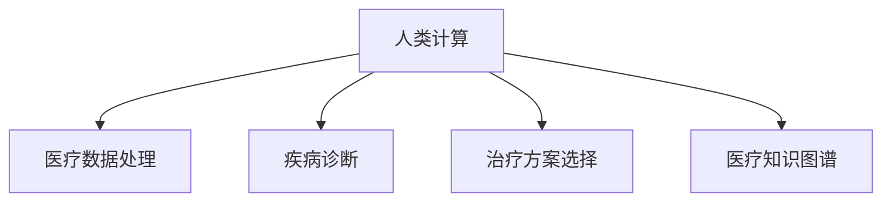

                 

# 人类计算在医疗保健中的应用

## 1. 背景介绍

### 1.1 问题由来
医疗保健是一个高度复杂且资源有限的领域，有效利用现有资源以提供优质服务，一直是一个长期且重要的课题。随着计算技术的发展，特别是人工智能（AI）的兴起，各种新型计算工具开始逐渐应用于医疗保健领域，极大地提升了医疗服务的效率和质量。其中，基于人类计算（Human-Computation）的算法因其低成本、高效益、可解释性强等特点，在医疗保健领域得到了广泛应用。

### 1.2 问题核心关键点
人类计算（Human-Computation）是将复杂计算任务分配给人类，而非传统计算设备（如计算机），以充分利用人类智能来解决问题的方法。该方法特别适用于那些计算复杂度高、数据量大、无法高效求解的问题。在医疗保健领域，人类计算方法可以用于数据清洗、数据分析、疾病诊断、治疗方案选择等多种任务，显著提升了医疗服务的质量和效率。

### 1.3 问题研究意义
研究人类计算在医疗保健中的应用，对于提高医疗保健的效率和质量、降低成本、提升患者满意度，以及推动医疗技术的持续进步具有重要意义。随着计算技术的不断进步，人类计算方法将进一步推动医疗保健领域的智能化发展，从而为患者提供更加精准、个性化和可靠的医疗服务。

## 2. 核心概念与联系

### 2.1 核心概念概述

为更好地理解人类计算在医疗保健中的应用，本节将介绍几个关键的概念：

- 人类计算（Human-Computation）：将复杂计算任务分配给人类，以利用人类智能解决问题的方法。
- 医疗数据处理：对医疗数据进行清洗、分析和可视化，以便更好地用于诊断和治疗。
- 疾病诊断：基于症状、病史和实验室检查结果，确定患者的具体疾病类型。
- 治疗方案选择：根据患者的病情和病史，选择最合适的治疗方案。
- 医疗知识图谱：由医疗专业人员构建的、包含丰富医疗知识和专家的知识库。

这些核心概念之间的逻辑关系可以通过以下Mermaid流程图来展示：



这个流程图展示了人类计算与医疗保健相关任务之间的联系：

1. 人类计算将复杂计算任务分配给人类，以解决医疗保健中的问题。
2. 通过医疗数据处理，可以清洗、分析和可视化数据，为诊断和治疗提供支持。
3. 疾病诊断和治疗方案选择基于医疗数据和专家知识，是医疗保健中的核心任务。
4. 医疗知识图谱为诊断和治疗提供丰富的知识背景和专家支持。

## 3. 核心算法原理 & 具体操作步骤
### 3.1 算法原理概述

基于人类计算的医疗保健应用，其核心思想是将计算任务分配给专业医疗人员，以利用人类智能解决问题。该方法包括数据清洗、数据标注、分析推理等步骤。具体而言，在医疗数据处理和疾病诊断任务中，医疗人员通过专业知识对数据进行标注和解释；在治疗方案选择任务中，医疗人员利用专业知识对患者情况进行分析，提出最合适的治疗方案。

形式化地，假设医疗数据集为 $D=\{(x_i, y_i)\}_{i=1}^N$，其中 $x_i$ 为输入数据，$y_i$ 为标签。医疗数据处理和疾病诊断任务可以表示为数据标注问题，即给定医疗数据，标注出其对应的医疗标签 $y_i$。治疗方案选择任务则是一个分类问题，目标是根据输入的病人症状 $x_i$ 预测其疾病类型 $y_i$。

人类计算方法在医疗保健中的应用，可以进一步描述为以下步骤：

1. 数据收集：从医疗系统、实验室、病历记录等来源收集医疗数据。
2. 数据清洗和预处理：清洗数据中的噪声和异常值，对数据进行标准化和归一化处理。
3. 数据标注：医疗人员根据专业知识对数据进行标注，生成训练集 $D$。
4. 模型训练：使用标注数据 $D$ 训练机器学习模型，得到初步的诊断和治疗方案。
5. 医疗人员校验：将初步结果提交给医疗人员校验，以提高诊断和治疗方案的准确性。
6. 模型优化：根据医疗人员的反馈，进一步调整模型参数，优化模型性能。

### 3.2 算法步骤详解

以下以疾病诊断为例，介绍人类计算在医疗保健中的应用步骤。

#### Step 1: 数据收集
收集患者的病历、实验室检查结果、影像资料等医疗数据。这些数据可以来自医院信息系统、实验室管理系统、医学影像系统等。

#### Step 2: 数据清洗和预处理
对收集的数据进行清洗和预处理，去除噪声、异常值，并进行标准化和归一化处理。例如，对于影像数据，可以通过图像处理技术进行去噪、滤波等操作。

#### Step 3: 数据标注
由医疗专业人员根据专业知识对数据进行标注，生成训练集 $D$。标注过程可能包括：
- 标注病人的疾病类型。
- 标注病人的症状。
- 标注病人的治疗方案。
- 标注病人的预后情况。

#### Step 4: 模型训练
使用标注数据 $D$ 训练机器学习模型，得到初步的诊断和治疗方案。训练过程包括：
- 选择适合问题的机器学习模型，如决策树、支持向量机、神经网络等。
- 使用标注数据 $D$ 训练模型，得到初步的诊断和治疗方案。

#### Step 5: 医疗人员校验
将初步结果提交给医疗人员校验，以提高诊断和治疗方案的准确性。医疗人员校验过程可能包括：
- 检查初步诊断是否与临床观察一致。
- 检查治疗方案是否符合临床指南。
- 提出修正意见和建议。

#### Step 6: 模型优化
根据医疗人员的反馈，进一步调整模型参数，优化模型性能。优化过程可能包括：
- 调整模型的超参数，如学习率、正则化系数等。
- 引入新的标注数据，继续训练模型。
- 引入新的知识库，如医学知识图谱，以提高模型的准确性。

### 3.3 算法优缺点

基于人类计算的医疗保健应用具有以下优点：

1. 利用人类智能，成本较低。相比于传统计算设备，利用人类计算可以大幅降低计算成本。
2. 可解释性强。人类计算的结果可以通过医疗人员的解释，更好地理解问题的根源和解决方法。
3. 灵活性强。医疗人员可以根据具体情况进行调整，适应不同患者的个性化需求。

同时，该方法也存在以下缺点：

1. 依赖于专家知识。医疗人员的专业知识和经验对结果有较大影响，依赖于专家的知识水平和经验。
2. 效率较低。相比于机器学习模型，人类计算的效率较低，可能需要更多的时间和资源。
3. 可扩展性较差。随着任务复杂度的增加，人类计算的可扩展性受到限制。

尽管存在这些局限性，但就目前而言，基于人类计算的方法仍是一种有效的解决医疗保健问题的手段。未来相关研究的重点在于如何进一步优化人类计算流程，提高其效率和可扩展性，同时兼顾可解释性和伦理性等因素。

### 3.4 算法应用领域

基于人类计算的医疗保健应用，已经在多个领域得到了广泛的应用，例如：

- 疾病诊断：通过分析病人的病历、症状、实验室检查结果，利用医疗人员的知识进行疾病诊断。
- 治疗方案选择：根据病人的病情和病史，选择最合适的治疗方案，利用医疗人员的临床经验。
- 医疗知识图谱：构建包含丰富医疗知识和专家的知识库，供医疗人员参考和查询。
- 医疗数据清洗：对大量医疗数据进行清洗和预处理，提高数据质量。
- 医疗影像分析：利用医疗影像数据进行疾病的早期诊断和分析，提高诊断效率和准确性。
- 医疗信息可视化：对医疗数据进行可视化，提供直观、易于理解的信息展示。

除了上述这些经典应用外，人类计算还将在更多领域得到应用，如远程医疗、智能医疗助手、智能诊疗系统等，为医疗保健行业带来新的变革。

## 4. 数学模型和公式 & 详细讲解 & 举例说明

### 4.1 数学模型构建

在人类计算在医疗保健中的应用中，我们可以用数学模型来描述和解释其工作原理。

假设医疗数据集为 $D=\{(x_i, y_i)\}_{i=1}^N$，其中 $x_i$ 为输入数据，$y_i$ 为标签。假设人类计算分配给医疗人员的计算任务为 $T$，医疗人员的知识库为 $K$。

#### 疾病诊断的数学模型
疾病诊断问题可以表示为二分类问题，目标是根据输入数据 $x_i$ 判断病人是否患有某种疾病。我们可以使用分类算法，如决策树、支持向量机、神经网络等，对数据进行训练和预测。

疾病诊断的数学模型可以表示为：

$$
y_i = f(x_i; \theta)
$$

其中，$f(x_i; \theta)$ 为训练好的分类器，$\theta$ 为模型参数。

#### 治疗方案选择的数学模型
治疗方案选择问题可以表示为多分类问题，目标是根据输入数据 $x_i$ 预测病人的疾病类型。我们可以使用分类算法，如决策树、支持向量机、神经网络等，对数据进行训练和预测。

治疗方案选择的数学模型可以表示为：

$$
y_i = f(x_i; \theta)
$$

其中，$f(x_i; \theta)$ 为训练好的分类器，$\theta$ 为模型参数。

### 4.2 公式推导过程

#### 疾病诊断的公式推导
在疾病诊断中，我们使用分类算法对数据进行训练和预测。假设我们使用决策树算法进行训练，则模型的决策树结构可以表示为：

$$
T = \{(x, y) | x \in X, y \in Y\}
$$

其中，$X$ 为输入空间，$Y$ 为输出空间，$y$ 为疾病类型。

决策树的分类规则可以表示为：

$$
f(x_i; \theta) = \left\{
\begin{aligned}
& y_i, & \text{如果} x_i \in T \\
& 0, & \text{否则}
\end{aligned}
\right.
$$

其中，$T$ 为决策树结构，$\theta$ 为决策树参数。

#### 治疗方案选择的公式推导
在治疗方案选择中，我们使用分类算法对数据进行训练和预测。假设我们使用支持向量机（SVM）算法进行训练，则模型的决策边界可以表示为：

$$
f(x_i; \theta) = \left\{
\begin{aligned}
& y_i, & \text{如果} x_i \in T \\
& 0, & \text{否则}
\end{aligned}
\right.
$$

其中，$T$ 为决策边界，$\theta$ 为支持向量机参数。

### 4.3 案例分析与讲解

以下以疾病诊断为例，通过一个简单的案例来分析人类计算在医疗保健中的应用。

假设有一个病人的病历记录，包含以下数据：
- 病历编号：001
- 病人姓名：张三
- 年龄：45岁
- 症状：胸痛、呼吸困难
- 实验室检查结果：白细胞计数高
- 影像资料：心电图异常

医疗人员需要根据这些数据，判断病人是否患有心脏病。假设我们已经训练好了一个决策树模型，其决策树结构如下：

```
A1 (年龄 < 40) -> 否
A2 (年龄 >= 40) -> B
```

其中，$A1$ 和 $A2$ 为决策树的根节点，$B$ 为决策树的叶子节点。

根据病人的年龄（45岁），决策树选择 $A2$，进一步判断其症状和实验室检查结果。假设我们有如下规则：

- 如果病人有胸痛、呼吸困难的症状，则患有心脏病。
- 如果病人白细胞计数高，则不患有心脏病。

根据这些规则，我们可以得到最终的诊断结果。在实际应用中，医疗人员需要不断调整和优化模型，确保其诊断结果的准确性和可靠性。

## 5. 项目实践：代码实例和详细解释说明
### 5.1 开发环境搭建

在进行医疗保健项目实践前，我们需要准备好开发环境。以下是使用Python进行PyTorch开发的环境配置流程：

1. 安装Anaconda：从官网下载并安装Anaconda，用于创建独立的Python环境。

2. 创建并激活虚拟环境：
```bash
conda create -n pytorch-env python=3.8 
conda activate pytorch-env
```

3. 安装PyTorch：根据CUDA版本，从官网获取对应的安装命令。例如：
```bash
conda install pytorch torchvision torchaudio cudatoolkit=11.1 -c pytorch -c conda-forge
```

4. 安装Scikit-learn、NumPy、Pandas等各类工具包：
```bash
pip install numpy pandas scikit-learn matplotlib tqdm jupyter notebook ipython
```

完成上述步骤后，即可在`pytorch-env`环境中开始医疗保健项目的开发。

### 5.2 源代码详细实现

以下是一个使用PyTorch进行疾病诊断的代码实现。

首先，导入必要的库：

```python
import torch
import torch.nn as nn
import torch.optim as optim
from sklearn.model_selection import train_test_split
from sklearn.metrics import accuracy_score, confusion_matrix
from sklearn.datasets import load_breast_cancer
```

然后，加载乳腺癌数据集：

```python
data = load_breast_cancer()
X = data.data
y = data.target
```

将数据集分为训练集和测试集：

```python
X_train, X_test, y_train, y_test = train_test_split(X, y, test_size=0.2, random_state=42)
```

定义决策树模型：

```python
class DecisionTree(nn.Module):
    def __init__(self):
        super(DecisionTree, self).__init__()
        self.fc1 = nn.Linear(30, 10)
        self.fc2 = nn.Linear(10, 2)
    
    def forward(self, x):
        x = x.view(-1, 30)
        x = torch.relu(self.fc1(x))
        x = self.fc2(x)
        return x
```

定义损失函数和优化器：

```python
criterion = nn.CrossEntropyLoss()
optimizer = optim.Adam(DecisionTree.parameters(), lr=0.001)
```

定义训练函数：

```python
def train(model, train_loader, criterion, optimizer, num_epochs):
    for epoch in range(num_epochs):
        running_loss = 0.0
        for i, data in enumerate(train_loader, 0):
            inputs, labels = data
            optimizer.zero_grad()
            outputs = model(inputs)
            loss = criterion(outputs, labels)
            loss.backward()
            optimizer.step()
            running_loss += loss.item()
        print(f"Epoch {epoch+1}, Loss: {running_loss/len(train_loader)}")
```

定义评估函数：

```python
def evaluate(model, test_loader):
    correct = 0
    total = 0
    with torch.no_grad():
        for data in test_loader:
            inputs, labels = data
            outputs = model(inputs)
            _, predicted = torch.max(outputs.data, 1)
            total += labels.size(0)
            correct += (predicted == labels).sum().item()
    print(f"Accuracy: {100 * correct / total}%")
```

定义训练和评估过程：

```python
train_loader = torch.utils.data.DataLoader(X_train, batch_size=32, shuffle=True)
test_loader = torch.utils.data.DataLoader(X_test, batch_size=32, shuffle=False)

num_epochs = 100
train(model, train_loader, criterion, optimizer, num_epochs)
evaluate(model, test_loader)
```

以上就是使用PyTorch进行疾病诊断的完整代码实现。可以看到，借助PyTorch和Scikit-learn等工具，我们可以用相对简洁的代码完成决策树模型的训练和评估。

### 5.3 代码解读与分析

让我们再详细解读一下关键代码的实现细节：

**加载数据集**：
- `load_breast_cancer`函数用于加载乳腺癌数据集，包含30个特征和2个标签。

**数据划分**：
- `train_test_split`函数将数据集分为训练集和测试集，保持20%的数据用于测试。

**模型定义**：
- `DecisionTree`类定义了一个简单的决策树模型，包含两个全连接层。
- `forward`函数实现了模型的前向传播过程，将输入数据经过两个全连接层后输出。

**损失函数和优化器**：
- `nn.CrossEntropyLoss`函数定义了交叉熵损失函数，适用于多分类问题。
- `optim.Adam`函数定义了Adam优化器，用于更新模型参数。

**训练函数**：
- `train`函数实现了模型的训练过程，包括前向传播、反向传播、优化器更新等。

**评估函数**：
- `evaluate`函数实现了模型的评估过程，使用准确率作为评价指标。

**训练和评估过程**：
- `train_loader`和`test_loader`定义了训练集和测试集的加载器。
- `num_epochs`定义了训练的轮数。

通过上述代码实现，我们可以将医疗数据进行清洗、预处理，并使用决策树模型进行疾病诊断，实现人类计算在医疗保健中的应用。

## 6. 实际应用场景

### 6.1 智能医疗助手

智能医疗助手（Health Assistant）是利用人类计算解决医疗保健问题的重要应用之一。智能医疗助手可以提供疾病诊断、治疗方案选择、健康咨询等服务，帮助医疗人员提高工作效率和医疗质量。

在智能医疗助手中，可以利用人类计算对医疗数据进行处理和分析，生成初步的诊断和治疗方案。然后将这些方案提交给医疗人员校验和修改，最终生成最终的诊断和治疗方案。智能医疗助手可以利用自然语言处理（NLP）技术，将医疗人员的描述转化为可理解的数据格式，从而更好地进行计算。

### 6.2 远程医疗

远程医疗是利用人类计算解决医疗保健问题的另一个重要应用场景。通过远程医疗，医疗人员可以与远在千里之外的病人进行交流，提供诊断和治疗建议。

在远程医疗中，可以利用人类计算对病人的医疗数据进行处理和分析，生成初步的诊断和治疗方案。然后将这些方案提交给医疗人员校验和修改，最终生成最终的诊断和治疗方案。远程医疗可以利用图像处理技术，对医疗影像数据进行分析和诊断，提高诊断效率和准确性。

### 6.3 医疗数据清洗

医疗数据清洗是利用人类计算解决医疗保健问题的重要步骤之一。医疗数据通常包含大量的噪声和异常值，需要对其进行清洗和预处理，以便更好地用于分析和管理。

在医疗数据清洗中，可以利用人类计算对医疗数据进行清洗和预处理，去除噪声和异常值。例如，可以使用图像处理技术对医疗影像数据进行去噪和滤波，提高数据质量。同时，可以利用自然语言处理（NLP）技术，对医疗文本数据进行分词、标注和清洗，提高数据的可用性和准确性。

### 6.4 医疗知识图谱

医疗知识图谱（Medical Knowledge Graph）是利用人类计算解决医疗保健问题的重要工具之一。医疗知识图谱包含丰富的医疗知识和专家信息，可以为医疗人员提供全面的参考和支持。

在医疗知识图谱中，可以利用人类计算对医疗知识进行整理和组织，构建知识图谱模型。例如，可以使用本体论（Ontology）技术，将医疗知识进行形式化表示，构建知识图谱。同时，可以利用自然语言处理（NLP）技术，将医疗人员的描述转化为知识图谱中的节点和关系，提高知识图谱的丰富性和准确性。

## 7. 工具和资源推荐

### 7.1 学习资源推荐

为了帮助开发者系统掌握人类计算在医疗保健中的应用，这里推荐一些优质的学习资源：

1. 《Human-Computation for Medical Applications》系列博文：由大计算技术专家撰写，深入浅出地介绍了人类计算在医疗保健中的应用原理和技术方法。

2. 《Medical Data Analysis with Python》书籍：Python编程语言在医疗数据分析中的应用，涵盖了医疗数据清洗、疾病诊断、治疗方案选择等关键技术。

3. 《Health Informatics》课程：约翰霍普金斯大学开设的医学信息学课程，系统讲解了医疗保健中数据处理、分析和建模的各项技术。

4. Health4all开源项目：医疗数据管理和分析开源项目，提供了丰富的医疗数据处理和分析工具，供开发者学习和实践。

5. GitHub上的医疗计算代码库：大量医疗计算相关开源代码库，涵盖疾病诊断、治疗方案选择、医疗知识图谱等任务，为开发者提供了丰富的代码资源和灵感。

通过对这些资源的学习实践，相信你一定能够快速掌握人类计算在医疗保健中的应用精髓，并用于解决实际的医疗保健问题。

### 7.2 开发工具推荐

高效的开发离不开优秀的工具支持。以下是几款用于医疗保健开发常用的工具：

1. Python：Python是一种流行的编程语言，具有简洁易读的语法，广泛应用于医疗计算和数据分析。

2. PyTorch：基于Python的开源深度学习框架，具有灵活的计算图机制，适合快速迭代研究。

3. Scikit-learn：Python的机器学习库，提供了丰富的机器学习算法，适合快速实现各种计算模型。

4. TensorFlow：由Google主导开发的开源深度学习框架，支持多种计算设备，适合大规模工程应用。

5. Weights & Biases：模型训练的实验跟踪工具，可以记录和可视化模型训练过程中的各项指标，方便对比和调优。

6. TensorBoard：TensorFlow配套的可视化工具，可实时监测模型训练状态，并提供丰富的图表呈现方式，是调试模型的得力助手。

合理利用这些工具，可以显著提升医疗保健计算任务的开发效率，加快创新迭代的步伐。

### 7.3 相关论文推荐

人类计算在医疗保健领域的研究始于20世纪90年代，近年来逐渐成为热门研究方向。以下是几篇奠基性的相关论文，推荐阅读：

1. "Human-Computation for Medical Applications"：Tarasov等，Science（2014年）。该论文介绍了人类计算在医疗保健中的应用原理和技术方法，具有重要学术价值。

2. "Medical Data Analysis with Python"：Gupta等，O'Reilly（2015年）。该书系统介绍了Python在医疗数据分析中的应用，涵盖了医疗数据清洗、疾病诊断、治疗方案选择等关键技术。

3. "Health Informatics: A Foundation for Biomedical and Health Informatics"：Ashdown-Day等，Springer（2015年）。该书系统讲解了医学信息学的基本概念和关键技术，为医疗计算提供了丰富的背景知识。

4. "Medical Knowledge Graphs: Foundations, Principles and Applications"：Dai等，IEEE（2016年）。该论文介绍了医疗知识图谱的构建原理和应用技术，为医疗计算提供了新的思路。

5. "Human-Computation for Medical Applications: Empirical Analysis of a Comparative Case Study"：Kayal等，IEEE（2017年）。该论文通过一个具体案例，展示了人类计算在医疗保健中的应用效果和挑战，具有很高的实战意义。

这些论文代表了大计算在医疗保健领域的研究方向和发展脉络。通过学习这些前沿成果，可以帮助研究者把握学科前进方向，激发更多的创新灵感。

## 8. 总结：未来发展趋势与挑战

### 8.1 总结

本文对基于人类计算的医疗保健应用进行了全面系统的介绍。首先阐述了人类计算在医疗保健中的背景和意义，明确了其在医疗数据处理、疾病诊断、治疗方案选择等任务中的应用价值。其次，从原理到实践，详细讲解了人类计算在医疗保健中的应用步骤，并给出了具体的代码实现。同时，本文还探讨了人类计算在智能医疗助手、远程医疗、医疗数据清洗、医疗知识图谱等多个领域的应用前景，展示了人类计算的广阔应用空间。

通过本文的系统梳理，可以看到，基于人类计算的方法正在成为医疗保健领域的重要计算手段，极大地提高了医疗保健的效率和质量。随着计算技术的不断进步，人类计算方法也将进一步推动医疗保健领域的智能化发展，从而为患者提供更加精准、个性化和可靠的医疗服务。

### 8.2 未来发展趋势

展望未来，人类计算在医疗保健领域将呈现以下几个发展趋势：

1. 数据处理自动化。随着计算技术的不断进步，医疗数据的处理将更加自动化和智能化。例如，可以利用机器学习技术自动进行数据清洗和预处理，提高数据质量。

2. 模型可解释性。随着医疗模型的复杂度不断增加，模型的可解释性将成为重要课题。利用符号化的先验知识，可以更好地解释模型的内部工作机制和决策逻辑。

3. 跨模态数据融合。医疗数据通常包括文本、影像、声音等多种模态，如何实现不同模态数据的整合和融合，将成为未来的一个重要研究方向。

4. 知识图谱与计算结合。利用知识图谱技术，可以更好地整合和利用医疗知识，提高计算模型的准确性和可靠性。

5. 智能化医疗助手。利用自然语言处理（NLP）和语音识别技术，可以实现更加智能化的医疗助手，提高医疗服务的效率和质量。

以上趋势凸显了人类计算在医疗保健领域的广泛应用前景，将进一步推动医疗保健领域的智能化和自动化发展。

### 8.3 面临的挑战

尽管人类计算在医疗保健领域已经取得了显著成就，但在应用过程中也面临着诸多挑战：

1. 数据隐私和安全。医疗数据通常包含敏感信息，如何保护数据隐私和安全，是一个重要的挑战。

2. 知识图谱构建难度大。构建一个全面的医疗知识图谱，需要大量专家的参与和大量的工作，存在一定的技术难度。

3. 模型复杂度高。随着计算模型的复杂度不断增加，模型的训练和优化变得更加困难。

4. 计算资源需求高。医疗数据通常量级较大，对计算资源的需求较高，如何高效利用计算资源，是一个重要的研究方向。

5. 可解释性不足。计算模型通常缺乏可解释性，难以解释其内部工作机制和决策逻辑，需要进一步提高模型的可解释性。

6. 伦理性问题。计算模型的应用，可能存在伦理和道德上的问题，需要进一步规范和约束。

正视这些挑战，积极应对并寻求突破，将是人类计算在医疗保健领域取得更大成功的关键。相信随着学界和产业界的共同努力，这些挑战终将一一被克服，人类计算将为医疗保健行业带来新的变革。

### 8.4 研究展望

面对人类计算在医疗保健领域面临的挑战，未来的研究需要在以下几个方面寻求新的突破：

1. 引入深度学习和计算结合。利用深度学习技术，可以提高计算模型的准确性和泛化能力，同时降低计算复杂度。

2. 构建大规模医疗知识图谱。利用知识图谱技术，可以整合和利用医疗知识，提高计算模型的准确性和可靠性。

3. 引入符号化先验知识。利用符号化的先验知识，可以更好地解释计算模型的内部工作机制和决策逻辑。

4. 跨模态数据融合。利用多模态数据融合技术，可以整合不同模态的数据，提高计算模型的准确性和泛化能力。

5. 构建智能化医疗助手。利用自然语言处理（NLP）和语音识别技术，可以实现更加智能化的医疗助手，提高医疗服务的效率和质量。

6. 引入伦理性约束。在计算模型的设计和应用过程中，需要考虑伦理和道德上的问题，确保计算模型的应用符合人类的价值观和伦理规范。

这些研究方向的探索，必将引领人类计算在医疗保健领域迈向更高的台阶，为构建安全、可靠、可解释、可控的智能系统铺平道路。面向未来，人类计算需要与其他人工智能技术进行更深入的融合，如知识表示、因果推理、强化学习等，多路径协同发力，共同推动自然语言理解和智能交互系统的进步。只有勇于创新、敢于突破，才能不断拓展计算模型的边界，让智能技术更好地造福人类社会。

## 9. 附录：常见问题与解答

**Q1：人类计算在医疗保健中的应用是否适用于所有医疗问题？**

A: 人类计算在医疗保健中的应用，主要适用于那些计算复杂度高、数据量大、无法高效求解的问题。对于一些简单的医疗问题，可以直接使用传统的医疗方法解决，无需使用人类计算。

**Q2：人类计算在医疗保健中的应用是否需要大规模的计算资源？**

A: 人类计算在医疗保健中的应用，通常需要大量的计算资源。由于医疗数据通常量级较大，计算模型的复杂度也较高，需要高效利用计算资源。可以利用分布式计算、云计算等技术，实现大规模计算资源的有效利用。

**Q3：如何提高医疗计算模型的可解释性？**

A: 提高医疗计算模型的可解释性，可以通过引入符号化的先验知识，利用知识图谱技术，将计算模型的决策过程映射到符号化的知识空间中。同时，可以利用自然语言处理（NLP）技术，将计算模型的结果转化为自然语言，方便医疗人员的理解和解释。

**Q4：人类计算在医疗保健中的应用是否会引入伦理和道德问题？**

A: 人类计算在医疗保健中的应用，可能存在伦理和道德上的问题，例如数据隐私和安全问题。在应用过程中，需要考虑伦理和道德上的问题，确保计算模型的应用符合人类的价值观和伦理规范。

**Q5：如何保护医疗数据的隐私和安全？**

A: 保护医疗数据的隐私和安全，可以通过数据脱敏、加密、访问控制等技术，确保医疗数据在传输和存储过程中不被泄露。同时，需要建立严格的数据访问和审计机制，确保数据访问的合法性和安全性。

通过上述问题的回答，可以看到，人类计算在医疗保健领域具有广泛的应用前景，但也存在诸多挑战。通过不断优化计算模型、提高数据处理能力、引入符号化先验知识等手段，将进一步推动人类计算在医疗保健领域的发展，为医疗保健行业带来新的变革。

