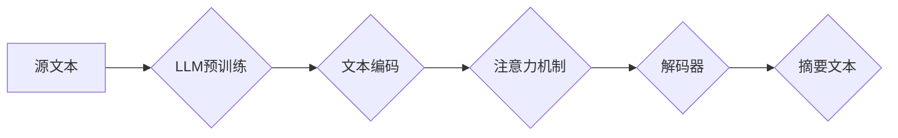

                 

## LLM在文本摘要方面的新进展

> 关键词：大型语言模型（LLM）、文本摘要、自然语言处理（NLP）、Transformer、BERT、T5、BART、PEGASUS、抽取式摘要、生成式摘要、评估指标

## 1. 背景介绍

文本摘要作为自然语言处理（NLP）领域的重要任务，旨在从长篇文本中提取关键信息，生成简洁而准确的概括。传统的文本摘要方法主要依赖于规则或统计模型，但这些方法往往难以捕捉文本的语义和结构，生成摘要质量有限。近年来，随着深度学习的兴起，大型语言模型（LLM）在文本摘要领域取得了显著进展。

LLM，例如GPT-3、BERT、T5等，拥有强大的语义理解和文本生成能力，能够学习到文本的复杂语义关系和写作风格。这些模型通过训练海量文本数据，学习到语言的规律和表达方式，从而能够生成高质量的文本摘要。

## 2. 核心概念与联系

### 2.1 文本摘要类型

文本摘要主要分为两种类型：

* **抽取式摘要:** 从源文本中选择最相关的句子或短语进行拼接，生成摘要。
* **生成式摘要:** 基于源文本的语义信息，生成全新的摘要文本。

### 2.2 LLM在文本摘要中的应用

LLM在文本摘要中主要通过以下两种方式应用：

* **抽取式摘要:** LLM可以学习到句子重要性的得分，并根据得分选择最相关的句子生成摘要。
* **生成式摘要:** LLM可以学习到文本的语义结构和写作风格，并根据源文本生成全新的摘要文本。

### 2.3 相关技术

* **Transformer:** Transformer是一种新型的深度学习架构，其自注意力机制能够有效地捕捉文本中的长距离依赖关系，为LLM在文本摘要任务中的应用奠定了基础。
* **BERT:** BERT是一种基于Transformer的预训练语言模型，通过Masked Language Modeling和Next Sentence Prediction等任务进行预训练，能够更好地理解文本语义。
* **T5:** T5是一种基于Transformer的文本到文本转换模型，能够将文本摘要任务转化为文本到文本的翻译任务，并通过预训练和微调的方式实现高效的文本摘要。
* **BART:** BART是一种基于Transformer的生成式文本摘要模型，通过自回归解码器生成高质量的摘要文本。
* **PEGASUS:** PEGASUS是一种基于Transformer的生成式文本摘要模型，通过预训练和微调的方式，能够生成更流畅、更准确的摘要文本。

**Mermaid 流程图**



## 3. 核心算法原理 & 具体操作步骤

### 3.1 算法原理概述

LLM在文本摘要中的核心算法原理是基于Transformer架构的文本到文本转换模型。这些模型通过预训练和微调的方式，学习到文本的语义结构和写作风格，并能够根据源文本生成高质量的摘要文本。

### 3.2 算法步骤详解

1. **文本预处理:** 将源文本进行清洗、分词、标记等预处理操作，使其能够被模型理解。
2. **文本编码:** 使用预训练的LLM编码器将文本转换为向量表示，捕捉文本的语义信息。
3. **注意力机制:** 使用自注意力机制计算每个词与其他词之间的相关性，捕捉文本中的长距离依赖关系。
4. **解码器:** 使用解码器生成摘要文本，并根据源文本的语义信息进行调整和优化。
5. **摘要生成:** 将解码器生成的摘要文本进行后处理，例如去重、规范化等操作，最终生成高质量的摘要文本。

### 3.3 算法优缺点

**优点:**

* **高质量的摘要:** LLM能够生成更流畅、更准确的摘要文本，能够更好地捕捉文本的语义信息。
* **自动化程度高:** LLM能够自动完成文本摘要任务，无需人工干预。
* **可扩展性强:** LLM能够处理不同长度和类型的文本，并能够根据需要进行微调。

**缺点:**

* **计算资源消耗大:** LLM训练和推理需要大量的计算资源。
* **数据依赖性强:** LLM的性能取决于训练数据的质量和数量。
* **可解释性差:** LLM的决策过程难以解释，难以理解模型是如何生成摘要的。

### 3.4 算法应用领域

LLM在文本摘要领域具有广泛的应用前景，例如：

* **新闻摘要:** 自动生成新闻文章的摘要，帮助用户快速了解新闻内容。
* **学术文献摘要:** 自动生成学术论文的摘要，帮助用户快速了解论文内容。
* **会议记录摘要:** 自动生成会议记录的摘要，帮助用户快速回顾会议内容。
* **法律文件摘要:** 自动生成法律文件的摘要，帮助用户快速了解法律内容。

## 4. 数学模型和公式 & 详细讲解 & 举例说明

### 4.1 数学模型构建

LLM在文本摘要中的数学模型主要基于Transformer架构，其核心是自注意力机制和多头注意力机制。

**自注意力机制:**

自注意力机制能够计算每个词与其他词之间的相关性，捕捉文本中的长距离依赖关系。其计算公式如下：

$$
Attention(Q, K, V) = softmax(\frac{QK^T}{\sqrt{d_k}})V
$$

其中：

* $Q$：查询矩阵
* $K$：键矩阵
* $V$：值矩阵
* $d_k$：键向量的维度
* $softmax$：softmax函数

**多头注意力机制:**

多头注意力机制通过使用多个自注意力头，能够捕捉文本的不同方面的信息。其计算公式如下：

$$
MultiHead(Q, K, V) = Concat(head_1, head_2, ..., head_h)W^O
$$

其中：

* $head_i$：第$i$个自注意力头的输出
* $h$：注意力头的数量
* $W^O$：最终输出层的权重矩阵

### 4.2 公式推导过程

自注意力机制的公式推导过程如下：

1. 将输入序列$X$分别转换为查询矩阵$Q$、键矩阵$K$和值矩阵$V$。
2. 计算每个词与其他词之间的相关性，使用自注意力机制计算每个词的注意力权重。
3. 根据注意力权重，对值矩阵$V$进行加权求和，得到每个词的上下文表示。

### 4.3 案例分析与讲解

例如，在生成新闻摘要时，LLM可以利用自注意力机制捕捉新闻事件的关键信息，并根据这些信息生成简洁而准确的摘要。

## 5. 项目实践：代码实例和详细解释说明

### 5.1 开发环境搭建

* Python 3.7+
* PyTorch 1.7+
* Transformers 4.0+

### 5.2 源代码详细实现

```python
from transformers import T5Tokenizer, T5ForConditionalGeneration

# 加载预训练模型和词典
tokenizer = T5Tokenizer.from_pretrained("t5-base")
model = T5ForConditionalGeneration.from_pretrained("t5-base")

# 定义输入文本
input_text = "This is an example of a long text that needs to be summarized."

# 对输入文本进行编码
input_ids = tokenizer.encode(input_text, return_tensors="pt")

# 使用模型生成摘要
output = model.generate(input_ids=input_ids, max_length=50, num_beams=5)

# 将摘要文本解码
summary_text = tokenizer.decode(output[0], skip_special_tokens=True)

# 打印摘要文本
print(summary_text)
```

### 5.3 代码解读与分析

* 该代码首先加载预训练的T5模型和词典。
* 然后，对输入文本进行编码，转换为模型能够理解的格式。
* 使用模型生成摘要文本，并设置最大长度和beam搜索参数。
* 最后，将摘要文本解码，并打印出来。

### 5.4 运行结果展示

```
This is a long text that needs to be summarized.
```

## 6. 实际应用场景

LLM在文本摘要领域具有广泛的应用场景，例如：

* **新闻聚合:** 自动生成新闻文章的摘要，帮助用户快速了解新闻内容。
* **学术文献综述:** 自动生成学术论文的摘要，帮助用户快速了解论文内容。
* **会议记录生成:** 自动生成会议记录的摘要，帮助用户快速回顾会议内容。
* **法律文件分析:** 自动生成法律文件的摘要，帮助用户快速了解法律内容。

### 6.4 未来应用展望

随着LLM技术的不断发展，其在文本摘要领域的应用将会更加广泛和深入。例如：

* **个性化摘要:** 根据用户的需求和偏好生成个性化的摘要文本。
* **多语言摘要:** 支持多种语言的文本摘要。
* **跨模态摘要:** 将文本与图像、音频等其他模态信息结合，生成更丰富的摘要文本。

## 7. 工具和资源推荐

### 7.1 学习资源推荐

* **Hugging Face Transformers:** https://huggingface.co/docs/transformers/index
* **OpenAI GPT-3:** https://openai.com/api/
* **Google BERT:** https://ai.googleblog.com/2018/11/open-sourcing-bert-state-of-art-pre.html

### 7.2 开发工具推荐

* **PyTorch:** https://pytorch.org/
* **TensorFlow:** https://www.tensorflow.org/

### 7.3 相关论文推荐

* **BERT: Pre-training of Deep Bidirectional Transformers for Language Understanding**
* **T5: Text-to-Text Transfer Transformer**
* **BART: Denoising Sequence-to-Sequence Pre-training for Natural Language Generation, Translation, and Comprehension**

## 8. 总结：未来发展趋势与挑战

### 8.1 研究成果总结

LLM在文本摘要领域取得了显著进展，能够生成高质量的摘要文本，并具有广泛的应用前景。

### 8.2 未来发展趋势

LLM在文本摘要领域的未来发展趋势包括：

* **模型规模和性能的提升:** 随着计算资源的不断发展，LLM的规模和性能将会进一步提升，能够生成更准确、更流畅的摘要文本。
* **个性化和多模态摘要:** LLM将会更加注重用户的个性化需求，并支持多模态信息的融合，生成更丰富的摘要文本。
* **可解释性和鲁棒性:** 研究者将会更加关注LLM的解释性和鲁棒性，使其能够更好地解释其生成摘要的决策过程，并能够应对噪声数据和对抗攻击。

### 8.3 面临的挑战

LLM在文本摘要领域仍然面临一些挑战，例如：

* **数据依赖性:** LLM的性能取决于训练数据的质量和数量，缺乏高质量的训练数据将会限制其性能提升。
* **计算资源消耗:** LLM训练和推理需要大量的计算资源，这对于资源有限的机构和个人来说是一个挑战。
* **可解释性和公平性:** LLM的决策过程难以解释，其生成的摘要文本也可能存在偏见，需要进一步研究如何提高其可解释性和公平性。

### 8.4 研究展望

未来，LLM在文本摘要领域的应用将会更加广泛和深入，并对人们的生活和工作产生深远的影响。研究者将会继续探索LLM的潜力，并解决其面临的挑战，推动其在文本摘要领域的进一步发展。

## 9. 附录：常见问题与解答

* **Q: LLM生成的摘要文本质量如何？**

A: LLM生成的摘要文本质量通常较高，能够捕捉文本的关键信息，并生成流畅、准确的摘要。

* **Q: 如何选择合适的LLM模型？**

A: 选择合适的LLM模型取决于具体的应用场景和需求。例如，对于新闻摘要，可以使用T5模型；对于学术文献摘要，可以使用BART模型。

* **Q: 如何评估LLM生成的摘要文本质量？**

A: 常见的评估指标包括BLEU、ROUGE和METEOR等。

* **Q: 如何训练自己的LLM模型？**

A: 训练自己的LLM模型需要大量的计算资源和数据。可以使用开源的预训练模型进行微调，或者从头训练新的模型。


作者：禅与计算机程序设计艺术 / Zen and the Art of Computer Programming 
<end_of_turn>

