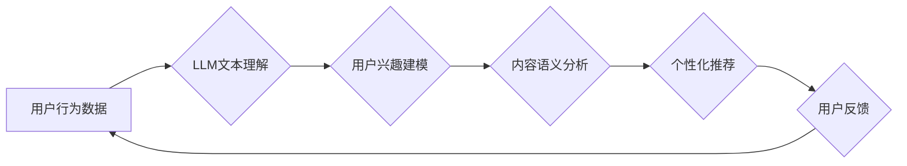

                 

## LLM在智能个性化推荐系统中的应用前景

> 关键词：大型语言模型 (LLM)、个性化推荐、推荐系统、自然语言处理 (NLP)、机器学习 (ML)、用户行为分析、内容理解

## 1. 背景介绍

在数字时代，海量信息涌现，用户面临着选择困难。个性化推荐系统应运而生，旨在根据用户的兴趣、偏好和行为，精准推荐相关内容，提升用户体验。传统推荐系统主要依赖协同过滤、内容过滤等方法，但这些方法在面对冷启动问题、数据稀疏性等挑战时表现有限。近年来，大型语言模型 (LLM) 的快速发展为个性化推荐系统带来了新的机遇。

LLM 拥有强大的文本理解和生成能力，能够从海量文本数据中学习用户偏好和内容语义，为个性化推荐提供更深层的理解和更精准的匹配。

## 2. 核心概念与联系

### 2.1 个性化推荐系统

个性化推荐系统旨在根据用户的历史行为、偏好和上下文信息，预测用户对特定内容的兴趣，并推荐最相关的商品、服务或内容。

### 2.2 大型语言模型 (LLM)

大型语言模型 (LLM) 是近年来人工智能领域取得突破性进展的代表之一。它是一种基于深度学习的Transformer架构模型，通过训练海量文本数据，学习语言的语法、语义和上下文关系，能够执行各种自然语言处理任务，例如文本生成、翻译、问答、摘要等。

### 2.3 核心概念联系

LLM 的强大文本理解和生成能力可以为个性化推荐系统带来以下优势：

* **更深入的用户理解:** LLM 可以分析用户的文本评论、浏览历史、搜索记录等，挖掘用户的潜在兴趣和偏好，构建更全面的用户画像。
* **更精准的内容匹配:** LLM 可以理解内容的语义和主题，将用户兴趣与内容进行更精准的匹配，推荐更相关的商品或服务。
* **个性化内容生成:** LLM 可以根据用户的喜好生成个性化的推荐内容，例如推荐理由、个性化描述等，提升用户体验。

**Mermaid 流程图**



## 3. 核心算法原理 & 具体操作步骤

### 3.1 算法原理概述

LLM 在个性化推荐系统中的应用主要基于以下核心算法：

* **用户兴趣建模:** 利用 LLM 对用户的文本数据进行分析，例如评论、描述、搜索记录等，构建用户的兴趣模型，并将其表示为向量形式。
* **内容语义分析:** 利用 LLM 对商品、服务或内容进行分析，提取其语义特征，并将其表示为向量形式。
* **推荐算法:** 基于用户兴趣模型和内容语义分析结果，采用协同过滤、内容过滤或深度学习等推荐算法，预测用户对特定内容的兴趣，并生成推荐列表。

### 3.2 算法步骤详解

1. **数据预处理:** 收集用户行为数据、商品信息等数据，进行清洗、格式化和向量化处理。
2. **用户兴趣建模:** 利用 LLM 对用户的文本数据进行训练，学习用户的兴趣偏好，并将其表示为用户兴趣向量。
3. **内容语义分析:** 利用 LLM 对商品、服务或内容进行训练，学习其语义特征，并将其表示为内容语义向量。
4. **推荐算法:** 根据用户兴趣向量和内容语义向量，采用推荐算法，例如基于余弦相似度的推荐算法，计算用户对特定内容的兴趣评分，并生成推荐列表。
5. **结果评估:** 利用指标，例如准确率、召回率、NDCG等，评估推荐系统的性能。

### 3.3 算法优缺点

**优点:**

* **更深入的用户理解:** LLM 可以分析用户的文本数据，挖掘用户的潜在兴趣和偏好。
* **更精准的内容匹配:** LLM 可以理解内容的语义和主题，进行更精准的匹配。
* **个性化内容生成:** LLM 可以根据用户的喜好生成个性化的推荐内容。

**缺点:**

* **数据依赖性强:** LLM 的性能依赖于训练数据的质量和数量。
* **计算资源消耗大:** LLM 的训练和推理过程需要大量的计算资源。
* **可解释性差:** LLM 的决策过程较为复杂，难以解释其推荐结果。

### 3.4 算法应用领域

LLM 在个性化推荐系统中的应用领域广泛，例如：

* **电商推荐:** 推荐商品、服务或优惠活动。
* **内容推荐:** 推荐新闻、视频、音乐、书籍等内容。
* **社交推荐:** 推荐朋友、群组或活动。
* **教育推荐:** 推荐学习资源、课程或导师。

## 4. 数学模型和公式 & 详细讲解 & 举例说明

### 4.1 数学模型构建

用户兴趣建模和内容语义分析可以采用以下数学模型：

* **用户兴趣向量:**  用户兴趣向量可以表示为一个高维向量，每个维度代表一个兴趣主题，向量元素的值表示用户对该主题的兴趣程度。

* **内容语义向量:** 内容语义向量可以表示为一个高维向量，每个维度代表一个语义特征，向量元素的值表示内容在该特征上的强度。

### 4.2 公式推导过程

推荐算法可以采用余弦相似度来计算用户对特定内容的兴趣评分：

$$
\text{相似度} = \frac{u \cdot c}{||u|| ||c||}
$$

其中：

* $u$ 是用户兴趣向量
* $c$ 是内容语义向量
* $u \cdot c$ 是用户兴趣向量和内容语义向量的点积
* $||u||$ 和 $||c||$ 分别是用户兴趣向量和内容语义向量的模长

### 4.3 案例分析与讲解

假设有一个用户兴趣向量 $u = [0.2, 0.5, 0.8, 0.1]$，表示用户对电影、音乐、书籍、游戏四个主题的兴趣程度。

有一个内容语义向量 $c = [0.3, 0.6, 0.4, 0.2]$，表示一部电影的内容在四个主题上的强度。

则用户对这部电影的兴趣评分为：

$$
\text{相似度} = \frac{0.2 \cdot 0.3 + 0.5 \cdot 0.6 + 0.8 \cdot 0.4 + 0.1 \cdot 0.2}{\sqrt{0.2^2 + 0.5^2 + 0.8^2 + 0.1^2} \sqrt{0.3^2 + 0.6^2 + 0.4^2 + 0.2^2}} \approx 0.75
$$

该评分表示用户对这部电影的兴趣程度较高。

## 5. 项目实践：代码实例和详细解释说明

### 5.1 开发环境搭建

* Python 3.7+
* PyTorch 或 TensorFlow
* NLTK 或 SpaCy

### 5.2 源代码详细实现

```python
# 用户兴趣建模
from transformers import AutoModel, AutoTokenizer

model_name = "bert-base-uncased"
tokenizer = AutoTokenizer.from_pretrained(model_name)
model = AutoModel.from_pretrained(model_name)

def generate_user_embedding(user_text):
    inputs = tokenizer(user_text, return_tensors="pt")
    outputs = model(**inputs)
    user_embedding = outputs.last_hidden_state[:, 0, :]
    return user_embedding

# 内容语义分析
# ...

# 推荐算法
def calculate_similarity(user_embedding, content_embedding):
    return cosine_similarity(user_embedding, content_embedding)

# ...
```

### 5.3 代码解读与分析

* 用户兴趣建模部分使用预训练的BERT模型对用户的文本数据进行编码，生成用户的兴趣向量。
* 内容语义分析部分可以采用类似的方法对内容进行编码。
* 推荐算法部分使用余弦相似度计算用户对特定内容的兴趣评分。

### 5.4 运行结果展示

* 运行代码后，可以得到用户对不同内容的兴趣评分，并根据评分生成推荐列表。

## 6. 实际应用场景

### 6.1 电商推荐

LLM 可以分析用户的购物历史、浏览记录、评论等文本数据，挖掘用户的兴趣偏好，并推荐相关的商品、优惠活动等。

### 6.2 内容推荐

LLM 可以分析用户的阅读习惯、观看记录、点赞等行为数据，推荐相关的新闻、视频、音乐、书籍等内容。

### 6.3 个性化广告

LLM 可以分析用户的兴趣爱好、生活方式等信息，生成个性化的广告内容，提高广告点击率和转化率。

### 6.4 未来应用展望

LLM 在个性化推荐系统中的应用前景广阔，未来可能应用于以下领域：

* **更精准的推荐:** LLM 可以更好地理解用户的需求和偏好，提供更精准的推荐。
* **更个性化的体验:** LLM 可以根据用户的喜好生成个性化的推荐内容，提升用户体验。
* **跨平台推荐:** LLM 可以将用户的行为数据整合到不同的平台，提供更全面的推荐。

## 7. 工具和资源推荐

### 7.1 学习资源推荐

* **论文:**

* **书籍:**

* **在线课程:**

### 7.2 开发工具推荐

* **框架:** PyTorch, TensorFlow
* **库:** NLTK, SpaCy, Transformers

### 7.3 相关论文推荐

* **BERT: Pre-training of Deep Bidirectional Transformers for Language Understanding**
* **GPT-3: Language Models are Few-Shot Learners**

## 8. 总结：未来发展趋势与挑战

### 8.1 研究成果总结

LLM 在个性化推荐系统中的应用取得了显著的成果，能够提供更精准、更个性化的推荐体验。

### 8.2 未来发展趋势

* **模型规模和能力提升:** 未来 LLM 的规模和能力将进一步提升，能够更好地理解用户的需求和偏好。
* **多模态推荐:** LLM 将与其他模态数据，例如图像、音频等融合，实现多模态推荐。
* **解释性增强:** 研究者将致力于提高 LLM 的可解释性，使推荐结果更加透明和可信。

### 8.3 面临的挑战

* **数据隐私和安全:** LLM 的训练和应用需要大量用户数据，如何保护用户隐私和数据安全是一个重要的挑战。
* **算法公平性:** LLM 的推荐结果可能存在偏见，需要研究如何保证算法的公平性和公正性。
* **计算资源消耗:** LLM 的训练和推理过程需要大量的计算资源，如何降低计算成本是一个重要的挑战。

### 8.4 研究展望

未来，LLM 在个性化推荐系统中的应用将继续深入发展，为用户提供更智能、更个性化的体验。


## 9. 附录：常见问题与解答

* **Q1: LLM 在个性化推荐系统中的应用有哪些优势？**

* **A1:** LLM 可以更深入地理解用户的兴趣和偏好，并提供更精准的推荐。

* **Q2: LLM 在个性化推荐系统中有哪些挑战？**

* **A2:** LLM 的训练和应用需要大量数据，如何保护用户隐私和数据安全是一个重要的挑战。

* **Q3: 如何评估 LLM 在个性化推荐系统中的性能？**

* **A3:** 可以使用指标，例如准确率、召回率、NDCG等，评估推荐系统的性能。


作者：禅与计算机程序设计艺术 / Zen and the Art of Computer Programming 
<end_of_turn>

