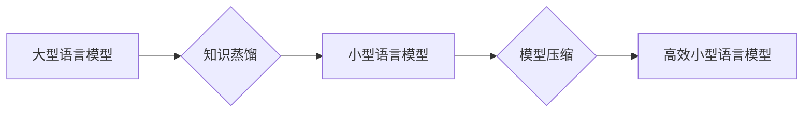

                 

## LLM的知识蒸馏与模型压缩

> 关键词：大型语言模型 (LLM)、知识蒸馏、模型压缩、参数量化、剪枝、微调、效率优化、推理加速

## 1. 背景介绍

大型语言模型 (LLM) 近年来取得了令人瞩目的成就，在自然语言处理 (NLP) 领域展现出强大的能力，例如文本生成、翻译、问答等。然而，这些模型通常拥有庞大的参数量，导致部署和推理效率低下，难以在资源有限的设备上运行。为了解决这一问题，知识蒸馏和模型压缩技术应运而生。

知识蒸馏是一种机器学习技术，旨在将知识从一个大型模型 (教师模型) 传递到一个小型模型 (学生模型) 中。通过这种方式，学生模型可以获得教师模型的性能，同时拥有更小的参数量和更低的计算成本。模型压缩则是指通过各种方法减少模型大小，从而提高模型的效率。

## 2. 核心概念与联系

### 2.1 知识蒸馏

知识蒸馏的核心思想是利用教师模型的软标签来训练学生模型。教师模型的输出通常是一个概率分布，表示对不同类别的预测概率。学生模型则使用这些概率分布作为软标签，而不是传统的硬标签 (one-hot编码)。这种软标签训练方式可以帮助学生模型学习到教师模型更丰富的知识和表达能力。

### 2.2 模型压缩

模型压缩的目标是减少模型的大小，而不会显著降低模型性能。常用的模型压缩技术包括：

* **参数量化:** 将模型参数的精度降低，例如将32位浮点数转换为8位整数。
* **剪枝:** 移除模型中不重要的参数或连接，例如移除权重较小的连接。
* **知识蒸馏:** 将知识从一个大型模型转移到一个小型模型中。

### 2.3 联系

知识蒸馏和模型压缩是互补的技术，可以协同使用来提高模型的效率。例如，可以先使用知识蒸馏将大型模型的知识转移到一个小型模型中，然后使用参数量化或剪枝进一步压缩模型大小。

**Mermaid 流程图**



## 3. 核心算法原理 & 具体操作步骤

### 3.1 算法原理概述

知识蒸馏的核心算法原理是利用教师模型的软标签来训练学生模型。教师模型的输出是一个概率分布，表示对不同类别的预测概率。学生模型则使用这些概率分布作为软标签，而不是传统的硬标签 (one-hot编码)。

### 3.2 算法步骤详解

1. **训练教师模型:** 首先需要训练一个大型的教师模型，例如GPT-3或BERT。
2. **生成教师模型的软标签:** 使用教师模型对训练数据进行预测，并获得每个样本的概率分布。
3. **训练学生模型:** 使用教师模型的软标签来训练一个小型学生模型。
4. **评估学生模型:** 使用测试数据评估学生模型的性能，并与教师模型进行比较。

### 3.3 算法优缺点

**优点:**

* 可以有效地将知识从大型模型转移到小型模型中。
* 学生模型通常具有更小的参数量和更低的计算成本。
* 可以提高模型的泛化能力。

**缺点:**

* 需要一个大型的教师模型作为基础。
* 训练学生模型需要更多的计算资源。
* 学生模型的性能可能仍然低于教师模型。

### 3.4 算法应用领域

知识蒸馏和模型压缩技术在许多领域都有应用，例如：

* **移动设备:** 将大型模型压缩到移动设备上，以实现离线语音识别、图像分类等功能。
* **嵌入式系统:** 将模型压缩到嵌入式系统上，以实现资源有限环境下的智能应用。
* **边缘计算:** 将模型部署到边缘设备上，以实现低延迟和高效率的实时推理。

## 4. 数学模型和公式 & 详细讲解 & 举例说明

### 4.1 数学模型构建

知识蒸馏的目标是最小化教师模型和学生模型的输出之间的距离。常用的距离度量包括交叉熵损失和KL散度。

**交叉熵损失:**

$$
L_{CE}(p, q) = -\sum_{i=1}^{N} p_i \log q_i
$$

其中，$p$ 是教师模型的输出概率分布，$q$ 是学生模型的输出概率分布，$N$ 是类别数。

**KL散度:**

$$
D_{KL}(p||q) = \sum_{i=1}^{N} p_i \log \frac{p_i}{q_i}
$$

其中，$p$ 和 $q$ 的含义与交叉熵损失相同。

### 4.2 公式推导过程

知识蒸馏的目标函数通常是交叉熵损失和KL散度的组合。

$$
L = \lambda L_{CE}(p, q) + (1-\lambda) D_{KL}(p||q)
$$

其中，$\lambda$ 是一个权重参数，用于平衡交叉熵损失和KL散度的影响。

### 4.3 案例分析与讲解

假设我们有一个教师模型和一个学生模型，用于进行图像分类任务。教师模型的输出概率分布为 $p = [0.8, 0.1, 0.1]$, 学生模型的输出概率分布为 $q = [0.7, 0.2, 0.1]$. 

使用交叉熵损失计算教师模型和学生模型之间的距离:

$$
L_{CE}(p, q) = - (0.8 \log 0.7 + 0.1 \log 0.2 + 0.1 \log 0.1)
$$

使用KL散度计算教师模型和学生模型之间的距离:

$$
D_{KL}(p||q) = 0.8 \log \frac{0.8}{0.7} + 0.1 \log \frac{0.1}{0.2} + 0.1 \log \frac{0.1}{0.1}
$$

通过调整$\lambda$的值，可以平衡交叉熵损失和KL散度的影响，从而优化学生模型的性能。

## 5. 项目实践：代码实例和详细解释说明

### 5.1 开发环境搭建

* **操作系统:** Ubuntu 20.04
* **Python 版本:** 3.8
* **深度学习框架:** PyTorch 1.8

### 5.2 源代码详细实现

```python
import torch
import torch.nn as nn

# 定义教师模型
class TeacherModel(nn.Module):
    # ...

# 定义学生模型
class StudentModel(nn.Module):
    # ...

# 加载预训练的教师模型
teacher_model = TeacherModel()
teacher_model.load_state_dict(torch.load("teacher_model.pth"))

# 训练学生模型
optimizer = torch.optim.Adam(student_model.parameters(), lr=0.001)
criterion = nn.CrossEntropyLoss()

for epoch in range(num_epochs):
    for batch_idx, (data, target) in enumerate(train_loader):
        # 前向传播
        output_teacher = teacher_model(data)
        output_student = student_model(data)

        # 计算损失
        loss = criterion(output_student, target)

        # 反向传播
        optimizer.zero_grad()
        loss.backward()
        optimizer.step()

# 保存训练好的学生模型
torch.save(student_model.state_dict(), "student_model.pth")
```

### 5.3 代码解读与分析

* 代码首先定义了教师模型和学生模型的架构。
* 然后加载预训练的教师模型权重。
* 使用交叉熵损失函数和Adam优化器训练学生模型。
* 在训练过程中，使用教师模型的输出作为软标签来训练学生模型。
* 最后保存训练好的学生模型权重。

### 5.4 运行结果展示

训练完成后，可以评估学生模型的性能，例如使用测试集计算准确率、F1-score等指标。

## 6. 实际应用场景

### 6.1 语音识别

将大型语音识别模型压缩到移动设备上，实现离线语音识别功能。

### 6.2 图像分类

将大型图像分类模型压缩到嵌入式系统上，实现资源有限环境下的图像识别功能。

### 6.3 机器翻译

将大型机器翻译模型压缩到边缘设备上，实现低延迟和高效率的实时翻译功能。

### 6.4 未来应用展望

随着人工智能技术的不断发展，知识蒸馏和模型压缩技术将应用于更多领域，例如：

* **自动驾驶:** 将大型自动驾驶模型压缩到汽车上，实现更安全和高效的驾驶体验。
* **医疗诊断:** 将大型医疗诊断模型压缩到医疗设备上，实现更便捷和准确的疾病诊断。
* **个性化推荐:** 将大型个性化推荐模型压缩到用户设备上，实现更精准和个性化的推荐服务。

## 7. 工具和资源推荐

### 7.1 学习资源推荐

* **论文:**
    * Hinton, G., Vinyals, O., & Dean, J. (2015). Distilling the knowledge in a neural network. arXiv preprint arXiv:1503.02531.
    * Han, S., Pool, J., Tran, J., & Dally, W. (2015). Learning both weights and connections for efficient neural networks. arXiv preprint arXiv:1506.02626.
* **博客:**
    * https://towardsdatascience.com/knowledge-distillation-a-powerful-technique-for-model-compression-a38b9719627c
    * https://blog.openai.com/fine-tuning-gpt-3/

### 7.2 开发工具推荐

* **PyTorch:** https://pytorch.org/
* **TensorFlow:** https://www.tensorflow.org/
* **Hugging Face Transformers:** https://huggingface.co/transformers/

### 7.3 相关论文推荐

* **模型压缩:**
    * Network Pruning: A Survey (2020)
    * Quantization-aware Training: A Methodology for Quantized Neural Network Design (2018)
* **知识蒸馏:**
    * Teacher-Student Learning for Image Classification (2017)
    * Multi-Teacher Knowledge Distillation (2019)

## 8. 总结：未来发展趋势与挑战

### 8.1 研究成果总结

知识蒸馏和模型压缩技术取得了显著的进展，有效地提高了模型的效率和部署能力。

### 8.2 未来发展趋势

* **更有效的压缩方法:** 研究更有效的模型压缩方法，例如基于神经网络的压缩技术。
* **跨平台部署:** 探索跨平台部署的知识蒸馏和模型压缩技术，例如将模型部署到不同类型的硬件设备上。
* **自动化模型压缩:** 开发自动化模型压缩工具，方便用户进行模型压缩。

### 8.3 面临的挑战

* **压缩后的模型性能:** 压缩模型可能会导致性能下降，需要进一步研究如何平衡模型大小和性能。
* **知识蒸馏的泛化能力:** 知识蒸馏的泛化能力需要进一步提升，使其能够应用于更多场景。
* **模型可解释性:** 压缩后的模型的可解释性需要提高，以便更好地理解模型的决策过程。

### 8.4 研究展望

未来，知识蒸馏和模型压缩技术将继续发展，为人工智能的普及和应用提供更强大的支持。


## 9. 附录：常见问题与解答

### 9.1 什么是知识蒸馏？

知识蒸馏是一种机器学习技术，旨在将知识从一个大型模型 (教师模型) 传递到一个小型模型 (学生模型) 中。

### 9.2 模型压缩有哪些方法？

常用的模型压缩方法包括参数量化、剪枝和知识蒸馏。

### 9.3 知识蒸馏的优势是什么？

知识蒸馏可以有效地将知识从大型模型转移到小型模型中，从而提高小型模型的性能和效率。

### 9.4 知识蒸馏的局限性是什么？

知识蒸馏需要一个大型的教师模型作为基础，并且训练学生模型需要更多的计算资源。

### 9.5 如何选择合适的模型压缩方法？

选择合适的模型压缩方法需要根据具体的应用场景和模型特点进行综合考虑。


作者：禅与计算机程序设计艺术 / Zen and the Art of Computer Programming 
<end_of_turn>

