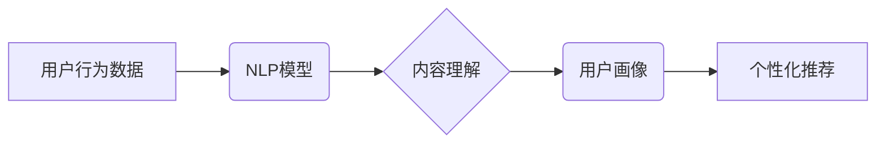

                 

## NLP技术在推荐：大模型潜力

> 关键词：自然语言处理 (NLP)、推荐系统、大模型、Transformer、BERT、Fine-tuning、用户画像、内容理解、个性化推荐

## 1. 背景介绍

推荐系统是互联网时代的重要组成部分，旨在根据用户的历史行为、偏好和上下文信息，预测用户可能感兴趣的内容并提供个性化的推荐。传统的推荐系统主要依赖于协同过滤和内容过滤等方法，但这些方法在处理文本数据和理解用户意图方面存在局限性。近年来，随着自然语言处理 (NLP) 技术的快速发展，特别是大模型的涌现，NLP技术在推荐系统领域展现出巨大的潜力。

大模型，如BERT、GPT等，拥有强大的文本理解和生成能力，能够更好地捕捉用户需求和内容语义，从而提升推荐系统的准确性和个性化程度。

## 2. 核心概念与联系

### 2.1 自然语言处理 (NLP)

NLP是人工智能的一个分支，旨在使计算机能够理解、处理和生成人类语言。NLP技术涵盖了文本分析、语言建模、机器翻译、问答系统等多个领域。

### 2.2 推荐系统

推荐系统旨在根据用户的历史行为、偏好和上下文信息，预测用户可能感兴趣的内容并提供个性化的推荐。推荐系统可以分为基于内容的推荐、基于协同过滤的推荐和基于混合方法的推荐等类型。

### 2.3 大模型

大模型是指参数量巨大、训练数据海量的人工智能模型。大模型通常具有强大的泛化能力和文本理解能力，能够在多个NLP任务中取得优异的性能。

**NLP技术与推荐系统的联系**

NLP技术可以帮助推荐系统更好地理解用户需求和内容语义，从而提升推荐系统的准确性和个性化程度。

**核心概念架构**



## 3. 核心算法原理 & 具体操作步骤

### 3.1 算法原理概述

NLP技术在推荐系统中的核心算法主要包括：

* **文本嵌入:** 将文本转换为向量表示，以便于模型理解和处理。
* **用户画像构建:** 基于用户的历史行为和偏好，构建用户画像，刻画用户的兴趣和需求。
* **内容理解:** 利用NLP模型理解内容的语义和主题，提取关键信息。
* **推荐模型训练:** 基于用户画像和内容理解结果，训练推荐模型，预测用户对特定内容的兴趣。

### 3.2 算法步骤详解

1. **数据预处理:** 收集用户行为数据、内容数据，并进行清洗、格式化和分词等预处理操作。
2. **文本嵌入:** 使用Word2Vec、GloVe等词嵌入模型将文本转换为向量表示。
3. **用户画像构建:** 利用用户的历史行为数据，如浏览记录、购买记录、评分等，构建用户画像，刻画用户的兴趣和需求。
4. **内容理解:** 利用BERT、RoBERTa等预训练语言模型对内容进行理解，提取关键信息和主题。
5. **推荐模型训练:** 使用协同过滤、深度学习等算法，训练推荐模型，预测用户对特定内容的兴趣。
6. **推荐结果输出:** 根据模型预测结果，输出个性化的推荐列表。

### 3.3 算法优缺点

**优点:**

* 能够更好地理解用户需求和内容语义。
* 提升推荐系统的准确性和个性化程度。
* 能够处理海量文本数据。

**缺点:**

* 需要大量的训练数据和计算资源。
* 模型训练复杂，需要专业知识和技术支持。
* 存在数据隐私和安全问题。

### 3.4 算法应用领域

* **电商推荐:** 根据用户的购买历史和浏览记录，推荐商品。
* **内容推荐:** 根据用户的兴趣和偏好，推荐新闻、视频、文章等内容。
* **社交推荐:** 根据用户的社交关系和兴趣，推荐好友、群组等。
* **音乐推荐:** 根据用户的音乐偏好，推荐歌曲、专辑等。

## 4. 数学模型和公式 & 详细讲解 & 举例说明

### 4.1 数学模型构建

推荐系统的核心是预测用户对特定物品的评分或点击概率。常用的数学模型包括：

* **协同过滤模型:** 基于用户的历史行为数据，预测用户对特定物品的评分。
* **内容过滤模型:** 基于物品的特征信息，预测用户对特定物品的评分。
* **深度学习模型:** 利用深度神经网络，学习用户和物品之间的复杂关系，预测用户对特定物品的评分。

### 4.2 公式推导过程

**协同过滤模型:**

假设用户 $u$ 对物品 $i$ 的评分为 $r_{ui}$，则协同过滤模型的目标是学习一个评分预测函数 $f(u, i)$，使得 $f(u, i)$ 尽可能接近 $r_{ui}$。

常用的协同过滤算法包括基于用户的协同过滤和基于物品的协同过滤。

**基于用户的协同过滤:**

对于用户 $u$，找到与之兴趣相似的用户 $v$，并根据 $v$ 对物品 $i$ 的评分预测 $u$ 对物品 $i$ 的评分。

**基于物品的协同过滤:**

对于物品 $i$，找到与之相关的物品 $j$，并根据 $u$ 对 $j$ 的评分预测 $u$ 对 $i$ 的评分。

**深度学习模型:**

深度学习模型通常使用神经网络结构，学习用户和物品之间的复杂关系。

例如，可以使用多层感知机 (MLP) 或循环神经网络 (RNN) 来学习用户历史行为的序列信息，并预测用户对特定物品的评分。

### 4.3 案例分析与讲解

**案例:**

假设我们有一个电商平台，用户 $u$ 对商品 $i$ 的评分为 5，而用户 $v$ 与 $u$ 的兴趣相似度较高，并且 $v$ 对商品 $i$ 的评分为 4。

**基于用户的协同过滤:**

我们可以根据 $v$ 对商品 $i$ 的评分预测 $u$ 对商品 $i$ 的评分，例如，预测 $u$ 对商品 $i$ 的评分为 4.5。

**深度学习模型:**

我们可以使用深度学习模型学习用户 $u$ 和商品 $i$ 的特征信息，并预测 $u$ 对商品 $i$ 的评分。

## 5. 项目实践：代码实例和详细解释说明

### 5.1 开发环境搭建

* Python 3.6+
* TensorFlow/PyTorch
* NLTK/SpaCy

### 5.2 源代码详细实现

```python
# 使用BERT模型进行文本嵌入
from transformers import BertTokenizer, BertModel

tokenizer = BertTokenizer.from_pretrained('bert-base-uncased')
model = BertModel.from_pretrained('bert-base-uncased')

text = "This is a sample text."
inputs = tokenizer(text, return_tensors="pt")
outputs = model(**inputs)

# 获取文本嵌入向量
embedding = outputs.last_hidden_state[:, 0, :]

# 使用协同过滤模型进行推荐
# ...

```

### 5.3 代码解读与分析

* 使用BERT模型进行文本嵌入，将文本转换为向量表示。
* 使用协同过滤模型进行推荐，根据用户的历史行为数据和物品的特征信息，预测用户对特定物品的评分。

### 5.4 运行结果展示

* 输出用户对特定物品的评分预测结果。

## 6. 实际应用场景

### 6.1 电商推荐

* 根据用户的购买历史和浏览记录，推荐商品。
* 利用NLP技术理解用户的需求，提供更精准的商品推荐。

### 6.2 内容推荐

* 根据用户的兴趣和偏好，推荐新闻、视频、文章等内容。
* 利用NLP技术分析内容的主题和语义，提供更相关的推荐。

### 6.3 社交推荐

* 根据用户的社交关系和兴趣，推荐好友、群组等。
* 利用NLP技术分析用户的社交行为，提供更精准的社交推荐。

### 6.4 未来应用展望

* **个性化推荐:** 利用NLP技术更深入地理解用户的需求，提供更加个性化的推荐。
* **跨平台推荐:** 将用户行为数据整合到不同的平台，提供更全面的推荐。
* **多模态推荐:** 将文本、图像、音频等多模态数据融合，提供更丰富的推荐体验。

## 7. 工具和资源推荐

### 7.1 学习资源推荐

* **书籍:**
    * 《深度学习》
    * 《自然语言处理》
* **在线课程:**
    * Coursera
    * edX
    * fast.ai

### 7.2 开发工具推荐

* **Python:**
    * TensorFlow
    * PyTorch
    * NLTK
    * SpaCy

### 7.3 相关论文推荐

* BERT: Pre-training of Deep Bidirectional Transformers for Language Understanding
* Transformer: Attention Is All You Need
* XLNet: Generalized Autoregressive Pretraining for Language Understanding

## 8. 总结：未来发展趋势与挑战

### 8.1 研究成果总结

NLP技术在推荐系统领域取得了显著的进展，大模型的应用使得推荐系统能够更好地理解用户需求和内容语义，提升推荐系统的准确性和个性化程度。

### 8.2 未来发展趋势

* **模型规模和能力的提升:** 大模型的规模和能力将继续提升，带来更强大的文本理解和生成能力。
* **多模态推荐的融合:** 将文本、图像、音频等多模态数据融合，提供更丰富的推荐体验。
* **个性化推荐的深入:** 利用NLP技术更深入地理解用户的需求，提供更加个性化的推荐。

### 8.3 面临的挑战

* **数据隐私和安全:** 大模型的训练需要海量数据，如何保护用户数据隐私和安全是一个重要的挑战。
* **模型解释性和可解释性:** 大模型的决策过程往往难以解释，如何提高模型的解释性和可解释性是一个重要的研究方向。
* **模型的公平性和偏见:** 大模型可能存在公平性和偏见问题，如何确保模型的公平性和公正性是一个重要的挑战。

### 8.4 研究展望

未来，NLP技术在推荐系统领域将继续发挥重要作用，推动推荐系统的智能化、个性化和多模态化发展。


## 9. 附录：常见问题与解答

* **Q: 如何选择合适的NLP模型？**

* **A:** 选择合适的NLP模型需要根据具体任务和数据特点进行选择。例如，对于文本分类任务，可以使用BERT、RoBERTa等预训练语言模型；对于文本生成任务，可以使用GPT、T5等生成式语言模型。

* **Q: 如何处理文本数据中的噪声和错误？**

* **A:** 可以使用文本清洗和预处理技术，例如分词、去停用词、词干提取等，来处理文本数据中的噪声和错误。

* **Q: 如何评估推荐系统的性能？**

* **A:** 常用的评估指标包括准确率、召回率、F1-score、NDCG等。

* **Q: 如何部署NLP模型？**

* **A:** 可以使用云平台或本地服务器部署NLP模型，并将其集成到推荐系统中。


作者：禅与计算机程序设计艺术 / Zen and the Art of Computer Programming 
<end_of_turn>

