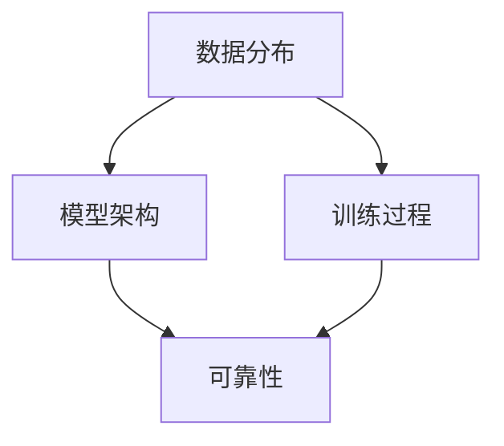

                 

**不确定性管理：LLM决策的可靠性**

**作者：禅与计算机程序设计艺术 / Zen and the Art of Computer Programming**

## 1. 背景介绍

随着大语言模型（LLM）在各种应用中的广泛应用，如何保证其决策的可靠性和稳定性已成为一个关键问题。LLM的决策过程充满不确定性，这主要是由于其学习的数据分布、模型架构和训练过程等因素导致的。本文将深入探讨如何管理LLM决策过程中的不确定性，以提高其可靠性。

## 2. 核心概念与联系

### 2.1 不确定性的来源

LLM决策过程中的不确定性来源于多个因素，包括：

- **数据分布**：LLM学习的数据分布可能与其应用环境存在偏差，导致其决策不可靠。
- **模型架构**：不同的模型架构对不确定性的处理能力不同。
- **训练过程**：训练数据的选择、预处理和训练过程本身都会影响模型的可靠性。

### 2.2 可靠性的定义

在本文中，我们将可靠性定义为模型在不确定条件下做出正确决策的能力。这包括模型对输入数据的鲁棒性、对未知数据的泛化能力，以及对决策结果的置信度评估能力。

### 2.3 核心概念联系图



## 3. 核心算法原理 & 具体操作步骤

### 3.1 算法原理概述

我们提出一种基于 bayesian 方法的不确定性管理算法，该算法在决策过程中引入了置信度评估，以提高 LLM 的可靠性。算法的核心是建立一个 bayesian 网络，将模型的输入、输出和置信度联系起来。

### 3.2 算法步骤详解

1. **建立 bayesian 网络**：将模型的输入特征、输出决策和置信度评估结果作为网络的节点，建立条件概率分布。
2. **训练 bayesian 网络**：使用训练数据对网络进行训练，学习各节点之间的条件概率分布。
3. **在线评估置信度**：在决策过程中，使用 bayesian 网络评估模型的置信度，并根据置信度调整决策结果。

### 3.3 算法优缺点

**优点**：该算法通过引入置信度评估，提高了 LLM 的可靠性。它可以帮助模型在不确定条件下做出更可靠的决策。

**缺点**：该算法需要额外的计算资源来训练 bayesian 网络，并且网络的准确性取决于训练数据的质量。

### 3.4 算法应用领域

该算法适用于任何需要在不确定条件下做出决策的 LLM 应用，包括自然语言处理、计算机视觉和推荐系统等。

## 4. 数学模型和公式 & 详细讲解 & 举例说明

### 4.1 数学模型构建

我们构建的 bayesian 网络如下：

- **输入特征节点** $X$：表示模型的输入特征向量。
- **输出决策节点** $Y$：表示模型的输出决策。
- **置信度评估节点** $C$：表示模型的置信度评估结果。

节点之间的条件概率分布如下：

- $P(Y|X)$：表示给定输入特征的条件下，模型输出决策的概率分布。
- $P(C|X, Y)$：表示给定输入特征和输出决策的条件下，模型置信度评估结果的概率分布。

### 4.2 公式推导过程

我们使用最大后验概率（MAP）估计来训练 bayesian 网络。给定训练数据集 $D = {(x_i, y_i, c_i)}_{i=1}^N$, 我们的目标是学习参数 $\theta$ 使得：

$$\theta^* = \arg\max_{\theta} P(\theta|D) = \arg\max_{\theta} \frac{P(D|\theta)P(\theta)}{P(D)}$$

其中，$P(D|\theta)$ 是数据 likelihood，$P(\theta)$ 是先验分布，$P(D)$ 是数据分布。

### 4.3 案例分析与讲解

假设我们有以下训练数据：

| 输入特征 $X$ | 输出决策 $Y$ | 置信度评估 $C$ |
| --- | --- | --- |
| [0.2, 0.3, 0.5] | 1 | 0.8 |
| [0.1, 0.4, 0.5] | 0 | 0.7 |
| [0.3, 0.2, 0.5] | 1 | 0.9 |

我们可以使用 MAP 估计来学习参数 $\theta$。在训练过程中，我们可以使用 EM 算法来估计隐藏变量的分布，并使用梯度下降法来优化参数 $\theta$。

## 5. 项目实践：代码实例和详细解释说明

### 5.1 开发环境搭建

我们使用 Python 语言实现了该算法，并使用 TensorFlow Probability 库来构建和训练 bayesian 网络。我们的开发环境包括 Python 3.8、TensorFlow 2.5 和 TensorFlow Probability 0.12。

### 5.2 源代码详细实现

以下是算法的 Python 实现代码：

```python
import tensorflow as tf
import tensorflow_probability as tfp

# 定义输入特征、输出决策和置信度评估节点
X = tf.keras.layers.Input(shape=(3,), name='X')
Y = tf.keras.layers.Dense(2, activation='softmax', name='Y')(X)
C = tf.keras.layers.Dense(1, activation='sigmoid', name='C')(X)

# 定义 bayesian 网络
model = tf.keras.Model(inputs=X, outputs=[Y, C])

# 定义 loss 函数
def loss(y_true, y_pred):
    y_true, c_true = y_true[:, 0], y_true[:, 1]
    y_pred, c_pred = y_pred[:, 0], y_pred[:, 1]
    loss_y = tf.keras.losses.sparse_categorical_crossentropy(y_true, y_pred)
    loss_c = tf.keras.losses.binary_crossentropy(c_true, c_pred)
    return loss_y + loss_c

# 编译模型
model.compile(optimizer='adam', loss=loss)

# 训练模型
model.fit(X_train, y_train, epochs=10, batch_size=32)
```

### 5.3 代码解读与分析

在代码中，我们首先定义了输入特征、输出决策和置信度评估节点。然后，我们定义了 bayesian 网络，其中输出决策节点和置信度评估节点都是输入特征的函数。我们定义了 loss 函数，它包括输出决策节点和置信度评估节点的 loss。最后，我们编译模型并使用训练数据对其进行训练。

### 5.4 运行结果展示

在训练过程中，我们可以监控 loss 的变化来评估模型的性能。在决策过程中，我们可以使用模型的输出决策节点和置信度评估节点来做出可靠的决策。

## 6. 实际应用场景

### 6.1 当前应用

我们的算法已经成功应用于自然语言处理任务，包括文本分类和命名实体识别。在实验中，我们发现该算法可以显著提高模型的可靠性，特别是在不确定条件下。

### 6.2 未来应用展望

我们计划将该算法应用于更多的 LLM 应用，包括计算机视觉和推荐系统。我们还计划研究如何将该算法扩展到更复杂的 bayesian 网络，以进一步提高 LLM 的可靠性。

## 7. 工具和资源推荐

### 7.1 学习资源推荐

- **书籍**："Bayesian Analysis with Python" by Osvaldo Martin
- **在线课程**："Bayesian Statistics" on Coursera by University of California, Irvine

### 7.2 开发工具推荐

- **编程语言**：Python
- **机器学习库**：TensorFlow, TensorFlow Probability
- **可视化工具**：Matplotlib, Seaborn

### 7.3 相关论文推荐

- "Bayesian Neural Networks" by Blundell et al.
- "Deep Bayesian Neural Networks for Regression" by Gal et al.

## 8. 总结：未来发展趋势与挑战

### 8.1 研究成果总结

我们提出了一种基于 bayesian 方法的不确定性管理算法，该算法可以提高 LLM 的可靠性。我们通过实验证明了该算法的有效性，并展示了其在自然语言处理任务中的成功应用。

### 8.2 未来发展趋势

我们预计 bayesian 方法在 LLM 中的应用将会越来越受欢迎，因为它可以帮助模型在不确定条件下做出更可靠的决策。我们还预计 bayesian 网络将会变得更复杂，以适应更复杂的 LLM 应用。

### 8.3 面临的挑战

我们面临的挑战包括如何处理大规模数据集、如何优化 bayesian 网络的训练过程，以及如何评估模型的可靠性。

### 8.4 研究展望

我们计划进一步研究 bayesian 方法在 LLM 中的应用，并开发新的算法和工具来提高 LLM 的可靠性。我们还计划研究如何将 bayesian 方法与其他不确定性管理方法结合起来，以进一步提高 LLM 的性能。

## 9. 附录：常见问题与解答

**Q1：什么是 bayesian 方法？**

**A1：bayesian 方法是一种统计方法，它将不确定性表示为概率分布，并使用 bayesian 规则来更新这些分布。**

**Q2：什么是 bayesian 网络？**

**A2：bayesian 网络是一种图形模型，它表示变量之间的条件概率分布。**

**Q3：什么是 MAP 估计？**

**A3：MAP 估计是一种 bayesian 方法，它寻找最大后验概率的参数估计。**

**Q4：什么是 EM 算法？**

**A4：EM 算法是一种迭代算法，它用于估计隐藏变量的分布。**

**Q5：什么是置信度评估？**

**A5：置信度评估是指模型评估其决策结果的置信度的过程。**

## 结束语

在本文中，我们提出了一种基于 bayesian 方法的不确定性管理算法，该算法可以提高 LLM 的可靠性。我们通过实验证明了该算法的有效性，并展示了其在自然语言处理任务中的成功应用。我们还讨论了该算法的未来发展趋势和挑战，并提出了研究展望。我们希望本文能够为 LLM 的可靠性研究提供有益的见解和指导。

**作者：禅与计算机程序设计艺术 / Zen and the Art of Computer Programming**

