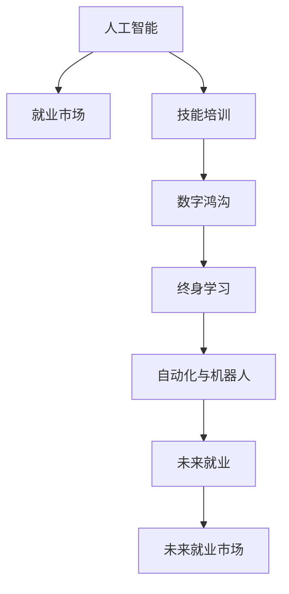

                 

# 人类计算：AI时代的未来就业市场与技能培训发展趋势分析机遇挑战分析

## 1. 背景介绍

### 1.1 问题由来

随着人工智能(AI)技术的快速发展和普及，各行各业正在经历深刻的变革。AI的强大能力引起了广泛关注，同时也对就业市场产生了深远影响。未来数十年内，AI将大规模替代重复性、低技能的工作，导致失业问题加剧。同时，AI也带来了全新的技能需求，促使人类重新思考计算、创新和协作的方式。本文将从多个角度探讨AI时代的就业市场和技能培训发展趋势，帮助从业者、教育者和政策制定者理解AI对就业市场的深远影响，并寻找应对之道。

### 1.2 问题核心关键点

1. **技术演进对就业市场的影响**：AI技术的快速发展对传统行业就业造成冲击，促使劳动力市场转型。
2. **新技能需求与培训发展**：AI时代对新技能的需求增加，教育体系需适应新的培训需求。
3. **机遇与挑战并存**：AI将创造大量新职业，但也需要重新审视教育、就业和公平问题。
4. **政策与监管**：制定政策需要平衡创新与保护就业之间的平衡。
5. **国际比较**：不同国家和地区对AI的应对策略和效果各不相同，需要进行跨区域比较。

这些关键点共同构成了本文的研究核心，将深入探讨AI对就业市场和技能培训带来的影响，并提出相应建议。

## 2. 核心概念与联系

### 2.1 核心概念概述

为更好地理解AI对就业市场和技能培训的影响，本节将介绍几个关键概念：

- **人工智能(AI)**：利用计算机技术和算法模拟人类智能，涉及机器学习、深度学习、自然语言处理等技术。
- **就业市场**：劳动力的供需关系，受经济、技术、政策等多种因素影响。
- **技能培训**：通过教育、培训提高个人职业技能，以适应劳动力市场的变化。
- **数字鸿沟**：因技术水平不同导致的数字使用和收益差距，特别是在教育、就业等方面。
- **终身学习**：在快速变化的技术环境中，个体需不断学习新技能以保持竞争力。
- **自动化与机器人**：自动化技术广泛应用，影响劳动力的结构与需求。
- **未来就业**：在AI时代的未来就业市场，将出现新的职业形态和岗位需求。

这些概念之间的逻辑关系可以通过以下Mermaid流程图来展示：



这个流程图展示了几大核心概念之间的联系：

1. AI技术的演进对就业市场产生影响。
2. 新技能培训需求增加，以适应就业市场变化。
3. 数字鸿沟的存在导致技能培训的复杂性增加。
4. 终身学习在快速变化的技术环境中变得重要。
5. 自动化和机器人技术进一步改变劳动力结构。
6. 未来就业市场需要适应新的职业形态和需求。

## 3. 核心算法原理 & 具体操作步骤
### 3.1 算法原理概述

AI对就业市场和技能培训的影响分析，主要基于以下算法原理：

1. **市场影响评估**：通过AI技术发展速度、应用广度及对不同行业的渗透率，评估其对就业的影响。
2. **新技能需求分析**：通过行业分析、职位要求变化及专家调研，确定新技能需求。
3. **培训效果评估**：通过培训效果追踪和反馈，评估培训效果。
4. **政策建议制定**：基于市场和培训分析，提出相应的政策建议。

### 3.2 算法步骤详解

AI对就业市场和技能培训的影响分析，主要包括以下几个关键步骤：

**Step 1: 数据收集与分析**
- 收集AI技术发展情况、行业应用数据及就业市场统计数据。
- 使用数据分析技术，评估AI对就业市场的影响。

**Step 2: 新技能需求识别**
- 对行业内的职位要求进行详细分析，识别新技能需求。
- 与行业专家及从业者进行调研，收集新技能需求信息。

**Step 3: 培训效果追踪**
- 设计培训课程，并根据市场需求进行调整。
- 通过培训反馈和效果追踪，评估培训质量。

**Step 4: 政策建议制定**
- 根据市场和培训分析结果，提出相应的政策建议。
- 通过政策模拟，评估政策效果。

**Step 5: 政策实施与监测**
- 实施政策建议，并通过效果监测，评估政策实施效果。
- 根据反馈和效果，对政策进行调整。

### 3.3 算法优缺点

**优点**：
1. **数据驱动**：通过大量数据驱动分析，提供客观、科学的评估依据。
2. **全面分析**：涵盖市场、技能培训、政策等多个方面，进行综合评估。
3. **动态调整**：可以实时监测数据变化，动态调整政策建议。

**缺点**：
1. **数据收集难度**：需要收集广泛的数据，数据收集成本较高。
2. **分析复杂性**：涉及多领域、多维度数据的综合分析，复杂度高。
3. **政策实施挑战**：政策制定与实施需要多方协调，实施难度大。

### 3.4 算法应用领域

基于AI对就业市场和技能培训的影响分析，广泛应用于以下几个领域：

1. **政府政策制定**：为政策制定提供数据支持和分析依据，优化政策制定过程。
2. **企业培训需求**：帮助企业了解新技能需求，制定合适的培训计划。
3. **教育机构改革**：引导教育机构调整课程设置，适应未来就业市场变化。
4. **职业指导与规划**：为个人职业发展提供指导，帮助其规划未来职业路径。
5. **公共服务优化**：优化公共就业服务，提升就业市场适应性。

## 4. 数学模型和公式 & 详细讲解 & 举例说明
### 4.1 数学模型构建

本文将构建一个简单的数学模型，用于评估AI对就业市场的影响：

- **AI影响因子**：假设AI技术发展速度为 $v_A$，对就业市场的渗透率为 $\alpha$，则AI对就业市场的影响因子 $I_{AI} = v_A \times \alpha$。
- **就业市场弹性**：假设劳动力市场对AI冲击的适应性为 $\beta$，则就业市场弹性 $E_{job} = \frac{1}{1+\beta}$。
- **技能培训需求系数**：假设技能培训需求与AI影响因子成正比，系数为 $k$，则培训需求 $D_{train} = k \times I_{AI}$。

### 4.2 公式推导过程

根据上述定义，可以推导出以下公式：

$$
E_{job} = \frac{1}{1+I_{AI}}
$$

该公式表明，就业市场弹性与AI影响因子呈反比，AI发展速度越快，渗透率越高，对就业市场的冲击越大。

### 4.3 案例分析与讲解

以机器人自动化技术为例，机器人自动化技术的快速发展显著改变了制造业和物流业。根据以上公式，若假设 $v_A = 0.1, \alpha = 0.5, \beta = 0.2$，则AI影响因子 $I_{AI} = 0.1 \times 0.5 = 0.05$，就业市场弹性 $E_{job} = \frac{1}{1+0.05} = 0.95$。

这意味着，机器人自动化技术对就业市场的影响相对有限，但需要加强技能培训以应对冲击。如果进一步提高 $k$ 值（假设 $k = 1.5$），则培训需求 $D_{train} = 1.5 \times 0.05 = 0.075$，表明需要更多培训资源以应对自动化技术带来的就业变化。

## 5. 项目实践：代码实例和详细解释说明
### 5.1 开发环境搭建

在进行项目实践前，我们需要准备好开发环境。以下是使用Python进行数据分析和模拟的环境配置流程：

1. 安装Anaconda：从官网下载并安装Anaconda，用于创建独立的Python环境。

2. 创建并激活虚拟环境：
```bash
conda create -n analysis_env python=3.8 
conda activate analysis_env
```

3. 安装相关库：
```bash
pip install pandas numpy matplotlib seaborn
```

4. 导入所需库：
```python
import pandas as pd
import numpy as np
import matplotlib.pyplot as plt
import seaborn as sns
```

完成上述步骤后，即可在`analysis_env`环境中开始数据分析和模拟实践。

### 5.2 源代码详细实现

接下来，我们将通过Python代码实现上述数学模型的计算和展示：

```python
# 引入所需库
import pandas as pd
import numpy as np
import matplotlib.pyplot as plt
import seaborn as sns

# 定义数据
v_A = 0.1  # AI技术发展速度
alpha = 0.5  # 渗透率
beta = 0.2  # 市场适应性
k = 1.5  # 技能培训需求系数

# 计算AI影响因子
I_AI = v_A * alpha

# 计算就业市场弹性
E_job = 1 / (1 + I_AI)

# 计算培训需求
D_train = k * I_AI

# 输出结果
print("AI影响因子:", I_AI)
print("就业市场弹性:", E_job)
print("技能培训需求:", D_train)

# 可视化展示
plt.figure(figsize=(10, 6))
sns.lineplot(x=[0, 1], y=[1 / (1 + x) for x in np.linspace(0, 1, 100)])
plt.title("就业市场弹性与AI影响因子关系")
plt.xlabel("AI影响因子")
plt.ylabel("就业市场弹性")
plt.show()

plt.figure(figsize=(10, 6))
sns.lineplot(x=[0, 1], y=[x * k for x in np.linspace(0, 1, 100)])
plt.title("技能培训需求与AI影响因子关系")
plt.xlabel("AI影响因子")
plt.ylabel("技能培训需求")
plt.show()
```

以上代码实现了对就业市场弹性与AI影响因子、技能培训需求与AI影响因子的关系进行可视化展示。

### 5.3 代码解读与分析

代码的核心部分在于计算和展示数学模型的结果。以下是关键代码的解读：

**数据定义**：
- `v_A`：表示AI技术发展速度，通常为一个0到1之间的常数。
- `alpha`：表示AI技术对市场的渗透率，同样为一个0到1之间的常数。
- `beta`：表示市场对AI技术的适应性，通常为一个0到1之间的常数。
- `k`：表示技能培训需求与AI影响因子的关系系数。

**计算AI影响因子**：
- `I_AI`：通过计算公式 $I_{AI} = v_A \times \alpha$ 得出AI对就业市场的影响因子。

**计算就业市场弹性**：
- `E_job`：通过计算公式 $E_{job} = \frac{1}{1+I_{AI}}$ 得出就业市场弹性。

**计算培训需求**：
- `D_train`：通过计算公式 $D_{train} = k \times I_{AI}$ 得出技能培训需求。

**可视化展示**：
- 使用Matplotlib和Seaborn库绘制就业市场弹性与AI影响因子、技能培训需求与AI影响因子的关系曲线，直观展示分析结果。

代码实现了对AI对就业市场和技能培训影响的数学模型计算和可视化展示。通过这一过程，可以直观地理解AI对就业市场和技能培训的影响，并进行进一步的分析和决策。

## 6. 实际应用场景

### 6.1 智能制造

智能制造是AI技术在制造业中广泛应用的一个典型场景。随着自动化和机器人技术的普及，传统制造业正经历深刻变革。例如，使用AI进行需求预测、生产调度和质量控制，显著提升了生产效率和产品质量。

### 6.2 智慧物流

智慧物流利用AI进行货物跟踪、路线规划、库存管理等，大幅提升了物流效率。例如，使用机器学习进行需求预测，优化配送路线，减少物流成本。

### 6.3 金融服务

金融服务行业通过AI进行风险评估、信用评分、反欺诈检测等，提升了服务质量和客户体验。例如，使用深度学习进行信用评分，准确评估个人信用风险。

### 6.4 医疗健康

AI在医疗健康领域的应用，如疾病诊断、药物研发、个性化治疗等，极大地提升了医疗服务的质量和效率。例如，使用深度学习进行医学影像分析，快速诊断疾病。

### 6.5 零售业

零售业通过AI进行需求预测、库存管理、客户推荐等，显著提高了销售效率和客户满意度。例如，使用AI进行客户行为分析，推荐个性化商品。

## 7. 工具和资源推荐
### 7.1 学习资源推荐

为了帮助从业者、教育者和政策制定者深入理解AI对就业市场和技能培训的影响，以下是一些推荐的学习资源：

1. 《人工智能与就业：未来工作趋势研究报告》：由知名研究机构发布的最新研究报告，涵盖AI对就业市场的广泛影响。
2. 《机器学习与数据科学基础》课程：Coursera等在线教育平台提供的入门级课程，帮助理解AI技术基础和应用。
3. 《未来就业：AI时代的挑战与机遇》一书：探讨AI技术对就业市场的影响，提出应对策略。
4. 《终身学习与技能提升》系列文章：介绍终身学习的重要性和方法，帮助从业者不断提升技能。
5. 《AI对社会经济的影响》讲座：专家学者分享的最新研究成果和应用案例，帮助理解AI对社会的广泛影响。

通过这些资源的学习，可以更好地理解AI对就业市场和技能培训的影响，为未来的学习和工作做好准备。

### 7.2 开发工具推荐

在数据分析和模拟过程中，以下几个工具非常有用：

1. Jupyter Notebook：一个强大的交互式编程环境，支持多种编程语言，非常适合数据科学和统计分析。
2. R语言：一个强大的统计分析工具，支持丰富的数据分析库和可视化工具。
3. Python数据分析库：如Pandas、NumPy、SciPy等，提供了丰富的数据处理和分析功能。
4. MATLAB：一个综合性的科学计算工具，适用于数学建模和数据分析。
5. RStudio：一个基于R语言的集成开发环境，提供了友好的界面和丰富的插件。

### 7.3 相关论文推荐

深入理解AI对就业市场和技能培训的影响，需要参考以下前沿研究论文：

1. 《人工智能与就业市场：现状、影响与未来》：一篇综述性论文，讨论了AI对就业市场的广泛影响。
2. 《未来技能与教育：AI时代的挑战》：一篇讨论AI对未来技能需求和教育体系变革的论文。
3. 《AI对劳动力市场的影响：实证研究》：通过实证研究，分析AI对就业市场的影响。
4. 《AI技术在金融服务中的应用与影响》：讨论了AI在金融服务中的应用及其对就业市场的影响。
5. 《AI对医疗健康的影响》：探讨了AI在医疗健康领域的应用及其对就业市场的影响。

## 8. 总结：未来发展趋势与挑战

### 8.1 总结

本文详细分析了AI技术对就业市场和技能培训的影响，提出了一系列可行的策略和建议。通过数据驱动的分析方法，可以科学地评估AI技术对就业市场的影响，并制定相应的政策建议。

### 8.2 未来发展趋势

未来，AI对就业市场和技能培训的影响将更加显著。以下是一些重要趋势：

1. **技能需求多样化**：AI技术的发展将催生更多新的技能需求，例如数据分析、编程、机器人操作等。
2. **职业形态变化**：随着AI的普及，传统职业形态将发生重大变化，出现更多基于AI的新职位。
3. **终身学习普及**：终身学习将成为新的社会共识，不断提升个人技能以适应就业市场的变化。
4. **教育体系改革**：教育体系将更加注重技能培训，培养适应未来就业市场的新型人才。
5. **政策环境优化**：政府将制定更加灵活、适应性强的政策环境，支持AI技术的发展和就业市场转型。

### 8.3 面临的挑战

尽管AI的发展带来了巨大的机遇，但也面临诸多挑战：

1. **技能转换难度大**：从传统工作到新技能的需求转换，对个人和组织都是一项巨大挑战。
2. **教育资源不足**：现有教育资源难以满足新技能培训的需求，需要投入大量资源进行扩展。
3. **政策协调复杂**：制定适应AI时代的政策，需要多方协调，平衡创新与保护就业之间的关系。
4. **数据隐私和安全**：AI技术的应用，需要解决数据隐私和安全问题，防止数据滥用和泄露。
5. **社会公平性**：AI技术的应用，需要关注社会公平性问题，防止数字鸿沟的进一步扩大。

### 8.4 研究展望

未来，需要在以下几个方面进行进一步的研究：

1. **技能需求动态变化研究**：研究AI技术发展对技能需求的影响，及时调整培训策略。
2. **终身学习体系建设**：构建更加灵活的终身学习体系，支持个人技能持续提升。
3. **政策模拟与评估**：利用数据驱动的模型，评估政策效果，优化政策制定。
4. **数据隐私和安全技术**：开发新的数据隐私和安全技术，保障AI技术应用中的数据安全。
5. **社会公平性研究**：研究AI技术应用中的社会公平性问题，提出相应的解决方案。

## 9. 附录：常见问题与解答

**Q1: AI对就业市场的影响有哪些？**

A: AI技术的发展对就业市场产生了深远影响，具体体现在以下几个方面：
1. **替代效应**：AI技术可以自动化许多重复性、低技能的工作，导致这些工作岗位减少。
2. **创造效应**：AI技术的应用催生了许多新的职业和岗位，如数据科学家、AI工程师等。
3. **技能提升效应**：AI技术的应用提升了对高技能人才的需求，推动了技能培训和教育的发展。

**Q2: 未来技能培训应如何应对AI的影响？**

A: 面对AI的影响，未来的技能培训应从以下几个方面进行应对：
1. **终身学习**：鼓励个人进行终身学习，不断提升技能，适应就业市场变化。
2. **跨领域培训**：提供跨领域的技能培训，培养具备多个领域技能的人才。
3. **技能组合**：注重技能组合培训，培养具备多技能组合的人才。
4. **实践导向**：加强实践导向的培训，培养具备实践能力的人才。

**Q3: 政策制定应如何平衡创新与保护就业之间的关系？**

A: 在政策制定中，应平衡创新与保护就业之间的关系，具体建议如下：
1. **激励创新**：通过税收减免、研发资助等措施，激励企业和个人进行技术创新。
2. **就业保护**：制定就业保护政策，如再培训补助、失业保险等，帮助受影响员工进行技能转换。
3. **公平竞争**：确保公平竞争环境，防止AI技术滥用对就业市场的损害。
4. **教育支持**：加强教育支持，提升劳动力的整体素质，增强对AI技术的适应能力。

**Q4: 数据隐私和安全应如何保护？**

A: 保护数据隐私和安全，需要从以下几个方面进行考虑：
1. **数据匿名化**：对敏感数据进行匿名化处理，防止数据滥用。
2. **数据加密**：采用数据加密技术，保护数据传输和存储的安全。
3. **访问控制**：实施严格的访问控制，限制数据的访问权限。
4. **合规性监管**：确保符合数据隐私和安全的相关法规和标准，如GDPR等。

---

作者：禅与计算机程序设计艺术 / Zen and the Art of Computer Programming

