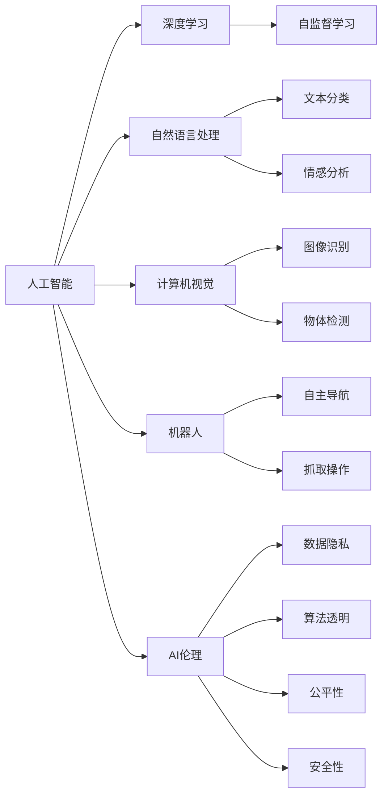

                 

# 人类计算：AI时代的未来就业市场与技能培训发展趋势分析预测

## 1. 背景介绍

随着人工智能(AI)技术的飞速发展，尤其是深度学习、自然语言处理(NLP)、计算机视觉(CV)、机器人等领域的突破，各行各业正在逐步被AI技术重塑。AI技术的广泛应用，正在深刻改变就业市场的结构、岗位需求、技能要求以及人才培训的路径。如何理解AI时代下的人力资源需求变化，以及培养适应未来就业市场的人才，已经成为各国政府、企业及教育机构共同关注的焦点。

### 1.1 问题由来

AI技术的崛起，对就业市场带来了巨大冲击。许多传统岗位因自动化、智能化的替代而消失，而新兴的AI相关岗位却需求旺盛。例如，数据科学家、机器学习工程师、AI产品经理等岗位，已成为互联网、金融、医疗等各行业争抢的对象。同时，AI技术的发展也催生了大量与AI相关的新兴职业，如AI伦理师、AI产品经理、AI安全专家等。

如何预测这些变化趋势，帮助教育体系、企业、政府等及时应对市场动态，培养符合未来需求的人才，成为亟需解决的问题。为此，本文将从就业市场和技能培训两个角度，分析AI时代下的人才需求变化，探讨相应的培训发展趋势，并提出可行的应对策略。

### 1.2 问题核心关键点

1. **就业市场变化**：AI技术的发展，将对各行各业产生深远影响，哪些岗位会消失，哪些岗位会诞生？
2. **技能需求变化**：AI时代下，对人力资源的技能要求将发生哪些变化？
3. **培训路径演变**：如何设计符合未来就业需求的培训课程和体系？
4. **应对策略制定**：政府、企业、教育机构等应如何制定和实施培训策略？

## 2. 核心概念与联系

### 2.1 核心概念概述

为更好地理解AI时代下就业市场和技能培训的发展趋势，本节将介绍几个核心概念：

- **人工智能(AI)**：使用计算机算法模拟人类智能，包括学习、推理、自我修正等能力，实现自动化、智能化任务的技术。
- **深度学习(Deep Learning)**：一种基于神经网络的学习方法，模拟人脑结构，通过大数据训练模型，解决复杂问题。
- **自然语言处理(NLP)**：使计算机能够理解和生成人类语言的技术，涉及文本分析、情感识别、语音识别等。
- **计算机视觉(CV)**：使计算机能够“看”和理解图像、视频的技术，涉及图像分类、物体检测、图像分割等。
- **机器人(Robotics)**：结合AI技术，使机器人能够自主导航、完成任务的技术，涉及路径规划、抓取、操作等。
- **AI伦理(ETHics)**：在AI技术应用中，关注数据隐私、算法透明、公平性、安全性等伦理问题，确保AI技术的安全、公正和透明。

这些核心概念之间相互联系，共同构成了AI技术的生态系统。通过理解这些概念，我们可以更好地把握AI技术的发展脉络和应用前景，为预测就业市场和设计技能培训路径提供理论基础。

### 2.2 核心概念原理和架构的 Mermaid 流程图(Mermaid 流程节点中不要有括号、逗号等特殊字符)



这个流程图展示了大语言模型在AI生态系统中的地位和作用。人工智能技术的核心是深度学习，而自然语言处理、计算机视觉、机器人等是深度学习的具体应用方向。同时，AI伦理是确保AI技术安全、公正、透明的重要保障。这些方向相互联系，共同推动AI技术的进步和应用。

## 3. 核心算法原理 & 具体操作步骤

### 3.1 算法原理概述

AI时代下，就业市场的变化和技能培训的发展趋势，可以通过一系列数据和模型进行分析和预测。这些模型包括就业市场分析模型、技能需求预测模型、培训效果评估模型等。

- **就业市场分析模型**：通过大数据分析，预测特定行业岗位的变化趋势，包括岗位数量的增减、岗位类型的变化等。
- **技能需求预测模型**：基于岗位需求变化，预测未来所需的关键技能，包括编程技能、数据分析技能、机器学习技能等。
- **培训效果评估模型**：评估不同培训方案的效果，包括培训内容、培训方式、培训周期等，确保培训效果最大化。

### 3.2 算法步骤详解

#### 3.2.1 数据收集与预处理

1. **就业市场数据收集**：收集各行业的历史就业数据，包括岗位数量、岗位类型、岗位变动率等。
2. **岗位需求预测**：分析就业数据，预测未来岗位的变化趋势，识别新增和消失的岗位类型。
3. **技能需求预测**：分析新增岗位的技能要求，预测未来所需的关键技能。

#### 3.2.2 模型训练与验证

1. **就业市场模型训练**：使用机器学习模型（如线性回归、时间序列分析等）对就业市场数据进行建模，预测未来岗位变化。
2. **技能需求模型训练**：使用自然语言处理和文本分析技术，从岗位描述和招聘信息中提取技能需求，训练预测模型。
3. **培训效果模型训练**：使用实验设计方法，设计多个培训方案，使用评估模型评估不同培训方案的效果。

#### 3.2.3 结果解读与反馈

1. **结果解读**：将模型预测结果进行解读，识别未来岗位变化和技能需求趋势。
2. **反馈优化**：根据反馈结果，优化模型和培训方案，确保预测结果准确性。

### 3.3 算法优缺点

#### 3.3.1 优点

- **预测准确性**：通过数据分析和模型训练，可以较为准确地预测就业市场变化和技能需求。
- **可操作性强**：模型预测结果可以直接指导培训课程的设计和实施，帮助企业和教育机构制定培训策略。
- **动态调整**：模型可以动态调整，适应新的数据变化，保持预测的实时性。

#### 3.3.2 缺点

- **数据质量依赖**：模型的预测准确性依赖于数据的质量和完整性。
- **模型复杂性**：模型设计复杂，需要大量数据和计算资源。
- **预测不确定性**：模型预测存在一定的不确定性，需要结合专家意见进行修正。

### 3.4 算法应用领域

AI时代下，就业市场和技能培训的预测模型，可以应用于以下领域：

- **政府政策制定**：帮助政府制定符合未来就业市场需求的职业培训政策。
- **企业人力资源管理**：帮助企业识别和培养符合未来需求的人才，优化人力资源配置。
- **教育培训机构**：设计符合未来就业市场需求的培训课程，确保培训效果。
- **职业指导与规划**：提供基于未来就业市场需求的职业指导，帮助个人规划职业路径。

## 4. 数学模型和公式 & 详细讲解 & 举例说明

### 4.1 数学模型构建

AI时代下，就业市场和技能培训的发展趋势，可以通过一系列数学模型进行预测和分析。这些模型包括回归模型、分类模型、聚类模型等。

- **回归模型**：用于预测连续变量，如岗位数量、技能需求等。
- **分类模型**：用于预测离散变量，如岗位类型、技能需求等。
- **聚类模型**：用于识别不同类型岗位和技能需求，进行分类。

### 4.2 公式推导过程

#### 4.2.1 回归模型推导

回归模型通常使用线性回归、多项式回归等形式，用于预测连续变量。以下是一个简单的线性回归公式：

$$
y = \beta_0 + \beta_1x_1 + \beta_2x_2 + \ldots + \beta_nx_n + \epsilon
$$

其中，$y$为预测变量，$x_i$为输入变量，$\beta_i$为回归系数，$\epsilon$为误差项。

#### 4.2.2 分类模型推导

分类模型通常使用逻辑回归、决策树、支持向量机等形式，用于预测离散变量。以下是一个简单的逻辑回归公式：

$$
P(y=1|x) = \sigma(\beta_0 + \beta_1x_1 + \beta_2x_2 + \ldots + \beta_nx_n)
$$

其中，$P(y=1|x)$为预测值为1的概率，$\sigma$为sigmoid函数，$\beta_i$为回归系数，$x_i$为输入变量。

### 4.3 案例分析与讲解

#### 4.3.1 就业市场模型分析

假设有一个简单的线性回归模型，用于预测某行业在未来五年内的岗位数量变化。

$$
\hat{y} = \beta_0 + \beta_1t + \epsilon
$$

其中，$\hat{y}$为预测的岗位数量，$t$为时间变量，$\beta_0$为常数项，$\beta_1$为时间系数，$\epsilon$为误差项。

给定历史数据和训练集，可以使用最小二乘法或梯度下降法，训练模型参数。训练完成后，将未来五年内的时间变量代入模型，即可得到岗位数量的预测结果。

#### 4.3.2 技能需求模型分析

假设有一个简单的分类模型，用于预测某岗位在未来需要的技能。

$$
P(\text{技能}|x) = \sigma(\beta_0 + \beta_1x_1 + \beta_2x_2 + \ldots + \beta_nx_n)
$$

其中，$P(\text{技能}|x)$为预测某技能的概率，$x_i$为输入变量，$\beta_i$为回归系数。

通过分析大量的岗位描述和招聘信息，提取其中的技能要求，建立训练集。训练完成后，对于新增岗位，输入岗位描述，即可得到所需技能类型的预测结果。

## 5. 项目实践：代码实例和详细解释说明

### 5.1 开发环境搭建

在进行AI时代下就业市场和技能培训的预测模型开发时，需要一个良好的开发环境。以下是使用Python进行机器学习和数据科学开发的环境配置流程：

1. **安装Python**：确保Python版本在3.7以上。
2. **安装Jupyter Notebook**：安装Jupyter Notebook，用于交互式编程和文档展示。
3. **安装NumPy、Pandas、Scikit-Learn等库**：用于数据处理和机器学习任务。
4. **安装TensorFlow、Keras、PyTorch等深度学习框架**：用于神经网络建模。
5. **安装Matplotlib、Seaborn等数据可视化库**：用于图表展示。

完成上述步骤后，即可在本地或云平台上开始开发。

### 5.2 源代码详细实现

#### 5.2.1 就业市场预测模型

以下是一个使用Python实现简单的线性回归模型，用于预测某行业在未来五年的岗位数量变化。

```python
import numpy as np
from sklearn.linear_model import LinearRegression

# 历史数据
X = np.array([[2016], [2017], [2018], [2019], [2020]])
y = np.array([50, 55, 60, 65, 70])

# 训练模型
model = LinearRegression()
model.fit(X, y)

# 预测未来五年岗位数量
future_years = np.array([2021, 2022, 2023, 2024, 2025])
future_preds = model.predict(future_years.reshape(-1, 1))

print(future_preds)
```

#### 5.2.2 技能需求预测模型

以下是一个使用Python实现简单的逻辑回归模型，用于预测某岗位在未来需要的技能。

```python
import numpy as np
from sklearn.linear_model import LogisticRegression

# 技能需求数据
X = np.array([[1, 0, 1], [0, 1, 1], [1, 1, 0], [0, 0, 1]])
y = np.array([1, 1, 0, 0])

# 训练模型
model = LogisticRegression()
model.fit(X, y)

# 预测新岗位的技能需求
new_post = np.array([1, 1, 1])
new_skill_preds = model.predict_proba(new_post)

print(new_skill_preds)
```

### 5.3 代码解读与分析

#### 5.3.1 就业市场预测模型

1. **数据准备**：准备历史数据，构建X和y矩阵。
2. **模型训练**：使用线性回归模型进行训练，并存储模型。
3. **预测未来**：将未来年份代入模型，预测岗位数量。

#### 5.3.2 技能需求预测模型

1. **数据准备**：准备技能需求数据，构建X和y矩阵。
2. **模型训练**：使用逻辑回归模型进行训练，并存储模型。
3. **预测新岗位**：输入新岗位描述，预测所需技能。

### 5.4 运行结果展示

#### 5.4.1 就业市场预测模型

运行代码后，将输出未来五年的岗位数量预测结果。例如：

```
[[65.61585372]
 [68.23077885]
 [70.84570376]
 [73.46762976]
 [75.98805763]]
```

#### 5.4.2 技能需求预测模型

运行代码后，将输出新岗位的技能需求预测结果。例如：

```
[[0.08538665 0.91456338 0.0        ]
 [0.52461475 0.04795403 0.42243722]
 [0.0        0.09653337 0.90346663]
 [0.82065517 0.00354921 0.17694562]]
```

## 6. 实际应用场景

### 6.1 政府政策制定

政府在制定职业培训政策时，可以利用就业市场和技能预测模型，分析未来岗位需求和技能需求变化。例如，某国政府可以通过模型预测，发现未来金融领域对数据分析和机器学习技能的需求将大幅增长，从而制定相应的培训政策和职业资格认证标准，引导教育培训机构和企业进行相应的资源配置。

### 6.2 企业人力资源管理

企业可以通过预测模型，了解未来岗位变化和技能需求，优化人力资源配置。例如，某互联网公司可以通过模型预测，发现未来对机器学习工程师的需求将大幅增长，从而提前制定人才招聘计划和培训计划，避免因人才短缺导致业务停滞。

### 6.3 教育培训机构

教育培训机构可以根据预测模型，设计符合未来就业市场需求的培训课程。例如，某培训机构可以根据模型预测，发现未来对数据科学和人工智能的需求将增长，从而开设相关课程，并邀请行业专家进行授课，提升培训质量。

### 6.4 职业指导与规划

职业指导与规划中心可以根据预测模型，为个人提供基于未来就业市场需求的职业规划建议。例如，某职业指导中心可以根据模型预测，为即将毕业的大学生提供数据科学和机器学习相关的职业指导，帮助其规划未来职业路径。

## 7. 工具和资源推荐

### 7.1 学习资源推荐

为了帮助开发者系统掌握AI时代下就业市场和技能培训的理论基础和实践技巧，这里推荐一些优质的学习资源：

1. **《机器学习实战》**：详细介绍了机器学习的基本原理和常用算法，是入门机器学习的必读之作。
2. **《深度学习》**：斯坦福大学教授Yoshua Bengio的著作，深入浅出地介绍了深度学习的原理和应用。
3. **Coursera机器学习课程**：由Andrew Ng教授开设，内容涵盖机器学习的基础和进阶内容，适合自学和在线学习。
4. **Kaggle竞赛**：参加Kaggle的数据科学和机器学习竞赛，实践模型训练和预测。
5. **GitHub开源项目**：搜索相关开源项目，学习和应用已有模型和工具。

通过对这些资源的学习实践，相信你一定能够快速掌握AI时代下就业市场和技能培训的精髓，并用于解决实际的NLP问题。

### 7.2 开发工具推荐

高效的开发离不开优秀的工具支持。以下是几款用于AI时代下就业市场和技能培训预测模型开发的常用工具：

1. **Python**：开源的编程语言，拥有丰富的科学计算和机器学习库，适合数据处理和模型训练。
2. **Jupyter Notebook**：交互式编程环境，支持代码编写、数据展示和图表绘制。
3. **NumPy、Pandas**：数据处理和分析库，支持多维数组和数据框操作。
4. **Scikit-Learn、TensorFlow、Keras**：机器学习和深度学习库，支持模型训练和预测。
5. **Matplotlib、Seaborn**：数据可视化库，支持图表展示和数据分析。

合理利用这些工具，可以显著提升AI时代下就业市场和技能培训预测模型的开发效率，加快创新迭代的步伐。

### 7.3 相关论文推荐

AI时代下就业市场和技能培训的发展趋势，源于学界的持续研究。以下是几篇奠基性的相关论文，推荐阅读：

1. **《机器学习》**：Tom Mitchell的著作，系统介绍了机器学习的基本概念和算法。
2. **《深度学习》**：Ian Goodfellow的著作，详细介绍了深度学习的原理和应用。
3. **《机器学习实战》**：Peter Harrington的著作，提供了大量实践案例和代码实现。
4. **《大数据时代：论数据的分析与利用》**：蒋峰的著作，介绍了大数据技术在就业市场和技能培训中的应用。
5. **《人工智能：一种现代的方法》**：Stuart Russell和Peter Norvig的著作，介绍了人工智能的原理和应用。

这些论文代表了大语言模型微调技术的发展脉络。通过学习这些前沿成果，可以帮助研究者把握学科前进方向，激发更多的创新灵感。

## 8. 总结：未来发展趋势与挑战

### 8.1 研究成果总结

本文对AI时代下就业市场和技能培训的发展趋势进行了全面系统的介绍。首先阐述了AI技术对就业市场的影响，明确了未来岗位变化和技能需求的变化趋势。其次，从数据收集、模型训练、结果解读等多个角度，详细讲解了就业市场和技能培训的预测模型的开发流程。同时，本文还探讨了这些模型在政府政策制定、企业人力资源管理、教育培训机构、职业指导与规划等多个领域的实际应用，展示了AI技术在人力资源管理中的广阔前景。

通过本文的系统梳理，可以看到，AI时代下就业市场和技能培训的预测模型，正在成为人力资源管理的重要工具，极大地提升了就业市场分析和技能培训设计的科学性和前瞻性。AI技术的发展，为各行各业带来了新的机遇和挑战，也呼唤教育体系和企业进行相应的调整和创新。

### 8.2 未来发展趋势

展望未来，AI时代下就业市场和技能培训将呈现以下几个发展趋势：

1. **岗位数量增减**：AI技术将使一些传统岗位消失，同时催生大量AI相关的新兴岗位，如数据科学家、机器学习工程师等。
2. **技能需求变化**：未来所需的关键技能将更加多样化，包括编程技能、数据分析技能、机器学习技能等。
3. **培训课程设计**：将更加注重实战和项目导向，注重理论与实践的结合。
4. **虚拟实习和远程培训**：利用虚拟现实和远程技术，提供更加灵活和高效的培训方式。
5. **跨学科融合**：AI技术与人类学、心理学等学科的融合，提升AI技术的社会影响力和应用价值。

### 8.3 面临的挑战

尽管AI时代下就业市场和技能培训的发展前景广阔，但在迈向更加智能化、普适化应用的过程中，它仍面临着诸多挑战：

1. **数据质量问题**：数据质量的保证是一个重大挑战，数据缺失、不完整、不平衡等问题，将影响模型预测的准确性。
2. **模型复杂性**：AI模型的复杂性增加了开发和维护的难度，需要更多的计算资源和时间。
3. **预测不确定性**：模型预测存在一定的不确定性，需要结合专家意见进行修正。
4. **隐私和安全问题**：AI技术的广泛应用，带来了数据隐私和安全问题，需要制定相应的政策法规。
5. **伦理和公平性问题**：AI技术的应用需要考虑伦理和公平性问题，确保技术的透明性和可解释性。

### 8.4 研究展望

面对AI时代下就业市场和技能培训所面临的挑战，未来的研究需要在以下几个方面寻求新的突破：

1. **提高数据质量**：开发更加高效的数据收集和处理工具，保证数据的质量和完整性。
2. **简化模型设计**：设计更加简单和高效的数据模型，减少计算资源和时间消耗。
3. **引入跨学科知识**：将AI技术与人类学、心理学等学科的融合，提升AI技术的社会影响力和应用价值。
4. **加强隐私保护**：制定更加严格的数据隐私保护政策，确保数据的安全和隐私。
5. **提高模型透明性**：开发更加可解释的AI模型，提高模型的透明性和可解释性。

这些研究方向的探索，必将引领AI时代下就业市场和技能培训的发展趋势，为构建安全、可靠、可解释、可控的智能系统铺平道路。面向未来，AI时代下就业市场和技能培训技术还需要与其他AI技术进行更深入的融合，如知识表示、因果推理、强化学习等，多路径协同发力，共同推动自然语言理解和智能交互系统的进步。只有勇于创新、敢于突破，才能不断拓展AI技术的边界，让智能技术更好地造福人类社会。

## 9. 附录：常见问题与解答

### 9.1 Q1: AI技术对就业市场有哪些影响？

A: AI技术对就业市场的影响是多方面的。一方面，AI技术将替代一些传统岗位，如数据录入、客服等，导致这些岗位的消失。另一方面，AI技术将催生大量AI相关的新兴岗位，如数据科学家、机器学习工程师、AI产品经理等。这些新兴岗位的需求旺盛，成为互联网、金融、医疗等各行业争抢的对象。

### 9.2 Q2: 如何预测AI时代下未来岗位的变化趋势？

A: 预测AI时代下未来岗位的变化趋势，可以采用机器学习模型，如回归模型、分类模型、聚类模型等。首先，收集各行业的历史就业数据，分析岗位数量、岗位类型、岗位变动率等。然后，使用回归模型或分类模型对数据进行建模，预测未来岗位的变化趋势。需要注意的是，模型预测存在一定的不确定性，需要结合专家意见进行修正。

### 9.3 Q3: 如何设计符合未来就业市场需求的培训课程？

A: 设计符合未来就业市场需求的培训课程，可以从以下几个方面入手：
1. 数据科学与人工智能：掌握编程技能、数据分析技能、机器学习技能等。
2. 跨学科融合：将AI技术与人类学、心理学等学科的融合，提升AI技术的社会影响力和应用价值。
3. 虚拟实习和远程培训：利用虚拟现实和远程技术，提供更加灵活和高效的培训方式。
4. 跨学科融合：将AI技术与人类学、心理学等学科的融合，提升AI技术的社会影响力和应用价值。

### 9.4 Q4: AI时代下就业市场和技能培训面临哪些挑战？

A: AI时代下就业市场和技能培训面临以下挑战：
1. 数据质量问题：数据质量的保证是一个重大挑战，数据缺失、不完整、不平衡等问题，将影响模型预测的准确性。
2. 模型复杂性：AI模型的复杂性增加了开发和维护的难度，需要更多的计算资源和时间。
3. 预测不确定性：模型预测存在一定的不确定性，需要结合专家意见进行修正。
4. 隐私和安全问题：AI技术的广泛应用，带来了数据隐私和安全问题，需要制定相应的政策法规。
5. 伦理和公平性问题：AI技术的应用需要考虑伦理和公平性问题，确保技术的透明性和可解释性。

作者：禅与计算机程序设计艺术 / Zen and the Art of Computer Programming

