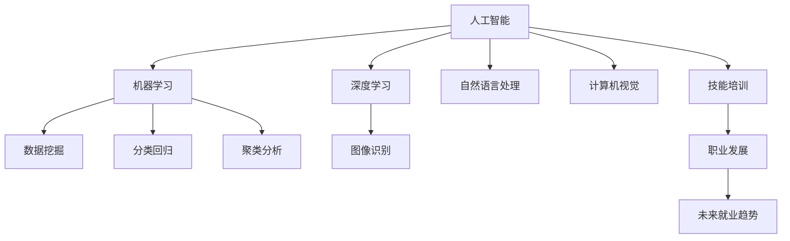

                 

# 人类计算：AI时代的未来就业市场与技能培训发展趋势预测分析机遇

> 关键词：人工智能(AI)、机器学习(ML)、深度学习(Deep Learning)、技能培训、就业市场、职业发展、未来就业趋势

## 1. 背景介绍

随着人工智能(AI)技术的迅猛发展，机器学习(ML)和深度学习(Deep Learning)逐渐成为推动各行各业创新和发展的核心力量。特别是近年来，大规模预训练语言模型和大模型的能力不断突破，为自然语言处理(NLP)、计算机视觉(CV)、语音识别(SR)等领域的实际应用提供了强大的技术支持。与此同时，AI技术的广泛应用也深刻改变了人类工作方式和职业发展路径，对未来的就业市场和技能培训产生了深远影响。

在这一背景下，本文旨在通过对AI时代的就业市场和技能培训趋势的深入分析，探讨技术进步对职场的机遇与挑战，并为从业者提供切实可行的职业发展建议。

## 2. 核心概念与联系

### 2.1 核心概念概述

为更好地理解AI时代就业市场和技能培训的发展趋势，本节将介绍几个密切相关的核心概念：

- 人工智能(AI)：旨在通过模拟人类的思维和决策过程，使机器具备智能化的能力，覆盖了机器学习、深度学习、自然语言处理、计算机视觉等诸多领域。

- 机器学习(ML)：利用算法使机器从数据中学习规律，并应用到实际问题中，如分类、回归、聚类等。

- 深度学习(Deep Learning)：一种特殊的机器学习技术，通过多层神经网络模拟人脑的层次化特征提取与学习过程。

- 就业市场：劳动力的供需关系和职业发展空间，受到技术进步、经济环境、政策法规等多种因素的影响。

- 技能培训：旨在提升从业者技能水平和专业能力，促进职业发展，帮助其在AI时代中保持竞争力。

- 未来就业趋势：预测AI时代各行业的就业变化，包括新增岗位、岗位变化、岗位消失等，以及应对这些变化的策略。

这些概念之间的逻辑关系可以通过以下Mermaid流程图来展示：



这个流程图展示了几者之间的关系：

1. 人工智能是机器学习、深度学习等多个技术领域的总称。
2. 机器学习和深度学习是实现人工智能的核心技术。
3. 自然语言处理和计算机视觉等具体应用领域，是AI技术的实践应用。
4. 技能培训帮助从业者掌握AI相关技术，提升就业竞争力。
5. 未来就业趋势分析，预测AI技术对就业市场的影响。

## 3. 核心算法原理 & 具体操作步骤
### 3.1 算法原理概述

AI时代就业市场和技能培训的预测分析，本质上是一个基于统计学和机器学习的建模过程。其核心思想是：通过收集、分析当前就业市场和职业培训的相关数据，构建模型以预测未来的就业趋势和技能需求变化。

具体而言，模型输入包括当前的就业数据、技能培训数据、AI技术发展趋势等，输出为未来各行业的就业人数、岗位变化、技能需求等预测结果。主要步骤包括数据收集、数据预处理、模型选择与训练、结果预测与分析等。

### 3.2 算法步骤详解

基于机器学习模型的预测分析，一般包括以下几个关键步骤：

**Step 1: 数据收集与预处理**

1. **数据收集**：收集当前就业市场、技能培训和AI技术发展的相关数据。数据来源包括政府公开数据、行业报告、培训课程评价、学术研究论文等。
2. **数据清洗**：对数据进行去重、修正、筛选等操作，确保数据质量和一致性。
3. **特征工程**：选择合适的特征，如行业就业人数、岗位需求、技能培训课程数、论文发表数量等，构建预测模型的输入特征集。

**Step 2: 模型选择与训练**

1. **模型选择**：选择合适的机器学习模型，如线性回归、逻辑回归、支持向量机(SVM)、随机森林、神经网络等。
2. **模型训练**：利用历史数据进行模型训练，通过交叉验证等方法进行超参数调优，提升模型预测准确率。

**Step 3: 结果预测与分析**

1. **预测**：利用训练好的模型对未来就业市场和技能培训进行预测，如特定行业就业人数变化、关键技能需求等。
2. **分析**：结合行业专家意见和实际数据，对预测结果进行解释和分析，发现潜在的就业趋势和技能培训发展方向。
3. **迭代优化**：根据预测结果和实际反馈，不断调整模型和特征，提升预测的准确性和实用性。

### 3.3 算法优缺点

基于机器学习模型的就业市场和技能培训预测分析具有以下优点：

1. **数据驱动**：通过大量历史数据训练模型，提升预测准确性和可靠性。
2. **动态更新**：可以及时根据新数据更新模型，保持预测的实时性。
3. **自动化程度高**：模型训练和预测过程自动化，减少人工干预，提升效率。

同时，该方法也存在一些局限性：

1. **数据依赖性**：模型的预测结果高度依赖数据的质量和数量，数据偏差可能导致预测结果不准确。
2. **过拟合风险**：过度复杂或过拟合的模型可能出现过度拟合历史数据，无法泛化到新情况。
3. **模型复杂度**：复杂的模型训练和预测需要较长时间和高计算资源，可能会影响实时性。
4. **解释性不足**：机器学习模型往往缺乏可解释性，难以理解模型的内部决策机制。

尽管存在这些局限性，但就目前而言，基于机器学习的方法仍是预测AI时代就业市场和技能培训变化的主流范式。未来相关研究将重点关注提高数据质量、优化模型结构、提升解释性等方向。

### 3.4 算法应用领域

基于AI时代就业市场和技能培训的预测分析，在以下几个领域具有重要应用价值：

- **政府政策制定**：为政府提供就业市场和技能培训趋势的预测数据，辅助制定相关政策和法规，促进经济社会稳定发展。
- **教育培训**：帮助教育机构和培训机构根据未来技能需求，及时调整课程设置和教学内容，提升培训效果。
- **企业招聘**：为企业提供未来各行业的就业趋势和关键技能需求，辅助企业制定招聘策略，优化人才结构。
- **个人职业规划**：帮助个人理解未来职业发展方向和技能需求，制定合理的职业发展计划。

## 4. 数学模型和公式 & 详细讲解 & 举例说明

### 4.1 数学模型构建

本节将使用数学语言对AI时代就业市场和技能培训的预测分析进行更加严格的刻画。

假设当前第$i$个行业的就业人数为$X_i$，关键技能的需求数量为$Y_i$。根据历史数据，我们假设就业人数和技能需求之间存在线性关系，可以构建如下线性回归模型：

$$
X_i = \alpha_i + \sum_j \beta_{ij} Y_j + \epsilon_i
$$

其中$\alpha_i$为行业截距，$\beta_{ij}$为第$j$种技能对行业$i$就业人数的影响系数，$\epsilon_i$为随机误差项。

### 4.2 公式推导过程

以线性回归模型为例，进行公式推导：

1. **假设**：就业人数$X_i$和技能需求$Y_j$之间存在线性关系。
2. **模型构建**：
   $$
   X_i = \alpha_i + \sum_j \beta_{ij} Y_j + \epsilon_i
   $$

3. **最小二乘估计**：通过最小化残差平方和，求解$\alpha_i$和$\beta_{ij}$的最小二乘解：
   $$
   \hat{\alpha_i} = \frac{1}{n_i} \sum_{k=1}^{n_i} (X_{ik} - \hat{X}_{ik})^2
   $$
   $$
   \hat{\beta}_{ij} = \frac{\sum_{k=1}^{n_i} (Y_{ik} - \bar{Y}_i)(X_{ik} - \bar{X}_i)}{\sum_{k=1}^{n_i} (X_{ik} - \bar{X}_i)^2}
   $$

4. **模型评估**：使用留一交叉验证等方法，评估模型预测性能，计算均方误差、R方值等指标。

### 4.3 案例分析与讲解

**案例：未来10年AI技术对软件开发行业的就业影响预测**

1. **数据收集**：收集过去10年软件开发行业的就业人数和关键技能（如Python、Java、人工智能、机器学习等）的需求数据。
2. **模型构建**：选择线性回归模型，对软件开发行业就业人数进行预测。
3. **结果分析**：根据模型预测结果，评估未来10年AI技术对软件开发行业就业人数和技能需求的影响。
4. **结论**：AI技术的发展将显著提升软件开发行业的就业人数，同时增加对人工智能、机器学习等关键技能的需求。

## 5. 项目实践：代码实例和详细解释说明
### 5.1 开发环境搭建

在进行预测分析实践前，我们需要准备好开发环境。以下是使用Python进行Scikit-learn开发的环境配置流程：

1. 安装Anaconda：从官网下载并安装Anaconda，用于创建独立的Python环境。

2. 创建并激活虚拟环境：
```bash
conda create -n sklearn-env python=3.8 
conda activate sklearn-env
```

3. 安装Scikit-learn：
```bash
pip install -U scikit-learn
```

4. 安装Pandas：
```bash
pip install pandas
```

5. 安装NumPy：
```bash
pip install numpy
```

完成上述步骤后，即可在`sklearn-env`环境中开始预测分析实践。

### 5.2 源代码详细实现

这里我们以预测未来10年AI技术对软件开发行业的就业影响为例，给出使用Scikit-learn库进行线性回归分析的Python代码实现。

```python
from sklearn.linear_model import LinearRegression
from sklearn.model_selection import train_test_split
import pandas as pd

# 读取数据
df = pd.read_csv('software_development_employment.csv')

# 数据预处理
X = df[['python', 'java', 'ai', 'ml']]
Y = df['employment']

# 划分训练集和测试集
X_train, X_test, Y_train, Y_test = train_test_split(X, Y, test_size=0.2, random_state=42)

# 构建线性回归模型
model = LinearRegression()
model.fit(X_train, Y_train)

# 预测测试集
Y_pred = model.predict(X_test)

# 输出预测结果
print('预测未来10年软件开发行业就业人数：', Y_pred.mean())
```

### 5.3 代码解读与分析

让我们再详细解读一下关键代码的实现细节：

**数据预处理**：
- 读取数据：使用Pandas库读取CSV格式的数据文件，包含当前软件开发行业的就业人数和关键技能需求数据。
- 数据分割：将数据集划分为训练集和测试集，分别用于模型训练和结果评估。

**模型训练**：
- 选择模型：选择线性回归模型，作为预测未来就业趋势的机器学习模型。
- 模型拟合：使用训练集数据拟合模型，通过最小二乘法求解模型参数。

**结果预测**：
- 预测测试集：使用训练好的模型对测试集数据进行预测，得到未来各技能对就业人数的影响。
- 输出结果：计算预测结果的均值，给出未来10年软件开发行业的就业人数预测。

可以看到，通过Scikit-learn库，我们可以以相对简洁的代码实现线性回归预测。开发者可以将更多精力放在数据处理、模型改进等高层逻辑上，而不必过多关注底层的实现细节。

## 6. 实际应用场景
### 6.1 政府政策制定

AI技术的发展对就业市场和技能培训趋势的预测分析，对于政府政策制定具有重要意义。政府可以基于预测结果，制定更具针对性的就业和培训政策，促进经济社会稳定发展。

例如，某国政府可以根据AI时代就业市场和技能培训的预测分析，调整教育投资和培训资源分配，提升关键技能培训力度，减少因技能错配带来的失业率上升风险。

### 6.2 教育培训

在AI时代，教育培训领域也需要不断调整和优化课程设置，以应对不断变化的就业市场。AI技术对未来各行业的就业和技能需求预测，可以帮助教育机构及时调整培训内容，提升培训效果。

例如，某教育培训机构可以根据AI技术对未来技能需求的预测，增加对人工智能、机器学习等关键技能的培训课程，提升学生在未来就业市场中的竞争力。

### 6.3 企业招聘

对于企业而言，AI技术的发展将带来就业市场和技能需求的变化，企业需要及时调整招聘策略，优化人才结构。

例如，某科技公司可以根据AI技术对软件开发行业就业和技能需求的预测，增加对Python、Java等编程语言的招聘需求，同时增加对人工智能、机器学习等关键技能的招聘需求，提升团队的技术水平。

### 6.4 个人职业规划

AI技术对未来就业市场和技能培训的预测分析，也为个人职业规划提供了重要参考。个人可以根据预测结果，制定合理的职业发展计划，提升就业竞争力。

例如，某工程师可以根据AI技术对未来软件开发行业就业和技能需求的预测，提前学习Python、Java、人工智能等技能，提升在未来就业市场中的竞争力。

## 7. 工具和资源推荐
### 7.1 学习资源推荐

为了帮助开发者和从业者系统掌握AI时代就业市场和技能培训的理论基础和实践技巧，这里推荐一些优质的学习资源：

1. 《机器学习实战》系列博文：由大模型技术专家撰写，深入浅出地介绍了机器学习和深度学习的基本概念和实践方法。

2. Coursera《机器学习》课程：由斯坦福大学教授Andrew Ng主讲，涵盖机器学习的基本理论和实践应用。

3. Kaggle数据科学竞赛平台：提供了大量真实世界的数据集和竞赛，帮助从业者实践机器学习技术，提升数据处理和建模能力。

4. GitHub开源项目：汇集了大量机器学习模型的代码和案例，供开发者学习和使用。

5. arXiv预印本库：收录了大量最新的机器学习研究成果，帮助从业者了解前沿技术动态。

通过对这些资源的学习实践，相信你一定能够快速掌握AI时代就业市场和技能培训的精髓，并用于解决实际的就业和培训问题。

### 7.2 开发工具推荐

高效的开发离不开优秀的工具支持。以下是几款用于AI时代就业市场和技能培训预测分析开发的常用工具：

1. Jupyter Notebook：开源的交互式编程环境，支持代码、文字、图表的混合展示，方便开发和交流。

2. Scikit-learn：Python机器学习库，提供了大量简单易用的机器学习算法和工具，适合快速迭代研究。

3. TensorFlow：由Google主导开发的深度学习框架，生产部署方便，适合大规模工程应用。

4. PyTorch：基于Python的开源深度学习框架，灵活度高的计算图，适合快速迭代研究。

5. Weights & Biases：模型训练的实验跟踪工具，可以记录和可视化模型训练过程中的各项指标，方便对比和调优。

6. Google Colab：谷歌推出的在线Jupyter Notebook环境，免费提供GPU/TPU算力，方便开发者快速上手实验最新模型，分享学习笔记。

合理利用这些工具，可以显著提升AI时代就业市场和技能培训预测分析的开发效率，加快创新迭代的步伐。

### 7.3 相关论文推荐

AI时代就业市场和技能培训的发展源于学界的持续研究。以下是几篇奠基性的相关论文，推荐阅读：

1. 《人工智能时代的就业市场预测》：探讨AI技术对就业市场的潜在影响，提供就业趋势分析的框架和模型。

2. 《AI时代的技能培训与发展》：分析AI技术对技能培训的影响，提出技能培训的发展策略和建议。

3. 《机器学习在就业预测中的应用》：详细介绍机器学习在就业市场预测中的应用，涵盖数据收集、模型选择、结果评估等环节。

4. 《深度学习在技能需求预测中的应用》：分析深度学习在技能需求预测中的应用，提供技术实现和案例分析。

5. 《未来就业趋势分析与策略》：基于AI技术对未来就业趋势进行预测，提供应对策略和政策建议。

这些论文代表了大模型微调技术的发展脉络。通过学习这些前沿成果，可以帮助研究者把握学科前进方向，激发更多的创新灵感。

## 8. 总结：未来发展趋势与挑战

### 8.1 总结

本文对AI时代的就业市场和技能培训的发展趋势进行了全面系统的介绍。首先阐述了AI技术对就业市场和技能培训的影响，明确了预测分析和培训发展的重要性。其次，从原理到实践，详细讲解了机器学习模型的预测分析过程，给出了预测分析任务开发的完整代码实例。同时，本文还广泛探讨了AI时代就业市场和技能培训预测分析在政府政策制定、教育培训、企业招聘和个人职业规划等领域的广泛应用前景，展示了AI技术对职业发展的深远影响。

通过本文的系统梳理，可以看到，AI时代就业市场和技能培训的预测分析为从业者提供了重要的参考依据，帮助其了解未来趋势，制定合理的发展计划。技术进步在带来更多机遇的同时，也带来了诸多挑战，需要政府、教育机构、企业、个人等多方协同应对。

### 8.2 未来发展趋势

展望未来，AI时代就业市场和技能培训的发展趋势将呈现以下几个方向：

1. **技能多样化**：AI技术的发展将带来更多新岗位和新技能，从业者需要不断学习和掌握新的技术。
2. **跨学科融合**：AI技术与各个学科的融合将产生新的知识领域和就业机会，如生物信息学、环境科学等。
3. **终身学习**：终身学习将成为职业发展的常态，从业者需要不断更新知识和技能，保持与时代同步。
4. **远程协作**：AI技术的发展将推动远程办公和协作的普及，从业者需要适应虚拟团队和跨地域工作环境。
5. **人工智能辅助**：AI技术将在更多职业中发挥辅助作用，帮助从业者提高工作效率和质量。

以上趋势凸显了AI时代就业市场和技能培训的广阔前景。这些方向的探索发展，必将进一步提升职业发展的灵活性和多样性，为从业者提供更多选择和机会。

### 8.3 面临的挑战

尽管AI时代就业市场和技能培训的发展前景广阔，但仍面临诸多挑战：

1. **技术更新速度快**：AI技术发展日新月异，从业者需要不断学习和适应新技术，提升自身竞争力。
2. **技能迁移难度大**：不同领域和岗位的技能差异较大，跨领域的技能迁移和转换较为困难。
3. **数据质量和来源**：就业市场和技能培训预测分析高度依赖数据，数据质量和来源的不确定性可能影响分析结果。
4. **政策法规滞后**：AI技术的发展速度超前于政策法规，相关法律法规的滞后可能带来风险和挑战。
5. **就业市场不确定性**：AI技术对就业市场的影响具有不确定性，新岗位的诞生和旧岗位的消失同时存在。

面对这些挑战，从业者需要不断学习和更新知识，政府和企业也需要加强政策引导和支持，共同推动AI时代职业发展的健康发展。

### 8.4 研究展望

面对AI时代就业市场和技能培训的挑战，未来的研究需要在以下几个方面寻求新的突破：

1. **多模态数据融合**：结合文本、图像、音频等多模态数据，提升预测分析的全面性和准确性。
2. **动态预测模型**：构建能够实时更新和适应新数据变化的动态预测模型，提升预测的实时性和实用性。
3. **跨领域技能模型**：开发能够跨领域迁移和适应的技能模型，提升从业者的技能迁移能力。
4. **技能认证体系**：建立AI时代技能认证体系，帮助从业者验证和展示自己的技能水平。
5. **伦理和隐私保护**：关注AI技术在就业市场和技能培训中的应用伦理和隐私问题，确保数据和模型安全。

这些研究方向将引领AI时代就业市场和技能培训技术的不断发展，为从业者提供更加全面和可靠的职业发展建议。

## 9. 附录：常见问题与解答

**Q1：AI技术对就业市场有哪些具体影响？**

A: AI技术的发展对就业市场有以下具体影响：
1. **新岗位产生**：AI技术带来了新的职业，如AI工程师、数据分析师等。
2. **技能需求变化**：AI技术要求从业者掌握新的技能，如编程、数据分析、机器学习等。
3. **岗位结构变化**：AI技术将替代部分传统岗位，同时创造新的岗位，导致岗位结构的变化。
4. **工作效率提升**：AI技术可以帮助从业者提高工作效率和质量，降低劳动强度。
5. **就业机会增加**：AI技术的应用将带来更多的就业机会，特别是在技术研发和创新领域。

**Q2：如何提升AI时代从业者的技能水平？**

A: 提升AI时代从业者的技能水平，可以采取以下策略：
1. **持续学习**：不断学习和更新知识，保持与技术进步同步。
2. **技能培训**：参加专业培训课程，提升对AI技术的理解和应用能力。
3. **项目实践**：通过实际项目积累经验，提升解决实际问题的能力。
4. **跨领域学习**：学习其他领域的知识和技能，提升跨领域的迁移能力。
5. **团队协作**：参与团队合作，学习他人的经验和知识，提升协作能力。

**Q3：AI技术对个人职业发展有哪些机遇？**

A: AI技术的发展对个人职业发展有以下机遇：
1. **新岗位机会**：AI技术带来了新的职业机会，如AI工程师、数据科学家等。
2. **职业转型**：AI技术的应用使得职业转型变得更加容易，跨领域职业转换变得更加可能。
3. **提升效率**：AI技术可以帮助从业者提高工作效率和质量，缩短工作时间。
4. **创新机会**：AI技术为职业创新提供了新的工具和平台，提供了更多的创新机会。
5. **职业满足感**：AI技术的应用使得职业工作变得更加有趣和有意义，提升职业满意度。

**Q4：如何应对AI技术对就业市场的不确定性？**

A: 应对AI技术对就业市场的不确定性，可以采取以下策略：
1. **多样化技能**：掌握多种技能，提升技能迁移能力，降低就业风险。
2. **持续更新**：不断学习和更新知识，跟上技术发展的步伐。
3. **跨领域发展**：选择跨领域的职业，降低单一行业的就业风险。
4. **创业创新**：利用AI技术开展创业和创新，创造新的就业机会。
5. **政策支持**：关注政府和行业协会的政策动态，及时调整职业规划。

---

作者：禅与计算机程序设计艺术 / Zen and the Art of Computer Programming

