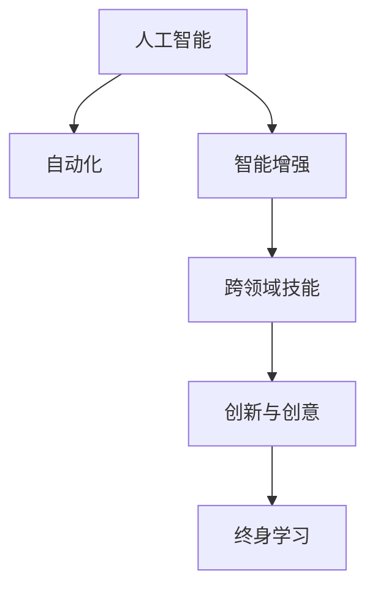

                 

# 人类计算：AI时代的未来就业市场趋势与技能发展

## 1. 背景介绍

### 1.1 问题由来

随着人工智能技术的迅猛发展，特别是深度学习、自然语言处理、计算机视觉等领域的突破，自动化和智能化的浪潮正在各行各业席卷开来。AI技术的广泛应用，正在深刻改变人类的生产生活方式，创造前所未有的经济价值。

然而，技术的进步同时也带来了新的挑战。自动化取代重复性工作，AI系统对复杂问题的解决，正在逐步压缩传统知识工种的市场空间。面对这一变化，我们不得不思考：在AI时代，人类的计算能力将面临怎样的变化？就业市场将出现哪些新的趋势？我们需要哪些新的技能来适应未来的发展？

### 1.2 问题核心关键点

人工智能的核心驱动力是计算，尤其是在大数据和复杂问题处理方面。AI技术通过计算，能够自动完成数据分析、模型训练、推理预测等复杂任务，极大地提升了工作效率。但与此同时，人类计算的角色正在悄然发生变化，从传统的数值计算、逻辑推理，逐步转向更加依赖直觉、创造力和综合判断的高阶计算任务。

在这一过程中，就业市场将出现以下关键趋势：

- **技术岗位需求增加**：自动化和智能化需求推动了AI、大数据、云计算等技术岗位的快速增长。
- **跨领域技能需求上升**：随着AI技术的应用场景多样化，对具备跨领域技能的人才需求日益增加。
- **创新与创意需求提升**：人类在复杂决策和情感理解方面的优势，使得对创新和创意人才的需求持续上升。
- **终身学习与技能更新**：技术迭代快速，终身学习成为个人成长的重要方式。

## 2. 核心概念与联系

### 2.1 核心概念概述

为了更好地理解AI时代的就业市场变化，本节将介绍几个关键概念及其联系：

- **人工智能(AI)**：一种通过模拟人类智能行为，以实现特定目标的技术系统。包括机器学习、深度学习、自然语言处理等众多分支。
- **自动化**：指使用机器代替人类完成重复性、低价值工作，提高工作效率和质量。
- **智能增强**：指人类与AI系统的协同工作，共同完成复杂任务。强调人类的判断和决策能力，而非完全取代。
- **跨领域技能**：指在多个学科或行业领域具备应用能力的综合技能。如AI领域的编程、数学建模，商业领域的市场分析、战略规划等。
- **创新与创意**：指在复杂问题处理、艺术创作、文化交流等方面的独特能力和创意输出。人类在这些领域的优势难以被机器完全取代。
- **终身学习**：指个体在其整个职业生涯中不断学习新知识、技能，以适应技术和市场的变化。

这些概念之间的逻辑关系可以通过以下Mermaid流程图来展示：



这个流程图展示了一系列概念之间的联系：

1. 人工智能推动了自动化技术的广泛应用。
2. 自动化和智能增强提升了工作效率，减少了重复性工作。
3. 智能增强和创新创意工作，需要具备跨领域技能。
4. 终身学习成为个体适应技术变化、保持竞争力的重要手段。

## 3. 核心算法原理 & 具体操作步骤

### 3.1 算法原理概述

在AI时代，人类计算的核心算法原理可以归纳为以下几个方面：

- **数据驱动**：通过大量数据的输入和分析，训练机器模型，以实现对复杂问题的理解和预测。
- **模型优化**：调整模型参数，提升预测准确性。包括正则化、梯度下降等优化算法。
- **集成学习**：将多个模型进行组合，以提升整体性能。如投票、堆叠等。
- **迁移学习**：通过已学知识在新领域进行知识迁移，减少重新学习的负担。

这些算法原理在大数据和复杂问题处理中发挥着重要作用，推动了AI技术的广泛应用。

### 3.2 算法步骤详解

以下是大数据驱动的机器学习模型的典型训练步骤：

1. **数据预处理**：清洗、归一化、特征提取等步骤，以提高数据质量。
2. **模型选择与初始化**：选择适合问题的模型，如线性回归、决策树、神经网络等，并进行初始化。
3. **模型训练**：通过大量数据，使用优化算法（如梯度下降），不断调整模型参数，最小化预测误差。
4. **模型评估**：使用测试集评估模型性能，选择最优模型。
5. **模型应用**：将模型应用于实际问题，进行预测或分类。

### 3.3 算法优缺点

人工智能和大数据驱动的计算方法，具有以下优点：

- **效率高**：自动化处理大量数据，减少人工干预，提高效率。
- **准确性好**：通过大量数据训练，模型可以具备较高的预测准确性。
- **可扩展性强**：模型可以并行计算，适应大规模数据处理需求。

同时，这些方法也存在一定的局限性：

- **对数据依赖高**：需要大量高质量数据训练，数据偏差可能影响模型性能。
- **模型复杂度高**：模型结构复杂，调试和维护难度较大。
- **缺乏解释性**：一些深度学习模型（如黑盒模型）难以解释其内部工作机制。

### 3.4 算法应用领域

人工智能和大数据驱动的计算方法，已经在金融、医疗、制造、物流等多个领域得到了广泛应用。例如：

- **金融风控**：通过分析历史数据，建立风险预测模型，实时监控交易风险。
- **医疗诊断**：使用深度学习模型分析医学影像和病历，辅助医生进行诊断和治疗。
- **智能制造**：通过机器视觉和数据分析，优化生产流程，提高生产效率和质量。
- **物流优化**：利用路径规划和需求预测模型，优化物流配送，降低成本。

## 4. 数学模型和公式 & 详细讲解  
### 4.1 数学模型构建

在机器学习中，常见的数学模型包括线性回归、决策树、支持向量机、神经网络等。以线性回归模型为例，其数学模型可以表示为：

$$ y = w_0 + \sum_{i=1}^n w_i x_i + \epsilon $$

其中 $y$ 为预测结果，$w_i$ 为模型参数，$x_i$ 为输入特征，$\epsilon$ 为误差项。

### 4.2 公式推导过程

线性回归模型的推导过程如下：

1. 假设训练数据集为 $(x_1, y_1), (x_2, y_2), ..., (x_n, y_n)$。
2. 构建线性模型 $y = w_0 + \sum_{i=1}^n w_i x_i + \epsilon$。
3. 最小化预测误差平方和，即 $\sum_{i=1}^n (y_i - (w_0 + \sum_{i=1}^n w_i x_i))^2$。
4. 求导并解方程，得到参数 $w_i$ 的表达式。
5. 使用训练数据计算模型参数 $w_i$。
6. 将模型应用于新数据，进行预测。

### 4.3 案例分析与讲解

以房价预测为例，假设已知房屋面积和价格的历史数据，可以使用线性回归模型进行预测。具体步骤如下：

1. 收集房屋面积和价格的训练数据，记为 $(x_i, y_i)$。
2. 构建线性模型 $y = w_0 + w_1 x_i + \epsilon$。
3. 最小化预测误差平方和，得到参数 $w_0$ 和 $w_1$。
4. 将新房屋的面积 $x$ 代入模型，计算预测价格 $y$。

## 5. 项目实践：代码实例和详细解释说明

### 5.1 开发环境搭建

在进行机器学习项目实践前，我们需要准备好开发环境。以下是使用Python进行Scikit-learn开发的环境配置流程：

1. 安装Anaconda：从官网下载并安装Anaconda，用于创建独立的Python环境。

2. 创建并激活虚拟环境：
```bash
conda create -n ml-env python=3.8 
conda activate ml-env
```

3. 安装Scikit-learn和其他必要的库：
```bash
conda install scikit-learn pandas numpy matplotlib seaborn
```

4. 安装相关的开发工具：
```bash
pip install jupyter notebook ipython
```

完成上述步骤后，即可在`ml-env`环境中开始项目开发。

### 5.2 源代码详细实现

下面我们以房价预测为例，给出使用Scikit-learn进行线性回归模型开发的PyTorch代码实现。

首先，定义数据集和模型：

```python
import pandas as pd
from sklearn.model_selection import train_test_split
from sklearn.linear_model import LinearRegression
from sklearn.metrics import mean_squared_error

# 加载数据集
data = pd.read_csv('house_prices.csv')

# 分割训练集和测试集
X_train, X_test, y_train, y_test = train_test_split(data[['area', 'bedrooms']], data['price'], test_size=0.2, random_state=42)

# 构建线性回归模型
model = LinearRegression()
```

然后，进行模型训练和评估：

```python
# 训练模型
model.fit(X_train, y_train)

# 在测试集上进行预测
y_pred = model.predict(X_test)

# 计算均方误差
mse = mean_squared_error(y_test, y_pred)
print(f"均方误差: {mse:.2f}")
```

最后，使用模型进行预测并输出结果：

```python
# 使用模型进行预测
new_data = [[300, 3]]
pred_price = model.predict(new_data)
print(f"预测房价: {pred_price:.2f} 美元")
```

### 5.3 代码解读与分析

让我们再详细解读一下关键代码的实现细节：

**数据集加载**：
- 使用pandas库读取CSV格式的数据集，并分割为训练集和测试集。

**模型定义**：
- 使用Scikit-learn的线性回归模型，定义输入特征和输出目标。

**模型训练**：
- 使用训练数据对模型进行拟合，最小化预测误差。

**模型评估**：
- 使用测试集对模型进行评估，计算均方误差。

**预测应用**：
- 使用模型对新数据进行预测，输出预测结果。

可以看到，Scikit-learn库提供了便捷的API接口，使机器学习模型的开发变得简单高效。

## 6. 实际应用场景

### 6.1 智能客服系统

基于AI的智能客服系统，能够实时响应客户咨询，提供个性化的服务。通过自然语言处理技术，系统可以理解客户输入的文本，并给出智能回答。例如，某电商平台可以使用智能客服系统，实时解答用户的购买咨询，提高客户满意度。

### 6.2 金融风险管理

金融机构可以使用AI模型进行风险预测和监控，及时识别和应对潜在风险。例如，通过分析历史交易数据和市场趋势，建立风险预测模型，识别异常交易行为，防止欺诈和洗钱。

### 6.3 医疗影像诊断

医疗影像分析是AI技术的重要应用领域之一。通过深度学习模型，系统可以自动分析医学影像，识别病变区域，辅助医生进行诊断和治疗。例如，放射科医生可以使用AI系统，快速判断肺部CT影像中的肿瘤位置，提高诊断效率。

### 6.4 自动驾驶

自动驾驶技术依赖于大量传感器和AI算法，实现车辆的自主导航。通过摄像头、激光雷达等传感器采集数据，AI模型可以进行路径规划和障碍物检测，确保行车安全。例如，特斯拉的自动驾驶系统，结合摄像头和雷达数据，实现对交通环境的实时监控和决策。

## 7. 工具和资源推荐

### 7.1 学习资源推荐

为了帮助开发者系统掌握机器学习和AI技术，这里推荐一些优质的学习资源：

1. Coursera《机器学习》课程：由斯坦福大学教授Andrew Ng主讲，涵盖机器学习的基本理论和算法。
2. Kaggle平台：提供大量开源数据集和竞赛，帮助开发者练习和验证模型性能。
3. PyTorch官方文档：详细介绍了PyTorch框架的使用方法和API接口，适合深入学习。
4. DeepLearning.AI课程：由Andrew Ng等人主讲，涵盖深度学习的基本原理和实践。
5. Scikit-learn官方文档：提供了丰富的机器学习算法和数据处理功能，适合快速上手。

通过对这些资源的学习实践，相信你一定能够系统掌握机器学习和AI技术，并应用于实际问题解决。

### 7.2 开发工具推荐

高效的开发离不开优秀的工具支持。以下是几款用于机器学习开发常用的工具：

1. Jupyter Notebook：免费的交互式编程环境，支持Python和R语言，便于代码编写和调试。
2. PyTorch：由Facebook开发的深度学习框架，提供了强大的GPU加速能力。
3. TensorFlow：由Google主导的深度学习框架，支持分布式计算和模型优化。
4. Scikit-learn：Python的机器学习库，提供了丰富的算法和数据预处理功能。
5. Matplotlib：Python的数据可视化库，支持绘制各种图表，便于数据展示。

合理利用这些工具，可以显著提升机器学习和AI技术的开发效率，加速创新迭代的步伐。

### 7.3 相关论文推荐

机器学习和AI技术的发展源于学界的持续研究。以下是几篇奠基性的相关论文，推荐阅读：

1. Andrew Ng《机器学习》教材：经典入门教材，系统介绍了机器学习的基本概念和算法。
2. Ian Goodfellow《深度学习》教材：系统介绍了深度学习的基本原理和应用。
3. Yann LeCun《深度学习理论》论文：深度学习领域的经典论文，总结了深度学习的理论基础和应用前景。
4. Geoffrey Hinton《神经网络与深度学习》论文：深度学习领域的奠基性论文，介绍了神经网络的原理和应用。
5. Fei-Fei Li《深度学习与人工智慧》论文：深度学习与AI结合的开创性论文，总结了AI技术的发展方向和应用场景。

这些论文代表了大数据驱动的机器学习技术的发展脉络。通过学习这些前沿成果，可以帮助研究者把握学科前进方向，激发更多的创新灵感。

## 8. 总结：未来发展趋势与挑战

### 8.1 总结

本文对基于数据驱动的机器学习模型的开发流程进行了详细阐述。首先介绍了数据驱动的机器学习模型的算法原理和操作步骤，详细讲解了线性回归模型的数学模型和公式推导过程。同时，本文还通过具体代码实例，展示了机器学习模型的实际应用。最后，本文探讨了机器学习在智能客服、金融风控、医疗影像分析、自动驾驶等实际场景中的应用。

通过本文的系统梳理，可以看到，数据驱动的机器学习模型在各行各业中得到了广泛应用，极大地提升了工作效率和决策准确性。未来，伴随数据规模的不断扩大和算力成本的持续下降，机器学习技术将不断成熟，并进一步拓展其应用范围，为各行各业带来新的变革。

### 8.2 未来发展趋势

展望未来，数据驱动的机器学习技术将呈现以下几个发展趋势：

1. **模型自动化**：通过自动化模型构建和调优，减少人工干预，提高模型开发效率。
2. **自适应学习**：模型能够实时更新，适应数据分布的变化，提高模型的稳定性和泛化能力。
3. **多模态融合**：融合视觉、听觉、文本等多种模态数据，提升模型对复杂问题的理解和处理能力。
4. **联邦学习**：在分布式环境中，多设备协作训练模型，保护数据隐私，提高模型性能。
5. **AI与边缘计算**：将AI模型部署到边缘设备，实现实时数据处理和决策，提升系统响应速度。

这些趋势凸显了数据驱动的机器学习技术的广阔前景，预示着未来AI技术的进一步发展和深化。

### 8.3 面临的挑战

尽管数据驱动的机器学习技术已经取得了显著成果，但在迈向更加智能化、普适化应用的过程中，仍面临诸多挑战：

1. **数据隐私和安全**：大规模数据处理带来了数据隐私和安全问题，需要采取有效的数据保护措施。
2. **模型鲁棒性和解释性**：面对复杂多变的现实世界，模型需要具备较强的鲁棒性和可解释性，以提高其可信度和可靠性。
3. **计算资源限制**：大规模数据处理和模型训练需要强大的计算资源，如何在资源有限的情况下提高模型性能，是重要的研究课题。
4. **模型公平性和偏见**：数据分布不均衡和算法偏见可能导致模型输出不公正，需要采取措施确保模型的公平性。
5. **跨领域知识融合**：模型需要具备跨领域知识融合能力，才能更好地应用于实际问题解决。

### 8.4 研究展望

未来，数据驱动的机器学习技术需要在以下几个方面进行深入研究：

1. **跨领域知识融合**：将符号化的先验知识，如知识图谱、逻辑规则等，与神经网络模型进行巧妙融合，引导模型学习更准确、合理的语言模型。
2. **数据隐私保护**：在模型训练和应用过程中，保护用户隐私，避免数据泄露和滥用。
3. **模型鲁棒性提升**：通过引入因果推断和对比学习思想，增强模型建立稳定因果关系的能力，学习更加普适、鲁棒的语言表征。
4. **计算资源优化**：通过模型压缩、并行计算等技术，提高模型在资源有限环境下的性能。
5. **模型公平性保障**：在模型训练目标中引入伦理导向的评估指标，过滤和惩罚有偏见、有害的输出倾向。

这些研究方向将推动数据驱动的机器学习技术迈向更高的台阶，为构建安全、可靠、可解释、可控的智能系统铺平道路。

## 9. 附录：常见问题与解答

**Q1：数据驱动的机器学习模型是否适用于所有问题？**

A: 数据驱动的机器学习模型在处理结构化数据和有监督学习问题上表现出色，但在一些需要领域知识和逻辑推理的问题上，模型的表现可能有限。此时，结合专家知识和规则，可以提升模型的性能。

**Q2：如何确保机器学习模型的鲁棒性？**

A: 确保模型鲁棒性的方法包括：
1. 数据增强：通过扩充数据集，减少模型对特定数据的依赖。
2. 正则化：使用L1、L2正则化等方法，避免模型过拟合。
3. 对抗训练：使用对抗样本，提高模型对噪声和异常数据的鲁棒性。
4. 多模型集成：结合多个模型的输出，提高模型鲁棒性。

**Q3：在实际应用中，如何保护数据隐私？**

A: 保护数据隐私的方法包括：
1. 数据加密：对敏感数据进行加密，防止数据泄露。
2. 差分隐私：在数据处理过程中加入噪声，保护个体隐私。
3. 联邦学习：在分布式环境中，多设备协作训练模型，保护数据隐私。
4. 匿名化处理：对数据进行匿名化处理，防止数据关联。

**Q4：如何提高机器学习模型的解释性？**

A: 提高模型解释性的方法包括：
1. 可解释性模型：使用可解释性较强的模型，如决策树、线性回归等。
2. 特征重要性分析：使用特征重要性分析工具，识别模型关键特征。
3. 模型可视化：使用模型可视化工具，展示模型内部工作机制。
4. 解释性学习：通过解释性学习技术，生成模型决策路径和依据。

**Q5：如何在有限的计算资源下提高模型性能？**

A: 在有限的计算资源下提高模型性能的方法包括：
1. 模型压缩：使用模型压缩技术，减少模型参数和计算量。
2. 分布式计算：使用分布式计算框架，提高模型并行处理能力。
3. 算法优化：使用高效算法，减少计算复杂度。
4. 硬件优化：使用GPU、TPU等高性能计算设备，加速模型训练和推理。

通过这些问题和解答的深入探讨，相信你能够更好地理解数据驱动的机器学习技术在实际应用中的挑战和应对策略。这些实践经验和理论知识，将有助于你在未来的学习和工作中，更好地应用机器学习技术，解决复杂问题。

