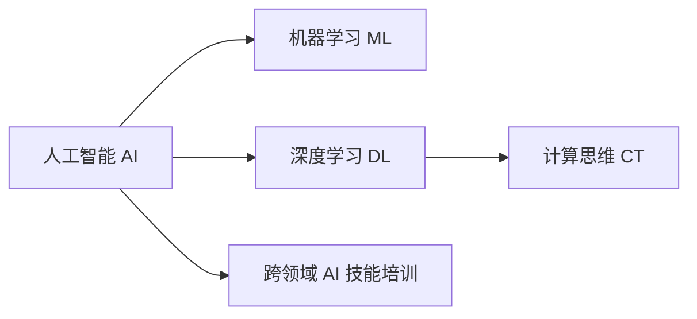

                 

# 人类计算：AI时代的未来技能培训需求

## 1. 背景介绍

### 1.1 问题由来
在数字化、智能化快速发展的今天，人工智能(AI)已成为引领新一轮技术革命的重要驱动力。AI的普及不仅改变了各行各业的作业模式，也重塑了人类社会的生产生活方式。然而，在享受AI带来的便捷和效率的同时，我们也面临着诸多新的挑战。

### 1.2 问题核心关键点
当前，AI技术在诸多领域的广泛应用，迫切需要一大批既懂AI技术又具备深厚行业知识的复合型人才。这种对复合型人才的迫切需求，不仅来自于企业，也来自于政府、教育机构以及整个社会。因此，如何培养具备AI能力的未来人才，成为各国竞相争夺的战略高地。

## 2. 核心概念与联系

### 2.1 核心概念概述

为了更好地理解AI时代下未来技能培训的需求，我们需要明确几个核心概念：

- **人工智能（AI）**：指能够模拟人类智能行为，特别是推理、学习、规划、问题解决、自然语言理解、感知、对象识别和机器人行为等能力的技术系统。
- **机器学习（ML）**：AI的一个重要分支，通过数据驱动的算法和模型，使计算机具备从经验中学习和适应的能力。
- **深度学习（DL）**：ML的一个特殊应用领域，主要通过多层次神经网络进行复杂数据分析和模式识别。
- **计算思维（Computational Thinking）**：一种新的学习方式，旨在通过计算和编程解决复杂问题，强调问题分解、抽象、自动化和迭代改进。
- **跨领域AI技能培训**：面向不同领域的应用场景，培养具备AI能力的综合型人才，涉及编程、数据处理、算法设计、系统集成等技能。

这些概念之间的联系可以通过以下Mermaid流程图来展示：



通过上述流程图，我们可以清晰地看到，AI、ML、DL和CT构成了AI技术的基础框架，而跨领域AI技能培训则是这些基础知识的综合应用，旨在培养能够解决实际问题的复合型人才。

## 3. 核心算法原理 & 具体操作步骤

### 3.1 算法原理概述

在AI时代，未来的技能培训将聚焦于算法原理的理解、工具的掌握以及实际问题的解决。以下是几个核心算法的简要概述：

- **监督学习**：通过标注数据训练模型，使其能够对给定输入预测正确的输出。主要应用于分类、回归、目标检测等任务。
- **无监督学习**：在无标注数据上进行学习和模式发现，主要应用于聚类、降维、关联规则学习等任务。
- **强化学习**：通过与环境的互动，学习最优策略以最大化奖励。主要应用于游戏、机器人控制、自动驾驶等任务。
- **迁移学习**：将一个任务学到的知识迁移到另一个任务上，主要应用于新任务数据不足的情况。

### 3.2 算法步骤详解

下面以监督学习为例，详细介绍其操作步骤：

1. **数据准备**：收集并标注训练数据，确保数据的多样性和代表性。
2. **模型选择**：选择合适的算法和模型架构，如线性回归、支持向量机、神经网络等。
3. **模型训练**：使用训练数据对模型进行优化，通过梯度下降等方法更新模型参数。
4. **模型评估**：在测试数据集上评估模型性能，使用准确率、召回率、F1值等指标衡量模型效果。
5. **模型应用**：将训练好的模型应用于实际问题，进行预测、分类、聚类等任务。

### 3.3 算法优缺点

监督学习算法具有以下优点：

- **效果显著**：在标注数据充足的情况下，能够快速获得较好的模型效果。
- **泛化能力强**：对于未知数据，模型具有良好的泛化能力。
- **应用广泛**：广泛应用于分类、回归、目标检测等任务。

同时，也存在以下缺点：

- **数据依赖**：需要大量标注数据，数据标注成本高。
- **模型复杂度**：模型参数多，容易出现过拟合。
- **算法复杂**：模型训练和调参过程较为复杂，需要专业知识。

### 3.4 算法应用领域

监督学习算法广泛应用于多个领域，包括但不限于：

- **金融风控**：通过分类和回归模型预测贷款违约、信用风险等。
- **医疗诊断**：使用分类和回归模型进行疾病预测、诊断和治疗方案推荐。
- **自然语言处理**：利用文本分类、命名实体识别等模型处理文本数据。
- **图像识别**：通过目标检测和分类模型识别图像中的物体和场景。
- **推荐系统**：使用协同过滤和深度学习模型推荐用户感兴趣的内容。

## 4. 数学模型和公式 & 详细讲解 & 举例说明

### 4.1 数学模型构建

监督学习的数学模型可以表述为：

$$
\min_{\theta} L(\theta) = \frac{1}{N} \sum_{i=1}^{N} L_i(y_i, f_\theta(x_i))
$$

其中，$L_i$ 为损失函数，$y_i$ 为标注数据，$x_i$ 为输入数据，$f_\theta(x_i)$ 为模型预测输出。

### 4.2 公式推导过程

以线性回归为例，假设输入数据 $x = (x_1, x_2, ..., x_n)$，输出数据 $y$，模型参数 $\theta = (w, b)$，损失函数 $L = (y - wx - b)^2$，则模型的最小二乘法形式为：

$$
\min_{\theta} \frac{1}{2N} \sum_{i=1}^{N} (y_i - wx_i - b)^2
$$

对该损失函数求导，得到：

$$
\frac{\partial L}{\partial \theta} = \begin{bmatrix} -\frac{2}{N} \sum_{i=1}^{N} x_i (y_i - wx_i - b) \\ -\frac{2}{N} \sum_{i=1}^{N} (y_i - wx_i - b) \end{bmatrix}
$$

利用梯度下降法更新模型参数：

$$
\theta \leftarrow \theta - \eta \nabla_{\theta}L
$$

其中，$\eta$ 为学习率。

### 4.3 案例分析与讲解

假设我们需要预测某个人的收入水平，收集了100个人的收入和年龄数据，其中年龄 $x$ 为自变量，收入 $y$ 为因变量。使用线性回归模型进行预测，代码实现如下：

```python
import numpy as np
from sklearn.linear_model import LinearRegression

# 生成随机数据
np.random.seed(42)
x = 2 * np.random.rand(100, 1) - 1
y = 4 + 3 * x + np.random.randn(100, 1) * 0.75

# 训练模型
model = LinearRegression()
model.fit(x, y)

# 预测
x_new = np.array([[0], [1]])
print(model.predict(x_new))
```

运行上述代码，即可输出预测结果。

## 5. 项目实践：代码实例和详细解释说明

### 5.1 开发环境搭建

在进行AI技能培训项目实践前，我们需要准备开发环境。以下是使用Python进行TensorFlow开发的快速配置流程：

1. 安装Anaconda：从官网下载并安装Anaconda，用于创建独立的Python环境。

2. 创建并激活虚拟环境：
```bash
conda create -n tf-env python=3.8
conda activate tf-env
```

3. 安装TensorFlow：根据CUDA版本，从官网获取对应的安装命令。例如：
```bash
conda install tensorflow tensorflow-gpu -c conda-forge
```

4. 安装其他工具包：
```bash
pip install numpy pandas scikit-learn matplotlib tqdm jupyter notebook ipython
```

完成上述步骤后，即可在`tf-env`环境中开始项目实践。

### 5.2 源代码详细实现

下面以分类任务为例，给出使用TensorFlow进行监督学习的PyTorch代码实现。

首先，定义分类任务的数据处理函数：

```python
import tensorflow as tf
import numpy as np

class ClassificationDataset(tf.data.Dataset):
    def __init__(self, features, labels, batch_size=32):
        self.features = features
        self.labels = labels
        self.batch_size = batch_size

    def __len__(self):
        return len(self.features)

    def __getitem__(self, index):
        features = self.features[index]
        labels = self.labels[index]

        features = tf.reshape(features, [-1, 1])
        labels = tf.reshape(labels, [-1, 1])

        return {'features': features, 'labels': labels}
        
dataset = ClassificationDataset(features, labels)
```

然后，定义模型和优化器：

```python
import tensorflow as tf
from tensorflow.keras import layers

model = tf.keras.Sequential([
    layers.Dense(64, activation='relu', input_shape=(1,)),
    layers.Dense(1, activation='sigmoid')
])

optimizer = tf.keras.optimizers.Adam(learning_rate=0.001)
```

接着，定义训练和评估函数：

```python
@tf.function
def train_step(features, labels):
    with tf.GradientTape() as tape:
        logits = model(features, training=True)
        loss = tf.reduce_mean(tf.keras.losses.binary_crossentropy(labels, logits))
    gradients = tape.gradient(loss, model.trainable_variables)
    optimizer.apply_gradients(zip(gradients, model.trainable_variables))

@tf.function
def evaluate_step(features, labels):
    logits = model(features, training=False)
    predictions = tf.round(logits)
    accuracy = tf.reduce_mean(tf.cast(tf.equal(predictions, labels), tf.float32))
    return accuracy.numpy()

for epoch in range(100):
    for batch in dataset:
        train_step(batch['features'], batch['labels'])
    
    accuracy = evaluate_step(features, labels)
    print(f'Epoch {epoch+1}, Accuracy: {accuracy:.4f}')
```

最后，启动训练流程并在测试集上评估：

```python
for epoch in range(100):
    for batch in dataset:
        train_step(batch['features'], batch['labels'])
    
    accuracy = evaluate_step(features, labels)
    print(f'Epoch {epoch+1}, Accuracy: {accuracy:.4f}')
```

以上就是使用TensorFlow进行监督学习分类的完整代码实现。可以看到，TensorFlow提供了强大的计算图功能和自动微分能力，使得模型训练和调参过程更加简洁高效。

### 5.3 代码解读与分析

让我们再详细解读一下关键代码的实现细节：

**ClassificationDataset类**：
- `__init__`方法：初始化特征、标签、批次大小等关键组件。
- `__len__`方法：返回数据集的样本数量。
- `__getitem__`方法：对单个样本进行处理，将特征和标签转化为适合模型的张量形式。

**模型定义**：
- 使用`tf.keras.Sequential`定义模型结构，包括一个ReLU激活的密集层和一个Sigmoid激活的输出层。

**训练和评估函数**：
- 使用`tf.function`装饰器将函数编译为计算图，以优化性能。
- 在训练函数中，通过`tf.GradientTape`记录梯度，并使用`optimizer.apply_gradients`更新模型参数。
- 在评估函数中，计算模型的准确率，并返回结果。

**训练流程**：
- 循环迭代训练过程，每个epoch使用数据集进行训练，并计算测试集上的准确率。

通过上述代码，我们可以清晰地看到TensorFlow在模型定义、训练和评估方面的强大功能和高效性能。

## 6. 实际应用场景

### 6.1 智能制造

AI技能在智能制造领域有着广泛的应用，包括生产优化、质量控制、设备维护等。通过数据分析和机器学习算法，智能制造系统可以实时监控生产线状态，预测设备故障，优化生产流程，提高产品质量和生产效率。

在技术实现上，可以收集工厂的历史数据和实时监控数据，利用监督学习算法建立预测模型，如分类模型、回归模型等，用于预测设备故障、优化生产参数等。在实际应用中，这些模型可以帮助工厂管理者快速做出决策，提升生产线的智能化水平。

### 6.2 智慧农业

AI技术在智慧农业中的应用，主要集中在精准农业、病虫害检测、作物产量预测等方面。利用传感器数据和卫星遥感数据，智能农业系统可以对农田进行实时监测，分析作物生长状态，预测产量，实现精准施肥、灌溉和病虫害防治。

在技术实现上，可以采集农田中的土壤、温度、湿度等数据，结合气象数据和历史作物数据，建立预测模型，用于分析作物的生长状态和预测产量。在实际应用中，这些模型可以帮助农民进行科学种植，提高作物产量和农田管理效率。

### 6.3 金融风险管理

AI技能在金融领域的应用，主要集中在信用评分、风险评估、欺诈检测等方面。利用机器学习算法，金融机构可以对客户的信用状况进行评估，预测贷款违约风险，检测金融欺诈行为，提升风险管理水平。

在技术实现上，可以收集客户的贷款记录、消费数据、社交媒体信息等数据，建立预测模型，用于评估客户的信用状况和预测贷款违约风险。在实际应用中，这些模型可以帮助金融机构制定更加精准的贷款政策，降低金融风险。

### 6.4 未来应用展望

随着AI技术的不断进步，未来的技能培训将更加注重跨领域AI能力的培养，涵盖数据科学、计算思维、算法设计等多个方面。以下是几个未来的应用展望：

1. **自动化运维**：智能运维系统能够自动监控和维护复杂的生产设备，减少人工干预，提高效率和准确性。
2. **智能客服**：基于AI技术的客服系统可以提供24小时不间断服务，快速响应用户咨询，提高客户满意度。
3. **个性化推荐**：智能推荐系统能够根据用户的历史行为和偏好，提供个性化的商品、内容和服务推荐。
4. **医疗健康**：智能医疗系统可以提供疾病诊断、健康管理、药物推荐等服务，提升医疗服务的智能化水平。
5. **城市治理**：智慧城市管理系统可以实时监测城市运行状态，预测和预防灾害，提高城市管理的智能化水平。

## 7. 工具和资源推荐

### 7.1 学习资源推荐

为了帮助开发者系统掌握AI技能培训的理论基础和实践技巧，这里推荐一些优质的学习资源：

1. **《机器学习》（周志华）**：全面介绍了机器学习的基本概念、算法和应用，适合初学者入门。
2. **《深度学习》（Ian Goodfellow）**：深入讲解了深度学习的原理和应用，适合进阶学习。
3. **Coursera机器学习课程**：由斯坦福大学Andrew Ng教授开设的在线课程，内容全面，覆盖机器学习的基础理论和实际应用。
4. **TensorFlow官方文档**：提供了完整的API文档和案例教程，是学习TensorFlow的最佳资源。
5. **Kaggle竞赛平台**：提供了大量的数据集和比赛项目，是实践机器学习算法的绝佳平台。

通过对这些资源的学习实践，相信你一定能够快速掌握AI技能培训的精髓，并用于解决实际的AI问题。

### 7.2 开发工具推荐

高效的开发离不开优秀的工具支持。以下是几款用于AI技能培训开发的常用工具：

1. **PyTorch**：基于Python的开源深度学习框架，灵活的计算图和动态图特性，适合快速迭代研究。
2. **TensorFlow**：由Google主导开发的开源深度学习框架，生产部署方便，适合大规模工程应用。
3. **Keras**：一个高级神经网络API，提供了简单易用的接口，适合快速原型开发。
4. **Jupyter Notebook**：一个交互式编程环境，支持代码编写、数据可视化和协作开发。
5. **GitHub**：一个代码托管平台，支持版本控制和团队协作，适合项目管理和代码分享。

合理利用这些工具，可以显著提升AI技能培训任务的开发效率，加快创新迭代的步伐。

### 7.3 相关论文推荐

AI技能培训的研究源于学界的持续研究。以下是几篇奠基性的相关论文，推荐阅读：

1. **A Survey of Computational Thinking**（Jill J. F. Chang, Hsin-Min Liao）：介绍了计算思维的基本概念、应用和教学方法，是理解计算思维的必备论文。
2. **Deep Learning in NLP**（Ian Goodfellow, Yoshua Bengio, Aaron Courville）：深入讲解了深度学习在自然语言处理中的应用，是理解深度学习的经典教材。
3. **Transformers: State-of-the-Art Natural Language Processing**（Ashish Vaswani et al.）：介绍了Transformer模型在自然语言处理中的应用，是理解Transformer技术的权威文献。
4. **Parameter-Efficient Training of Transformers**（Ian Goodfellow）：提出了参数高效的训练方法，如Adapter、LoRA等，是理解参数高效培训方法的经典论文。

这些论文代表了大语言模型微调技术的发展脉络。通过学习这些前沿成果，可以帮助研究者把握学科前进方向，激发更多的创新灵感。

## 8. 总结：未来发展趋势与挑战

### 8.1 研究成果总结

AI技能培训的发展，得益于学界和工业界的持续努力。随着技术的不断进步和应用场景的不断扩展，未来的技能培训将更加注重跨领域AI能力的培养，涵盖数据科学、计算思维、算法设计等多个方面。

### 8.2 未来发展趋势

展望未来，AI技能培训将呈现以下几个发展趋势：

1. **跨领域融合**：AI技能培训将更加注重跨领域能力的培养，涵盖数据科学、计算思维、算法设计等多个方面。
2. **技术创新**：AI技术不断创新，将催生更多的技能培训需求和应用场景，如自动化运维、智能客服、个性化推荐等。
3. **数据驱动**：AI技能培训将更加依赖数据驱动，通过数据分析和模型训练，提升技能培训的针对性和有效性。
4. **实践导向**：AI技能培训将更加注重实践应用，通过项目开发和工程实践，提升技能培训的效果。
5. **终身学习**：AI技能培训将成为一种终身学习方式，不断更新和提升技能，以适应快速变化的技术和应用场景。

### 8.3 面临的挑战

尽管AI技能培训取得了显著进展，但在迈向更加智能化、普适化应用的过程中，仍面临诸多挑战：

1. **数据隐私和安全**：在AI技能培训中，数据隐私和安全问题尤为重要，需要制定严格的数据保护措施，确保数据安全。
2. **算法透明性**：AI算法的黑箱特性，使得其决策过程难以解释，需要提升算法的透明性和可解释性，以提高信任度。
3. **技能培训差异**：不同地区、不同行业、不同背景的人，对AI技能培训的需求存在差异，如何提供定制化的技能培训，是个挑战。
4. **跨领域合作**：AI技能培训需要跨领域合作，涉及教育、企业、政府等多个方面，需要各方协同努力。
5. **模型复杂度**：随着AI技术的发展，模型复杂度不断提升，需要更高效、更简洁的模型结构和算法。

### 8.4 研究展望

面对AI技能培训所面临的种种挑战，未来的研究需要在以下几个方面寻求新的突破：

1. **跨领域能力培养**：开发更加综合的AI技能培训课程，涵盖数据科学、计算思维、算法设计等多个方面。
2. **模型透明性和可解释性**：研究和开发更具有透明性和可解释性的AI算法，提升算法的可信度和可信度。
3. **个性化技能培训**：根据不同地区、不同行业、不同背景的人的需求，提供定制化的技能培训方案，提升培训效果。
4. **高效模型设计和优化**：研究和开发更加高效、简洁的模型结构和算法，以应对复杂数据和应用场景。
5. **数据隐私和安全保护**：制定严格的数据保护措施，确保数据隐私和安全，提升用户信任度。

这些研究方向的探索，必将引领AI技能培训技术迈向更高的台阶，为构建安全、可靠、可解释、可控的智能系统铺平道路。面向未来，AI技能培训需要更多跨领域合作，共同推动AI技术在各个领域的深入应用。

## 9. 附录：常见问题与解答

**Q1：AI技能培训是否适用于所有领域？**

A: AI技能培训在大多数领域都能取得显著效果，特别是对于数据驱动的任务。但对于一些需要专业知识的任务，如法律、医疗等，AI技能培训也需要结合专业知识进行优化。

**Q2：AI技能培训如何衡量效果？**

A: AI技能培训的效果可以从多个方面进行衡量，如模型的准确率、召回率、F1值等指标，以及实际应用中的性能表现。此外，还可以通过用户满意度、应用效果等指标进行综合评估。

**Q3：AI技能培训如何应对数据隐私和安全问题？**

A: 数据隐私和安全问题是AI技能培训中的重要考虑因素。可以通过数据匿名化、差分隐私、联邦学习等技术手段，确保数据隐私和安全。同时，需要制定严格的数据保护政策，确保数据使用合法合规。

**Q4：AI技能培训如何提升算法的透明性和可解释性？**

A: 提升算法的透明性和可解释性是AI技能培训中的一大挑战。可以通过模型可视化、可解释性算法（如LIME、SHAP等）、用户友好的界面设计等手段，提升算法的透明性和可解释性。

**Q5：AI技能培训如何应对跨领域合作中的挑战？**

A: 跨领域合作是AI技能培训中的一大难点。可以通过建立跨学科的联合实验室、制定统一的标准和规范、开展多方合作等手段，促进跨领域合作。同时，需要建立有效的沟通机制，确保各方协同努力。

通过本文的系统梳理，可以看到，AI技能培训在AI时代具有重要意义，将在各个领域发挥重要作用。未来的研究需要在数据、算法、工程、应用等多个维度不断探索和创新，才能更好地应对技术发展和应用场景变化的需求。

---

作者：禅与计算机程序设计艺术 / Zen and the Art of Computer Programming

