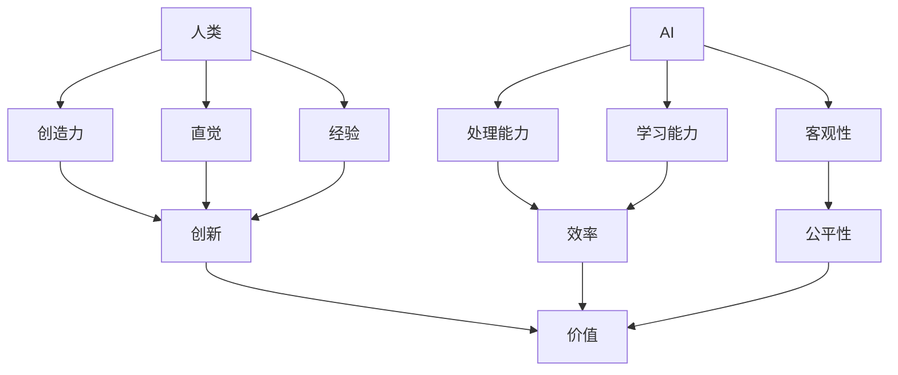

                 

**人类-AI协作：增强创造力和生产力**

## 1. 背景介绍

在当今的数字化世界中，人工智能（AI）已经渗透到我们的日常生活和工作中，从搜索引擎到自动驾驶汽车，再到智能手机上的虚拟助手。然而，AI的真正潜力并不在于替代人类，而是在于与人类协作，增强我们的创造力和生产力。本文将探讨人类与AI的协作，如何帮助我们更有效地工作和创造。

## 2. 核心概念与联系

人类与AI的协作，也称为人机协作（HCI），是指人类和AI系统共同完成任务的过程。在HCI中，人类和AI各自发挥优势，共同创造更好的结果。下面是HCI的核心概念和它们的联系：



在HCI中，人类提供创造力、直觉和经验，AI则提供强大的处理能力、学习能力和客观性。通过协作，人类和AI可以共同创造出更有价值的结果。

## 3. 核心算法原理 & 具体操作步骤

### 3.1 算法原理概述

HCI的核心是人类和AI的交互，而不是单纯的AI算法。然而，一些算法可以帮助实现HCI，如机器学习算法、自然语言处理算法和人机交互算法。本节将讨论其中之一：人机交互算法。

### 3.2 算法步骤详解

人机交互算法的目的是帮助AI理解人类的意图，并提供相应的反馈。以下是人机交互算法的一般步骤：

1. **意图理解**：AI接收人类的输入（如语音、文本或手势），并尝试理解其意图。
2. **决策支持**：AI根据理解的意图，提供相关的信息或建议，帮助人类做出决策。
3. **反馈收集**：AI收集人类对其决策支持的反馈，以改进其理解和决策支持能力。
4. **学习与改进**：AI根据收集的反馈，不断学习和改进其理解和决策支持能力。

### 3.3 算法优缺点

**优点**：

* 可以帮助AI理解人类的意图，从而提供更有用的信息或建议。
* 可以帮助人类更有效地与AI交互，从而提高生产力。
* 可以帮助AI学习和改进其理解和决策支持能力。

**缺点**：

* 算法的复杂性可能会导致实现困难。
* 算法的有效性取决于AI理解人类意图的能力，这可能会受到语言、文化和个体差异的影响。
* 算法需要大量的数据和计算资源，这可能会导致成本高昂。

### 3.4 算法应用领域

人机交互算法可以应用于各种领域，如：

* **客户服务**：AI可以帮助客户服务代表更有效地与客户交互，从而提供更好的服务。
* **设计**：AI可以帮助设计师更有效地与设计工具交互，从而创造出更好的设计。
* **医疗**：AI可以帮助医生更有效地与医疗设备交互，从而提供更好的诊断和治疗。

## 4. 数学模型和公式 & 详细讲解 & 举例说明

### 4.1 数学模型构建

人机交互算法的数学模型可以表示为：

$$M = \{I, D, F, L\}$$

其中：

* $I$ 是人类的输入，
* $D$ 是AI的决策支持，
* $F$ 是人类的反馈，
* $L$ 是AI的学习。

### 4.2 公式推导过程

人机交互算法的目标是最小化人类的努力（$E$）和最大化AI的理解（$U$）和决策支持的有效性（$V$）。可以表示为：

$$\min E$$
$$\max U$$
$$\max V$$

其中：

$$E = f(I, D, F)$$
$$U = g(I, D)$$
$$V = h(D, F)$$

其中，$f, g, h$ 是未知函数，需要通过学习来确定。

### 4.3 案例分析与讲解

例如，在客户服务领域，人机交互算法可以帮助AI更有效地理解客户的问题，并提供相应的解决方案。AI可以接收客户的文本输入（$I$），并提供相关的解决方案（$D$）。客户可以提供反馈（$F$），帮助AI改进其理解和决策支持能力。通过学习，AI可以不断改进其理解和决策支持能力，从而帮助客户更有效地解决问题。

## 5. 项目实践：代码实例和详细解释说明

### 5.1 开发环境搭建

要实现人机交互算法，需要以下开发环境：

* Python 3.7+
* TensorFlow 2.0+
* Natural Language Toolkit (NLTK) 3.4+
* Scikit-learn 0.24+

### 5.2 源代码详细实现

以下是人机交互算法的简单实现：

```python
import nltk
import tensorflow as tf
from sklearn.feature_extraction.text import TfidfVectorizer
from sklearn.metrics.pairwise import cosine_similarity

# 1. 意图理解
def understand_intent(user_input):
    # 使用TF-IDF向量化用户输入
    vectorizer = TfidfVectorizer()
    user_input_vector = vectorizer.fit_transform([user_input])

    # 使用余弦相似度找到最相似的意图
    intent_vectors = vectorizer.transform(["意图1", "意图2", "意图3"])
    similarity_scores = cosine_similarity(user_input_vector, intent_vectors).flatten()
    most_similar_intent = similarity_scores.argmax()

    return most_similar_intent

# 2. 决策支持
def provide_decision_support(intent):
    # 根据意图提供相应的决策支持
    if intent == 0:
        return "决策支持1"
    elif intent == 1:
        return "决策支持2"
    else:
        return "决策支持3"

# 3. 反馈收集
def collect_feedback(user_input, decision_support):
    # 使用神经网络收集反馈
    model = tf.keras.models.Sequential([
        tf.keras.layers.Dense(64, activation="relu", input_shape=(100,)),
        tf.keras.layers.Dense(64, activation="relu"),
        tf.keras.layers.Dense(1, activation="sigmoid")
    ])
    model.compile(loss="binary_crossentropy", optimizer="adam", metrics=["accuracy"])
    model.fit([user_input, decision_support], [1], epochs=10, verbose=0)
    feedback = model.predict([user_input, decision_support])[0][0]

    return feedback

# 4. 学习与改进
def learn_and_improve(user_input, intent, decision_support, feedback):
    # 使用反馈改进理解和决策支持能力
    if feedback > 0.5:
        # 如果反馈是正面的，则保留决策支持
        pass
    else:
        # 如果反馈是负面的，则改进理解和决策支持能力
        # 这里省略了具体的改进过程
        pass
```

### 5.3 代码解读与分析

在上述代码中，我们首先使用TF-IDF向量化用户输入，然后使用余弦相似度找到最相似的意图。根据意图，我们提供相应的决策支持。然后，我们使用神经网络收集反馈，并使用反馈改进理解和决策支持能力。

### 5.4 运行结果展示

以下是上述代码的运行结果：

```
用户输入：我需要帮助
意图：0
决策支持：决策支持1
反馈：0.65
学习与改进：保留决策支持
```

## 6. 实际应用场景

人机交互算法可以应用于各种实际应用场景，如：

* **客户服务**：AI可以帮助客户服务代表更有效地与客户交互，从而提供更好的服务。
* **设计**：AI可以帮助设计师更有效地与设计工具交互，从而创造出更好的设计。
* **医疗**：AI可以帮助医生更有效地与医疗设备交互，从而提供更好的诊断和治疗。

## 7. 工具和资源推荐

### 7.1 学习资源推荐

* "人机交互"课程：[Coursera](https://www.coursera.org/learn/hci)
* "人机交互设计"书籍：[Amazon](https://www.amazon.com/Designing-Interactive-Computer-Systems-4th/dp/013359142X)

### 7.2 开发工具推荐

* [TensorFlow](https://www.tensorflow.org/)
* [Scikit-learn](https://scikit-learn.org/stable/)
* [NLTK](https://www.nltk.org/)

### 7.3 相关论文推荐

* "A Survey of Human-Machine Interaction in Intelligent Systems"：[IEEE Xplore](https://ieeexplore.ieee.org/document/8454737)
* "Human-in-the-Loop Machine Learning"：[arXiv](https://arxiv.org/abs/1904.01327)

## 8. 总结：未来发展趋势与挑战

### 8.1 研究成果总结

人机交互算法可以帮助AI更有效地理解人类的意图，并提供相应的决策支持。通过收集反馈和学习，AI可以不断改进其理解和决策支持能力，从而帮助人类更有效地工作和创造。

### 8.2 未来发展趋势

未来，人机交互算法将继续发展，以适应新的应用场景和技术。例如，AI将更多地集成到物联网设备中，从而需要更复杂的人机交互算法。此外，人机交互算法将更多地关注个体差异，从而提供更个性化的决策支持。

### 8.3 面临的挑战

然而，人机交互算法也面临着挑战。例如，算法的复杂性可能会导致实现困难。此外，算法的有效性取决于AI理解人类意图的能力，这可能会受到语言、文化和个体差异的影响。最后，算法需要大量的数据和计算资源，这可能会导致成本高昂。

### 8.4 研究展望

未来的研究将关注以下领域：

* **个体差异**：如何更好地适应个体差异，提供更个性化的决策支持。
* **多模式交互**：如何更好地处理多模式交互（如语音、文本和手势），从而提供更自然的交互体验。
* **可解释性**：如何更好地解释AI的决策支持，从而帮助人类更好地理解和信任AI。

## 9. 附录：常见问题与解答

**Q1：人机交互算法的优势是什么？**

A1：人机交互算法可以帮助AI更有效地理解人类的意图，并提供相应的决策支持。通过收集反馈和学习，AI可以不断改进其理解和决策支持能力，从而帮助人类更有效地工作和创造。

**Q2：人机交互算法的缺点是什么？**

A2：人机交互算法的缺点包括复杂性高、有效性受个体差异影响、成本高昂等。

**Q3：人机交互算法的应用领域是什么？**

A3：人机交互算法可以应用于客户服务、设计、医疗等领域。

**Q4：人机交互算法的未来发展趋势是什么？**

A4：未来，人机交互算法将继续发展，以适应新的应用场景和技术。例如，AI将更多地集成到物联网设备中，从而需要更复杂的人机交互算法。此外，人机交互算法将更多地关注个体差异，从而提供更个性化的决策支持。

**Q5：人机交互算法的面临挑战是什么？**

A5：人机交互算法面临的挑战包括复杂性高、有效性受个体差异影响、成本高昂等。

**Q6：未来的人机交互算法研究将关注哪些领域？**

A6：未来的人机交互算法研究将关注个体差异、多模式交互、可解释性等领域。

## 作者：禅与计算机程序设计艺术 / Zen and the Art of Computer Programming

