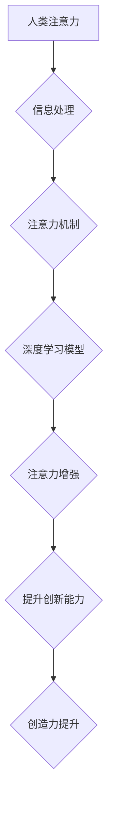

                 

## 人类注意力增强：提升创新能力和创造力技术

> 关键词：注意力增强、深度学习、脑机接口、认知科学、创新能力、创造力、神经网络、可穿戴设备

## 1. 背景介绍

在当今信息爆炸的时代，人类面临着前所未有的信息过载挑战。注意力，作为我们感知和处理信息的关键能力，显得尤为重要。然而，现代生活节奏快、信息纷繁，人们的注意力持续时间和集中度都在下降，这严重阻碍了我们的学习、工作和创造力。

注意力增强技术旨在通过科技手段提升人类的注意力能力，帮助我们更好地应对信息过载，提高工作效率和创造力。近年来，随着人工智能、神经科学和生物技术等领域的快速发展，注意力增强技术取得了显著进展，并展现出巨大的应用潜力。

## 2. 核心概念与联系

### 2.1 注意力机制

注意力机制是深度学习领域的重要组成部分，它能够帮助模型聚焦于输入数据中最重要的部分，从而提高学习效率和准确性。注意力机制的灵感来源于人类的注意力机制，它能够根据任务需求和上下文信息，选择性地关注输入数据中的特定信息。

### 2.2 脑机接口

脑机接口 (Brain-Computer Interface，BCI) 是连接大脑和外部设备的技术，它能够直接读取大脑活动，并将其转化为指令或信号，从而实现人机交互。BCI 技术的应用可以帮助我们控制外部设备、恢复运动功能，以及增强认知能力，包括注意力。

### 2.3 认知科学

认知科学研究人类的思维、学习、记忆和注意力等认知过程。通过对人类认知机制的深入研究，我们可以更好地理解注意力是如何工作的，以及如何通过技术手段对其进行增强。

**Mermaid 流程图**



## 3. 核心算法原理 & 具体操作步骤

### 3.1 算法原理概述

注意力增强算法通常基于深度学习模型，例如卷积神经网络 (CNN) 或循环神经网络 (RNN)。这些模型能够学习输入数据中的特征，并根据特征的权重，选择性地关注重要信息。

常见的注意力增强算法包括：

* **自注意力机制 (Self-Attention):** 能够学习输入序列中不同元素之间的关系，并根据关系权重，分配注意力。
* **多头注意力机制 (Multi-Head Attention):** 使用多个自注意力头，并行学习不同类型的注意力关系。
* **Transformer 模型:** 基于多头注意力机制，能够处理长序列数据，并取得了在自然语言处理等领域的突破性进展。

### 3.2 算法步骤详解

1. **数据预处理:** 将输入数据进行清洗、格式化和编码，使其能够被深度学习模型处理。
2. **模型训练:** 使用训练数据训练深度学习模型，学习注意力机制的参数。
3. **注意力分配:** 将输入数据输入到训练好的模型中，模型会根据注意力机制，分配不同元素的权重。
4. **信息提取:** 根据注意力权重，提取输入数据中最重要的信息。
5. **输出结果:** 将提取的信息作为输出结果，用于后续的处理或决策。

### 3.3 算法优缺点

**优点:**

* **提高效率:** 通过聚焦于重要信息，可以提高信息处理效率。
* **增强理解:** 可以帮助我们更好地理解复杂的信息。
* **提升创造力:** 通过关注不同角度的信息，可以激发创造力。

**缺点:**

* **计算复杂度高:** 训练深度学习模型需要大量的计算资源。
* **数据依赖性强:** 模型的性能取决于训练数据的质量。
* **伦理问题:** 注意力增强技术可能被用于操纵或控制人们的行为，需要谨慎使用。

### 3.4 算法应用领域

* **教育:** 帮助学生集中注意力，提高学习效率。
* **医疗:** 辅助医生诊断疾病，提高治疗效果。
* **游戏:** 增强玩家的游戏体验，提高游戏沉浸感。
* **营销:** 吸引用户的注意力，提高广告效果。

## 4. 数学模型和公式 & 详细讲解 & 举例说明

### 4.1 数学模型构建

注意力机制可以看作是一个加权求和的过程，其中权重由注意力分数决定。

假设我们有一个输入序列 $X = \{x_1, x_2, ..., x_n\}$，我们想要计算每个元素 $x_i$ 的注意力分数 $a_i$。

注意力分数通常使用一个函数 $f$ 计算，该函数接受两个输入：

* $x_i$: 当前元素
* $h_j$: 其他元素的隐藏状态

$a_i = f(x_i, h_j)$

### 4.2 公式推导过程

一个常见的注意力分数计算函数是：

$a_i = \frac{exp(score(x_i, h_j))}{\sum_{k=1}^{n} exp(score(x_k, h_j))}$

其中，$score(x_i, h_j)$ 是 $x_i$ 和 $h_j$ 之间的相似度得分，可以使用点积或其他相似度度量方法计算。

### 4.3 案例分析与讲解

例如，在机器翻译任务中，我们可以使用注意力机制来帮助模型关注源语言句子中与目标语言句子相对应的词语。

假设源语言句子为 "The cat sat on the mat"，目标语言句子为 "Le chat s'est assis sur le tapis"。

模型可以计算每个源语言词语与每个目标语言词语之间的相似度得分，并根据得分分配注意力权重。

当模型翻译 "cat" 时，它会将注意力集中在 "chat" 上，因为它们之间的相似度得分最高。

## 5. 项目实践：代码实例和详细解释说明

### 5.1 开发环境搭建

* Python 3.7+
* TensorFlow 2.0+
* PyTorch 1.0+
* Jupyter Notebook

### 5.2 源代码详细实现

```python
import tensorflow as tf

# 定义一个简单的自注意力机制
def self_attention(query, key, value, mask=None):
    # 计算注意力分数
    scores = tf.matmul(query, key, transpose_b=True) / tf.math.sqrt(tf.cast(key.shape[-1], tf.float32))
    if mask is not None:
        scores += (mask * -1e9)
    # 计算注意力权重
    attention_weights = tf.nn.softmax(scores, axis=-1)
    # 计算加权求和
    context = tf.matmul(attention_weights, value)
    return context, attention_weights

# 示例代码
query = tf.random.normal([3, 4, 64])
key = tf.random.normal([3, 4, 64])
value = tf.random.normal([3, 4, 64])

context, attention_weights = self_attention(query, key, value)

print(context.shape)
print(attention_weights.shape)
```

### 5.3 代码解读与分析

* `self_attention` 函数实现了一个简单的自注意力机制。
* `query`, `key`, `value` 分别代表查询、键和值矩阵。
* `mask` 用于屏蔽不需要关注的信息。
* `scores` 计算了每个查询元素与每个键元素之间的相似度得分。
* `attention_weights` 计算了每个查询元素对每个键元素的注意力权重。
* `context` 是加权求和的结果，代表了每个查询元素对所有键元素的关注。

### 5.4 运行结果展示

运行上述代码，会输出 `context` 和 `attention_weights` 的形状。

## 6. 实际应用场景

### 6.1 教育领域

注意力增强技术可以帮助学生集中注意力，提高学习效率。例如，可以开发一款学习软件，通过游戏化机制和个性化学习路径，引导学生集中注意力，并根据学生的注意力状态，调整学习内容和难度。

### 6.2 医疗领域

注意力增强技术可以辅助医生诊断疾病，提高治疗效果。例如，可以开发一款脑机接口设备，通过读取患者的大脑活动，识别患者的注意力状态，并根据状态调整治疗方案。

### 6.3 游戏领域

注意力增强技术可以增强玩家的游戏体验，提高游戏沉浸感。例如，可以开发一款游戏，通过调整游戏场景和音效，根据玩家的注意力状态，提供不同的游戏体验。

### 6.4 未来应用展望

注意力增强技术在未来将有更广泛的应用场景，例如：

* **个性化学习:** 根据学生的注意力状态，提供个性化的学习内容和学习路径。
* **远程医疗:** 通过脑机接口设备，远程监测患者的注意力状态，并提供远程医疗服务。
* **智能家居:** 根据用户的注意力状态，智能家居设备可以自动调节灯光、温度和音效，提供更舒适的生活环境。

## 7. 工具和资源推荐

### 7.1 学习资源推荐

* **书籍:**
    * 《深度学习》
    * 《Attention Is All You Need》
* **在线课程:**
    * Coursera: 深度学习
    * Udacity: 自然语言处理
* **博客:**
    * TensorFlow Blog
    * PyTorch Blog

### 7.2 开发工具推荐

* **TensorFlow:** 开源深度学习框架
* **PyTorch:** 开源深度学习框架
* **Keras:** 高级深度学习API

### 7.3 相关论文推荐

* **Attention Is All You Need**
* **BERT: Pre-training of Deep Bidirectional Transformers for Language Understanding**
* **Transformer-XL: Attentive Language Models Beyond a Fixed-Length Context**

## 8. 总结：未来发展趋势与挑战

### 8.1 研究成果总结

注意力增强技术取得了显著进展，在多个领域展现出巨大的应用潜力。

### 8.2 未来发展趋势

* **更精准的注意力控制:** 开发更精准的注意力控制机制，能够根据不同任务和场景，灵活地分配注意力。
* **跨模态注意力:** 研究跨模态注意力机制，能够处理不同类型的数据，例如文本、图像和音频。
* **脑机接口融合:** 将注意力增强技术与脑机接口技术融合，实现更直接的注意力控制。

### 8.3 面临的挑战

* **算法复杂度:** 训练复杂的注意力模型需要大量的计算资源。
* **数据隐私:** 注意力增强技术可能会收集用户的敏感数据，需要保障数据隐私安全。
* **伦理问题:** 注意力增强技术可能被用于操纵或控制人们的行为，需要谨慎使用。

### 8.4 研究展望

未来，注意力增强技术将继续朝着更精准、更智能、更安全的方向发展，并将在更多领域发挥重要作用。


## 9. 附录：常见问题与解答

### 9.1 Q: 注意力增强技术真的可以提高注意力吗？

**A:** 目前，注意力增强技术已经取得了一些初步成果，能够帮助人们提高注意力集中度和学习效率。但是，注意力增强技术并非万能药，还需要结合其他方法，例如良好的睡眠、健康的饮食和规律的运动，才能达到最佳效果。

### 9.2 Q: 注意力增强技术有哪些风险？

**A:** 注意力增强技术可能存在一些风险，例如：

* **过度依赖:** 过度依赖注意力增强技术，可能会导致人们失去自主控制注意力能力。
* **信息茧房:** 注意力增强技术可能会将人们困在信息茧房中，只接收自己感兴趣的信息，从而导致认知偏差。
* **隐私泄露:** 注意力增强技术可能会收集用户的敏感数据，需要保障数据隐私安全。

### 9.3 Q: 如何选择合适的注意力增强技术？

**A:** 选择合适的注意力增强技术需要根据个人的需求和使用场景进行选择。例如，对于学生来说，可以考虑使用游戏化学习软件；对于医生来说，可以考虑使用脑机接口设备。


作者：禅与计算机程序设计艺术 / Zen and the Art of Computer Programming 
<end_of_turn>

