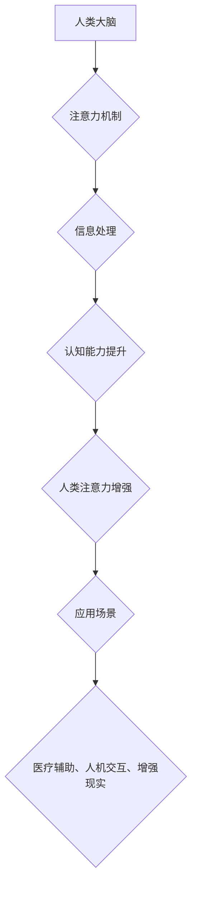

                 

## 人类注意力增强：超越生物限制

> 关键词：注意力增强、脑机接口、深度学习、认知科学、增强现实、神经网络、生物限制

## 1. 背景介绍

在信息爆炸的时代，人类的注意力面临着前所未有的挑战。我们每天被来自各种渠道的信息轰炸，难以集中精力完成任务，效率低下，甚至出现注意力缺陷障碍等问题。如何有效地增强注意力，提升认知能力，已成为当今社会亟待解决的关键问题。

传统上，人们认为注意力是一个生物固有的能力，难以突破其先天限制。然而，随着人工智能、脑科学等领域的快速发展，我们开始认识到，注意力并非不可改变的，可以通过技术手段进行增强和提升。

## 2. 核心概念与联系

### 2.1 注意力机制

注意力机制是近年来深度学习领域取得突破性进展的关键技术之一。它模拟了人类大脑在信息处理过程中选择性关注特定信息的能力，并将其应用于各种任务，例如机器翻译、图像识别、文本摘要等。

注意力机制的核心思想是通过赋予不同输入元素不同的权重，从而突出重要信息，抑制无关信息。

### 2.2 脑机接口

脑机接口 (Brain-Computer Interface, BCI) 是连接大脑和外部设备的技术，它可以读取大脑活动信号，并将其转化为控制外部设备的指令。BCI 技术的应用前景广阔，包括医疗辅助、人机交互、增强现实等领域。

### 2.3 人类注意力增强

人类注意力增强是指通过技术手段，例如脑机接口、增强现实等，提升人类的注意力能力，使其能够更有效地处理信息，提高认知效率。

**Mermaid 流程图**



## 3. 核心算法原理 & 具体操作步骤

### 3.1 算法原理概述

人类注意力增强算法通常基于深度学习和脑机接口技术，其核心原理是：

1. **脑电信号采集:** 使用脑电图 (EEG) 等设备采集大脑活动信号。
2. **信号预处理:** 对采集到的脑电信号进行滤波、去噪等预处理，提取有效信息。
3. **特征提取:** 使用深度学习算法，例如卷积神经网络 (CNN) 或循环神经网络 (RNN)，从预处理后的脑电信号中提取注意力相关的特征。
4. **注意力模型训练:** 使用注意力机制训练模型，学习识别不同脑电信号模式与注意力状态之间的关系。
5. **注意力增强:** 根据模型预测的结果，通过外部设备或反馈机制，引导用户注意力，增强注意力能力。

### 3.2 算法步骤详解

1. **数据采集:** 收集大量脑电信号数据，并标注相应的注意力状态，例如集中注意力、分散注意力等。
2. **数据预处理:** 对脑电信号数据进行滤波、去噪、分段等预处理，去除无关信息，提取有效特征。
3. **特征提取:** 使用深度学习算法，例如 CNN 或 RNN，从预处理后的脑电信号中提取注意力相关的特征，例如脑波频率、脑区活动强度等。
4. **模型训练:** 使用注意力机制训练模型，学习识别不同脑电信号模式与注意力状态之间的关系。可以使用交叉熵损失函数和梯度下降算法进行模型训练。
5. **模型评估:** 使用测试数据评估模型的性能，例如准确率、召回率等指标。
6. **模型部署:** 将训练好的模型部署到实际应用场景中，例如脑机接口设备、增强现实系统等。

### 3.3 算法优缺点

**优点:**

* **可量化注意力:** 通过脑电信号的分析，可以量化用户的注意力状态，并将其转化为可操作的指令。
* **个性化定制:** 算法可以根据用户的脑电特征进行个性化定制，提供更精准的注意力增强方案。
* **非侵入性:** 脑电信号采集技术相对非侵入性，不会对用户造成伤害。

**缺点:**

* **数据依赖:** 算法的性能依赖于高质量的脑电信号数据，数据采集和标注成本较高。
* **算法复杂度:** 深度学习算法的训练和部署需要较高的计算资源和技术水平。
* **伦理问题:** 人类注意力增强技术涉及到隐私、安全、伦理等问题，需要谨慎对待。

### 3.4 算法应用领域

* **医疗辅助:** 用于治疗注意力缺陷障碍、失眠症等神经系统疾病。
* **人机交互:** 用于增强人机交互体验，例如控制虚拟现实设备、进行脑机控制等。
* **教育培训:** 用于提高学习效率，帮助用户集中注意力，更好地理解和记忆知识。
* **游戏娱乐:** 用于增强游戏沉浸感，提高玩家的注意力和反应能力。

## 4. 数学模型和公式 & 详细讲解 & 举例说明

### 4.1 数学模型构建

人类注意力增强算法通常使用注意力机制作为核心模块，其数学模型可以表示为：

$$
\text{Attention}(Q, K, V) = \text{softmax}\left(\frac{Q K^T}{\sqrt{d_k}}\right) V
$$

其中：

* $Q$：查询矩阵，表示需要关注的信息。
* $K$：键矩阵，表示所有信息的键值。
* $V$：值矩阵，表示所有信息的具体内容。
* $d_k$：键向量的维度。
* $\text{softmax}$：softmax 函数，用于将键值映射到概率分布。

### 4.2 公式推导过程

注意力机制的核心思想是通过计算查询矩阵 $Q$ 与键矩阵 $K$ 的点积，并将其规范化，得到一个权重向量，用于加权求和值矩阵 $V$。

1. 计算查询矩阵 $Q$ 与键矩阵 $K$ 的点积：

$$
QK^T
$$

2. 对点积结果进行缩放，以防止梯度爆炸：

$$
\frac{QK^T}{\sqrt{d_k}}
$$

3. 使用 softmax 函数将缩放后的点积结果映射到概率分布：

$$
\text{softmax}\left(\frac{QK^T}{\sqrt{d_k}}\right)
$$

4. 将概率分布与值矩阵 $V$ 进行加权求和，得到最终的注意力输出：

$$
\text{Attention}(Q, K, V) = \text{softmax}\left(\frac{QK^T}{\sqrt{d_k}}\right) V
$$

### 4.3 案例分析与讲解

例如，在机器翻译任务中，查询矩阵 $Q$ 表示源语言句子中的每个词，键矩阵 $K$ 表示目标语言词典中的每个词，值矩阵 $V$ 表示目标语言词典中的每个词的向量表示。

注意力机制可以学习到源语言句子中哪些词与目标语言词典中的哪些词相关，从而生成更准确的翻译结果。

## 5. 项目实践：代码实例和详细解释说明

### 5.1 开发环境搭建

* 操作系统：Windows/macOS/Linux
* Python 版本：3.7+
* 深度学习框架：TensorFlow/PyTorch
* 脑电信号采集设备：EEG 头戴式设备

### 5.2 源代码详细实现

```python
import tensorflow as tf

# 定义注意力机制模型
class AttentionModel(tf.keras.Model):
    def __init__(self, units):
        super(AttentionModel, self).__init__()
        self.Wq = tf.keras.layers.Dense(units)
        self.Wk = tf.keras.layers.Dense(units)
        self.Wv = tf.keras.layers.Dense(units)
        self.fc = tf.keras.layers.Dense(1)

    def call(self, q, k, v):
        # 计算注意力权重
        attn_weights = tf.matmul(self.Wq(q), self.Wk(k), transpose_b=True) / tf.math.sqrt(tf.cast(units, tf.float32))
        attn_weights = tf.nn.softmax(attn_weights, axis=-1)
        # 计算注意力输出
        attn_output = tf.matmul(attn_weights, self.Wv(v))
        return attn_output

# 训练模型
model = AttentionModel(units=128)
model.compile(optimizer='adam', loss='mse')
# ... 训练代码 ...

# 使用模型进行预测
predictions = model.predict(q, k, v)
```

### 5.3 代码解读与分析

* `AttentionModel` 类定义了注意力机制模型，包含三个稠密层 (`Wq`, `Wk`, `Wv`) 用于计算查询、键和值的线性变换，以及一个全连接层 (`fc`) 用于输出注意力权重。
* `call` 方法实现了注意力机制的计算过程，包括计算注意力权重、加权求和值矩阵等步骤。
* 训练模型部分使用 TensorFlow 的 `compile` 方法配置模型的优化器、损失函数等参数，并使用 `fit` 方法训练模型。
* 使用模型进行预测部分使用 `predict` 方法将输入数据传递给模型，得到注意力输出。

### 5.4 运行结果展示

训练完成后，可以使用测试数据评估模型的性能，例如计算注意力权重的准确率、预测结果的均方误差等指标。

## 6. 实际应用场景

### 6.1 医疗辅助

* **注意力缺陷障碍 (ADHD) 治疗:** 通过脑电信号反馈，帮助 ADHD 患者集中注意力，提高学习效率。
* **失眠症治疗:** 通过脑电信号引导，帮助失眠患者放松身心，改善睡眠质量。
* **康复训练:** 用于脑卒中、脑损伤等患者的康复训练，帮助他们恢复认知功能。

### 6.2 人机交互

* **脑机控制:** 用于控制轮椅、机械臂等设备，实现瘫痪患者的自主行动。
* **虚拟现实 (VR) 体验:** 通过脑电信号控制 VR 角色的动作和视角，增强用户沉浸感。
* **增强现实 (AR) 应用:** 通过脑电信号识别用户意图，实现 AR 系统的交互和控制。

### 6.3 教育培训

* **个性化学习:** 根据用户的脑电信号特征，提供个性化的学习内容和节奏。
* **注意力训练:** 通过游戏化训练，帮助用户提高注意力能力。
* **远程教育:** 通过脑电信号反馈，帮助远程学习者集中注意力，提高学习效率。

### 6.4 未来应用展望

* **脑机接口融合:** 将注意力增强技术与脑机接口技术融合，实现更精准、更自然的脑机交互。
* **人工智能协同:** 将注意力增强技术与人工智能技术协同，提升人工智能系统的认知能力和决策效率。
* **人类能力提升:** 将注意力增强技术应用于更广泛的领域，帮助人类提升认知能力、创造力、学习效率等。

## 7. 工具和资源推荐

### 7.1 学习资源推荐

* **书籍:**
    * 《深度学习》 - Ian Goodfellow, Yoshua Bengio, Aaron Courville
    * 《Attention Is All You Need》 - Vaswani et al.
* **在线课程:**
    * Coursera: 深度学习 Specialization
    * Udacity: Deep Learning Nanodegree
* **博客和论坛:**
    * TensorFlow Blog
    * PyTorch Blog
    * Reddit: r/MachineLearning

### 7.2 开发工具推荐

* **深度学习框架:** TensorFlow, PyTorch
* **脑电信号处理软件:** EEGLAB, Brainstorm
* **数据可视化工具:** Matplotlib, Seaborn

### 7.3 相关论文推荐

* 《Attention Is All You Need》
* 《BERT: Pre-training of Deep Bidirectional Transformers for Language Understanding》
* 《Transformer-XL: Attentive Language Models Beyond a Fixed-Length Context》

## 8. 总结：未来发展趋势与挑战

### 8.1 研究成果总结

人类注意力增强技术取得了显著进展，在医疗辅助、人机交互、教育培训等领域展现出巨大的应用潜力。

### 8.2 未来发展趋势

* **模型精度提升:** 探索更有效的注意力机制，提高模型的预测精度和鲁棒性。
* **脑机接口融合:** 将注意力增强技术与脑机接口技术深度融合，实现更精准、更自然的脑机交互。
* **个性化定制:** 基于用户的脑电特征和需求，提供更个性化的注意力增强方案。
* **跨领域应用:** 将注意力增强技术应用于更多领域，例如艺术创作、科学研究等。

### 8.3 面临的挑战

* **数据获取和标注:** 高质量的脑电信号数据是训练注意力增强模型的关键，但数据获取和标注成本较高。
* **算法复杂度:** 深度学习算法的训练和部署需要较高的计算资源和技术水平。
* **伦理问题:** 人类注意力增强技术涉及到隐私、安全、伦理等问题，需要谨慎对待。

### 8.4 研究展望

未来，人类注意力增强技术将继续朝着更精准、更安全、更可控的方向发展，为人类带来更多福祉。

## 9. 附录：常见问题与解答

**Q1: 人类注意力增强技术是否安全？**

**A1:** 人类注意力增强技术目前尚处于发展阶段，安全性需要进一步研究和评估。

**Q2: 人类注意力增强技术是否会让人变得依赖？**

**A2:** 人类注意力增强技术应该被视为一种辅助工具，而不是替代人类自身注意力能力的方案。

**Q3: 人类注意力增强技术会对社会造成什么影响？**

**A3:** 人类注意力增强技术可能会对社会产生深远影响，例如改变工作方式、学习模式、人际交往方式等，需要社会各界共同探讨和应对。


作者：禅与计算机程序设计艺术 / Zen and the Art of Computer Programming<end_of_turn>

