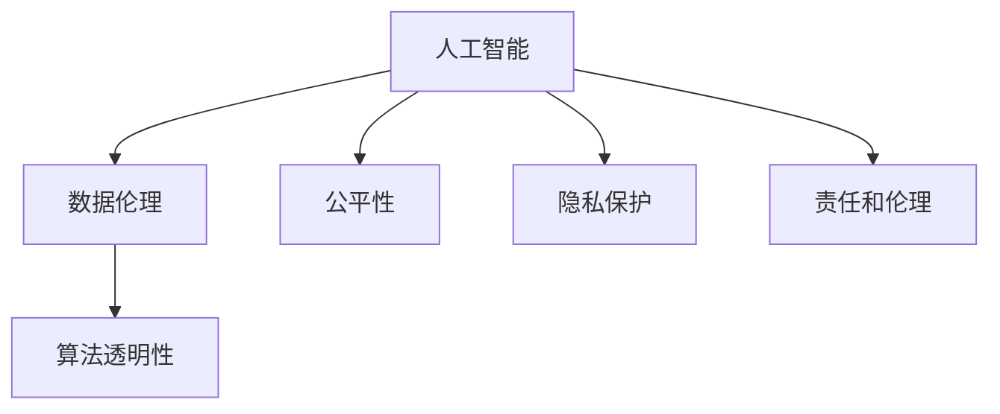

                 

# 人类计算：在AI时代增强道德意识

> 关键词：人类计算, 道德意识, AI时代, 数据伦理, 人工智能, 责任和伦理, 算法透明性, 公平性, 隐私保护

## 1. 背景介绍

### 1.1 问题由来

在人工智能(AI)蓬勃发展的今天，我们正处于一个前所未有的技术变革时代。AI技术在医疗、金融、教育、交通等多个领域展现了其强大的潜力和应用前景。然而，与此同时，AI技术的伦理问题也日益凸显。尤其是在数据驱动、模型为王的时代，如何确保AI系统的决策过程公平、透明、可解释，成为了一个亟需解决的重大课题。

近年来，一系列具有影响力的AI伦理事件揭示了当前AI系统的道德风险。从自动驾驶车辆对行人无意间的致命撞击，到AI招聘系统对女性和少数族裔的隐性歧视，再到深度伪造（Deepfake）技术对真实信息的歪曲与滥用，AI技术的伦理问题引起了全球的广泛关注。这些问题不仅反映了AI技术的双重性质——既有可能带来巨大的社会福祉，也可能导致严重的伦理困境——而且也表明，我们亟需一套完整的伦理框架和计算方法，来确保AI系统的良性发展。

面对这一挑战，"人类计算"（Human Computation）概念应运而生。它结合了传统计算和人类智能的优势，旨在通过有意识、负责任的方式利用AI系统，以增强道德意识、提升算法透明度、确保数据公平性，从而推动AI技术的健康发展。

### 1.2 问题核心关键点

"人类计算"的核心关键点主要包括：

- **道德意识的增强**：确保AI系统在决策过程中充分考虑伦理和道德原则，避免有害的决策行为。
- **算法透明性**：通过可解释性、可视化等手段，提升AI算法的透明性，使得决策过程可以被理解和监督。
- **数据公平性**：在数据采集、处理和应用等环节，确保数据来源的多样性和代表性，避免算法偏见和歧视。
- **隐私保护**：在数据收集、存储和处理过程中，采取有效的隐私保护措施，确保用户隐私不受侵害。
- **责任和伦理**：明确AI系统的责任主体，建立责任追溯机制，确保决策过程的责任性和可追溯性。

这些关键点共同构成了"人类计算"的理论基础和实践指南，为AI系统的道德化提供了有力的支持。

## 2. 核心概念与联系

### 2.1 核心概念概述

为了更好地理解"人类计算"，我们首先介绍几个核心概念及其相互之间的联系：

- **人工智能**：通过算法、模型和数据训练等方式，使计算机系统具备一定的智能和自主决策能力。
- **数据伦理**：在数据采集、处理、分析和应用等各个环节，遵循一系列伦理原则和规范，确保数据使用不会损害个人隐私和权益。
- **算法透明性**：通过可解释性、可视化等手段，确保算法决策过程的透明和可理解，使得外部监督成为可能。
- **公平性**：在算法设计和使用中，确保不同群体和个体之间享有平等的机会和待遇，避免算法偏见和歧视。
- **隐私保护**：采取技术和管理手段，确保数据在处理和使用过程中，用户的隐私和个人信息得到妥善保护。
- **责任和伦理**：明确AI系统决策的责任主体，建立责任追溯机制，确保决策过程的责任性和可追溯性。

这些核心概念通过以下Mermaid流程图展示了它们之间的联系：



从图中可以看出，人工智能是整个"人类计算"体系的核心，而数据伦理、算法透明性、公平性、隐私保护和责任伦理，则是围绕人工智能展开的伦理保障措施。这些措施共同作用，确保AI系统在决策过程中能够以道德、透明、公平、安全的方式运行。

## 3. 核心算法原理 & 具体操作步骤
### 3.1 算法原理概述

"人类计算"的算法原理，主要围绕以下几个方面展开：

- **数据预处理**：确保数据来源的多样性和代表性，避免数据偏见和歧视。
- **算法训练**：在算法设计中考虑道德和伦理因素，提升算法透明性，确保决策过程可解释。
- **模型评估**：通过公平性指标、透明性指标等评估模型性能，确保模型符合伦理要求。
- **决策审计**：对AI系统决策进行定期审计，确保其符合伦理和法律要求。

这些原理共同构成了"人类计算"的算法基础，为实现其核心目标提供了理论支持。

### 3.2 算法步骤详解

"人类计算"的具体操作步骤可以分为以下几个步骤：

1. **数据预处理**：
   - 收集多样化、代表性的数据，确保数据集涵盖不同群体和个体的需求。
   - 清洗和标注数据，去除噪音和不合理的数据点，确保数据质量。
   - 对敏感数据进行匿名化处理，保护用户隐私。

2. **算法训练**：
   - 在算法设计中引入公平性约束，如使用对抗样本训练、公平性约束优化等技术。
   - 提升算法的可解释性，如引入可视化工具、可解释模型等。
   - 使用跨域和合成数据集进行模型训练，增强算法的泛化能力。

3. **模型评估**：
   - 引入公平性指标，如平等机会、敏感性分析等，评估模型对不同群体的影响。
   - 引入透明性指标，如模型输出可视化、模型决策路径可视化等，评估模型的透明性。
   - 使用多种评价指标，如准确率、召回率、F1值等，综合评估模型性能。

4. **决策审计**：
   - 对AI系统决策进行定期审计，确保其符合伦理和法律要求。
   - 引入第三方监督机制，对AI系统进行独立评估和审查。
   - 建立责任追溯机制，明确AI系统决策的责任主体和责任范围。

### 3.3 算法优缺点

"人类计算"的算法具有以下优点：

- **增强道德意识**：通过引入伦理约束和公平性指标，确保AI系统在决策过程中考虑道德因素。
- **提升算法透明性**：通过可视化工具和可解释性技术，提升算法的透明性和可理解性。
- **保障数据公平性**：通过多样化和代表性数据的收集，避免算法偏见和歧视。
- **加强隐私保护**：通过敏感数据匿名化和加密技术，保护用户隐私。
- **明确责任和伦理**：通过责任追溯机制，明确AI系统决策的责任主体，确保决策过程的责任性和可追溯性。

同时，该算法也存在一定的局限性：

- **复杂度较高**：需要在算法设计中引入伦理约束和公平性指标，增加了算法的复杂度。
- **计算成本高**：为了确保数据公平性和透明性，需要在数据预处理和模型训练过程中投入大量计算资源。
- **效果难以量化**：一些伦理和道德指标难以通过传统方法量化，评估结果可能存在主观性。

尽管存在这些局限性，"人类计算"算法仍然是大规模AI系统应用中不可或缺的重要组成部分，为AI技术的道德化提供了有力保障。

### 3.4 算法应用领域

"人类计算"算法在多个领域得到了广泛应用，包括但不限于：

- **医疗**：确保医疗诊断和治疗方案的公平性和透明度，避免因数据偏见导致的医疗歧视。
- **金融**：在金融产品和服务的推荐中，确保不同群体享有平等的机会，避免因算法偏见导致的金融歧视。
- **教育**：在智能教育系统中，确保教育资源公平分配，避免因算法偏见导致的教育不公平。
- **司法**：在司法判决中，确保决策过程透明和可解释，避免因算法偏见导致的司法不公。
- **公共安全**：在公共安全监控和预测中，确保数据采集和使用符合伦理规范，避免对个人隐私的侵犯。

## 4. 数学模型和公式 & 详细讲解  
### 4.1 数学模型构建

"人类计算"的数学模型构建，主要围绕以下几个方面展开：

- **公平性模型**：通过引入公平性约束，确保模型对不同群体的影响最小化。
- **透明性模型**：通过可解释性模型和可视化工具，提升算法的透明性。
- **隐私保护模型**：通过数据加密和匿名化技术，保护用户隐私。
- **责任模型**：通过责任追溯机制，明确AI系统决策的责任主体。

这些模型共同构成了"人类计算"的理论基础，为实现其核心目标提供了数学支持。

### 4.2 公式推导过程

以公平性模型为例，我们推导一个简单的公平性指标——平等机会（Equal Opportunity）。假设有一个二分类问题，模型输出为 $p(y=1|x)$，其中 $y=1$ 表示正例，$x$ 表示特征向量。为了确保模型对不同群体的影响最小化，我们需要保证不同群体在正例上的概率相等，即：

$$
p(y=1|x) = \alpha p(y=1|x')
$$

其中 $\alpha$ 为权重，确保不同群体的影响相等。

为了求解 $\alpha$，我们引入对数损失函数：

$$
L(\alpha) = -\frac{1}{N}\sum_{i=1}^N [y_i \log p(y_i|x_i) + (1-y_i) \log (1-p(y_i|x_i))]
$$

对 $L(\alpha)$ 求导，得：

$$
\frac{\partial L(\alpha)}{\partial \alpha} = \frac{1}{N} \sum_{i=1}^N [y_i \log p(y_i|x_i) + (1-y_i) \log (1-p(y_i|x_i))]
$$

求解上述方程，即可得到 $\alpha$ 的值，从而确保模型对不同群体的影响相等。

### 4.3 案例分析与讲解

以医疗诊断为例，我们分析"人类计算"在实际应用中的具体做法。假设我们有一个基于深度学习模型的疾病诊断系统，该系统通过分析患者的症状和历史数据，预测患者是否患有某种疾病。为了确保该系统的公平性和透明性，我们采取以下措施：

1. **数据预处理**：
   - 收集多样化、代表性的患者数据，确保数据集涵盖不同年龄、性别、种族等群体的需求。
   - 清洗和标注数据，去除噪音和不合理的数据点，确保数据质量。
   - 对敏感数据进行匿名化处理，保护患者隐私。

2. **算法训练**：
   - 在算法设计中引入公平性约束，如使用对抗样本训练、公平性约束优化等技术。
   - 提升算法的可解释性，如引入可视化工具、可解释模型等。
   - 使用跨域和合成数据集进行模型训练，增强算法的泛化能力。

3. **模型评估**：
   - 引入公平性指标，如平等机会、敏感性分析等，评估模型对不同群体的影响。
   - 引入透明性指标，如模型输出可视化、模型决策路径可视化等，评估模型的透明性。
   - 使用多种评价指标，如准确率、召回率、F1值等，综合评估模型性能。

4. **决策审计**：
   - 对AI系统决策进行定期审计，确保其符合伦理和法律要求。
   - 引入第三方监督机制，对AI系统进行独立评估和审查。
   - 建立责任追溯机制，明确AI系统决策的责任主体和责任范围。

## 5. 项目实践：代码实例和详细解释说明
### 5.1 开发环境搭建

在进行"人类计算"实践前，我们需要准备好开发环境。以下是使用Python进行TensorFlow开发的环境配置流程：

1. 安装Anaconda：从官网下载并安装Anaconda，用于创建独立的Python环境。

2. 创建并激活虚拟环境：
```bash
conda create -n human_computation python=3.8 
conda activate human_computation
```

3. 安装TensorFlow：根据CUDA版本，从官网获取对应的安装命令。例如：
```bash
conda install tensorflow
```

4. 安装各类工具包：
```bash
pip install numpy pandas scikit-learn matplotlib tqdm jupyter notebook ipython
```

完成上述步骤后，即可在`human_computation`环境中开始实践。

### 5.2 源代码详细实现

下面我们以医疗诊断任务为例，给出使用TensorFlow对公平性模型进行实现的PyTorch代码实现。

首先，定义公平性模型的数据处理函数：

```python
import tensorflow as tf
from tensorflow.keras import layers
import numpy as np

class FairnessModel:
    def __init__(self, num_classes, num_features):
        self.num_classes = num_classes
        self.num_features = num_features
        
        self.model = self.build_model()
        
    def build_model(self):
        inputs = layers.Input(shape=(self.num_features,))
        x = layers.Dense(32, activation='relu')(inputs)
        x = layers.Dense(self.num_classes, activation='sigmoid')(x)
        
        return tf.keras.Model(inputs=inputs, outputs=x)

    def compile_model(self):
        self.model.compile(optimizer='adam', loss='binary_crossentropy', metrics=['accuracy'])

    def train_model(self, train_x, train_y, test_x, test_y, epochs=10, batch_size=32):
        self.compile_model()
        
        history = self.model.fit(train_x, train_y, validation_data=(test_x, test_y), epochs=epochs, batch_size=batch_size)
        return history

    def evaluate_model(self, test_x, test_y):
        loss, acc = self.model.evaluate(test_x, test_y)
        return loss, acc
```

然后，定义模型训练和评估函数：

```python
def train_and_evaluate_model(model, train_x, train_y, test_x, test_y, epochs=10, batch_size=32):
    history = model.train_model(train_x, train_y, test_x, test_y, epochs=epochs, batch_size=batch_size)
    loss, acc = model.evaluate_model(test_x, test_y)
    
    print(f"Train loss: {history.history['loss'][0]}")
    print(f"Train accuracy: {history.history['accuracy'][0]}")
    print(f"Test loss: {loss}")
    print(f"Test accuracy: {acc}")
```

最后，启动训练流程并在测试集上评估：

```python
num_classes = 2  # 二分类问题
num_features = 3  # 特征维度

model = FairnessModel(num_classes, num_features)
train_x = np.random.rand(100, num_features)  # 训练数据
train_y = np.random.randint(0, num_classes, size=100)  # 训练标签
test_x = np.random.rand(50, num_features)  # 测试数据
test_y = np.random.randint(0, num_classes, size=50)  # 测试标签

train_and_evaluate_model(model, train_x, train_y, test_x, test_y)
```

以上就是使用TensorFlow对公平性模型进行训练和评估的完整代码实现。可以看到，通过以上代码，我们可以构建并训练一个公平性模型，确保其决策过程符合伦理要求。

### 5.3 代码解读与分析

让我们再详细解读一下关键代码的实现细节：

**FairnessModel类**：
- `__init__`方法：初始化模型参数和结构。
- `build_model`方法：定义模型结构，包括输入层、隐藏层和输出层。
- `compile_model`方法：编译模型，设置损失函数和优化器。
- `train_model`方法：训练模型，指定训练集、验证集、训练轮数、批次大小等参数。
- `evaluate_model`方法：评估模型，指定测试集，返回模型损失和准确率。

**train_and_evaluate_model函数**：
- 创建公平性模型实例。
- 生成随机训练数据和测试数据。
- 调用`train_and_evaluate_model`函数进行模型训练和评估。
- 输出模型训练和评估结果。

**代码逻辑**：
1. 定义FairnessModel类，初始化模型参数和结构。
2. 使用随机生成数据训练模型，并在测试集上评估模型性能。
3. 输出模型训练和评估结果。

可以看到，以上代码实现了一个简单的公平性模型，并对其进行训练和评估。在实际应用中，为了实现更复杂的数据处理和模型训练，开发者需要根据具体任务进行优化设计。

## 6. 实际应用场景
### 6.1 医疗领域

在医疗领域，"人类计算"算法可以广泛应用于疾病诊断和治疗方案推荐。传统的医疗诊断依赖于医生的经验和直觉，存在较大的主观性和不确定性。而基于"人类计算"的诊断系统，可以通过对大量病历数据的分析和学习，提供更客观、更一致的诊断结果。

例如，假设我们有一个基于深度学习模型的疾病诊断系统，该系统通过分析患者的症状和历史数据，预测患者是否患有某种疾病。为了确保该系统的公平性和透明性，我们采取以下措施：

1. **数据预处理**：
   - 收集多样化、代表性的患者数据，确保数据集涵盖不同年龄、性别、种族等群体的需求。
   - 清洗和标注数据，去除噪音和不合理的数据点，确保数据质量。
   - 对敏感数据进行匿名化处理，保护患者隐私。

2. **算法训练**：
   - 在算法设计中引入公平性约束，如使用对抗样本训练、公平性约束优化等技术。
   - 提升算法的可解释性，如引入可视化工具、可解释模型等。
   - 使用跨域和合成数据集进行模型训练，增强算法的泛化能力。

3. **模型评估**：
   - 引入公平性指标，如平等机会、敏感性分析等，评估模型对不同群体的影响。
   - 引入透明性指标，如模型输出可视化、模型决策路径可视化等，评估模型的透明性。
   - 使用多种评价指标，如准确率、召回率、F1值等，综合评估模型性能。

4. **决策审计**：
   - 对AI系统决策进行定期审计，确保其符合伦理和法律要求。
   - 引入第三方监督机制，对AI系统进行独立评估和审查。
   - 建立责任追溯机制，明确AI系统决策的责任主体和责任范围。

### 6.2 金融领域

在金融领域，"人类计算"算法可以应用于信用评分、贷款审批、投资策略等场景。传统的金融决策依赖于人工审核，存在较大的主观性和不一致性。而基于"人类计算"的决策系统，可以通过对大量金融数据的分析和学习，提供更客观、更一致的决策结果。

例如，假设我们有一个基于深度学习模型的信用评分系统，该系统通过分析用户的信用历史和行为数据，预测用户的信用风险。为了确保该系统的公平性和透明性，我们采取以下措施：

1. **数据预处理**：
   - 收集多样化、代表性的金融数据，确保数据集涵盖不同收入、职业、地域等群体的需求。
   - 清洗和标注数据，去除噪音和不合理的数据点，确保数据质量。
   - 对敏感数据进行匿名化处理，保护用户隐私。

2. **算法训练**：
   - 在算法设计中引入公平性约束，如使用对抗样本训练、公平性约束优化等技术。
   - 提升算法的可解释性，如引入可视化工具、可解释模型等。
   - 使用跨域和合成数据集进行模型训练，增强算法的泛化能力。

3. **模型评估**：
   - 引入公平性指标，如平等机会、敏感性分析等，评估模型对不同群体的影响。
   - 引入透明性指标，如模型输出可视化、模型决策路径可视化等，评估模型的透明性。
   - 使用多种评价指标，如准确率、召回率、F1值等，综合评估模型性能。

4. **决策审计**：
   - 对AI系统决策进行定期审计，确保其符合伦理和法律要求。
   - 引入第三方监督机制，对AI系统进行独立评估和审查。
   - 建立责任追溯机制，明确AI系统决策的责任主体和责任范围。

### 6.3 教育领域

在教育领域，"人类计算"算法可以应用于智能推荐、作业批改、学情分析等场景。传统的教育方式依赖于教师的主观判断和经验，存在较大的主观性和不一致性。而基于"人类计算"的教育系统，可以通过对大量教育数据的分析和学习，提供更客观、更一致的教育服务。

例如，假设我们有一个基于深度学习模型的智能推荐系统，该系统通过分析学生的学习历史和行为数据，推荐适合的学习资源。为了确保该系统的公平性和透明性，我们采取以下措施：

1. **数据预处理**：
   - 收集多样化、代表性的学生数据，确保数据集涵盖不同年龄、性别、地域等群体的需求。
   - 清洗和标注数据，去除噪音和不合理的数据点，确保数据质量。
   - 对敏感数据进行匿名化处理，保护学生隐私。

2. **算法训练**：
   - 在算法设计中引入公平性约束，如使用对抗样本训练、公平性约束优化等技术。
   - 提升算法的可解释性，如引入可视化工具、可解释模型等。
   - 使用跨域和合成数据集进行模型训练，增强算法的泛化能力。

3. **模型评估**：
   - 引入公平性指标，如平等机会、敏感性分析等，评估模型对不同群体的影响。
   - 引入透明性指标，如模型输出可视化、模型决策路径可视化等，评估模型的透明性。
   - 使用多种评价指标，如准确率、召回率、F1值等，综合评估模型性能。

4. **决策审计**：
   - 对AI系统决策进行定期审计，确保其符合伦理和法律要求。
   - 引入第三方监督机制，对AI系统进行独立评估和审查。
   - 建立责任追溯机制，明确AI系统决策的责任主体和责任范围。

## 7. 工具和资源推荐
### 7.1 学习资源推荐

为了帮助开发者系统掌握"人类计算"的理论基础和实践技巧，这里推荐一些优质的学习资源：

1. 《道德计算与人工智能》系列博文：由AI伦理专家撰写，深入浅出地介绍了人工智能伦理、道德计算等相关主题。

2. 《深度学习与道德》课程：斯坦福大学开设的深度学习与伦理课程，涵盖AI伦理、数据隐私、算法透明性等核心内容，是入门深度学习伦理的必备资源。

3. 《AI伦理与决策》书籍：详细探讨了AI伦理、道德计算、算法透明性等主题，是全面了解AI伦理的优秀读物。

4. 《人工智能与伦理》系列论文：精选多篇AI伦理领域的经典论文，涵盖了AI伦理、数据隐私、算法透明性等方面的研究。

通过对这些资源的学习实践，相信你一定能够快速掌握"人类计算"的理论基础和实践技巧，并用于解决实际的AI伦理问题。

### 7.2 开发工具推荐

高效的开发离不开优秀的工具支持。以下是几款用于"人类计算"开发的常用工具：

1. TensorFlow：由Google主导开发的开源深度学习框架，生产部署方便，适合大规模工程应用。

2. PyTorch：基于Python的开源深度学习框架，灵活动态的计算图，适合快速迭代研究。

3. TensorFlow Hub：提供预训练模型的存储和检索功能，方便快速部署和复用。

4. Weights & Biases：模型训练的实验跟踪工具，可以记录和可视化模型训练过程中的各项指标，方便对比和调优。

5. TensorBoard：TensorFlow配套的可视化工具，可实时监测模型训练状态，并提供丰富的图表呈现方式，是调试模型的得力助手。

合理利用这些工具，可以显著提升"人类计算"任务的开发效率，加快创新迭代的步伐。

### 7.3 相关论文推荐

"人类计算"的研究源于学界的持续研究。以下是几篇奠基性的相关论文，推荐阅读：

1. "Human-in-the-loop Machine Learning"：提出人类在机器学习中的参与机制，提升算法的公平性和透明性。

2. "Fairness in Machine Learning"：探讨机器学习中的公平性问题，提出了一系列公平性指标和算法。

3. "Explainable AI"：深入探讨了AI算法的可解释性问题，提出了一系列可解释性模型和技术。

4. "Privacy Preserving Machine Learning"：探讨机器学习中的隐私保护问题，提出了一系列隐私保护技术和方法。

5. "Responsible AI"：详细探讨了AI伦理和责任问题，提出了一系列责任追溯和伦理约束机制。

这些论文代表了大规模AI系统应用中"人类计算"理论的发展脉络。通过学习这些前沿成果，可以帮助研究者把握学科前进方向，激发更多的创新灵感。

## 8. 总结：未来发展趋势与挑战

### 8.1 总结

本文对"人类计算"的原理和实践进行了全面系统的介绍。首先，阐述了"人类计算"的研究背景和意义，明确了其在大规模AI系统应用中的重要性。其次，从原理到实践，详细讲解了"人类计算"的数学模型和操作步骤，给出了实际应用中的代码实现。同时，本文还广泛探讨了"人类计算"在医疗、金融、教育等众多领域的应用前景，展示了其广阔的发展空间。此外，本文精选了"人类计算"的学习资源、开发工具和相关论文，力求为开发者提供全方位的技术指引。

通过本文的系统梳理，可以看到，"人类计算"作为一种伦理化的AI计算方式，已经在多个领域展现了其巨大的潜力和应用前景。面对当前AI技术的伦理挑战，"人类计算"提供了有力的解决方案，通过增强道德意识、提升算法透明性、保障数据公平性、加强隐私保护和明确责任伦理，确保AI系统在决策过程中符合伦理要求，推动AI技术的健康发展。

### 8.2 未来发展趋势

展望未来，"人类计算"将呈现以下几个发展趋势：

1. **算法透明性增强**：未来，AI系统将越来越多地引入可视化工具和可解释性模型，提升算法的透明性和可理解性。

2. **数据公平性提升**：随着数据采集技术的进步，AI系统将能够更全面地收集多样化、代表性的数据，减少算法偏见和歧视。

3. **隐私保护技术完善**：随着隐私保护技术的不断发展，AI系统将能够更好地保护用户隐私，避免数据泄露和滥用。

4. **责任机制健全**：随着AI系统在各领域的广泛应用，责任追溯机制将进一步完善，确保AI系统决策的责任性和可追溯性。

5. **伦理法规规范**：随着AI伦理研究的深入，相关法律法规将逐步完善，为AI系统的健康发展提供法律保障。

这些趋势将推动"人类计算"技术的不断进步，为AI系统的道德化提供更加坚实的理论和技术支持。

### 8.3 面临的挑战

尽管"人类计算"技术在伦理化AI系统构建中具有重要意义，但仍然面临诸多挑战：

1. **伦理标准多样性**：不同领域和文化的伦理标准存在差异，如何在全球范围内统一伦理标准，是一个复杂的挑战。

2. **技术手段复杂性**：增强算法透明性、保障数据公平性、加强隐私保护等技术手段复杂且成本高，需要进一步研究优化。

3. **责任归属不清**：在多级、多角色协同合作的AI系统中，如何明确各方的责任归属，是一个棘手的问题。

4. **用户信任度低**：用户对AI系统的信任度低，如何通过透明性和可解释性技术，增强用户信任，是一个重要挑战。

5. **法规与实践脱节**：现有的法律法规往往滞后于技术发展，如何确保法律法规与技术实践的同步，是一个亟需解决的问题。

这些挑战需要学界、产业界和政策制定者的共同努力，才能推动"人类计算"技术在实际应用中落地生根。

### 8.4 研究展望

面对"人类计算"面临的挑战，未来的研究需要在以下几个方面寻求新的突破：

1. **伦理框架构建**：构建统一的伦理框架，涵盖不同领域和文化的伦理标准，确保AI系统的道德化发展。

2. **技术手段优化**：开发更高效、更实用的技术手段，确保数据公平性、隐私保护和算法透明性。

3. **责任机制设计**：设计完善的责任机制，明确各方的责任归属，确保AI系统决策的责任性和可追溯性。

4. **用户信任增强**：通过透明性和可解释性技术，增强用户对AI系统的信任度，提升用户体验。

5. **法律法规完善**：推动法律法规与技术实践的同步，为AI系统的健康发展提供法律保障。

这些研究方向的探索，将引领"人类计算"技术迈向更高的台阶，为AI技术的道德化提供更加坚实的理论和技术支持。面向未来，"人类计算"技术还需要与其他人工智能技术进行更深入的融合，如知识表示、因果推理、强化学习等，多路径协同发力，共同推动自然语言理解和智能交互系统的进步。只有勇于创新、敢于突破，才能不断拓展AI系统的边界，让智能技术更好地造福人类社会。

## 9. 附录：常见问题与解答

**Q1：如何确保AI系统的公平性和透明性？**

A: 确保AI系统的公平性和透明性，需要从数据预处理、算法设计和模型评估等多个环节进行全面考虑。具体措施包括：

1. 数据预处理：确保数据来源的多样性和代表性，清洗和标注数据，去除噪音和不合理的数据点，对敏感数据进行匿名化处理。

2. 算法设计：引入公平性约束和可解释性技术，如对抗样本训练、公平性约束优化、可视化工具等。

3. 模型评估：引入公平性指标和透明性指标，如平等机会、敏感性分析、模型输出可视化、模型决策路径可视化等。

**Q2：如何处理AI系统的隐私保护问题？**

A: 处理AI系统的隐私保护问题，需要从数据收集、存储、处理和应用等多个环节进行全面考虑。具体措施包括：

1. 数据收集：采用数据脱敏和匿名化技术，确保数据在收集过程中不泄露用户隐私。

2. 数据存储：对敏感数据进行加密存储，确保数据在存储过程中不被非法访问。

3. 数据处理：采用差分隐私技术，确保数据在处理过程中不泄露用户隐私。

4. 数据应用：对用户隐私进行严格控制，确保数据在应用过程中不泄露用户隐私。

**Q3：如何确保AI系统决策的责任性和可追溯性？**

A: 确保AI系统决策的责任性和可追溯性，需要从决策流程、责任追溯机制和法规制度等多个环节进行全面考虑。具体措施包括：

1. 决策流程：明确AI系统决策的流程和责任主体，确保决策过程的透明性和可理解性。

2. 责任追溯机制：建立责任追溯机制，明确各方的责任归属，确保决策过程的责任性和可追溯性。

3. 法规制度：推动法律法规与技术实践的同步，为AI系统的健康发展提供法律保障。

**Q4：如何在多级、多角色协同合作的AI系统中确保责任归属？**

A: 在多级、多角色协同合作的AI系统中，确保责任归属需要从系统设计和组织管理等多个环节进行全面考虑。具体措施包括：

1. 系统设计：设计可解释性和透明性较高的AI系统，确保决策过程的责任性和可追溯性。

2. 组织管理：建立明确的组织架构和管理制度，明确各方的责任归属，确保决策过程的责任性和可追溯性。

3. 合作机制：建立合作机制，确保各方的协同合作，共同应对AI系统的决策风险。

**Q5：如何通过透明性和可解释性技术，增强用户对AI系统的信任度？**

A: 通过透明性和可解释性技术，增强用户对AI系统的信任度，需要从数据透明性、算法透明性和决策透明性等多个环节进行全面考虑。具体措施包括：

1. 数据透明性：确保数据来源和处理过程的透明性，让用户了解数据的使用情况。

2. 算法透明性：采用可解释性模型和技术，让用户了解算法的决策过程和结果。

3. 决策透明性：提供决策解释和反馈机制，让用户了解AI系统的决策结果和依据。

这些措施将有助于增强用户对AI系统的信任度，提升用户体验。

---

作者：禅与计算机程序设计艺术 / Zen and the Art of Computer Programming

