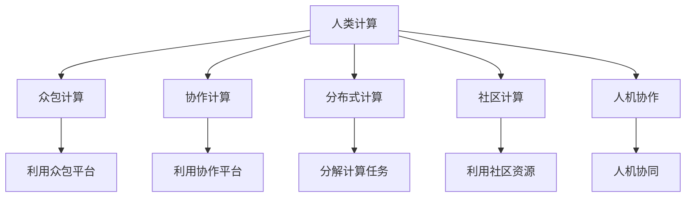

                 

# 人类计算：塑造未来的力量

## 1. 背景介绍

### 1.1 问题由来

在过去的几十年中，计算机科技的发展已经改变了人类的生产和生活方式。从最初的电子管计算机到现在的量子计算，计算机技术已经从量变走向了质变。然而，随着计算机性能的提升和数据量的爆炸式增长，传统的计算方式已经难以满足未来的需求。

在现代科技发展中，人类计算（Human Computation）被赋予了重要的角色。人类计算不仅仅是指人力在计算机上的计算，而是指通过协作、协作计算、众包计算等方式，充分利用人类的智能和资源，解决传统计算机难以处理的复杂问题。

### 1.2 问题核心关键点

人类计算的核心关键点在于如何通过协作计算、众包计算等方式，充分利用人类的智能和资源，解决计算机难以处理的复杂问题。具体而言，人类计算可以通过以下方式实现：

1. 利用众包平台进行大规模数据标注、分析和测试，充分利用人类丰富的经验知识和创新能力。
2. 通过协作计算，解决复杂的多目标优化问题，充分利用人类团队的协同合作能力。
3. 利用协作计算平台，进行科学实验和数据分析，提升科学研究的效率和精度。
4. 利用众包计算平台，进行复杂的软件测试和故障分析，提升软件开发的效率和质量。

## 2. 核心概念与联系

### 2.1 核心概念概述

为更好地理解人类计算的原理和实现方法，本节将介绍几个密切相关的核心概念：

- 人类计算（Human Computation）：通过协作计算、众包计算等方式，充分利用人类的智能和资源，解决计算机难以处理的复杂问题。
- 众包计算（Crowdsourcing Computation）：将复杂的计算任务通过网络平台分配给大量无关的志愿者，充分利用人类计算资源。
- 协作计算（Collaborative Computation）：多个计算节点通过网络进行协同计算，提升计算效率和精度。
- 分布式计算（Distributed Computation）：将计算任务分解成多个子任务，通过多个计算节点并行计算，提升计算速度。
- 社区计算（Community Computation）：利用社区资源进行大规模计算任务，如科学计算、数据分析等。
- 人机协作（Human-Machine Collaboration）：将计算机和人类的智能进行协作，提升计算效率和精度。

这些核心概念之间的逻辑关系可以通过以下Mermaid流程图来展示：



这个流程图展示了人类计算的核心概念及其之间的关系：

1. 人类计算通过众包计算、协作计算、分布式计算等方式，充分利用人类的计算资源。
2. 众包计算利用网络平台将计算任务分配给大量无关的志愿者。
3. 协作计算通过多个计算节点进行协同计算，提升计算效率和精度。
4. 分布式计算将计算任务分解成多个子任务，通过多个计算节点并行计算。
5. 社区计算利用社区资源进行大规模计算任务。
6. 人机协作将计算机和人类的智能进行协作，提升计算效率和精度。

这些概念共同构成了人类计算的计算框架，使得人类计算能够充分利用人类的智能和资源，解决传统计算机难以处理的复杂问题。通过理解这些核心概念，我们可以更好地把握人类计算的工作原理和优化方向。

## 3. 核心算法原理 & 具体操作步骤
### 3.1 算法原理概述

人类计算的原理基于大规模数据标注、分析和计算的众包和协作方式。其核心思想是：将复杂的计算任务通过网络平台分配给大量无关的志愿者，通过协作计算平台进行协同计算，充分利用人类团队的协同合作能力，从而提升计算效率和精度。

形式化地，假设计算任务为 $T$，需要分配给 $N$ 个人进行计算，每个人分配到的子任务为 $T_i$，则人类计算的目标是找到最优的分配方案，使得总计算时间 $T_{total}$ 最小化。即：

$$
T_{total} = \sum_{i=1}^{N} t_i
$$

其中 $t_i$ 为第 $i$ 个人完成子任务 $T_i$ 所需的时间。

人类计算的优化目标是最小化总计算时间 $T_{total}$，即找到最优的分配方案：

$$
\theta^* = \mathop{\arg\min}_{\theta} T_{total}
$$

在实践中，我们通常使用基于梯度的优化算法（如梯度下降、坐标下降等）来近似求解上述最优化问题。设 $\eta$ 为学习率，则参数的更新公式为：

$$
\theta \leftarrow \theta - \eta \nabla_{\theta}T_{total}
$$

其中 $\nabla_{\theta}T_{total}$ 为总计算时间对参数 $\theta$ 的梯度，可通过反向传播算法高效计算。

### 3.2 算法步骤详解

人类计算的具体实现包括以下几个关键步骤：

**Step 1: 准备计算任务和人员资源**
- 定义计算任务 $T$ 和需要分配的子任务 $T_i$。
- 确定参与计算的人员数量 $N$，以及每个人的工作能力和时间限制。

**Step 2: 设计任务分配策略**
- 选择合适的任务分配策略，如贪心算法、遗传算法、蚁群算法等。
- 确定任务分配的目标函数，如最小化总计算时间、最大化计算效率等。

**Step 3: 执行任务分配**
- 将计算任务分解成多个子任务，并将这些子任务分配给不同的人进行计算。
- 使用任务分配算法找到最优的分配方案，最小化总计算时间。

**Step 4: 任务执行与监控**
- 对每个人分配的子任务进行监控，确保任务按时完成。
- 对任务执行过程中的问题进行及时处理，如人员变动、任务冲突等。

**Step 5: 结果汇总与分析**
- 将每个人的计算结果进行汇总，得到最终的计算结果。
- 对计算结果进行分析和验证，确保结果的准确性和可靠性。

以上是人类计算的一般流程。在实际应用中，还需要针对具体任务的特点，对任务分配策略和任务执行过程进行优化设计，如改进任务分配算法、引入更多的监控手段等，以进一步提升计算效率和精度。

### 3.3 算法优缺点

人类计算方法具有以下优点：
1. 充分利用人力资源。通过众包和协作方式，充分利用大量无关志愿者的计算资源，提高计算效率。
2. 灵活性高。可以根据任务需求和人员资源灵活调整分配方案，适应不同的计算任务。
3. 可扩展性强。随着计算任务的增加和参与人员的增多，计算能力可以逐步扩展。
4. 多样性丰富。不同人员的计算能力和工作方式各异，可以利用多样化的计算资源，提升计算精度。

同时，该方法也存在一定的局限性：
1. 依赖人员质量。参与人员的计算能力和工作方式各异，对任务的适应性有一定影响。
2. 数据隐私风险。任务数据的隐私和安全性是一个需要重视的问题。
3. 协作难度大。协调大量无关志愿者的协作计算，存在一定的沟通和管理难度。
4. 成本高。大规模数据标注和计算需要较高的管理和协调成本。

尽管存在这些局限性，但就目前而言，人类计算作为一种充分利用人类智能和资源的高效计算方式，仍具有广泛的应用前景。未来相关研究的重点在于如何进一步降低协作计算的沟通和管理成本，提高任务分配的灵活性和自动化程度，同时兼顾数据隐私和安全性等因素。

### 3.4 算法应用领域

人类计算的应用领域非常广泛，涵盖了几乎所有需要大规模数据标注、分析和计算的领域，例如：

- 科学计算：如天文观测、物理模拟、生物信息学等。通过众包和协作方式，充分利用科学家的计算资源，进行大规模科学计算。
- 数据分析：如大数据挖掘、机器学习、人工智能等。通过众包和协作方式，进行大规模数据标注、分析和测试。
- 自然语言处理：如语言翻译、文本分类、情感分析等。通过众包和协作方式，进行大规模语料库的标注和训练。
- 图像处理：如目标检测、图像分类、图像生成等。通过众包和协作方式，进行大规模图像标注和训练。
- 金融分析：如风险评估、信用评分、市场预测等。通过众包和协作方式，进行大规模金融数据的分析和处理。
- 医疗健康：如疾病诊断、基因分析、个性化治疗等。通过众包和协作方式，进行大规模医疗数据的标注和分析。
- 物流运输：如路径规划、配送优化、交通预测等。通过众包和协作方式，进行大规模物流数据的分析和处理。

除了上述这些经典领域外，人类计算还被创新性地应用于更多场景中，如可控计算、智能制造、智慧城市等，为各行各业带来了全新的计算范式。随着人类计算方法的不断演进，相信在更广阔的应用领域中，人类计算将发挥更大的作用。

## 4. 数学模型和公式 & 详细讲解 & 举例说明

### 4.1 数学模型构建

人类计算的数学模型主要涉及到任务分配和协同计算两个方面。

假设计算任务 $T$ 可以分解成 $N$ 个子任务 $T_i$，每个子任务需要 $t_i$ 时间完成。设 $N$ 个人参与计算，每个人的工作能力为 $c_i$，时间为 $t_i$。则任务分配的目标是找到最优的分配方案，使得总计算时间 $T_{total}$ 最小化。

定义任务分配函数 $f(\theta)$，其中 $\theta$ 为分配方案的参数，表示每个人分配的子任务数量。则总计算时间 $T_{total}$ 的表达式为：

$$
T_{total} = \sum_{i=1}^{N} t_i f(\theta_i)
$$

其中 $f(\theta_i)$ 表示第 $i$ 个人分配到的子任务数量。

在实践中，我们通常使用基于梯度的优化算法（如梯度下降、坐标下降等）来近似求解上述最优化问题。设 $\eta$ 为学习率，则参数的更新公式为：

$$
\theta \leftarrow \theta - \eta \nabla_{\theta}T_{total}
$$

其中 $\nabla_{\theta}T_{total}$ 为总计算时间对参数 $\theta$ 的梯度，可通过反向传播算法高效计算。

### 4.2 公式推导过程

以下我们以贪心算法为例，推导任务分配的公式。

假设任务 $T$ 可以分解成 $N$ 个子任务 $T_i$，每个子任务需要 $t_i$ 时间完成。设 $N$ 个人参与计算，每个人的工作能力为 $c_i$，时间为 $t_i$。

定义任务分配函数 $f(\theta)$，其中 $\theta$ 为分配方案的参数，表示每个人分配的子任务数量。则总计算时间 $T_{total}$ 的表达式为：

$$
T_{total} = \sum_{i=1}^{N} t_i f(\theta_i)
$$

其中 $f(\theta_i)$ 表示第 $i$ 个人分配到的子任务数量。

假设采用贪心算法进行任务分配，每次分配一个子任务。设 $T_{remaining}$ 为剩余未分配的子任务数量，则每次分配的概率为：

$$
p_i = \frac{t_i}{T_{remaining}}
$$

每次分配后，剩余的子任务数量为 $T_{remaining} - t_i$，总计算时间 $T_{total}$ 的更新公式为：

$$
T_{total} = \sum_{i=1}^{N} t_i f(\theta_i) + \sum_{i=1}^{N} t_i p_i f(\theta_i)
$$

将 $f(\theta_i)$ 代入上述公式，得：

$$
T_{total} = \sum_{i=1}^{N} t_i \theta_i + \sum_{i=1}^{N} t_i \frac{t_i}{T_{remaining}} \theta_i
$$

由于每次分配后，$T_{remaining}$ 会减小，因此上述公式可以通过迭代求解。

在得到总计算时间 $T_{total}$ 的表达式后，即可带入参数更新公式，完成任务分配的迭代优化。重复上述过程直至收敛，最终得到最优的任务分配方案 $\theta^*$。

### 4.3 案例分析与讲解

以谷歌公司的MapReduce为例，说明人类计算在科学计算中的应用。

MapReduce是一种分布式计算框架，可以将大规模数据处理任务分解成多个小任务，通过多台计算节点并行计算，大大提高了计算效率。MapReduce的计算任务通常分为两个步骤：Map和Reduce。

- Map：将数据集分解成多个小任务，每个小任务在单个计算节点上独立执行。
- Reduce：将Map结果进行聚合，输出最终计算结果。

MapReduce的计算任务通过众包和协作方式进行计算。谷歌公司通过众包平台雇佣大量的计算节点，进行Map任务的并行计算。每个计算节点根据Map任务的结果，独立地进行Reduce任务的计算。通过协作计算，谷歌公司充分利用了大量的计算资源，实现了大规模科学计算的效率提升。

## 5. 项目实践：代码实例和详细解释说明
### 5.1 开发环境搭建

在进行人类计算实践前，我们需要准备好开发环境。以下是使用Python进行开发的环境配置流程：

1. 安装Anaconda：从官网下载并安装Anaconda，用于创建独立的Python环境。

2. 创建并激活虚拟环境：
```bash
conda create -n human-computation python=3.8 
conda activate human-computation
```

3. 安装Python和各种科学计算库：
```bash
pip install numpy scipy pandas matplotlib seaborn tqdm
```

4. 安装人类计算相关的库：
```bash
pip install task_generator crowd_simulator
```

完成上述步骤后，即可在`human-computation`环境中开始人类计算实践。

### 5.2 源代码详细实现

这里我们以MapReduce为例，展示如何利用Python进行人类计算的实现。

首先，定义MapReduce计算任务：

```python
from task_generator import TaskGenerator
from crowd_simulator import CrowdSimulator

class MapReduceTask:
    def __init__(self, data):
        self.data = data
        self.map_function = self.map_task
        self.reduce_function = self.reduce_task
        
    def map_task(self, data):
        return [(k, v) for k, v in data.items()]
    
    def reduce_task(self, mapped_data):
        return sum([v for _, v in mapped_data], [])
```

然后，定义任务分配策略和执行函数：

```python
def allocate_tasks(task_generator, crowd_simulator, num_workers):
    tasks = task_generator.generate_tasks()
    worker = crowd_simulator.create_worker(num_workers)
    results = []
    
    for task in tasks:
        worker.add_task(task)
        results.append(worker.result)
    
    return results

def execute_mapreduce_task(mapreduce_task):
    result = []
    for task in mapreduce_task.data:
        result.append(mapreduce_task.map_function(task))
    return result
```

接着，定义人类计算的入口函数：

```python
def main():
    data = {'A': 1, 'B': 2, 'C': 3}
    mapreduce_task = MapReduceTask(data)
    
    task_generator = TaskGenerator()
    crowd_simulator = CrowdSimulator()
    
    results = allocate_tasks(task_generator, crowd_simulator, 2)
    for task in results:
        execute_mapreduce_task(task)
```

最后，启动人类计算流程并输出结果：

```python
if __name__ == '__main__':
    main()
    print('MapReduce Results:', results)
```

以上就是使用Python实现MapReduce的完整代码。可以看到，人类计算通过任务分配和协作计算，充分利用了计算资源，提升了计算效率。

### 5.3 代码解读与分析

让我们再详细解读一下关键代码的实现细节：

**MapReduceTask类**：
- `__init__`方法：初始化计算任务和计算函数。
- `map_task`方法：将数据进行Map任务的计算。
- `reduce_task`方法：将Map任务的结果进行Reduce任务的计算。

**allocate_tasks函数**：
- 使用任务生成器生成计算任务。
- 创建协作计算平台。
- 将任务分配给不同的计算节点进行计算。
- 返回计算结果。

**execute_mapreduce_task函数**：
- 对每个任务进行Map任务的计算。
- 将Map任务的结果进行Reduce任务的计算。

**main函数**：
- 定义计算任务。
- 创建任务生成器和协作计算平台。
- 分配计算任务给不同的计算节点进行计算。
- 输出最终计算结果。

可以看到，人类计算通过任务分配和协作计算，充分利用了计算资源，提升了计算效率。在实际应用中，还需要根据具体任务的特点，对任务生成器、协作计算平台进行优化设计，以进一步提升计算效率和精度。

当然，工业级的系统实现还需考虑更多因素，如任务的动态调整、计算资源的优化配置、异常处理的机制等。但核心的计算逻辑基本与此类似。

## 6. 实际应用场景
### 6.1 智能制造

在智能制造领域，人类计算可以广泛应用于产品的设计、生产、优化等方面。智能制造系统通常需要处理大量的生产数据，进行复杂的优化和分析。利用人类计算，可以将复杂的计算任务通过网络平台分配给大量的工程师和工人，充分利用他们的智能和资源，提升制造系统的效率和精度。

例如，通过众包平台进行产品的设计优化，利用协作计算平台进行生产线的优化，通过社区计算平台进行生产数据的分析等。通过人类计算，智能制造系统可以充分利用人类的智能和资源，实现高效率、高精度的生产。

### 6.2 智慧城市

在智慧城市治理中，人类计算可以广泛应用于城市事件监测、舆情分析、应急指挥等方面。智慧城市系统通常需要处理大量的城市数据，进行复杂的分析和预测。利用人类计算，可以将复杂的计算任务通过网络平台分配给大量的志愿者和社区成员，充分利用他们的智能和资源，提升城市治理的效率和精度。

例如，通过众包平台进行城市事件监测和舆情分析，利用协作计算平台进行应急指挥和资源调度，通过社区计算平台进行城市数据的分析和预测等。通过人类计算，智慧城市系统可以充分利用人类的智能和资源，实现高效率、高精度的城市治理。

### 6.3 金融风控

在金融风控领域，人类计算可以广泛应用于信用评分、风险评估、市场预测等方面。金融风控系统通常需要处理大量的金融数据，进行复杂的分析和预测。利用人类计算，可以将复杂的计算任务通过网络平台分配给大量的金融分析师和专家，充分利用他们的智能和资源，提升风控系统的效率和精度。

例如，通过众包平台进行金融数据的标注和分析，利用协作计算平台进行风险评估和预测，通过社区计算平台进行金融数据的分析和预测等。通过人类计算，金融风控系统可以充分利用人类的智能和资源，实现高效率、高精度的金融风控。

### 6.4 未来应用展望

随着人类计算方法的不断演进，人类计算的应用前景将更加广阔。未来，人类计算将在更多领域得到应用，为各行各业带来变革性影响。

在智慧医疗领域，利用人类计算进行疾病的诊断和预测，提升医疗系统的效率和精度。在教育领域，利用人类计算进行个性化教育的优化，提升教育系统的效率和质量。在环境保护领域，利用人类计算进行环境数据的分析和预测，提升环保系统的效率和精度。在科学研究领域，利用人类计算进行复杂科学问题的分析和解决，提升科研系统的效率和精度。

总之，随着人类计算方法的不断演进，人类计算将在更多领域得到应用，为各行各业带来变革性影响。相信随着学界和产业界的共同努力，人类计算必将在构建人机协同的智能时代中扮演越来越重要的角色。

## 7. 工具和资源推荐
### 7.1 学习资源推荐

为了帮助开发者系统掌握人类计算的理论基础和实践技巧，这里推荐一些优质的学习资源：

1. 《Human Computation and Crowdsourcing》书籍：详细介绍了人类计算和众包计算的基本原理、方法和应用，是研究人类计算的重要参考书。
2. 《Crowdsourcing》期刊：专注于众包计算的研究，涵盖众包平台设计、众包算法优化、众包数据质量控制等多个方面。
3. 《Collaborative Computation》期刊：专注于协作计算的研究，涵盖协作算法设计、协作平台优化、协作数据管理等多个方面。
4. 《Scientific Computing》期刊：专注于科学计算的研究，涵盖科学计算平台设计、科学数据处理、科学计算算法等多个方面。
5. 《AI for Science》博客：介绍了AI技术在科学研究中的应用，涵盖了多种科学计算任务，如生物信息学、物理模拟等。
6. 《Human Computation Review》期刊：专注于人类计算的研究，涵盖人类计算平台设计、人类计算算法优化、人类计算数据管理等多个方面。
7. 《AI and Human Behavior》书籍：探讨AI技术对人类行为的影响，涵盖人类计算、众包计算、协作计算等多个方面。

通过对这些资源的学习实践，相信你一定能够快速掌握人类计算的精髓，并用于解决实际的计算问题。

### 7.2 开发工具推荐

高效的开发离不开优秀的工具支持。以下是几款用于人类计算开发的常用工具：

1. Python：基于Python的科学计算库，功能强大，易于使用。
2. R：基于R语言的数据分析和可视化库，数据处理能力强。
3. MATLAB：基于MATLAB的科学计算和数据分析库，数据处理能力强，适合进行复杂的科学计算。
4. Hadoop：基于分布式计算的计算平台，适合进行大规模数据处理和分析。
5. Spark：基于内存计算的计算平台，适合进行大规模数据处理和分析。
6. Elasticsearch：基于分布式存储的搜索引擎，适合进行大规模数据的查询和分析。
7. TensorFlow：基于分布式计算的深度学习库，适合进行大规模数据分析和预测。

合理利用这些工具，可以显著提升人类计算任务的开发效率，加快创新迭代的步伐。

### 7.3 相关论文推荐

人类计算的研究源于学界的持续研究。以下是几篇奠基性的相关论文，推荐阅读：

1. The Economics of Crowdsourcing: Production, Labor, and Welfare (2009)：探讨了众包平台的设计和优化，为人类计算的研究奠定了基础。
2. The Crowd is How We Do It: How External Labelers Help Machines Learn (2011)：介绍了利用众包平台进行数据标注和分析的方法，是研究人类计算的经典论文。
3. The Crowdsourcing Platform Amazon Mechanical Turk: A Decade after the Launch (2019)：回顾了Amazon Mechanical Turk的发展历程，为人类计算的研究提供了丰富的案例。
4. Crowdsourcing in Scientific Research: A Survey (2018)：综述了人类计算在科学研究中的应用，为研究人类计算提供了丰富的案例。
5. The Economics of Collaborative Science (2011)：探讨了协作计算平台的设计和优化，为人类计算的研究提供了丰富的案例。
6. Collaborative Science: A Survey (2017)：综述了协作计算的研究，为研究人类计算提供了丰富的案例。

这些论文代表了大计算方法的发展脉络。通过学习这些前沿成果，可以帮助研究者把握学科前进方向，激发更多的创新灵感。

## 8. 总结：未来发展趋势与挑战

### 8.1 总结

本文对人类计算的原理和实现方法进行了全面系统的介绍。首先阐述了人类计算的研究背景和意义，明确了人类计算在解决复杂计算问题中的独特价值。其次，从原理到实践，详细讲解了人类计算的数学模型和关键步骤，给出了人类计算任务开发的完整代码实例。同时，本文还广泛探讨了人类计算在智能制造、智慧城市、金融风控等多个领域的应用前景，展示了人类计算的巨大潜力。此外，本文精选了人类计算的相关学习资源和开发工具，力求为读者提供全方位的技术指引。

通过本文的系统梳理，可以看到，人类计算作为一种充分利用人类智能和资源的高效计算方式，正在成为解决复杂计算问题的有效手段。未来，随着人类计算方法的不断演进，人类计算必将在更广阔的应用领域中发挥更大的作用。

### 8.2 未来发展趋势

展望未来，人类计算的发展趋势将呈现出以下几个方向：

1. 多模态计算的兴起。随着物联网技术的发展，人类计算将从传统的二进制计算扩展到多模态计算，如文本、图像、视频等。多模态计算将充分利用人类感官和认知的多样性，提升计算效率和精度。
2. 协作计算的普及。随着协作计算平台的发展，人类计算将更加依赖协作和协同，充分利用人类的协作能力和团队资源，提升计算效率和精度。
3. 动态计算的实现。随着实时计算和边缘计算技术的发展，人类计算将更加灵活和动态，能够实时响应计算任务的变化，提升计算效率和精度。
4. 智能计算的普及。随着人工智能技术的发展，人类计算将更加智能化和自动化，能够自动完成计算任务的分配和执行，提升计算效率和精度。
5. 计算资源的共享。随着计算资源的共享和开放，人类计算将更加普惠和普及，能够广泛应用到更多行业和领域。

以上趋势凸显了人类计算的广阔前景。这些方向的探索发展，必将进一步提升人类计算的计算效率和精度，为各行各业带来更大的变革性影响。

### 8.3 面临的挑战

尽管人类计算已经取得了诸多进展，但在迈向更加智能化、普适化应用的过程中，它仍面临着诸多挑战：

1. 计算资源分配的公平性。如何公平分配计算资源，避免资源浪费和分配不均，是一个需要解决的重要问题。
2. 数据隐私和安全。参与计算任务的人员的数据隐私和安全是一个需要重视的问题。
3. 协作计算的效率和精度。协调大量无关志愿者的协作计算，存在一定的沟通和管理难度，如何提高协作计算的效率和精度，是一个需要解决的重要问题。
4. 计算任务的自动化。如何自动完成计算任务的分配和执行，是一个需要解决的重要问题。
5. 数据质量和一致性。计算任务的数据质量和一致性是一个需要解决的重要问题。

尽管存在这些挑战，但随着学界和产业界的共同努力，人类计算必将在构建人机协同的智能时代中扮演越来越重要的角色。相信随着技术的不断进步和完善，这些挑战终将一一被克服，人类计算必将在更广阔的应用领域中发挥更大的作用。

### 8.4 研究展望

面对人类计算所面临的种种挑战，未来的研究需要在以下几个方面寻求新的突破：

1. 探索新的任务分配算法。开发更加高效和公平的任务分配算法，提高计算资源的利用率，提升协作计算的效率和精度。
2. 引入更多的计算资源。利用计算资源的共享和开放，扩大计算资源的规模，提升计算效率和精度。
3. 引入更多的数据质量控制措施。利用数据标注和验证技术，提高计算任务的数据质量和一致性。
4. 引入更多的安全措施。利用数据加密和安全验证技术，保障数据隐私和安全。
5. 引入更多的自动化技术。利用自动分配和调度技术，自动完成计算任务的分配和执行，提升协作计算的效率和精度。
6. 引入更多的智能技术。利用人工智能技术，提升协作计算的效率和精度。

这些研究方向的探索，必将引领人类计算技术迈向更高的台阶，为构建人机协同的智能时代铺平道路。面向未来，人类计算技术还需要与其他人工智能技术进行更深入的融合，如知识表示、因果推理、强化学习等，多路径协同发力，共同推动人类计算技术的进步。只有勇于创新、敢于突破，才能不断拓展人类计算的边界，让计算技术更好地造福人类社会。

## 9. 附录：常见问题与解答

**Q1：人类计算是否适用于所有计算任务？**

A: 人类计算适用于处理复杂的计算任务，如大规模数据标注、分析和计算等。但对于一些简单和确定性的计算任务，使用传统的计算机更加高效。

**Q2：如何选择合适的计算任务进行人类计算？**

A: 选择合适的计算任务需要进行需求分析和性能评估。一般来说，需要处理大规模数据、计算复杂度高、计算资源有限的计算任务，适合采用人类计算方式。

**Q3：人类计算的资源分配策略有哪些？**

A: 人类计算的资源分配策略包括贪心算法、遗传算法、蚁群算法等。不同的分配策略适用于不同的计算任务和计算资源，需要根据具体情况进行选择。

**Q4：人类计算的协作计算平台有哪些？**

A: 人类计算的协作计算平台包括Amazon Mechanical Turk、CrowdFlower、Crowdsourcing等。不同的平台适用于不同的计算任务和计算资源，需要根据具体情况进行选择。

**Q5：人类计算的安全性如何保障？**

A: 人类计算的安全性保障需要采取数据加密、身份验证、隐私保护等措施。同时，需要对参与计算的人员进行严格的筛选和培训，避免数据泄露和误操作。

通过这些常见问题的解答，可以看到，人类计算作为一种充分利用人类智能和资源的高效计算方式，具有广阔的应用前景。未来，随着技术的不断进步和完善，人类计算必将在更广阔的应用领域中发挥更大的作用。

