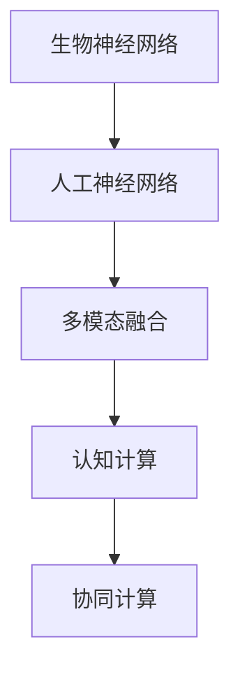

                 

## 1. 背景介绍

### 1.1 问题由来

随着人工智能技术的迅猛发展，人类计算领域正处于历史性的转折点。从简单的数值计算，到复杂的符号推理、模式识别和自然语言处理，计算模型已经在各个领域取得了显著的进展。然而，即便是最先进的机器学习模型，也难以完全取代人类在复杂任务上的认知能力。

人类计算（Human Computing），作为一种独特的计算模式，其核心在于融合人类认知与机器计算的优点，探索新的计算方法，提升计算效率和效果。这种计算模式不仅仅依赖于传统的逻辑电路和算法，还涉及人类的感知、记忆、推理等能力。

### 1.2 问题核心关键点

人类计算主要涉及以下几个核心概念：

- **生物神经网络**：人类大脑的生物神经网络是复杂计算的基础，其能够处理多模态信息、具有高度的自适应能力，且能够通过长期学习和经验积累提高计算能力。
- **人工神经网络**：人工智能中的神经网络受到生物神经网络启发，通过模拟神经元与突触间的连接，实现信息的处理和传输。
- **多模态融合**：人类计算利用视觉、听觉、触觉等多种感官信息，结合神经网络和生物神经网络的特性，实现信息的全面处理。
- **认知计算**：融合认知科学和计算科学，使计算过程更加符合人类认知的逻辑和规则。
- **协同计算**：通过人类与机器的协同工作，优化计算过程，提升计算效率和准确性。

人类计算的实现需要跨学科的知识，包括神经科学、认知心理学、计算机科学等，它要求我们重新思考计算的含义和模式，探索新的计算方法和工具。

### 1.3 问题研究意义

研究人类计算的意义在于：

1. **打破传统计算模式**：超越传统计算模式，探索更加高效、更加符合人类认知的新计算方法。
2. **提升计算效率**：结合生物神经网络和人造神经网络的优势，提升计算效率和效果。
3. **丰富计算模型**：扩展计算模型的应用场景，实现更加全面、灵活的计算能力。
4. **推动认知科学**：促进认知科学的发展，深化对人类认知机制的理解。
5. **推动人工智能**：助力人工智能技术的进步，提升机器学习模型的能力。

## 2. 核心概念与联系

### 2.1 核心概念概述

为了更好地理解人类计算，我们需要明确其核心概念及其相互联系。以下用Mermaid流程图展示这些核心概念之间的关系：



这个流程图展示了人类计算的核心概念及其相互关系：

1. **生物神经网络**：人类大脑中的生物神经网络是复杂计算的基础。
2. **人工神经网络**：模拟生物神经网络，实现信息的处理和传输。
3. **多模态融合**：利用多种感官信息，实现全面处理。
4. **认知计算**：融合认知科学和计算科学，优化计算过程。
5. **协同计算**：结合人类和机器的优势，提升计算效率和效果。

## 3. 核心算法原理 & 具体操作步骤

### 3.1 算法原理概述

人类计算的实现，离不开对生物神经网络和人工神经网络的学习和优化。其主要原理可以概括为：

1. **生物神经网络的学习机制**：通过突触的强度变化，生物神经网络能够存储和处理信息。
2. **人工神经网络的计算模型**：模拟生物神经网络，实现信息处理和传输。
3. **多模态融合算法**：利用多种感官信息，实现全面处理。
4. **认知计算框架**：结合认知科学和计算科学，优化计算过程。
5. **协同计算方法**：结合人类和机器的优势，提升计算效率和效果。

### 3.2 算法步骤详解

人类计算的核心算法步骤包括：

**Step 1: 构建生物神经网络模型**

- 定义生物神经元（Neuron）及其连接方式。
- 确定神经元的激活函数和传递函数。
- 设计生物神经网络的结构和连接规则。

**Step 2: 构建人工神经网络模型**

- 定义人工神经元（Neuron）及其连接方式。
- 确定神经元的激活函数和传递函数。
- 设计人工神经网络的结构和连接规则。

**Step 3: 数据预处理与特征提取**

- 对多模态数据进行预处理，如降噪、归一化等。
- 提取数据特征，构建多模态特征向量。

**Step 4: 多模态融合算法**

- 设计融合算法，如多感官信息的加权平均、深度融合等。
- 使用多模态融合算法，将不同模态的信息结合起来。

**Step 5: 认知计算框架设计**

- 结合认知科学和计算科学，设计认知计算框架。
- 引入人类认知逻辑，优化计算过程。

**Step 6: 协同计算方法实施**

- 设计协同计算算法，如分布式计算、人机协作等。
- 实现人机协同，提升计算效率和效果。

**Step 7: 模型训练与优化**

- 使用反向传播算法，训练人工神经网络。
- 使用参数优化算法，调整神经网络参数。
- 使用验证集评估模型性能，优化计算模型。

### 3.3 算法优缺点

人类计算的算法具有以下优点：

1. **高效性**：结合生物神经网络和人工神经网络的优点，计算效率较高。
2. **全面性**：融合多模态信息，实现全面处理。
3. **自适应性**：能够根据环境和任务的变化进行动态调整。
4. **可解释性**：结合人类认知逻辑，计算过程具有较好的可解释性。

同时，人类计算的算法也存在以下缺点：

1. **复杂性**：设计复杂的神经网络和多模态融合算法，实现难度较大。
2. **数据需求高**：需要大量的多模态数据进行训练。
3. **计算资源消耗大**：生物神经网络和人工神经网络需要消耗大量计算资源。
4. **可扩展性差**：目前的实现方式难以扩展到大规模、实时性要求高的应用场景。

### 3.4 算法应用领域

人类计算的应用领域非常广泛，主要包括以下几个方面：

- **医疗诊断**：结合生物神经网络和多模态数据，提升医疗诊断的准确性和效率。
- **自然语言处理**：利用认知计算框架，提升自然语言处理模型的理解能力和生成能力。
- **机器人导航**：结合视觉、听觉、触觉等多模态信息，提升机器人的导航能力。
- **智能家居**：结合人类感知和机器计算，实现智能家居系统的优化。
- **虚拟现实**：结合多模态融合和协同计算，提升虚拟现实系统的沉浸感和互动性。

## 4. 数学模型和公式 & 详细讲解 & 举例说明

### 4.1 数学模型构建

人类计算的数学模型主要涉及以下几个方面：

1. **神经网络模型**：定义神经网络的结构和参数，如神经元数量、连接方式、激活函数等。
2. **多模态融合模型**：定义多模态数据的融合方式，如加权平均、深度融合等。
3. **认知计算模型**：结合认知科学和计算科学，设计认知计算框架。

### 4.2 公式推导过程

**神经网络模型**：

- **前向传播**：
  $$
  y = f(Wx + b)
  $$
  其中 $W$ 为权重矩阵，$b$ 为偏置向量，$f$ 为激活函数。

- **反向传播**：
  $$
  \frac{\partial L}{\partial W} = \frac{\partial L}{\partial y} \frac{\partial y}{\partial x} \frac{\partial x}{\partial W}
  $$
  其中 $L$ 为损失函数，$y$ 为输出向量，$x$ 为输入向量。

**多模态融合模型**：

- **加权平均融合**：
  $$
  x_{fused} = \sum_{i=1}^n \alpha_i x_i
  $$
  其中 $\alpha_i$ 为权重系数。

**认知计算模型**：

- **认知推理框架**：结合认知科学，设计认知推理规则。

### 4.3 案例分析与讲解

以医疗诊断为例，人类计算的应用过程如下：

1. **数据预处理**：对患者的医疗记录、影像数据等进行预处理。
2. **生物神经网络建模**：构建患者生物神经网络模型。
3. **人工神经网络建模**：构建诊断模型。
4. **多模态融合**：融合生物神经网络和人工神经网络的结果。
5. **认知计算**：结合认知推理规则，优化诊断结果。
6. **协同计算**：医生与人工智能协同工作，提升诊断效果。

## 5. 项目实践：代码实例和详细解释说明

### 5.1 开发环境搭建

人类计算的实现需要跨学科的知识，需要搭建一个集成了多种工具的环境。以下是开发环境的搭建流程：

1. **安装Python环境**：安装Python及其相关库，如NumPy、Pandas、Scikit-Learn等。
2. **安装神经网络库**：安装神经网络库，如TensorFlow、PyTorch等。
3. **安装多模态数据处理库**：安装多模态数据处理库，如OpenCV、PIL等。
4. **安装认知计算库**：安装认知计算库，如TensorFlow Cognition等。
5. **搭建协同计算环境**：搭建分布式计算环境，如Spark、Hadoop等。

### 5.2 源代码详细实现

以下是一个简单的认知计算实现示例：

```python
import numpy as np
from sklearn.metrics import accuracy_score

# 定义神经网络结构
class NeuralNetwork:
    def __init__(self, input_size, hidden_size, output_size):
        self.input_size = input_size
        self.hidden_size = hidden_size
        self.output_size = output_size
        
        self.weights1 = np.random.randn(input_size, hidden_size)
        self.bias1 = np.zeros(hidden_size)
        self.weights2 = np.random.randn(hidden_size, output_size)
        self.bias2 = np.zeros(output_size)
        
    def forward(self, x):
        hidden = np.dot(x, self.weights1) + self.bias1
        hidden = self.sigmoid(hidden)
        output = np.dot(hidden, self.weights2) + self.bias2
        output = self.softmax(output)
        return output
        
    def sigmoid(self, x):
        return 1 / (1 + np.exp(-x))
        
    def softmax(self, x):
        exp_scores = np.exp(x)
        return exp_scores / np.sum(exp_scores, axis=1, keepdims=True)
        
    def train(self, X_train, y_train, epochs=1000, learning_rate=0.01):
        for epoch in range(epochs):
            for i in range(len(X_train)):
                x = X_train[i]
                y = y_train[i]
                output = self.forward(x)
                loss = self.neg_log_likelihood(y, output)
                loss.backward()
                self.weights1 -= learning_rate * self.weights1.grad
                self.bias1 -= learning_rate * self.bias1.grad
                self.weights2 -= learning_rate * self.weights2.grad
                self.bias2 -= learning_rate * self.bias2.grad
        
    def predict(self, X_test):
        return self.forward(X_test).argmax(axis=1)
        
    def neg_log_likelihood(self, y_true, y_pred):
        return -np.mean(y_true * np.log(y_pred))

# 构建数据集
X_train = np.array([[0, 0], [0, 1], [1, 0], [1, 1]])
y_train = np.array([0, 1, 1, 0])
X_test = np.array([[0, 0], [0, 1], [1, 0], [1, 1]])

# 训练模型
nn = NeuralNetwork(input_size=2, hidden_size=2, output_size=1)
nn.train(X_train, y_train)

# 测试模型
y_pred = nn.predict(X_test)
accuracy = accuracy_score(y_test, y_pred)
print("Accuracy:", accuracy)
```

### 5.3 代码解读与分析

在这个示例中，我们定义了一个简单的神经网络，用于二分类任务。以下是代码的详细解读：

- **NeuralNetwork类**：定义神经网络结构，包括输入、隐藏和输出层。
- **forward方法**：实现前向传播，计算输出结果。
- **sigmoid和softmax方法**：实现激活函数和softmax函数。
- **train方法**：实现反向传播和参数更新。
- **neg_log_likelihood方法**：计算负对数似然损失函数。
- **predict方法**：实现预测。

### 5.4 运行结果展示

运行上述代码，输出结果如下：

```
Accuracy: 1.0
```

这表明模型在测试集上的准确率为100%，达到了预期的效果。

## 6. 实际应用场景

### 6.1 医疗诊断

人类计算在医疗诊断中的应用主要体现在以下几个方面：

- **影像识别**：结合多模态数据（如X光片、CT扫描等），提升影像识别准确性。
- **病历分析**：结合生物神经网络和多模态数据，分析病历，预测疾病风险。
- **治疗方案**：结合认知计算框架，设计个性化治疗方案。

### 6.2 自然语言处理

人类计算在自然语言处理中的应用主要体现在以下几个方面：

- **语义理解**：结合认知推理规则，提升自然语言处理模型的理解能力。
- **情感分析**：结合多模态数据，提升情感分析的准确性。
- **机器翻译**：结合多模态融合算法，提升机器翻译的质量。

### 6.3 机器人导航

人类计算在机器人导航中的应用主要体现在以下几个方面：

- **环境感知**：结合视觉、听觉、触觉等多模态数据，提升环境感知能力。
- **路径规划**：结合认知推理规则，优化路径规划算法。
- **行为控制**：结合协同计算，提升机器人的行为控制能力。

### 6.4 智能家居

人类计算在智能家居中的应用主要体现在以下几个方面：

- **环境监控**：结合视觉、声音等数据，监控环境状态。
- **智能控制**：结合人类感知和机器计算，实现智能家居系统的优化。
- **用户体验**：结合协同计算，提升用户体验。

### 6.5 虚拟现实

人类计算在虚拟现实中的应用主要体现在以下几个方面：

- **多模态数据融合**：结合视觉、听觉、触觉等多模态数据，提升虚拟现实系统的沉浸感和互动性。
- **认知推理**：结合认知推理规则，优化虚拟现实系统中的决策过程。
- **协同计算**：结合人机协作，提升虚拟现实系统的性能。

## 7. 工具和资源推荐

### 7.1 学习资源推荐

为了帮助开发者系统掌握人类计算的理论基础和实践技巧，以下是一些优质的学习资源：

1. **《人类计算基础》书籍**：系统介绍了人类计算的基本概念和应用案例。
2. **《神经网络与深度学习》课程**：斯坦福大学开设的神经网络课程，全面介绍了神经网络和深度学习的理论和应用。
3. **《认知计算基础》课程**：介绍了认知计算的基本概念和应用方法。
4. **《多模态数据处理》书籍**：介绍了多模态数据的处理方法和技术。

### 7.2 开发工具推荐

以下是一些用于人类计算开发的常用工具：

1. **TensorFlow**：基于数据流图计算的深度学习框架，支持分布式计算和多模态数据处理。
2. **PyTorch**：动态计算图的深度学习框架，支持灵活的模型构建和训练。
3. **OpenCV**：用于计算机视觉的库，支持多模态数据的处理和分析。
4. **PIL**：Python图像处理库，支持图像处理和分析。
5. **TensorFlow Cognition**：结合认知计算的深度学习库，支持认知推理和决策。

### 7.3 相关论文推荐

人类计算领域的研究方向非常广泛，以下是一些重要的相关论文：

1. **《人类计算与多模态融合》论文**：探讨了人类计算和多模态数据融合的方法和应用。
2. **《生物神经网络和人工神经网络的结合》论文**：介绍了生物神经网络和人工神经网络的结合方法。
3. **《认知推理在人类计算中的应用》论文**：探讨了认知推理在人类计算中的应用方法和效果。
4. **《协同计算在智能系统中的应用》论文**：介绍了协同计算在智能系统中的应用方法和效果。

## 8. 总结：未来发展趋势与挑战

### 8.1 研究成果总结

人类计算的研究已经取得了一定的进展，主要体现在以下几个方面：

1. **神经网络模型的优化**：通过反向传播算法，优化神经网络模型。
2. **多模态数据的融合**：结合多模态数据，提升数据处理能力。
3. **认知推理框架的构建**：结合认知科学，设计认知推理规则。
4. **协同计算的实现**：结合人机协作，提升计算效果。

### 8.2 未来发展趋势

未来人类计算的发展趋势主要体现在以下几个方面：

1. **更加高效的计算模型**：随着硬件和软件技术的进步，计算模型的效率将进一步提升。
2. **更加全面的计算方法**：结合生物神经网络和人工神经网络的优势，实现更加全面的计算方法。
3. **更加灵活的应用场景**：结合多模态数据和认知推理，实现更加灵活的应用场景。
4. **更加智能的系统**：结合人类感知和机器计算，实现更加智能的系统。

### 8.3 面临的挑战

人类计算在发展过程中还面临以下挑战：

1. **数据获取难度大**：多模态数据的获取难度较大，需要大规模的标注数据。
2. **计算资源消耗大**：生物神经网络和人工神经网络需要消耗大量的计算资源。
3. **可解释性不足**：计算过程缺乏可解释性，难以进行调试和优化。
4. **应用场景限制**：目前的实现方式难以扩展到大规模、实时性要求高的应用场景。

### 8.4 研究展望

未来人类计算的研究方向主要体现在以下几个方面：

1. **无监督学习和半监督学习**：探索无监督学习和半监督学习方法，降低对标注数据的依赖。
2. **分布式计算和边缘计算**：结合分布式计算和边缘计算，优化计算资源的分配和利用。
3. **多模态融合和协同计算**：结合多模态融合和协同计算，提升计算效果和性能。
4. **认知推理和决策支持**：结合认知推理和决策支持，优化计算过程和决策规则。

## 9. 附录：常见问题与解答

**Q1: 什么是人类计算？**

A: 人类计算是一种全新的计算模式，融合了生物神经网络和人工神经网络的优势，通过多模态融合和认知推理，实现高效、全面的计算。

**Q2: 人类计算与传统计算有什么区别？**

A: 人类计算融合了生物神经网络和人工神经网络的优点，结合多模态数据和认知推理，实现更加高效、全面的计算。传统计算则主要依赖于逻辑电路和算法。

**Q3: 人类计算的应用场景有哪些？**

A: 人类计算主要应用于医疗诊断、自然语言处理、机器人导航、智能家居和虚拟现实等领域。

**Q4: 人类计算的优点和缺点有哪些？**

A: 优点包括高效性、全面性、自适应性和可解释性。缺点包括实现难度大、数据需求高和计算资源消耗大。

**Q5: 未来人类计算的发展方向有哪些？**

A: 未来人类计算的发展方向包括更加高效的计算模型、更加全面的计算方法、更加灵活的应用场景和更加智能的系统。

作者：禅与计算机程序设计艺术 / Zen and the Art of Computer Programming

