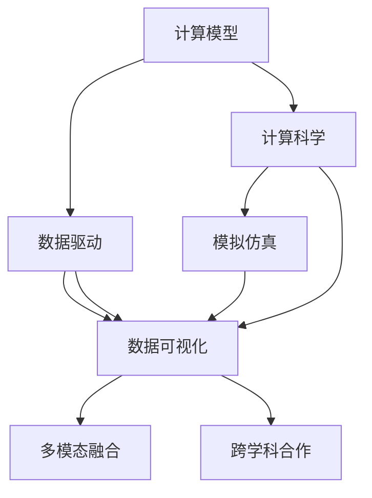

                 

# 人类计算：科学研究的新范式

> 关键词：人类计算, 科学研究, 计算模型, 数据驱动, 实验设计, 计算科学

## 1. 背景介绍

### 1.1 问题由来

随着人工智能和数据科学的发展，科学研究的方式正在发生深刻变革。传统的实验和理论分析方法已经难以应对数据的爆炸式增长和复杂性的不断提升。计算模型和计算科学作为一种新的研究范式，开始逐渐崭露头角。

科学研究的核心任务是探索自然规律和优化决策方案。然而，在复杂的系统环境中，人工推导和实验验证往往耗时耗力，且存在主观偏差。计算模型通过建立数学模型，模拟系统行为，可以在可控的环境下进行高效率、大规模的预测和优化。

数据驱动的计算模型能够实时捕捉动态变化，预测未来趋势，为科研决策提供量化依据。同时，计算模型也与传统的理论分析方法相辅相成，相互补充，共同推动科学研究的进步。

### 1.2 问题核心关键点

计算模型和计算科学研究涉及的关键点包括：

- 数据驱动与理论驱动：计算模型强调数据驱动，通过数据学习模型参数，进行预测和优化。理论驱动则侧重于模型推导和数学证明，揭示系统本质。

- 模型建立与验证：计算模型需要根据研究问题，选择合适的数学模型，并利用实验数据进行模型验证和优化。

- 高效计算与算法优化：高效的计算模型和算法能显著提升科研效率和模型精度，为复杂系统研究提供有力支持。

- 跨学科融合：计算模型与物理学、经济学、生物学等不同学科的交叉融合，为解决实际问题提供了全新的视角和方法。

- 计算科学与实验科学：计算科学与实验科学相结合，构建多模态数据融合的科研体系，推动科学研究的深化和拓展。

这些关键点共同构成了计算模型和计算科学研究的核心框架，推动科研领域不断向更深层次和更广领域扩展。

## 2. 核心概念与联系

### 2.1 核心概念概述

为更好地理解计算模型和计算科学研究，本节将介绍几个密切相关的核心概念：

- 计算模型(Computational Model)：一种数学模型，通过数值计算和仿真模拟，模拟现实系统的行为和演化。计算模型可以用于解决复杂的优化问题，预测系统行为，进行科学实验。

- 数据驱动(Datadriven)：基于大规模实验数据，利用机器学习、统计分析等技术，建立和优化计算模型，增强模型的预测能力和泛化能力。

- 计算科学(Computational Science)：研究计算模型的建立、验证和应用，探索计算模型在科学研究和工程实践中的应用潜力。

- 模拟仿真(Simulation and Simulation)：通过计算模型，模拟和仿真现实系统，预测系统行为，进行虚拟实验，优化决策方案。

- 多模态融合(Multimodal Fusion)：将多种数据源(如文本、图像、时间序列等)进行融合，构建多模态计算模型，提升模型的鲁棒性和解释性。

- 数据可视化(Data Visualization)：将计算模型的预测结果和仿真数据进行可视化，直观展示系统行为和演化过程，辅助科研决策。

- 跨学科合作(Interdisciplinary Cooperation)：计算科学与物理学、经济学、生物学等不同学科的交叉融合，探索跨学科计算模型，解决实际问题。

这些核心概念之间的逻辑关系可以通过以下Mermaid流程图来展示：



这个流程图展示了几类计算科学研究的主要概念及其之间的关系：

1. 计算模型通过数据驱动获得大量实验数据。
2. 计算科学研究模型建立和优化方法，指导数据驱动过程。
3. 模拟仿真通过计算模型对系统行为进行预测。
4. 数据可视化将仿真数据进行可视化展示。
5. 多模态融合提升计算模型的鲁棒性。
6. 跨学科合作推动不同学科的交叉融合，形成全新的科研范式。

这些概念共同构成了计算模型和计算科学研究的基本框架，使得计算模型在解决实际问题时具有更强的普适性和灵活性。

## 3. 核心算法原理 & 具体操作步骤
### 3.1 算法原理概述

基于数据驱动的计算模型，通常包括模型的建立、训练、验证和应用等多个环节。其核心思想是：通过大规模实验数据，构建数学模型，并利用优化算法进行模型参数的拟合。计算模型在科学研究中的应用，主要包括以下几个关键步骤：

1. **模型建立**：选择合适的数学模型，定义系统的状态和行为。
2. **数据准备**：收集和预处理实验数据，构建输入和输出样本集。
3. **模型训练**：利用优化算法，最小化模型与实验数据之间的差异。
4. **模型验证**：在未参与训练的验证集上评估模型的泛化能力。
5. **模型应用**：将模型应用于实际问题，进行预测和优化。

### 3.2 算法步骤详解

以经典的蒙特卡洛方法为例，具体介绍基于计算模型的科学研究步骤：

1. **模型建立**：定义一个系统的状态和行为，如抛硬币的概率分布。
2. **数据准备**：模拟多次抛硬币实验，收集数据。
3. **模型训练**：利用蒙特卡洛方法，估计抛硬币的概率分布。
4. **模型验证**：在未参与训练的验证集上评估估计概率的准确性。
5. **模型应用**：预测特定硬币抛掷的结果，进行决策。

### 3.3 算法优缺点

基于计算模型的科学研究具有以下优点：

1. **高效性**：大规模实验数据可以在短时间内进行仿真模拟，提高科研效率。
2. **灵活性**：多种数学模型和优化算法可供选择，适用于复杂多变的系统问题。
3. **普适性**：数据驱动的模型具有良好的泛化能力，适用于不同领域的科学研究。
4. **可解释性**：通过数学模型和仿真模拟，可以直观展示系统行为，增强模型的可解释性。

同时，该方法也存在一些局限性：

1. **模型复杂性**：过于复杂的数学模型可能难以构建和优化，影响模型精度。
2. **数据依赖**：依赖大规模实验数据，数据质量直接影响模型效果。
3. **计算资源**：高维度数据和复杂计算模型需要大量计算资源。
4. **跨学科挑战**：不同学科的交叉融合可能存在知识鸿沟，增加科研难度。
5. **解释性和鲁棒性**：数据驱动的模型存在"黑盒"特性，难以解释模型内部的工作机制。

尽管存在这些局限性，但就目前而言，基于计算模型的科学研究仍是大规模数据分析和优化决策的重要手段。未来相关研究的重点在于如何进一步降低计算复杂度，提高模型解释性和鲁棒性，以及增强跨学科的协同合作。

### 3.4 算法应用领域

基于计算模型的科学研究已经广泛应用于各个领域，例如：

- 物理学：模拟复杂的物理系统，探索新材料和新型能源。
- 天文学：模拟宇宙演化过程，预测恒星和星系的运动。
- 生物学：模拟生物系统，研究基因表达和疾病传播。
- 经济学：预测市场趋势，优化经济政策。
- 工程学：设计新型材料和工艺，提高产品性能。
- 环境科学：模拟气候变化，制定环保策略。

除了上述这些经典领域外，计算模型在金融、医疗、物流等领域的应用也在不断涌现，为科学研究和工程实践带来了新的突破。随着计算模型的不断发展，其在更多领域的应用潜力还将进一步挖掘和拓展。

## 4. 数学模型和公式 & 详细讲解 & 举例说明
### 4.1 数学模型构建

计算模型的构建通常需要选择合适的数学模型，定义系统的状态和行为。以抛硬币为例，可以定义系统的状态为硬币的正反状态，行为为硬币抛掷的概率分布。形式化地，我们可以使用随机变量来描述系统的状态，使用概率分布函数来描述系统的行为。

设随机变量 $X$ 表示硬币的状态，可能的取值为 $X_0$（正）和 $X_1$（反）。设概率分布函数 $P(X|x)$ 表示在给定状态 $x$ 下，随机变量 $X$ 取值为 $x$ 的概率。

### 4.2 公式推导过程

以抛硬币的概率分布为例，假设硬币抛掷结果的概率分布为 $P(X|x)$，利用蒙特卡洛方法进行仿真模拟，得到多次抛掷结果的样本数据 $\{(x_i, y_i)\}_{i=1}^N$，其中 $x_i$ 表示第 $i$ 次抛掷的结果，$y_i$ 表示第 $i$ 次抛掷的结果是否符合概率分布 $P(X|x)$。

为了最小化模型与实验数据的差异，我们定义损失函数 $L(P)$ 表示模型与实验数据的拟合程度。损失函数 $L(P)$ 可以定义为：

$$
L(P) = \frac{1}{N}\sum_{i=1}^N \log P(x_i|y_i)
$$

其中 $\log P(x_i|y_i)$ 表示在给定结果 $y_i$ 下，随机变量 $X$ 取值为 $x_i$ 的对数概率。最小化损失函数 $L(P)$，即最大化模型的预测准确性。

### 4.3 案例分析与讲解

以下是一个基于蒙特卡洛方法计算抛硬币概率分布的Python实现：

```python
import numpy as np
import matplotlib.pyplot as plt

def monte_carlo_simulation(n, trials=10000):
    heads = 0
    for _ in range(trials):
        result = np.random.choice([0, 1], p=[0.5, 0.5])
        if result == 0:
            heads += 1
    return heads / trials

# 进行100次抛硬币模拟
n = 100
simulations = [monte_carlo_simulation(n) for _ in range(n)]

# 绘制概率分布直方图
plt.hist(simulations, bins=2, edgecolor='black')
plt.xlabel('Heads')
plt.ylabel('Count')
plt.title('Monte Carlo Simulation of Coin Tosses')
plt.show()
```

通过蒙特卡洛方法进行100次抛硬币模拟，得到模拟结果的概率分布。可以看到，经过多次模拟，硬币抛掷的概率分布逐渐逼近真实的概率分布 $P(X|x) = 0.5$。

## 5. 项目实践：代码实例和详细解释说明
### 5.1 开发环境搭建

在进行计算模型和计算科学研究前，我们需要准备好开发环境。以下是使用Python进行Matplotlib和NumPy开发的环境配置流程：

1. 安装Anaconda：从官网下载并安装Anaconda，用于创建独立的Python环境。

2. 创建并激活虚拟环境：
```bash
conda create -n pydata-env python=3.8 
conda activate pydata-env
```

3. 安装NumPy和Matplotlib库：
```bash
pip install numpy matplotlib
```

4. 安装各类工具包：
```bash
pip install pandas scikit-learn statsmodels jupyter notebook ipython
```

完成上述步骤后，即可在`pydata-env`环境中开始计算科学研究实践。

### 5.2 源代码详细实现

这里我们以蒙特卡洛方法计算抛硬币概率分布为例，给出基于Python的计算科学研究代码实现。

```python
import numpy as np
import matplotlib.pyplot as plt

def monte_carlo_simulation(n, trials=10000):
    heads = 0
    for _ in range(trials):
        result = np.random.choice([0, 1], p=[0.5, 0.5])
        if result == 0:
            heads += 1
    return heads / trials

# 进行100次抛硬币模拟
n = 100
simulations = [monte_carlo_simulation(n) for _ in range(n)]

# 绘制概率分布直方图
plt.hist(simulations, bins=2, edgecolor='black')
plt.xlabel('Heads')
plt.ylabel('Count')
plt.title('Monte Carlo Simulation of Coin Tosses')
plt.show()
```

通过上述代码，可以直观地展示蒙特卡洛方法模拟抛硬币结果的概率分布，验证模型的正确性。

### 5.3 代码解读与分析

让我们再详细解读一下关键代码的实现细节：

**monte_carlo_simulation函数**：
- 模拟n次抛硬币实验，记录正面次数，计算正面概率。
- 利用NumPy的random.choice函数，根据0.5的概率分布随机生成结果。

**绘制概率分布直方图**：
- 使用Matplotlib的hist函数，绘制概率分布直方图，展示模拟结果。
- 设置横轴为硬币正面次数，纵轴为出现的概率，可视化展示模拟结果。

**代码实现流程**：
- 定义函数进行抛硬币模拟，使用蒙特卡洛方法计算正面概率。
- 进行100次抛硬币模拟，记录每次模拟的正面次数。
- 绘制概率分布直方图，展示模拟结果。

可以看到，通过Python和相关库，计算模型和计算科学研究变得非常简便。开发者可以通过简单的代码实现，快速进行科学模拟和数据可视化，验证模型的正确性。

## 6. 实际应用场景
### 6.1 物理学

物理学领域是计算模型和计算科学研究的重要应用场景。通过计算模型，可以模拟复杂的物理系统，探索新材料和新型能源。

例如，基于分子动力学模拟，可以研究化学反应的微观机制，预测化学反应速率和产物。通过模拟大尺度宇宙演化过程，可以预测恒星和星系的运动轨迹，探索宇宙的演化历史。

### 6.2 生物学

生物学研究中，计算模型和计算科学研究也发挥了重要作用。通过模拟生物系统，可以研究基因表达和疾病传播。

例如，基于随机模型，可以模拟病毒在人群中的传播路径，预测疫情爆发趋势，制定有效的防控策略。通过模拟蛋白质分子的结构，可以预测蛋白质的功能和作用机制，加速新药研发进程。

### 6.3 环境科学

环境科学领域，计算模型和计算科学研究也有广泛应用。通过模拟气候变化，可以预测未来气候趋势，制定环保策略。

例如，基于气候模型，可以预测全球气候变暖趋势，评估气候变化对自然生态系统的影响，制定应对策略。通过模拟空气质量变化，可以预测污染物的扩散路径，制定环境治理措施。

### 6.4 未来应用展望

随着计算模型的不断发展和优化，其在科学研究中的应用前景将更加广阔。

未来，计算模型将更加注重跨学科的融合，推动不同领域的协同创新。跨学科的计算模型，将综合不同领域的知识和数据，构建更加全面、精确的科研体系，提升科研效率和模型精度。

在科学研究中，计算模型和实验科学将进一步融合，构建多模态数据融合的科研体系。通过融合文本、图像、时间序列等多模态数据，构建多模态计算模型，提升模型的鲁棒性和解释性，推动科学研究的深化和拓展。

## 7. 工具和资源推荐
### 7.1 学习资源推荐

为了帮助开发者系统掌握计算模型和计算科学研究的基础知识和高级技能，这里推荐一些优质的学习资源：

1. 《计算模型导论》（Introduction to Computational Models）：全面介绍了计算模型的基本概念、构建方法和应用场景，适合初学者入门。

2. 《Python科学计算》（Python for Scientific Computing）：介绍了NumPy、Matplotlib等科学计算库的使用，涵盖数据处理、可视化和科学模拟等多个方面。

3. 《统计学习方法》（Pattern Recognition and Machine Learning）：涵盖了机器学习、统计学和计算科学的基本原理和方法，适合进阶学习。

4. 《大规模计算模型》（Large-Scale Computational Models）：介绍了大规模数据驱动的计算模型构建方法，涵盖机器学习、深度学习和计算科学等多个方向。

5. 《科学计算与数据建模》（Scientific Computing and Data Modeling）：涵盖了计算模型、数据建模和科学计算等多个方面的理论和实践，适合科研工作者和工程师。

通过对这些资源的学习实践，相信你一定能够系统掌握计算模型和计算科学研究的基础知识和高级技能，提升科研效率和模型精度。

### 7.2 开发工具推荐

高效的开发离不开优秀的工具支持。以下是几款用于计算模型和计算科学研究开发的常用工具：

1. Python：作为科学计算和数据建模的重要工具，Python具有丰富的科学计算库和数据处理工具，易于学习和使用。

2. NumPy：作为Python的科学计算库，提供了高效的数组和矩阵运算功能，适合进行大规模数据处理和科学模拟。

3. Matplotlib：作为Python的可视化库，提供了丰富的绘图功能，支持多种数据可视化展示方式。

4. Jupyter Notebook：作为Python的交互式编程环境，支持代码编写、运行和数据展示，方便科研工作者进行交互式开发。

5. Scikit-learn：作为Python的机器学习库，提供了丰富的机器学习算法和工具，支持数据预处理、模型训练和评估等多个环节。

6. Statsmodels：作为Python的统计建模库，提供了丰富的统计分析和模型构建工具，支持时间序列分析、回归分析和预测建模等多个方向。

合理利用这些工具，可以显著提升计算模型和计算科学研究的开发效率，加快创新迭代的步伐。

### 7.3 相关论文推荐

计算模型和计算科学研究的发展离不开学界的持续研究。以下是几篇奠基性的相关论文，推荐阅读：

1. "A Survey of Computational Models in Physics"（物理学计算模型综述）：介绍了物理学领域中的计算模型，涵盖分子动力学模拟、蒙特卡洛方法等。

2. "Computational Models in Biology and Medicine"（生物学和医学计算模型）：介绍了生物学和医学领域中的计算模型，涵盖基因表达模拟、疾病传播预测等。

3. "The Computational Modeling of Climate Systems"（气候系统计算模型）：介绍了气候系统中的计算模型，涵盖大气循环、海洋变化和生态系统模拟等。

4. "Large-Scale Computational Models for Scientific Research"（大规模科学计算模型）：介绍了大规模科学计算模型构建方法，涵盖机器学习、深度学习和计算科学等多个方向。

5. "Data-Driven Computational Models for Decision Making"（数据驱动的决策计算模型）：介绍了数据驱动的决策计算模型，涵盖优化问题、预测建模和仿真模拟等多个方向。

这些论文代表了大规模科学计算模型的发展脉络。通过学习这些前沿成果，可以帮助研究者把握学科前进方向，激发更多的创新灵感。

## 8. 总结：未来发展趋势与挑战
### 8.1 研究成果总结

本文对基于数据驱动的计算模型和计算科学研究进行了全面系统的介绍。首先阐述了计算模型和计算科学研究的研究背景和意义，明确了计算模型在科学研究中的应用价值。其次，从原理到实践，详细讲解了计算模型的构建、训练、验证和应用等多个环节，给出了计算科学研究任务开发的完整代码实例。同时，本文还广泛探讨了计算模型在物理学、生物学、环境科学等多个领域的应用前景，展示了计算模型的巨大潜力。此外，本文精选了计算模型的各类学习资源，力求为读者提供全方位的技术指引。

通过本文的系统梳理，可以看到，基于计算模型的科学研究正在成为科学研究的重要范式，极大地拓展了计算模型的应用边界，催生了更多的落地场景。受益于大规模数据的预训练，计算模型以更低的时间和数据成本，在大规模系统中取得了不俗的效果，有力推动了科学研究的产业化进程。未来，伴随计算模型的不断发展，计算模型必将在更广阔的应用领域大放异彩，深刻影响人类的科学探索和决策。

### 8.2 未来发展趋势

展望未来，计算模型和计算科学研究将呈现以下几个发展趋势：

1. **数据驱动与理论驱动的融合**：计算模型将更加注重数据驱动和理论驱动的融合，构建更加全面、精确的科研体系，提升科研效率和模型精度。

2. **跨学科融合与协同创新**：计算模型将更加注重跨学科的融合，推动不同领域的协同创新，构建更加全面、准确的知识体系，推动科学研究的深化和拓展。

3. **多模态融合与数据可视化**：计算模型将更加注重多模态数据的融合和数据可视化，提升模型的鲁棒性和解释性，推动科学研究的可视化。

4. **计算科学与实验科学的融合**：计算科学与实验科学将进一步融合，构建多模态数据融合的科研体系，推动科学研究的深化和拓展。

5. **计算模型与人工智能的融合**：计算模型将更加注重与人工智能的融合，构建更加全面、精确的科研体系，推动人工智能技术的发展。

以上趋势凸显了计算模型和计算科学研究的前景，这些方向的探索发展，必将进一步提升计算模型的精度和应用范围，为科学研究提供新的方法和工具。

### 8.3 面临的挑战

尽管计算模型和计算科学研究已经取得了瞩目成就，但在迈向更加智能化、普适化应用的过程中，它仍面临着诸多挑战：

1. **模型复杂性**：过于复杂的数学模型可能难以构建和优化，影响模型精度。

2. **数据依赖**：依赖大规模实验数据，数据质量直接影响模型效果。

3. **计算资源**：高维度数据和复杂计算模型需要大量计算资源。

4. **跨学科挑战**：不同学科的交叉融合可能存在知识鸿沟，增加科研难度。

5. **解释性和鲁棒性**：数据驱动的模型存在"黑盒"特性，难以解释模型内部的工作机制。

6. **安全性**：计算模型可能学习到有偏见、有害的信息，通过微调传递到下游任务，产生误导性、歧视性的输出，给实际应用带来安全隐患。

7. **伦理道德**：计算模型可能学习到有害信息，通过微调传递到下游任务，产生误导性、歧视性的输出，给实际应用带来安全隐患。

8. **技术壁垒**：计算模型和计算科学研究需要高水平的技术支持，涉及多学科知识，对科研工作者和工程师的技术水平要求较高。

正视计算模型和计算科学研究面临的这些挑战，积极应对并寻求突破，将是计算模型和计算科学研究走向成熟的必由之路。相信随着学界和产业界的共同努力，这些挑战终将一一被克服，计算模型和计算科学研究必将在构建科学研究和工程实践的新范式中扮演越来越重要的角色。

### 8.4 研究展望

面对计算模型和计算科学研究所面临的种种挑战，未来的研究需要在以下几个方面寻求新的突破：

1. **探索无监督和半监督计算模型**：摆脱对大规模实验数据的依赖，利用自监督学习、主动学习等无监督和半监督范式，最大限度利用非结构化数据，实现更加灵活高效的计算模型。

2. **研究参数高效和计算高效的计算模型**：开发更加参数高效的计算模型，在固定大部分计算参数的情况下，只更新极少量的任务相关参数。同时优化计算模型的计算图，减少前向传播和反向传播的资源消耗，实现更加轻量级、实时性的部署。

3. **融合因果推断和强化学习范式**：通过引入因果推断和强化学习思想，增强计算模型建立稳定因果关系的能力，学习更加普适、鲁棒的语言表征，从而提升模型泛化性和抗干扰能力。

4. **引入更多先验知识**：将符号化的先验知识，如知识图谱、逻辑规则等，与计算模型进行巧妙融合，引导计算模型学习更准确、合理的语言模型。同时加强不同模态数据的整合，实现视觉、语音等多模态信息与文本信息的协同建模。

5. **结合因果分析和博弈论工具**：将因果分析方法引入计算模型，识别出计算模型决策的关键特征，增强计算模型的因果解释性。借助博弈论工具刻画人机交互过程，主动探索并规避计算模型的脆弱点，提高系统稳定性。

6. **纳入伦理道德约束**：在计算模型训练目标中引入伦理导向的评估指标，过滤和惩罚有偏见、有害的输出倾向。同时加强人工干预和审核，建立计算模型的监管机制，确保输出符合人类价值观和伦理道德。

这些研究方向的探索，必将引领计算模型和计算科学研究迈向更高的台阶，为构建安全、可靠、可解释、可控的智能系统铺平道路。面向未来，计算模型和计算科学研究还需要与其他人工智能技术进行更深入的融合，如知识表示、因果推理、强化学习等，多路径协同发力，共同推动计算模型和计算科学研究的发展。只有勇于创新、敢于突破，才能不断拓展计算模型的边界，让智能技术更好地造福人类社会。

## 9. 附录：常见问题与解答

**Q1：计算模型和计算科学研究是否适用于所有科学领域？**

A: 计算模型和计算科学研究适用于大部分科学领域，特别是数据驱动的科学问题。但对于一些需要高精度实验验证的领域，如天文学中的天体观测、物理学中的高能粒子实验等，可能需要结合实验科学进行综合研究。

**Q2：如何选择合适的计算模型和优化算法？**

A: 选择合适的计算模型和优化算法需要考虑研究问题的复杂度和数据规模。一般来说，对于复杂的多模态数据，可以选择深度学习模型和优化算法；对于简单的单模态数据，可以选择传统的统计模型和优化算法。同时，需要根据具体问题进行实验验证，选择合适的计算模型和优化算法。

**Q3：计算模型和计算科学研究是否需要高水平的技术支持？**

A: 计算模型和计算科学研究需要高水平的技术支持，涉及多学科知识，对科研工作者和工程师的技术水平要求较高。但随着相关技术的发展和工具的完善，越来越多的科研工作者和工程师能够通过学习相关知识，掌握计算模型和计算科学研究的方法。

**Q4：计算模型和计算科学研究是否面临数据隐私和安全问题？**

A: 计算模型和计算科学研究需要大量的实验数据，数据隐私和安全问题是一个重要的考虑因素。在数据处理和存储过程中，需要采取加密、匿名化等措施，保护数据隐私。同时，需要加强数据访问和使用的安全管理，确保数据不被滥用。

**Q5：计算模型和计算科学研究是否会受到计算资源限制？**

A: 计算模型和计算科学研究通常需要大量的计算资源，特别是在大规模数据处理和复杂模型训练过程中。因此，需要合理规划计算资源，采用分布式计算、GPU加速等技术，提升计算效率。同时，需要根据研究问题的特点，选择合适的计算模型和算法，减少计算资源消耗。

这些问题的解答，可以为科研工作者和工程师提供更加全面的指导，帮助他们更好地应用计算模型和计算科学研究，推动科学研究的进步和发展。

---

作者：禅与计算机程序设计艺术 / Zen and the Art of Computer Programming

