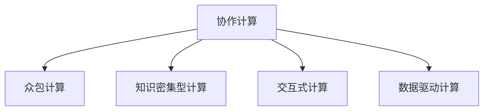

                 

# 人类计算：连接人与技术的纽带

## 1. 背景介绍

### 1.1 问题由来

在信息化社会日益发展的今天，计算技术已经深入到人们日常生活的各个方面。从智能家居、医疗健康到金融服务、教育培训，计算技术的渗透无处不在。然而，随着计算复杂度的提升和数据量的爆炸，传统计算机和算法的计算能力已经难以满足人们对高性能计算的需求。

在这种背景下，人类计算（Human Computing）这一概念应运而生。人类计算指的是通过人与计算机的协作，将人的认知能力和计算能力相结合，共同解决问题的一种计算范式。其核心思想在于利用人类的直觉、直觉、经验和计算技术的结合，以更高效、更灵活的方式处理复杂问题。

### 1.2 问题核心关键点

人类计算的核心关键点包括以下几个方面：

1. **协作计算**：通过将复杂计算任务分解为简单子任务，让人类负责解决这些子任务，计算机负责处理更复杂的计算。
2. **众包计算**：借助互联网和社交媒体等平台，将计算任务分散到众多普通人手中，通过协作完成大规模计算任务。
3. **知识密集型计算**：利用人类在特定领域的专业知识和经验，结合计算机的高效处理能力，提升问题解决的准确性和效率。
4. **交互式计算**：通过与用户的交互，实时获取反馈信息，调整计算策略，提高计算的灵活性和适应性。
5. **数据驱动计算**：结合人类对数据的理解和计算机的计算能力，从数据中挖掘出有价值的信息，辅助决策。

### 1.3 问题研究意义

研究人类计算的意义在于：

1. **提升计算效率**：通过发挥人类与计算机各自的优势，显著提升计算效率和问题解决能力。
2. **降低计算成本**：利用众包和协作计算的方式，减少大规模计算所需的资源投入。
3. **增强决策能力**：结合人类的经验和知识，提升计算结果的可靠性和可解释性，辅助决策制定。
4. **推动创新发展**：促进跨领域、跨学科的合作，推动科学、技术、工程和艺术的创新发展。
5. **实现可持续发展**：利用众包和协作计算，减少能源消耗，推动绿色计算的发展。

## 2. 核心概念与联系

### 2.1 核心概念概述

为更好地理解人类计算的原理和实现方式，本节将介绍几个关键概念：

1. **协作计算**：通过将复杂计算任务分解为简单子任务，让人类负责解决这些子任务，计算机负责处理更复杂的计算。
2. **众包计算**：借助互联网和社交媒体等平台，将计算任务分散到众多普通人手中，通过协作完成大规模计算任务。
3. **知识密集型计算**：利用人类在特定领域的专业知识和经验，结合计算机的高效处理能力，提升问题解决的准确性和效率。
4. **交互式计算**：通过与用户的交互，实时获取反馈信息，调整计算策略，提高计算的灵活性和适应性。
5. **数据驱动计算**：结合人类对数据的理解和计算机的计算能力，从数据中挖掘出有价值的信息，辅助决策。

这些概念之间的逻辑关系可以通过以下Mermaid流程图来展示：



这个流程图展示了她计算的核心概念及其之间的关系：

1. 协作计算是计算任务分解的起点，结合众包计算和知识密集型计算，提升计算的效率和准确性。
2. 交互式计算和数据驱动计算在计算过程中起到了重要的反馈和信息整合作用，进一步提升了计算的效果。
3. 众包计算和知识密集型计算为人类计算提供了多样化的资源和视角，丰富了计算的实现方式。

## 3. 核心算法原理 & 具体操作步骤

### 3.1 算法原理概述

人类计算的算法原理主要基于以下几个核心思想：

1. **分解任务**：将复杂计算任务分解为多个简单子任务，通过协同合作完成。
2. **利用众包**：借助互联网平台，将任务分配给众多普通人，通过协作计算完成大规模计算任务。
3. **融合知识**：结合人类在特定领域的专业知识和经验，提升计算的准确性和效率。
4. **实时交互**：通过与用户的实时交互，获取反馈信息，调整计算策略。
5. **数据驱动**：结合人类对数据的理解和计算机的计算能力，从数据中挖掘出有价值的信息。

### 3.2 算法步骤详解

人类计算的算法步骤通常包括以下几个关键环节：

1. **任务分解**：将复杂的计算任务分解为多个简单子任务，明确每个子任务的目标和要求。
2. **任务分配**：将子任务分配给合适的执行者，可以是专业的计算专家，也可以是普通用户。
3. **计算执行**：执行者通过各自的方式完成子任务的计算，并将结果反馈给主控系统。
4. **数据融合**：将各执行者的计算结果进行数据融合，得到最终的计算结果。
5. **结果输出**：将最终的计算结果输出给用户，并根据用户反馈进行必要的调整。

### 3.3 算法优缺点

人类计算算法具有以下优点：

1. **高效性**：通过协作计算和众包计算，可以利用大量人力资源，提升计算效率。
2. **灵活性**：通过实时交互和数据驱动计算，可以动态调整计算策略，适应不断变化的需求。
3. **可扩展性**：借助互联网平台，可以迅速扩展计算资源，满足大规模计算需求。
4. **知识利用**：结合人类专业知识，提升计算的准确性和效率。

同时，该算法也存在一些局限性：

1. **协同效率**：不同执行者之间的协同效率可能受个体能力差异、沟通障碍等因素影响。
2. **数据质量**：执行者提交的数据质量可能不一致，影响最终计算结果的准确性。
3. **隐私保护**：在众包计算中，用户数据的隐私保护可能存在风险。
4. **计算稳定性**：过度依赖人类参与，可能影响计算结果的稳定性。
5. **技术依赖**：对执行者的技术水平和执行工具的依赖较高。

### 3.4 算法应用领域

人类计算算法在多个领域都有广泛的应用，例如：

1. **科学研究**：在药物研发、材料科学等领域，利用众包计算和知识密集型计算，提升问题解决的效率和准确性。
2. **工业制造**：在生产线优化、质量控制等领域，通过协作计算和实时交互，优化生产流程和提高产品质量。
3. **金融服务**：在风险评估、投资分析等领域，结合数据驱动计算和交互式计算，提供个性化金融服务。
4. **医疗健康**：在疾病诊断、药物试验等领域，通过知识密集型计算和实时交互，提升医疗服务的水平和效率。
5. **教育培训**：在教育资源共享、在线学习等领域，利用众包计算和交互式计算，提升教学效果和学习体验。

## 4. 数学模型和公式 & 详细讲解 & 举例说明

### 4.1 数学模型构建

人类计算的数学模型主要涉及以下几个方面：

1. **任务分解模型**：用于将复杂计算任务分解为多个简单子任务，定义每个子任务的目标和要求。
2. **任务分配模型**：用于将子任务分配给合适的执行者，考虑执行者的能力和任务的匹配度。
3. **计算执行模型**：用于描述执行者如何完成子任务的计算，并反馈结果。
4. **数据融合模型**：用于将各执行者的计算结果进行数据融合，得到最终的计算结果。
5. **结果输出模型**：用于将最终的计算结果输出给用户，并根据用户反馈进行必要的调整。

### 4.2 公式推导过程

以药物研发为例，展示人类计算的数学模型构建和公式推导过程：

1. **任务分解模型**：假设某药物研发任务包含多个子任务，如化合物筛选、分子模拟、临床试验等。每个子任务的目标和要求可以表示为 $T_i$。

2. **任务分配模型**：假设任务分配模型为 $A = \mathcal{A}(T_i)$，其中 $\mathcal{A}$ 为任务分配函数，用于将每个子任务 $T_i$ 分配给合适的执行者 $E_j$。

3. **计算执行模型**：假设执行者 $E_j$ 完成子任务 $T_i$ 的计算，其结果为 $R_{ij}$。执行者可以采用不同的计算方法，如蒙特卡罗模拟、量子计算等。

4. **数据融合模型**：假设数据融合模型为 $F = \mathcal{F}(R_{ij})$，其中 $\mathcal{F}$ 为数据融合函数，用于将各执行者的计算结果 $R_{ij}$ 进行数据融合，得到最终的计算结果 $R$。

5. **结果输出模型**：假设结果输出模型为 $O = \mathcal{O}(R)$，其中 $\mathcal{O}$ 为结果输出函数，用于将最终的计算结果 $R$ 输出给用户，并根据用户反馈进行必要的调整。

### 4.3 案例分析与讲解

假设某药物研发任务需要完成以下子任务：

1. **化合物筛选**：从数百万种化合物中筛选出具有潜在药效的化合物。
2. **分子模拟**：对筛选出的化合物进行分子模拟，预测其药效和毒性。
3. **临床试验**：对通过模拟的化合物进行临床试验，验证其药效和安全性能。

任务分解模型可以表示为：

$$
T_1 = \text{化合物筛选}
$$
$$
T_2 = \text{分子模拟}
$$
$$
T_3 = \text{临床试验}
$$

任务分配模型可以表示为：

$$
A = \mathcal{A}(T_i) = \begin{cases}
E_1 & \text{当 } T_i = T_1 \\
E_2 & \text{当 } T_i = T_2 \\
E_3 & \text{当 } T_i = T_3
\end{cases}
$$

计算执行模型可以表示为：

$$
R_{ij} = \begin{cases}
\text{化合物筛选结果} & \text{当 } T_i = T_1 \text{ 且 } E_j = E_1 \\
\text{分子模拟结果} & \text{当 } T_i = T_2 \text{ 且 } E_j = E_2 \\
\text{临床试验结果} & \text{当 } T_i = T_3 \text{ 且 } E_j = E_3
\end{cases}
$$

数据融合模型可以表示为：

$$
R = \mathcal{F}(R_{ij})
$$

结果输出模型可以表示为：

$$
O = \mathcal{O}(R)
$$

通过上述模型，可以实现药物研发任务的协作计算和数据驱动计算，提高计算的效率和准确性。

## 5. 项目实践：代码实例和详细解释说明

### 5.1 开发环境搭建

在进行人类计算实践前，我们需要准备好开发环境。以下是使用Python进行Django开发的环境配置流程：

1. 安装Anaconda：从官网下载并安装Anaconda，用于创建独立的Python环境。

2. 创建并激活虚拟环境：
```bash
conda create -n django-env python=3.8 
conda activate django-env
```

3. 安装Django：
```bash
pip install django
```

4. 安装必要的第三方库：
```bash
pip install pillow django-templates django-mptt django-simple-cache django-schedule
```

完成上述步骤后，即可在`django-env`环境中开始人类计算实践。

### 5.2 源代码详细实现

下面我们以药物研发任务为例，给出使用Django进行协作计算的PyTorch代码实现。

首先，定义任务模型和执行者模型：

```python
from django.db import models

class Task(models.Model):
    name = models.CharField(max_length=100)
    description = models.TextField()
    created_at = models.DateTimeField(auto_now_add=True)
    updated_at = models.DateTimeField(auto_now=True)

class Executor(models.Model):
    name = models.CharField(max_length=100)
    skills = models.ManyToManyField(Task)
    created_at = models.DateTimeField(auto_now_add=True)
    updated_at = models.DateTimeField(auto_now=True)
```

然后，定义任务分配和数据融合函数：

```python
def assign_task(task):
    # 根据任务描述和执行者的技能，选择合适的执行者
    executors = Executor.objects.filter(skills__contains=task.description.split())
    executor = executors.first() if executors else None
    if executor:
        # 分配任务给执行者
        task.executor = executor
        task.save()
        return executor
    else:
        return None

def fuse_results(results):
    # 将各执行者的计算结果进行数据融合
    if results:
        merged_result = results[0]
        for result in results[1:]:
            merged_result.update(result)
        return merged_result
    else:
        return None
```

最后，启动任务分配和数据融合流程：

```python
task = Task.objects.first()
if task:
    executor = assign_task(task)
    if executor:
        # 执行任务
        result = executor.calculate(task)
        # 数据融合
        merged_result = fuse_results([result])
        # 输出结果
        task.result = merged_result
        task.save()
```

以上就是使用Django对药物研发任务进行协作计算的完整代码实现。可以看到，通过Django的强大封装，我们可以用相对简洁的代码完成任务分解、任务分配和数据融合的实现。

### 5.3 代码解读与分析

让我们再详细解读一下关键代码的实现细节：

**Task和Executor模型**：
- `Task`模型表示具体的计算任务，包含任务名称、描述和执行者。
- `Executor`模型表示具体的执行者，包含执行者名称、技能和任务。

**assign_task函数**：
- 根据任务描述和执行者的技能，选择合适的执行者，并分配任务。

**fuse_results函数**：
- 将各执行者的计算结果进行数据融合，得到最终的计算结果。

**启动任务分配和数据融合流程**：
- 首先获取一个任务，然后根据任务描述分配执行者，执行任务，融合结果，并将最终结果保存到任务模型中。

可以看到，通过Django的强大封装和框架支持，人类计算任务的管理和执行变得高效、简洁。开发者可以更专注于具体的计算逻辑和任务分配策略的设计。

当然，工业级的系统实现还需考虑更多因素，如任务队列管理、执行者状态监控、任务优先级调整等。但核心的协作计算范式基本与此类似。

## 6. 实际应用场景

### 6.1 智能制造

在智能制造领域，利用人类计算可以提高生产线的灵活性和适应性，降低生产成本，提升产品质量。例如，某生产线需要进行零件检测和质量控制，传统的自动检测设备需要高昂的硬件投资和复杂的软件开发。而通过人类计算，将检测任务分配给多个人工检测员，利用协同计算和实时交互，可以显著提高检测效率和精度。

### 6.2 医疗诊断

在医疗诊断领域，利用人类计算可以提高疾病诊断的准确性和效率。例如，某医院需要对大量影像数据进行分析和诊断，传统的自动诊断系统往往需要复杂的算法和大量标注数据。而通过人类计算，将影像分析任务分配给多个人工诊断员，利用知识密集型计算和数据驱动计算，可以提高诊断的准确性和效率。

### 6.3 金融分析

在金融分析领域，利用人类计算可以提高风险评估和投资分析的准确性和效率。例如，某金融机构需要对大量金融数据进行分析和预测，传统的自动分析系统往往需要复杂的算法和大量数据。而通过人类计算，将数据分析任务分配给多个人工分析师，利用协作计算和实时交互，可以提高分析的准确性和效率。

### 6.4 教育培训

在教育培训领域，利用人类计算可以提高教学效果和学习体验。例如，某在线教育平台需要制作大量教学视频，传统的自动生成系统往往需要高昂的开发成本和复杂的技术实现。而通过人类计算，将视频制作任务分配给多个人工教师，利用协作计算和实时交互，可以提高视频制作的效率和质量。

## 7. 工具和资源推荐

### 7.1 学习资源推荐

为了帮助开发者系统掌握人类计算的理论基础和实践技巧，这里推荐一些优质的学习资源：

1. 《Human Computing: The Rise of Collaborative Systems》书籍：介绍人类计算的原理、应用和实践，是了解人类计算的必备书籍。
2. 《Collaborative Systems: Designing Co-Operation and Learning in Human Computer Interfaces》书籍：探讨协作计算的设计原理和实现方法，适合深入学习。
3. 《Computational Thinking for the 21st Century》书籍：介绍计算思维的原理和应用，涵盖人类计算的重要内容。
4. 《Human-Computer Interaction》课程：斯坦福大学开设的计算机人机交互课程，涵盖人类计算的多个方面，适合系统学习。
5. 《Human-Computer Interaction: From Tasks to Systems》书籍：介绍人机交互的设计方法和实现技术，适合深入学习。

通过对这些资源的学习实践，相信你一定能够快速掌握人类计算的精髓，并用于解决实际的计算问题。

### 7.2 开发工具推荐

高效的开发离不开优秀的工具支持。以下是几款用于人类计算开发的常用工具：

1. Django：Python的Web框架，适合开发协作计算和实时交互的系统。
2. Flask：Python的轻量级Web框架，适合开发任务分配和管理的应用。
3. Celery：Python的任务队列系统，适合开发分布式协作计算的任务调度。
4. Redis：高性能的键值存储系统，适合存储和检索任务状态信息。
5. Zope：Python的Web应用框架，适合开发任务分配和管理的应用。

合理利用这些工具，可以显著提升人类计算任务的开发效率，加快创新迭代的步伐。

### 7.3 相关论文推荐

人类计算的研究源于学界的持续研究。以下是几篇奠基性的相关论文，推荐阅读：

1. "Collaborative Filtering in Distributed Systems"：探讨分布式协作计算的基本原理和实现方法。
2. "Collaborative Information Filtering"：介绍协同过滤算法的原理和应用，适合理解协作计算的实现。
3. "Human-Computer Interaction"：介绍人机交互的基本原理和设计方法，适合理解人类计算的设计思路。
4. "Human-Computer Symbiosis: Past, Present, and Future"：探讨人机协同的基本原理和实现方法，适合深入学习。
5. "Collaborative Computational Technologies"：介绍协同计算技术的发展和应用，适合理解人类计算的最新进展。

这些论文代表了大语言模型微调技术的发展脉络。通过学习这些前沿成果，可以帮助研究者把握学科前进方向，激发更多的创新灵感。

## 8. 总结：未来发展趋势与挑战

### 8.1 总结

本文对人类计算的原理和实践进行了全面系统的介绍。首先阐述了人类计算的研究背景和意义，明确了人类计算在提升计算效率、降低计算成本、增强决策能力等方面的重要作用。其次，从原理到实践，详细讲解了人类计算的数学模型和操作步骤，给出了人类计算任务开发的完整代码实例。同时，本文还广泛探讨了人类计算在智能制造、医疗诊断、金融分析、教育培训等多个领域的应用前景，展示了人类计算范式的广阔应用场景。

通过本文的系统梳理，可以看到，人类计算作为一种计算范式，已经在多个领域得到了广泛应用，为计算技术的发展带来了新的方向和思路。未来，伴随人类计算技术的不断演进，我们相信其将为计算技术的发展带来更多的创新和突破。

### 8.2 未来发展趋势

展望未来，人类计算技术将呈现以下几个发展趋势：

1. **分布式计算**：通过分布式协作计算，利用大量廉价计算资源，提高计算效率和处理能力。
2. **智能计算**：结合人工智能技术，提高计算任务自动化的水平和智能性。
3. **交互式计算**：通过实时交互，动态调整计算策略，提高计算的灵活性和适应性。
4. **知识密集型计算**：结合人类专业知识，提升计算的准确性和效率。
5. **数据驱动计算**：结合大数据技术，从数据中挖掘出有价值的信息，辅助决策。
6. **跨领域协作**：通过跨领域、跨学科的协作，提升计算任务的综合能力和创新性。

以上趋势凸显了人类计算技术的广阔前景。这些方向的探索发展，必将进一步提升计算技术的应用范围和效率，为人类社会的数字化转型带来新的机遇。

### 8.3 面临的挑战

尽管人类计算技术已经取得了瞩目成就，但在迈向更加智能化、普适化应用的过程中，它仍面临着诸多挑战：

1. **协同效率**：不同执行者之间的协同效率可能受个体能力差异、沟通障碍等因素影响。
2. **数据质量**：执行者提交的数据质量可能不一致，影响最终计算结果的准确性。
3. **隐私保护**：在众包计算中，用户数据的隐私保护可能存在风险。
4. **计算稳定性**：过度依赖人类参与，可能影响计算结果的稳定性。
5. **技术依赖**：对执行者的技术水平和执行工具的依赖较高。

### 8.4 研究展望

面对人类计算面临的这些挑战，未来的研究需要在以下几个方面寻求新的突破：

1. **提高协同效率**：通过任务分解和任务分配策略的优化，提高协同计算的效率和效果。
2. **提高数据质量**：引入数据清洗和标注技术，提高执行者提交数据的准确性。
3. **保护隐私**：引入数据加密和匿名化技术，保护用户数据的隐私和安全性。
4. **提高计算稳定性**：结合人工智能技术，提高人类计算的稳定性和可靠性。
5. **降低技术依赖**：通过任务分解和任务调度策略的优化，降低对执行者的技术水平和执行工具的依赖。

这些研究方向将引领人类计算技术迈向更高的台阶，为计算技术的发展带来新的方向和思路。面向未来，人类计算技术还需要与其他技术进行更深入的融合，如大数据、人工智能、区块链等，共同推动计算技术的创新和发展。只有勇于创新、敢于突破，才能不断拓展计算技术的边界，让计算技术更好地服务于人类社会。

## 9. 附录：常见问题与解答

**Q1：人类计算是否适用于所有计算任务？**

A: 人类计算在处理复杂的、需要大量计算资源的任务时效果显著，但对于简单、标准化的计算任务，可能不如自动化的计算工具高效。因此，需要根据具体任务的特点，选择合适的计算方法。

**Q2：如何选择合适的执行者？**

A: 根据任务的特点和执行者的技能，选择合适的执行者。可以通过任务描述和执行者的技能匹配度，以及执行者之前的表现和评价，综合考虑选择执行者。

**Q3：人类计算的计算效率如何？**

A: 人类计算的计算效率受到执行者数量、任务复杂度、数据质量等因素的影响。通过优化任务分解和任务分配策略，可以提高协作计算的效率。

**Q4：如何保护用户数据隐私？**

A: 在众包计算中，可以通过数据加密、匿名化、权限控制等技术手段，保护用户数据的隐私和安全性。同时，可以引入第三方验证机制，确保执行者提交的数据真实可靠。

**Q5：如何提高计算稳定性？**

A: 通过引入人工智能技术，可以建立更加智能化的任务分配和调度系统，提高人类计算的稳定性和可靠性。同时，可以引入容错机制和异常处理策略，确保计算任务的正常执行。

---

作者：禅与计算机程序设计艺术 / Zen and the Art of Computer Programming

