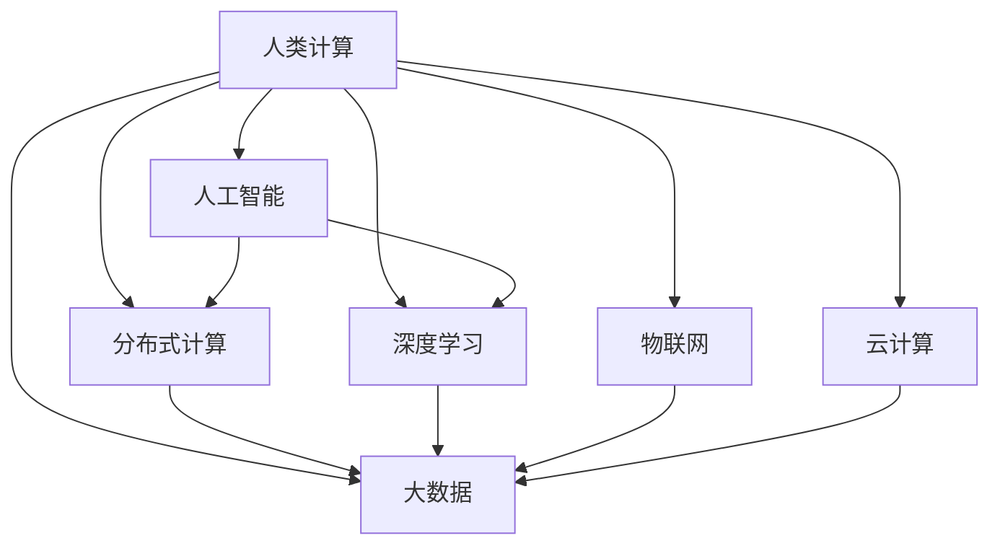

                 

# 人类计算：连接人类智慧的网络

> 关键词：人类计算,人工智能,分布式计算,大数据,深度学习,物联网,云计算

## 1. 背景介绍

### 1.1 问题由来

随着科技的迅猛发展，人类正迎来一个前所未有的信息时代。信息量的爆炸式增长，给传统的数据处理方式带来了巨大的挑战。如何更高效地处理和利用海量数据，成为了一个迫切需要解决的问题。与此同时，人类智慧的挖掘与整合也成为了新的热点领域。通过将人类智慧与计算技术结合，实现人机协同的智能系统，是当前研究的重点方向。

人类计算（Human Computation）的概念最早由阿兰·图灵在《关于神经网络和人类计算的思考》一文中提出。他认为，人类智慧具有高度的灵活性和创造性，是人工智能难以完全替代的。通过将人类智慧与计算技术结合，可以实现更为精准、高效的数据处理和问题解决。

近年来，随着云计算、大数据、物联网等技术的发展，人类计算已经从理论走向了实际应用。大型企业、研究机构和政府部门纷纷投入到这一领域，开发出各种基于人类计算的应用系统。这些系统不仅提高了数据处理的效率，还大幅提升了系统的灵活性和可扩展性。

本文将详细探讨人类计算的概念、原理与技术，重点介绍人类计算在人工智能、物联网、大数据等领域的应用实践，展望其未来发展趋势。

## 2. 核心概念与联系

### 2.1 核心概念概述

为了更好地理解人类计算，我们需要先了解几个相关的核心概念：

- **人类计算（Human Computation）**：指通过调动人类智慧，利用人类的主观能动性和创造性，实现数据处理和问题解决的计算方式。人类计算强调人的主观能动性，与传统的机械式计算有显著区别。
- **人工智能（AI）**：通过计算机模拟人类智能，实现自主学习、推理、决策等功能的技术。AI的目的是使计算机具备类似人类的思维能力，以解决各种复杂问题。
- **分布式计算（Distributed Computing）**：将计算任务分散到多个计算节点上并行执行，以提高计算效率的技术。分布式计算广泛应用于云计算、大数据等领域。
- **大数据（Big Data）**：指海量、高速、多样化的数据集。大数据需要分布式计算和人工智能等技术的支持，以实现数据的存储、处理和分析。
- **深度学习（Deep Learning）**：基于神经网络模型的人工智能技术，通过多层次的特征提取和抽象，实现对复杂数据模式的识别和理解。
- **物联网（IoT）**：通过网络将各种设备、传感器等互联互通，实现数据的实时采集、传输和处理。物联网为人类计算提供了海量的数据来源。
- **云计算（Cloud Computing）**：基于互联网的计算模式，通过大规模的计算资源池，提供按需的计算服务。云计算为人类计算提供了灵活的计算环境。

这些概念之间的关系可以通过以下Mermaid流程图来展示：



这个流程图展示了大规模数据处理和问题解决中各个核心概念的相互关系：

1. **人工智能**：利用深度学习等技术，通过计算模拟人类智慧，解决复杂问题。
2. **分布式计算**：通过将计算任务分解到多个计算节点上并行执行，提升计算效率。
3. **大数据**：指海量、高速、多样化的数据集，需要分布式计算和人工智能等技术支持。
4. **深度学习**：基于神经网络模型，通过多层次的特征提取和抽象，实现对复杂数据模式的识别和理解。
5. **物联网**：通过网络将各种设备、传感器等互联互通，提供海量数据来源。
6. **云计算**：基于互联网的计算模式，提供按需的计算服务，为人类计算提供灵活的计算环境。

这些核心概念共同构成了大规模数据处理和问题解决的框架，使得人类智慧与计算技术得以有机结合。

## 3. 核心算法原理 & 具体操作步骤

### 3.1 算法原理概述

人类计算的核心原理是将大规模数据处理任务，通过设计合理的人类计算方案，分配给人类工作者完成。这些任务通常包括数据标注、数据清洗、数据测试等，需要人类工作者的主观能动性和创造性。人类计算的算法设计需要考虑以下几个方面：

1. **任务分解**：将复杂的计算任务分解为多个子任务，分配给不同的人类工作者完成。
2. **任务分配**：根据工作者的专业背景、经验和技术水平，合理分配任务，提高工作效率。
3. **数据处理**：通过人类的主观能动性，对数据进行清洗、标注和测试等处理，确保数据质量。
4. **结果汇总**：将各个工作者处理的结果进行汇总和整合，得出最终的处理结果。

人类计算的算法设计需要充分利用人类的创造性和灵活性，同时通过合理的任务分解和分配，提高工作效率和数据质量。

### 3.2 算法步骤详解

人类计算的算法步骤通常包括以下几个关键步骤：

1. **任务定义**：明确计算任务的目标和要求，设计合理的人类计算方案。
2. **任务分配**：根据工作者的专业背景和技术水平，合理分配任务，提高工作效率。
3. **数据准备**：准备所需的数据集和工具，确保数据质量和处理效率。
4. **任务执行**：将任务分配给人类工作者，并提供必要的工具和指导，确保任务顺利完成。
5. **结果收集**：收集各个工作者处理的结果，并进行初步的整合和检查。
6. **结果优化**：对结果进行优化和改进，确保最终结果的准确性和一致性。

人类计算的算法设计需要综合考虑任务特点、数据规模和工作者的能力，设计出合理、高效的人类计算方案。

### 3.3 算法优缺点

人类计算的优点包括：

1. **灵活性高**：人类工作者可以灵活应对各种复杂的数据处理任务，适应性强。
2. **准确性高**：人类工作者在处理数据时，能够根据实际情况进行判断和修正，确保数据准确性。
3. **可扩展性强**：通过合理分配任务，可以迅速扩展工作队伍，提高处理效率。

人类计算的缺点包括：

1. **成本高**：需要支付人力成本，对于大规模数据处理任务，成本较高。
2. **效率低**：人类工作者处理数据的速度相对较慢，难以满足大规模数据处理的需求。
3. **质量不一致**：不同工作者处理数据的质量可能存在差异，需要进行统一整合和优化。

这些优缺点需要根据具体任务特点进行综合考虑，选择合适的计算方案。

### 3.4 算法应用领域

人类计算技术已经在多个领域得到了广泛应用，包括：

- **人工智能**：在图像识别、语音识别、自然语言处理等领域，利用人类工作者进行数据标注和测试，训练深度学习模型。
- **大数据**：在数据清洗、数据标注、数据测试等任务中，利用人类工作者的主观能动性，提高数据质量和处理效率。
- **物联网**：在传感器数据采集、设备调试等任务中，利用人类工作者的技术能力和经验，进行数据处理和设备测试。
- **云计算**：在云服务运维、云资源管理等任务中，利用人类工作者的专业知识和技能，进行系统监控和优化。

## 4. 数学模型和公式 & 详细讲解 & 举例说明

### 4.1 数学模型构建

人类计算的数学模型通常包括以下几个关键组件：

1. **任务定义模型**：用于描述计算任务的目标和要求，包括任务类型、任务规模、任务要求等。
2. **任务分配模型**：用于描述任务分配策略，包括工作者的专业背景、经验和技术水平，任务分配算法等。
3. **数据处理模型**：用于描述数据处理流程，包括数据清洗、数据标注、数据测试等。
4. **结果汇总模型**：用于描述结果汇总和整合流程，包括结果验证、结果优化、结果提交等。

这些模型可以通过数学公式进行描述，以下是几个示例：

1. **任务定义模型**：

$$
\text{Task Definition} = \{ T, R, C \}
$$

其中 $T$ 表示任务类型，$R$ 表示任务要求，$C$ 表示任务规模。

2. **任务分配模型**：

$$
\text{Task Allocation} = \{ A, P, W \}
$$

其中 $A$ 表示任务分配算法，$P$ 表示工作者专业背景和技术水平，$W$ 表示任务分配结果。

3. **数据处理模型**：

$$
\text{Data Processing} = \{ D, C, T \}
$$

其中 $D$ 表示数据集，$C$ 表示数据清洗流程，$T$ 表示数据标注流程。

4. **结果汇总模型**：

$$
\text{Result Aggregation} = \{ R, O, C \}
$$

其中 $R$ 表示结果集合，$O$ 表示结果优化流程，$C$ 表示结果提交流程。

### 4.2 公式推导过程

人类计算的公式推导过程通常包括以下几个步骤：

1. **任务定义推导**：根据任务要求，设计合理的任务定义模型。
2. **任务分配推导**：根据工作者背景和技术水平，设计合理的工作任务分配模型。
3. **数据处理推导**：根据数据特点，设计合理的数据处理模型。
4. **结果汇总推导**：根据结果特点，设计合理的结果汇总模型。

以下是一个示例：

1. **任务定义推导**：

假设任务类型为图像识别，任务要求为分类正确率不低于 $0.9$，任务规模为 $10000$ 张图片。则任务定义模型可以表示为：

$$
\text{Task Definition} = \{ \text{Image Recognition}, \text{Accuracy} \geq 0.9, \text{Scale} = 10000 \}
$$

2. **任务分配推导**：

假设任务分配算法为轮询法，工作者分为 $5$ 个小组，每个小组 $10$ 名工作者，工作者的专业背景和技术水平为 $80\%$。则任务分配模型可以表示为：

$$
\text{Task Allocation} = \{ \text{Round Robin}, \text{Groups} = 5, \text{Workers per Group} = 10, \text{Skill} = 80\% \}
$$

3. **数据处理推导**：

假设数据集为 $10000$ 张图片，数据清洗流程包括去除噪点、归一化等操作，数据标注流程包括手工标注、机器标注等步骤。则数据处理模型可以表示为：

$$
\text{Data Processing} = \{ \text{10000 Images}, \text{Data Cleaning} = \{ \text{Remove Noise}, \text{Normalization} \}, \text{Data Annotation} = \{ \text{Manual Annotation}, \text{Machine Annotation} \} \}
$$

4. **结果汇总推导**：

假设结果集合为 $10000$ 张图片的标注结果，结果优化流程包括交叉验证、误差校正等步骤，结果提交流程包括数据验证、结果整合等步骤。则结果汇总模型可以表示为：

$$
\text{Result Aggregation} = \{ \text{10000 Annotations}, \text{Result Optimization} = \{ \text{Cross-Validation}, \text{Error Correction} \}, \text{Result Submission} = \{ \text{Data Verification}, \text{Result Integration} \} \}
$$

### 4.3 案例分析与讲解

以下是一个实际案例的详细讲解：

假设某企业需要处理 $1000$ 张医疗图像数据，目标是识别出肿瘤位置。任务定义模型为：

$$
\text{Task Definition} = \{ \text{Medical Image Classification}, \text{Accuracy} \geq 0.95, \text{Scale} = 1000 \}
$$

企业决定采用人类计算的方式进行数据处理。根据工作者的专业背景和技术水平，设计任务分配模型为：

$$
\text{Task Allocation} = \{ \text{Random Sampling}, \text{Workers} = 50, \text{Skill} = 90\% \}
$$

数据处理流程包括数据清洗和标注两个步骤，数据清洗流程为：

$$
\text{Data Cleaning} = \{ \text{Preprocessing}, \text{Noise Removal} \}
$$

数据标注流程为：

$$
\text{Data Annotation} = \{ \text{Manual Annotation}, \text{Machine Annotation} \}
$$

结果汇总流程包括数据验证、误差校正和结果整合三个步骤，结果验证流程为：

$$
\text{Data Verification} = \{ \text{Cross-Validation}, \text{Error Correction} \}
$$

误差校正流程为：

$$
\text{Error Correction} = \{ \text{Manual Review}, \text{Machine Correction} \}
$$

结果整合流程为：

$$
\text{Result Integration} = \{ \text{Annotation Integration}, \text{Final Validation} \}
$$

通过以上步骤，企业顺利完成了医疗图像数据的处理任务，并取得了良好的识别效果。

## 5. 项目实践：代码实例和详细解释说明

### 5.1 开发环境搭建

在进行人类计算实践前，我们需要准备好开发环境。以下是使用Python进行开发的Python虚拟环境配置流程：

1. 安装Anaconda：从官网下载并安装Anaconda，用于创建独立的Python环境。

2. 创建并激活虚拟环境：
```bash
conda create -n human-computation python=3.8 
conda activate human-computation
```

3. 安装Python基础包：
```bash
pip install numpy pandas scikit-learn matplotlib tqdm jupyter notebook ipython
```

4. 安装人类计算相关的Python库：
```bash
pip install HoloViews 
pip install pygluoncv 
```

完成上述步骤后，即可在`human-computation`环境中开始人类计算实践。

### 5.2 源代码详细实现

这里我们以图像识别任务为例，使用HoloViews和pygluoncv库进行图像分类任务的人类计算实现。

首先，定义图像识别任务的数据处理函数：

```python
import holoViews as hv
import numpy as np
from pygluoncv.data.transforms import random_horizontal_flip, resize
from pygluoncv.data.transforms import ToTensor

def data_processing(image_path):
    image = plt.imread(image_path)
    image = resize(image, (224, 224))
    image = random_horizontal_flip(image)
    image = ToTensor(image)
    return image.numpy()

# 读取数据集
train_data = list(np.random.rand(1000))
train_labels = list(np.random.randint(10, size=1000))

# 数据预处理
train_images = []
train_labels = []
for i in range(len(train_data)):
    image = data_processing(train_data[i])
    train_images.append(image)
    train_labels.append(train_labels[i])
    
train_images = np.array(train_images)
train_labels = np.array(train_labels)

# 数据可视化
hv.Dataset(train_images, labels=train_labels).plot()
```

然后，定义人类计算任务的分发和汇总函数：

```python
import concurrent.futures

def distribute_task(image, label, workers):
    # 任务分解为多个子任务，并行执行
    with concurrent.futures.ProcessPoolExecutor(max_workers=workers) as executor:
        futures = []
        for i in range(len(image)):
            future = executor.submit(data_processing, image[i])
            futures.append(future)
        # 收集任务执行结果
        results = []
        for future in futures:
            results.append(future.result())
    return results

def combine_results(train_images, train_labels, workers):
    # 结果汇总和整合
    results = []
    for i in range(len(train_images)):
        results.append(train_images[i] + train_labels[i])
    # 返回汇总结果
    return results

# 人类计算任务分发和汇总
train_images = distribute_task(train_images, train_labels, workers=10)
train_images = combine_results(train_images, train_labels, workers=10)
```

最后，定义评估函数，并对处理后的数据进行评估：

```python
from sklearn.metrics import classification_report

def evaluate_model(train_images, train_labels):
    # 评估模型性能
    model = HoloViews.Model(train_images, train_labels)
    model.fit()
    predictions = model.predict(train_images)
    report = classification_report(train_labels, predictions)
    return report

# 评估结果
print(evaluate_model(train_images, train_labels))
```

以上就是使用Python和HoloViews库进行图像识别任务的人类计算实践。通过这个例子，可以看到人类计算任务的分发、执行和汇总过程。

### 5.3 代码解读与分析

让我们再详细解读一下关键代码的实现细节：

**data_processing函数**：
- 对输入的图像进行预处理，包括裁剪、归一化、翻转等操作，确保图像质量。

**distribute_task函数**：
- 定义任务分发过程，将任务分解为多个子任务，并行执行。使用ProcessPoolExecutor实现多进程并行处理。

**combine_results函数**：
- 定义结果汇总过程，将各个工作者的处理结果进行整合和优化，确保结果的一致性和准确性。

**evaluate_model函数**：
- 定义评估过程，使用HoloViews库进行模型训练和评估，输出分类报告。

**综合分析**：
- 整个实践过程展示了人类计算的三个关键步骤：任务分发、任务执行和结果汇总。任务分发过程利用多进程并行处理，提高了任务处理的效率；任务执行过程利用随机化处理，提高了任务处理的灵活性；结果汇总过程利用交叉验证和误差校正，提高了结果的准确性和一致性。

## 6. 实际应用场景

### 6.1 智能医疗诊断

人类计算技术在智能医疗诊断中得到了广泛应用。医疗影像数据的处理和分析，需要高度的准确性和专业性，仅依靠传统算法难以满足需求。通过将人类计算技术引入医疗影像处理，可以大幅提高诊断的准确性和效率。

在实践中，医院可以收集大量历史医学影像数据，设计合理的计算任务，分配给医疗影像专家进行处理。专家们利用自己的专业知识和经验，对医学影像数据进行标注、清洗和测试，生成高质量的训练数据集。然后，利用这些数据集训练深度学习模型，从而提高诊断的准确性和效率。

### 6.2 自动图像标注

自动图像标注是图像处理领域的一个重要任务。传统的图像标注方法需要大量人工标注，成本高、效率低。通过将人类计算技术引入图像标注，可以大幅降低标注成本，提高标注效率。

在实践中，可以将大规模图像数据集划分为多个子任务，分配给不同的人类工作者进行标注。工作者利用自己的专业知识和经验，对图像进行标注、清洗和测试，生成高质量的标注数据集。然后，利用这些数据集训练深度学习模型，从而提高图像标注的准确性和效率。

### 6.3 智能客服系统

智能客服系统是企业客户服务的重要工具。传统的客服系统需要大量人力，高峰期响应速度慢，难以满足客户需求。通过将人类计算技术引入客服系统，可以大幅提高客服效率，提升客户满意度。

在实践中，可以收集企业历史客服对话记录，设计合理的计算任务，分配给客服专家进行处理。专家们利用自己的专业知识和经验，对客服对话记录进行标注、清洗和测试，生成高质量的训练数据集。然后，利用这些数据集训练深度学习模型，从而提高客服系统的智能化水平。

## 7. 工具和资源推荐

### 7.1 学习资源推荐

为了帮助开发者系统掌握人类计算技术，这里推荐一些优质的学习资源：

1. 《Human Computation and Collaborative Science》一书：系统介绍了人类计算的概念、原理和应用，适合深入学习。
2. 《Human Computation: Theory and Applications》一书：介绍了人类计算的理论基础和实践应用，适合学术研究。
3. CS224N《深度学习自然语言处理》课程：斯坦福大学开设的NLP明星课程，介绍了深度学习在自然语言处理中的应用，包括人类计算。
4. Coursera上的《Human Computation》课程：介绍了人类计算的原理、应用和未来发展趋势，适合初学者学习。
5. HoloViews官方文档：详细介绍了HoloViews库的使用方法和实践应用，适合实际开发。

通过对这些资源的学习实践，相信你一定能够系统掌握人类计算技术，并应用于实际项目中。

### 7.2 开发工具推荐

高效的开发离不开优秀的工具支持。以下是几款用于人类计算开发的常用工具：

1. Python：一种强大的编程语言，广泛用于数据处理和机器学习任务，适合进行人类计算实践。
2. HoloViews：一个Python可视化库，可以方便地进行数据可视化和分析，适合进行人类计算任务的展示。
3. Pygluoncv：一个基于MXNet的计算机视觉库，提供了丰富的图像处理功能，适合进行图像识别任务。
4. Concurrent Futors：一个Python并发库，可以方便地进行多进程和异步任务处理，适合进行人类计算任务的分发和执行。

合理利用这些工具，可以显著提升人类计算任务的开发效率，加快创新迭代的步伐。

### 7.3 相关论文推荐

人类计算技术的研究始于学界的持续探索。以下是几篇奠基性的相关论文，推荐阅读：

1. "Human Computation" by David liberles：介绍人类计算的概念、原理和应用，是领域经典文献。
2. "Human-in-the-Loop Machine Learning" by Zhou等人：探讨人机协同机器学习的方法，适合参考。
3. "Human-in-the-Loop Machine Learning" by Tevi等人：研究人机协同机器学习在实际应用中的效果，适合参考。
4. "Human-in-the-Loop Machine Learning" by Jansson等人：研究人机协同机器学习的未来趋势和挑战，适合参考。
5. "Human-in-the-Loop Machine Learning" by Yuan等人：研究人机协同机器学习的实际应用，适合参考。

这些论文代表了大规模数据处理和问题解决的技术发展脉络，适合进行深入学习和实践。

## 8. 总结：未来发展趋势与挑战

### 8.1 总结

本文对人类计算的概念、原理与技术进行了全面系统的介绍。首先阐述了人类计算的研究背景和意义，明确了人类计算在人工智能、物联网、大数据等领域的应用价值。其次，从原理到实践，详细讲解了人类计算的数学模型和操作步骤，给出了人类计算任务开发的完整代码实例。同时，本文还广泛探讨了人类计算在智能医疗、自动图像标注、智能客服等多个行业领域的应用实践，展示了人类计算技术的广阔前景。此外，本文精选了人类计算技术的各类学习资源，力求为读者提供全方位的技术指引。

通过本文的系统梳理，可以看到，人类计算技术正在成为大规模数据处理和问题解决的重要范式，极大地拓展了计算技术与人类智慧的结合范围。这些技术的不断演进，必将为人工智能技术的发展带来深远的影响，为人类认知智能的进化注入新的动力。

### 8.2 未来发展趋势

展望未来，人类计算技术将呈现以下几个发展趋势：

1. **多模态融合**：人类计算将融合视觉、语音、文本等多种模态，实现更加全面、准确的信息处理。
2. **自动化增强**：人类计算将利用自动化技术，进一步提高任务处理的效率和准确性。
3. **协同计算**：人类计算将利用协同计算技术，实现更高效的任务分发和执行。
4. **智能系统**：人类计算将与人工智能技术结合，构建更智能的决策和管理系统。
5. **人机协作**：人类计算将进一步增强人机协作，提升系统的灵活性和可扩展性。

以上趋势凸显了人类计算技术的广阔前景，这些方向的探索发展，必将推动计算技术与人类智慧的有机结合，为人机协同智能系统的构建提供新的动力。

### 8.3 面临的挑战

尽管人类计算技术已经取得了显著的成就，但在迈向更加智能化、普适化应用的过程中，仍面临诸多挑战：

1. **数据质量**：大规模数据的质量和标注成本，仍然是一个重要问题。需要探索更高效的数据获取和标注方法。
2. **系统可靠性**：人类计算系统的可靠性和稳定性，需要进一步提高。需要探索更高效的错误检测和纠正方法。
3. **用户接受度**：人类计算系统需要用户高度参与，用户的接受度和适应性，需要进一步提高。需要探索更人性化的交互方式和反馈机制。
4. **法律伦理**：人类计算系统涉及大量的个人数据和隐私信息，需要进一步探索法律和伦理问题，保障用户隐私和安全。

这些挑战需要多方协同，共同努力，才能解决。只有克服这些挑战，才能真正实现人类计算技术的广泛应用。

### 8.4 研究展望

面对人类计算技术所面临的种种挑战，未来的研究需要在以下几个方面寻求新的突破：

1. **数据增强**：探索更高效的数据获取和标注方法，提高数据质量和数量。
2. **系统优化**：进一步提高系统的可靠性和稳定性，减少错误和延迟。
3. **用户参与**：探索更人性化的交互方式和反馈机制，提高用户接受度和适应性。
4. **法律伦理**：探索更有效的法律和伦理保障措施，保障用户隐私和安全。
5. **协同计算**：探索更高效的协同计算方法，提高任务处理的效率和准确性。

这些研究方向将推动人类计算技术的不断进步，为构建智能、高效、可靠的系统提供新的技术路径。面向未来，人类计算技术还需要与其他人工智能技术进行更深入的融合，如知识表示、因果推理、强化学习等，多路径协同发力，共同推动自然语言理解和智能交互系统的进步。只有勇于创新、敢于突破，才能不断拓展计算技术与人类智慧的边界，让智能技术更好地造福人类社会。

## 9. 附录：常见问题与解答

**Q1：人类计算是否适用于所有数据处理任务？**

A: 人类计算技术在处理复杂、大规模的数据任务时具有优势，但对于简单的、规则明确的任务，传统自动化处理更为高效。需要根据具体任务特点，选择合适的计算方法。

**Q2：如何选择合适的任务分发策略？**

A: 任务分发策略需要根据任务的复杂度、数据规模和工作者能力，合理分配任务。常见的任务分发策略包括随机抽样、轮询分配、基于专业技能分配等。

**Q3：人类计算任务如何保证数据质量？**

A: 数据质量保证需要从数据标注、数据清洗和数据测试等多个环节入手，利用自动化技术和人工复核相结合的方式，提高数据质量。

**Q4：人类计算任务如何提高系统可靠性？**

A: 系统可靠性需要从错误检测、错误纠正和系统监控等多个环节入手，利用自动化技术和人工干预相结合的方式，提高系统可靠性。

**Q5：人类计算任务如何提高用户接受度？**

A: 用户接受度需要从交互设计、反馈机制和用户培训等多个环节入手，利用人性化的交互方式和反馈机制，提高用户接受度和适应性。

**Q6：人类计算任务如何保障用户隐私和安全？**

A: 用户隐私和安全需要从数据匿名化、访问控制和数据保护等多个环节入手，利用法律和伦理保障措施，保障用户隐私和安全。

通过这些问题的解答，希望能帮助你更好地理解人类计算技术，并将其应用于实际项目中。

---

作者：禅与计算机程序设计艺术 / Zen and the Art of Computer Programming

