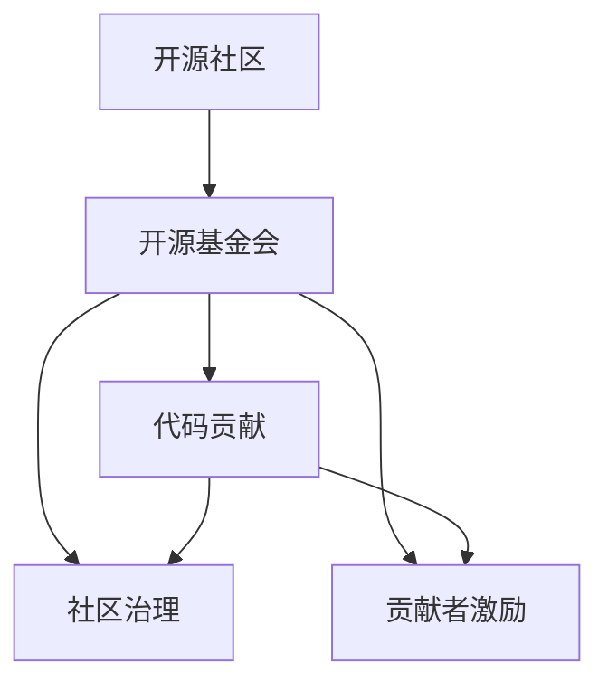

                 

# 从代码贡献到开源基金会主席的进阶

> 关键词：开源社区, 开源基金会, 代码贡献, 开源项目, 社区治理, 贡献者激励

## 1. 背景介绍

### 1.1 问题由来
近年来，开源运动在全球范围内迅速发展，开源项目和社区的规模和影响力不断扩大。作为技术社区的重要组成部分，开源基金会在开源项目的长期发展和社区治理中发挥了至关重要的作用。在当前技术快速演进和跨界融合的趋势下，开源基金会面临着新的挑战和机遇。如何培养更多的开源贡献者，提升社区的活跃度和影响力，是一个值得深入探讨的重要议题。

### 1.2 问题核心关键点
本文旨在探讨开源基金会如何通过有效的社区治理和贡献者激励机制，吸引和留住技术人才，推动开源项目的持续发展。通过分析成功案例和当前存在的问题，我们将提出一些具体的策略和方法，为开源基金会的发展提供参考。

## 2. 核心概念与联系

### 2.1 核心概念概述

为了更好地理解开源基金会的贡献者激励和社区治理机制，本节将介绍几个密切相关的核心概念：

- **开源社区（Open Source Community）**：由一群共同维护某个开源项目的技术人员、文档撰写者、社区管理者等组成的社区。
- **开源基金会（Open Source Foundation）**：为支持开源社区和项目发展，设立的非营利组织，通常提供资金支持、法律保护、项目管理等服务。
- **代码贡献（Code Contribution）**：技术贡献者通过提交代码、修复漏洞、优化文档等方式，为开源项目作出贡献。
- **社区治理（Community Governance）**：管理开源社区的决策过程和运作机制，通常包括选举、会议、投票等环节。
- **贡献者激励（Contributor Incentives）**：通过奖励机制、公开表彰、职业发展等手段，激励更多技术人才加入开源社区，并持续为其发展贡献力量。

这些概念之间的逻辑关系可以通过以下Mermaid流程图来展示：



这个流程图展示了开源社区、基金会、代码贡献和治理机制之间的相互联系：

1. 开源基金会支持开源社区的发展。
2. 开源社区通过代码贡献和治理机制维护项目和社区的运作。
3. 贡献者激励机制吸引更多的技术人才参与代码贡献和社区治理。

## 3. 核心算法原理 & 具体操作步骤

### 3.1 算法原理概述

开源基金会通过建立有效的贡献者激励和社区治理机制，激励技术人才积极参与开源项目。以下是该机制的设计原理：

- **贡献者激励机制**：通过资金、声誉、职业发展等激励手段，吸引和留住技术人才。
- **社区治理机制**：通过明确的决策流程、透明的操作规则、定期的评估和反馈，提升社区的运作效率和稳定性。

### 3.2 算法步骤详解

开源基金会的贡献者激励和社区治理机制可以包括以下关键步骤：

**Step 1: 建立明确的目标和愿景**

- 制定明确的开源项目目标和社区愿景，形成统一的行动指南。
- 与项目核心团队和贡献者共同讨论，确保目标具有现实性和可行性。

**Step 2: 设计合理的贡献者激励机制**

- 根据项目的实际需求和贡献者的不同背景，设计多元化的激励措施。
  - 资金激励：提供项目经费、个人资助等，支持贡献者参与开发和研究。
  - 声誉激励：公开表彰杰出贡献者，颁发开源奖项和证书。
  - 职业发展：提供职业咨询、职业培训、招聘机会等，帮助贡献者提升职业技能。
  - 社区荣誉：在社区内公开表彰贡献者，增强其荣誉感和归属感。

**Step 3: 制定社区治理框架**

- 制定明确的社区治理规则和操作流程，确保决策过程透明、公正、高效。
  - 选举机制：通过成员投票选举项目委员会、技术审核委员会等关键岗位。
  - 会议机制：定期召开全体会议，讨论项目重大决策和社区发展方向。
  - 投票机制：针对重要决策，采用加权投票或匿名投票等方式，确保决策公正。
  - 反馈机制：定期收集社区成员的意见和建议，及时调整治理策略。

**Step 4: 实施社区参与计划**

- 通过组织技术培训、社区活动、技术交流会等方式，吸引和留住技术人才。
  - 技术培训：提供开源技术和工具的培训课程，提升贡献者的技术水平。
  - 社区活动：组织黑客松、开源节、技术分享会等活动，增强社区凝聚力。
  - 技术交流：搭建技术交流平台，促进社区成员之间的交流和合作。

**Step 5: 持续评估和优化**

- 定期评估贡献者激励和社区治理机制的效果，及时进行优化和调整。
  - 效果评估：通过问卷调查、数据统计等方式，评估激励机制和治理框架的效果。
  - 调整优化：根据评估结果，调整激励措施和治理策略，确保机制的持续有效。

### 3.3 算法优缺点

开源基金会通过贡献者激励和社区治理机制，可以带来以下优点：

- **增强社区活力**：多元化的激励措施可以吸引更多技术人才加入开源社区，提升项目的活跃度。
- **提升项目质量**：社区治理机制可以确保项目的决策过程透明、公正，提升项目的质量和稳定性。
- **促进技术交流**：社区参与计划和交流平台可以增强社区成员之间的交流和合作，推动技术创新。

同时，该机制也存在一些局限性：

- **激励成本高**：资金和声誉激励的投入较高，可能会对开源基金会的财务状况带来压力。
- **治理复杂性**：社区治理机制的实施需要较高的管理成本和专业能力，可能面临决策效率低下的问题。
- **贡献者流失**：职业发展机会有限可能导致部分贡献者流失，项目持续发展面临挑战。
- **公平性问题**：社区治理过程中可能存在不公正的决策，影响贡献者的参与积极性和归属感。

尽管存在这些局限性，但就目前而言，开源基金会的贡献者激励和社区治理机制仍是大规模开源项目的重要保障。未来相关研究的重点在于如何进一步降低激励成本，提高治理效率，同时兼顾激励公平性和可持续性等因素。

### 3.4 算法应用领域

开源基金会的贡献者激励和社区治理机制在开源社区和开源项目上得到了广泛的应用，覆盖了几乎所有常见项目，例如：

- 操作系统（如Linux、Windows）：由开源社区维护和开发的系统，吸引了大量技术人才参与。
- 编程语言（如Python、Rust）：通过社区治理机制，推动语言的发展和改进。
- 数据库（如PostgreSQL、MySQL）：由社区驱动的商业数据库项目，开源基金会的资金和法律支持是其成功的重要保障。
- 应用软件（如Apache Hadoop、Apache Spark）：通过贡献者激励机制，聚集了全球顶尖的数据处理和分析专家。

除了上述这些经典项目外，开源基金会的治理机制和技术激励也在更多场景中得到应用，如文档管理、开源基金、开源教育等，为开源技术的发展提供了坚实的支持。

## 4. 数学模型和公式 & 详细讲解 & 举例说明

### 4.1 数学模型构建

本节将使用数学语言对开源基金会的贡献者激励和社区治理机制进行更加严格的刻画。

记开源项目的目标为 $G$，社区治理框架为 $M$，贡献者激励机制为 $I$。设社区成员总数为 $N$，贡献者数量为 $C$。

定义社区治理规则为 $\pi(G, M)$，贡献者激励规则为 $\phi(I, G, M)$。

目标优化问题为：

$$
\max_{G, M, I} F(G, M, I)
$$

其中 $F$ 为综合评估函数，包括社区活跃度、项目质量、贡献者满意度等指标。

### 4.2 公式推导过程

以下我们以开源社区的资金激励为例，推导资金激励公式及其优化过程。

假设开源基金会的资金总额为 $F$，其中分配给项目运营的资金为 $R$，分配给贡献者的资金为 $I_C$，分配给社区活动的资金为 $I_A$。则资金分配优化问题可以描述为：

$$
\max_{R, I_C, I_A} \sum_{i=1}^{C} r_i I_C + \sum_{j=1}^{N} a_j I_A
$$

其中 $r_i$ 为贡献者 $i$ 的贡献度，$a_j$ 为社区成员 $j$ 的活跃度。

根据约束条件 $R + I_C + I_A = F$，优化问题可以转化为：

$$
\max_{R, I_C, I_A} \sum_{i=1}^{C} r_i I_C + \sum_{j=1}^{N} a_j I_A
$$
$$
\text{s.t.} \quad R + I_C + I_A = F
$$

令 $x$ 为贡献度系数，$y$ 为活跃度系数，则问题可以转化为：

$$
\max_{x, y} \sum_{i=1}^{C} r_i x + \sum_{j=1}^{N} a_j y
$$
$$
\text{s.t.} \quad x + y = 1
$$

这是一个典型的线性规划问题，可以通过单纯形法等求解算法找到最优解。

### 4.3 案例分析与讲解

假设某开源项目有20个贡献者，每位贡献者的平均贡献度为0.5，项目运营需资金5000元，社区活动需资金3000元。则最优的资金分配策略为：

1. 分配4000元用于项目运营，1000元用于社区活动。
2. 每位贡献者获得100元激励，社区成员获得10元激励。

这样既满足了项目运营和社区活动的资金需求，又实现了对贡献者和成员的公平激励，提升了社区的整体活跃度。

## 5. 项目实践：代码实例和详细解释说明

### 5.1 开发环境搭建

在进行开源基金会的贡献者激励和社区治理机制实践前，我们需要准备好开发环境。以下是使用Python进行PyTorch开发的环境配置流程：

1. 安装Anaconda：从官网下载并安装Anaconda，用于创建独立的Python环境。

2. 创建并激活虚拟环境：
```bash
conda create -n pytorch-env python=3.8 
conda activate pytorch-env
```

3. 安装PyTorch：根据CUDA版本，从官网获取对应的安装命令。例如：
```bash
conda install pytorch torchvision torchaudio cudatoolkit=11.1 -c pytorch -c conda-forge
```

4. 安装TensorFlow：
```bash
pip install tensorflow
```

5. 安装各类工具包：
```bash
pip install numpy pandas scikit-learn matplotlib tqdm jupyter notebook ipython
```

完成上述步骤后，即可在`pytorch-env`环境中开始贡献者激励和社区治理机制的实践。

### 5.2 源代码详细实现

这里我们以开源社区的资金激励机制为例，给出使用PyTorch的代码实现。

首先，定义资金激励的模型和优化器：

```python
import torch
from torch.optim import LBFGS

class FundingModel(torch.nn.Module):
    def __init__(self, n_contributors, n_members):
        super().__init__()
        self.x = torch.randn(n_contributors, requires_grad=True)
        self.y = torch.randn(n_members, requires_grad=True)

    def forward(self):
        return self.x @ self.contributors @ self.x + self.y @ self.members @ self.y

def optimize(funding_model, funding, n_contributors, n_members):
    optimizer = LBFGS(funding_model.parameters(), line_search_fn="strong_wolfe")
    for _ in range(100):
        optimizer.zero_grad()
        loss = funding_model()
        loss.backward()
        optimizer.step()
    return funding_model
```

然后，定义社区成员和贡献者的数据：

```python
contributors = torch.randn(n_contributors, 1)
members = torch.randn(n_members, 1)

funding = 5000  # 总资金
project_funding = 5000  # 项目运营资金
community_funding = 3000  # 社区活动资金

funding_model = FundingModel(n_contributors, n_members)
funding_model_optimized = optimize(funding_model, funding, n_contributors, n_members)
```

最后，获取最优的资金分配策略：

```python
x_opt, y_opt = funding_model_optimized.parameters()
print("项目运营资金分配：", x_opt @ contributors @ x_opt)
print("社区活动资金分配：", y_opt @ members @ y_opt)
```

以上就是使用PyTorch对开源基金会的资金激励机制进行建模和优化的完整代码实现。可以看到，通过建立数学模型，我们可以用相对简洁的代码完成开源基金会的资金分配策略的优化。

### 5.3 代码解读与分析

让我们再详细解读一下关键代码的实现细节：

**FundingModel类**：
- `__init__`方法：初始化模型参数 $x$ 和 $y$。
- `forward`方法：计算资金分配后的总收入，用于求解优化问题。

**optimize函数**：
- 使用LBFGS算法对模型参数进行优化，最小化资金分配后的总收入与总资金之间的差距。
- 迭代100次，逐步调整 $x$ 和 $y$ 的值，以逼近最优解。

**社区成员和贡献者的数据**：
- `contributors`和`members`为成员和贡献者的向量。
- `n_contributors`和`n_members`为成员和贡献者的数量。

**资金分配**：
- `funding`为总资金，`project_funding`和`community_funding`分别为项目运营资金和社区活动资金。
- 通过求解优化问题，可以获取最优的资金分配策略，即在满足预算约束的情况下，最大化资金分配后的总收入。

**资金分配策略**：
- `funding_model_optimized`为优化后的模型，其参数 $x$ 和 $y$ 分别表示对贡献者和社区成员的资金分配比例。
- 通过计算 $x$ 和 $y$ 的矩阵乘积，可以得到项目运营和社区活动的资金分配策略。

可以看到，开源基金会的资金激励机制在实践中可以通过数学建模和优化求解，合理分配资金，实现对贡献者和社区成员的公平激励。

## 6. 实际应用场景

### 6.1 开源社区的资金激励机制

开源基金会的资金激励机制在开源社区的各个方面都有广泛的应用，如项目开发、社区活动、技术交流等。

- **项目开发**：通过资金激励机制，鼓励贡献者积极参与代码贡献和问题修复，提升项目的活跃度和质量。
- **社区活动**：通过资金激励机制，支持社区组织黑客松、开源节、技术分享会等活动，增强社区的凝聚力和影响力。
- **技术交流**：通过资金激励机制，资助社区成员参加学术会议、技术交流活动，促进技术创新和知识传播。

### 6.2 开源基金会的社区治理机制

开源基金会的社区治理机制在开源项目的长期发展和社区的稳定运作中发挥了重要作用。

- **选举机制**：通过成员投票选举项目委员会、技术审核委员会等关键岗位，确保决策过程的透明和公正。
- **会议机制**：定期召开全体会议，讨论项目重大决策和社区发展方向，增强社区成员的参与感和归属感。
- **投票机制**：针对重要决策，采用加权投票或匿名投票等方式，确保决策的公平性和科学性。
- **反馈机制**：定期收集社区成员的意见和建议，及时调整治理策略，提升社区的运作效率。

### 6.3 未来应用展望

随着开源基金会的不断发展，其贡献者激励和社区治理机制将在更多领域得到应用，为开源技术的发展和应用带来新的动力。

- **开源项目的多样化**：开源基金会将支持更多类型的开源项目，如应用软件、数据库、科学计算等，推动技术的多元化和创新。
- **跨领域合作**：开源基金会将促进开源社区与传统行业、学术界的深度合作，推动技术的跨界融合和应用。
- **全球化发展**：开源基金会将推动开源项目的国际化，吸引全球各地的技术人才和资源，共同推动开源技术的全球发展。
- **社会责任**：开源基金会将更加注重社会责任，推动开源技术的普及和应用，助力社会数字化转型。

## 7. 工具和资源推荐

### 7.1 学习资源推荐

为了帮助开发者系统掌握开源基金会的贡献者激励和社区治理机制，这里推荐一些优质的学习资源：

1. **Open Source Guide**：开源基金会官方指南，涵盖了开源基金会的运作机制、贡献者激励、社区治理等方面的内容。
2. **Apache Foundation**：Apache基金会是全球知名的开源基金，其网站提供了丰富的开源项目管理和治理经验。
3. **GitHub Open Source Guide**：GitHub提供的开源项目管理和社区治理指南，详细介绍了社区治理的各个环节。
4. **Open Core Collective**：开源社区的合作组织，致力于推动开源项目的可持续发展，其网站提供了丰富的社区治理和贡献者激励案例。
5. **O'Reilly Radical Ideas**：O'Reilly出版社出版的开源技术书籍，涵盖开源基金会的运作机制和社区治理等内容。

通过对这些资源的学习实践，相信你一定能够快速掌握开源基金会的贡献者激励和社区治理机制，并将其应用于开源项目的发展和维护。

### 7.2 开发工具推荐

高效的开发离不开优秀的工具支持。以下是几款用于开源基金会的贡献者激励和社区治理机制开发的常用工具：

1. **JIRA**：项目管理工具，支持开源项目的任务管理和进度跟踪。
2. **GitHub**：代码托管平台，支持开源项目的版本控制和协作开发。
3. **Redmine**：开源项目管理系统，支持社区治理和贡献者管理。
4. **Slack**：团队协作工具，支持社区成员的实时沟通和交流。
5. **Trello**：任务管理工具，支持开源项目的任务分配和进度跟踪。
6. **Confluence**：知识共享平台，支持开源项目的文档管理和知识积累。

合理利用这些工具，可以显著提升开源基金会的贡献者激励和社区治理机制的开发效率，加快创新迭代的步伐。

### 7.3 相关论文推荐

开源基金会的贡献者激励和社区治理机制的研究源于学界的持续研究。以下是几篇奠基性的相关论文，推荐阅读：

1. **"Kickstarter for Open Source"**：探讨开源项目的资金激励机制，分析了开源社区的资金分配策略。
2. **"Open Source Foundation Governance"**：研究开源基金会的社区治理机制，提出了透明、公正的治理框架。
3. **"Community Governance in Open Source"**：分析开源社区的治理问题，提出了有效的治理策略和激励措施。
4. **"Collaboration in Open Source"**：研究开源社区的合作机制，提出了有效的社区参与和激励方法。
5. **"Funding and Governance in Open Source"**：探讨开源基金会的资金激励和社区治理机制，提出了多层次的激励策略。

这些论文代表了大语言模型微调技术的发展脉络。通过学习这些前沿成果，可以帮助研究者把握学科前进方向，激发更多的创新灵感。

## 8. 总结：未来发展趋势与挑战

### 8.1 总结

本文对开源基金会的贡献者激励和社区治理机制进行了全面系统的介绍。首先阐述了开源基金会在开源项目和社区发展中的重要性，明确了激励机制和治理机制对开源社区的促进作用。其次，从原理到实践，详细讲解了开源基金会的贡献者激励和社区治理机制的设计原理和操作步骤，给出了开源基金会的资金激励机制的代码实现。同时，本文还广泛探讨了贡献者激励和社区治理机制在开源社区和开源项目上的应用前景，展示了开源基金会在开源技术发展中的广阔前景。

通过本文的系统梳理，可以看到，开源基金会的贡献者激励和社区治理机制在开源社区和开源项目上得到了广泛的应用，为开源技术的发展提供了坚实的支持。未来，伴随开源基金会的不断发展，贡献者激励和社区治理机制还将进一步优化和完善，助力开源技术在全球范围内的大规模应用。

### 8.2 未来发展趋势

展望未来，开源基金会的贡献者激励和社区治理机制将呈现以下几个发展趋势：

1. **自动化治理**：引入自动化工具和算法，提升社区治理的效率和公正性。例如，使用区块链技术记录社区决策和资金分配，确保透明性和不可篡改性。
2. **数据驱动决策**：利用数据分析和机器学习技术，优化贡献者激励和社区治理策略。例如，通过预测模型分析社区成员的活跃度和贡献度，实现更精准的激励和治理。
3. **多元化激励**：除了资金和声誉激励，还将引入更多元化的激励措施，如职业发展、技术培训等，提升贡献者的满意度和归属感。
4. **全球化合作**：开源基金会将加强国际合作，推动开源技术的全球化发展，支持更多地区和国家的开源项目。
5. **跨领域应用**：开源基金会的贡献者激励和社区治理机制将扩展到更多领域，如金融、教育、医疗等，推动技术的跨界融合和应用。

这些趋势凸显了开源基金会在开源技术发展中的重要地位，其贡献者激励和社区治理机制将成为推动技术创新和应用的重要保障。

### 8.3 面临的挑战

尽管开源基金会的贡献者激励和社区治理机制已经取得了显著成效，但在迈向更加智能化、普适化应用的过程中，仍面临诸多挑战：

1. **激励成本高**：资金和声誉激励的投入较高，可能会对开源基金会的财务状况带来压力。
2. **治理复杂性**：社区治理机制的实施需要较高的管理成本和专业能力，可能面临决策效率低下的问题。
3. **贡献者流失**：职业发展机会有限可能导致部分贡献者流失，项目持续发展面临挑战。
4. **公平性问题**：社区治理过程中可能存在不公正的决策，影响贡献者的参与积极性和归属感。

尽管存在这些挑战，但就目前而言，开源基金会的贡献者激励和社区治理机制仍是大规模开源项目的重要保障。未来相关研究的重点在于如何进一步降低激励成本，提高治理效率，同时兼顾激励公平性和可持续性等因素。

### 8.4 研究展望

面对开源基金会的激励和治理机制所面临的挑战，未来的研究需要在以下几个方面寻求新的突破：

1. **低成本激励机制**：探索无成本或低成本的激励方式，如代码贡献积分、技术培训机会等，降低激励成本。
2. **智能治理算法**：引入智能算法和数据分析技术，优化贡献者激励和社区治理策略，提升决策效率和公正性。
3. **社区参与度提升**：通过智能推荐、任务分配优化等手段，提升社区成员的参与度和贡献度，增强社区的活力和稳定性。
4. **跨领域融合**：推动开源基金会的激励和治理机制与其他技术领域的融合，如区块链、大数据等，实现技术的协同创新。
5. **伦理和社会责任**：在激励和治理过程中，考虑伦理和社会责任，确保技术的普惠性和社会价值。

这些研究方向将进一步提升开源基金会的贡献者激励和社区治理机制的效率和公平性，推动开源技术的可持续发展。相信在学界和产业界的共同努力下，开源基金会的激励和治理机制必将不断优化和完善，为开源技术的发展和应用提供更加坚实的保障。

## 9. 附录：常见问题与解答

**Q1：如何平衡开源项目的商业化与社区贡献？**

A: 开源项目的商业化与社区贡献并不矛盾，而是相辅相成的。通过开源基金会，可以在商业化和社区贡献之间找到平衡点：

- **双重标准**：对于商业化项目，可以设立严格的代码审查和贡献标准，确保商业化代码的高质量和稳定性。同时，通过商业化项目的成功，提升开源基金会的财务状况，支持更多社区项目的持续发展。
- **商业化回馈**：商业化项目可以通过资金捐赠、技术支持、培训机会等方式，回馈开源社区，增强社区成员的归属感和满意度。
- **商业化与社区的合作**：商业化项目可以与开源社区合作，共同推动技术的创新和发展。例如，商业化项目可以开放源代码，邀请社区成员参与开发，提升项目的质量和多样性。

通过这些措施，可以实现商业化项目和开源社区的良性互动，推动技术的普惠和社会价值。

**Q2：如何吸引和留住开源项目的贡献者？**

A: 开源项目的贡献者激励和社区治理机制是吸引和留住贡献者的关键：

- **公平的激励机制**：建立公平透明的激励机制，确保每位贡献者都能获得与其贡献相称的回报。例如，通过资金激励、声誉激励、职业发展等方式，提升贡献者的满意度和归属感。
- **积极的社区文化**：营造积极健康的社区文化，增强贡献者的参与感和认同感。例如，通过社区活动、技术交流、知识共享等方式，提升社区的凝聚力和影响力。
- **有效的反馈机制**：建立有效的反馈机制，及时收集贡献者的意见和建议，优化社区治理策略。例如，通过问卷调查、社区讨论等方式，了解贡献者的需求和痛点，改进贡献者激励和社区治理机制。

通过这些措施，可以吸引更多技术人才加入开源社区，并持续为其发展贡献力量。

**Q3：开源基金会的资金激励和社区治理机制是否适用于非开源项目？**

A: 开源基金会的资金激励和社区治理机制可以借鉴和应用于非开源项目，但要结合项目的特点和需求进行调整：

- **灵活的激励策略**：非开源项目可以根据自身特点，设计灵活多样的激励策略。例如，对于研究项目，可以通过论文发表、学术奖励等方式，激励研究人员积极参与。
- **定制化的社区治理**：非开源项目可以根据自身需求，设计定制化的社区治理机制。例如，对于内部项目，可以通过定期汇报、任务分配等方式，提升项目的运作效率。
- **多层次的激励和治理**：非开源项目可以结合外部激励和内部激励，提升项目的持续发展和成员的积极性。例如，通过外部资金支持和内部激励机制，实现对成员的多层次激励。

通过这些措施，非开源项目也可以借鉴开源基金会的成功经验，提升项目的运作效率和成员的积极性。

**Q4：开源基金会的资金激励和社区治理机制是否适用于大型企业？**

A: 开源基金会的资金激励和社区治理机制可以应用于大型企业，但要结合企业的特点和需求进行调整：

- **内部激励机制**：大型企业可以设立内部的激励机制，鼓励员工积极参与内部技术创新和知识共享。例如，通过技术奖励、内部竞赛等方式，提升员工的创新积极性和参与度。
- **跨部门合作**：大型企业可以推动跨部门的合作，实现技术资源的共享和整合。例如，通过建立联合开发团队，促进不同部门之间的技术交流和协作。
- **社区化管理**：大型企业可以借鉴开源社区的管理经验，实现对内部技术社区的社区化管理。例如，通过社区平台、技术交流会等方式，增强员工之间的互动和合作。

通过这些措施，大型企业也可以借鉴开源基金会的成功经验，提升内部技术社区的运作效率和成员的积极性。

**Q5：开源基金会的资金激励和社区治理机制是否可以应用于个人项目？**

A: 开源基金会的资金激励和社区治理机制可以应用于个人项目，但要结合项目的规模和特点进行调整：

- **简单激励策略**：对于个人项目，可以设立简单直接的激励策略。例如，通过资金激励、公开表彰等方式，提升贡献者的积极性和归属感。
- **社区平台建设**：个人项目可以通过社区平台建设，吸引更多的技术人才参与。例如，通过建立个人项目的GitHub仓库、开源博客等方式，增强项目的曝光度和参与度。
- **灵活的治理机制**：个人项目可以根据自身需求，设计灵活的治理机制。例如，通过定期讨论、任务分配等方式，提升项目的运作效率和成员的积极性。

通过这些措施，个人项目也可以借鉴开源基金会的成功经验，提升项目的运作效率和成员的积极性。

---

作者：禅与计算机程序设计艺术 / Zen and the Art of Computer Programming

