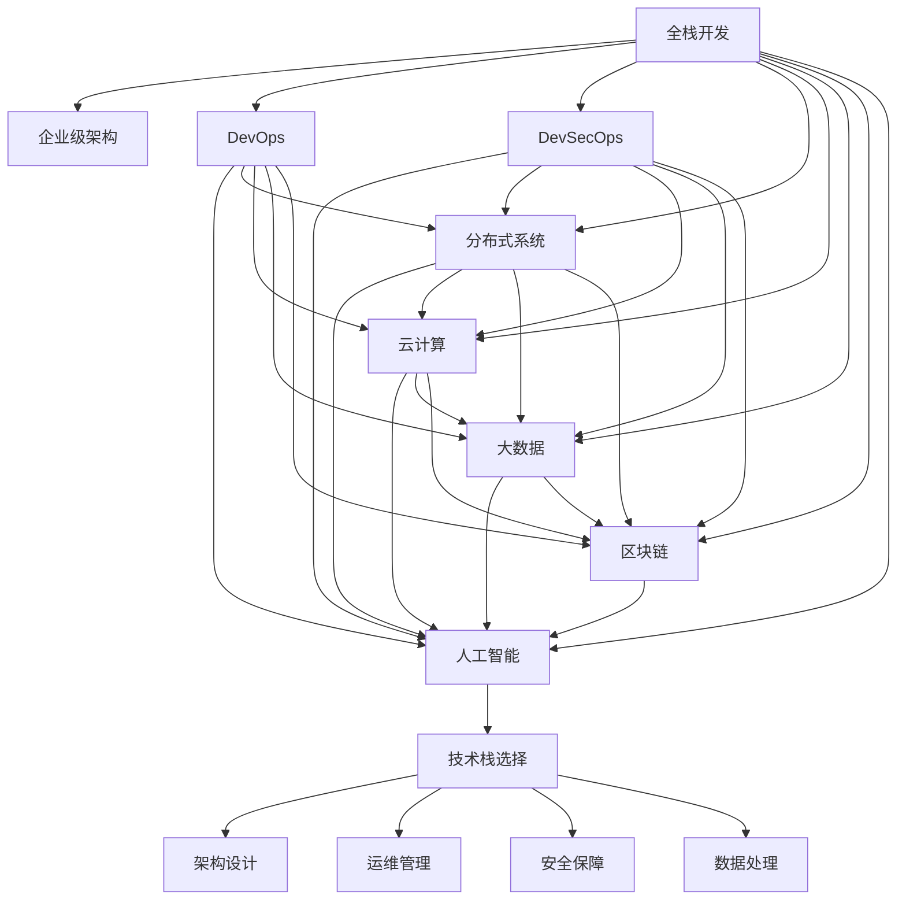

                 

# 从全栈开发到企业级架构师的进阶之路

> 关键词：全栈开发,企业级架构,技术栈,软件工程,DevOps,DevSecOps,分布式系统,云计算,大数据,区块链,人工智能

## 1. 背景介绍

### 1.1 问题由来
在现代软件开发实践中，随着业务复杂度的不断提升和技术栈的多样化，越来越多的开发者需要具备跨领域、多角色的能力。对于那些希望从全栈开发进阶到企业级架构师的人，需要不仅掌握多种编程语言和框架，还需要深入理解系统架构、运维管理和数据处理等领域的技术和最佳实践。

### 1.2 问题核心关键点
从全栈开发到企业级架构师，核心在于从单一技术技能转变为全局视角下的系统设计和架构能力。这一转型涉及到技术深度和广度的扩展，以及对系统稳定性、扩展性和性能的持续优化。

### 1.3 问题研究意义
掌握全栈开发技能是成为一名优秀程序员的基础，但成为企业级架构师，则需要更加深入地理解系统设计和运维，能够有效地设计和维护大型、复杂的分布式系统。这一角色对于提升企业信息化水平、驱动数字化转型至关重要。

## 2. 核心概念与联系

### 2.1 核心概念概述

为更好地理解从全栈开发到企业级架构师的进阶之路，本节将介绍几个密切相关的核心概念：

- 全栈开发(Full-stack Development)：指开发人员需要掌握前后端、数据库、服务端、前端等全栈技术，能够独立完成从需求分析到产品交付的整个开发流程。

- 企业级架构(Enterprise Architecture)：涉及企业信息系统的整体设计，包括架构规划、系统架构、部署策略、数据管理等方面，旨在构建稳定、高效、可扩展的企业级系统。

- DevOps（发展、运维）：将开发和运维流程一体化，强调协作、自动化和持续交付，提升软件开发效率和系统稳定性。

- DevSecOps（发展、运维、安全）：在DevOps基础上，融合安全测试和审计，确保系统在交付和运维过程中不引入安全漏洞。

- 分布式系统(Distributed System)：指由多个相互连接的计算机节点构成的系统，能够在大量数据和并发请求下提供高效、可靠的服务。

- 云计算(Cloud Computing)：基于互联网的计算服务模式，提供按需、弹性、安全的计算资源，广泛应用于数据处理、应用开发等领域。

- 大数据(Big Data)：指大规模、复杂的数据集，需要采用分布式计算、存储技术处理和分析，以揭示数据价值。

- 区块链(Blockchain)：一种分布式账本技术，通过去中心化、透明和不可篡改的特性，为金融、供应链、版权保护等领域带来革命性改变。

- 人工智能(Artificial Intelligence)：模拟人类智能行为的技术，包括机器学习、深度学习、自然语言处理等，在自动化、决策支持等方面具有广泛应用。

这些核心概念之间的逻辑关系可以通过以下Mermaid流程图来展示：



这个流程图展示了她从全栈开发到企业级架构师所需掌握的关键概念及其相互关系：

1. 全栈开发为技术基础，涵盖前后端、云、大数据、AI等各类技术。
2. 企业级架构要求全面设计系统架构，涵盖分布式系统、云计算、DevOps等。
3. DevOps和DevSecOps保障系统稳定性和安全性。
4. 分布式系统、云计算、大数据和区块链为系统提供技术支持。
5. 人工智能提供智能分析和决策支持。
6. 技术栈选择、架构设计、运维管理和安全保障是企业级架构师的核心工作内容。

## 3. 核心算法原理 & 具体操作步骤
### 3.1 算法原理概述

从全栈开发到企业级架构师的进阶，其核心在于从技术实现转向系统设计，从局部优化转向全局优化。这一过程可以分解为以下几个关键步骤：

- **技术栈选择**：基于业务需求和技术趋势，选择最适合的技术栈和框架，构建高效的软件生态。
- **架构设计**：设计系统的高层架构，确定组件间的依赖关系和接口协议，确保系统的扩展性和灵活性。
- **运维管理**：实施持续集成(CI)和持续交付(CD)流程，监控系统性能，快速响应故障和优化。
- **安全保障**：设计安全策略，进行代码审计和漏洞扫描，确保系统不引入安全漏洞。
- **数据处理**：设计高效的数据模型和存储策略，优化数据访问和分析效率。

### 3.2 算法步骤详解

**Step 1: 技术栈选择**

1. **理解业务需求**：与业务方沟通，明确系统功能、性能要求、数据处理需求等。
2. **调研技术趋势**：关注行业内的最新技术趋势，如云计算、大数据、人工智能等，选择最适合的技术栈和框架。
3. **技术可行性分析**：评估技术栈的可扩展性、性能、安全性等方面，确保能够满足业务需求。

**Step 2: 架构设计**

1. **设计系统架构**：定义系统的总体架构，确定组件间的依赖关系和接口协议。
2. **设计组件接口**：明确组件之间的通信方式和数据格式，确保系统的高解耦性和灵活性。
3. **设计数据模型**：确定数据存储和访问策略，设计高效的数据模型，确保数据一致性和可扩展性。

**Step 3: 运维管理**

1. **实施CI/CD流程**：建立持续集成和持续交付流程，确保代码质量和系统快速迭代。
2. **监控系统性能**：部署监控工具，实时监控系统性能，发现和解决问题。
3. **优化系统性能**：分析性能瓶颈，优化代码和数据库，提升系统响应速度和吞吐量。

**Step 4: 安全保障**

1. **设计安全策略**：制定安全策略，包括数据加密、访问控制、日志记录等。
2. **进行代码审计**：定期进行代码审计，确保代码中不引入安全漏洞。
3. **进行漏洞扫描**：使用漏洞扫描工具，及时发现和修复安全漏洞。

**Step 5: 数据处理**

1. **设计数据模型**：根据业务需求设计高效的数据模型，优化数据访问和分析效率。
2. **实施数据存储策略**：选择合适的数据库和存储技术，确保数据安全和一致性。
3. **优化数据访问**：优化查询和访问效率，提升数据处理速度。

### 3.3 算法优缺点

从全栈开发到企业级架构师的进阶，其优点在于：

1. **系统视角**：从单一技术实现转向系统设计，能够全面考虑业务需求、技术选型、安全保障等方面，提升系统整体质量。
2. **全局优化**：从局部优化转向全局优化，能够系统性提升系统性能和扩展性。
3. **持续迭代**：基于CI/CD流程，实现快速迭代，适应业务需求变化。
4. **综合技能**：涵盖技术实现、系统设计、运维管理、安全保障等综合技能，成为行业专家。

缺点包括：

1. **学习曲线陡峭**：系统设计和架构设计要求更高的理论和技术基础，学习曲线陡峭。
2. **跨领域挑战**：需要掌握多个领域的知识和技能，跨领域挑战较大。
3. **资源投入大**：系统设计和技术选型需要大量时间投入，资源消耗较大。

### 3.4 算法应用领域

从全栈开发到企业级架构师的技能，可以应用于多个领域，包括但不限于：

- **企业信息化**：为企业的信息化项目提供技术架构设计和系统开发，提升信息化水平。
- **互联网应用**：设计和开发高性能、高可用的互联网应用系统，确保用户体验和系统稳定性。
- **大数据分析**：设计和开发大数据处理和分析系统，挖掘数据价值，驱动业务决策。
- **云计算平台**：设计和开发基于云计算的分布式系统，提供弹性、安全的计算资源。
- **区块链应用**：设计和开发基于区块链的信任机制和交易系统，实现去中心化的数据管理和安全保障。
- **人工智能应用**：设计和开发基于AI的智能分析和决策支持系统，提升业务效率和智能化水平。

## 4. 数学模型和公式 & 详细讲解  
### 4.1 数学模型构建

本节将使用数学语言对从全栈开发到企业级架构师的进阶过程进行更加严格的刻画。

假设系统架构由多个组件构成，每个组件的性能参数为 $x_i$，则系统的整体性能 $P$ 可以表示为：

$$
P = \sum_{i=1}^{n} w_i f_i(x_i)
$$

其中，$w_i$ 为组件 $i$ 的权重，$f_i(x_i)$ 为组件 $i$ 的性能函数。

系统的整体安全性 $S$ 可以表示为：

$$
S = \max_{i=1}^{n} w_i f_i(x_i)
$$

其中，$f_i(x_i)$ 为组件 $i$ 的安全性函数。

系统的整体扩展性 $E$ 可以表示为：

$$
E = \sum_{i=1}^{n} w_i g_i(x_i)
$$

其中，$g_i(x_i)$ 为组件 $i$ 的扩展性函数。

系统的整体可靠性 $R$ 可以表示为：

$$
R = \prod_{i=1}^{n} w_i f_i(x_i)
$$

其中，$f_i(x_i)$ 为组件 $i$ 的可靠性函数。

系统的整体数据处理能力 $D$ 可以表示为：

$$
D = \sum_{i=1}^{n} w_i h_i(x_i)
$$

其中，$h_i(x_i)$ 为组件 $i$ 的数据处理能力函数。

### 4.2 公式推导过程

以下我们以系统性能和安全性为例，推导它们的数学模型和优化目标。

假设系统由两个组件构成，组件 $A$ 和组件 $B$，其性能函数和权重分别为 $f_A(x_A)$、$f_B(x_B)$ 和 $w_A$、$w_B$，安全性函数分别为 $f^S_A(x_A)$、$f^S_B(x_B)$ 和 $w^S_A$、$w^S_B$。

系统的整体性能可以表示为：

$$
P = w_A f_A(x_A) + w_B f_B(x_B)
$$

系统的整体安全性可以表示为：

$$
S = \max\{w^S_A f^S_A(x_A), w^S_B f^S_B(x_B)\}
$$

优化目标可以表示为：

$$
\max_{x_A, x_B} P - \lambda (S - \sigma)
$$

其中，$\lambda$ 为安全性的惩罚系数，$\sigma$ 为系统安全性的目标值。

在得到优化目标后，我们可以通过梯度下降等优化算法，计算各组件的性能参数 $x_A$ 和 $x_B$，最小化性能目标函数，同时最大化安全性目标。

### 4.3 案例分析与讲解

**案例1: 企业信息化系统**

假设某企业的信息化系统由两个组件构成：业务处理组件和数据存储组件，其性能函数和权重分别为 $f_A(x_A)$、$f_B(x_B)$ 和 $w_A$、$w_B$，安全性函数分别为 $f^S_A(x_A)$、$f^S_B(x_B)$ 和 $w^S_A$、$w^S_B$。

- **性能优化**：通过调整组件的性能参数，如增加计算资源、优化算法等，提升系统的整体性能。
- **安全性优化**：通过增加安全措施，如数据加密、访问控制等，提升系统的安全性。
- **综合优化**：通过平衡性能和安全性，设计最优的组件配置，确保系统在高效和稳定之间取得平衡。

**案例2: 互联网应用系统**

假设某互联网应用系统由前端、后端、数据库三个组件构成，其性能函数和权重分别为 $f_A(x_A)$、$f_B(x_B)$、$f_C(x_C)$ 和 $w_A$、$w_B$、$w_C$，安全性函数分别为 $f^S_A(x_A)$、$f^S_B(x_B)$、$f^S_C(x_C)$ 和 $w^S_A$、$w^S_B$、$w^S_C$。

- **性能优化**：通过优化前端页面加载速度、后端服务响应速度和数据库查询效率，提升系统的整体性能。
- **安全性优化**：通过加强登录验证、数据加密、访问控制等措施，提升系统的安全性。
- **综合优化**：通过平衡前端、后端和数据库的性能和安全性，设计最优的系统架构。

## 5. 项目实践：代码实例和详细解释说明
### 5.1 开发环境搭建

在进行系统架构设计和开发前，我们需要准备好开发环境。以下是使用Python进行Django开发的环境配置流程：

1. 安装Anaconda：从官网下载并安装Anaconda，用于创建独立的Python环境。

2. 创建并激活虚拟环境：
```bash
conda create -n django-env python=3.8 
conda activate django-env
```

3. 安装Django：根据官网获取Django版本，从官网获取安装命令。例如：
```bash
pip install django==3.2.6
```

4. 安装各类工具包：
```bash
pip install numpy pandas scikit-learn matplotlib tqdm jupyter notebook ipython
```

完成上述步骤后，即可在`django-env`环境中开始系统开发。

### 5.2 源代码详细实现

下面我们以企业信息化系统为例，给出使用Django进行系统架构设计和开发的PyTorch代码实现。

首先，定义系统的整体架构：

```python
# settings.py

INSTALLED_APPS = [
    ...
    'business',  # 业务处理组件
    'data',  # 数据存储组件
]
```

然后，定义业务处理组件：

```python
# business/views.py

from django.shortcuts import render
from django.http import HttpResponse

def index(request):
    return HttpResponse("This is the business component.")
```

接着，定义数据存储组件：

```python
# data/views.py

from django.shortcuts import render
from django.http import HttpResponse

def index(request):
    return HttpResponse("This is the data storage component.")
```

最后，在Django的主文件中，定义系统运行入口：

```python
# wsgi.py

from django.core.wsgi import get_wsgi_application

application = get_wsgi_application()
```

完成上述步骤后，即可在Django环境下搭建企业信息化系统架构，进行开发实践。

### 5.3 代码解读与分析

让我们再详细解读一下关键代码的实现细节：

**settings.py**：
- `INSTALLED_APPS` 定义了系统所需的应用组件，包括业务处理组件和数据存储组件。

**business/views.py**：
- `index` 函数定义了业务处理组件的首页页面，返回一个简单的HTTP响应。

**data/views.py**：
- `index` 函数定义了数据存储组件的首页页面，返回一个简单的HTTP响应。

**wsgi.py**：
- `get_wsgi_application` 方法定义了Django应用的WSGI入口，启动应用。

可以看到，Django框架的强大封装使得系统架构设计和开发变得简洁高效。开发者可以将更多精力放在系统功能和架构设计上，而不必过多关注底层的实现细节。

当然，工业级的系统实现还需考虑更多因素，如代码规范、测试、部署等。但核心的架构设计基本与此类似。

## 6. 实际应用场景
### 6.1 智能客服系统

基于全栈开发技能，可以构建智能客服系统，提升客户咨询体验和问题解决效率。智能客服系统通过自然语言处理技术，理解客户咨询意图，匹配最合适的答案模板进行回复。

在技术实现上，可以收集企业内部的历史客服对话记录，将问题和最佳答复构建成监督数据，在此基础上对预训练语言模型进行微调。微调后的语言模型能够自动理解用户意图，匹配最合适的答案模板进行回复。对于客户提出的新问题，还可以接入检索系统实时搜索相关内容，动态组织生成回答。如此构建的智能客服系统，能大幅提升客户咨询体验和问题解决效率。

### 6.2 金融舆情监测

利用全栈开发技能，可以构建金融舆情监测系统，实时监测市场舆论动向，及时应对负面信息传播，规避金融风险。

在技术实现上，可以收集金融领域相关的新闻、报道、评论等文本数据，并对其进行主题标注和情感标注。在此基础上对预训练语言模型进行微调，使其能够自动判断文本属于何种主题，情感倾向是正面、中性还是负面。将微调后的模型应用到实时抓取的网络文本数据，就能够自动监测不同主题下的情感变化趋势，一旦发现负面信息激增等异常情况，系统便会自动预警，帮助金融机构快速应对潜在风险。

### 6.3 个性化推荐系统

基于全栈开发技能，可以构建个性化推荐系统，提升推荐系统的精度和用户体验。个性化推荐系统通过分析用户的历史行为和兴趣，推荐用户可能感兴趣的商品或内容。

在技术实现上，可以收集用户浏览、点击、评论、分享等行为数据，提取和用户交互的物品标题、描述、标签等文本内容。将文本内容作为模型输入，用户的后续行为（如是否点击、购买等）作为监督信号，在此基础上对预训练语言模型进行微调。微调后的模型能够从文本内容中准确把握用户的兴趣点。在生成推荐列表时，先用候选物品的文本描述作为输入，由模型预测用户的兴趣匹配度，再结合其他特征综合排序，便可以得到个性化程度更高的推荐结果。

### 6.4 未来应用展望

随着全栈开发技能的不断提升，未来将会有更多的应用场景值得探索：

- **智慧医疗**：基于全栈开发技能，可以构建智慧医疗系统，辅助医生诊疗，加速新药开发进程。
- **智能教育**：利用全栈开发技能，可以构建智能教育系统，因材施教，促进教育公平，提高教学质量。
- **智慧城市**：基于全栈开发技能，可以构建智慧城市治理系统，提高城市管理的自动化和智能化水平，构建更安全、高效的未来城市。
- **自动化测试**：利用全栈开发技能，可以构建自动化测试系统，提升软件开发的自动化程度，减少人工测试成本。
- **区块链应用**：基于全栈开发技能，可以构建基于区块链的信任机制和交易系统，实现去中心化的数据管理和安全保障。
- **人工智能应用**：利用全栈开发技能，可以构建基于AI的智能分析和决策支持系统，提升业务效率和智能化水平。

## 7. 工具和资源推荐
### 7.1 学习资源推荐

为了帮助开发者系统掌握全栈开发技能，这里推荐一些优质的学习资源：

1. Django官方文档：Django的官方文档，提供了全面的API参考和实例代码，是学习和开发Django项目的必备资源。

2. Flask官方文档：Flask的官方文档，介绍了Flask的核心概念和使用方法，适合初学者快速上手。

3. Django Girl：Django Girl是一本面向初学者的Django教程，内容详实，适合初学者快速入门。

4. Full-Stack Web Developer Roadmap：一份完整的全栈开发者学习路线图，涵盖前端、后端、数据库、测试等多个方面。

5. Udacity Web Development Nanodegree：Udacity提供的一个完整的Web开发课程，涵盖前端、后端、数据库等多个方面，适合系统学习全栈开发技能。

通过对这些资源的学习实践，相信你一定能够快速掌握全栈开发技能，并用于解决实际的系统设计和开发问题。

### 7.2 开发工具推荐

高效的开发离不开优秀的工具支持。以下是几款用于全栈开发开发的常用工具：

1. Django：一个强大的Python Web框架，支持快速开发、高效部署、高度可扩展。

2. Flask：一个轻量级的Python Web框架，适合快速开发小型Web应用。

3. React：一个流行的JavaScript库，用于构建高性能、交互式的用户界面。

4. Angular：一个流行的JavaScript框架，用于构建大型、复杂的Web应用。

5. Bootstrap：一个流行的CSS框架，用于快速构建响应式布局和样式。

6. PostgreSQL：一个流行的开源关系型数据库，支持高可用、扩展性强的数据存储。

7. Redis：一个流行的内存数据存储，用于高效缓存和数据存储。

合理利用这些工具，可以显著提升全栈开发任务的开发效率，加快创新迭代的步伐。

### 7.3 相关论文推荐

全栈开发技能的发展源于学界的持续研究。以下是几篇奠基性的相关论文，推荐阅读：

1. Object-Oriented Software Construction：Jay Longstaff等人的著作，介绍了面向对象编程的原理和最佳实践，是软件工程领域的经典之作。

2. Patterns of Enterprise Application Architecture：Martin Fowler的著作，介绍了企业级应用架构的设计模式和最佳实践，是架构设计领域的经典之作。

3. Microservices: Principles and Patterns：Sam Newman的著作，介绍了微服务的原理和设计模式，是微服务架构设计的经典之作。

4. Web Application Architecture: Designing for Concurrency：Martin Fowler的著作，介绍了Web应用架构的设计和优化，是Web应用架构设计的经典之作。

5. Cloud Computing: Concepts, Technology, and Architecture：Adnan Buchta的著作，介绍了云计算的原理、技术和架构，是云架构设计的经典之作。

这些论文代表了大规模软件开发技术的发展脉络。通过学习这些前沿成果，可以帮助研究者把握学科前进方向，激发更多的创新灵感。

## 8. 总结：未来发展趋势与挑战
### 8.1 总结

本文对从全栈开发到企业级架构师的进阶之路进行了全面系统的介绍。首先阐述了全栈开发技能的重要性和企业级架构师所需掌握的全面技能，明确了从全栈开发到企业级架构师进阶的关键点。

通过从技术栈选择、架构设计、运维管理、安全保障、数据处理等多个维度的详细介绍，全面展示了全栈开发技能的重要性和应用价值。同时，通过理论模型和实际案例的详细讲解，深入浅出地介绍了从全栈开发到企业级架构师进阶的过程。

### 8.2 未来发展趋势

展望未来，全栈开发技能和系统架构设计将呈现以下几个发展趋势：

1. **云原生架构**：随着云原生技术的不断成熟，基于云计算的系统架构将逐渐普及。云原生架构强调可扩展性、自动化和弹性，适合分布式、高并发的应用场景。

2. **微服务架构**：微服务架构将大系统拆分为多个小服务，每个服务独立部署、独立扩展。这种架构能够提升系统的灵活性和扩展性，适合大型、复杂的系统。

3. **DevSecOps**：DevSecOps强调开发、安全和运维的一体化，提升系统安全性和可靠性。未来，DevSecOps将成为全栈开发的重要组成部分。

4. **区块链应用**：随着区块链技术的成熟，基于区块链的应用将逐渐普及。区块链技术具有去中心化、透明和不可篡改的特性，适合金融、供应链、版权保护等领域。

5. **人工智能应用**：人工智能技术将逐渐融入全栈开发，提升系统的智能化水平。人工智能技术在自动化、决策支持等方面具有广泛应用。

6. **持续集成与持续交付(CI/CD)**：持续集成和持续交付将成为全栈开发的重要工具。CI/CD能够实现代码自动化测试、构建和部署，提升系统开发效率。

### 8.3 面临的挑战

尽管全栈开发技能和系统架构设计已经取得了显著进展，但在迈向更加智能化、普适化应用的过程中，仍面临诸多挑战：

1. **系统复杂性**：大型、复杂的系统设计和管理复杂，容易出现技术债务和代码冗余。

2. **技术演进快**：技术栈不断更新，需要开发者不断学习新技术和新工具，保持技术敏锐性。

3. **资源消耗大**：大型系统的开发和部署需要大量资源，如何优化资源使用，提升系统性能，是重要的挑战。

4. **安全性问题**：系统安全性一直是重要的挑战，特别是在大型、复杂系统中，容易产生安全漏洞。

5. **性能瓶颈**：系统性能瓶颈多发，如何优化系统性能，提升用户体验，是重要的挑战。

6. **系统维护**：大型系统的维护复杂，容易出现bug和问题，需要系统化的方法和工具。

### 8.4 研究展望

面对全栈开发和系统架构设计的挑战，未来的研究需要在以下几个方面寻求新的突破：

1. **云原生技术**：研究云原生架构的原理和最佳实践，提升系统可扩展性和自动化程度。

2. **微服务架构**：研究微服务架构的设计和优化，提升系统的灵活性和扩展性。

3. **DevSecOps**：研究DevSecOps的最佳实践，提升系统的安全性和可靠性。

4. **区块链应用**：研究区块链技术在企业信息化、金融、供应链等领域的应用，提升系统的去中心化和透明性。

5. **人工智能应用**：研究人工智能技术在自动化、决策支持等领域的应用，提升系统的智能化水平。

6. **持续集成与持续交付(CI/CD)**：研究CI/CD的最佳实践，提升系统的自动化程度和开发效率。

这些研究方向将引领全栈开发和系统架构设计的技术演进，为构建更加高效、可靠、智能的系统和应用提供新的动力。

## 9. 附录：常见问题与解答

**Q1: 什么是全栈开发技能？**

A: 全栈开发技能是指开发者需要掌握前端、后端、数据库、服务器、网络等多个领域的技术，能够独立完成从需求分析到产品交付的整个开发流程。

**Q2: 如何成为一名企业级架构师？**

A: 成为一名企业级架构师需要具备全面的系统设计和架构能力，掌握分布式系统、云计算、DevOps等综合技能。同时，需要通过不断学习和实践，积累丰富的项目经验和成功案例。

**Q3: 全栈开发和系统架构设计有何不同？**

A: 全栈开发主要关注技术实现，包括前端、后端、数据库等各个环节的技术栈选择和实现；系统架构设计则更多关注系统的整体设计和架构规划，确保系统的高效、可靠和可扩展性。

**Q4: 学习全栈开发技能有哪些推荐资源？**

A: 推荐阅读《Object-Oriented Software Construction》、《Patterns of Enterprise Application Architecture》、《Microservices: Principles and Patterns》、《Web Application Architecture: Designing for Concurrency》和《Cloud Computing: Concepts, Technology, and Architecture》等经典著作。同时，可以通过Udacity Web Development Nanodegree等在线课程系统学习全栈开发技能。

通过本文的系统梳理，可以看到，从全栈开发到企业级架构师的进阶之路，不仅需要掌握全面的技术栈，还需要深入理解系统设计和管理。只有在技术实现和系统设计之间取得平衡，才能构建高效、可靠、智能的系统和应用，推动企业信息化和数字化转型进程。总之，全栈开发技能和系统架构设计是一个长期学习和实践的过程，需要不断积累经验和提升技能，方能成为一名优秀的企业级架构师。

