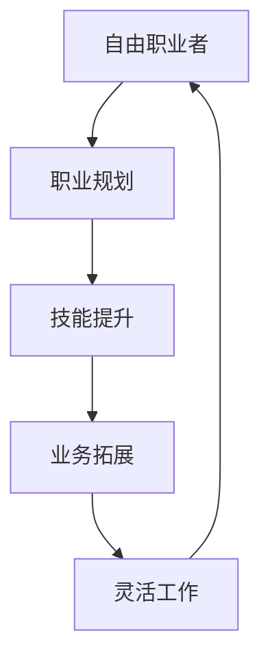

                 

# 从员工到自由职业者的转型指南

> 关键词：自由职业, 职业转型, 技能提升, 灵活工作, 职业规划

## 1. 背景介绍

### 1.1 问题由来
随着数字化转型和远程工作模式的兴起，越来越多的人开始考虑从传统就业路径转向自由职业。在疫情、经济波动以及技术进步等因素的驱动下，自由职业成为了不少职场人转型的首选。然而，从员工到自由职业者的转变并非易事，如何成功转型？本文将深入探讨从员工到自由职业者的完整指南，涵盖职业规划、技能提升、业务拓展等各个方面，助你顺利迈向自由职业之路。

### 1.2 问题核心关键点
自由职业者转型需要综合考虑技能提升、业务拓展、职业规划等多个维度。本文将详细解析自由职业转型的核心问题，并介绍相应的解决策略。

1. **技能提升**：自由职业者需要具备多种技能，包括但不限于编程、设计、写作、营销等。需根据市场需求和个人兴趣进行技能学习和提升。

2. **业务拓展**：找到适合的业务方向和市场定位，明确自身优势和定位，建立稳定的客户群体。

3. **职业规划**：制定明确的职业目标和规划，包括短期和长期目标，并持之以恒地执行。

## 2. 核心概念与联系

### 2.1 核心概念概述

在自由职业转型过程中，以下几个核心概念值得重视：

- **自由职业者(Freelancers)**：不固定雇主，独立承接各类工作任务，通过个人技能和服务来获得收入。

- **职业规划(Career Planning)**：为实现职业目标而制定和实施的一系列计划和行动策略。

- **技能提升(Skill Enhancement)**：通过培训、自学等方式，不断提升自身专业技能，适应市场需求。

- **业务拓展(Business Expansion)**：开拓新的业务领域，扩大客户群体，提升收入水平。

- **灵活工作(Flexible Work)**：选择时间、地点和任务种类等方面具有较大自主性的工作模式。

这些概念相互联系，共同构成了自由职业转型的基础框架。通过明确这些概念并加以有效实践，你将能够更加顺利地转型为自由职业者。

### 2.2 核心概念原理和架构的 Mermaid 流程图



此流程图展示了自由职业转型中的核心概念和它们之间的关系。职业规划是起点，通过提升技能、拓展业务和实现灵活工作，最终形成可持续发展的自由职业者。

## 3. 核心算法原理 & 具体操作步骤

### 3.1 算法原理概述

自由职业转型的核心算法原理主要基于目标驱动和系统性策略。通过明确职业目标，并采取分步行动策略，逐步实现技能提升、业务拓展和灵活工作。

### 3.2 算法步骤详解

1. **目标设定**：明确短期和长期职业目标，包括预期收入、工作类型、客户群体等。
2. **技能评估**：评估自身当前的技能水平，确定需要提升的技能和领域。
3. **技能提升**：通过在线课程、工作坊、自学等方式提升所需技能。
4. **市场调研**：研究市场需求，确定目标客户群体和业务方向。
5. **业务拓展**：通过建立个人网站、社交媒体推广、参加行业活动等方式，扩大客户群体。
6. **灵活工作**：选择适合自由职业的工作平台，灵活安排工作时间和地点。
7. **持续优化**：根据市场反馈和自身成长，不断调整职业规划和策略。

### 3.3 算法优缺点

**优点**：
- 灵活性高，自主性强，可以根据自身兴趣和市场需求进行调整。
- 多样化收入来源，风险相对较低。
- 时间自由，工作和生活平衡。

**缺点**：
- 初期收入不稳定，需要一定的市场积累和业务拓展。
- 需要较强的自我管理能力和自律性。
- 缺乏固定的福利和安全保障。

### 3.4 算法应用领域

自由职业转型的方法适用于各类技能工作者，包括但不限于软件开发、设计、写作、营销、数据分析等。不同领域自由职业者的具体实现路径可能会有所差异，但总体思路是相似的。

## 4. 数学模型和公式 & 详细讲解 & 举例说明

### 4.1 数学模型构建

假设自由职业者的收入函数为 $I(t)$，其中 $t$ 表示时间（以月为单位），$I(t)$ 为在第 $t$ 个月末的收入。该模型由以下几个变量组成：

- $C(t)$：第 $t$ 个月的开销。
- $G(t)$：第 $t$ 个月的市场拓展投入。
- $S(t)$：第 $t$ 个月的客户获取和维护投入。

收入模型可以表示为：

$$ I(t) = C(t) + G(t) + S(t) + \text{其他收入} $$

其中，$C(t)$、$G(t)$ 和 $S(t)$ 为变量系数，分别表示开销、市场拓展和客户获取的增长率。

### 4.2 公式推导过程

1. **收入模型构建**：
$$ I(t) = C(t) + G(t) + S(t) + \text{其他收入} $$

2. **市场拓展模型**：
$$ G(t) = G_0 \cdot (1+g)^t $$
其中，$G_0$ 为初始市场拓展投入，$g$ 为月度增长率。

3. **客户获取模型**：
$$ S(t) = S_0 \cdot (1+s)^t $$
其中，$S_0$ 为初始客户获取投入，$s$ 为月度增长率。

### 4.3 案例分析与讲解

假设一个自由职业软件开发者的月度开支为 $C(t)=1000$ 美元，市场拓展投入 $G_0=500$ 美元，月度增长率 $g=10\%$，初始客户获取投入 $S_0=100$ 美元，月度增长率 $s=5\%$。则在第12个月的收入可以计算如下：

1. **市场拓展投入**：
$$ G(t) = 500 \cdot (1+0.1)^t $$
$$ G(12) = 500 \cdot 1.1^{12} \approx 2754.40 \text{ 美元} $$

2. **客户获取投入**：
$$ S(t) = 100 \cdot (1+0.05)^t $$
$$ S(12) = 100 \cdot 1.05^{12} \approx 161.91 \text{ 美元} $$

3. **总收入**：
$$ I(12) = 1000 + 2754.40 + 161.91 + \text{其他收入} \approx 3915.31 \text{ 美元} $$

通过以上公式，可以计算出在第12个月末的预期收入。实际应用中，需要根据市场反馈和自身进展不断调整模型参数，优化收入预测。

## 5. 项目实践：代码实例和详细解释说明

### 5.1 开发环境搭建

1. **安装Python**：下载并安装Python 3.8或以上版本。
2. **安装Pandas和NumPy**：
```bash
pip install pandas numpy
```
3. **安装Plotly**：用于数据可视化。
```bash
pip install plotly
```

### 5.2 源代码详细实现

以下是一个简化的Python代码示例，用于模拟自由职业者的收入增长：

```python
import pandas as pd
import numpy as np
import plotly.graph_objects as go

# 定义模型参数
G0 = 500  # 初始市场拓展投入
g = 0.1  # 月度增长率
S0 = 100  # 初始客户获取投入
s = 0.05  # 月度增长率
C = 1000  # 月度开支

# 计算月度收入
t = np.arange(1, 13)  # 1至12个月
G = G0 * (1 + g)**t
S = S0 * (1 + s)**t
I = C + G + S

# 绘制月度收入曲线
fig = go.Figure(data=go.Scatter(x=t, y=I))
fig.update_layout(title='自由职业者月度收入预测', xaxis_title='月数', yaxis_title='月收入')
fig.show()
```

### 5.3 代码解读与分析

代码中，我们使用了NumPy和Pandas库来计算自由职业者的月度收入，并使用Plotly库进行数据可视化。通过设置初始投入和月度增长率，计算得到每个月的收入。最终的图形展示了收入随时间变化的趋势。

### 5.4 运行结果展示

运行上述代码，将生成一个折线图，展示自由职业者在1至12个月内的月度收入变化。结果应为一条逐渐增长的曲线，体现了市场拓展和客户获取对收入的积极影响。

## 6. 实际应用场景

### 6.1 软件开发自由职业者

对于软件开发自由职业者而言，技能提升尤为重要。通过掌握多种编程语言和框架，如Python、JavaScript、Java等，以及了解DevOps、云开发等知识，可以显著提升市场竞争力。

### 6.2 设计自由职业者

设计自由职业者需要不断提升自己的设计技能，包括UI/UX设计、平面设计、3D建模等。同时，通过建立个人品牌和作品集，参加设计竞赛和社群活动，可以扩大客户群体。

### 6.3 写作自由职业者

写作自由职业者需要具备丰富的写作经验和多种写作风格，包括内容创作、技术文档、广告文案等。通过不断提升写作技巧和多样化写作内容，可以满足不同客户的需求。

### 6.4 未来应用展望

随着远程工作和数字化转型的进一步深入，自由职业市场将迎来更广阔的发展空间。结合AI和大数据技术，自由职业者将能更好地进行市场分析和业务拓展，提升工作效率和收入水平。

## 7. 工具和资源推荐

### 7.1 学习资源推荐

1. **Coursera和Udemy**：提供大量高质量的在线课程，涵盖编程、设计、写作、营销等多个领域。

2. **LinkedIn Learning**：专注于职场技能提升，提供丰富的职业发展课程。

3. **EdX**：提供免费的MOOC课程，涵盖学术和职业发展内容。

### 7.2 开发工具推荐

1. **GitHub**：代码托管平台，方便版本控制和代码共享。

2. **Jupyter Notebook**：交互式编程环境，便于数据分析和可视化。

3. **Zoom和Slack**：远程工作协作工具，方便与客户和同事进行沟通。

### 7.3 相关论文推荐

1. **《自由职业的未来：自动化和人工智能如何改变职业》**：探讨AI对自由职业市场的影响。

2. **《技能多样性与自由职业者职业发展》**：研究技能多样性对自由职业者收入和市场竞争力的影响。

3. **《远程工作对自由职业者生产力和工作满意度的影响》**：分析远程工作模式对自由职业者的影响。

## 8. 总结：未来发展趋势与挑战

### 8.1 研究成果总结

本文从技能提升、业务拓展和职业规划等方面，探讨了从员工到自由职业者的转型策略。通过设定明确的目标和分步实施策略，成功转型的自由职业者可以拥有更灵活的工作方式和更高的收入水平。

### 8.2 未来发展趋势

1. **AI和大数据的广泛应用**：AI和大数据技术将进一步提升自由职业者的工作效率和市场分析能力。

2. **远程工作和数字化转型**：远程工作模式的普及将使得自由职业者更加灵活，降低成本，提高工作效率。

3. **技能多样性要求提高**：未来市场对自由职业者的技能要求将更加多样，跨领域技能将更具竞争力。

4. **新兴技术不断涌现**：新兴技术如区块链、虚拟现实等，将为自由职业者带来更多业务机会。

### 8.3 面临的挑战

1. **市场竞争加剧**：自由职业市场竞争激烈，需不断提升技能和业务能力以保持竞争力。

2. **收入不稳定**：初期收入可能受市场和项目规模影响，需要积极拓展客户和业务。

3. **自我管理难度大**：需具备较强的自律性和时间管理能力，以确保高效工作。

### 8.4 研究展望

未来研究需关注以下几个方向：

1. **跨领域技能提升**：结合不同领域的技术和知识，提升自由职业者的市场适应性和竞争力。

2. **AI辅助工具**：开发和使用AI辅助工具，提高工作效率和业务拓展能力。

3. **新兴市场机遇**：积极探索新兴技术市场，如区块链、虚拟现实等，抓住新的商业机会。

## 9. 附录：常见问题与解答

**Q1：如何找到适合自由职业的方向？**

A: 通过兴趣和市场需求的双重考量，结合自身优势选择适合的业务方向。建议先进行市场调研，了解不同领域的竞争情况和收入水平，再结合自身兴趣和技能，制定适合的职业规划。

**Q2：自由职业转型初期收入不稳定怎么办？**

A: 初期收入不稳定是常见问题，建议多渠道拓展客户，如平台接单、社交媒体推广、个人网站建立等。同时，建立应急储备金，以应对短期收入波动。

**Q3：自由职业者如何保持工作与生活的平衡？**

A: 制定合理的工作计划和时间管理策略，合理分配工作和休息时间，保持身心健康。使用工具如Trello、Asana等，进行任务管理和时间规划。

**Q4：自由职业者如何提升市场竞争力？**

A: 通过不断学习和提升技能，积极参与行业活动和社群交流，建立个人品牌和作品集。同时，利用AI和大数据工具进行市场分析和客户匹配，提高工作效率。

---

作者：禅与计算机程序设计艺术 / Zen and the Art of Computer Programming

