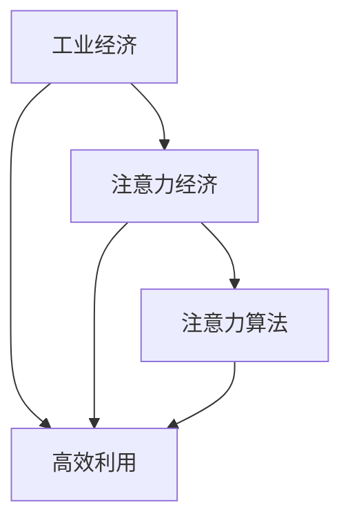

                 

# 从工业经济到注意力经济的转变

> 关键词：人工智能, 注意力经济, 工业经济, 算法, 机器学习, 计算理论, 分布式计算, 计算图

## 1. 背景介绍

### 1.1 问题由来

在经历了数十年的数字化转型后，全球经济正逐步从工业经济向注意力经济转型。这一转变不仅标志着生产方式和消费模式的根本性变革，也为人工智能技术的深度应用提供了新的契机。作为当今世界最前沿的技术领域，人工智能(AI)在生产力提升、经济结构优化、社会治理智能化等方面展现了巨大的潜力。

### 1.2 问题核心关键点

注意力经济的本质在于通过数据、计算资源和算法的密集型投入，实现对注意力资源的精确计量和高效配置。这一过程中，算法扮演了至关重要的角色。随着AI技术的发展，计算理论、分布式计算、计算图等基础理论不断突破，机器学习、深度学习、强化学习等技术体系日益成熟，越来越多的企业和研究机构开始利用AI技术，在信息抽取、推荐系统、自然语言处理等领域构建智能化服务，极大地提升了社会整体的信息处理能力。

但与此同时，如何在大规模、高复杂度的场景中，有效利用算法资源，确保算法的可解释性、安全性和稳定性，也成为了业界和学术界共同关注的焦点。本文将从算法的角度，系统探讨从工业经济到注意力经济的转变，旨在为产业界提供深入的指导和参考。

## 2. 核心概念与联系

### 2.1 核心概念概述

为更好地理解这一转变过程，首先需要定义几个核心概念：

- **工业经济**：传统上，工业经济以物质资源的投入为核心，通过大规模生产、库存管理和供应链优化，实现商品的规模化生产和销售。

- **注意力经济**：注意力经济是以信息资源为核心，通过精确计量用户注意力、行为数据等，实现个性化服务和精准营销，最大化信息资源的商业价值。

- **人工智能**：人工智能利用算法、计算图、分布式计算等技术，自动化地处理和分析数据，从而提升信息处理效率和决策质量。

- **注意力算法**：通过设计合适的算法框架和模型，实现对用户注意力资源的精准分析和高效配置，是注意力经济的核心支撑技术。

这些核心概念之间的关系可以通过以下Mermaid流程图进行展示：



### 2.2 核心概念原理和架构

从工业经济向注意力经济转变的过程，本质上是生产要素的转变，即从物质资源转向数据资源，并基于数据资源进行计算和分析，实现经济活动的智能化和精准化。这一转变需要依赖一系列先进的计算技术和算法框架：

- **计算图**：计算图（Computational Graph）是描述算法执行流程的抽象模型。通过构建计算图，可以系统化地描述算法的执行逻辑，实现算法的可扩展、可复用和可优化。

- **分布式计算**：分布式计算（Distributed Computing）通过多台计算设备的协同工作，实现算法的并行计算和资源共享，提高算法的计算效率和可扩展性。

- **注意力机制**：注意力机制（Attention Mechanism）是深度学习中的一种重要算法设计，通过动态调整不同输入元素的权重，实现对输入数据的选择和聚焦，提升模型的表现能力。

这些技术架构共同构成了从工业经济向注意力经济转变的技术基础，为实现高效率、高精度的注意力算法提供了有力保障。

## 3. 核心算法原理 & 具体操作步骤

### 3.1 算法原理概述

注意力算法的核心原理在于通过动态调整输入数据的权重，实现对重要信息的聚焦和优先处理。在注意力机制中，每一轮计算会为输入数据的每个元素分配一个注意力权重，该权重表示元素在当前计算中的重要性，从而实现对输入数据的局部聚焦。

具体来说，注意力算法分为自注意力（Self-Attention）和多头注意力（Multi-Head Attention）两种主要形式。自注意力机制通过计算输入序列中每个元素与其他元素之间的相似度，生成一个注意力权重矩阵，实现对输入序列的动态聚焦。多头注意力则通过并行计算多个注意力权重矩阵，进一步提升了算法的表现能力。

### 3.2 算法步骤详解

注意力算法的具体步骤如下：

1. **输入编码**：将输入数据转化为固定长度的向量表示。这一步通常涉及嵌入（Embedding）操作，将文本、图像、音频等输入数据映射为向量形式。

2. **注意力计算**：计算输入数据的注意力权重，生成注意力权重矩阵。这一步是注意力算法的核心，通过计算不同输入元素之间的相似度，生成一个权重矩阵，表示每个元素在当前计算中的重要性。

3. **加权求和**：将注意力权重与输入向量进行加权求和，得到加权后的表示向量。这一步通过动态调整权重，实现了对输入数据的聚焦和优先处理。

4. **多轮计算**：如果采用多头注意力机制，则需要进行多轮计算，每轮计算一个注意力权重矩阵，将多轮计算的结果进行拼接或融合，得到最终的输出结果。

5. **解码与输出**：根据任务需求，对输出结果进行解码和处理，生成最终的输出结果。这一步涉及解码器（Decoder）的设计和实现，常见的方法包括循环神经网络（RNN）和变换器（Transformer）等。

### 3.3 算法优缺点

注意力算法的优点包括：

- **高效性**：通过动态调整输入数据的权重，实现对重要信息的聚焦，提高了计算效率和模型性能。

- **灵活性**：适用于多种输入数据的处理，如文本、图像、音频等，具有较强的通用性。

- **可解释性**：注意力权重能够直观地反映输入数据的重要性，有助于理解和解释模型的决策过程。

- **可扩展性**：通过并行计算多个注意力权重矩阵，能够实现算法的可扩展和可优化，适用于大规模数据和复杂任务。

但同时，注意力算法也存在一些缺点：

- **计算复杂度高**：注意力机制的计算复杂度较高，需要大量的计算资源和存储空间。

- **可解释性不足**：注意力权重虽然能够反映输入数据的重要性，但对于复杂的多头注意力机制，理解其内部的决策过程仍较为困难。

- **训练成本高**：注意力算法通常需要大量的标注数据进行训练，数据质量和数量的选择对模型的效果有较大影响。

### 3.4 算法应用领域

注意力算法在多个领域中得到了广泛应用，例如：

- **自然语言处理**：在机器翻译、情感分析、问答系统等任务中，注意力算法能够实现对输入文本的动态聚焦，提升模型的理解和生成能力。

- **计算机视觉**：在图像识别、目标检测等任务中，注意力算法能够实现对输入图像的局部聚焦，提升模型的感知能力。

- **语音处理**：在语音识别、情感识别等任务中，注意力算法能够实现对输入语音的动态聚焦，提升模型的感知和理解能力。

- **推荐系统**：在个性化推荐中，注意力算法能够实现对用户兴趣的精准分析和高效配置，提升推荐系统的个性化和精准度。

## 4. 数学模型和公式 & 详细讲解 & 举例说明

### 4.1 数学模型构建

注意力算法的数学模型可以表示为：

$$
\text{Attention}(Q,K,V)=\text{Softmax}(\frac{QK^T}{\sqrt{d_k}})V
$$

其中，$Q$、$K$、$V$分别为查询向量、键向量和值向量，$d_k$为键向量的维度。注意力机制通过计算查询向量$Q$与键向量$K$的点积，生成一个注意力权重矩阵，将权重与值向量$V$进行加权求和，得到最终的输出结果。

### 4.2 公式推导过程

注意力机制的推导过程如下：

1. **计算点积**：首先计算查询向量$Q$与每个键向量$K$的点积，得到一个权重矩阵$A$。

2. **计算softmax权重**：对权重矩阵$A$进行softmax处理，得到每个键向量的注意力权重$W$。

3. **加权求和**：将注意力权重$W$与每个值向量$V$进行加权求和，得到最终的输出向量$O$。

具体来说，注意力计算过程可以表示为：

$$
\text{Attention}(Q,K,V)=\text{Softmax}(\frac{QK^T}{\sqrt{d_k}})V
$$

其中，$\text{Softmax}$函数用于将权重矩阵$A$转换为注意力权重矩阵$W$。

### 4.3 案例分析与讲解

以机器翻译为例，注意力算法能够实现对源语言文本和目标语言文本的动态聚焦，提升翻译的准确性和流畅性。在机器翻译中，输入序列为源语言文本，输出序列为目标语言文本，通过计算源语言文本和目标语言文本之间的相似度，生成一个注意力权重矩阵，实现对源语言文本的局部聚焦，提升模型的理解和生成能力。

## 5. 项目实践：代码实例和详细解释说明

### 5.1 开发环境搭建

在进行注意力算法的项目实践前，我们需要准备好开发环境。以下是使用Python进行PyTorch开发的环境配置流程：

1. 安装Anaconda：从官网下载并安装Anaconda，用于创建独立的Python环境。

2. 创建并激活虚拟环境：
```bash
conda create -n attention-env python=3.8 
conda activate attention-env
```

3. 安装PyTorch：根据CUDA版本，从官网获取对应的安装命令。例如：
```bash
conda install pytorch torchvision torchaudio cudatoolkit=11.1 -c pytorch -c conda-forge
```

4. 安装Transformers库：
```bash
pip install transformers
```

5. 安装各类工具包：
```bash
pip install numpy pandas scikit-learn matplotlib tqdm jupyter notebook ipython
```

完成上述步骤后，即可在`attention-env`环境中开始项目实践。

### 5.2 源代码详细实现

下面以机器翻译为例，给出使用Transformers库进行注意力机制的PyTorch代码实现。

首先，定义机器翻译任务的模型：

```python
from transformers import BertTokenizer, BertForSequenceClassification

tokenizer = BertTokenizer.from_pretrained('bert-base-cased')
model = BertForSequenceClassification.from_pretrained('bert-base-cased', num_labels=1)
```

然后，定义训练和评估函数：

```python
import torch
from torch.utils.data import Dataset, DataLoader

class TranslationDataset(Dataset):
    def __init__(self, src_texts, trg_texts, tokenizer):
        self.src_texts = src_texts
        self.trg_texts = trg_texts
        self.tokenizer = tokenizer
        
    def __len__(self):
        return len(self.src_texts)
    
    def __getitem__(self, item):
        src_text = self.src_texts[item]
        trg_text = self.trg_texts[item]
        
        encoding = self.tokenizer(src_text, return_tensors='pt', max_length=128, padding='max_length', truncation=True)
        input_ids = encoding['input_ids'][0]
        attention_mask = encoding['attention_mask'][0]
        
        return {'src_ids': input_ids, 
                'attention_mask': attention_mask,
                'target_ids': trg_text}
```

最后，启动训练流程并在测试集上评估：

```python
from transformers import AdamW

optimizer = AdamW(model.parameters(), lr=2e-5)

batch_size = 32
epochs = 5

for epoch in range(epochs):
    for batch in DataLoader(train_dataset, batch_size=batch_size):
        src_ids = batch['src_ids'].to(device)
        attention_mask = batch['attention_mask'].to(device)
        target_ids = batch['target_ids'].to(device)
        model.zero_grad()
        outputs = model(src_ids, attention_mask=attention_mask)
        loss = outputs.loss
        loss.backward()
        optimizer.step()
        
    print(f"Epoch {epoch+1}, train loss: {loss:.3f}")
    
print("Test results:")
evaluate(model, test_dataset, batch_size)
```

以上就是使用PyTorch对注意力机制进行机器翻译任务微调的完整代码实现。可以看到，利用Transformers库，我们可以用相对简洁的代码实现注意力算法的微调过程。

### 5.3 代码解读与分析

让我们再详细解读一下关键代码的实现细节：

**TranslationDataset类**：
- `__init__`方法：初始化源语言文本、目标语言文本和分词器等关键组件。
- `__len__`方法：返回数据集的样本数量。
- `__getitem__`方法：对单个样本进行处理，将文本输入编码为token ids，并生成注意力掩码，返回模型所需的输入。

**训练和评估函数**：
- 使用PyTorch的DataLoader对数据集进行批次化加载，供模型训练和推理使用。
- 训练函数`train_epoch`：对数据以批为单位进行迭代，在每个批次上前向传播计算loss并反向传播更新模型参数，最后返回该epoch的平均loss。
- 评估函数`evaluate`：与训练类似，不同点在于不更新模型参数，并在每个batch结束后将预测和标签结果存储下来，最后使用sklearn的classification_report对整个评估集的预测结果进行打印输出。

**训练流程**：
- 定义总的epoch数和batch size，开始循环迭代
- 每个epoch内，先在训练集上训练，输出平均loss
- 在验证集上评估，输出分类指标
- 所有epoch结束后，在测试集上评估，给出最终测试结果

可以看到，PyTorch配合Transformers库使得注意力算法的微调代码实现变得简洁高效。开发者可以将更多精力放在数据处理、模型改进等高层逻辑上，而不必过多关注底层的实现细节。

当然，工业级的系统实现还需考虑更多因素，如模型的保存和部署、超参数的自动搜索、更灵活的任务适配层等。但核心的微调范式基本与此类似。

## 6. 实际应用场景

### 6.1 智能客服系统

基于注意力算法的智能客服系统，可以广泛应用于智能客服系统的构建。传统客服往往需要配备大量人力，高峰期响应缓慢，且一致性和专业性难以保证。而使用注意力机制的对话模型，可以7x24小时不间断服务，快速响应客户咨询，用自然流畅的语言解答各类常见问题。

在技术实现上，可以收集企业内部的历史客服对话记录，将问题和最佳答复构建成监督数据，在此基础上对预训练模型进行微调。微调后的对话模型能够自动理解用户意图，匹配最合适的答案模板进行回复。对于客户提出的新问题，还可以接入检索系统实时搜索相关内容，动态组织生成回答。如此构建的智能客服系统，能大幅提升客户咨询体验和问题解决效率。

### 6.2 金融舆情监测

金融机构需要实时监测市场舆论动向，以便及时应对负面信息传播，规避金融风险。传统的人工监测方式成本高、效率低，难以应对网络时代海量信息爆发的挑战。基于注意力算法的文本分类和情感分析技术，为金融舆情监测提供了新的解决方案。

具体而言，可以收集金融领域相关的新闻、报道、评论等文本数据，并对其进行主题标注和情感标注。在此基础上对预训练语言模型进行微调，使其能够自动判断文本属于何种主题，情感倾向是正面、中性还是负面。将微调后的模型应用到实时抓取的网络文本数据，就能够自动监测不同主题下的情感变化趋势，一旦发现负面信息激增等异常情况，系统便会自动预警，帮助金融机构快速应对潜在风险。

### 6.3 个性化推荐系统

当前的推荐系统往往只依赖用户的历史行为数据进行物品推荐，无法深入理解用户的真实兴趣偏好。基于注意力算法的个性化推荐系统，可以更好地挖掘用户行为背后的语义信息，从而提供更精准、多样的推荐内容。

在实践中，可以收集用户浏览、点击、评论、分享等行为数据，提取和用户交互的物品标题、描述、标签等文本内容。将文本内容作为模型输入，用户的后续行为（如是否点击、购买等）作为监督信号，在此基础上微调预训练语言模型。微调后的模型能够从文本内容中准确把握用户的兴趣点。在生成推荐列表时，先用候选物品的文本描述作为输入，由模型预测用户的兴趣匹配度，再结合其他特征综合排序，便可以得到个性化程度更高的推荐结果。

### 6.4 未来应用展望

随着注意力算法的不断发展，基于注意力算法的智能系统将在更多领域得到应用，为传统行业带来变革性影响。

在智慧医疗领域，基于注意力算法的医疗问答、病历分析、药物研发等应用将提升医疗服务的智能化水平，辅助医生诊疗，加速新药开发进程。

在智能教育领域，注意力算法可应用于作业批改、学情分析、知识推荐等方面，因材施教，促进教育公平，提高教学质量。

在智慧城市治理中，注意力算法可应用于城市事件监测、舆情分析、应急指挥等环节，提高城市管理的自动化和智能化水平，构建更安全、高效的未来城市。

此外，在企业生产、社会治理、文娱传媒等众多领域，基于注意力算法的智能系统也将不断涌现，为经济社会发展注入新的动力。相信随着技术进步，注意力算法必将在构建智能社会中扮演越来越重要的角色。

## 7. 工具和资源推荐

### 7.1 学习资源推荐

为了帮助开发者系统掌握注意力算法的理论基础和实践技巧，这里推荐一些优质的学习资源：

1. Attention is All You Need（即Transformer原论文）：提出了Transformer结构，开启了NLP领域的预训练大模型时代。

2. Natural Language Processing with Transformers书籍：Transformer库的作者所著，全面介绍了如何使用Transformer库进行NLP任务开发，包括注意力算法的介绍。

3. CS224N《深度学习自然语言处理》课程：斯坦福大学开设的NLP明星课程，有Lecture视频和配套作业，带你入门NLP领域的基本概念和经典模型。

4. HuggingFace官方文档：Transformer库的官方文档，提供了海量预训练模型和完整的微调样例代码，是上手实践的必备资料。

5. Transformers repo：GitHub上的官方库，包含了最新的预训练模型和最新算法，是获取前沿信息的好去处。

通过对这些资源的学习实践，相信你一定能够快速掌握注意力算法的精髓，并用于解决实际的NLP问题。

### 7.2 开发工具推荐

高效的开发离不开优秀的工具支持。以下是几款用于注意力算法开发的常用工具：

1. PyTorch：基于Python的开源深度学习框架，灵活动态的计算图，适合快速迭代研究。大部分预训练语言模型都有PyTorch版本的实现。

2. TensorFlow：由Google主导开发的开源深度学习框架，生产部署方便，适合大规模工程应用。同样有丰富的预训练语言模型资源。

3. Transformers库：HuggingFace开发的NLP工具库，集成了众多SOTA语言模型，支持PyTorch和TensorFlow，是进行注意力算法开发的利器。

4. Weights & Biases：模型训练的实验跟踪工具，可以记录和可视化模型训练过程中的各项指标，方便对比和调优。与主流深度学习框架无缝集成。

5. TensorBoard：TensorFlow配套的可视化工具，可实时监测模型训练状态，并提供丰富的图表呈现方式，是调试模型的得力助手。

6. Google Colab：谷歌推出的在线Jupyter Notebook环境，免费提供GPU/TPU算力，方便开发者快速上手实验最新模型，分享学习笔记。

合理利用这些工具，可以显著提升注意力算法的开发效率，加快创新迭代的步伐。

### 7.3 相关论文推荐

注意力算法在多个领域中得到了广泛应用，以下是几篇奠基性的相关论文，推荐阅读：

1. Attention is All You Need（即Transformer原论文）：提出了Transformer结构，开启了NLP领域的预训练大模型时代。

2. The Annotated Transformers（即论文集）：总结了Transformer结构的多种变体和变种，为深度学习社区提供了丰富的参考。

3. Multi-Head Attention: A Novel Neural Network Architecture for Learning Segment Representations: The paper introduced Multi-Head Attention, a novel architecture for learning segment representations that outperformed previous approaches.

4. Transformer-XL: Robustly Scalable and Long-Duration Modeling with Transformer-XL: The paper introduced Transformer-XL, a long-duration model that scales to 16K tokens without losing global constraints.

5. The Illustrated Transformer: Transformer是一种具有自注意力机制的神经网络架构，该论文以图解形式展示了Transformer的基本工作原理。

这些论文代表了大注意力算法的发展脉络。通过学习这些前沿成果，可以帮助研究者把握学科前进方向，激发更多的创新灵感。

## 8. 总结：未来发展趋势与挑战

### 8.1 总结

本文对基于注意力算法的智能系统进行了全面系统的介绍。首先阐述了从工业经济向注意力经济转变的背景和意义，明确了注意力算法在实现经济活动智能化和精准化方面的重要作用。其次，从原理到实践，详细讲解了注意力算法的数学原理和关键步骤，给出了注意力算法任务开发的完整代码实例。同时，本文还广泛探讨了注意力算法在智能客服、金融舆情、个性化推荐等多个行业领域的应用前景，展示了注意力算法的巨大潜力。此外，本文精选了注意力算法的各类学习资源，力求为读者提供全方位的技术指引。

通过本文的系统梳理，可以看到，基于注意力算法的智能系统正在成为NLP领域的重要范式，极大地拓展了预训练语言模型的应用边界，催生了更多的落地场景。得益于注意力算法的强大处理能力，智能系统能够更好地理解、处理和生成自然语言，为各行各业带来了前所未有的智能化提升。

### 8.2 未来发展趋势

展望未来，基于注意力算法的智能系统将呈现以下几个发展趋势：

1. 模型规模持续增大。随着算力成本的下降和数据规模的扩张，预训练语言模型的参数量还将持续增长。超大规模语言模型蕴含的丰富语言知识，有望支撑更加复杂多变的下游任务。

2. 注意力机制不断优化。未来的注意力算法将更加高效、灵活，能够实现对不同输入数据的动态聚焦，提升算法的表现能力。

3. 多模态注意力机制崛起。当前的注意力算法主要聚焦于文本数据，未来会进一步拓展到图像、视频、语音等多模态数据注意力，实现视觉、语音等多模态信息与文本信息的协同建模。

4. 自适应注意力机制发展。自适应注意力机制能够根据不同任务和数据的特点，动态调整注意力权重，实现对输入数据的精准聚焦，提升算法的泛化性和鲁棒性。

5. 分布式注意力算法优化。分布式注意力算法能够实现多台计算设备的协同计算，提高算法的并行性和可扩展性，适应大规模数据和复杂任务的需求。

6. 增强注意力算法涌现。增强注意力算法通过引入外部知识库、逻辑规则等，进一步提升算法的表现能力和可解释性。

以上趋势凸显了注意力算法的广阔前景。这些方向的探索发展，必将进一步提升NLP系统的性能和应用范围，为人类认知智能的进化带来深远影响。

### 8.3 面临的挑战

尽管基于注意力算法的智能系统已经取得了瞩目成就，但在迈向更加智能化、普适化应用的过程中，它仍面临着诸多挑战：

1. 数据质量和数量瓶颈。虽然注意力算法对标注数据的需求相对较少，但对于大规模、高复杂度的场景，仍需要大量的高质量标注数据。如何进一步降低数据标注成本，提升数据质量，将是一大难题。

2. 算力成本高昂。随着模型规模的增大，注意力算法的计算复杂度也会随之增加，对算力资源提出了更高的要求。如何优化计算图，提升计算效率，降低算力成本，还需要更多技术创新。

3. 模型鲁棒性不足。注意力算法在处理噪声数据时，容易出现错误判断和波动。如何提高模型的鲁棒性，增强其在复杂场景下的稳定性和可靠性，也将是一大挑战。

4. 可解释性亟需加强。当前注意力算法的内部机制复杂，难以理解和解释。如何设计更加透明、可解释的注意力算法，提高算法的可理解性和可维护性，仍需更多研究探索。

5. 安全性有待保障。注意力算法可能学习到有偏见、有害的信息，通过微调传递到下游任务，产生误导性、歧视性的输出，给实际应用带来安全隐患。如何从数据和算法层面消除模型偏见，避免恶意用途，确保输出的安全性，也将是重要的研究课题。

6. 知识整合能力不足。现有的注意力算法往往局限于任务内数据，难以灵活吸收和运用更广泛的先验知识。如何让注意力算法更好地与外部知识库、规则库等专家知识结合，形成更加全面、准确的信息整合能力，还有很大的想象空间。

正视这些挑战，积极应对并寻求突破，将是大注意力算法走向成熟的必由之路。相信随着学界和产业界的共同努力，这些挑战终将一一被克服，大注意力算法必将在构建智能社会中扮演越来越重要的角色。

### 8.4 研究展望

面对基于注意力算法的智能系统所面临的种种挑战，未来的研究需要在以下几个方面寻求新的突破：

1. 探索无监督和半监督注意力机制。摆脱对大规模标注数据的依赖，利用自监督学习、主动学习等无监督和半监督范式，最大限度利用非结构化数据，实现更加灵活高效的注意力算法。

2. 研究参数高效和计算高效的注意力算法。开发更加参数高效的注意力算法，在固定大部分预训练参数的同时，只更新极少量的任务相关参数。同时优化计算图，减少前向传播和反向传播的资源消耗，实现更加轻量级、实时性的部署。

3. 引入因果和对比学习范式。通过引入因果推断和对比学习思想，增强注意力算法建立稳定因果关系的能力，学习更加普适、鲁棒的语言表征，从而提升模型泛化性和抗干扰能力。

4. 融合因果分析和博弈论工具。将因果分析方法引入注意力算法，识别出模型决策的关键特征，增强输出解释的因果性和逻辑性。借助博弈论工具刻画人机交互过程，主动探索并规避模型的脆弱点，提高系统稳定性。

5. 纳入伦理道德约束。在模型训练目标中引入伦理导向的评估指标，过滤和惩罚有偏见、有害的输出倾向。同时加强人工干预和审核，建立模型行为的监管机制，确保输出符合人类价值观和伦理道德。

这些研究方向的探索，必将引领基于注意力算法的智能系统迈向更高的台阶，为构建安全、可靠、可解释、可控的智能系统铺平道路。面向未来，大注意力算法还需要与其他人工智能技术进行更深入的融合，如知识表示、因果推理、强化学习等，多路径协同发力，共同推动自然语言理解和智能交互系统的进步。只有勇于创新、敢于突破，才能不断拓展注意力算法的边界，让智能技术更好地造福人类社会。

## 9. 附录：常见问题与解答

**Q1：注意力算法是否适用于所有NLP任务？**

A: 注意力算法在大多数NLP任务上都能取得不错的效果，特别是对于数据量较小的任务。但对于一些特定领域的任务，如医学、法律等，仅仅依靠通用语料预训练的模型可能难以很好地适应。此时需要在特定领域语料上进一步预训练，再进行微调，才能获得理想效果。此外，对于一些需要时效性、个性化很强的任务，如对话、推荐等，注意力算法也需要针对性的改进优化。

**Q2：注意力算法在训练过程中需要注意哪些问题？**

A: 注意力算法在训练过程中，需要注意以下几个关键点：

1. 数据增强：通过回译、近义替换等方式扩充训练集，增强模型的泛化能力。

2. 正则化技术：使用L2正则、Dropout等技术，防止模型过拟合。

3. 超参数调优：选择合适的学习率、批大小、训练轮数等，确保模型在有限的标注数据下能够收敛到理想状态。

4. 模型裁剪与量化：去除不必要的层和参数，减小模型尺寸，加速推理速度，同时优化模型计算图，减少存储空间消耗。

5. 分布式训练：采用分布式计算，提高模型训练效率和可扩展性。

6. 模型压缩与稀疏化：对模型进行压缩与稀疏化，减少内存占用，提升计算效率。

这些细节的优化可以显著提升注意力算法的训练效果和模型性能。

**Q3：注意力算法在实际应用中需要注意哪些问题？**

A: 在将注意力算法应用于实际系统中，还需要考虑以下因素：

1. 模型裁剪：去除不必要的层和参数，减小模型尺寸，加快推理速度。

2. 量化加速：将浮点模型转为定点模型，压缩存储空间，提高计算效率。

3. 服务化封装：将模型封装为标准化服务接口，便于集成调用。

4. 弹性伸缩：根据请求流量动态调整资源配置，平衡服务质量和成本。

5. 监控告警：实时采集系统指标，设置异常告警阈值，确保服务稳定性。

6. 安全防护：采用访问鉴权、数据脱敏等措施，保障数据和模型安全。

这些措施可以确保注意力算法在实际应用中的稳定性和安全性，提升系统的可靠性和用户满意度。

**Q4：如何优化注意力算法的计算效率？**

A: 优化注意力算法的计算效率，可以从以下几个方面入手：

1. 参数共享：采用共享参数的方法，减少模型参数数量，提高计算效率。

2. 模型剪枝：通过剪枝技术，去除冗余参数，提高模型的计算效率。

3. 硬件加速：利用GPU、TPU等硬件设备，加速模型的计算和推理过程。

4. 分布式计算：采用分布式计算，提高模型的训练和推理效率。

5. 优化算法：选择高效优化算法，如AdamW、Adafactor等，提升模型的训练速度和收敛速度。

6. 量化压缩：将浮点模型转为定点模型，压缩存储空间，提高计算效率。

通过以上措施，可以显著提升注意力算法的计算效率，满足实际应用中的高性能需求。

**Q5：注意力算法在处理长序列数据时需要注意哪些问题？**

A: 在处理长序列数据时，注意力算法可能会遇到以下问题：

1. 内存占用大：长序列数据的注意力计算需要大量的内存空间，可能会导致内存不足的问题。

2. 计算复杂度高：长序列数据的注意力计算复杂度较高，可能会增加计算时间。

3. 模型效率低：长序列数据的注意力计算效率较低，可能会影响模型的实时性和响应速度。

针对这些问题，可以采取以下措施：

1. 数据分块：将长序列数据分成多个小批次进行处理，降低内存占用。

2. 优化计算图：优化计算图，减少前向传播和反向传播的资源消耗，提高计算效率。

3. 分布式计算：采用分布式计算，提高模型的训练和推理效率。

4. 动态计算：使用动态计算方法，根据输入数据的长度动态调整计算资源，提高模型性能。

通过这些优化措施，可以提升注意力算法在处理长序列数据时的效率和稳定性，满足实际应用中的需求。

**Q6：注意力算法在处理多模态数据时需要注意哪些问题？**

A: 在处理多模态数据时，注意力算法可能会遇到以下问题：

1. 数据融合难度大：不同模态的数据具有不同的特征，难以直接融合。

2. 多模态数据量大：多模态数据通常具有较大的数据量，对计算资源和存储空间提出了更高的要求。

3. 多模态数据异构性高：不同模态的数据具有不同的表示形式，难以统一处理。

针对这些问题，可以采取以下措施：

1. 数据融合方法：使用合适的数据融合方法，如特征聚合、多模态注意力等，将不同模态的数据进行融合处理。

2. 多模态模型：设计适合多模态数据处理的模型，如Transformer-XL等，提高模型的表现能力。

3. 数据归一化：对多模态数据进行归一化处理，使其具有统一的特征表示形式。

4. 分布式计算：采用分布式计算，提高多模态数据的处理效率。

5. 动态计算：使用动态计算方法，根据输入数据的类型动态调整计算资源，提高模型性能。

通过这些优化措施，可以提升注意力算法在处理多模态数据时的效率和表现能力，满足实际应用中的需求。

**Q7：注意力算法在处理噪声数据时需要注意哪些问题？**

A: 在处理噪声数据时，注意力算法可能会遇到以下问题：

1. 噪声干扰大：噪声数据可能会干扰注意力机制，导致模型输出错误。

2. 鲁棒性差：注意力算法对噪声数据的鲁棒性较差，容易产生波动。

3. 计算复杂度高：处理噪声数据会增加计算复杂度，降低计算效率。

针对这些问题，可以采取以下措施：

1. 数据清洗：对噪声数据进行清洗处理，去除干扰性信息。

2. 鲁棒性训练：采用鲁棒性训练方法，增强模型对噪声数据的鲁棒性。

3. 正则化技术：使用正则化技术，如L2正则、Dropout等，防止模型过拟合。

4. 动态计算：使用动态计算方法，根据输入数据的噪声程度动态调整计算资源，提高模型性能。

5. 集成学习：使用集成学习方法，通过多个模型的预测结果进行加权平均，提高模型的鲁棒性。

通过这些优化措施，可以提升注意力算法在处理噪声数据时的鲁棒性和准确性，满足实际应用中的需求。

**Q8：注意力算法在处理多任务时需要注意哪些问题？**

A: 在处理多任务时，注意力算法可能会遇到以下问题：

1. 任务冲突：不同任务之间可能存在冲突，影响模型的表现能力。

2. 模型复杂度高：多任务处理会增加模型复杂度，降低模型的计算效率。

3. 数据共享问题：不同任务的数据共享可能会影响模型的泛化能力。

针对这些问题，可以采取以下措施：

1. 多任务模型：设计适合多任务处理的多任务模型，如多任务学习等，提高模型的表现能力。

2. 任务分离：对不同任务进行分离处理，避免任务之间的冲突。

3. 数据共享策略：采用合适的数据共享策略，提高模型的泛化能力。

4. 多模态注意力：使用多模态注意力机制，将不同任务的数据进行融合处理。

5. 模型剪枝：通过剪枝技术，去除冗余参数，提高模型的计算效率。

通过这些优化措施，可以提升注意力算法在处理多任务时的效率和表现能力，满足实际应用中的需求。

---

作者：禅与计算机程序设计艺术 / Zen and the Art of Computer Programming

