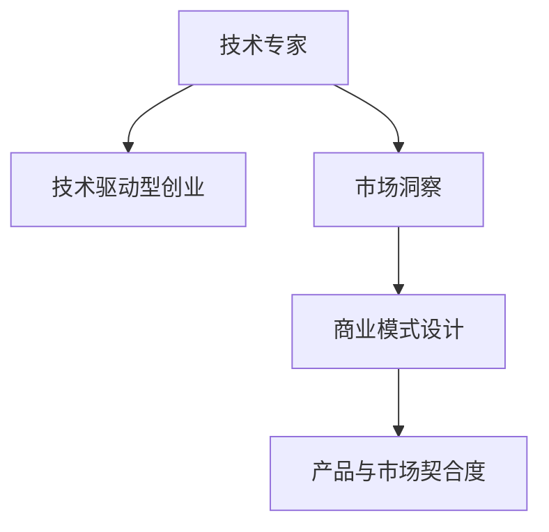

                 

# 从技术专家到知识创业者的转型之路

在快速变化的技术生态中，从技术专家转型为知识创业者，不仅需要掌握最新的技术趋势，还需具备深入的行业洞察力和系统化的商业思维。本文将探讨这一转型的核心要素，并分享一些实用的策略和工具，帮助技术专家成功转型为知识创业者。

## 1. 背景介绍

### 1.1 问题由来

随着技术的不断发展，许多技术专家面临着从传统技术岗位向知识创业转型的问题。这不仅是对个人职业发展的挑战，也是适应新技术浪潮和市场变化的需求。在这个过程中，如何保持技术领先，同时构建可持续发展的商业模式，成为不少人的困惑。

### 1.2 问题核心关键点

技术专家转型知识创业者的关键在于理解技术、行业和市场的相互作用，并能够将技术优势转化为商业价值。这一过程包括但不限于以下几个方面：

- 把握技术趋势，找到技术在现实世界中的应用点。
- 深入了解行业需求，洞察行业痛点。
- 构建商业模式，设计可持续发展的盈利模式。
- 打造产品和服务，满足客户需求。
- 团队管理和资源配置，保持高效运作。

### 1.3 问题研究意义

技术专家转型为知识创业者，能够将深度的技术理解和创新思维转化为实际的商业应用，为市场带来新的价值。这不仅能提升个人职业满意度，也有助于推动技术进步和行业发展，带来更广泛的社会效益。

## 2. 核心概念与联系

### 2.1 核心概念概述

为了更好地理解技术专家到知识创业者的转型过程，本节将介绍几个密切相关的核心概念：

- 技术专家：具备深厚的技术积累和创新能力，能够在特定技术领域提供深入专业解决方案的人。
- 知识创业者：利用专业知识和技术，创建商业化解决方案，通过创新产品和服务实现商业价值的人。
- 技术驱动型创业：以新技术为基础，开发具有高度创新性和竞争力的产品和服务，开拓市场的新型创业模式。
- 市场洞察：对行业现状、趋势、客户需求等进行分析，从而找到商业机会的能力。
- 商业模式设计：根据市场需求和技术优势，设计可持续发展的盈利模式，满足客户需求，实现价值最大化。
- 产品与市场契合度：产品或服务与目标市场需求的一致性和匹配度，是创业成功的关键。

这些核心概念之间的逻辑关系可以通过以下Mermaid流程图来展示：



这个流程图展示了一些核心概念之间的相互关系：

1. 技术专家通过技术驱动型创业，将技术优势转化为商业价值。
2. 市场洞察是发现商业机会的基础。
3. 商业模式设计是实现商业价值的路径。
4. 产品与市场契合度是商业成功的关键。

这些概念共同构成了技术专家向知识创业者转型的框架，使得技术优势和商业思维相结合，带来实际的市场效益。

## 3. 核心算法原理 & 具体操作步骤

### 3.1 算法原理概述

技术专家转型为知识创业者的过程中，涉及到的核心算法原理包括但不限于：

- 需求分析与用户画像构建：通过市场调研和数据分析，了解用户需求，构建用户画像。
- 技术可行性分析：评估新技术在产品开发中的可行性和成本效益。
- 商业模式创新：结合市场需求和技术优势，设计创新的商业模式，实现价值最大化。
- 产品设计与迭代：基于用户反馈和技术发展，持续优化产品和服务。

### 3.2 算法步骤详解

#### 3.2.1 需求分析与用户画像构建

1. **市场调研**：
   - 收集市场数据和行业报告，了解市场需求和技术趋势。
   - 通过问卷调查、访谈等方式获取用户反馈。

2. **用户画像构建**：
   - 基于调研数据，分析用户特征、行为和需求。
   - 构建用户画像，包括用户基本特征、使用习惯、痛点和需求等。

#### 3.2.2 技术可行性分析

1. **技术评估**：
   - 评估新技术的成熟度、成本和实施难度。
   - 分析技术的潜力和未来发展方向。

2. **技术路线图**：
   - 制定技术实施计划，确定关键技术节点和时间表。
   - 建立技术团队，进行技术研发和迭代。

#### 3.2.3 商业模式创新

1. **价值主张**：
   - 确定产品的核心价值，明确产品如何解决用户痛点。
   - 基于用户画像和技术优势，设计差异化的价值主张。

2. **盈利模式**：
   - 设计可持续的盈利模式，如订阅制、广告、增值服务等。
   - 考虑多渠道盈利，如B2B、B2C、SaaS等。

3. **定价策略**：
   - 基于市场竞争和技术壁垒，制定合理的价格策略。
   - 考虑价值、成本和客户支付意愿等因素。

#### 3.2.4 产品设计与迭代

1. **MVP构建**：
   - 设计最小可行产品（MVP），验证核心价值和市场需求。
   - 通过快速迭代，不断优化产品功能和服务体验。

2. **用户反馈收集**：
   - 建立用户反馈机制，及时收集用户意见和建议。
   - 分析用户反馈，指导产品迭代和优化。

3. **市场推广**：
   - 制定市场推广策略，通过多种渠道吸引用户。
   - 进行市场教育，提高产品认知度和用户转化率。

### 3.3 算法优缺点

#### 3.3.1 优点

1. **技术优势**：
   - 技术专家具备丰富的技术积累和创新能力，可以快速实现技术落地。
   - 技术驱动型创业能够带来更高效、更可靠的产品和服务。

2. **市场洞察力**：
   - 通过深入的市场调研和用户分析，能够准确把握市场需求和痛点。
   - 构建精准的用户画像，更好地满足用户需求。

3. **商业模式创新**：
   - 结合技术优势和市场需求，设计具有竞争力的商业模式。
   - 多渠道盈利策略能够最大化商业价值。

#### 3.3.2 缺点

1. **市场风险**：
   - 市场调研和需求分析需要大量的资源和时间投入，存在市场风险。
   - 新技术的快速变化和不确定性也可能带来风险。

2. **资源需求**：
   - 产品开发和市场推广需要大量的资金和人力资源。
   - 技术研发和市场验证需要持续的投入和迭代。

3. **商业执行难度**：
   - 技术专家可能缺乏全面的商业思维和运营管理能力。
   - 商业模式设计和市场推广需要经验丰富的商业团队。

### 3.4 算法应用领域

技术专家转型为知识创业者的方法和工具在多个领域中得到了广泛应用，包括但不限于：

- **医疗科技**：开发智能诊断工具、健康管理平台等，满足日益增长的健康需求。
- **金融科技**：构建智能投顾、风险管理、区块链等解决方案，推动金融创新。
- **教育科技**：打造在线教育平台、智能辅导系统，提高教育质量和效率。
- **智能制造**：开发工业互联网平台、智能生产系统，推动制造业数字化转型。
- **环保科技**：开发智能监控、数据分析系统，解决环境污染和资源浪费问题。
- **智慧城市**：构建智慧交通、能源管理、城市治理等解决方案，提升城市运行效率。

这些领域都是技术专家向知识创业者转型的典型应用场景，通过技术优势和商业思维的结合，带来深刻的社会影响和经济效益。

## 4. 数学模型和公式 & 详细讲解 & 举例说明

### 4.1 数学模型构建

技术专家转型知识创业者的过程中，涉及的数学模型和公式主要围绕需求分析、用户画像构建、技术可行性评估、商业模式设计和产品设计与迭代等环节。以下是一些核心模型的简要描述：

#### 4.1.1 用户画像模型

用户画像模型主要包括以下几个维度：

- **人口统计特征**：年龄、性别、职业等基本特征。
- **行为特征**：使用习惯、购买频率、互动方式等。
- **心理特征**：需求动机、价值观、偏好等。

用户画像的构建可以通过聚类分析、分类算法等方法实现。例如，使用K-means聚类算法，将用户分为不同类型，并描述其特征和需求。

#### 4.1.2 技术可行性评估模型

技术可行性评估模型主要包括以下几个方面：

- **技术成熟度**：评估技术在实际应用中的成熟度和可靠性。
- **成本效益**：评估技术实施的成本和预期收益。
- **竞争分析**：分析技术在市场上的竞争优势和劣势。

技术可行性评估可以通过SWOT分析、成本效益分析等方法实现。例如，使用SWOT分析，评估技术的优势、劣势、机会和威胁。

#### 4.1.3 商业模式设计模型

商业模式设计模型主要包括以下几个方面：

- **价值主张**：明确产品的核心价值和用户痛点解决方案。
- **盈利模式**：设计可持续的盈利策略，如订阅制、广告、增值服务等。
- **用户路径**：描述用户从获取到使用的全过程。

商业模式设计可以通过业务模型画布、价值链分析等方法实现。例如，使用业务模型画布，从收入来源、关键资源、关键活动、客户群体、客户关系、渠道、客户价值主张等角度描述商业模式。

#### 4.1.4 产品设计与迭代模型

产品设计与迭代模型主要包括以下几个方面：

- **MVP设计**：设计最小可行产品，验证核心价值和市场需求。
- **用户反馈收集**：通过用户反馈迭代优化产品。
- **市场推广**：制定市场推广策略，提高产品认知度和用户转化率。

产品设计与迭代可以通过迭代开发模型、用户需求反馈模型等方法实现。例如，使用迭代开发模型，通过快速迭代，不断优化产品功能和用户体验。

### 4.2 公式推导过程

#### 4.2.1 用户画像构建公式

用户画像构建公式可以通过K-means聚类算法实现：

\[
\theta_k = \arg\min_{\theta_k} \sum_{i=1}^N (\theta_k - x_i)^2
\]

其中，$\theta_k$ 表示第 $k$ 个聚类中心，$x_i$ 表示第 $i$ 个用户数据点。

#### 4.2.2 技术可行性评估公式

技术可行性评估公式可以通过SWOT分析实现：

\[
S = \frac{S_+ + S_+}{S_+ + S_- + W_+ + W_- + T_+ + T_-}
\]

其中，$S_+$ 表示技术优势，$S_-$ 表示技术劣势，$W_+$ 表示市场机会，$W_-$ 表示市场威胁，$T_+$ 表示技术机会，$T_-$ 表示技术威胁。

#### 4.2.3 商业模式设计公式

商业模式设计公式可以通过业务模型画布实现：

\[
M = \frac{R_1 + R_2 + R_3 + \cdots + R_n}{C_1 + C_2 + C_3 + \cdots + C_n}
\]

其中，$M$ 表示商业模式，$R$ 表示收入来源，$C$ 表示成本。

#### 4.2.4 产品设计与迭代公式

产品设计与迭代公式可以通过迭代开发模型实现：

\[
V_k = V_{k-1} + \alpha (R_k - V_{k-1})
\]

其中，$V_k$ 表示第 $k$ 次迭代后的产品价值，$\alpha$ 表示学习率，$R_k$ 表示第 $k$ 次迭代后的用户反馈。

### 4.3 案例分析与讲解

#### 4.3.1 案例1：智能医疗诊断平台

某医疗科技公司通过技术专家转型为知识创业者，开发智能医疗诊断平台。技术专家团队利用机器学习和深度学习技术，构建了智能诊断模型，能够根据患者的症状和历史数据，提供初步诊断建议。公司通过市场调研和用户画像分析，确定了目标用户群体，并设计了多渠道盈利模式，包括医疗服务订阅、数据分析服务、个性化健康管理等。通过快速迭代和用户反馈收集，不断优化产品功能和用户体验，最终成功在市场上获得广泛认可。

#### 4.3.2 案例2：智能投顾平台

某金融科技公司通过技术专家转型为知识创业者，开发智能投顾平台。技术专家团队利用自然语言处理和数据分析技术，构建了智能投顾模型，能够根据用户的财务状况和投资偏好，提供个性化的投资建议。公司通过市场调研和用户画像分析，确定了目标用户群体，并设计了订阅制和增值服务两种盈利模式。通过用户反馈收集和市场推广，不断优化产品功能和用户体验，最终成功吸引了大量用户，成为市场领先的智能投顾平台。

## 5. 项目实践：代码实例和详细解释说明

### 5.1 开发环境搭建

在技术专家转型知识创业者的过程中，开发环境搭建是关键的一步。以下是使用Python进行PyTorch开发的环境配置流程：

1. 安装Anaconda：从官网下载并安装Anaconda，用于创建独立的Python环境。

2. 创建并激活虚拟环境：
```bash
conda create -n pytorch-env python=3.8 
conda activate pytorch-env
```

3. 安装PyTorch：根据CUDA版本，从官网获取对应的安装命令。例如：
```bash
conda install pytorch torchvision torchaudio cudatoolkit=11.1 -c pytorch -c conda-forge
```

4. 安装Transformers库：
```bash
pip install transformers
```

5. 安装各类工具包：
```bash
pip install numpy pandas scikit-learn matplotlib tqdm jupyter notebook ipython
```

完成上述步骤后，即可在`pytorch-env`环境中开始项目实践。

### 5.2 源代码详细实现

下面以智能医疗诊断平台为例，给出使用Transformers库对BERT模型进行微调的PyTorch代码实现。

首先，定义医疗诊断任务的数据处理函数：

```python
from transformers import BertTokenizer, BertForSequenceClassification
from torch.utils.data import Dataset, DataLoader
import torch

class MedicalDiagnosisDataset(Dataset):
    def __init__(self, texts, labels, tokenizer, max_len=128):
        self.texts = texts
        self.labels = labels
        self.tokenizer = tokenizer
        self.max_len = max_len
        
    def __len__(self):
        return len(self.texts)
    
    def __getitem__(self, item):
        text = self.texts[item]
        label = self.labels[item]
        
        encoding = self.tokenizer(text, return_tensors='pt', max_length=self.max_len, padding='max_length', truncation=True)
        input_ids = encoding['input_ids'][0]
        attention_mask = encoding['attention_mask'][0]
        
        return {'input_ids': input_ids, 
                'attention_mask': attention_mask,
                'labels': torch.tensor(label, dtype=torch.long)}
```

然后，定义模型和优化器：

```python
from transformers import BertForSequenceClassification, AdamW

model = BertForSequenceClassification.from_pretrained('bert-base-cased', num_labels=2) # 二分类任务

optimizer = AdamW(model.parameters(), lr=2e-5)
```

接着，定义训练和评估函数：

```python
from sklearn.metrics import accuracy_score

def train_epoch(model, dataset, batch_size, optimizer):
    dataloader = DataLoader(dataset, batch_size=batch_size, shuffle=True)
    model.train()
    epoch_loss = 0
    for batch in dataloader:
        input_ids = batch['input_ids'].to(device)
        attention_mask = batch['attention_mask'].to(device)
        labels = batch['labels'].to(device)
        model.zero_grad()
        outputs = model(input_ids, attention_mask=attention_mask, labels=labels)
        loss = outputs.loss
        epoch_loss += loss.item()
        loss.backward()
        optimizer.step()
    return epoch_loss / len(dataloader)

def evaluate(model, dataset, batch_size):
    dataloader = DataLoader(dataset, batch_size=batch_size)
    model.eval()
    preds, labels = [], []
    with torch.no_grad():
        for batch in dataloader:
            input_ids = batch['input_ids'].to(device)
            attention_mask = batch['attention_mask'].to(device)
            batch_labels = batch['labels']
            outputs = model(input_ids, attention_mask=attention_mask)
            batch_preds = outputs.logits.argmax(dim=1).to('cpu').tolist()
            batch_labels = batch_labels.to('cpu').tolist()
            for pred, label in zip(batch_preds, batch_labels):
                preds.append(pred)
                labels.append(label)
                
    print("Accuracy:", accuracy_score(labels, preds))
```

最后，启动训练流程并在测试集上评估：

```python
epochs = 5
batch_size = 16

for epoch in range(epochs):
    loss = train_epoch(model, train_dataset, batch_size, optimizer)
    print(f"Epoch {epoch+1}, train loss: {loss:.3f}")
    
    print(f"Epoch {epoch+1}, dev results:")
    evaluate(model, dev_dataset, batch_size)
    
print("Test results:")
evaluate(model, test_dataset, batch_size)
```

以上就是使用PyTorch对BERT进行医疗诊断任务微调的完整代码实现。可以看到，得益于Transformers库的强大封装，我们可以用相对简洁的代码完成BERT模型的加载和微调。

### 5.3 代码解读与分析

让我们再详细解读一下关键代码的实现细节：

**MedicalDiagnosisDataset类**：
- `__init__`方法：初始化文本、标签、分词器等关键组件。
- `__len__`方法：返回数据集的样本数量。
- `__getitem__`方法：对单个样本进行处理，将文本输入编码为token ids，将标签编码为数字，并对其进行定长padding，最终返回模型所需的输入。

**模型和优化器定义**：
- 使用BertForSequenceClassification构建二分类模型。
- 选择AdamW优化器，设置学习率为2e-5。

**训练和评估函数**：
- 使用PyTorch的DataLoader对数据集进行批次化加载，供模型训练和推理使用。
- 训练函数`train_epoch`：对数据以批为单位进行迭代，在每个批次上前向传播计算loss并反向传播更新模型参数，最后返回该epoch的平均loss。
- 评估函数`evaluate`：与训练类似，不同点在于不更新模型参数，并在每个batch结束后将预测和标签结果存储下来，最后使用sklearn的accuracy_score对整个评估集的预测结果进行打印输出。

**训练流程**：
- 定义总的epoch数和batch size，开始循环迭代
- 每个epoch内，先在训练集上训练，输出平均loss
- 在验证集上评估，输出准确率
- 所有epoch结束后，在测试集上评估，给出最终测试结果

可以看到，PyTorch配合Transformers库使得BERT微调的代码实现变得简洁高效。开发者可以将更多精力放在数据处理、模型改进等高层逻辑上，而不必过多关注底层的实现细节。

当然，工业级的系统实现还需考虑更多因素，如模型的保存和部署、超参数的自动搜索、更灵活的任务适配层等。但核心的微调范式基本与此类似。

## 6. 实际应用场景

### 6.1 智能客服系统

基于大语言模型微调的对话技术，可以广泛应用于智能客服系统的构建。传统客服往往需要配备大量人力，高峰期响应缓慢，且一致性和专业性难以保证。而使用微调后的对话模型，可以7x24小时不间断服务，快速响应客户咨询，用自然流畅的语言解答各类常见问题。

在技术实现上，可以收集企业内部的历史客服对话记录，将问题和最佳答复构建成监督数据，在此基础上对预训练对话模型进行微调。微调后的对话模型能够自动理解用户意图，匹配最合适的答案模板进行回复。对于客户提出的新问题，还可以接入检索系统实时搜索相关内容，动态组织生成回答。如此构建的智能客服系统，能大幅提升客户咨询体验和问题解决效率。

### 6.2 金融舆情监测

金融机构需要实时监测市场舆论动向，以便及时应对负面信息传播，规避金融风险。传统的人工监测方式成本高、效率低，难以应对网络时代海量信息爆发的挑战。基于大语言模型微调的文本分类和情感分析技术，为金融舆情监测提供了新的解决方案。

具体而言，可以收集金融领域相关的新闻、报道、评论等文本数据，并对其进行主题标注和情感标注。在此基础上对预训练语言模型进行微调，使其能够自动判断文本属于何种主题，情感倾向是正面、中性还是负面。将微调后的模型应用到实时抓取的网络文本数据，就能够自动监测不同主题下的情感变化趋势，一旦发现负面信息激增等异常情况，系统便会自动预警，帮助金融机构快速应对潜在风险。

### 6.3 个性化推荐系统

当前的推荐系统往往只依赖用户的历史行为数据进行物品推荐，无法深入理解用户的真实兴趣偏好。基于大语言模型微调技术，个性化推荐系统可以更好地挖掘用户行为背后的语义信息，从而提供更精准、多样的推荐内容。

在实践中，可以收集用户浏览、点击、评论、分享等行为数据，提取和用户交互的物品标题、描述、标签等文本内容。将文本内容作为模型输入，用户的后续行为（如是否点击、购买等）作为监督信号，在此基础上微调预训练语言模型。微调后的模型能够从文本内容中准确把握用户的兴趣点。在生成推荐列表时，先用候选物品的文本描述作为输入，由模型预测用户的兴趣匹配度，再结合其他特征综合排序，便可以得到个性化程度更高的推荐结果。

### 6.4 未来应用展望

随着大语言模型微调技术的发展，其在更多领域的应用前景将进一步拓展。

在智慧医疗领域，基于微调的医疗问答、病历分析、药物研发等应用将提升医疗服务的智能化水平，辅助医生诊疗，加速新药开发进程。

在智能教育领域，微调技术可应用于作业批改、学情分析、知识推荐等方面，因材施教，促进教育公平，提高教学质量。

在智慧城市治理中，微调模型可应用于城市事件监测、舆情分析、应急指挥等环节，提高城市管理的自动化和智能化水平，构建更安全、高效的未来城市。

此外，在企业生产、社会治理、文娱传媒等众多领域，基于大模型微调的人工智能应用也将不断涌现，为经济社会发展注入新的动力。相信随着技术的日益成熟，微调方法将成为人工智能落地应用的重要范式，推动人工智能技术向更广阔的领域加速渗透。

## 7. 工具和资源推荐

### 7.1 学习资源推荐

为了帮助开发者系统掌握大语言模型微调的理论基础和实践技巧，这里推荐一些优质的学习资源：

1. 《Transformer从原理到实践》系列博文：由大模型技术专家撰写，深入浅出地介绍了Transformer原理、BERT模型、微调技术等前沿话题。

2. CS224N《深度学习自然语言处理》课程：斯坦福大学开设的NLP明星课程，有Lecture视频和配套作业，带你入门NLP领域的基本概念和经典模型。

3. 《Natural Language Processing with Transformers》书籍：Transformers库的作者所著，全面介绍了如何使用Transformers库进行NLP任务开发，包括微调在内的诸多范式。

4. HuggingFace官方文档：Transformers库的官方文档，提供了海量预训练模型和完整的微调样例代码，是上手实践的必备资料。

5. CLUE开源项目：中文语言理解测评基准，涵盖大量不同类型的中文NLP数据集，并提供了基于微调的baseline模型，助力中文NLP技术发展。

通过对这些资源的学习实践，相信你一定能够快速掌握大语言模型微调的精髓，并用于解决实际的NLP问题。
###  7.2 开发工具推荐

高效的开发离不开优秀的工具支持。以下是几款用于大语言模型微调开发的常用工具：

1. PyTorch：基于Python的开源深度学习框架，灵活动态的计算图，适合快速迭代研究。大部分预训练语言模型都有PyTorch版本的实现。

2. TensorFlow：由Google主导开发的开源深度学习框架，生产部署方便，适合大规模工程应用。同样有丰富的预训练语言模型资源。

3. Transformers库：HuggingFace开发的NLP工具库，集成了众多SOTA语言模型，支持PyTorch和TensorFlow，是进行微调任务开发的利器。

4. Weights & Biases：模型训练的实验跟踪工具，可以记录和可视化模型训练过程中的各项指标，方便对比和调优。与主流深度学习框架无缝集成。

5. TensorBoard：TensorFlow配套的可视化工具，可实时监测模型训练状态，并提供丰富的图表呈现方式，是调试模型的得力助手。

6. Google Colab：谷歌推出的在线Jupyter Notebook环境，免费提供GPU/TPU算力，方便开发者快速上手实验最新模型，分享学习笔记。

合理利用这些工具，可以显著提升大语言模型微调任务的开发效率，加快创新迭代的步伐。

### 7.3 相关论文推荐

大语言模型和微调技术的发展源于学界的持续研究。以下是几篇奠基性的相关论文，推荐阅读：

1. Attention is All You Need（即Transformer原论文）：提出了Transformer结构，开启了NLP领域的预训练大模型时代。

2. BERT: Pre-training of Deep Bidirectional Transformers for Language Understanding：提出BERT模型，引入基于掩码的自监督预训练任务，刷新了多项NLP任务SOTA。

3. Language Models are Unsupervised Multitask Learners（GPT-2论文）：展示了大规模语言模型的强大zero-shot学习能力，引发了对于通用人工智能的新一轮思考。

4. Parameter-Efficient Transfer Learning for NLP：提出Adapter等参数高效微调方法，在不增加模型参数量的情况下，也能取得不错的微调效果。

5. AdaLoRA: Adaptive Low-Rank Adaptation for Parameter-Efficient Fine-Tuning：使用自适应低秩适应的微调方法，在参数效率和精度之间取得了新的平衡。

这些论文代表了大语言模型微调技术的发展脉络。通过学习这些前沿成果，可以帮助研究者把握学科前进方向，激发更多的创新灵感。

## 8. 总结：未来发展趋势与挑战

### 8.1 总结

本文对技术专家转型为知识创业者的过程进行了全面系统的介绍。首先阐述了技术专家转型知识创业者的背景和意义，明确了从技术思维转向商业思维的转变过程。其次，从原理到实践，详细讲解了需求分析、用户画像构建、技术可行性评估、商业模式设计和产品设计与迭代等核心步骤，给出了微调任务开发的完整代码实例。同时，本文还探讨了微调技术在智能客服、金融舆情、个性化推荐等多个行业领域的应用前景，展示了微调范式的巨大潜力。此外，本文精选了微调技术的各类学习资源，力求为读者提供全方位的技术指引。

通过本文的系统梳理，可以看到，技术专家转型为知识创业者不仅需要掌握最新的技术趋势，还需具备深入的行业洞察力和系统化的商业思维。从技术思维转向商业思维，是技术专家成功转型的关键。相信随着技术的日益成熟，微调方法将成为人工智能落地应用的重要范式，推动人工智能技术向更广阔的领域加速渗透。

### 8.2 未来发展趋势

展望未来，技术专家转型为知识创业者的发展趋势将呈现以下几个方向：

1. **技术融合创新**：技术专家将更多地运用跨领域技术，如AI、大数据、区块链等，进行创新创业。技术融合带来更强的市场竞争力和创新性。

2. **市场洞察深化**：技术专家将更加注重市场调研和用户画像分析，深入理解市场需求和用户痛点，设计更具针对性的解决方案。

3. **商业模式多样化**：技术专家将探索更多元化的盈利模式，如SaaS、B2B2C、按需付费等，实现更灵活的收入分配和客户关系管理。

4. **产品与服务迭代**：技术专家将持续优化产品功能和服务体验，通过用户反馈和市场数据，不断迭代改进，实现更高效的市场响应。

5. **团队与资源优化**：技术专家将注重团队建设和资源配置，建立高效的项目管理机制，提升团队协作和资源利用效率。

6. **伦理与合规管理**：技术专家将更加重视产品伦理和合规管理，确保技术应用的合法性、公正性和安全性。

### 8.3 面临的挑战

尽管技术专家转型为知识创业者的前景广阔，但在这一过程中，仍面临一些挑战：

1. **市场竞争激烈**：随着技术市场的快速发展，新兴创业企业层出不穷，技术专家需面对更激烈的市场竞争。

2. **资源与成本压力**：技术创业需要大量的资金和人力资源，初期投入较大，可能面临资金和成本压力。

3. **技术快速迭代**：技术市场变化迅速，技术专家需不断学习新技术，保持技术领先。

4. **商业思维培养**：技术专家需从技术思维转向商业思维，掌握市场洞察、商业模式设计等关键能力。

5. **风险管理**：技术创业存在市场和技术风险，需进行全面的风险评估和管理。

6. **合规与伦理问题**：技术应用可能涉及隐私、数据安全等合规问题，需遵循法律法规和伦理规范。

### 8.4 研究展望

未来的研究需要在以下几个方面继续深入：

1. **跨领域技术融合**：探索AI与大数据、区块链等技术的深度融合，拓展技术应用场景。

2. **市场需求挖掘**：深入挖掘用户需求和市场痛点，设计更具针对性的解决方案。

3. **商业模式创新**：探索更多元化的商业模式，实现更灵活的盈利和客户关系管理。

4. **产品迭代优化**：持续优化产品功能和服务体验，提升市场响应速度和客户满意度。

5. **团队建设与管理**：建立高效的团队建设和项目管理机制，提升团队协作和资源利用效率。

6. **合规与伦理管理**：加强产品伦理和合规管理，确保技术应用的合法性、公正性和安全性。

通过在以上几个方向的研究和探索，相信技术专家转型为知识创业者将能够克服更多挑战，实现从技术思维到商业思维的全面转变，成功构建具有市场竞争力的创新企业。

## 9. 附录：常见问题与解答

**Q1：技术专家转型为知识创业者需要哪些核心能力？**

A: 技术专家转型为知识创业者需要具备以下核心能力：

- **技术理解与创新**：掌握深度学习和自然语言处理等前沿技术，具备技术创新能力。
- **市场洞察与用户分析**：能够进行市场调研和用户画像分析，深入理解市场需求和用户痛点。
- **商业模式设计**：具备商业思维，能够设计可持续的商业模式，实现商业价值最大化。
- **产品设计与迭代**：具备产品设计能力和用户反馈处理能力，通过快速迭代优化产品。
- **团队管理与资源配置**：具备团队建设和资源配置能力，建立高效的项目管理机制。
- **风险管理与合规管理**：具备风险管理和合规管理能力，确保产品应用的合法性、公正性和安全性。

**Q2：技术专家转型为知识创业者的具体步骤有哪些？**

A: 技术专家转型为知识创业者的具体步骤如下：

1. **市场调研与需求分析**：进行市场调研和用户画像分析，确定目标用户和市场需求。
2. **技术可行性评估**：评估技术的成熟度和成本效益，确定技术实施计划。
3. **商业模式设计**：结合市场需求和技术优势，设计可持续的商业模式，确定盈利模式和定价策略。
4. **产品设计与开发**：设计最小可行产品（MVP），进行快速迭代优化。
5. **市场推广与用户反馈**：制定市场推广策略，通过用户反馈不断优化产品和服务。
6. **团队建设和资源配置**：建立高效的团队建设和项目管理机制，提升团队协作和资源利用效率。

**Q3：技术专家转型为知识创业者过程中需要注意哪些问题？**

A: 技术专家转型为知识创业者过程中需要注意以下问题：

- **市场调研的深度和广度**：进行全面的市场调研，深入理解市场需求和用户痛点。
- **技术评估的全面性**：评估技术的成熟度和成本效益，确保技术的可行性和可持续性。
- **商业模式的合理性**：设计可持续的商业模式，确保商业价值的实现。
- **产品的市场契合度**：确保产品与市场需求的契合度，提升用户满意度和市场竞争力。
- **团队建设的有效性**：建立高效的团队建设和项目管理机制，提升团队协作和资源利用效率。
- **风险管理的全面性**：进行全面的风险评估和管理，确保创业项目的稳健性。

**Q4：技术专家转型为知识创业者需要哪些工具和资源？**

A: 技术专家转型为知识创业者需要的工具和资源包括：

- **开发环境**：Python、PyTorch、TensorFlow等开发环境。
- **学习资源**：《Transformer从原理到实践》系列博文、CS224N《深度学习自然语言处理》课程、《Natural Language Processing with Transformers》书籍等学习资源。
- **开发工具**：Transformers库、Weights & Biases、TensorBoard等开发工具。
- **相关论文**：Attention is All You Need、BERT、Parameter-Efficient Transfer Learning for NLP等相关论文。

**Q5：技术专家转型为知识创业者面临的挑战有哪些？**

A: 技术专家转型为知识创业者面临的挑战包括：

- **市场竞争激烈**：面临新兴创业企业的激烈竞争。
- **资源与成本压力**：初期投入较大，可能面临资金和成本压力。
- **技术快速迭代**：需要不断学习新技术，保持技术领先。
- **商业思维培养**：需从技术思维转向商业思维，掌握市场洞察、商业模式设计等关键能力。
- **风险管理**：存在市场和技术风险，需进行全面的风险评估和管理。
- **合规与伦理问题**：需遵循法律法规和伦理规范，确保产品应用的合法性、公正性和安全性。

通过以上问题的解答，相信读者能够更好地理解技术专家转型为知识创业者的关键要素和具体步骤，以及在此过程中可能遇到的主要挑战和应对策略。希望这些内容能够为技术专家提供有益的指导和支持，帮助他们在新的领域实现更大的发展。

---

作者：禅与计算机程序设计艺术 / Zen and the Art of Computer Programming

