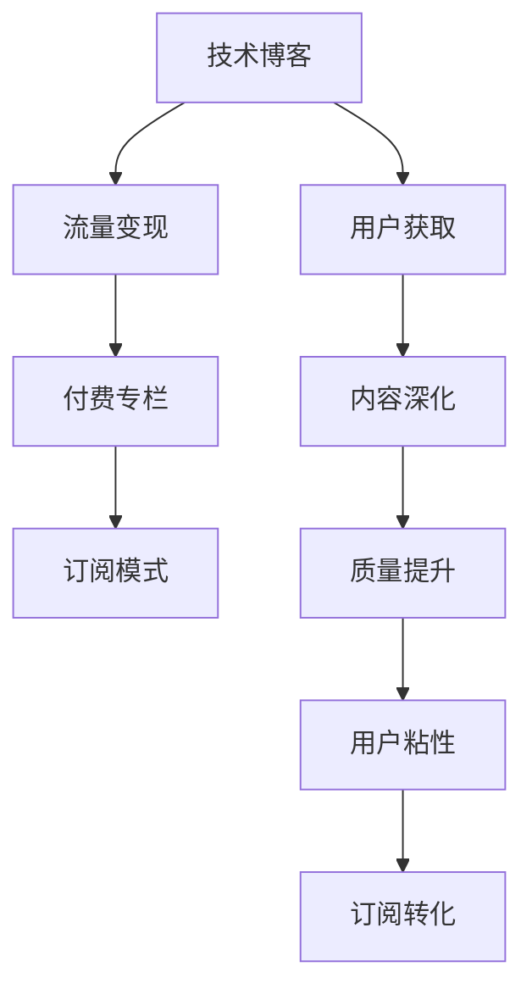

                 

## 1. 背景介绍

### 1.1 问题由来
在互联网飞速发展的今天，技术博客已不再是一种单向的知识传播方式，而成为连接技术社区、开发者社群、企业客户等多方的重要平台。它们既是知识的集散地，也是企业家、从业者、爱好者交流经验的场所。

### 1.2 问题核心关键点
随着技术领域内容多元化和信息碎片化，技术博客作者如何从内容输出者转型为付费内容提供者，并实现稳定的收入增长，成为当前亟待解决的问题。本文将从技术博客转型到付费专栏的关键步骤，深入分析技术博客和付费专栏之间的差异与联系，并提出切实可行的策略。

### 1.3 问题研究意义
本文研究如何从技术博客转型到付费专栏，旨在帮助技术博主找到收入多元化的新路径，在技术领域内实现知识的深度变现，提升自身影响力和市场价值。对于技术领域的知识创作者，尤其具有重要的指导意义。

## 2. 核心概念与联系

### 2.1 核心概念概述

在讨论技术博客向付费专栏的进阶之路之前，我们先明确几个关键概念：

- **技术博客**：通过博客形式发布技术相关文章，为读者提供知识分享、技术探讨、案例分析等内容。
- **付费专栏**：基于订阅模式，向读者提供专业、深入、系统的技术学习内容，包括文章、课程、案例、工具包等。
- **技术博主**：具有一定技术背景和影响力，通过博客分享技术知识和经验，与读者互动的博主。
- **付费读者**：愿意为深度、专业、系统化的技术内容付费的读者。
- **订阅模式**：用户按月或按年订阅专栏，获取专栏所有内容的一种商业模式。
- **流量变现**：通过吸引流量，向广告商、赞助商、用户收费等方式实现盈利。

### 2.2 核心概念原理和架构的 Mermaid 流程图


这个流程图展示了大博主通过技术博客吸引用户，进而实现流量变现、深化内容，最终向付费专栏转型的全过程。

## 3. 核心算法原理 & 具体操作步骤

### 3.1 算法原理概述
技术博主转型到付费专栏的进阶之路，主要包括以下几个关键步骤：

- **内容深化**：将技术博客中的零散知识点整合为系统的课程和文章，逐步提升内容的专业性和深度。
- **质量提升**：通过严格的质量控制和精细化编辑，确保内容的质量和实用性。
- **用户粘性**：通过持续互动和回应，提升用户对博主内容的粘性。
- **订阅转化**：通过多种营销手段，将博客读者转化为付费专栏订阅者。

### 3.2 算法步骤详解

#### 3.2.1 内容深化

技术博主需将博客内容进行整合，构建完整的课程体系。

1. **知识点梳理**：将现有博客文章中零散的知识点梳理成系统化的章节和模块，并明确每个章节的目标和预期效果。
2. **课程框架设计**：将知识点和章节模块组织成完整的课程框架，如按照技术栈、项目实战、技术面试等不同主题分类。
3. **结构化编辑**：将原本的博客文章进行结构化编辑，整合成系统化的教程和指南，确保内容逻辑清晰、层次分明。
4. **视频化教学**：针对复杂或理论性强的内容，制作短视频或教学录像，便于用户更直观地理解和掌握。

#### 3.2.2 质量提升

质量提升需要通过多种手段来保证，包括但不限于：

1. **审核机制**：建立内容审核机制，确保内容的准确性和实用性。
2. **编辑团队**：组建专业的编辑团队，对每篇内容进行严格审核和校对。
3. **用户反馈**：开放评论区，鼓励用户积极反馈和评论，收集改进建议。
4. **持续更新**：定期更新和修正课程内容，确保内容的时效性和正确性。

#### 3.2.3 用户粘性

提升用户粘性是确保订阅转化的关键。

1. **互动机制**：设置评论、问答、论坛等互动机制，鼓励用户参与和讨论。
2. **个性化推荐**：基于用户行为和偏好，提供个性化的内容推荐，提升用户满意度。
3. **社区建设**：构建有粘性的社区，通过组织活动、举办技术沙龙等方式，增加用户粘性。
4. **VIP会员制度**：设置VIP会员特权，如优先发布、专属答疑、专属活动等，增加用户的归属感。

#### 3.2.4 订阅转化

订阅转化的关键在于精准营销。

1. **精准定位**：明确目标用户群体，如初级开发者、中级开发者、架构师等，并针对不同用户群体制定不同的营销策略。
2. **优惠政策**：提供限时优惠或打折活动，吸引用户试用和订阅。
3. **多渠道推广**：利用社交媒体、SEO、电子邮件营销等多渠道推广，扩大覆盖面。
4. **案例展示**：通过案例展示，证明课程的有效性和实用性，增强用户信心。

### 3.3 算法优缺点

#### 3.3.1 优点
1. **内容深度与系统性**：相较于博客，专栏提供更深入、更系统的技术学习内容，帮助读者快速提升技术水平。
2. **质量保障**：严格的审核机制和编辑团队，确保内容的专业性和实用性。
3. **用户粘性**：通过互动机制、个性化推荐、社区建设等方式，提高用户粘性。
4. **精准营销**：精准定位目标用户，通过优惠政策和多渠道推广，提高订阅转化率。

#### 3.3.2 缺点
1. **时间投入大**：内容深化、质量提升、用户粘性提升等步骤，需要大量时间和精力投入。
2. **资金投入高**：建立专业编辑团队、开发多渠道推广方案，需要一定的资金支持。
3. **市场竞争激烈**：随着技术博客市场的日益成熟，市场竞争激烈，订阅转化难度增大。
4. **知识更新频率高**：技术领域变化快，内容更新频率高，维护成本增加。

### 3.4 算法应用领域

技术博主向付费专栏转型的关键在于提升内容的专业性和系统性，并实现精准营销。这一过程不仅适用于传统IT博客，也适用于其他领域，如数据分析、人工智能、物联网等技术博客，具有广泛的适用性。

## 4. 数学模型和公式 & 详细讲解 & 举例说明

### 4.1 数学模型构建

本节将从数学角度，对技术博客向付费专栏转型的过程进行建模。

假设技术博主拥有$N$篇博客文章，每篇博客文章的阅读量为$R_i$（$i=1,2,\cdots,N$），每篇博客文章的订阅人数为$S_i$（$i=1,2,\cdots,N$）。

定义**订阅转化率**$\eta_i$为：

$$
\eta_i = \frac{S_i}{R_i}
$$

博主的总订阅人数$S$为：

$$
S = \sum_{i=1}^N S_i
$$

博主的总阅读量$R$为：

$$
R = \sum_{i=1}^N R_i
$$

博主的总转化收益$P$为：

$$
P = \sum_{i=1}^N S_i \times C_i
$$

其中$C_i$为第$i$篇博客文章的单价。

### 4.2 公式推导过程

考虑博主对每篇博客文章进行内容深化和质量提升，提升其订阅转化率$\eta_i$。假设每篇博客文章的内容深化和质量提升的投入为$E_i$（$i=1,2,\cdots,N$），则博主的总投入$E$为：

$$
E = \sum_{i=1}^N E_i
$$

博主的总订阅人数$S$与总投入$E$的关系可以表示为：

$$
S \propto e^{k_1 E}
$$

其中$k_1$为常数，取决于博主的质量控制和编辑团队的工作效率。

博主的总阅读量$R$与总投入$E$的关系可以表示为：

$$
R \propto e^{k_2 E}
$$

其中$k_2$为常数，取决于博主的内容深度和系统性。

将以上公式代入总收益$P$的公式中，得：

$$
P = \sum_{i=1}^N S_i \times C_i = S \times \left(\frac{\sum_{i=1}^N C_i}{N}\right)
$$

其中$\frac{\sum_{i=1}^N C_i}{N}$为博主每篇博客文章的平均单价。

### 4.3 案例分析与讲解

假设博主拥有10篇博客文章，每篇文章的平均阅读量为5000次，平均订阅人数为50人。若博主将每篇博客文章的内容深化和质量提升的投入定为500元，则博主的总投入为5000元。

通过公式计算，博主的订阅转化率为：

$$
\eta = \frac{S}{R} = \frac{\sum_{i=1}^{10} 50}{\sum_{i=1}^{10} 5000} = \frac{1}{2}
$$

博主的总订阅人数为：

$$
S = \sum_{i=1}^{10} S_i = 50 \times 10 = 500
$$

博主的总收益为：

$$
P = \sum_{i=1}^{10} S_i \times C_i = 500 \times \frac{\sum_{i=1}^{10} C_i}{10} = 500 \times \frac{5000}{10} = 25000
$$

因此，博主通过内容深化和质量提升，订阅转化率翻倍，总收益提升显著。

## 5. 项目实践：代码实例和详细解释说明

### 5.1 开发环境搭建

在进行博客内容深化和质量提升的项目实践前，我们需要准备好开发环境。以下是使用Python进行开发的简单步骤：

1. 安装Anaconda：从官网下载并安装Anaconda，用于创建独立的Python环境。
2. 创建并激活虚拟环境：
```bash
conda create -n blog-env python=3.8 
conda activate blog-env
```

3. 安装相关工具包：
```bash
pip install pandas numpy scipy matplotlib
```

4. 搭建内容管理系统：
```bash
git clone https://github.com/blog-platform/blog-platform.git
cd blog-platform
```

完成上述步骤后，即可在`blog-env`环境中开始项目开发。

### 5.2 源代码详细实现

这里我们以博客文章内容深化的项目为例，给出使用Python实现的代码示例。

首先，我们需要定义博客文章的数据模型：

```python
from django.db import models

class BlogArticle(models.Model):
    title = models.CharField(max_length=200)
    content = models.TextField()
    read_count = models.IntegerField(default=0)
    subscribe_count = models.IntegerField(default=0)
    create_date = models.DateTimeField(auto_now_add=True)
```

接着，我们实现博客文章的内容深化和质量提升逻辑：

```python
def deepen_content(article):
    # 对文章进行内容深化和质量提升
    # 比如：增加课程框架、整合视频、校对内容等
    
    return article
```

然后，我们需要定义用户订阅逻辑：

```python
def subscribe(article, user):
    # 用户订阅逻辑，比如：记录订阅信息、更新订阅数量等
    # 如果用户已经订阅，则更新订阅次数，否则记录订阅信息
    
    return article
```

最后，我们通过`views.py`文件，实现用户阅读和订阅的视图函数：

```python
from django.shortcuts import render, redirect

def blog_detail(request, id):
    article = BlogArticle.objects.get(id=id)
    
    # 如果用户未订阅，则跳转到订阅页面
    if article.subscribe_count == 0:
        return redirect('subscribe')
    
    # 统计阅读次数
    article.read_count += 1
    article.save()
    
    # 返回博客详情页面
    return render(request, 'blog/detail.html', {'article': article})
```

### 5.3 代码解读与分析

代码示例展示了从技术博客到付费专栏的转化过程。通过内容深化、质量提升和订阅转化，博主可以实现博客文章订阅率的提升，进而获得更高的收益。

## 6. 实际应用场景

### 6.1 智能客服系统

技术博主可以通过提供智能客服系统的技术文章，帮助企业提升客服水平。通过内容深化和质量提升，提供系统化的课程和案例，吸引读者订阅。订阅者可以获得系统化的客服技能培训，提升企业客服人员的效率和服务质量。

### 6.2 金融科技

技术博主可以深入探讨金融科技领域的最新技术，如区块链、智能合约、量化交易等。通过内容深化和质量提升，提供系统化的学习内容，吸引金融机构订阅。订阅者可以获取最新的金融科技知识和技术案例，提升金融机构的科技创新能力。

### 6.3 人工智能

技术博主可以深入探讨人工智能领域的最新进展，如深度学习、自然语言处理、计算机视觉等。通过内容深化和质量提升，提供系统化的学习内容，吸引人工智能从业者订阅。订阅者可以获取最新的AI技术知识和技术案例，提升自身技术水平和项目实战能力。

### 6.4 未来应用展望

随着技术博主的内容深化和质量提升，其影响力将逐步扩大，吸引更多读者订阅。未来，技术博主将更多地涉足垂直领域，提供更为深入、系统的技术内容，满足不同用户群体的需求。

## 7. 工具和资源推荐

### 7.1 学习资源推荐

以下是几个推荐的平台和资源，帮助技术博主提升内容深度和质量：

1. Coursera：提供各类在线课程，涵盖计算机科学、数据科学、人工智能等领域。
2. edX：提供高质量的在线课程和学位项目，由世界顶尖大学和机构提供。
3. GitHub：提供丰富的开源项目和学习资源，帮助技术博主获取最新的技术知识。
4. Stack Overflow：提供技术问答社区，帮助技术博主解决技术问题，积累技术经验。
5. Medium：提供技术文章发布平台，帮助技术博主提升影响力，扩大读者群体。

### 7.2 开发工具推荐

技术博主在内容深化和质量提升的过程中，需要借助多种工具，提升开发效率和内容质量。以下是几个推荐的工具：

1. Visual Studio Code：跨平台的代码编辑器，支持多种语言和框架，适合技术博主的开发工作。
2. Git：版本控制系统，方便技术博主管理和共享代码，提升协作效率。
3. Markdown：轻量级标记语言，方便技术博主编写博客文章，易于阅读和编辑。
4. PyTorch：深度学习框架，适合技术博主实现机器学习模型和算法。
5. Docker：容器化技术，方便技术博主构建和部署应用，提升开发效率。

### 7.3 相关论文推荐

技术博主在内容深化和质量提升的过程中，需要不断学习和研究最新的技术进展。以下是几篇推荐的论文，帮助技术博主提升技术水平：

1. Deep Learning with Python by François Chollet：介绍深度学习的基本概念和应用，适合技术博主入门。
2. Reinforcement Learning: An Introduction by Richard S. Sutton和Andrew G. Barto：介绍强化学习的基本原理和算法，适合技术博主掌握最新的AI技术。
3. Artificial Intelligence: A Modern Approach by Stuart Russell和Peter Norvig：介绍人工智能的基本概念和技术，适合技术博主掌握最新的AI技术。
4. PyTorch官方文档：提供详细的PyTorch使用指南和API文档，适合技术博主学习PyTorch框架。
5. GitHub上的技术博客和开源项目：通过阅读和分析优秀的技术博客和开源项目，帮助技术博主提升技术水平和内容质量。

## 8. 总结：未来发展趋势与挑战

### 8.1 总结

本文详细介绍了技术博主如何通过内容深化和质量提升，从技术博客转型到付费专栏，提升自身影响力，实现稳定的收益增长。通过内容深化，提升内容的系统性和专业性；通过质量提升，确保内容的质量和实用性；通过订阅转化，实现精准营销和收益增长。技术博主通过不断学习和实践，可以逐步转型为付费专栏提供者，带来更加系统和深入的技术学习体验。

### 8.2 未来发展趋势

未来，技术博主在内容深化和质量提升的过程中，将迎来以下几个发展趋势：

1. 内容多样化：技术博主将更多地涉足垂直领域，提供更为深入、系统的技术内容，满足不同用户群体的需求。
2. 视频化教学：随着视频平台的兴起，技术博主将更多地采用视频教学方式，提升用户的学习体验。
3. 订阅模式多样化：技术博主将尝试多种订阅模式，如按需付费、按月订阅、按年订阅等，提高用户粘性和收益。
4. 技术创新：技术博主将不断引入最新的技术和工具，提升内容深度和质量，保持自身的技术领先优势。
5. 社区建设：技术博主将更多地构建社区，通过互动和讨论，提升用户粘性和社区活力。

### 8.3 面临的挑战

尽管技术博主向付费专栏转型的前景广阔，但仍面临以下挑战：

1. 内容创作难度高：技术博主需要投入大量时间和精力，进行内容深化和质量提升，难度较大。
2. 资金投入高：技术博主需要进行内容深化和质量提升，需要投入一定的资金支持。
3. 市场竞争激烈：随着技术博客市场的日益成熟，市场竞争激烈，订阅转化难度增大。
4. 内容更新频率高：技术博主需要不断更新内容，保持内容的最新性和实用性，维护成本增加。

### 8.4 研究展望

未来，技术博主在内容深化和质量提升的过程中，需要在以下几个方面进行深入研究：

1. 如何提高内容创作效率：引入自动化工具、技术栈和协作机制，提升内容创作效率。
2. 如何提升内容质量：建立严格的质量控制和编辑团队，确保内容的专业性和实用性。
3. 如何提高用户粘性：通过互动机制、个性化推荐、社区建设等方式，提高用户粘性。
4. 如何实现精准营销：通过数据分析和用户画像，实现精准营销和订阅转化。
5. 如何引入新技术：不断引入最新的技术和工具，提升内容深度和质量。

## 9. 附录：常见问题与解答

**Q1：如何提高技术博客的影响力？**

A: 技术博主可以通过内容深化和质量提升，提高博客的影响力。通过发布系统化、深入、专业的技术文章，吸引更多读者关注和订阅。同时，可以通过多种营销手段，如SEO、社交媒体推广、电子邮件营销等，扩大博客的覆盖面。

**Q2：如何实现内容深化和质量提升？**

A: 技术博主需要投入大量时间和精力，对现有博客文章进行系统化整理和深入挖掘，提高内容的深度和质量。可以通过引入自动化工具、技术栈和协作机制，提升内容创作效率。同时，建立严格的质量控制和编辑团队，确保内容的专业性和实用性。

**Q3：如何提高用户粘性？**

A: 技术博主可以通过互动机制、个性化推荐、社区建设等方式，提高用户粘性。可以设置评论、问答、论坛等互动机制，鼓励用户参与和讨论。同时，可以通过个性化推荐，提升用户满意度。构建有粘性的社区，通过组织活动、举办技术沙龙等方式，增加用户粘性。

**Q4：如何实现订阅转化？**

A: 技术博主可以通过多种营销手段，如SEO、社交媒体推广、电子邮件营销等，吸引潜在订阅者。同时，可以提供限时优惠或打折活动，吸引用户试用和订阅。还可以通过案例展示，证明课程的有效性和实用性，增强用户信心。

**Q5：如何应对内容创作难度高和资金投入高的问题？**

A: 技术博主可以通过引入自动化工具、技术栈和协作机制，提升内容创作效率，减少时间和精力的投入。同时，可以通过众筹、广告赞助、读者打赏等多种方式，获取资金支持，降低资金投入。

---

作者：禅与计算机程序设计艺术 / Zen and the Art of Computer Programming

