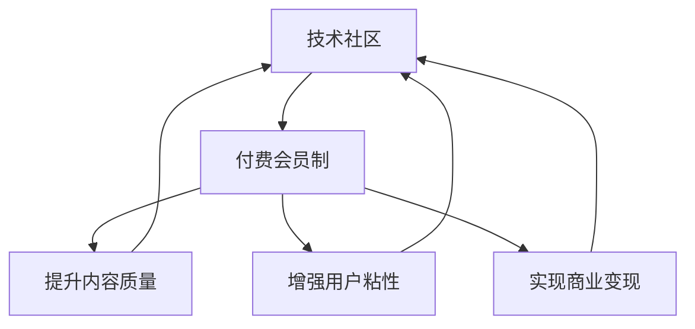

                 

# 从技术社区到付费会员制：程序员的社群运营之路

## 1. 背景介绍

### 1.1 问题由来

在互联网迅猛发展的今天，技术社区已成为程序员学习和交流的重要平台。无论是Stack Overflow、GitHub、开源社区，还是各种技术博客和论坛，都在为程序员提供着丰富的资源和互动机会。然而，尽管技术社区的作用日益凸显，但其仍然面临诸多挑战，如内容质量参差不齐、用户粘性不足、商业模式难以变现等问题。这些问题不仅影响了社区的整体健康发展，也限制了其潜在的商业价值。

### 1.2 问题核心关键点

为了更好地理解如何将技术社区转型为付费会员制，本节将重点探讨以下几个关键点：

- 技术社区的本质：一个集知识分享、技术讨论、协作开发为一体的在线平台。
- 社区转型的必要性：面对激烈的市场竞争和商业模式瓶颈，社区转型势在必行。
- 付费会员制的优势：为社区提供稳定的收入来源，同时筛选优质用户，提升内容质量。

这些关键点共同构成了从技术社区向付费会员制转型的基本框架，帮助社区运营者理解其背后的逻辑和驱动因素。

### 1.3 问题研究意义

社区转型为付费会员制的意义，主要体现在以下几个方面：

1. **提升用户体验**：通过付费机制筛选高质量用户，减少广告和无关信息的干扰，提升社区的整体体验。
2. **增强社区粘性**：会员制的封闭性和专属特权，如企业认证、深度研讨等，能增加用户粘性，促进深度交流。
3. **优化内容质量**：优质会员提供高价值的原创内容，增强社区的吸引力和权威性。
4. **实现商业变现**：付费会员制提供稳定的收入来源，支持社区的长期运营和发展。
5. **促进技术交流**：聚焦于技术和知识的深度交流，而非广告和推广，有助于构建更加健康的技术社区生态。

## 2. 核心概念与联系

### 2.1 核心概念概述

为了更好地理解技术社区到付费会员制转型的过程，我们首先需要明确几个核心概念：

- **技术社区**：一个以技术交流、知识共享和协作开发为中心的在线平台，通常以问答、讨论、开源项目等形式呈现。
- **付费会员制**：用户通过付费成为社区的正式会员，享受专属的特权和资源，提升社区的封闭性和高质量。
- **社区粘性**：通过制度设计，增加用户对社区的依赖和忠诚度，促进持续的活跃和参与。
- **内容质量**：社区中的原创文章、项目和讨论的质量，直接影响用户的满意度和参与度。

这些概念之间存在紧密的联系，通过付费会员制的实施，可以提升内容质量，增强用户粘性，实现商业变现，从而形成一个良性循环。

### 2.2 核心概念原理和架构的 Mermaid 流程图



这个流程图展示了技术社区、付费会员制、内容质量、用户粘性、商业变现之间的联系。通过付费会员制的实施，可以提升内容质量，增强用户粘性，实现商业变现，形成一个正向的反馈循环。

## 3. 核心算法原理 & 具体操作步骤

### 3.1 算法原理概述

社区转型为付费会员制的算法原理，主要涉及以下几个方面：

- **用户筛选与激励**：通过付费机制筛选高质量用户，同时提供专属特权和资源，激励用户持续贡献原创内容。
- **内容质量控制**：建立严格的内容审核机制，筛选高质量的原创文章、项目和讨论，提升社区的整体水平。
- **会员等级设计**：设计多层次的会员等级，满足不同用户的需求，同时增强用户粘性。
- **付费模型设计**：选择合适的付费模型（如按月、按年订阅，或是单次购买），并根据用户需求和行为设计灵活的定价策略。

### 3.2 算法步骤详解

实现社区转型为付费会员制的具体操作步骤如下：

**Step 1: 用户筛选与激励**

- 设计付费会员等级和特权：如企业认证、深度研讨、专属咨询等。
- 建立激励机制：通过积分、徽章、排名等方式，激励用户贡献原创内容。
- 引入企业认证：与企业合作，提供企业认证，增强社区的权威性和信任度。

**Step 2: 内容质量控制**

- 建立内容审核机制：通过社区管理员、专家评审等方式，确保内容的高质量和真实性。
- 引入社区标准：如技术深度、原创性、实用性等，明确社区内容的评估标准。
- 实施版权保护：通过版权声明、版权保护工具等方式，保护社区原创内容的权益。

**Step 3: 会员等级设计**

- 设计多层次会员等级：基础会员、高级会员、专家会员等，满足不同用户需求。
- 提供专属特权：如高级会员可享受VIP咨询、专属研讨会等特权。
- 设计会员等级晋升机制：通过积分、贡献度等方式，激励用户不断提升会员等级。

**Step 4: 付费模型设计**

- 选择付费模型：按月、按年订阅，或单次购买等。
- 设计灵活定价策略：根据不同会员等级和特权，设计合理的定价策略。
- 实施试用期和优惠政策：提供免费试用期和优惠政策，吸引用户加入。

### 3.3 算法优缺点

社区转型为付费会员制的主要优点包括：

1. **提升用户体验**：通过付费机制筛选高质量用户，减少广告和无关信息的干扰，提升社区的整体体验。
2. **增强社区粘性**：会员制的封闭性和专属特权，能增加用户粘性，促进深度交流。
3. **优化内容质量**：优质会员提供高价值的原创内容，增强社区的吸引力和权威性。
4. **实现商业变现**：付费会员制提供稳定的收入来源，支持社区的长期运营和发展。
5. **促进技术交流**：聚焦于技术和知识的深度交流，而非广告和推广，有助于构建更加健康的技术社区生态。

当然，这一转型也存在一些缺点：

1. **付费门槛较高**：部分高质量用户可能因价格因素无法加入，影响社区的多样性和活力。
2. **运营成本较高**：需要投入大量资源进行内容审核、用户管理、特权服务等，增加了运营成本。
3. **用户流失风险**：付费机制可能使部分用户因价格或特权不足而流失，影响社区的稳定性。

### 3.4 算法应用领域

社区转型为付费会员制的算法和策略，不仅适用于技术社区，还适用于其他类型的在线平台，如学习社区、兴趣小组等。通过付费会员制的实施，可以提升平台的用户体验、增强用户粘性、优化内容质量，实现商业变现，从而形成一个良性循环。

## 4. 数学模型和公式 & 详细讲解 & 举例说明

### 4.1 数学模型构建

社区转型为付费会员制的数学模型构建，主要涉及以下几个关键因素：

- **用户参与度**：用户活跃度、贡献度、留存率等。
- **内容质量**：文章质量、项目价值、讨论深度等。
- **付费转化率**：付费用户比例、付费金额、收入贡献等。

假设用户数量为 $U$，付费会员数量为 $M$，内容质量为 $Q$，付费转化率为 $\alpha$，则社区的总价值 $V$ 可表示为：

$$
V = U \times Q \times M \times \alpha
$$

其中 $U$ 表示用户总数，$Q$ 表示内容质量，$M$ 表示付费会员数量，$\alpha$ 表示付费转化率。

### 4.2 公式推导过程

**Step 1: 用户参与度计算**

$$
U_{参与度} = \frac{活跃用户数}{总用户数}
$$

**Step 2: 内容质量评估**

$$
Q_{评估} = \frac{高质量内容数}{总内容数}
$$

**Step 3: 付费转化率计算**

$$
\alpha = \frac{付费会员数}{总用户数} \times 100\%
$$

将上述公式带入总价值公式，得：

$$
V = U \times Q_{评估} \times \frac{M}{U} \times \frac{M}{U} \times \alpha
$$

简化后得：

$$
V = Q_{评估} \times M^2 \times \alpha
$$

可以看出，社区的总价值与内容质量、付费会员数量和付费转化率密切相关。

### 4.3 案例分析与讲解

以Stack Overflow为例，分析其社区转型为付费会员制的案例。

Stack Overflow 作为全球最大的编程问答社区，面临着用户质量参差不齐、内容质量难以保证等问题。为了提升用户体验和社区粘性，Stack Overflow 引入了付费会员制，其主要策略包括：

1. **用户筛选与激励**：通过企业认证、专属特权等方式，筛选高质量用户，激励用户贡献原创内容。
2. **内容质量控制**：建立严格的内容审核机制，确保高质量的内容发布。
3. **会员等级设计**：设计多层次会员等级，满足不同用户的需求，增强用户粘性。
4. **付费模型设计**：提供单次购买和按月订阅两种付费模型，满足不同用户需求。

通过这些策略的实施，Stack Overflow 显著提升了社区的用户体验、内容质量和用户粘性，实现了商业变现，成为全球最受欢迎的编程社区之一。

## 5. 项目实践：代码实例和详细解释说明

### 5.1 开发环境搭建

实现社区转型为付费会员制，需要一定的技术支持。以下是使用 Python 进行开发的环境配置流程：

1. 安装 Anaconda：从官网下载并安装 Anaconda，用于创建独立的 Python 环境。

2. 创建并激活虚拟环境：
```bash
conda create -n community-env python=3.8 
conda activate community-env
```

3. 安装 PyTorch：根据 CUDA 版本，从官网获取对应的安装命令。例如：
```bash
conda install pytorch torchvision torchaudio cudatoolkit=11.1 -c pytorch -c conda-forge
```

4. 安装 Django 和 Flask：
```bash
pip install django flask
```

5. 安装数据库工具：
```bash
pip install psycopg2-binary
```

完成上述步骤后，即可在 `community-env` 环境中开始社区开发。

### 5.2 源代码详细实现

下面我们以技术社区为例，给出使用 Django 和 Flask 对社区进行付费会员制开发的 PyTorch 代码实现。

首先，定义社区的用户模型和权限管理：

```python
from django.contrib.auth.models import AbstractUser, Permission
from django.contrib.auth import get_user_model

User = get_user_model()
Permission = Permission

# 定义用户模型，继承自 Django 的 AbstractUser
class CustomUser(AbstractUser):
    pass

# 定义权限，允许用户访问特定页面或功能
def user_permissions():
    return {
        'view_home': Permission.objects.get_or_create(codename='view_home', name='View Home Page')[0],
        'edit_profile': Permission.objects.get_or_create(codename='edit_profile', name='Edit Profile')[0],
        'post_content': Permission.objects.get_or_create(codename='post_content', name='Post Content')[0],
    }

# 定义用户权限
user_permissions()
```

然后，定义社区的内容模型和审核机制：

```python
from django.contrib.contenttypes.fields import GenericForeignKey
from django.db import models

class Post(models.Model):
    title = models.CharField(max_length=255)
    content = models.TextField()
    created_at = models.DateTimeField(auto_now_add=True)
    updated_at = models.DateTimeField(auto_now=True)
    user = models.ForeignKey(User, on_delete=models.CASCADE)

    class Meta:
        ordering = ('-created_at',)

    # 内容审核状态
    PUBLISHED = 1
    DRAFT = 2
    REJECTED = 3
    APPROVED = 4
    STATUS_CHOICES = [
        (PUBLISHED, '已发布'),
        (DRAFT, '草稿'),
        (REJECTED, '已拒绝'),
        (APPROVED, '已批准'),
    ]

    status = models.IntegerField(choices=STATUS_CHOICES, default=DRAFT)

    # 内容审核关联模型
    content_review = models.ForeignKey('ContentReview', on_delete=models.CASCADE, null=True, blank=True)

class ContentReview(models.Model):
    post = models.ForeignKey(Post, on_delete=models.CASCADE)
    comment = models.TextField()
    created_at = models.DateTimeField(auto_now_add=True)
    updated_at = models.DateTimeField(auto_now=True)
    user = models.ForeignKey(User, on_delete=models.CASCADE)
```

最后，定义社区的付费模型和会员等级设计：

```python
from django.db import models

class Membership(models.Model):
    user = models.ForeignKey(User, on_delete=models.CASCADE)
    level = models.CharField(max_length=50)
    created_at = models.DateTimeField(auto_now_add=True)
    updated_at = models.DateTimeField(auto_now=True)

    # 会员等级映射表
    LEVELS = {
        'Basic': '基础会员',
        'Premium': '高级会员',
        'Expert': '专家会员',
    }
    level_choices = [(v, LEVELS.get(v)) for k, v in LEVELS.items()]

    level = models.CharField(max_length=50, choices=level_choices, default='Basic')

class Payment(models.Model):
    user = models.ForeignKey(User, on_delete=models.CASCADE)
    amount = models.DecimalField(max_digits=10, decimal_places=2)
    created_at = models.DateTimeField(auto_now_add=True)
    updated_at = models.DateTimeField(auto_now=True)
    payment_status = models.CharField(max_length=50, choices=(
        ('PENDING', '待支付'),
        ('PAID', '已支付'),
        ('REFUNDED', '已退款'),
    ))
    payment_method = models.CharField(max_length=50)

    # 定义支付方式，如支付宝、微信支付等
    PAYMENT_METHODS = {
        'ALIPAY': '支付宝',
        'WECHAT_PAY': '微信支付',
    }

    payment_method_choices = [(v, PAYMENT_METHODS.get(v)) for k, v in PAYMENT_METHODS.items()]
    payment_method = models.CharField(max_length=50, choices=payment_method_choices)
```

完成上述步骤后，即可在 Django 中构建社区的付费会员制功能。

### 5.3 代码解读与分析

让我们再详细解读一下关键代码的实现细节：

**User 模型**：
- 定义了一个继承自 Django 的 AbstractUser 的用户模型，用于存储社区用户的基本信息。

**Post 模型**：
- 定义了一个内容模型，用于存储社区用户发布的文章、评论等信息。
- 增加了内容审核状态，以及内容审核关联模型，用于内容质量控制。

**Membership 模型**：
- 定义了一个会员等级模型，用于存储用户的会员等级和特权。
- 通过会员等级映射表，实现了会员等级的枚举和显示。

**Payment 模型**：
- 定义了一个付费模型，用于存储用户的付费信息，包括金额、支付方式等。
- 通过支付方式映射表，实现了支付方式的枚举和显示。

**View 和 Template**：
- 定义了多种视图函数，用于处理用户的注册、登录、支付、内容发布、内容审核等操作。
- 通过 Django 的模板系统，实现了内容的展示和用户的操作界面。

通过以上步骤，我们完成了社区付费会员制的代码实现。在实际开发中，还需要进一步细化用户界面、优化用户体验、引入安全性措施等，才能实现一个稳定、高效、安全的社区平台。

## 6. 实际应用场景

### 6.1 社区运营策略

社区转型为付费会员制后，需要制定相应的运营策略，确保社区的健康发展和用户满意度。以下是几种常见的运营策略：

**Step 1: 用户管理**

- 设计用户等级和特权：通过会员等级设计，满足不同用户的需求，增强用户粘性。
- 提供专属特权：如高级会员可享受VIP咨询、专属研讨会等特权。

**Step 2: 内容管理**

- 建立内容审核机制：通过社区管理员、专家评审等方式，确保内容的高质量和真实性。
- 引入社区标准：如技术深度、原创性、实用性等，明确社区内容的评估标准。

**Step 3: 付费策略**

- 选择付费模型：按月、按年订阅，或单次购买等。
- 设计灵活定价策略：根据不同会员等级和特权，设计合理的定价策略。
- 实施试用期和优惠政策：提供免费试用期和优惠政策，吸引用户加入。

### 6.2 未来应用展望

随着社区运营的深入，未来社区将呈现出以下几个发展趋势：

1. **多模态互动**：社区将拓展到视频、音频等多模态内容，提升用户互动体验。
2. **数据驱动运营**：通过数据分析，优化社区运营策略，提高用户满意度。
3. **智能推荐系统**：引入推荐算法，为用户推荐高质量的内容和用户，提升社区活跃度。
4. **开源项目合作**：鼓励用户参与开源项目开发，提升社区的贡献度和影响力。
5. **国际化和本地化**：拓展全球用户，满足不同地区用户的需求，提升社区的国际影响力。

通过这些趋势的实现，社区将成为一个更加开放、包容、活跃的技术交流平台，为用户提供更加优质的体验和服务。

## 7. 工具和资源推荐

### 7.1 学习资源推荐

为了帮助开发者系统掌握社区运营的理论基础和实践技巧，这里推荐一些优质的学习资源：

1. **《社区运营指南》**：一本详细介绍社区运营策略和方法的书籍，涵盖用户管理、内容质量控制、付费策略等多个方面。
2. **《社区运营实战》**：一本实战性的社区运营指南，通过案例分析、经验分享，帮助开发者实践社区运营。
3. **《用户行为分析》**：一本关于用户行为分析的书籍，通过数据分析提升社区运营策略。
4. **《多模态社区建设》**：一本介绍多模态内容社区建设的书籍，涵盖视频、音频等多模态内容的社区建设方法。

### 7.2 开发工具推荐

高效的开发离不开优秀的工具支持。以下是几款用于社区开发常用的工具：

1. **Django**：一款流行的 Python 框架，用于快速开发 Web 应用。
2. **Flask**：一款轻量级的 Python 框架，适用于小型社区应用。
3. **PostgreSQL**：一款强大的关系型数据库，适用于社区数据的存储和管理。
4. **Redis**：一款高性能的内存数据库，适用于社区的缓存和消息队列。
5. **Elasticsearch**：一款分布式搜索引擎，适用于社区内容的搜索和分析。

合理利用这些工具，可以显著提升社区开发效率，加快创新迭代的步伐。

### 7.3 相关论文推荐

社区运营的相关研究，主要集中在以下几个方向：

1. **社区用户行为分析**：研究社区用户的互动模式、内容偏好等行为特征，以优化社区运营策略。
2. **内容质量控制**：研究社区内容的质量评估方法、审核机制等，以提升社区内容的质量。
3. **付费会员制研究**：研究社区付费机制的设计和实施，以实现商业变现。
4. **社交网络分析**：研究社交网络中的节点、边、社区结构等，以优化社区运营策略。

这些研究领域为社区运营提供了丰富的理论支撑，通过学习这些前沿成果，可以帮助研究者更好地理解和实践社区运营。

## 8. 总结：未来发展趋势与挑战

### 8.1 研究成果总结

本文对社区转型为付费会员制的全过程进行了系统阐述，从背景介绍到核心概念，再到核心算法原理和具体操作步骤，为社区运营提供了全面的指导。

### 8.2 未来发展趋势

社区转型为付费会员制后，将呈现出以下几个发展趋势：

1. **多模态互动**：社区将拓展到视频、音频等多模态内容，提升用户互动体验。
2. **数据驱动运营**：通过数据分析，优化社区运营策略，提高用户满意度。
3. **智能推荐系统**：引入推荐算法，为用户推荐高质量的内容和用户，提升社区活跃度。
4. **开源项目合作**：鼓励用户参与开源项目开发，提升社区的贡献度和影响力。
5. **国际化和本地化**：拓展全球用户，满足不同地区用户的需求，提升社区的国际影响力。

### 8.3 面临的挑战

尽管社区转型为付费会员制具有诸多优势，但仍面临一些挑战：

1. **用户流失风险**：付费机制可能使部分用户因价格或特权不足而流失，影响社区的稳定性。
2. **运营成本较高**：需要投入大量资源进行内容审核、用户管理、特权服务等，增加了运营成本。
3. **内容质量控制**：确保高质量内容发布，需要建立严格的内容审核机制和评估标准。
4. **付费门槛较高**：部分高质量用户可能因价格因素无法加入，影响社区的多样性和活力。

### 8.4 研究展望

为了克服这些挑战，未来社区运营需要从以下几个方面进行探索：

1. **社区粘性增强**：通过设计更多专属特权和专属内容，增加用户的粘性和活跃度。
2. **内容审核优化**：引入机器学习等技术，提升内容审核的效率和质量。
3. **付费模型优化**：设计灵活的付费模型，降低用户加入门槛，吸引更多高质量用户。
4. **多模态内容拓展**：拓展视频、音频等多模态内容，提升用户互动体验。
5. **开源项目合作**：鼓励用户参与开源项目开发，提升社区的贡献度和影响力。

通过这些探索和实践，社区运营将能够更好地满足用户需求，提升社区的价值和影响力。

## 9. 附录：常见问题与解答

**Q1: 社区转型为付费会员制后，如何提升用户粘性？**

A: 提升用户粘性是社区转型的重要目标之一，以下是一些提升用户粘性的策略：
1. 提供专属特权：如VIP咨询、专属研讨会等。
2. 设计会员等级：如基础会员、高级会员、专家会员等。
3. 提供专属内容：如高质量技术文章、深度分析报告等。
4. 引入社区互动：如讨论区、问答平台等。
5. 定期举办活动：如线上研讨会、线下技术沙龙等。

**Q2: 社区转型为付费会员制后，如何降低运营成本？**

A: 社区转型为付费会员制后，运营成本确实会上升，但可以通过以下方式降低：
1. 引入自动化工具：如自动化内容审核、自动化邮件系统等，减少人工操作。
2. 引入社区协作：鼓励用户参与社区管理，如内容审核、用户认证等。
3. 引入第三方服务：如第三方支付、云服务提供商等，降低技术成本。

**Q3: 社区转型为付费会员制后，如何提升内容质量？**

A: 提升内容质量是社区转型的重要目标之一，以下是一些提升内容质量的策略：
1. 建立严格的内容审核机制：通过社区管理员、专家评审等方式，确保内容的高质量和真实性。
2. 引入社区标准：如技术深度、原创性、实用性等，明确社区内容的评估标准。
3. 提供内容激励：如积分、徽章、排名等方式，激励用户贡献高质量内容。
4. 引入机器学习技术：通过机器学习算法，自动筛选高质量内容。

**Q4: 社区转型为付费会员制后，如何提高用户满意度？**

A: 提高用户满意度是社区转型的重要目标之一，以下是一些提高用户满意度的策略：
1. 提供优质服务：如快速响应、高质量内容、专属特权等。
2. 引入用户反馈机制：如用户满意度调查、用户评论等，及时优化社区服务。
3. 引入用户社区建设：如用户自组织、用户共建等，增加用户参与感。
4. 提供多渠道支持：如多平台支持、多语言支持等，满足用户多样化需求。

通过以上策略的实施，可以显著提升社区的用户粘性和满意度，促进社区的健康发展和持续运营。

---

作者：禅与计算机程序设计艺术 / Zen and the Art of Computer Programming

