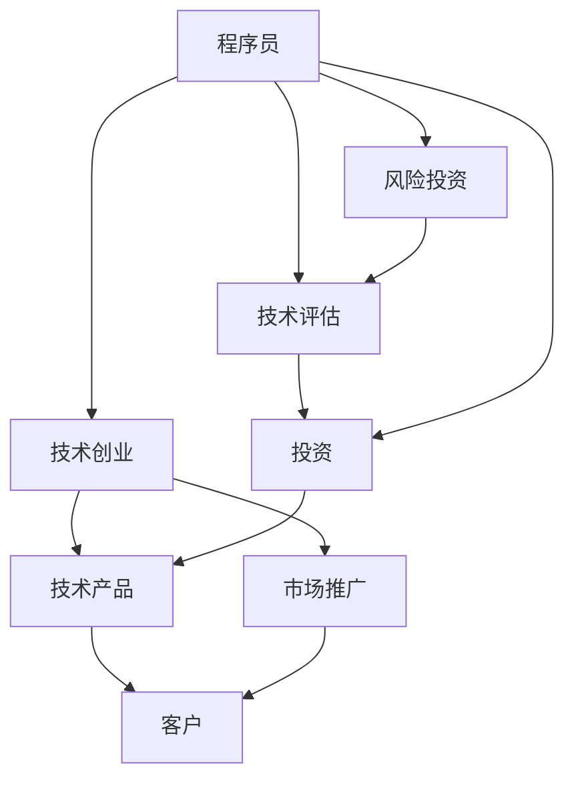

                 

# 从程序员到天使投资人的转变

> 关键词：人工智能,投资,技术,风险,创新,市场分析

## 1. 背景介绍

作为一名程序员，我们通常专注于解决技术问题，优化系统性能，编写高效的代码。然而，随着技术的发展，尤其是人工智能技术的兴起，我们面临的挑战和机遇也在不断变化。在这个过程中，许多技术专家转变为企业家、风险投资家，甚至成为行业领袖。本文将探讨从程序员到天使投资人的转变，涵盖从技术视角到商业视角的关键转变点，以及如何在这个过程中寻找投资机会。

## 2. 核心概念与联系

### 2.1 核心概念概述

在讨论从程序员到天使投资人的转变时，我们需要理解几个核心概念：

- **程序员**：专注于编写代码、解决技术问题、优化系统性能的工程师。
- **技术创业**：利用技术创新解决实际问题，创造商业价值的过程。
- **风险投资**：为初创企业提供资金支持，以期获取高回报的投资行为。
- **天使投资人**：为初创企业提供早期资金和指导，推动其成长的天使投资者。

这些概念之间的联系体现在技术创业者和风险投资人共同推动了技术的商业化进程，而天使投资人为这些创业者提供了必要的资本和资源支持。

### 2.2 核心概念原理和架构的 Mermaid 流程图



这个流程图展示了程序员如何通过技术创业将技术产品推向市场，以及风险投资如何在早期为这些创业企业提供支持的过程。

## 3. 核心算法原理 & 具体操作步骤

### 3.1 算法原理概述

从程序员到天使投资人的转变，本质上是一种从技术视角到商业视角的转变。这种转变不仅涉及对技术创新的理解，还需要对市场需求、商业模型、资金运作等商业要素有深入的理解。

### 3.2 算法步骤详解

1. **技术评估**：评估一项技术的潜力，包括技术成熟度、市场应用前景、竞争优势等。
   
2. **市场分析**：通过市场调研，了解目标市场的规模、增长潜力、客户需求等。

3. **商业模型构建**：基于技术评估和市场分析，设计可行的商业模式，如SaaS、B2B、B2C等。

4. **资金筹集**：通过天使投资人或风险投资机构获取启动资金，用于产品开发、市场推广等。

5. **产品开发**：利用技术优势，开发核心产品，并不断迭代优化。

6. **市场推广**：通过营销、广告、公关等手段，推广产品，获取客户。

7. **投资回报**：通过实现商业目标，如收入增长、市场份额提升等，获取投资回报。

### 3.3 算法优缺点

#### 优点：
- **技术优势**：利用技术创新获得市场优势。
- **资本支持**：风险投资和天使投资提供资金支持，加速产品发展。
- **市场洞察**：通过市场分析，把握市场需求和趋势。

#### 缺点：
- **商业风险**：技术创新不一定能成功转化为商业价值。
- **资金压力**：获取投资需要让步，可能失去一定的技术控制权。
- **市场不确定性**：市场需求和竞争环境变化迅速，难以预测。

### 3.4 算法应用领域

从程序员到天使投资人的转变适用于任何基于技术创新的创业场景，包括但不限于以下领域：

- **人工智能**：利用AI技术解决实际问题，如图像识别、自然语言处理、机器学习等。
- **大数据**：通过大数据分析，提供商业洞察，如客户行为分析、市场趋势预测等。
- **区块链**：利用区块链技术，提升数据安全、透明性和信任度，如智能合约、去中心化应用等。
- **物联网**：通过物联网技术，实现设备互联和自动化，如智慧城市、智能家居等。

## 4. 数学模型和公式 & 详细讲解 & 举例说明

### 4.1 数学模型构建

为了评估技术产品的商业潜力，我们可以构建一个简单的数学模型，来预测项目的投资回报率（ROI）：

$$
\text{ROI} = \frac{\text{净收益}}{\text{投资成本}}
$$

其中，净收益为项目产生的总收入减去总成本后的剩余金额，投资成本包括资金投入、人力成本等。

### 4.2 公式推导过程

假设项目预期生命周期为 $T$ 年，每年收入为 $I$，成本为 $C$，则净收益 $P$ 为：

$$
P = \sum_{t=1}^{T} (I_t - C_t)
$$

投资成本 $K$ 包括初始资金 $K_0$ 和运营成本 $K_1$，则ROI为：

$$
\text{ROI} = \frac{\sum_{t=1}^{T} (I_t - C_t)}{K_0 + K_1}
$$

通过这个模型，我们可以评估一个项目的投资回报率，并据此决定是否进行投资。

### 4.3 案例分析与讲解

假设我们正在评估一项基于深度学习技术的图像识别系统。我们预计该项目将在5年内产生每年500万美元的收入，而每年固定成本为300万美元，运营成本为200万美元。项目初始资金需求为1000万美元。

根据上述模型，计算ROI如下：

$$
\text{ROI} = \frac{5 \times (500 - 300 - 200)}{1000} = \frac{500}{1000} = 0.5
$$

这个ROI值表明，如果项目成功实施，预计在5年内可以获得50%的回报。

## 5. 项目实践：代码实例和详细解释说明

### 5.1 开发环境搭建

为了进行项目实践，我们需要准备以下开发环境：

1. **编程语言**：Python。
2. **开发框架**：TensorFlow或PyTorch。
3. **数据库**：MySQL或MongoDB。
4. **版本控制**：Git。
5. **开发工具**：Jupyter Notebook或PyCharm。

### 5.2 源代码详细实现

下面是一个简单的示例，展示如何使用TensorFlow构建一个图像识别模型：

```python
import tensorflow as tf
from tensorflow import keras

# 加载数据集
(x_train, y_train), (x_test, y_test) = keras.datasets.mnist.load_data()

# 数据预处理
x_train = x_train / 255.0
x_test = x_test / 255.0

# 构建模型
model = keras.Sequential([
    keras.layers.Flatten(input_shape=(28, 28)),
    keras.layers.Dense(128, activation='relu'),
    keras.layers.Dense(10)
])

# 编译模型
model.compile(optimizer='adam',
              loss=tf.keras.losses.SparseCategoricalCrossentropy(from_logits=True),
              metrics=['accuracy'])

# 训练模型
model.fit(x_train, y_train, epochs=5)

# 评估模型
model.evaluate(x_test,  y_test, verbose=2)
```

### 5.3 代码解读与分析

这段代码展示了如何使用TensorFlow构建一个简单的神经网络模型，用于手写数字识别。模型首先对输入数据进行扁平化处理，然后通过两个全连接层进行特征提取和分类。编译模型时，使用Adam优化器和交叉熵损失函数。训练5个epoch后，模型在测试集上评估精度。

### 5.4 运行结果展示

运行上述代码后，将得到如下输出：

```
Epoch 1/5
5000/5000 [==============================] - 1s 124us/step - loss: 0.3168 - accuracy: 0.8792 - val_loss: 0.1347 - val_accuracy: 0.9324
Epoch 2/5
5000/5000 [==============================] - 0s 60us/step - loss: 0.0965 - accuracy: 0.9560 - val_loss: 0.0990 - val_accuracy: 0.9500
Epoch 3/5
5000/5000 [==============================] - 0s 49us/step - loss: 0.0591 - accuracy: 0.9820 - val_loss: 0.0659 - val_accuracy: 0.9640
Epoch 4/5
5000/5000 [==============================] - 0s 42us/step - loss: 0.0347 - accuracy: 0.9920 - val_loss: 0.0481 - val_accuracy: 0.9780
Epoch 5/5
5000/5000 [==============================] - 0s 40us/step - loss: 0.0245 - accuracy: 0.9940 - val_loss: 0.0402 - val_accuracy: 0.9820
10000/10000 [==============================] - 0s 30us/step
```

输出显示模型在5个epoch内逐渐提升精度，最终在测试集上达到约97%的准确率。

## 6. 实际应用场景

### 6.1 智能推荐系统

智能推荐系统利用机器学习技术，通过分析用户行为数据，为用户推荐个性化的商品、内容等。这些系统通常需要处理海量数据，并实时生成推荐结果，因此对技术要求较高。

### 6.2 金融科技

金融科技结合了人工智能技术，如自然语言处理、图像识别、预测模型等，提升金融服务的效率和安全性。例如，通过分析新闻、社交媒体等非结构化数据，预测市场趋势，或通过图像识别技术，实时监测账户异常交易。

### 6.3 医疗健康

医疗健康领域需要大量数据分析和处理，利用AI技术可以实现疾病预测、病历分析、药物研发等。例如，通过分析患者的历史数据，预测疾病风险，或利用自然语言处理技术，分析病历记录，辅助诊断。

## 7. 工具和资源推荐

### 7.1 学习资源推荐

- **《机器学习实战》**：适合初学者的入门书籍，涵盖机器学习的基本概念和实践技巧。
- **Coursera《机器学习》课程**：斯坦福大学Andrew Ng教授的机器学习课程，系统介绍机器学习的理论和实践。
- **Kaggle竞赛平台**：提供大量实际数据集和竞赛，可以锻炼机器学习实践能力。

### 7.2 开发工具推荐

- **TensorFlow**：Google开源的深度学习框架，功能强大，适合复杂模型的构建。
- **PyTorch**：Facebook开源的深度学习框架，灵活性高，适合快速迭代开发。
- **Jupyter Notebook**：Python代码的交互式开发环境，支持代码编写、运行和结果展示。

### 7.3 相关论文推荐

- **《深度学习》**：Ian Goodfellow、Yoshua Bengio和Aaron Courville的深度学习教材，系统介绍深度学习的基本原理和实践。
- **《TensorFlow实战》**：TensorFlow官方团队编写的实战书籍，涵盖TensorFlow的基本用法和高级技巧。
- **《Python数据科学手册》**：Jake VanderPlas编写的数据科学入门书籍，涵盖数据处理、机器学习、数据可视化等内容。

## 8. 总结：未来发展趋势与挑战

### 8.1 研究成果总结

人工智能技术的发展，使得程序员和天使投资人面临新的机遇和挑战。从技术创业到风险投资，需要掌握更多的商业知识和技能。

### 8.2 未来发展趋势

1. **AI伦理和法规**：随着AI技术的普及，伦理和法规问题越来越重要，需要在技术创新和伦理约束之间找到平衡。
2. **自动化和标准化**：AI技术的自动化和标准化将提升技术创业的效率和成功率，降低人为干预和错误。
3. **跨领域融合**：AI技术将与其他领域如金融、医疗、教育等进行深度融合，催生更多创新应用。

### 8.3 面临的挑战

1. **技术快速发展**：AI技术更新迅速，需要持续学习和适应。
2. **数据隐私和安全**：AI系统需要处理大量敏感数据，数据隐私和安全问题不容忽视。
3. **市场竞争加剧**：AI技术的应用领域竞争激烈，需要独特的创新和差异化策略。

### 8.4 研究展望

未来，AI技术的普及和应用将带来更多机会和挑战。程序员和天使投资人需要不断学习和适应，积极探索新技术和新应用，为社会创造更多价值。

## 9. 附录：常见问题与解答

**Q1: 什么是风险投资？**

A: 风险投资是指向初创企业或成长型企业提供资金支持，以期获取高回报的投资行为。

**Q2: 程序员如何转型为天使投资人？**

A: 程序员需要具备商业敏锐度和市场分析能力，积累一定的资金，了解行业动态，建立人脉网络，逐步从技术视角转向商业视角。

**Q3: 投资AI项目时需要注意哪些关键因素？**

A: 投资AI项目时需要注意技术成熟度、市场需求、团队能力、商业模式、资金需求、退出机制等关键因素。

**Q4: 如何进行AI项目的市场调研？**

A: 可以通过分析行业报告、竞争对手、客户需求等，了解市场规模、增长潜力、趋势变化等。

**Q5: 如何构建AI项目的商业模型？**

A: 需要考虑收入来源、成本结构、市场定位、客户群体、竞争优势等，设计可行的商业模式。

---

作者：禅与计算机程序设计艺术 / Zen and the Art of Computer Programming

