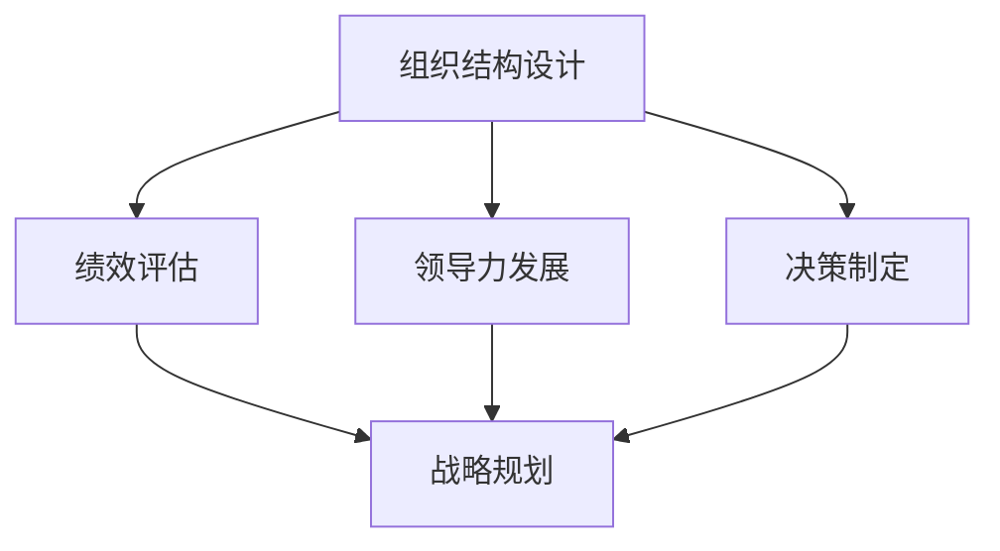

                 

# 从经典到实践：管理理论的落地

> 关键词：管理学,组织结构,领导力,绩效评估,决策制定,战略规划

## 1. 背景介绍

### 1.1 问题由来
现代管理学经过百余年的发展，形成了丰富的理论体系，涉及组织结构设计、领导力发展、人力资源管理、绩效评估、决策制定、战略规划等多个方面。然而，理论研究的成果如何转化为实际管理实践，一直是业界和学界关注的焦点。实践中，常见的挑战包括：
- **理论适配性**：管理理论在特定情境中的适配性和有效性问题。
- **管理实践**：如何将管理理论系统地应用到组织运营中，提高管理效率和效果。
- **跨学科融合**：管理学与其他学科（如心理学、经济学、计算机科学等）的交叉融合，进一步丰富和创新管理理论。

本文旨在探讨如何将经典的管理学理论通过合理的实践落地，以解决实际管理问题，提升组织绩效和竞争优势。

### 1.2 问题核心关键点
为更好地实现管理理论的落地，需要回答以下几个核心关键问题：
- **理论适配性**：如何评估理论在特定情境下的适配性和有效性？
- **实践方法**：具体的应用方法、操作流程、工具支持。
- **效果评估**：如何衡量管理实践的效果？
- **持续改进**：如何通过反馈循环持续优化管理实践？

## 2. 核心概念与联系

### 2.1 核心概念概述

为了全面理解和应用管理学理论，本文将介绍一些核心概念及其联系：

- **组织结构设计**：通过分析组织的目标、资源、流程等要素，设计符合组织战略的组织结构，优化资源配置和任务分工。
- **领导力发展**：通过培养和提升领导者的综合素质，如决策力、沟通力、创新力等，引导团队实现组织目标。
- **绩效评估**：通过科学合理的评估体系，量化员工和团队的工作表现，提供反馈以促进持续改进。
- **决策制定**：通过系统化的方法和工具，如SWOT分析、决策树等，支持管理者进行高效决策。
- **战略规划**：通过系统化的规划过程，如PEST分析、BCG矩阵等，指导组织在未来发展中的战略选择。

这些核心概念通过合纵连横，构成了一个系统的管理框架，帮助组织高效运营、持续发展。

### 2.2 核心概念原理和架构的 Mermaid 流程图



此图展示了各核心概念之间的联系和互动关系。组织结构设计提供了基础框架，绩效评估和领导力发展促进组织内部管理提升，决策制定支持战略实施，战略规划指导长期发展。这些概念通过持续反馈和优化，共同推动组织目标的实现。

## 3. 核心算法原理 & 具体操作步骤
### 3.1 算法原理概述

管理理论的落地涉及多个步骤，其核心原理基于系统化的管理理论和实际应用场景的适配。以下是几个关键原理：

1. **系统化理论**：管理理论具有系统性，需要从全局视角分析问题，将不同模块的理论与实践相结合。
2. **适配性原则**：管理理论应根据具体情况灵活应用，不能一概而论。
3. **反馈机制**：通过反馈循环，持续优化管理实践，确保其有效性。
4. **数据驱动**：利用数据支持管理决策，提高决策的科学性和准确性。

### 3.2 算法步骤详解

基于上述原理，管理学理论的落地一般包括以下几个关键步骤：

**Step 1: 理论评估与适配**
- 识别组织的核心目标、资源和环境。
- 评估管理理论在组织情境中的适配性和有效性。
- 根据组织特点和需求，选择最合适的管理理论进行应用。

**Step 2: 实践设计与实施**
- 设计详细的管理实践操作流程，如组织结构设计流程、绩效评估流程等。
- 选择恰当的工具和技术支持管理实践，如KPI指标设计、项目管理工具等。
- 对管理人员进行培训，确保其理解和掌握管理实践方法。

**Step 3: 效果评估与反馈**
- 建立科学的评估体系，量化管理实践的效果。
- 收集反馈信息，评估管理实践在实际操作中的效果和问题。
- 根据评估结果和反馈信息，调整和优化管理实践。

**Step 4: 持续改进与优化**
- 设立持续改进机制，定期回顾和优化管理实践。
- 引入新技术和新方法，提升管理实践的效能。
- 建立长效学习机制，促进管理理论与实践的迭代发展。

### 3.3 算法优缺点

**优点**：
1. **系统性**：管理理论的落地过程系统化，综合考虑了组织结构、绩效评估、领导力等多个维度。
2. **可操作性**：提供了详细的实践步骤和操作流程，便于管理实践的落地执行。
3. **持续改进**：通过反馈循环机制，持续优化管理实践，提升其适应性和效果。
4. **数据驱动**：利用数据支持管理决策，提高了决策的科学性和准确性。

**缺点**：
1. **复杂度**：管理理论的落地涉及多个模块，操作复杂。
2. **资源需求**：需要较多的时间和资源进行理论适配和实践落地。
3. **人员素质要求**：管理实践的执行和优化需要高素质管理团队。

### 3.4 算法应用领域

管理学理论的落地应用广泛，涉及各类组织，如企业、非营利组织、政府机构等。具体应用领域包括但不限于：

- **企业管理**：如人力资源管理、组织结构设计、绩效评估、领导力发展等。
- **公共管理**：如政府组织管理、公共服务评估、战略规划等。
- **非营利组织管理**：如项目管理、志愿者管理、筹款管理等。

## 4. 数学模型和公式 & 详细讲解 & 举例说明

### 4.1 数学模型构建

管理学中的数学模型常常用于决策分析和绩效评估。以下以决策树模型为例，进行详细讲解。

决策树是一种基于树形结构的分类模型，用于解决分类问题。其核心思想是通过树形结构表示决策过程，每条分支代表一种可能的决策路径，每个叶节点代表一个决策结果。

### 4.2 公式推导过程

假设有一个二分类问题，已知样本特征 $X_1, X_2, \ldots, X_n$ 和标签 $Y$，通过信息熵和基尼不纯度（Gini impurity）进行决策树的构建。

信息熵 $H(Y)$ 定义为：

$$
H(Y) = -\sum_{i=1}^2 p_i \log p_i
$$

其中 $p_i$ 为第 $i$ 类样本的概率。

基尼不纯度 $G(Y)$ 定义为：

$$
G(Y) = 1 - \sum_{i=1}^2 p_i^2
$$

其中 $p_i$ 为第 $i$ 类样本的概率。

根据信息熵和基尼不纯度的关系，可以得到决策树的分裂准则：

$$
\text{选择} \, \text{最小化} \, G(Y)
$$

即选择使得基尼不纯度最小的特征进行分裂。

### 4.3 案例分析与讲解

以一个公司的市场营销决策为例：

公司面临新产品推广的市场策略选择。有四种可能的市场策略：传统广告、社交媒体推广、搜索引擎优化(SEO)和电子邮件营销。目标是最小化推广成本，最大化销售收益。

假设收集了历史数据，包括广告投放金额、社交媒体曝光量、搜索引擎排名和电子邮件打开率，以及最终的销售收益。通过建立决策树模型，选择对销售收益影响最大的因素进行推广策略选择。

假设特征 $X_1$ 为广告投放金额，$X_2$ 为社交媒体曝光量，$X_3$ 为搜索引擎排名，$X_4$ 为电子邮件打开率，$Y$ 为销售收益。

构建决策树，通过计算各特征的分裂结果，选择对销售收益影响最大的特征作为根节点，进一步进行分裂。最终得到一个最优的市场策略组合。

## 5. 项目实践：代码实例和详细解释说明

### 5.1 开发环境搭建

为实现决策树模型的代码实践，首先需要搭建Python开发环境。以下是步骤：

1. 安装Python 3.8及以上版本。
2. 安装Jupyter Notebook，用于编写和运行Python代码。
3. 安装Scikit-Learn库，用于构建和训练决策树模型。
4. 安装Matplotlib库，用于数据可视化。

### 5.2 源代码详细实现

以下是一个简单的决策树模型构建和训练的代码实现：

```python
from sklearn import tree
from sklearn.model_selection import train_test_split
import pandas as pd
import matplotlib.pyplot as plt

# 读取数据
data = pd.read_csv('market_data.csv')

# 划分特征和标签
X = data[['ad_cost', 'social_media_exposure', 'search_rank', 'email_open_rate']]
y = data['sales_revenue']

# 划分训练集和测试集
X_train, X_test, y_train, y_test = train_test_split(X, y, test_size=0.2)

# 构建决策树模型
clf = tree.DecisionTreeClassifier()

# 训练模型
clf.fit(X_train, y_train)

# 预测测试集
y_pred = clf.predict(X_test)

# 可视化决策树
plt.figure(figsize=(10, 8))
tree.plot_tree(clf, filled=True)
plt.show()
```

### 5.3 代码解读与分析

**数据读取**：使用pandas库读取市场营销数据，分为特征和标签。

**模型构建**：选择决策树模型作为分类器，通过Scikit-Learn库中的`DecisionTreeClassifier`类进行构建。

**数据划分**：使用train_test_split方法，将数据集划分为训练集和测试集。

**模型训练**：调用模型的`fit`方法，训练决策树模型。

**模型预测**：调用模型的`predict`方法，对测试集进行预测。

**可视化**：使用Matplotlib库的`plot_tree`方法，绘制决策树模型，便于理解模型的决策逻辑。

### 5.4 运行结果展示

运行上述代码，可以得到决策树模型的可视化图，展示决策树的结构和决策路径。

## 6. 实际应用场景

### 6.1 智能制造管理

智能制造是现代制造业的重要发展方向，其核心在于通过信息化和智能化手段，提升制造过程的效率和质量。管理学理论在智能制造中的应用，主要体现在以下几个方面：

1. **生产计划和调度**：通过先进的信息系统，优化生产排程，提高生产效率和资源利用率。
2. **质量管理**：引入全面质量管理（TQM）理念，从设计、生产到售后全流程监控质量，提升产品质量。
3. **供应链管理**：利用精益生产（Lean Production）和供应链管理（SCM）理论，优化供应链各环节，降低成本，提高响应速度。
4. **设备维护和故障预测**：通过数据分析和预测模型，提高设备维护的预见性和精确性，减少故障率。

### 6.2 数字化转型

数字化转型是企业应对数字化时代挑战的重要战略。管理理论在数字化转型中的应用，主要体现在以下几个方面：

1. **组织文化变革**：通过引入敏捷管理、精益管理等理论，推动组织文化向数字化和智能化方向转型。
2. **人力资源管理**：利用大数据和AI技术，优化人力资源招聘、培训和绩效评估，提升人力资源管理的效率和效果。
3. **业务流程优化**：通过BPR（业务流程重组）理论，优化业务流程，提升运营效率和客户满意度。
4. **数据驱动决策**：通过数据分析和数据驱动决策理论，支持业务决策，提高决策的科学性和准确性。

### 6.3 智慧城市管理

智慧城市是利用信息和通信技术（ICT）提升城市治理水平和市民生活质量的创新应用。管理学理论在智慧城市中的应用，主要体现在以下几个方面：

1. **城市规划和管理**：利用城市规划和管理理论，优化城市空间布局和资源配置，提升城市管理水平。
2. **公共服务管理**：通过引入绩效管理、精益管理等理论，提升公共服务的效率和质量。
3. **交通管理**：利用数据驱动决策理论，优化交通流量管理，提升交通系统的运行效率和安全性。
4. **环境管理**：通过引入环境管理理论，提升城市环境质量，推动绿色低碳发展。

### 6.4 未来应用展望

展望未来，管理学理论在落地应用中将呈现以下几个发展趋势：

1. **跨领域融合**：管理学将与其他学科（如心理学、社会学、经济学等）进行更深层次的交叉融合，形成新的管理理论和方法。
2. **技术驱动**：大数据、人工智能、物联网等新技术的发展，将推动管理学理论的创新和实践。
3. **全球化视角**：全球化背景下，管理学理论将更加关注跨文化和跨国界的管理实践，提升全球竞争力。
4. **可持续发展**：管理学理论将更加注重环境保护和可持续发展，推动绿色管理和循环经济的发展。

## 7. 工具和资源推荐

### 7.1 学习资源推荐

为更好地理解和应用管理理论，推荐以下学习资源：

1. **《管理学原理》**：由Drucker等学者所著的经典管理学教材，涵盖了管理学的基础理论和实践应用。
2. **Coursera《管理学》课程**：斯坦福大学开设的公开课，系统讲解管理学理论和应用。
3. **Harvard Business Review**：哈佛商业评论，提供前沿的管理学理论和实践案例。
4. **McKinsey Global Institute**：麦肯锡全球研究所，发布大量的管理研究成果和管理实践案例。
5. **The Lean Startup**：由Eric Ries所著的畅销书，介绍精益创业和管理理论。

通过这些资源的学习，可以系统掌握管理学的基本理论和实践方法。

### 7.2 开发工具推荐

为实现管理理论的落地应用，推荐以下开发工具：

1. **Jupyter Notebook**：用于编写和运行Python代码，支持数据处理和可视化。
2. **Scikit-Learn**：用于构建和训练机器学习模型，支持决策树等分类模型。
3. **Pandas**：用于数据处理和分析，支持数据清洗、统计和可视化。
4. **Matplotlib**：用于数据可视化，支持绘制图表和决策树模型。
5. **TensorFlow**：用于构建和训练深度学习模型，支持神经网络等复杂模型。

这些工具能够帮助实现管理学理论的落地应用，提升管理实践的效率和效果。

### 7.3 相关论文推荐

为深入理解管理理论的落地应用，推荐以下相关论文：

1. **《The Lean Startup》**：Eric Ries, 2014。
2. **《Management in the Information Age》**：George Stalk III, 1996。
3. **《HBR's 10 Must Reads on Leadership》**：Harvard Business Review，2020。
4. **《The Knowledge Creating Company》**：Corynne McLeod Haux, 1995。
5. **《Designing Organization》**：Rensis Likert, 1961。

这些论文代表了大管理理论的发展脉络，提供了丰富的理论支持和实践案例。

## 8. 总结：未来发展趋势与挑战

### 8.1 研究成果总结

本文系统梳理了管理学理论的落地应用，通过理论评估与适配、实践设计与实施、效果评估与反馈、持续改进与优化四个关键步骤，详细讲解了管理学理论的落地方法。通过案例分析，展示了决策树模型在市场营销中的应用，以及其在智慧制造、数字化转型和智慧城市等实际场景中的应用。通过推荐的学习资源和开发工具，提供了管理学理论落地的完整流程和方法。

### 8.2 未来发展趋势

展望未来，管理学理论的落地应用将呈现以下几个发展趋势：

1. **跨领域融合**：管理学与其他学科的交叉融合，将产生更多创新性的管理理论和方法。
2. **技术驱动**：大数据、AI、IoT等新技术的发展，将推动管理学理论的创新和实践。
3. **全球化视角**：全球化背景下，管理学理论将更加关注跨文化和跨国界的管理实践。
4. **可持续发展**：管理学理论将更加注重环境保护和可持续发展，推动绿色管理和循环经济的发展。

### 8.3 面临的挑战

管理学理论的落地应用虽然前景广阔，但也面临以下挑战：

1. **理论适配性**：管理理论在特定情境中的适配性和有效性问题。
2. **资源需求**：管理实践的落地需要较多的时间和资源。
3. **人员素质要求**：管理实践的执行和优化需要高素质管理团队。
4. **数据质量问题**：数据驱动的管理决策需要高质量的数据支持。

### 8.4 研究展望

为应对这些挑战，未来的研究需要在以下几个方面寻求新的突破：

1. **理论适配性研究**：进一步研究管理理论在特定情境下的适配性和有效性，提高理论的可操作性。
2. **实践方法优化**：通过技术和工具的创新，简化管理实践的操作流程，提高其实施效率。
3. **数据驱动管理**：加强数据的质量管理和数据驱动决策的研究，提高决策的科学性和准确性。
4. **跨学科融合研究**：推动管理学与其他学科的深度融合，形成更具创新性的管理理论。

## 9. 附录：常见问题与解答

### Q1: 如何评估管理理论的适配性？

A: 评估管理理论的适配性需要结合组织的特点和需求，采用定性和定量相结合的方法。首先进行理论适配性分析，识别理论在特定情境下的适用性。然后，通过试点实施，收集反馈信息，评估理论在实际操作中的效果。最后，根据反馈信息，进行调整和优化，确保理论的适配性和有效性。

### Q2: 如何优化管理实践的操作流程？

A: 优化管理实践的操作流程需要系统化地分析和改进现有流程。采用方法如业务流程重组（BPR）、精益管理（Lean Management）等，识别流程中的瓶颈和浪费，优化资源配置和任务分工。同时，引入新技术和新方法，如信息化系统和数据驱动决策，提升管理实践的效率和效果。

### Q3: 如何确保数据驱动决策的准确性？

A: 确保数据驱动决策的准确性需要高质量的数据和科学的分析方法。首先，进行数据清洗和质量管理，确保数据的准确性和完整性。然后，采用科学的数据分析方法，如统计分析、机器学习等，提取有价值的信息，支持决策。最后，建立反馈机制，持续优化数据驱动决策的方法和流程。

### Q4: 如何应对跨领域融合的挑战？

A: 应对跨领域融合的挑战需要加强跨学科的交流和合作。首先，识别管理理论在特定情境下的适用性和局限性，进行理论适配性分析。然后，结合其他学科的理论和方法，如心理学、经济学等，形成跨学科的知识体系。最后，进行试点实施，收集反馈信息，评估融合效果，不断优化跨学科管理实践。

### Q5: 如何提高管理人员的素质？

A: 提高管理人员的素质需要系统化的人才培养和激励机制。首先，进行管理人员的能力评估，识别其短板和发展需求。然后，提供系统的培训和学习机会，提升管理人员的理论水平和实践能力。最后，建立科学的绩效评估和激励机制，激发管理人员的积极性和创造力。

---

作者：禅与计算机程序设计艺术 / Zen and the Art of Computer Programming

