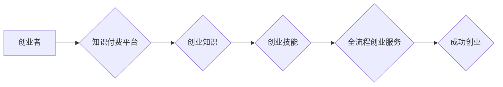

                 

## 创业知识付费要提供全流程创业服务

> 关键词：知识付费、创业服务、全流程服务、在线教育、商业模式

### 1. 背景介绍

近年来，知识付费行业蓬勃发展，成为互联网经济的重要组成部分。创业者们纷纷涌入这个领域，希望通过分享经验、提供指导，帮助他人实现创业梦想。然而，许多创业知识付费项目缺乏深度和实用性，最终难以获得持续发展。究其原因，在于许多项目仅仅停留在知识输出层面，未能真正提供全流程创业服务。

### 2. 核心概念与联系

**2.1 知识付费**

知识付费是指通过付费的方式获取知识、技能和经验。它是一种新型的商业模式，以知识为核心，通过线上平台提供学习资源和服务。

**2.2 全流程创业服务**

全流程创业服务是指从创业初期阶段到企业运营阶段，为创业者提供一站式服务，涵盖创业理念、市场调研、商业模式设计、团队建设、产品开发、融资渠道、运营推广等各个环节。

**2.3 核心概念联系**

知识付费与全流程创业服务之间存在着密切的联系。知识付费可以作为全流程创业服务的组成部分，为创业者提供创业知识和技能的学习资源。而全流程创业服务则可以将知识付费的价值最大化，帮助创业者将所学知识应用于实际创业过程中。

**Mermaid 流程图**



### 3. 核心算法原理 & 具体操作步骤

**3.1 算法原理概述**

全流程创业服务的核心算法原理在于将创业过程拆解成多个阶段，并为每个阶段提供相应的服务和资源。通过数据分析和用户反馈，不断优化服务内容和流程，提高创业成功率。

**3.2 算法步骤详解**

1. **创业阶段诊断:** 通过问卷调查、访谈等方式，了解创业者的创业理念、目标、资源、能力等信息，进行创业阶段诊断。
2. **个性化服务推荐:** 根据创业阶段诊断结果，推荐相应的创业知识、技能培训、导师指导、投资资源等服务。
3. **创业项目孵化:** 为创业者提供项目孵化服务，包括市场调研、商业模式设计、团队建设、产品开发等环节。
4. **创业项目运营:** 为创业者提供运营指导、推广支持、融资渠道等服务，帮助创业者将项目落地并实现盈利。
5. **数据分析与优化:** 收集用户数据，分析服务效果，不断优化服务内容和流程，提高创业成功率。

**3.3 算法优缺点**

**优点:**

* **个性化服务:** 根据创业者的实际情况提供个性化服务，提高服务针对性和有效性。
* **全流程覆盖:** 从创业初期到企业运营阶段，为创业者提供一站式服务，减少创业者的学习成本和风险。
* **数据驱动:** 通过数据分析，不断优化服务内容和流程，提高服务质量和效率。

**缺点:**

* **服务成本高:** 提供全流程创业服务需要投入大量的资源，成本较高。
* **服务质量参差不齐:** 由于服务提供方众多，服务质量参差不齐，需要创业者谨慎选择。
* **数据安全问题:** 收集用户数据需要注重数据安全问题，避免泄露用户隐私。

**3.4 算法应用领域**

全流程创业服务算法广泛应用于创业教育、孵化器、加速器、投资机构等领域。

### 4. 数学模型和公式 & 详细讲解 & 举例说明

**4.1 数学模型构建**

我们可以用一个简单的数学模型来描述创业成功率与服务质量之间的关系：

$$SuccessRate = f(ServiceQuality, EntrepreneurAbility)$$

其中：

* SuccessRate: 创业成功率
* ServiceQuality: 服务质量
* EntrepreneurAbility: 创业者能力

**4.2 公式推导过程**

这个模型假设创业成功率取决于服务质量和创业者能力这两个因素。服务质量越高，创业者能力越强，创业成功率越高。

**4.3 案例分析与讲解**

假设有两个创业者，A和B，他们都拥有相同的创业理念和目标，但A获得了高质量的创业服务，而B则没有。根据上述模型，我们可以推断出A的创业成功率高于B。

### 5. 项目实践：代码实例和详细解释说明

**5.1 开发环境搭建**

为了实现全流程创业服务，我们可以使用以下开发环境：

* **操作系统:** Linux/Windows/macOS
* **编程语言:** Python/Java/Node.js
* **数据库:** MySQL/MongoDB
* **云平台:** AWS/Azure/GCP

**5.2 源代码详细实现**

由于篇幅限制，这里只提供一个简单的代码示例，用于展示如何使用Python实现创业阶段诊断功能：

```python
def diagnose_entrepreneur(entrepreneur_info):
  """
  诊断创业者创业阶段
  """
  # 根据创业者信息，进行分析和判断
  # ...
  return stage

# 示例用法
entrepreneur_info = {
  "idea": "开发一个移动应用",
  "experience": "3年软件开发经验",
  "team": "2人团队",
  "funding": "个人自筹资金"
}
stage = diagnose_entrepreneur(entrepreneur_info)
print(f"创业阶段: {stage}")
```

**5.3 代码解读与分析**

这段代码定义了一个名为`diagnose_entrepreneur`的函数，该函数接受创业者的信息作为输入，并根据这些信息进行分析和判断，最终返回创业者的阶段。

**5.4 运行结果展示**

运行这段代码后，会输出创业者的阶段信息。例如，如果创业者的信息表明其处于初期阶段，则输出结果为“创业阶段: 初期”。

### 6. 实际应用场景

全流程创业服务在以下场景中具有广泛的应用价值：

* **创业教育平台:** 为创业者提供创业知识、技能培训、导师指导等服务，帮助他们提升创业能力。
* **创业孵化器:** 为创业项目提供孵化服务，包括市场调研、商业模式设计、团队建设、产品开发等环节。
* **创业加速器:** 为成长型创业项目提供加速服务，帮助他们快速成长和扩张。
* **投资机构:** 为投资项目提供全流程服务，包括项目筛选、尽职调查、投资决策、退出策略等。

### 6.4 未来应用展望

随着人工智能、大数据等技术的不断发展，全流程创业服务将更加智能化、个性化和高效化。未来，我们可以期待以下应用场景：

* **智能化创业诊断:** 利用人工智能技术，对创业者的信息进行智能分析，精准诊断创业阶段和面临的挑战。
* **个性化创业指导:** 根据创业者的实际情况，提供个性化的创业指导和服务，帮助他们克服困难，实现创业目标。
* **数据驱动的创业决策:** 利用大数据分析，为创业者提供数据驱动的创业决策支持，提高创业成功率。

### 7. 工具和资源推荐

**7.1 学习资源推荐**

* **书籍:** 《创业者必读的100本书》、《零基础创业》、《创业心理学》
* **在线课程:** Coursera、edX、Udemy等平台上的创业课程
* **博客和网站:** 创业邦、36氪、TechCrunch等

**7.2 开发工具推荐**

* **项目管理工具:** Trello、Asana、Jira
* **沟通协作工具:** Slack、Microsoft Teams、Zoom
* **数据分析工具:** Google Analytics、Tableau、Power BI

**7.3 相关论文推荐**

* **创业成功率预测模型:** "Predicting Startup Success: A Machine Learning Approach"
* **创业服务质量评估:** "Measuring the Quality of Entrepreneurship Support Services"
* **全流程创业服务平台设计:** "Design and Implementation of a Comprehensive Entrepreneurship Support Platform"

### 8. 总结：未来发展趋势与挑战

**8.1 研究成果总结**

全流程创业服务是一个新兴的领域，近年来取得了显著的进展。通过数据分析、人工智能等技术的应用，全流程创业服务将更加智能化、个性化和高效化。

**8.2 未来发展趋势**

* **智能化服务:** 利用人工智能技术，提供更加智能化的创业诊断、指导和决策支持。
* **个性化服务:** 根据创业者的实际情况，提供更加个性化的服务，满足不同创业者的需求。
* **生态化服务:** 建立创业生态系统，整合各种资源和服务，为创业者提供更加全面的支持。

**8.3 面临的挑战**

* **服务质量标准:** 全流程创业服务缺乏统一的质量标准，需要制定相应的标准和评估体系。
* **数据安全问题:** 收集用户数据需要注重数据安全问题，避免泄露用户隐私。
* **服务成本控制:** 提供全流程创业服务需要投入大量的资源，需要找到有效的成本控制方法。

**8.4 研究展望**

未来，需要进一步研究全流程创业服务的最佳实践、服务质量评估方法、数据安全保障机制等问题，推动全流程创业服务的发展和完善。

### 9. 附录：常见问题与解答

**9.1 如何选择合适的创业服务？**

选择创业服务时，需要考虑以下因素：

* **创业阶段:** 不同阶段的创业者需要不同的服务。
* **创业领域:** 不同领域的创业者需要不同的服务。
* **服务质量:** 选择信誉良好、服务质量高的创业服务平台。
* **服务价格:** 选择性价比高的创业服务。

**9.2 全流程创业服务可以解决哪些问题？**

全流程创业服务可以帮助创业者解决以下问题：

* **创业理念:** 帮助创业者明确自己的创业理念和目标。
* **市场调研:** 帮助创业者进行市场调研，了解目标市场和竞争对手。
* **商业模式:** 帮助创业者设计合理的商业模式。
* **团队建设:** 帮助创业者组建高效的团队。
* **产品开发:** 帮助创业者开发优质的产品。
* **融资渠道:** 帮助创业者寻找合适的融资渠道。
* **运营推广:** 帮助创业者进行运营推广，提升品牌知名度和市场份额。


作者：禅与计算机程序设计艺术 / Zen and the Art of Computer Programming 
<end_of_turn>

