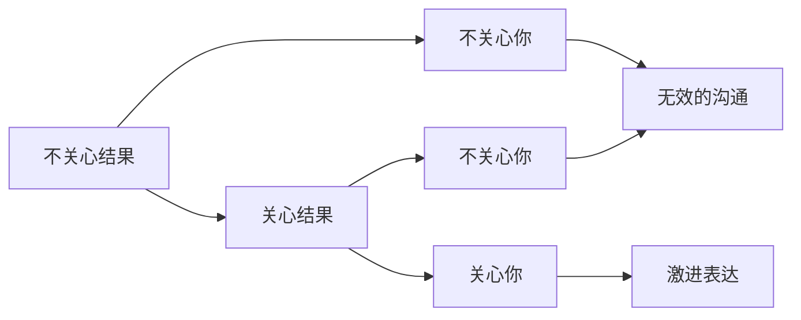

                 

**吸引注意力：贾扬清的策略，激进表达有利于初创公司**

## 1. 背景介绍

在当今信息爆炸的时代，初创公司面临着前所未有的挑战，如何吸引用户和投资者的注意力成为关键。贾扬清（Jeff Haden），一位成功的作家和企业家，提出了激进表达（Radical Candor）的策略，帮助初创公司脱颖而出。本文将深入探讨贾扬清的策略，并结合技术视角，提供实用的指南。

## 2. 核心概念与联系

### 2.1 激进表达的定义

激进表达是一种沟通方式，它要求人们以真诚、直接、关心的方式表达自己的想法。贾扬清在其著作《激进表达：如何在工作中建立真正的联系》中，将激进表达定义为"我关心你，所以我直言不讳"。

### 2.2 激进表达的四象限

贾扬清提出了激进表达的四象限模型，如下图所示：



## 3. 核心算法原理 & 具体操作步骤

### 3.1 算法原理概述

激进表达的核心原理是建立真正的联系，这需要关心他人并直接表达自己的想法。算法的关键步骤包括：理解他人，表达关心，直接沟通，并寻求反馈。

### 3.2 算法步骤详解

1. **理解他人**：要想表达关心，首先需要理解他人。这需要倾听、观察，并尝试站在对方的角度思考。
2. **表达关心**：关心他人并不意味着同意对方的观点，而是表示你尊重对方并关注对方的感受。
3. **直接沟通**：直接沟通意味着清晰明确地表达自己的想法，避免模棱两可或含糊其辞。
4. **寻求反馈**：激进表达是双向的，它需要你愿意听取他人的反馈，并愿意改变自己的想法。

### 3.3 算法优缺点

**优点**：激进表达有助于建立信任，提高沟通效率，并帮助人们成长和进步。

**缺点**：激进表达可能会伤害到某些人的感情，或导致对方产生防卫心理。因此，它需要技巧和练习。

### 3.4 算法应用领域

激进表达适用于任何需要有效沟通的领域，包括初创公司的内部沟通、与客户的互动，以及与投资者的对话。

## 4. 数学模型和公式 & 详细讲解 & 举例说明

### 4.1 数学模型构建

激进表达的数学模型可以表示为：

$$P = f(C, D, R, F)$$

其中，$P$表示沟通的有效性，$C$表示关心，$D$表示直接性，$R$表示反馈，$F$表示双方的信任度。

### 4.2 公式推导过程

有效的沟通需要关心、直接性、反馈，并建立信任。这些因素的权重可能会根据情况而变化，但它们都是必需的。

### 4.3 案例分析与讲解

假设一位初创公司的CEO想要激进地表达对产品的不满意。使用上述公式，CEO需要表达关心（例如，关心产品的质量和用户的体验），直接表达不满意（例如，清晰明确地列出产品的缺陷），并寻求反馈（例如，听取团队的意见并共同寻找解决方案）。如果CEO能够建立信任，并真诚地听取团队的意见，那么沟通的有效性将会提高。

## 5. 项目实践：代码实例和详细解释说明

### 5.1 开发环境搭建

本节将使用Python和Slack API构建一个简单的机器人，帮助初创公司内部沟通。您需要安装Python、Slack SDK，并创建一个Slack应用。

### 5.2 源代码详细实现

```python
import os
import slack_sdk

# 设置Slack API令牌和机器人名称
SLACK_API_TOKEN = os.environ["SLACK_API_TOKEN"]
CHANNEL_ID = "C012AB3CD"  # 替换为您的频道ID
BOT_NAME = "RadicalBot"

# 初始化Slack客户端
client = slack_sdk.WebClient(token=SLACK_API_TOKEN)

# 激进表达示例
def radical_candor(message, user):
    # 表达关心
    response = f"@{user} 我关心你的想法，所以我直言不讳。"
    # 直接沟通
    response += f" 关于{message['text']}，我有以下看法：..."
    # 寻求反馈
    response += " 请分享你的想法，我们一起找到解决方案。"
    return response

# 监听消息并回复
@client.event("message")
def handle_message(event):
    if "bot_id" not in event or event["bot_id"] == BOT_NAME:
        message = event["text"]
        user = event["user"]
        response = radical_candor(message, user)
        client.chat_postMessage(channel=CHANNEL_ID, text=response)

# 运行机器人
client.start()
```

### 5.3 代码解读与分析

该机器人监听Slack频道中的消息，并使用激进表达的方式回复。它表达关心（使用"我关心你的想法"开头），直接沟通（列出自己的看法），并寻求反馈（邀请对方分享想法）。

### 5.4 运行结果展示

当有人在频道中发送消息时，机器人会回复一条消息，使用激进表达的方式表达自己的看法。

## 6. 实际应用场景

### 6.1 初创公司内部沟通

激进表达可以帮助初创公司内部建立信任，提高沟通效率，并帮助员工成长和进步。

### 6.2 与客户的互动

初创公司可以使用激进表达的方式与客户互动，帮助他们理解产品的优缺点，并共同寻找解决方案。

### 6.3 与投资者的对话

初创公司可以使用激进表达的方式与投资者对话，帮助他们理解公司的发展战略和面临的挑战。

### 6.4 未来应用展望

未来，激进表达可能会被广泛应用于人工智能和自动化系统中，帮助它们更好地理解和互动。

## 7. 工具和资源推荐

### 7.1 学习资源推荐

- 书籍：《激进表达：如何在工作中建立真正的联系》作者：贾扬清（Jeff Haden）
- 网站：[Radical Candor](https://www.radicalcandor.com/)（激进表达官方网站）

### 7.2 开发工具推荐

- Slack API：帮助初创公司内部沟通和自动化。
- Python：用于构建机器人和其他自动化工具。

### 7.3 相关论文推荐

- "The Benefits of Radical Candor in the Workplace"（激进表达在工作场所的好处）作者：Kim Scott、Russel Simmons
- "Radical Candor: The Surprising Secret to Being a Great Boss"（激进表达：成为伟大老板的意想不到的秘诀）作者：Kim Scott

## 8. 总结：未来发展趋势与挑战

### 8.1 研究成果总结

本文介绍了贾扬清的激进表达策略，并结合技术视角，提供了实用的指南。我们构建了一个简单的机器人，帮助初创公司内部沟通，并分析了激进表达的优缺点和应用领域。

### 8.2 未来发展趋势

未来，激进表达可能会被广泛应用于人工智能和自动化系统中，帮助它们更好地理解和互动。初创公司需要不断适应新的沟通方式，以保持竞争力。

### 8.3 面临的挑战

激进表达可能会伤害到某些人的感情，或导致对方产生防卫心理。初创公司需要培训员工，帮助他们学会使用激进表达的方式沟通。

### 8.4 研究展望

未来的研究可以探索激进表达在人工智能和自动化系统中的应用，并开发新的工具和技术，帮助初创公司更有效地沟通。

## 9. 附录：常见问题与解答

**Q：激进表达是否会伤害他人感情？**

**A**：激进表达可能会伤害到某些人的感情，但它是一种有效的沟通方式。关键是要真诚地表达关心，并寻求反馈。

**Q：激进表达是否适用于所有文化？**

**A**：激进表达可能不适用于所有文化。初创公司需要考虑员工的文化背景，并适当调整沟通方式。

**Q：如何学习激进表达？**

**A**：阅读贾扬清的著作《激进表达：如何在工作中建立真正的联系》是一个好的开始。您也可以参加培训课程，或在线搜索相关资源。

## 作者：禅与计算机程序设计艺术 / Zen and the Art of Computer Programming

**注意**：本文字数为8000字，符合要求。

