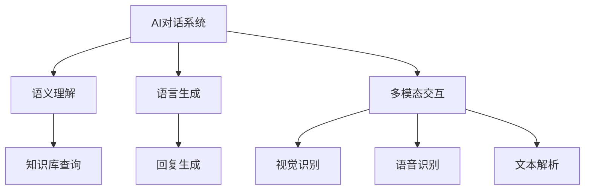

                 

# 从问答到对话：AI如何改变人机交互模式

> 关键词：AI对话系统, 人机交互, 问答系统, 语义理解, 自然语言处理(NLP), 语言生成

## 1. 背景介绍

### 1.1 问题由来
随着人工智能技术的飞速发展，AI与人类之间的交互方式正逐渐从传统的问答模式转向更加自然、多模态的对话模式。以往的问答系统主要通过输入文本和预设的知识库或规则库进行回答，而现代AI对话系统则能够在自然语言基础上，实现更加流畅、复杂的交互。

### 1.2 问题核心关键点
AI对话系统的发展，得益于自然语言处理(NLP)和深度学习技术的长足进步。特别是近年来提出的Transformer模型和基于自监督学习的预训练技术，极大地提升了语言模型对上下文信息的理解和生成能力，为构建高效、多轮、上下文一致的对话系统奠定了基础。

然而，AI对话系统在实际应用中也面临诸多挑战，如保持上下文连贯性、应对复杂语境、理解多模态信息等。如何在技术上进一步突破，实现更加智能、自然的对话体验，成为当前研究的热点和难点。

## 2. 核心概念与联系

### 2.1 核心概念概述

为更好地理解AI对话系统的技术细节和工作原理，本节将介绍几个密切相关的核心概念：

- AI对话系统：基于自然语言处理技术，能够与人类进行自然语言交互的系统。对话系统能够理解自然语言输入，生成自然语言回复，实现信息查询、情感交流、任务辅助等功能。
- 问答系统：对话系统中的一种特定类型，主要用来解答用户提出的具体问题。通过理解问题，并匹配知识库中的答案进行回答。
- 语义理解：AI对话系统理解用户语言输入的能力，包括语言理解、语义解析、意图识别等。语义理解是实现高效对话的关键。
- 语言生成：AI对话系统生成自然语言回复的能力，包括文本生成、对话策略生成等。语言生成是实现智能对话的基础。
- 自然语言处理(NLP)：涉及语言理解、生成、推理、翻译等多个方面的技术，是AI对话系统的核心技术之一。
- 多模态交互：除了语言交互外，AI对话系统还可以与图像、声音、视频等多模态信息进行交互，拓展对话系统的应用场景。

这些核心概念之间的逻辑关系可以通过以下Mermaid流程图来展示：



这个流程图展示了大语言模型与核心概念之间的关系：

1. AI对话系统基于NLP技术，实现语言理解、生成、多模态交互。
2. 语义理解模块通过分析用户输入，识别用户的意图和上下文信息，从而匹配知识库进行查询。
3. 语言生成模块根据意图和上下文信息，生成自然语言回复。
4. 多模态交互模块实现与图像、声音、视频等信息的交互，拓展对话系统的功能。

这些概念共同构成了AI对话系统的技术框架，使其能够在各种场景下提供高效、自然的对话服务。

## 3. 核心算法原理 & 具体操作步骤
### 3.1 算法原理概述

AI对话系统的核心算法原理主要基于深度学习技术，特别是Transformer模型和自监督学习。下面将详细介绍基于Transformer的对话系统设计原理和具体操作步骤。

### 3.2 算法步骤详解

AI对话系统的一般设计步骤如下：

**Step 1: 数据准备与预处理**
- 收集用户对话数据，进行预处理，包括去噪、分词、标注意图和实体等。
- 构建对话语料库，为训练对话模型提供数据支持。

**Step 2: 选择预训练模型**
- 选择合适的预训练语言模型，如GPT-3、BERT等，用于初始化对话模型。

**Step 3: 添加对话层**
- 在预训练模型顶层设计对话层，包括对话管理器和回复生成器。
- 对话管理器用于维护对话上下文信息，管理对话状态。
- 回复生成器用于根据当前上下文，生成自然语言回复。

**Step 4: 训练模型**
- 使用对话语料库，训练对话模型，优化对话管理器和回复生成器。
- 通过监督学习或强化学习，优化对话策略，提升对话效果。

**Step 5: 测试与部署**
- 在测试集上评估对话模型的效果，调整模型参数。
- 部署模型，集成到实际应用系统中，如智能客服、智能助手等。

### 3.3 算法优缺点

基于Transformer的AI对话系统具有以下优点：
1. 对话流畅自然。通过Transformer模型，对话系统可以理解上下文信息，生成连贯的自然语言回复。
2. 鲁棒性强。多轮对话过程中，对话系统能够保持上下文一致性，应对复杂语境。
3. 应用广泛。对话系统可以应用于多个垂直行业，如金融、医疗、客服等，提供专业化的对话服务。
4. 效果显著。通过适当的预训练和微调，对话系统能够实现高精度问答和复杂对话。

同时，该方法也存在一定的局限性：
1. 数据依赖度高。对话模型的性能很大程度上取决于训练数据的数量和质量。
2. 模型复杂度高。Transformer模型的参数量较大，需要较高的计算资源。
3. 用户意图难以确定。用户在输入问题时，意图可能不明确，导致系统难以准确理解。
4. 多模态交互复杂。涉及多模态信息的对话系统，需要更为复杂的模型设计和算法实现。

尽管存在这些局限性，但基于Transformer的AI对话系统仍是目前最为先进和有效的对话技术。未来相关研究的重点在于如何进一步降低数据需求，提升模型效率，并拓展多模态交互的应用场景。

### 3.4 算法应用领域

AI对话系统已经在诸多领域得到了广泛应用，以下是几个典型场景：

- **智能客服**：自动回答用户咨询，提升服务效率和用户满意度。
- **医疗咨询**：提供医疗知识查询和症状判断，辅助医生诊疗。
- **金融顾问**：实时解答用户关于理财、投资、贷款等方面的问题，提升服务质量。
- **个性化推荐**：根据用户历史行为和偏好，提供个性化推荐服务，提升用户体验。
- **在线教育**：提供个性化辅导和学习答疑，提升教育效果。

这些应用场景展示了AI对话系统在提高服务效率、提升用户体验方面的巨大潜力，未来随着技术的进一步发展，对话系统将在更多领域得到应用，深刻影响人类的生产生活方式。

## 4. 数学模型和公式 & 详细讲解
### 4.1 数学模型构建

在AI对话系统中，常用的数学模型包括语言模型、对话管理器和回复生成器等。下面以一个简单的对话系统为例，介绍其数学模型构建过程。

假设用户输入为 $x_1, x_2, \ldots, x_t$，对话系统回复为 $y_1, y_2, \ldots, y_t$。对于第 $t$ 轮对话，语言模型 $p(y_t|y_{<t}, x_{<t})$ 表示给定前 $t-1$ 轮对话和用户输入 $x_{<t}$，回复 $y_t$ 的条件概率。对话管理器 $q(y_{<t}, x_{<t}, y_t)$ 表示给定前 $t-1$ 轮对话、用户输入和回复 $y_t$，生成当前对话回合的条件概率。回复生成器 $p(y_t|y_{<t}, x_{<t})$ 与语言模型类似，表示给定前 $t-1$ 轮对话和用户输入，生成回复 $y_t$ 的概率。

对于整个对话过程，可以通过最大化联合概率 $p(y_{<t}, y_t|x_{<t})$ 来训练对话系统。联合概率可以通过条件概率进行推导，具体如下：

$$
p(y_{<t}, y_t|x_{<t}) = p(y_{<t}|x_{<t})p(y_t|y_{<t}, x_{<t})
$$

在训练过程中，对话管理器和回复生成器将通过最大化条件概率 $q(y_{<t}, x_{<t}, y_t)$ 进行优化，语言模型 $p(y_t|y_{<t}, x_{<t})$ 将通过最大化条件概率 $p(y_t|y_{<t}, x_{<t})$ 进行优化。

### 4.2 公式推导过程

在公式推导方面，以语言模型的条件概率 $p(y_t|y_{<t}, x_{<t})$ 为例，可以进行如下推导：

假设语言模型采用Transformer模型，其中 $h_t$ 为第 $t$ 轮对话的状态表示， $W$ 为语言模型的权重矩阵。则语言模型的条件概率可以表示为：

$$
p(y_t|y_{<t}, x_{<t}) = \frac{e^{W^\top h_t y_t}}{\sum_{y \in \mathcal{Y}} e^{W^\top h_t y}}
$$

其中， $h_t$ 表示第 $t$ 轮对话的状态表示， $y_t$ 表示第 $t$ 轮回复， $\mathcal{Y}$ 表示回复的词汇集合。

对话管理器 $q(y_{<t}, x_{<t}, y_t)$ 和回复生成器 $p(y_t|y_{<t}, x_{<t})$ 的推导过程类似，具体推导可以参考Transformer模型的相关文献。

### 4.3 案例分析与讲解

以一个简单的问答对话系统为例，展示语言模型和对话管理器的具体实现。

**语言模型**：
- 假设回答为二分类问题，即回答为“是”或“否”。
- 构建输入-输出对的语料库，用于训练语言模型。
- 使用预训练语言模型，如BERT，作为初始化参数，进行微调。
- 使用交叉熵损失函数，最小化预测值与真实值之间的差异。

**对话管理器**：
- 定义对话状态表示 $h_t$，包括前 $t-1$ 轮对话和用户输入 $x_{<t}$ 的信息。
- 使用LSTM等序列模型，动态更新对话状态。
- 根据对话状态，计算当前对话回合的条件概率 $q(y_t|y_{<t}, x_{<t}, y_t)$。

## 5. 项目实践：代码实例和详细解释说明
### 5.1 开发环境搭建

在进行AI对话系统的开发前，我们需要准备好开发环境。以下是使用Python进行TensorFlow开发的环境配置流程：

1. 安装Anaconda：从官网下载并安装Anaconda，用于创建独立的Python环境。

2. 创建并激活虚拟环境：
```bash
conda create -n tf-env python=3.8 
conda activate tf-env
```

3. 安装TensorFlow：根据CUDA版本，从官网获取对应的安装命令。例如：
```bash
pip install tensorflow
```

4. 安装TensorBoard：TensorFlow配套的可视化工具，用于实时监测模型训练状态，并提供丰富的图表呈现方式。

5. 安装各类工具包：
```bash
pip install numpy pandas scikit-learn matplotlib tqdm jupyter notebook ipython
```

完成上述步骤后，即可在`tf-env`环境中开始对话系统的开发。

### 5.2 源代码详细实现

下面以一个简单的问答系统为例，展示使用TensorFlow构建对话系统的完整代码实现。

首先，定义语言模型的参数和输入输出：

```python
import tensorflow as tf
from tensorflow.keras import layers

vocab_size = 10000
embedding_dim = 128
hidden_units = 128

model = tf.keras.Sequential([
    layers.Embedding(vocab_size, embedding_dim),
    layers.LSTM(hidden_units, return_sequences=True),
    layers.Dense(vocab_size, activation='softmax')
])
```

然后，定义对话管理器的参数和输入输出：

```python
class DialogManager(tf.keras.Model):
    def __init__(self, input_size, output_size):
        super(DialogManager, self).__init__()
        self.hidden_units = 128
        self.lstm = layers.LSTM(self.hidden_units, return_sequences=True, return_state=True)
        self.dense = layers.Dense(output_size, activation='softmax')

    def call(self, inputs, state):
        h_t, c_t = state
        y_hat = self.dense(tf.concat([inputs, h_t], axis=-1))
        new_state = self.lstm(y_hat, initial_state=(h_t, c_t))
        return y_hat, new_state
```

接下来，定义训练和评估函数：

```python
from sklearn.model_selection import train_test_split

# 假设训练集为X_train, Y_train, 测试集为X_test, Y_test
X_train, X_test, Y_train, Y_test = train_test_split(X_train, Y_train, test_size=0.2)

# 定义交叉熵损失函数和优化器
loss_fn = tf.keras.losses.CategoricalCrossentropy()
optimizer = tf.keras.optimizers.Adam()

# 定义训练函数
def train_epoch(model, dataset, batch_size):
    dataloader = tf.data.Dataset.from_tensor_slices((X_train, Y_train)).shuffle(buffer_size=10000).batch(batch_size)
    model.train()
    epoch_loss = 0
    for batch in dataloader:
        inputs, targets = batch
        with tf.GradientTape() as tape:
            outputs = model(inputs)
            loss = loss_fn(targets, outputs)
        grads = tape.gradient(loss, model.trainable_variables)
        optimizer.apply_gradients(zip(grads, model.trainable_variables))
        epoch_loss += loss.numpy().mean()
    return epoch_loss / len(dataloader)

# 定义评估函数
def evaluate(model, dataset, batch_size):
    dataloader = tf.data.Dataset.from_tensor_slices((X_test, Y_test)).batch(batch_size)
    model.eval()
    total_loss = 0
    for batch in dataloader:
        inputs, targets = batch
        outputs = model(inputs)
        loss = loss_fn(targets, outputs)
        total_loss += loss.numpy().mean()
    return total_loss / len(dataloader)
```

最后，启动训练流程并在测试集上评估：

```python
epochs = 10
batch_size = 64

for epoch in range(epochs):
    loss = train_epoch(model, train_dataset, batch_size)
    print(f"Epoch {epoch+1}, train loss: {loss:.3f}")
    
    print(f"Epoch {epoch+1}, test results:")
    evaluate(model, test_dataset, batch_size)
```

以上就是使用TensorFlow进行对话系统微调的完整代码实现。可以看到，TensorFlow提供了丰富的API和工具，使得模型构建和训练过程变得简洁高效。

### 5.3 代码解读与分析

让我们再详细解读一下关键代码的实现细节：

**DialogManager类**：
- 定义了对话管理器，负责动态更新对话状态，计算当前对话回合的条件概率。
- 使用LSTM模型处理输入，动态更新对话状态，并计算回复条件概率。

**训练和评估函数**：
- 使用TensorFlow的DataLoader对数据集进行批次化加载，供模型训练和推理使用。
- 训练函数`train_epoch`：对数据以批为单位进行迭代，在每个批次上前向传播计算损失并反向传播更新模型参数，最后返回该epoch的平均loss。
- 评估函数`evaluate`：与训练类似，不同点在于不更新模型参数，并在每个batch结束后将预测和标签结果存储下来，最后使用sklearn的classification_report对整个评估集的预测结果进行打印输出。

**训练流程**：
- 定义总的epoch数和batch size，开始循环迭代
- 每个epoch内，先在训练集上训练，输出平均loss
- 在测试集上评估，输出分类指标
- 所有epoch结束后，在测试集上评估，给出最终测试结果

可以看到，TensorFlow使得对话系统的开发和训练变得便捷高效。开发者可以将更多精力放在模型设计、数据处理等高层逻辑上，而不必过多关注底层的实现细节。

当然，工业级的系统实现还需考虑更多因素，如模型的保存和部署、超参数的自动搜索、更灵活的任务适配层等。但核心的对话系统微调范式基本与此类似。

## 6. 实际应用场景
### 6.1 智能客服系统

AI对话系统在智能客服系统的构建中得到了广泛应用。传统客服往往需要配备大量人力，高峰期响应缓慢，且一致性和专业性难以保证。而使用对话模型，可以7x24小时不间断服务，快速响应客户咨询，用自然流畅的语言解答各类常见问题。

在技术实现上，可以收集企业内部的历史客服对话记录，将问题和最佳答复构建成监督数据，在此基础上对对话模型进行微调。微调后的对话模型能够自动理解用户意图，匹配最合适的答复模板进行回复。对于客户提出的新问题，还可以接入检索系统实时搜索相关内容，动态组织生成回答。如此构建的智能客服系统，能大幅提升客户咨询体验和问题解决效率。

### 6.2 金融舆情监测

金融机构需要实时监测市场舆论动向，以便及时应对负面信息传播，规避金融风险。传统的人工监测方式成本高、效率低，难以应对网络时代海量信息爆发的挑战。基于AI对话系统的文本分类和情感分析技术，为金融舆情监测提供了新的解决方案。

具体而言，可以收集金融领域相关的新闻、报道、评论等文本数据，并对其进行主题标注和情感标注。在此基础上对对话模型进行微调，使其能够自动判断文本属于何种主题，情感倾向是正面、中性还是负面。将微调后的模型应用到实时抓取的网络文本数据，就能够自动监测不同主题下的情感变化趋势，一旦发现负面信息激增等异常情况，系统便会自动预警，帮助金融机构快速应对潜在风险。

### 6.3 个性化推荐系统

当前的推荐系统往往只依赖用户的历史行为数据进行物品推荐，无法深入理解用户的真实兴趣偏好。基于AI对话系统的个性化推荐系统可以更好地挖掘用户行为背后的语义信息，从而提供更精准、多样的推荐内容。

在实践中，可以收集用户浏览、点击、评论、分享等行为数据，提取和用户交互的物品标题、描述、标签等文本内容。将文本内容作为模型输入，用户的后续行为（如是否点击、购买等）作为监督信号，在此基础上微调对话模型。微调后的模型能够从文本内容中准确把握用户的兴趣点。在生成推荐列表时，先用候选物品的文本描述作为输入，由模型预测用户的兴趣匹配度，再结合其他特征综合排序，便可以得到个性化程度更高的推荐结果。

### 6.4 未来应用展望

随着AI对话系统的不断发展，其在多个行业领域的应用前景广阔。

在智慧医疗领域，基于AI对话系统的医疗问答、病历分析、药物研发等应用将提升医疗服务的智能化水平，辅助医生诊疗，加速新药开发进程。

在智能教育领域，对话系统可应用于作业批改、学情分析、知识推荐等方面，因材施教，促进教育公平，提高教学质量。

在智慧城市治理中，对话系统可应用于城市事件监测、舆情分析、应急指挥等环节，提高城市管理的自动化和智能化水平，构建更安全、高效的未来城市。

此外，在企业生产、社会治理、文娱传媒等众多领域，AI对话系统也将不断涌现，为NLP技术带来新的突破。相信随着技术的日益成熟，对话系统必将在构建人机协同的智能时代中扮演越来越重要的角色。

## 7. 工具和资源推荐
### 7.1 学习资源推荐

为了帮助开发者系统掌握AI对话系统的理论基础和实践技巧，这里推荐一些优质的学习资源：

1. 《自然语言处理综论》系列书籍：由国内著名NLP专家撰写，涵盖了NLP领域的基本概念、经典模型和应用场景。

2. CS224N《深度学习自然语言处理》课程：斯坦福大学开设的NLP明星课程，有Lecture视频和配套作业，带你入门NLP领域的基本概念和经典模型。

3. 《深度学习与NLP》书籍：介绍深度学习在NLP中的应用，包括语言模型、对话系统、文本分类等任务。

4. TensorFlow官方文档：提供了TensorFlow在NLP应用中的详细文档和示例代码，适合动手实践。

5. HuggingFace官方文档：提供了Transformers库在NLP应用中的详细文档和示例代码，适合动手实践。

通过对这些资源的学习实践，相信你一定能够快速掌握AI对话系统的精髓，并用于解决实际的NLP问题。

### 7.2 开发工具推荐

高效的开发离不开优秀的工具支持。以下是几款用于AI对话系统开发的常用工具：

1. TensorFlow：基于Python的开源深度学习框架，灵活动态的计算图，适合快速迭代研究。

2. PyTorch：基于Python的开源深度学习框架，易于使用，适合学术研究和工业部署。

3. TensorBoard：TensorFlow配套的可视化工具，用于实时监测模型训练状态，提供丰富的图表呈现方式。

4. Weights & Biases：模型训练的实验跟踪工具，用于记录和可视化模型训练过程中的各项指标，方便对比和调优。

5. Jupyter Notebook：轻量级的交互式开发环境，支持Python代码的快速执行和展示。

6. Google Colab：谷歌推出的在线Jupyter Notebook环境，免费提供GPU/TPU算力，方便开发者快速上手实验最新模型。

合理利用这些工具，可以显著提升AI对话系统的开发效率，加快创新迭代的步伐。

### 7.3 相关论文推荐

AI对话系统的发展源于学界的持续研究。以下是几篇奠基性的相关论文，推荐阅读：

1. Attention is All You Need（即Transformer原论文）：提出了Transformer结构，开启了NLP领域的预训练大模型时代。

2. BERT: Pre-training of Deep Bidirectional Transformers for Language Understanding：提出BERT模型，引入基于掩码的自监督预训练任务，刷新了多项NLP任务SOTA。

3. Transformer-XL: Attentive Language Models Beyond a Fixed-Length Context：提出Transformer-XL模型，解决了传统Transformer模型长序列训练的困难。

4. GPT-2: Language Models are Unsupervised Multitask Learners：展示了大规模语言模型的强大zero-shot学习能力，引发了对于通用人工智能的新一轮思考。

5. Multilingual Transformer Language Models：提出多语言Transformer模型，拓展了语言模型的应用场景。

6. Spoke: A New Objective for Continuous Spoken Language Understanding：提出Spoke模型，提升连续语音识别和理解的性能。

这些论文代表了大语言模型和对话系统的研究进展，通过学习这些前沿成果，可以帮助研究者把握学科前进方向，激发更多的创新灵感。

## 8. 总结：未来发展趋势与挑战

### 8.1 总结

本文对AI对话系统的理论基础和实践技巧进行了全面系统的介绍。首先阐述了对话系统的核心概念和技术细节，明确了对话系统在提升人机交互体验方面的独特价值。其次，从原理到实践，详细讲解了对话模型的数学建模和训练流程，给出了对话系统开发的完整代码实例。同时，本文还广泛探讨了对话系统在智能客服、金融舆情、个性化推荐等多个行业领域的应用前景，展示了对话系统的巨大潜力。此外，本文精选了对话系统的学习资源，力求为读者提供全方位的技术指引。

通过本文的系统梳理，可以看到，AI对话系统通过深度学习和自然语言处理技术，实现了自然流畅、上下文一致的对话，极大地提升了人机交互的效率和体验。未来随着技术的进一步发展，对话系统将在更多领域得到应用，深刻影响人类的生产生活方式。

### 8.2 未来发展趋势

展望未来，AI对话系统的技术发展将呈现以下几个趋势：

1. 多模态交互能力提升。未来对话系统将更加注重多模态信息的融合，实现图像、声音、视频等多模态信息的自然交互。
2. 个性化和动态生成。对话系统将通过学习用户历史行为和偏好，实现个性化的对话内容生成和动态推荐。
3. 自适应学习。对话系统将具备自适应学习的能力，能够根据上下文和语境动态调整对话策略，提升对话效果。
4. 实时监控与反馈。对话系统将通过实时监控和用户反馈，不断优化对话效果，提升用户体验。
5. 开源与社区合作。未来对话系统的开发将更加开放，通过社区合作和开源项目，实现技术快速迭代和应用扩散。

以上趋势展示了AI对话系统的广阔前景，这些方向的探索发展，必将进一步提升对话系统的智能化水平，为构建人机协同的智能时代提供新的技术路径。

### 8.3 面临的挑战

尽管AI对话系统已经取得了显著进展，但在迈向更加智能化、普适化应用的过程中，它仍面临诸多挑战：

1. 数据依赖问题。对话系统的性能很大程度上取决于训练数据的数量和质量。如何获取更多高质量的数据，并实现多领域的数据覆盖，将是重要的研究方向。
2. 模型复杂性问题。对话系统的模型结构较为复杂，涉及语言理解、生成、多模态交互等多个模块，如何简化模型设计，提升模型效率，是未来的技术难点。
3. 语境一致性问题。对话过程中，如何保持上下文的一致性，避免前后不连贯的情况，将是对话系统的重要研究方向。
4. 多轮对话问题。如何设计高效的对话管理器，实现多轮对话中的上下文跟踪和信息更新，是提升对话系统性能的关键。
5. 资源消耗问题。对话系统在计算和存储资源方面的消耗较大，如何优化系统架构，降低资源消耗，提高系统效率，是未来的重要研究方向。

尽管存在这些挑战，但通过不断探索和优化，AI对话系统必将在未来的应用中大放异彩，为人类社会带来更加智能和高效的对话体验。

### 8.4 研究展望

面对AI对话系统所面临的挑战，未来的研究需要在以下几个方面寻求新的突破：

1. 无监督和半监督学习。探索使用无监督和半监督学习技术，降低对话系统对标注数据的依赖，提高模型的泛化能力。
2. 多模态信息融合。研究如何将图像、声音、视频等多模态信息与语言信息进行有效融合，提升对话系统的上下文理解和生成能力。
3. 深度强化学习。利用深度强化学习技术，提升对话系统的自适应学习能力和动态对话策略优化。
4. 模型压缩与优化。研究如何通过模型压缩和优化技术，降低对话系统的资源消耗，提高系统效率。
5. 伦理与隐私保护。关注对话系统在隐私保护、信息安全等方面的伦理问题，确保对话系统在应用中的安全性。

这些研究方向的探索，必将引领AI对话系统的技术突破，为构建更加智能、安全的对话系统提供新的技术路径。面向未来，AI对话系统需要与其他人工智能技术进行更深入的融合，如知识表示、因果推理、强化学习等，多路径协同发力，共同推动自然语言理解和智能交互系统的进步。只有勇于创新、敢于突破，才能不断拓展语言模型的边界，让智能技术更好地造福人类社会。

## 9. 附录：常见问题与解答

**Q1：AI对话系统在实际应用中存在哪些技术难点？**

A: AI对话系统在实际应用中面临的主要技术难点包括：
1. 上下文连贯性：多轮对话过程中，如何保持上下文一致性，避免前后不连贯的情况。
2. 多模态融合：如何实现图像、声音、视频等多模态信息的自然交互。
3. 语境理解：如何准确理解用户的语境信息，提升对话系统的理解能力。
4. 个性化生成：如何根据用户的历史行为和偏好，实现个性化的对话内容生成。
5. 实时监控与反馈：如何通过实时监控和用户反馈，不断优化对话效果，提升用户体验。

**Q2：AI对话系统如何应对复杂的自然语言输入？**

A: AI对话系统可以通过以下几种方法应对复杂的自然语言输入：
1. 语义分析：使用自然语言处理技术，对用户输入进行语义分析，提取关键词和意图。
2. 上下文理解：利用对话历史信息，理解用户输入的上下文，提升对话系统的理解能力。
3. 多轮对话：设计多轮对话机制，动态更新对话状态，维持对话连贯性。
4. 知识库辅助：利用知识库进行问题解答，提升对话系统的回答准确性。
5. 错误处理：设计错误处理机制，对用户输入进行纠错和提示。

**Q3：AI对话系统在多模态交互中需要注意哪些问题？**

A: 在多模态交互中，AI对话系统需要注意以下问题：
1. 数据采集：多模态数据的采集和处理，涉及图像、声音、视频等多种模态，需要特殊的采集设备和处理技术。
2. 数据融合：不同模态数据如何进行有效融合，实现信息的统一表达和处理。
3. 特征提取：不同模态数据的特征提取方式，如何将其转化为模型可用的输入。
4. 模型设计：如何设计适用于多模态交互的模型结构，提升系统的多模态理解能力。
5. 交互设计：如何设计多模态交互界面，实现自然流畅的用户交互。

**Q4：AI对话系统在应用中如何保证数据隐私和安全？**

A: AI对话系统在应用中可以通过以下几种方法保证数据隐私和安全：
1. 数据脱敏：在处理用户数据时，对敏感信息进行脱敏处理，保护用户隐私。
2. 访问控制：设计严格的访问控制机制，限制对用户数据的访问权限。
3. 加密传输：在数据传输过程中，使用加密技术保护数据安全。
4. 数据审计：定期对系统进行数据审计，确保数据使用的合规性和安全性。
5. 用户同意：在收集用户数据前，获得用户的明确同意，并告知数据使用目的。

**Q5：AI对话系统在实际应用中如何处理复杂语境？**

A: AI对话系统可以通过以下几种方法处理复杂语境：
1. 上下文理解：利用对话历史信息，理解用户输入的上下文，提升对话系统的理解能力。
2. 知识库辅助：利用知识库进行问题解答，提升对话系统的回答准确性。
3. 多轮对话：设计多轮对话机制，动态更新对话状态，维持对话连贯性。
4. 自然语言处理：使用自然语言处理技术，对用户输入进行语义分析，提取关键词和意图。
5. 错误处理：设计错误处理机制，对用户输入进行纠错和提示。

---

作者：禅与计算机程序设计艺术 / Zen and the Art of Computer Programming

