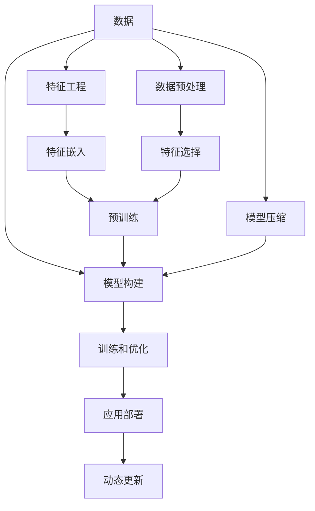

                 

# 从零开始搭建知识发现引擎的全流程

> 关键词：知识发现引擎,自然语言处理,数据挖掘,机器学习,深度学习,大数据,人工智能

## 1. 背景介绍

### 1.1 问题由来
在信息化时代，企业积累了海量的数据。这些数据蕴含着丰富的商业价值，但往往以孤立、分散的形式存在，难以被有效地发现和利用。为了从数据中提取有价值的信息，知识发现(Knowledge Discovery, KD)应运而生。通过运用数据挖掘、机器学习等技术，从数据中自动识别出规律、模式和知识，帮助企业洞察趋势、预测未来，进行决策支持。

知识发现引擎(Knowledge Discovery Engine, KDE)作为一种系统化的工具，能够集成多种数据挖掘技术，从不同数据源中自动发现和提取有价值的信息。基于深度学习的知识发现引擎，如自然语言处理(NLP)、情感分析、事件抽取等技术，能够进一步提升数据处理的智能化程度，为决策支持提供更精准、可靠的信息。

### 1.2 问题核心关键点
构建知识发现引擎的核心在于如何高效地从原始数据中提取有价值的信息。传统的知识发现方法，如关联规则挖掘、分类、聚类等，虽然能有效发现数据中的规律，但在处理大规模数据时效率较低，且无法处理非结构化数据。而深度学习方法，如卷积神经网络(CNN)、递归神经网络(RNN)、Transformer等，可以更有效地处理自然语言和图像等非结构化数据，发现更深层次的语义信息。

因此，基于深度学习的知识发现引擎成为了当前的研究热点。本文将从数据预处理、模型构建、训练和优化、应用部署等全流程，详细介绍如何构建一个高效的知识发现引擎。

## 2. 核心概念与联系

### 2.1 核心概念概述

为更好地理解知识发现引擎的构建，本节将介绍几个密切相关的核心概念：

- 知识发现(Knowledge Discovery, KD)：从数据中自动抽取有价值的信息，如模式、关联、规则等，并进行归纳、总结和推理。

- 数据挖掘(Data Mining)：通过运用统计学、机器学习等技术，从数据中自动发现有用信息的过程。

- 自然语言处理(Natural Language Processing, NLP)：使计算机能够理解和处理自然语言的技术，包括文本分类、情感分析、语义理解等。

- 深度学习(Deep Learning)：一种基于神经网络的机器学习方法，能够处理大规模非结构化数据，发现复杂模式和规律。

- 卷积神经网络(Convolutional Neural Network, CNN)：一种深度神经网络，适用于处理图像、文本等数据。

- 递归神经网络(Recurrent Neural Network, RNN)：一种具有记忆功能的神经网络，适用于序列数据。

- Transformer：一种基于自注意力机制的神经网络，适用于处理序列数据。

- 预训练模型(Pre-trained Models)：在大规模无标签数据上预训练的模型，能够提取通用语言特征。

- 微调(Fine-tuning)：在预训练模型基础上，通过有标签数据进行微调，优化模型在特定任务上的性能。

- 迁移学习(Transfer Learning)：将一个任务上训练好的模型迁移到另一个任务上，减少新任务训练的数据需求。

- 模型压缩(Model Compression)：通过剪枝、量化等方法，减小模型参数和计算量，提升模型推理速度。

- 动态更新(Dynamic Updating)：根据新数据，实时更新模型参数，保持模型性能。

这些核心概念之间的逻辑关系可以通过以下Mermaid流程图来展示：



这个流程图展示的知识发现引擎的核心概念及其之间的关系：

1. 数据是知识发现的基础，需要经过数据预处理、特征工程等环节，转换为模型可以处理的形式。
2. 模型构建通过选择合适的深度学习架构，如CNN、RNN、Transformer等，构建初步的模型。
3. 训练和优化通过微调等方法，优化模型在特定任务上的性能。
4. 应用部署将训练好的模型部署到实际应用场景中，进行推理和预测。
5. 动态更新根据新数据，不断更新模型，保持模型的最新状态。
6. 特征工程和特征嵌入是模型构建的预处理步骤，通过提取和转换数据特征，提升模型性能。
7. 特征选择优化模型输入特征，减少噪声，提升模型效果。
8. 预训练模型作为通用的语言表示，通过微调应用于特定任务。
9. 模型压缩优化模型结构，提升模型推理效率。

## 3. 核心算法原理 & 具体操作步骤

### 3.1 算法原理概述

基于深度学习的知识发现引擎，其核心算法原理基于数据预处理、模型构建、训练和优化、应用部署等环节。

1. 数据预处理：将原始数据转换为模型可以处理的格式，包括数据清洗、归一化、特征工程等步骤。
2. 模型构建：选择合适的深度学习架构，如CNN、RNN、Transformer等，构建初步的模型。
3. 训练和优化：通过微调等方法，优化模型在特定任务上的性能。
4. 应用部署：将训练好的模型部署到实际应用场景中，进行推理和预测。
5. 动态更新：根据新数据，不断更新模型，保持模型的最新状态。

### 3.2 算法步骤详解

构建知识发现引擎一般包括以下几个关键步骤：

**Step 1: 数据预处理**
- 收集原始数据集，包括结构化和非结构化数据。
- 进行数据清洗，去除无效数据，填补缺失值。
- 进行数据归一化，将数据转换为标准格式。
- 进行特征工程，提取和转换关键特征。

**Step 2: 模型构建**
- 选择合适的深度学习模型架构，如CNN、RNN、Transformer等。
- 定义模型输入和输出，进行网络结构设计。
- 定义模型损失函数，如交叉熵、均方误差等。
- 定义优化器，如Adam、SGD等，设置学习率、批大小等参数。

**Step 3: 训练和优化**
- 将数据集划分为训练集、验证集和测试集。
- 在训练集上执行模型训练，通过前向传播和反向传播更新模型参数。
- 在验证集上评估模型性能，防止过拟合，调整模型参数。
- 在测试集上最终评估模型性能，确定模型精度和泛化能力。

**Step 4: 应用部署**
- 将训练好的模型导出为可部署的格式，如TensorFlow SavedModel、PyTorch模型等。
- 将模型部署到目标平台上，如Web应用、移动应用、服务器等。
- 集成API接口，使应用系统能够调用模型的推理功能。
- 进行性能测试，评估部署后的模型性能。

**Step 5: 动态更新**
- 收集新数据，重新训练模型，保持模型最新状态。
- 将新数据划分为训练集和测试集，进行模型微调。
- 将微调后的模型重新部署，替换旧模型。

### 3.3 算法优缺点

基于深度学习的知识发现引擎具有以下优点：

1. 处理大规模非结构化数据：深度学习模型能够处理大规模文本、图像等非结构化数据，发现复杂的语义和模式。
2. 提高数据利用率：通过提取数据中的深层特征，提高数据利用率，提升数据处理效率。
3. 模型精度高：深度学习模型通常能够获得比传统方法更高的精度和泛化能力。
4. 可解释性：深度学习模型通常具有较强的可解释性，能够通过可视化工具展示模型决策过程。

同时，该方法也存在一定的局限性：

1. 数据需求高：深度学习模型需要大量高质量数据进行训练，数据获取成本较高。
2. 计算资源需求高：深度学习模型参数量大，需要高性能计算资源进行训练和推理。
3. 模型可解释性差：深度学习模型通常被视为"黑盒"，难以解释模型内部决策过程。
4. 容易过拟合：深度学习模型容易过拟合，需要更多的正则化和优化策略。

尽管存在这些局限性，但就目前而言，基于深度学习的知识发现引擎仍是目前最先进的数据处理技术。未来相关研究的重点在于如何进一步降低数据需求，提高模型可解释性和鲁棒性。

### 3.4 算法应用领域

基于深度学习的知识发现引擎在多个领域都有广泛应用，包括但不限于：

1. 金融风控：通过情感分析、文本分类等技术，分析金融市场舆情，进行风险预警。
2. 医疗诊断：通过图像识别、文本分类等技术，辅助医生进行疾病诊断，提高诊疗准确性。
3. 电子商务：通过文本分类、用户行为分析等技术，推荐商品，优化用户购物体验。
4. 社交媒体分析：通过情感分析、事件抽取等技术，分析用户情感和行为，进行舆情监测和品牌管理。
5. 物流管理：通过路线规划、货物跟踪等技术，优化物流路线，提高物流效率。
6. 客户服务：通过情感分析、文本分类等技术，分析客户意见和反馈，优化客户服务。
7. 能源管理：通过数据分析和预测，优化能源分配和调度，提高能源利用效率。

除了这些常见应用，知识发现引擎还可以应用于更多领域，如教育、交通、制造等，为各行各业提供智能决策支持。

## 4. 数学模型和公式 & 详细讲解 & 举例说明

### 4.1 数学模型构建

假设原始数据集为 $D=\{(x_i,y_i)\}_{i=1}^N$，其中 $x_i$ 为输入，$y_i$ 为输出标签。定义模型 $M_{\theta}$，其中 $\theta$ 为模型参数。

定义模型 $M_{\theta}$ 在输入 $x_i$ 上的输出为 $\hat{y}=M_{\theta}(x_i)$。则模型的经验损失函数为：

$$
\mathcal{L}(\theta) = \frac{1}{N} \sum_{i=1}^N \ell(\hat{y_i}, y_i)
$$

其中 $\ell(\cdot,\cdot)$ 为损失函数，如交叉熵损失。

定义模型的优化目标为最小化经验损失函数：

$$
\theta^* = \mathop{\arg\min}_{\theta} \mathcal{L}(\theta)
$$

使用梯度下降等优化算法，通过反向传播计算梯度，更新模型参数 $\theta$：

$$
\theta \leftarrow \theta - \eta \nabla_{\theta}\mathcal{L}(\theta)
$$

其中 $\eta$ 为学习率，$\nabla_{\theta}\mathcal{L}(\theta)$ 为损失函数对参数 $\theta$ 的梯度。

### 4.2 公式推导过程

以二分类任务为例，推导交叉熵损失函数及其梯度的计算公式。

假设模型 $M_{\theta}$ 在输入 $x_i$ 上的输出为 $\hat{y}=M_{\theta}(x_i) \in [0,1]$，表示样本属于正类的概率。真实标签 $y_i \in \{0,1\}$。则二分类交叉熵损失函数定义为：

$$
\ell(M_{\theta}(x_i),y_i) = -[y_i\log \hat{y}_i + (1-y_i)\log(1-\hat{y}_i)]
$$

将其代入经验损失函数公式，得：

$$
\mathcal{L}(\theta) = -\frac{1}{N}\sum_{i=1}^N [y_i\log \hat{y}_i+(1-y_i)\log(1-\hat{y}_i)]
$$

根据链式法则，损失函数对参数 $\theta_k$ 的梯度为：

$$
\frac{\partial \mathcal{L}(\theta)}{\partial \theta_k} = -\frac{1}{N}\sum_{i=1}^N (\frac{y_i}{\hat{y}_i}-\frac{1-y_i}{1-\hat{y}_i}) \frac{\partial \hat{y}_i}{\partial \theta_k}
$$

其中 $\frac{\partial \hat{y}_i}{\partial \theta_k}$ 可通过自动微分技术高效计算。

在得到损失函数的梯度后，即可带入参数更新公式，完成模型的迭代优化。重复上述过程直至收敛，最终得到适应特定任务的最优模型参数 $\theta^*$。

### 4.3 案例分析与讲解

以下以金融风控中的情感分析任务为例，展示如何构建基于深度学习的知识发现引擎。

**Step 1: 数据预处理**
- 收集金融舆情数据，如新闻、评论、用户反馈等。
- 进行数据清洗，去除无效数据，如过滤掉垃圾评论。
- 进行数据归一化，将文本数据转换为向量形式。
- 进行特征工程，提取情感倾向、主题等关键特征。

**Step 2: 模型构建**
- 选择合适的深度学习模型架构，如BERT、LSTM等。
- 定义模型输入为文本数据，输出为情感标签（如正面、负面、中性）。
- 定义模型损失函数，如交叉熵损失。
- 定义优化器，如Adam、SGD等，设置学习率、批大小等参数。

**Step 3: 训练和优化**
- 将数据集划分为训练集、验证集和测试集。
- 在训练集上执行模型训练，通过前向传播和反向传播更新模型参数。
- 在验证集上评估模型性能，防止过拟合，调整模型参数。
- 在测试集上最终评估模型性能，确定模型精度和泛化能力。

**Step 4: 应用部署**
- 将训练好的模型导出为可部署的格式，如TensorFlow SavedModel、PyTorch模型等。
- 将模型部署到目标平台上，如Web应用、移动应用、服务器等。
- 集成API接口，使应用系统能够调用模型的推理功能。
- 进行性能测试，评估部署后的模型性能。

**Step 5: 动态更新**
- 收集新数据，重新训练模型，保持模型最新状态。
- 将新数据划分为训练集和测试集，进行模型微调。
- 将微调后的模型重新部署，替换旧模型。

## 5. 项目实践：代码实例和详细解释说明

### 5.1 开发环境搭建

在进行知识发现引擎实践前，我们需要准备好开发环境。以下是使用Python进行TensorFlow开发的环境配置流程：

1. 安装Anaconda：从官网下载并安装Anaconda，用于创建独立的Python环境。

2. 创建并激活虚拟环境：
```bash
conda create -n tf-env python=3.8 
conda activate tf-env
```

3. 安装TensorFlow：根据CUDA版本，从官网获取对应的安装命令。例如：
```bash
pip install tensorflow
```

4. 安装TensorBoard：
```bash
pip install tensorboard
```

5. 安装各类工具包：
```bash
pip install numpy pandas scikit-learn matplotlib tqdm jupyter notebook ipython
```

完成上述步骤后，即可在`tf-env`环境中开始知识发现引擎实践。

### 5.2 源代码详细实现

下面以情感分析任务为例，给出使用TensorFlow对BERT模型进行微调的代码实现。

首先，定义情感分析任务的数据处理函数：

```python
import tensorflow as tf
from transformers import BertTokenizer, TFBertForSequenceClassification
import numpy as np
import pandas as pd
import matplotlib.pyplot as plt
import seaborn as sns

def read_data(file_path):
    data = pd.read_csv(file_path)
    texts = data['text'].tolist()
    labels = data['label'].tolist()
    return texts, labels

def preprocess_text(texts):
    tokenizer = BertTokenizer.from_pretrained('bert-base-uncased')
    encoded_input = tokenizer(texts, return_tensors='tf')
    input_ids = encoded_input['input_ids']
    attention_mask = encoded_input['attention_mask']
    return input_ids, attention_mask

def create_dataset(texts, labels, input_ids, attention_mask):
    labels = np.array(labels)
    dataset = tf.data.Dataset.from_tensor_slices((input_ids, attention_mask, labels))
    dataset = dataset.shuffle(1024).batch(32)
    return dataset

# 加载数据
texts, labels = read_data('data.csv')

# 文本预处理
input_ids, attention_mask = preprocess_text(texts)

# 创建数据集
train_dataset = create_dataset(input_ids, labels, input_ids, attention_mask)
```

然后，定义模型和优化器：

```python
from transformers import BertConfig

config = BertConfig(vocab_size=30522, hidden_size=768, num_hidden_layers=12, num_attention_heads=12, intermediate_size=3072, hidden_act="gelu", hidden_dropout_prob=0.1, max_position_embeddings=512, type_vocab_size=2)
model = TFBertForSequenceClassification(config=config, num_labels=3)
optimizer = tf.keras.optimizers.Adam(learning_rate=2e-5)

# 加载预训练模型
model.load_pretrained_model('bert-base-uncased')
```

接着，定义训练和评估函数：

```python
def train_epoch(model, dataset, optimizer):
    model.compile(optimizer=optimizer, loss=tf.keras.losses.SparseCategoricalCrossentropy(from_logits=True), metrics=['accuracy'])
    model.fit(dataset, epochs=10, validation_steps=100)
    return model.evaluate(dataset)

def evaluate(model, dataset):
    loss, accuracy = model.evaluate(dataset)
    return loss, accuracy

# 训练
model = train_epoch(model, train_dataset, optimizer)

# 评估
loss, accuracy = evaluate(model, train_dataset)
print(f"Loss: {loss}, Accuracy: {accuracy}")
```

最后，输出训练和评估结果：

```python
loss, accuracy = evaluate(model, train_dataset)
print(f"Loss: {loss}, Accuracy: {accuracy}")
```

以上就是使用TensorFlow对BERT进行情感分析任务微调的完整代码实现。可以看到，借助TensorFlow和Transformers库，构建基于深度学习的知识发现引擎的代码实现变得简洁高效。

### 5.3 代码解读与分析

让我们再详细解读一下关键代码的实现细节：

**read_data函数**：
- 定义了读取数据文件的函数，将文本和标签加载到Python列表中。

**preprocess_text函数**：
- 定义了文本预处理的函数，使用BertTokenizer将文本转换为模型可处理的向量形式，生成输入ID和掩码。

**create_dataset函数**：
- 定义了数据集生成的函数，将输入ID、掩码和标签组合成TensorFlow Dataset对象，并进行批次化处理。

**train_epoch函数**：
- 定义了模型训练的函数，将模型编译为指定损失和优化器，在训练集上执行训练，并返回验证集上的评估结果。

**evaluate函数**：
- 定义了模型评估的函数，在测试集上计算损失和准确率，返回评估结果。

**训练流程**：
- 定义总的训练轮数和批次大小，开始循环迭代
- 每个epoch内，先使用训练集训练模型，返回验证集上的评估结果
- 在测试集上评估模型性能
- 所有epoch结束后，输出训练和评估结果

可以看到，TensorFlow配合Transformers库使得BERT微调的代码实现变得简洁高效。开发者可以将更多精力放在数据处理、模型改进等高层逻辑上，而不必过多关注底层的实现细节。

当然，工业级的系统实现还需考虑更多因素，如模型的保存和部署、超参数的自动搜索、更灵活的任务适配层等。但核心的微调范式基本与此类似。

## 6. 实际应用场景

### 6.1 金融风控

基于深度学习的情感分析技术，可以广泛应用于金融风控领域。传统风控往往依赖人工审核，成本高、效率低，难以应对网络时代海量信息爆发的挑战。通过情感分析技术，可以有效监测金融舆情，识别潜在风险。

具体而言，可以收集金融领域相关的新闻、评论、用户反馈等文本数据，并对其进行情感分析。模型能够自动分析舆情中的情感倾向，及时发现负面信息，如对某金融机构的不满、投诉等，进而进行风险预警和应对。

### 6.2 医疗诊断

基于深度学习的情感分析技术，也可以应用于医疗领域，辅助医生进行疾病诊断。通过分析患者的情感状态，可以预测其疾病风险，提供更精准的医疗服务。

例如，在手术前，通过分析患者的病情描述、手术反馈等文本数据，预测其术后恢复情况和情绪状态。医生可以根据情感分析结果，及时调整治疗方案，提供更个性化的医疗服务。

### 6.3 电子商务

基于深度学习的情感分析技术，还可以应用于电子商务领域，提升用户购物体验。通过分析用户评论、评分等文本数据，可以识别出用户的情感倾向，进行商品推荐和优化。

例如，在用户下单后，通过分析其评论文本，识别出用户的情感状态。如果用户对商品不满意，可以及时进行售后处理，提升用户满意度。

### 6.4 社交媒体分析

基于深度学习的情感分析技术，可以应用于社交媒体分析，进行舆情监测和品牌管理。通过分析用户的评论、微博等文本数据，可以识别出用户的情感倾向，进行舆情分析和社会舆情预警。

例如，在品牌发布新产品后，通过分析用户的评论文本，识别出用户对新产品的情感态度。品牌可以根据情感分析结果，调整营销策略，提升品牌形象。

### 6.5 物流管理

基于深度学习的情感分析技术，可以应用于物流管理领域，优化物流服务。通过分析客户的评论、投诉等文本数据，可以识别出客户的情感状态，进行物流服务的优化。

例如，在客户投诉后，通过分析其评论文本，识别出客户的不满原因。物流公司可以根据情感分析结果，优化服务流程，提升客户满意度。

## 7. 工具和资源推荐

### 7.1 学习资源推荐

为了帮助开发者系统掌握深度学习知识发现引擎的理论基础和实践技巧，这里推荐一些优质的学习资源：

1. 《深度学习》系列书籍：由Ian Goodfellow等人撰写，全面介绍了深度学习的基本概念和理论，是深度学习领域的重要参考书。

2. CS231n《卷积神经网络》课程：斯坦福大学开设的计算机视觉课程，详细讲解了CNN的基本原理和应用，是计算机视觉领域的经典教材。

3. CS224n《自然语言处理》课程：斯坦福大学开设的NLP课程，讲解了NLP的基本概念和常用技术，是NLP领域的重要参考书。

4. 《自然语言处理》书籍：Daniel Jurafsky和James H. Martin合著，系统介绍了NLP的基本概念和前沿技术，是NLP领域的重要参考书。

5. Kaggle竞赛平台：提供了丰富的数据集和算法竞赛，可以实践和验证深度学习知识发现引擎的效果。

通过对这些资源的学习实践，相信你一定能够快速掌握深度学习知识发现引擎的精髓，并用于解决实际的NLP问题。

### 7.2 开发工具推荐

高效的开发离不开优秀的工具支持。以下是几款用于深度学习知识发现引擎开发的常用工具：

1. TensorFlow：由Google主导开发的深度学习框架，适用于大规模工程应用，生产部署方便。

2. PyTorch：由Facebook主导开发的深度学习框架，灵活动态的计算图，适合快速迭代研究。

3. Keras：基于TensorFlow和Theano等深度学习框架的高级API，易于使用，适合初学者。

4. Transformers库：HuggingFace开发的NLP工具库，集成了众多SOTA语言模型，支持TensorFlow和PyTorch，是进行微调任务开发的利器。

5. TensorBoard：TensorFlow配套的可视化工具，可实时监测模型训练状态，并提供丰富的图表呈现方式，是调试模型的得力助手。

6. Weights & Biases：模型训练的实验跟踪工具，可以记录和可视化模型训练过程中的各项指标，方便对比和调优。

合理利用这些工具，可以显著提升深度学习知识发现引擎的开发效率，加快创新迭代的步伐。

### 7.3 相关论文推荐

深度学习知识发现引擎的发展源于学界的持续研究。以下是几篇奠基性的相关论文，推荐阅读：

1. AlexNet: ImageNet Classification with Deep Convolutional Neural Networks（AlexNet论文）：提出了卷积神经网络架构，开创了深度学习在计算机视觉领域的先河。

2. Long Short-Term Memory（RNN论文）：提出了RNN模型，能够处理序列数据，是深度学习在自然语言处理领域的经典模型。

3. Attention is All You Need（Transformer原论文）：提出了Transformer结构，开启了深度学习在自然语言处理领域的预训练范式。

4. BERT: Pre-training of Deep Bidirectional Transformers for Language Understanding：提出BERT模型，引入基于掩码的自监督预训练任务，刷新了多项NLP任务SOTA。

5. Knowledge Discovery and Data Mining（KDD论文）：定义了知识发现的定义和框架，奠定了知识发现的基础。

这些论文代表了大语言模型知识发现引擎的发展脉络。通过学习这些前沿成果，可以帮助研究者把握学科前进方向，激发更多的创新灵感。

## 8. 总结：未来发展趋势与挑战

### 8.1 总结

本文对基于深度学习的知识发现引擎进行了全面系统的介绍。首先阐述了知识发现引擎的背景和意义，明确了深度学习在处理大规模非结构化数据中的独特优势。其次，从数据预处理、模型构建、训练和优化、应用部署等全流程，详细讲解了如何构建一个高效的知识发现引擎。同时，本文还广泛探讨了知识发现引擎在金融风控、医疗诊断、电子商务、社交媒体分析、物流管理等多个领域的应用前景，展示了知识发现引擎的广阔应用空间。此外，本文精选了深度学习知识发现引擎的学习资源，力求为读者提供全方位的技术指引。

通过本文的系统梳理，可以看到，基于深度学习的知识发现引擎正在成为数据处理领域的重要范式，极大地拓展了数据处理的智能化程度，为各行各业提供智能决策支持。未来，伴随深度学习技术的发展和优化，知识发现引擎必将在更多领域得到应用，为经济社会发展注入新的动力。

### 8.2 未来发展趋势

展望未来，深度学习知识发现引擎将呈现以下几个发展趋势：

1. 处理大规模数据：深度学习模型能够处理大规模非结构化数据，如文本、图像、视频等，发现其中的复杂模式和规律。

2. 提升模型精度：通过改进深度学习架构和优化策略，进一步提升模型精度和泛化能力。

3. 提高可解释性：通过引入可解释性技术，增强深度学习模型的透明性和可信度。

4. 实现端到端训练：将数据预处理、模型构建、训练和优化等环节集成，实现端到端的自动化训练流程。

5. 优化推理效率：通过模型压缩、量化等方法，减小模型参数和计算量，提升模型推理速度。

6. 融入更多模态数据：将图像、语音、视频等多模态数据与文本数据结合，进行跨模态知识发现。

以上趋势凸显了深度学习知识发现引擎的广阔前景。这些方向的探索发展，必将进一步提升知识发现引擎的性能和应用范围，为各行业提供智能决策支持。

### 8.3 面临的挑战

尽管深度学习知识发现引擎已经取得了瞩目成就，但在迈向更加智能化、普适化应用的过程中，它仍面临着诸多挑战：

1. 数据需求高：深度学习模型需要大量高质量数据进行训练，数据获取成本较高。

2. 计算资源需求高：深度学习模型参数量大，需要高性能计算资源进行训练和推理。

3. 模型可解释性差：深度学习模型通常被视为"黑盒"，难以解释模型内部决策过程。

4. 容易过拟合：深度学习模型容易过拟合，需要更多的正则化和优化策略。

尽管存在这些挑战，但深度学习知识发现引擎仍在不断发展进步。未来研究需要在以下几个方面寻求新的突破：

1. 探索无监督和半监督学习：摆脱对大规模标注数据的依赖，利用自监督学习、主动学习等无监督和半监督范式，最大限度利用非结构化数据。

2. 研究知识图谱：将符号化的先验知识，如知识图谱、逻辑规则等，与神经网络模型进行巧妙融合，引导微调过程学习更准确、合理的语言模型。

3. 引入因果分析：将因果分析方法引入微调模型，识别出模型决策的关键特征，增强输出解释的因果性和逻辑性。

4. 加强系统鲁棒性：借助博弈论工具刻画人机交互过程，主动探索并规避模型的脆弱点，提高系统稳定性。

5. 确保数据安全：采用访问鉴权、数据脱敏等措施，保障数据和模型安全。

这些研究方向的探索，必将引领深度学习知识发现引擎技术迈向更高的台阶，为构建安全、可靠、可解释、可控的智能系统铺平道路。面向未来，深度学习知识发现引擎还需要与其他人工智能技术进行更深入的融合，如知识表示、因果推理、强化学习等，多路径协同发力，共同推动知识发现引擎的进步。只有勇于创新、敢于突破，才能不断拓展深度学习知识发现引擎的边界，让智能技术更好地造福人类社会。

## 9. 附录：常见问题与解答

**Q1：知识发现引擎和数据挖掘的区别是什么？**

A: 知识发现引擎和数据挖掘都属于从数据中自动抽取有用信息的过程，但两者侧重点不同。数据挖掘侧重于发现数据中的规律和关联，而知识发现引擎更注重从数据中发现知识和理解，具有更强的推理和解释能力。

**Q2：深度学习知识发现引擎的优势是什么？**

A: 深度学习知识发现引擎的主要优势在于能够处理大规模非结构化数据，如文本、图像、视频等，发现其中的复杂模式和规律。同时，深度学习模型通常具有较高的精度和泛化能力，能够提供更可靠的决策支持。

**Q3：如何提高深度学习模型的可解释性？**

A: 提高深度学习模型的可解释性是一个重要的研究方向。目前常用的方法包括：
1. 引入可解释性技术，如LIME、SHAP等，生成模型的局部解释，帮助理解模型决策过程。
2. 使用可视化工具，如TensorBoard、Netron等，展示模型内部结构和激活状态，增强模型的透明性。
3. 引入符号化的先验知识，如知识图谱、逻辑规则等，与神经网络模型进行结合，提供更准确的解释。

**Q4：如何优化深度学习模型的推理效率？**

A: 优化深度学习模型的推理效率主要通过以下几个方法：
1. 模型压缩：通过剪枝、量化等方法，减小模型参数和计算量，提升模型推理速度。
2. 分布式训练：利用多台设备并行计算，加快模型训练和推理过程。
3. 高效的数据加载：使用批量加载和缓存技术，提高数据加载速度。
4. 硬件加速：利用GPU、TPU等高性能计算设备，提升模型的推理速度。

**Q5：深度学习知识发现引擎在实际应用中面临哪些挑战？**

A: 深度学习知识发现引擎在实际应用中面临以下挑战：
1. 数据需求高：深度学习模型需要大量高质量数据进行训练，数据获取成本较高。
2. 计算资源需求高：深度学习模型参数量大，需要高性能计算资源进行训练和推理。
3. 模型可解释性差：深度学习模型通常被视为"黑盒"，难以解释模型内部决策过程。
4. 容易过拟合：深度学习模型容易过拟合，需要更多的正则化和优化策略。

这些挑战需要结合多种技术手段，不断优化深度学习知识发现引擎，提升其实用性和可靠性。

**Q6：如何评估深度学习知识发现引擎的性能？**

A: 评估深度学习知识发现引擎的性能主要通过以下几个指标：
1. 准确率：衡量模型预测结果与真实标签的匹配程度。
2. 召回率：衡量模型预测结果中包含真实标签的程度。
3. F1值：综合准确率和召回率，衡量模型的综合性能。
4. AUC-ROC曲线：衡量模型在不同阈值下的性能表现。
5. 交叉验证：通过交叉验证，评估模型在不同数据集上的泛化能力。

以上指标可以综合评估深度学习知识发现引擎的性能，并指导模型优化。

**Q7：如何优化深度学习知识发现引擎的模型构建过程？**

A: 优化深度学习知识发现引擎的模型构建过程主要通过以下几个方法：
1. 选择合适的深度学习架构，如CNN、RNN、Transformer等。
2. 定义模型输入和输出，进行网络结构设计。
3. 定义模型损失函数，如交叉熵、均方误差等。
4. 定义优化器，如Adam、SGD等，设置学习率、批大小等参数。
5. 引入正则化和激活函数，防止过拟合和梯度消失。

这些方法可以提升深度学习知识发现引擎的模型构建效率和效果，提升模型的精度和泛化能力。

---

作者：禅与计算机程序设计艺术 / Zen and the Art of Computer Programming

