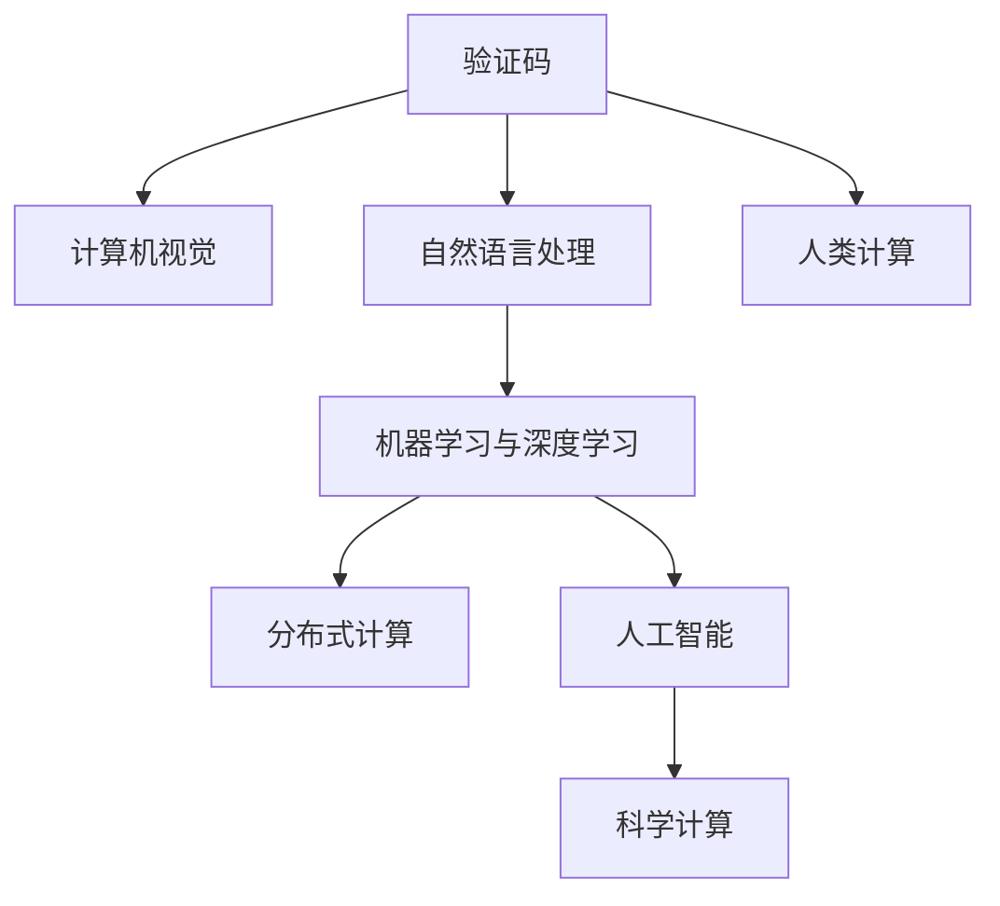

                 

# 从验证码到科学发现：人类计算的广泛应用

## 1. 背景介绍

随着计算机技术的迅猛发展，人工智能和大数据正在深刻改变我们生活的方方面面。从家庭生活、电子商务到科学研究，计算无处不在。特别是随着深度学习、计算机视觉和自然语言处理等领域的突破，计算已经在多个领域实现了广泛应用。然而，计算不仅仅是复杂算法的运用，更是一种跨学科、跨领域的技术方法。本文将探讨从验证码到科学发现，人类计算的广泛应用。

## 2. 核心概念与联系

### 2.1 核心概念概述

要理解人类计算的广泛应用，首先要掌握几个核心概念：

- **验证码（CAPTCHA）**：一种用于区分人类和计算机的挑战-响应测试。通常用于防止自动化脚本的恶意攻击。
- **计算视觉（CV）**：一门将视觉信号转换为计算机可处理的形式的学科，应用广泛，从图像识别到医学诊断等。
- **自然语言处理（NLP）**：研究如何让计算机处理和理解人类语言的技术，如机器翻译、情感分析、问答系统等。
- **机器学习与深度学习**：通过数据驱动的方法使计算机具备学习能力的算法，广泛应用于模式识别、推荐系统、自动驾驶等。
- **分布式计算**：通过多台计算机协同工作来提高计算效率的技术，如Hadoop、Spark等。
- **人工智能（AI）**：使计算机能够模拟、延伸和扩展人类智能的技术，包含机器学习、自然语言处理等多个子领域。
- **科学计算**：利用计算机科学解决科学问题的技术，涉及数学、物理、生物等多个学科，如天气预测、量子计算等。

这些概念之间相互联系，共同构成了人类计算的强大基础。下面通过一个Mermaid流程图展示这些概念之间的关系：



这些概念之间相互联系，共同构成了人类计算的强大基础。下面通过一个Mermaid流程图展示这些概念之间的关系：

## 3. 核心算法原理 & 具体操作步骤

### 3.1 算法原理概述

人类计算的广泛应用依赖于一系列核心算法的支持，这些算法包括但不限于：

- **验证码生成算法**：利用视觉、语言、逻辑等方法生成难以被自动化程序识别的验证码。
- **图像处理算法**：如图像增强、特征提取、分类、分割等，用于处理图像数据。
- **自然语言处理算法**：如分词、词向量、语义分析、机器翻译等，用于处理文本数据。
- **深度学习算法**：如卷积神经网络（CNN）、循环神经网络（RNN）、长短时记忆网络（LSTM）等，用于处理复杂的模式识别任务。
- **分布式计算算法**：如MapReduce、Spark等，用于处理大规模数据。
- **科学计算算法**：如牛顿迭代法、蒙特卡洛方法等，用于解决复杂的科学问题。

这些算法的核心原理可以简单概括为：

- **损失函数最小化**：通过最小化损失函数，优化模型参数，提升模型性能。
- **正则化**：防止过拟合，如L2正则化、Dropout等。
- **优化算法**：如梯度下降、Adam等，用于优化损失函数。
- **模型融合**：通过集成多个模型的预测结果，提升模型性能。

### 3.2 算法步骤详解

以验证码生成算法为例，其核心步骤如下：

1. **生成验证码图片**：使用随机数生成各种字符和背景图案，并通过图像处理算法将其组合成一张图片。
2. **检测验证码**：使用OCR算法（光学字符识别）识别图片中的字符。
3. **验证正确性**：将OCR结果与预定义字符进行比对，验证用户输入的正确性。

### 3.3 算法优缺点

验证码生成算法的主要优点包括：

- **难以被自动化程序识别**：通过添加各种干扰元素，使得自动化程序难以识别。
- **高效验证用户**：能够快速验证用户的输入是否正确，防止恶意攻击。

然而，验证码也存在一些缺点：

- **用户体验差**：需要用户手动输入验证码，增加了操作步骤。
- **可访问性问题**：对于视觉障碍用户，验证码增加了额外的难度。

### 3.4 算法应用领域

验证码生成算法广泛应用于互联网安全领域，防止恶意脚本的攻击。此外，自然语言处理和图像处理算法在各个领域都有广泛应用：

- **医学图像分析**：用于分析医疗影像，如X光片、CT扫描等，帮助医生进行诊断。
- **自动驾驶**：通过图像处理算法，使汽车能够识别道路标志、行人、车辆等，提高自动驾驶的安全性。
- **金融交易**：利用自然语言处理算法，自动识别交易指令，防止欺诈行为。
- **推荐系统**：通过分析用户行为数据，推荐合适的商品或内容。
- **智能客服**：利用自然语言处理算法，自动理解用户问题并提供解决方案。

## 4. 数学模型和公式 & 详细讲解 & 举例说明

### 4.1 数学模型构建

以图像处理算法为例，常见的数学模型包括：

- **灰度模型**：将彩色图像转换为灰度图像，简化处理过程。
- **卷积模型**：利用卷积神经网络进行图像分类、分割等任务。
- **循环模型**：利用循环神经网络处理序列数据，如文本和语音。

### 4.2 公式推导过程

以卷积神经网络（CNN）为例，其核心公式为：

$$
\begin{aligned}
y &= f(\sigma(\mathbf{W}^1 x + b^1)) \\
&= f(\sigma(\mathbf{W}^2 f(\sigma(\mathbf{W}^1 x + b^1)) + b^2))
\end{aligned}
$$

其中，$f$表示激活函数，$\sigma$表示Sigmoid函数。

### 4.3 案例分析与讲解

以医学图像分析为例，一个典型的应用场景是将X光片转换为数字图像，然后使用卷积神经网络进行分类和分割。

## 5. 项目实践：代码实例和详细解释说明

### 5.1 开发环境搭建

1. 安装Python：从官网下载并安装Python 3.x版本。
2. 安装NumPy、SciPy、Pandas等科学计算库。
3. 安装TensorFlow或PyTorch深度学习框架。
4. 安装OpenCV等计算机视觉库。
5. 安装NLTK、SpaCy等自然语言处理库。

### 5.2 源代码详细实现

以图像分类为例，以下是使用TensorFlow实现图像分类的代码：

```python
import tensorflow as tf
import numpy as np
import matplotlib.pyplot as plt

# 加载数据集
(x_train, y_train), (x_test, y_test) = tf.keras.datasets.mnist.load_data()

# 归一化数据
x_train, x_test = x_train / 255.0, x_test / 255.0

# 定义模型
model = tf.keras.Sequential([
    tf.keras.layers.Flatten(input_shape=(28, 28)),
    tf.keras.layers.Dense(128, activation='relu'),
    tf.keras.layers.Dropout(0.2),
    tf.keras.layers.Dense(10, activation='softmax')
])

# 编译模型
model.compile(optimizer='adam', loss='sparse_categorical_crossentropy', metrics=['accuracy'])

# 训练模型
model.fit(x_train, y_train, epochs=10, validation_data=(x_test, y_test))

# 评估模型
test_loss, test_acc = model.evaluate(x_test, y_test, verbose=2)

# 绘制混淆矩阵
confusion_matrix = tf.math.confusion_matrix(y_test, np.argmax(model.predict(x_test), axis=1))
plt.imshow(confusion_matrix, cmap=plt.cm.Blues)
plt.xlabel('Predicted')
plt.ylabel('True')
plt.show()
```

### 5.3 代码解读与分析

这段代码实现了简单的图像分类任务。首先，通过加载MNIST数据集，将像素值归一化到[0,1]范围内。然后定义了一个简单的神经网络模型，包含两个全连接层和Dropout正则化层。模型使用Adam优化器和交叉熵损失函数进行训练。最后，评估模型性能，并绘制混淆矩阵。

## 6. 实际应用场景

### 6.1 智能医疗

在智能医疗领域，计算技术可以用于医学影像分析、疾病预测和诊断等多个方面。例如，利用深度学习算法，可以从医学影像中自动识别出肿瘤、肿块等病变区域，辅助医生进行诊断。

### 6.2 自动驾驶

自动驾驶技术依赖于计算机视觉和自然语言处理算法。通过图像处理算法，自动驾驶汽车可以识别道路标志、行人、车辆等，避免交通事故。

### 6.3 智能客服

智能客服系统利用自然语言处理算法，自动理解用户问题并提供解决方案。这不仅可以提高客服效率，还能减少人工成本。

### 6.4 未来应用展望

未来，计算技术将在更多领域得到广泛应用，如智能家居、智能交通、智慧城市等。通过优化算法和改进模型，计算技术将能够更好地服务于人类社会，提高生活质量和工作效率。

## 7. 工具和资源推荐

### 7.1 学习资源推荐

1. **《深度学习》（Ian Goodfellow、Yoshua Bengio、Aaron Courville合著）**：系统介绍深度学习的基本原理和应用，是学习深度学习的经典教材。
2. **Coursera、edX等在线课程**：提供大量高质量的计算机科学和人工智能课程，涵盖从入门到高级的各种内容。
3. **Kaggle**：一个数据科学竞赛平台，可以参与各类数据科学和机器学习竞赛，提高实际应用能力。

### 7.2 开发工具推荐

1. **Jupyter Notebook**：一个开源的交互式编程环境，适合进行数据探索和算法实验。
2. **GitHub**：一个代码托管平台，方便版本控制和协作开发。
3. **TensorFlow、PyTorch**：两个流行的深度学习框架，具有强大的计算能力和丰富的资源库。

### 7.3 相关论文推荐

1. **ImageNet Classification with Deep Convolutional Neural Networks**：介绍使用CNN进行图像分类的经典论文。
2. **Attention is All You Need**：介绍使用Transformer进行自然语言处理的论文。
3. **Distributed Deep Learning with TensorFlow**：介绍使用TensorFlow进行分布式计算的论文。

## 8. 总结：未来发展趋势与挑战

### 8.1 研究成果总结

人类计算技术在多个领域得到了广泛应用，取得了显著的进展。从验证码生成到科学计算，计算技术已经成为推动科技进步的重要力量。

### 8.2 未来发展趋势

未来，计算技术将在更多领域得到应用，如智能家居、智能交通、智慧城市等。计算技术将与物联网、大数据等技术深度融合，进一步提升人类生活质量。

### 8.3 面临的挑战

尽管计算技术发展迅速，但仍面临一些挑战：

1. **数据隐私**：大规模数据收集和处理可能涉及隐私问题。
2. **计算资源**：大规模计算任务需要高性能计算资源，成本较高。
3. **模型泛化**：模型在特定领域数据上表现良好，但在新领域数据上泛化能力较弱。

### 8.4 研究展望

未来，需要进一步研究计算技术的效率和泛化能力，探索更多的算法和模型，以便更好地服务于人类社会。同时，需要加强对计算技术伦理和安全性的研究，确保技术应用的安全性和可信度。

## 9. 附录：常见问题与解答

### 9.1 如何提高计算算法的效率？

1. **算法优化**：优化算法的实现方式，如使用更高效的计算库。
2. **数据预处理**：通过数据清洗和特征选择，减少计算量。
3. **并行计算**：利用多核CPU、GPU等并行计算资源，加速计算过程。

### 9.2 如何选择适合的深度学习框架？

1. **框架特性**：根据任务需求选择适合的框架，如TensorFlow适用于大规模分布式计算，PyTorch适用于快速原型开发。
2. **社区支持**：选择社区活跃、文档丰富的框架，便于解决开发中的问题。

### 9.3 如何保护数据隐私？

1. **数据加密**：对数据进行加密，防止未经授权的访问。
2. **匿名化处理**：去除个人身份信息，保护用户隐私。
3. **差分隐私**：通过添加噪声，使得数据难以被反推到个体。

### 9.4 如何提升模型的泛化能力？

1. **数据增强**：通过数据增强技术，扩充训练集，提升模型泛化能力。
2. **模型集成**：通过模型集成技术，结合多个模型的预测结果，提高泛化能力。

### 9.5 未来计算技术的展望是什么？

1. **量子计算**：利用量子计算机进行更高效的计算。
2. **边缘计算**：在本地设备上进行计算，减少数据传输和延迟。
3. **全息计算**：通过全息技术实现三维计算，提高计算效率和精度。

作者：禅与计算机程序设计艺术 / Zen and the Art of Computer Programming

