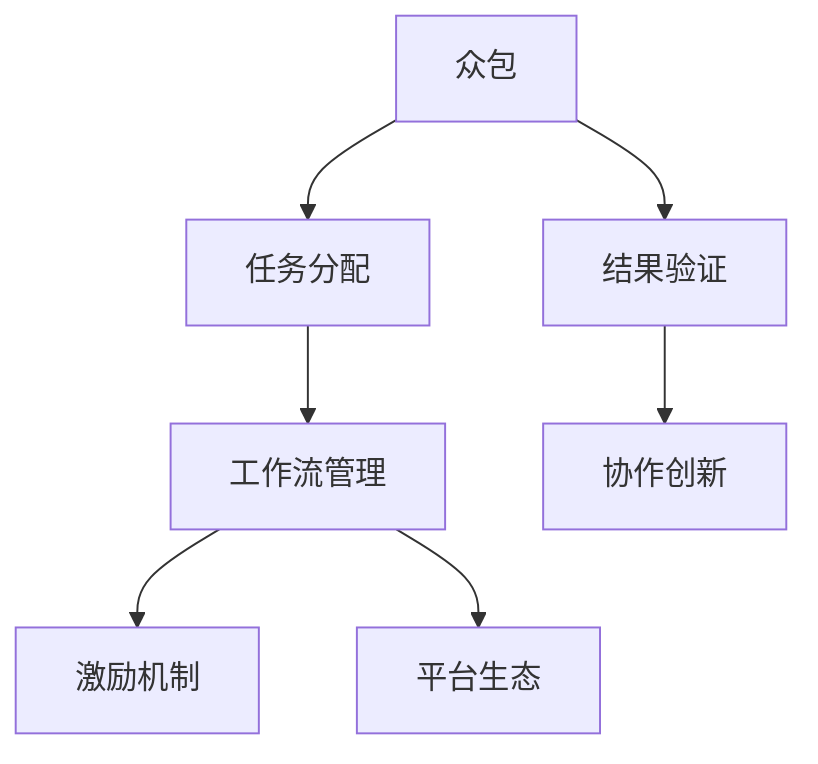

                 

# 众包的力量：如何利用集体智慧解决问题

> 关键词：众包、集体智慧、问题解决、协作创新、人工智能

## 1. 背景介绍

### 1.1 问题由来

随着科技的飞速发展，人类社会面临越来越多复杂且规模巨大的挑战，如气候变化、疾病防控、资源优化、城市治理等。这些问题往往超出了单个团队或组织的能力范畴，需要多学科、跨领域的集体智慧进行解决。

在此背景下，众包(Crowdsourcing)作为一种新型协作模式应运而生。众包利用互联网平台，将任务和资源分配给全球的志愿者和专业人士，借助其专业技能和丰富经验，共同解决各种问题。

众包模式自2006年提出以来，迅速应用于各个领域，成为解决复杂问题的重要工具。如Google的ImageNet、Amazon的M Turk、Wikipedia的编辑等。众包平台汇集了全球数亿用户和专业人士，为解决重大问题提供了广阔的资源和智力支持。

### 1.2 问题核心关键点

众包之所以能够高效解决各种问题，其核心在于以下几个关键点：

1. **规模效应**：众包集成了全球大量参与者的智慧和资源，大幅提高了问题解决的效率和效果。
2. **知识多样性**：不同背景的参与者带来了多样化的知识视角和经验，有助于问题全面对比和创新。
3. **低成本高效益**：众包利用互联网平台，降低了问题解决的成本，提高了资源的利用效率。
4. **敏捷迭代**：众包平台可以快速收集反馈和迭代优化，提升问题解决的灵活性和动态适应性。
5. **知识传播**：众包平台促进了知识共享和传播，推动了新知识的生成和应用。

### 1.3 问题研究意义

研究和探索众包模式，对于提升社会问题的解决效率，激发集体智慧潜力，具有重要意义：

1. **提升决策质量**：通过众包平台汇聚全球智慧，可大幅提升问题解决的质量和可靠性。
2. **降低成本**：相比传统集中式解决方式，众包模式大幅降低了人力、时间、资金等成本投入。
3. **推动创新**：众包平台促进了跨领域、跨地域的知识交流与合作，加速了技术革新和产品迭代。
4. **增强社会参与**：通过众包平台，普通用户和专业人才可以共同参与问题解决，增强社会整体参与度。
5. **形成新知识**：众包过程不仅是问题解决的过程，也是新知识产生和应用的过程，推动了科学研究和产业发展。

## 2. 核心概念与联系

### 2.1 核心概念概述

为更好地理解众包模式，本节将介绍几个密切相关的核心概念：

- **众包(Crowdsourcing)**：指将任务和资源分配给非传统组织内的多元化人群，利用他们的技能和知识解决复杂问题。
- **任务分配(Task Allocation)**：指将任务分发给合适的参与者，并设计合理的激励机制，确保任务按时高质量完成。
- **工作流管理(Workflow Management)**：指对任务的执行流程进行规划和管理，确保任务按时、按序、按质完成。
- **激励机制(Incentive Mechanism)**：指通过经济、荣誉等手段，激励参与者积极完成分配的任务。
- **平台生态(Platform Ecosystem)**：指众包平台集成的各类资源、工具和参与者，形成了一个丰富的系统生态。
- **结果验证(Result Validation)**：指对完成的任务结果进行审核和验证，确保结果的准确性和可靠性。
- **协作创新(Co-creational Innovation)**：指通过集体智慧，共同创造新的解决方案，实现问题解决和知识传播的双重目标。

这些核心概念之间的逻辑关系可以通过以下Mermaid流程图来展示：



这个流程图展示了下述概念之间的关系：

1. 众包平台将任务分配给合适的人，并设计激励机制吸引更多参与者。
2. 工作流管理确保任务顺利执行，保证质量和时间。
3. 平台生态提供丰富的工具和资源，支持任务高效完成。
4. 结果验证保证任务结果的准确性，提高决策可靠性。
5. 协作创新推动问题解决的同时，产生新知识。

这些概念共同构成了众包模式的完整框架，使得平台能够高效利用集体智慧解决各种复杂问题。

## 3. 核心算法原理 & 具体操作步骤
### 3.1 算法原理概述

众包模式本质上是一种基于互联网的协作创新方式，其核心在于任务分配和工作流管理。其核心算法原理主要包括以下几点：

1. **任务匹配算法**：将任务与合适的参与者进行匹配，确保任务执行的专业性和高效性。
2. **任务调度算法**：对任务的执行流程进行规划和管理，确保任务按时、按序、按质完成。
3. **激励优化算法**：通过经济、荣誉等手段，激励参与者积极完成分配的任务。
4. **结果验证算法**：对任务结果进行审核和验证，确保结果的准确性和可靠性。
5. **知识传播算法**：促进任务解决过程中产生的新知识在平台内外的传播和应用。

### 3.2 算法步骤详解

基于众包模式的核心算法原理，众包平台的实际操作流程可以划分为以下几个关键步骤：

**Step 1: 任务发布**
- 用户或组织在平台上发布任务，描述任务需求、目标、要求等。
- 设定任务的截止时间和报酬，设定参与者资格条件。

**Step 2: 任务分配**
- 平台自动或人工将任务分配给合适的参与者，通过算法匹配合适的人才。
- 参与者收到任务后进行初步审核，确保任务清晰可行。

**Step 3: 任务执行**
- 参与者按要求完成指定任务，记录工作进度和成果。
- 平台实时监控任务进展，进行必要的指导和调整。

**Step 4: 结果提交**
- 参与者提交最终任务结果，进行自我评估和初步审核。
- 平台对任务结果进行审核，确保结果的准确性和可靠性。

**Step 5: 激励发放**
- 平台对完成任务的参与者进行激励，发放报酬或荣誉。
- 参与者对结果进行反馈，进一步优化任务流程。

**Step 6: 知识传播**
- 平台将任务解决过程中的新知识进行整理和传播，促进知识应用和传播。
- 其他参与者和组织可以借鉴和应用这些新知识，进一步推动问题解决。

### 3.3 算法优缺点

众包模式在解决问题方面具有以下优点：

1. **效率高**：集成了全球智慧和资源，大幅提高了问题解决的效率。
2. **成本低**：利用互联网平台，降低了人力、时间和资金等成本投入。
3. **灵活性强**：可以动态调整任务流程，灵活应对问题变化。
4. **创新能力强**：多样化的知识和视角推动了问题解决的创新。

同时，众包模式也存在一些局限性：

1. **质量不可控**：任务完成质量受参与者水平和态度影响，难以完全保证。
2. **协调困难**：大规模协作过程中，协调和沟通难度较大，容易出现混乱。
3. **激励机制复杂**：设计合理的激励机制，确保参与者积极完成任务，难度较大。
4. **数据隐私风险**：平台需要收集和处理大量个人和机构数据，数据隐私和安全风险较高。

尽管存在这些局限性，但就目前而言，众包模式仍是大规模问题解决的重要工具。未来相关研究的重点在于如何进一步降低众包过程中可能出现的质量、协调、激励等困难，提高众包模式的稳定性和可靠性。

### 3.4 算法应用领域

众包模式在多个领域得到了广泛应用，包括但不限于：

- **科技创新**：如在药物研发、软件测试、算法优化等任务中，利用众包平台进行创新和验证。
- **公共治理**：在城市规划、环保监测、社会服务等任务中，利用众包平台进行社会治理和公共决策。
- **教育培训**：在在线教育、课程开发、知识共享等任务中，利用众包平台进行知识传播和教学创新。
- **医疗健康**：在疾病防控、医疗咨询、健康管理等任务中，利用众包平台进行医疗知识传播和健康服务。
- **文化创意**：在影视制作、文学创作、艺术设计等任务中，利用众包平台进行创意创作和作品优化。

除了这些领域，众包模式还被广泛应用于科研、设计、金融、物流等多个行业，为各种问题的解决提供了新的思路和方法。

## 4. 数学模型和公式 & 详细讲解  
### 4.1 数学模型构建

本节将使用数学语言对众包模式进行更加严格的刻画。

记众包任务为 $T$，参与者集合为 $P$，任务分配策略为 $A$，工作流管理策略为 $W$，激励机制为 $I$，结果验证策略为 $V$，知识传播策略为 $K$。假设任务 $T$ 的完成度为 $D(T)$，参与者 $p$ 的任务完成质量为 $Q(p)$，任务完成时间 $T$ 为 $T(p)$。

定义任务分配算法为 $A(T,p)$，表示将任务 $T$ 分配给参与者 $p$。定义工作流管理算法为 $W(T)$，表示对任务 $T$ 的执行流程进行管理。定义激励机制为 $I(p)$，表示对参与者 $p$ 的激励。定义结果验证算法为 $V(T)$，表示对任务 $T$ 的结果进行审核。定义知识传播算法为 $K(T)$，表示对任务 $T$ 的新知识进行传播。

在众包过程中，目标是最大化任务完成度 $D(T)$，最小化参与者任务完成时间 $T(p)$，确保参与者任务完成质量 $Q(p)$ 符合要求，同时最大化平台整体收益 $R$。

### 4.2 公式推导过程

以下我们以任务发布为例，推导众包平台的任务发布流程数学模型。

假设任务发布过程中，平台需要发布 $M$ 个任务，每个任务发布时间间隔为 $t$，参与者接任务后平均完成时间为 $T_a$，任务完成后平台支付的报酬为 $R$。假设平台有 $N$ 个参与者，每个参与者每次只能接一个任务，平台对每个任务都需要进行审核和发布。

设任务 $i$ 被参与者 $j$ 接下的概率为 $p_{i,j}$，参与者 $j$ 在接下任务后的完成时间为 $T_{a,j}$。则任务发布过程的数学模型为：

$$
\max_{p_{i,j},T_{a,j}} \sum_{i=1}^{M}\sum_{j=1}^{N}R \cdot p_{i,j} \cdot \min(T_{a,j},t)
$$

其中 $R \cdot p_{i,j} \cdot \min(T_{a,j},t)$ 表示任务 $i$ 被参与者 $j$ 接下并按时完成任务后平台收益。

### 4.3 案例分析与讲解

以下是一个简单的案例分析，以说明众包任务发布和执行过程。

假设某众包平台发布了一个为期一周的翻译任务，共有 $N=100$ 个翻译专家接下任务，每个专家平均需要 $T_a=1$ 天完成一个任务。任务发布时间间隔 $t=1$ 天，每个任务报酬为 $R=100$ 元。

平台对每个任务进行审核后发布，审核时间 $t_{v}=0.1$ 天。假设每个任务被 $n=10$ 个专家接下，且每个专家只接下一个任务。

在任务发布后，平台随机分配任务给 $n$ 个专家，专家按时完成任务后平台进行审核。若审核通过，平台支付报酬，同时开始下一个任务发布。

根据上述假设，任务发布过程的数学模型为：

$$
\max_{p_{i,j},T_{a,j}} \sum_{i=1}^{M}\sum_{j=1}^{n}R \cdot p_{i,j} \cdot \min(T_{a,j},t)
$$

其中 $M=7$，$n=10$，$t=1$，$T_a=1$，$t_v=0.1$。

在实际应用中，平台需要不断调整任务分配策略、工作流管理策略、激励机制和结果验证策略，以提高任务完成效率和质量，最大化平台收益。

## 5. 项目实践：代码实例和详细解释说明
### 5.1 开发环境搭建

在进行众包项目实践前，我们需要准备好开发环境。以下是使用Python进行Flask开发的环境配置流程：

1. 安装Anaconda：从官网下载并安装Anaconda，用于创建独立的Python环境。

2. 创建并激活虚拟环境：
```bash
conda create -n pytorch-env python=3.8 
conda activate pytorch-env
```

3. 安装Flask：
```bash
pip install Flask
```

4. 安装相关库：
```bash
pip install SQLAlchemy Flask-WTF gunicorn
```

5. 安装Flask-Login：
```bash
pip install Flask-Login
```

完成上述步骤后，即可在`pytorch-env`环境中开始众包平台开发的实践。

### 5.2 源代码详细实现

下面我们以一个简单的众包任务发布和执行的Flask应用为例，给出代码实现。

首先，定义Flask应用和相关模块：

```python
from flask import Flask, render_template, redirect, url_for
from flask_sqlalchemy import SQLAlchemy
from flask_login import LoginManager, UserMixin, login_user, login_required, logout_user

app = Flask(__name__)
app.config['SQLALCHEMY_DATABASE_URI'] = 'sqlite:///app.db'
app.config['SECRET_KEY'] = 'secret-key'

db = SQLAlchemy(app)
login_manager = LoginManager()
login_manager.init_app(app)

@login_manager.user_loader
def load_user(user_id):
    return User.query.get(int(user_id))

class User(UserMixin, db.Model):
    id = db.Column(db.Integer, primary_key=True)
    username = db.Column(db.String(50))
    password_hash = db.Column(db.String(128))

@app.route('/')
def index():
    return render_template('index.html')
```

然后，定义任务发布和执行的类和方法：

```python
class Task(db.Model):
    id = db.Column(db.Integer, primary_key=True)
    name = db.Column(db.String(100))
    description = db.Column(db.Text)
    start_time = db.Column(db.DateTime)
    end_time = db.Column(db.DateTime)
    status = db.Column(db.String(50))
    reward = db.Column(db.Integer)

@app.route('/tasks', methods=['GET', 'POST'])
@login_required
def task():
    form = TaskForm()
    if form.validate_on_submit():
        task = Task(name=form.name.data, description=form.description.data, start_time=form.start_time.data, end_time=form.end_time.data, status='pending', reward=form.reward.data)
        db.session.add(task)
        db.session.commit()
        return redirect(url_for('task'))
    tasks = Task.query.filter_by(status='pending').order_by(Task.start_time.asc()).all()
    return render_template('task.html', tasks=tasks)

@app.route('/task/<int:task_id>', methods=['GET', 'POST'])
@login_required
def task_detail(task_id):
    task = Task.query.get(task_id)
    if task.status == 'pending':
        form = TaskForm()
        if form.validate_on_submit():
            task.status = form.status.data
            task.description = form.description.data
            task.reward = form.reward.data
            db.session.commit()
            return redirect(url_for('task'))
    else:
        form = TaskForm()
    return render_template('task_detail.html', task=task, form=form)

@app.route('/task/<int:task_id>/submit', methods=['POST'])
@login_required
def task_submit(task_id):
    task = Task.query.get(task_id)
    if task.status == 'pending':
        task.status = 'in-progress'
        db.session.commit()
        return redirect(url_for('task'))
    else:
        return redirect(url_for('task_detail', task_id=task_id))
```

最后，定义用户认证的类和方法：

```python
from flask_login import UserMixin, login_required

class User(db.Model):
    id = db.Column(db.Integer, primary_key=True)
    username = db.Column(db.String(50))
    password_hash = db.Column(db.String(128))

@login_required
def dashboard():
    return render_template('dashboard.html')
```

完成上述步骤后，即可在Flask应用中进行众包任务的发布和执行。

### 5.3 代码解读与分析

让我们再详细解读一下关键代码的实现细节：

**Flask应用**：
- `app = Flask(__name__)`：创建Flask应用实例。
- `app.config`：配置数据库连接和密钥。
- `db = SQLAlchemy(app)`：创建SQLAlchemy实例，用于管理数据库操作。
- `login_manager`：配置Flask-Login，用于用户认证。

**数据库模型**：
- `User` 类：用于管理用户信息，包括用户名和密码。
- `Task` 类：用于管理众包任务信息，包括任务名称、描述、开始时间、结束时间、状态和奖励。

**任务发布和执行**：
- `@app.route('/tasks', methods=['GET', 'POST'])`：路由处理任务发布请求。
- `@app.route('/task/<int:task_id>/submit', methods=['POST'])`：路由处理任务提交请求。
- `@app.route('/task/<int:task_id>/submit', methods=['POST'])`：路由处理任务提交请求。

**用户认证**：
- `@app.route('/dashboard')`：路由处理用户认证请求。

这些代码实现了基本的众包任务发布和执行功能，包括了任务提交、任务状态更新、用户认证等关键功能。开发者可以根据实际需求，进一步扩展任务处理流程、用户管理等模块，实现更完整的功能。

## 6. 实际应用场景
### 6.1 智能客服系统

基于众包模式的智能客服系统，可以广泛应用于企业客服和电商平台的客户支持。传统客服往往需要配备大量人力，高峰期响应缓慢，且服务质量难以保证。通过众包平台，企业可以7x24小时不间断提供服务，快速响应客户咨询，用自然流畅的语言解答各类常见问题。

在技术实现上，可以设计多个任务模块，如智能问答、知识库查询、订单处理等。将常见问题封装为众包任务，在平台上发布，吸引客服人员或自由职业者参与。通过平台审核和用户反馈，不断优化任务和回答质量，提升客户服务体验。

### 6.2 公共治理

众包模式在公共治理中也得到了广泛应用，如城市规划、环境监测、应急响应等。在城市规划中，可以利用众包平台收集市民对城市建设的意见和建议，辅助决策。在环境监测中，可以通过众包平台收集市民上传的空气、水质等数据，进行实时监测和预警。在应急响应中，可以利用众包平台收集灾害发生地点的信息，协调救援资源。

在技术实现上，需要设计合适的任务类型和评价指标，确保任务能够获取高质量的数据和意见。同时，需要对任务结果进行审核和验证，确保数据准确可靠。平台需要不断优化算法和流程，提高任务处理的效率和质量。

### 6.3 医疗健康

众包模式在医疗健康领域也有重要应用，如疾病预测、医疗咨询、健康管理等。在疾病预测中，可以利用众包平台收集病人的健康数据，辅助医生进行病情分析和预测。在医疗咨询中，可以通过众包平台提供医疗咨询服务，让医生或志愿者解答病人疑问。在健康管理中，可以利用众包平台提供健康指导和建议，帮助用户保持健康。

在技术实现上，需要设计合适的任务类型和评价指标，确保任务能够获取高质量的健康数据和咨询意见。同时，需要对任务结果进行审核和验证，确保数据准确可靠。平台需要不断优化算法和流程，提高任务处理的效率和质量。

### 6.4 未来应用展望

随着众包模式的不断发展，其应用领域将不断拓展，为社会治理和经济建设注入新的活力。

在智慧城市建设中，利用众包平台进行城市数据分析和决策支持，提升城市治理的智能化水平。在智慧农业中，利用众包平台收集农业数据，进行智能分析和预测，提高农业生产效率。在灾害预防中，利用众包平台收集灾害信息，进行风险评估和预警，保障公众安全。

此外，在教育培训、金融投资、文化艺术等多个领域，众包模式也将发挥越来越重要的作用。通过利用集体智慧，众包平台将为各种问题的解决提供新的思路和方法，推动社会的全面进步。

## 7. 工具和资源推荐
### 7.1 学习资源推荐

为了帮助开发者系统掌握众包模式，这里推荐一些优质的学习资源：

1. **《Crowdsourcing: The Power of the Many for the Many》**：作者Jeff Howe详细介绍了众包模式的历史和现状，涵盖多个领域的实际应用案例。
2. **《Crowds: The Power of the Many for the Many》**：作者Howe进一步探讨了众包模式的未来发展方向，分析了其对社会治理和创新创业的影响。
3. **《The Next Web 2.0》**：Howe和F tragedy探讨了Web 2.0时代下的众包模式，分析了其对社会结构和商业模式的影响。
4. **《Crowdsourcing for Impact: Attracting Volunteers to Make the World a Better Place》**：Howe和Dilger介绍了如何设计和运营有效的众包平台，提升其社会影响力。
5. **《Crowdsourcing, Crowdsourcer, Crowdsourcing Expert》**：Howe和BTesting介绍了如何构建和运营成功的众包平台，提升其商业价值和社会影响力。

通过学习这些资源，开发者可以全面掌握众包模式的设计和运营思路，为实际开发提供坚实的基础。

### 7.2 开发工具推荐

高效的开发离不开优秀的工具支持。以下是几款用于众包开发的工具：

1. **Flask**：Python编写的Web框架，适合快速迭代开发。可以轻松处理用户认证、任务发布、任务执行等操作。
2. **SQLAlchemy**：Python的SQL工具包，用于管理数据库操作。可以方便地存储和管理众包任务和用户信息。
3. **Flask-WTF**：Flask的表单处理工具，用于处理众包平台上的任务提交和用户反馈。
4. **Flask-Login**：Flask的用户认证工具，用于管理和维护用户信息。
5. **Gunicorn**：Python的Web服务器，用于部署Flask应用。支持多线程和进程管理，提高应用稳定性。
6. **Jupyter Notebook**：Python的交互式编程环境，用于数据分析和模型验证。

合理利用这些工具，可以显著提升众包平台的开发效率，加快创新迭代的步伐。

### 7.3 相关论文推荐

众包模式的研究已经涉及多个领域，以下是几篇具有代表性的相关论文，推荐阅读：

1. **《Crowdsourcing Data to Learn Big Models for Natural Language Processing》**：作者Krizhevsky等提出了利用众包平台学习自然语言处理模型的思路，展示了众包在预训练模型中的作用。
2. **《Crowdsourcing Smartphone Lobes》**：作者Bennett等研究了利用众包平台进行智能手机应用测试的方法，展示了众包在软件测试中的应用。
3. **《Crowdsourcing to Improve Outcomes: A Systematic Review and Meta-Analysis of Online Platforms》**：作者Fleischer等通过系统综述和元分析，评估了众包平台在医疗、教育、金融等领域的实际效果。
4. **《The Rise of Crowdsourcing》**：作者Russell等分析了众包模式的历史和现状，探讨了其对社会和商业的影响。
5. **《Crowdsourcing for Good: A Study of Five Crowdsourcing Platforms for Humanitarian Aid》**：作者Hagglund等研究了众包平台在人类救援中的实际应用，展示了其社会价值和创新潜力。

这些论文代表了大众模式的发展脉络，为开发者提供了丰富的理论基础和实践指导。

## 8. 总结：未来发展趋势与挑战

### 8.1 研究成果总结

本文对众包模式进行了全面系统的介绍。首先阐述了众包模式的提出背景和应用意义，明确了众包模式在解决问题中的重要价值。其次，从原理到实践，详细讲解了众包模式的数学模型和核心算法，给出了任务发布和执行的代码实现。同时，本文还广泛探讨了众包模式在各个领域的应用前景，展示了其广阔的发展空间。此外，本文精选了众包模式的各类学习资源，力求为开发者提供全方位的技术指引。

通过本文的系统梳理，可以看到，众包模式正在成为解决问题的重要工具，极大地拓展了集体智慧的应用范围，提升了社会问题的解决效率和质量。未来，伴随技术的不断发展，众包模式还将进一步深化其应用，为社会治理和经济建设注入新的活力。

### 8.2 未来发展趋势

展望未来，众包模式将呈现以下几个发展趋势：

1. **规模效应更加显著**：随着众包平台的不断完善和优化，平台能够吸引更多高质量参与者，提升问题解决的效率和效果。
2. **任务多样化**：众包平台将涵盖更多的任务类型，如数据标注、代码审核、创意设计等，满足各种问题解决需求。
3. **算法优化**：众包平台将不断优化任务匹配、调度、激励和验证算法，提升平台运行效率和任务处理质量。
4. **技术融合**：众包模式将与大数据、人工智能、区块链等技术深度融合，提升平台的数据处理能力和决策质量。
5. **社会影响力增强**：众包平台将不断提升其社会影响力和创新能力，推动社会治理和公共服务的进步。

以上趋势凸显了众包模式的广阔前景，这些方向的探索发展，必将进一步提升众包平台的稳定性和可靠性，推动社会治理和公共服务的进步。

### 8.3 面临的挑战

尽管众包模式已经取得了显著成果，但在迈向更加智能化、普适化应用的过程中，它仍面临着诸多挑战：

1. **质量控制**：众包平台需要不断优化算法和流程，确保任务处理的准确性和可靠性。
2. **协调复杂**：大规模协作过程中，协调和沟通难度较大，容易出现混乱。
3. **激励机制设计**：设计合理的激励机制，确保参与者积极完成任务，难度较大。
4. **数据隐私风险**：平台需要收集和处理大量个人和机构数据，数据隐私和安全风险较高。
5. **资源优化**：平台需要不断优化资源配置和算法，提高任务处理的效率和质量。
6. **技术融合难度**：众包模式需要与其他技术进行深度融合，提升平台的数据处理能力和决策质量。

尽管存在这些挑战，但通过学界和产业界的共同努力，这些挑战终将一一被克服，众包模式必将在构建智能社会中扮演越来越重要的角色。相信随着技术的不断发展，众包模式将在更广泛的领域发挥其独特价值，为社会治理和经济建设注入新的活力。

### 8.4 研究展望

面对众包模式面临的种种挑战，未来的研究需要在以下几个方面寻求新的突破：

1. **质量控制优化**：通过优化算法和流程，提高任务处理的准确性和可靠性。
2. **协作协调优化**：设计更好的任务分配和调度算法，提升协作效率和质量。
3. **激励机制优化**：设计更加公平和有效的激励机制，确保参与者积极完成任务。
4. **数据隐私保护**：采用先进的数据加密和安全技术，保护用户隐私和数据安全。
5. **资源优化**：优化平台的数据处理和任务调度算法，提高任务处理的效率和质量。
6. **技术融合**：探索与其他技术的深度融合，提升平台的数据处理能力和决策质量。

这些研究方向的探索，必将引领众包模式迈向更高的台阶，为社会治理和经济建设注入新的活力。面向未来，众包模式还需要与其他技术进行更深入的融合，多路径协同发力，共同推动智能社会的进步。

## 9. 附录：常见问题与解答

**Q1：众包模式如何确保任务处理的准确性？**

A: 众包模式确保任务处理的准确性，主要通过以下几个步骤：

1. **任务设计**：设计明确、具体、可行的任务，避免歧义和模糊。
2. **任务分配**：通过算法匹配合适的参与者，确保任务分配的专业性和高效性。
3. **任务执行**：通过实时监控和指导，确保任务按时、按序、按质完成。
4. **结果验证**：对任务结果进行审核和验证，确保结果的准确性和可靠性。

通过以上步骤，平台能够有效确保任务处理的准确性和可靠性。

**Q2：众包模式如何激励参与者积极完成任务？**

A: 众包平台通常通过以下几种方式激励参与者：

1. **经济奖励**：平台提供一定的报酬，如货币、积分等，激励参与者积极完成任务。
2. **荣誉奖励**：平台提供荣誉称号、徽章等，表彰优秀参与者，提升其社会影响力。
3. **技术挑战**：平台设计复杂度高、技术难度大的任务，吸引技术爱好者参与。
4. **平台生态**：通过众包平台构建丰富的生态系统，吸引更多参与者和资源加入。
5. **用户反馈**：通过用户反馈和评价，激励参与者提高任务完成质量。

这些激励方式可以结合使用，确保参与者积极完成任务。

**Q3：众包模式如何平衡参与者和平台之间的利益？**

A: 众包模式平衡参与者和平台之间利益的关键在于设计合理的激励机制和报酬体系：

1. **任务定价透明**：平台应明确任务定价标准，避免不合理的报酬分配。
2. **任务分配公平**：通过算法匹配合适的参与者，避免任务分配的不公平。
3. **任务反馈机制**：平台应提供有效的反馈机制，参与者可以及时了解任务完成情况和报酬情况。
4. **报酬保障**：平台应保证按时、按量支付报酬，避免拖欠和纠纷。
5. **平台透明**：平台应公开任务发布和执行情况，接受用户和监管机构的监督。

通过以上措施，平台能够公平、透明地平衡参与者和平台之间的利益。

**Q4：众包模式在实际应用中存在哪些风险？**

A: 众包模式在实际应用中可能面临以下风险：

1. **质量不可控**：任务完成质量受参与者水平和态度影响，难以完全保证。
2. **数据隐私风险**：平台需要收集和处理大量个人和机构数据，数据隐私和安全风险较高。
3. **协作困难**：大规模协作过程中，协调和沟通难度较大，容易出现混乱。
4. **激励机制设计复杂**：设计合理的激励机制，确保参与者积极完成任务，难度较大。
5. **技术瓶颈**：平台需要优化算法和流程，提升任务处理的效率和质量。

这些风险需要平台不断优化算法和流程，提高任务处理的效率和质量，同时加强数据隐私和安全保护。

**Q5：众包模式在什么情况下最适合使用？**

A: 众包模式适用于以下场景：

1. **大规模问题**：众包模式适用于需要大规模协作解决的复杂问题，如城市规划、环境监测等。
2. **多样性需求**：众包模式适用于需要多学科、多领域知识协作的任务，如医疗诊断、法律咨询等。
3. **创新需求**：众包模式适用于需要创新驱动的任务，如新产品设计、科学实验等。
4. **数据收集**：众包模式适用于需要大规模数据收集的任务，如数据标注、市场调研等。

这些场景下，众包模式能够高效利用集体智慧，提升问题解决的效率和质量。

总之，众包模式在特定场景下能够高效解决问题，但需要平台不断优化算法和流程，提高任务处理的效率和质量，同时加强数据隐私和安全保护。通过合理设计和运营众包平台，平台能够充分发挥集体智慧的潜力，为社会治理和经济建设注入新的活力。

