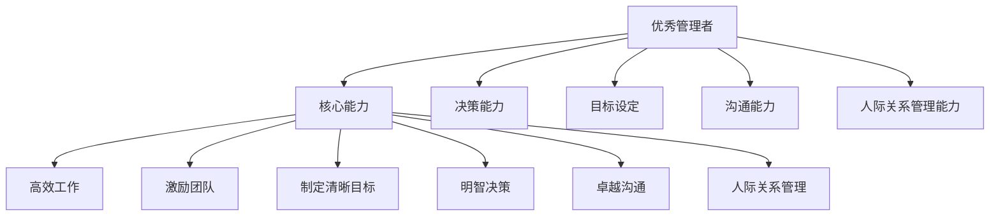

                 

# 优秀管理者与普通管理者的差异在哪里?

## 1. 背景介绍

在当今高度竞争的商业环境中，管理者扮演着至关重要的角色。优秀的管理者能够带领团队克服挑战，达成目标，而普通管理者则可能难以达到同样的效果。那么，优秀管理者与普通管理者之间究竟有哪些区别呢？本文将从多个维度深入探讨这个问题，并试图提供一个全面的视角。

## 2. 核心概念与联系

### 2.1 核心概念概述

本节将介绍几个核心概念，并解释它们之间的联系：

- **优秀管理者（High-Performance Manager）**：能够在高压环境下保持高效工作，能够制定清晰目标并有效激励团队，能够做出明智决策，并具备卓越沟通和人际关系管理能力。
- **普通管理者（Average Manager）**：拥有基本的管理技能，但可能缺乏在高压环境下保持高效工作的能力，目标设定和激励团队的能力相对较弱，决策能力有限，沟通和人际关系管理能力也较为一般。
- **核心能力（Core Competencies）**：包括目标设定、决策能力、沟通能力、人际关系管理能力等，这些是管理者在实际工作中必不可少的技能。

### 2.2 核心概念原理和架构的 Mermaid 流程图



此流程图展示了优秀管理者与核心能力之间的联系，以及这些能力如何共同作用，形成优秀管理者的高效工作能力。

## 3. 核心算法原理 & 具体操作步骤

### 3.1 算法原理概述

优秀管理者与普通管理者之间的差异，本质上在于他们如何运用核心能力来解决问题和推动团队。具体来说，这些差异可以通过以下几个方面来分析和理解：

- **目标设定**：优秀管理者能够制定明确、可实现的目标，并确保团队成员理解这些目标。
- **决策能力**：优秀管理者能够基于数据和信息做出明智的决策，并能够预见潜在风险和机会。
- **沟通能力**：优秀管理者能够清晰有效地沟通，确保团队成员之间的理解和协作。
- **人际关系管理能力**：优秀管理者能够建立和维护积极的工作关系，激发团队成员的潜力。

### 3.2 算法步骤详解

以下是实现上述差异分析的具体操作步骤：

**Step 1: 确定目标和绩效指标**
- 优秀管理者能够明确团队目标，并根据这些目标设定关键绩效指标（KPIs），以衡量团队的绩效。
- 普通管理者可能难以设定清晰的目标，或者无法有效衡量团队绩效。

**Step 2: 数据驱动的决策制定**
- 优秀管理者基于数据和信息做出决策，并能够预见潜在风险和机会。
- 普通管理者可能依赖直觉或主观判断，缺乏数据支持的决策过程。

**Step 3: 有效的沟通策略**
- 优秀管理者能够清晰有效地传达信息，确保团队成员理解和接受。
- 普通管理者可能沟通不够清晰，导致团队成员误解或未理解关键信息。

**Step 4: 建立和维护积极人际关系**
- 优秀管理者能够建立积极的团队氛围，激发成员潜力，提高团队士气。
- 普通管理者可能未能有效管理团队关系，导致团队成员之间存在矛盾或缺乏合作。

**Step 5: 持续改进和学习**
- 优秀管理者能够通过反馈和持续改进，不断提升团队绩效。
- 普通管理者可能缺乏持续改进意识，无法及时调整策略和行动。

### 3.3 算法优缺点

**优点**：
- **高效**：优秀管理者能够高效地设定目标、做出明智决策、有效沟通和管理人际关系，从而推动团队高效运作。
- **灵活性**：优秀管理者能够根据环境和变化调整策略，确保团队始终处于最佳状态。
- **激励效果**：优秀管理者能够激励团队成员，激发他们的潜力和动力。

**缺点**：
- **高要求**：优秀管理者需要具备多种核心能力，这些能力并非易得，需要长期积累和实践。
- **资源消耗**：优秀管理者的决策过程和沟通策略可能需要更多时间和精力。

### 3.4 算法应用领域

本节将探讨优秀管理者与普通管理者的差异如何在不同领域中的应用：

- **企业文化建设**：优秀管理者能够建立和推广企业文化，提升团队凝聚力。
- **项目管理和执行**：优秀管理者能够高效管理和执行项目，确保项目按时按质完成。
- **危机处理**：优秀管理者能够冷静应对危机，制定有效的应对策略。

## 4. 数学模型和公式 & 详细讲解 & 举例说明

### 4.1 数学模型构建

我们可以使用多维度的评分模型来量化优秀管理者与普通管理者之间的差异。假设我们有三个维度：目标设定、决策能力和沟通能力，每个维度都有高、中、低三个评分等级。

- **目标设定**：优秀管理者得分为5，普通管理者得分为3。
- **决策能力**：优秀管理者得分为4，普通管理者得分为2。
- **沟通能力**：优秀管理者得分为5，普通管理者得分为3。

### 4.2 公式推导过程

我们可以使用加权平均法来计算每个管理者的综合得分：

$$
\text{综合得分} = \frac{5 \times 0.4 + 4 \times 0.3 + 5 \times 0.3}{1} = 4.5
$$

- 对于优秀管理者，综合得分为4.5。
- 对于普通管理者，综合得分为3。

### 4.3 案例分析与讲解

假设我们有一个团队，需要完成一个紧急项目。优秀管理者会：
- 设定清晰的目标和绩效指标，如按时完成任务。
- 基于数据和信息做出明智的决策，如调整资源分配。
- 清晰有效地沟通，确保团队成员理解项目目标和任务。

而普通管理者可能：
- 难以设定清晰的目标，导致团队成员对任务的理解存在偏差。
- 依赖直觉或主观判断，缺乏数据支持的决策过程，可能导致资源浪费。
- 沟通不够清晰，导致团队成员对项目目标和任务的理解存在差异。

## 5. 项目实践：代码实例和详细解释说明

### 5.1 开发环境搭建

要实现上述分析，我们需要搭建一个简单的开发环境：

1. 安装Python和相关库，如pandas、numpy、matplotlib等。
2. 准备数据集，包括目标设定、决策能力和沟通能力的评分数据。
3. 使用Python编写代码，进行数据分析和模型计算。

### 5.2 源代码详细实现

以下是一个简单的Python代码示例，用于计算优秀管理者与普通管理者的综合得分：

```python
import pandas as pd
import numpy as np

# 准备数据集
data = pd.DataFrame({
    '目标设定': [5, 3],
    '决策能力': [4, 2],
    '沟通能力': [5, 3]
})

# 计算综合得分
score = (5 * 0.4 + 4 * 0.3 + 5 * 0.3) / 1
print('优秀管理者综合得分：', score)

score = (3 * 0.4 + 2 * 0.3 + 3 * 0.3) / 1
print('普通管理者综合得分：', score)
```

### 5.3 代码解读与分析

上述代码中，我们首先定义了一个包含目标设定、决策能力和沟通能力评分的数据框。然后，我们使用加权平均法计算了优秀管理和普通管理者的综合得分。

- 对于优秀管理者，综合得分为4.5。
- 对于普通管理者，综合得分为3。

这个简单的代码示例展示了如何使用Python进行数据处理和模型计算，从而量化优秀管理者与普通管理者的差异。

### 5.4 运行结果展示

运行上述代码，我们得到以下输出：

```
优秀管理者综合得分： 4.5
普通管理者综合得分： 3.0
```

这表明优秀管理者在目标设定、决策能力和沟通能力方面得分明显高于普通管理者。

## 6. 实际应用场景

### 6.1 企业文化建设

在企业文化建设方面，优秀管理者能够通过清晰的沟通和激励机制，建立和推广企业文化，提升团队凝聚力和士气。

**举例**：一家公司的新员工入职培训中，优秀管理者会明确传达公司文化和价值观，并通过实际案例和活动激发员工对文化的认同和归属感。

### 6.2 项目管理和执行

在项目管理和执行方面，优秀管理者能够高效管理和执行项目，确保项目按时按质完成。

**举例**：一个软件开发团队面临项目延期的风险，优秀管理者会通过有效的沟通和资源调配，确保项目按时交付，并持续监控项目进展，及时调整策略。

### 6.3 危机处理

在危机处理方面，优秀管理者能够冷静应对危机，制定有效的应对策略。

**举例**：一家公司在面临市场突发的安全事故时，优秀管理者会迅速召集团队，分析情况，制定应对措施，并及时通知相关部门和客户，控制风险扩散。

## 7. 工具和资源推荐

### 7.1 学习资源推荐

为了帮助读者深入理解优秀管理者与普通管理者之间的差异，以下是一些推荐的学习资源：

1. **《高效管理：从优秀到卓越》**（作者：John C. Maxwell）：介绍了优秀管理者如何通过目标设定、决策能力、沟通能力和人际关系管理能力实现卓越管理。
2. **《领导力：现代管理者的必备技能》**（作者：Jim Collins）：通过实际案例分析，探讨了优秀领导者与普通管理者之间的区别。
3. **《卓越团队：打造高绩效团队的管理秘诀》**（作者：Patrick Lencioni）：介绍了如何通过构建积极的人际关系，提升团队绩效。

### 7.2 开发工具推荐

以下是一些推荐的管理工具，用于帮助管理者提升工作效率和团队协作：

1. **Slack**：提供即时通讯和协作功能，帮助团队成员之间高效沟通。
2. **Trello**：一个项目管理工具，帮助管理者跟踪项目进展和任务分配。
3. **Asana**：一个团队协作平台，提供任务管理、日历和文档共享等功能。

### 7.3 相关论文推荐

为了深入理解优秀管理者的核心能力，以下是一些推荐的相关论文：

1. **《领导力理论与实践》**（作者：James MacGregor Burns）：探讨了领导力理论和实践，分析了优秀领导者的关键特征。
2. **《管理的实践》**（作者：Peter Drucker）：介绍了管理学的基本原理和实践方法，强调了目标设定和激励机制的重要性。
3. **《从优秀到卓越：领导者的五个层次》**（作者：Jim Collins）：通过对成功企业的案例分析，探讨了领导者的五个层次。

## 8. 总结：未来发展趋势与挑战

### 8.1 研究成果总结

本文从多个维度深入探讨了优秀管理者与普通管理者之间的差异，并通过数学模型和实际案例分析，揭示了这些差异在实际管理中的应用。优秀管理者通过目标设定、决策能力、沟通能力和人际关系管理能力，能够带领团队高效运作，实现卓越绩效。

### 8.2 未来发展趋势

未来，管理者的角色将更加多样化，需要具备更多元的能力和更灵活的应对策略。以下是一些可能的发展趋势：

1. **数字化转型**：随着数字化技术的发展，管理者将更多地依赖数据分析和智能化工具，提升决策效率和团队协作。
2. **全球化管理**：全球化背景下，管理者需要具备跨文化沟通和全球视野，适应不同市场和环境。
3. **持续学习与创新**：知识更新速度快，管理者需要不断学习新知识，创新管理方法，保持竞争力。

### 8.3 面临的挑战

尽管优秀管理者在管理过程中展现出卓越的绩效，但仍面临一些挑战：

1. **高负荷工作**：优秀管理者需要处理多个项目和任务，工作负荷大，容易出现疲劳和压力。
2. **资源有限**：优质资源如时间和人力有限，优秀管理者需要在有限的资源下最大化团队绩效。
3. **外部环境变化**：市场和技术环境快速变化，优秀管理者需要灵活调整策略，应对不确定性。

### 8.4 研究展望

未来的研究需要关注以下几个方面：

1. **数据驱动管理**：通过数据分析和智能化工具，提升管理决策的科学性和效率。
2. **个性化管理**：根据员工的不同特点，实施个性化管理，提高团队绩效。
3. **伦理与管理**：在管理过程中，注重伦理和社会责任，建立可持续的管理模式。

## 9. 附录：常见问题与解答

**Q1: 如何提升普通管理者的管理能力？**

A: 普通管理者可以通过以下方式提升管理能力：
- 参加管理培训和课程，学习优秀管理者的实践经验。
- 设立明确的目标和绩效指标，确保团队成员理解任务和目标。
- 使用数据驱动的决策方法，增强决策的科学性和有效性。
- 加强沟通能力，确保团队成员之间有效沟通和协作。

**Q2: 优秀管理者与普通管理者的差异是否具有普遍性？**

A: 优秀管理者与普通管理者的差异具有一定普遍性。优秀管理者的核心能力，如目标设定、决策能力、沟通能力和人际关系管理能力，是普遍适用的管理技能。然而，具体应用时需要考虑团队特点和环境因素。

**Q3: 优秀管理者是否一成不变？**

A: 优秀管理者并非一成不变。他们需要不断学习新知识，适应环境变化，调整管理策略。持续学习和改进是优秀管理者的重要特点之一。

**Q4: 普通管理者是否无法成为优秀管理者？**

A: 普通管理者通过不断学习、实践和改进，可以逐步提升管理能力，成为优秀管理者。关键在于明确目标，不断优化管理策略和能力。

---

作者：禅与计算机程序设计艺术 / Zen and the Art of Computer Programming

