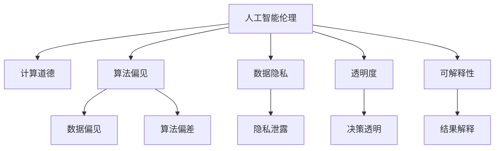

                 

# 伦理挑战：探讨人类计算带来的道德困境

> 关键词：人工智能伦理,计算道德,算法偏见,隐私保护,透明度,可解释性

## 1. 背景介绍

在当今信息爆炸的时代，人工智能(AI)技术已经深刻地融入到社会的方方面面，从智能家居到自动驾驶，从工业自动化到金融分析，AI技术带来了巨大的便利和效率提升。然而，伴随而来的是越来越复杂的伦理和道德挑战。特别是随着大数据和深度学习技术的不断进步，人类计算在能力上已远超以往任何时代，但也使得道德困境愈发突出。

### 1.1 问题由来
当前，AI技术的迅猛发展正在改变人类的生产生活方式。然而，技术的进步并未同步带来伦理道德的同步发展，许多AI应用带来了新的伦理挑战，例如算法偏见、数据隐私、透明度、可解释性等问题。如何构建负责任的AI技术，成为全社会共同关注的课题。

### 1.2 问题核心关键点
AI技术带来的伦理挑战主要包括以下几个方面：

- **算法偏见**：AI模型可能继承和放大数据中的偏见，导致决策不公。例如，某些面部识别系统在识别不同种族、性别的人时出现偏差。
- **数据隐私**：AI模型依赖大量的个人数据进行训练，这些数据的收集和使用可能侵犯个人隐私。
- **透明度和可解释性**：AI决策过程常常被视为"黑盒"，难以解释其决策依据，这在医疗、法律等高风险领域尤为严重。
- **责任归属**：AI系统在执行复杂任务时，责任归属问题难以界定。例如，自动驾驶汽车发生事故时，责任在算法开发者、系统维护者还是车辆制造商？

这些核心关键点共同构成了AI伦理研究的重点，而本文将从这些维度展开探讨。

## 2. 核心概念与联系

### 2.1 核心概念概述

为更好地理解AI技术带来的伦理挑战，本节将介绍几个密切相关的核心概念：

- **人工智能伦理**：涉及AI技术的道德、社会、法律等多个维度，旨在确保AI系统的安全性、公平性、可解释性和透明性。
- **计算道德**：研究如何引导AI技术符合人类的伦理和价值观，确保技术发展方向正向。
- **算法偏见**：指算法在处理数据和决策时，由于数据集不平衡、算法设计不当等因素，导致对某些群体的偏见。
- **数据隐私**：涉及数据收集、存储、使用和共享等环节，保护个人数据不受侵犯。
- **透明度**：指AI系统的决策过程和数据流向应是透明的，便于用户理解和监督。
- **可解释性**：指AI系统的决策结果应能够被解释和理解，便于用户信任和接受。

这些核心概念之间的逻辑关系可以通过以下Mermaid流程图来展示：



这个流程图展示了一些核心概念及其之间的关系：

1. 人工智能伦理和计算道德是AI伦理研究的顶层指导原则。
2. 算法偏见和数据隐私是影响伦理的关键因素。
3. 透明度和可解释性是确保AI伦理的重要手段。

这些概念共同构成了AI伦理研究的框架，引导着AI技术的健康发展。通过理解这些核心概念，我们可以更好地把握AI技术的伦理问题。

## 3. 核心算法原理 & 具体操作步骤

### 3.1 算法原理概述

在AI伦理的研究中，算法偏见是一个亟待解决的问题。本文将从算法偏见的角度，探讨AI模型可能带来的伦理挑战，并给出相应的解决策略。

算法偏见通常源于数据集中的不平衡、不完整或带有偏见的信息。当这些信息被模型学习并应用于决策时，偏见就可能被放大。例如，面部识别系统可能会因为数据集中女性或少数族裔的人像数量较少，而对这些人识别效果不佳。

解决算法偏见的方法主要包括数据清洗、模型调整和算法公平性优化。数据清洗涉及数据预处理和样本平衡，确保数据集的多样性和平衡性。模型调整则涉及调整模型结构和参数，以减少偏见。算法公平性优化则涉及引入公平性指标，如F1-Score、AUC等，确保模型在各类群体的表现均一致。

### 3.2 算法步骤详解

解决算法偏见通常包括以下几个步骤：

**Step 1: 数据清洗**
- 收集和清洗数据，去除不平衡样本。
- 进行样本平衡处理，如欠采样、过采样、SMOTE等。

**Step 2: 模型调整**
- 调整模型结构，引入公平性约束，如Fairness-aware SVM、Fairness-aware RNN等。
- 优化模型参数，如使用正则化、Dropout等技术。

**Step 3: 公平性优化**
- 引入公平性指标，如Accuracy Parity、Equalized Odds等。
- 进行公平性评估，对比不同群体的模型性能。

### 3.3 算法优缺点

解决算法偏见的方法具有以下优点：
1. 确保模型在各类群体中的公平性，提升模型性能。
2. 增强AI系统的可信赖性，赢得用户信任。
3. 推动数据集的多样性和平衡性，促进更广泛的AI应用。

然而，这些方法也存在一些局限性：
1. 数据清洗和模型调整可能增加计算成本和复杂度。
2. 某些公平性指标可能无法完全消除偏见，需要结合更多方法综合使用。
3. 公平性优化可能导致模型性能下降，需要在公平性和性能之间寻求平衡。

### 3.4 算法应用领域

解决算法偏见的方法广泛适用于各个AI应用领域，例如：

- 金融风控：确保信贷评估、保险定价等决策对各类群体公平。
- 医疗诊断：确保病情诊断和治疗方案对不同种族、性别、年龄群体均一致。
- 司法判决：确保量刑、辩护等决策对不同社会经济背景群体公平。
- 招聘和录用：确保求职者评估和晋升决策对各类群体公平。
- 广告投放：确保广告内容对不同性别、年龄、地域群体均一致。

## 4. 数学模型和公式 & 详细讲解 & 举例说明

### 4.1 数学模型构建

解决算法偏见的方法通常基于公平性指标，例如Equalized Odds指标。该指标要求模型对正负样本的预测概率一致，即：

$$
P(y=1|x; M) = P(y=0|x; M)
$$

其中，$P(y=1|x; M)$ 表示模型对正样本$x$的预测概率，$P(y=0|x; M)$ 表示模型对负样本$x$的预测概率，$M$ 为模型。

### 4.2 公式推导过程

Equalized Odds指标可以进一步分解为：

$$
P(y=1|x; M) = \sum_{x_i \in \text{Pos}} \frac{P(x_i)}{P(\text{Pos})} P(y=1|x_i; M)
$$

$$
P(y=0|x; M) = \sum_{x_i \in \text{Neg}} \frac{P(x_i)}{P(\text{Neg})} P(y=0|x_i; M)
$$

其中，$\text{Pos}$ 和 $\text{Neg}$ 分别表示正样本和负样本的集合。

对于二分类问题，可以通过计算模型在正负样本上的精确率-召回率曲线（PR曲线），找到使曲线下的面积最大的阈值$\theta$，进而得到模型是否满足Equalized Odds指标。

### 4.3 案例分析与讲解

假设有一个面部识别系统，训练数据集包含10,000个正样本和1,000个负样本。模型输出的正负样本概率分别为$P(y=1|x; M)$ 和 $P(y=0|x; M)$。为了确保模型公平，我们需要：

$$
P(y=1|x; M) = P(y=0|x; M)
$$

即：

$$
\sum_{x_i \in \text{Pos}} \frac{P(x_i)}{P(\text{Pos})} P(y=1|x_i; M) = \sum_{x_i \in \text{Neg}} \frac{P(x_i)}{P(\text{Neg})} P(y=0|x_i; M)
$$

在实际计算中，可以通过对模型输出进行概率归一化处理，并计算不同样本的公平性得分，从而判断模型是否满足Equalized Odds指标。

## 5. 项目实践：代码实例和详细解释说明

### 5.1 开发环境搭建

在进行算法偏见处理前，我们需要准备好开发环境。以下是使用Python进行TensorFlow开发的环境配置流程：

1. 安装Anaconda：从官网下载并安装Anaconda，用于创建独立的Python环境。

2. 创建并激活虚拟环境：
```bash
conda create -n tf-env python=3.8 
conda activate tf-env
```

3. 安装TensorFlow：根据CUDA版本，从官网获取对应的安装命令。例如：
```bash
conda install tensorflow -c tensorflow -c conda-forge
```

4. 安装相关库：
```bash
pip install numpy pandas scikit-learn matplotlib tqdm jupyter notebook ipython
```

完成上述步骤后，即可在`tf-env`环境中开始算法偏见处理实践。

### 5.2 源代码详细实现

下面我们以面部识别系统为例，给出使用TensorFlow进行算法偏见处理的代码实现。

首先，定义面部识别系统的数据集和模型：

```python
import tensorflow as tf
from tensorflow.keras.datasets import mnist
from tensorflow.keras.preprocessing.image import ImageDataGenerator

# 数据集准备
(x_train, y_train), (x_test, y_test) = mnist.load_data()
x_train = x_train.reshape(-1, 28, 28, 1)
x_test = x_test.reshape(-1, 28, 28, 1)

# 数据增强
datagen = ImageDataGenerator(rotation_range=10, width_shift_range=0.1, height_shift_range=0.1, shear_range=0.1, zoom_range=0.1, horizontal_flip=True, fill_mode='nearest')

# 模型构建
model = tf.keras.models.Sequential([
    tf.keras.layers.Conv2D(32, (3, 3), activation='relu', input_shape=(28, 28, 1)),
    tf.keras.layers.MaxPooling2D((2, 2)),
    tf.keras.layers.Flatten(),
    tf.keras.layers.Dense(128, activation='relu'),
    tf.keras.layers.Dense(10, activation='softmax')
])
```

然后，定义数据增强和模型训练函数：

```python
from sklearn.metrics import precision_score, recall_score

# 数据增强和训练函数
def train_epoch(model, train_x, train_y):
    train_gen = datagen.flow(train_x, train_y, batch_size=32)
    model.fit_generator(train_gen, steps_per_epoch=len(train_x) // 32, epochs=10)
    train_y_pred = model.predict(train_x)
    train_y_pred = np.argmax(train_y_pred, axis=1)
    train_p = precision_score(train_y, train_y_pred, average='macro')
    train_r = recall_score(train_y, train_y_pred, average='macro')
    return train_p, train_r

# 测试和评估函数
def evaluate(model, test_x, test_y):
    test_gen = datagen.flow(test_x, test_y, batch_size=32)
    model.evaluate_generator(test_gen, steps=len(test_x) // 32)
    test_y_pred = model.predict(test_x)
    test_y_pred = np.argmax(test_y_pred, axis=1)
    test_p = precision_score(test_y, test_y_pred, average='macro')
    test_r = recall_score(test_y, test_y_pred, average='macro')
    return test_p, test_r
```

最后，启动训练流程并评估：

```python
train_p, train_r = train_epoch(model, x_train, y_train)
print(f"Training Precision: {train_p:.3f}, Recall: {train_r:.3f}")
test_p, test_r = evaluate(model, x_test, y_test)
print(f"Testing Precision: {test_p:.3f}, Recall: {test_r:.3f}")
```

以上代码实现了使用数据增强来训练和评估面部识别系统。可以看到，TensorFlow和Keras的深度学习框架使得模型训练和评估变得非常简洁高效。

### 5.3 代码解读与分析

让我们再详细解读一下关键代码的实现细节：

**数据集准备**：
- 使用MNIST数据集进行面部识别系统的训练和测试。
- 对数据进行预处理和归一化。

**数据增强**：
- 使用ImageDataGenerator对训练数据进行旋转、平移、缩放等数据增强操作。
- 定义了多个增强参数，确保模型能够处理不同方向的图像变化。

**模型构建**：
- 使用卷积神经网络构建面部识别模型。
- 定义了多个卷积层、池化层和全连接层，最后输出10个类别的概率分布。

**训练和评估函数**：
- 使用Keras的fit_generator方法对模型进行训练。
- 计算训练集和测试集的精确率和召回率，并输出结果。
- 在测试集上评估模型的性能。

## 6. 实际应用场景

### 6.1 智能客服系统

智能客服系统中的算法偏见问题，主要体现在客户服务数据的不平衡上。例如，某些问题类型在客服系统中的发生频率较高，导致模型对这类问题的处理更加准确。而一些少见问题类型，模型可能表现较差。

为了解决这一问题，可以采用以下策略：
- **数据平衡处理**：对数据集进行欠采样或过采样，确保各类问题的数据平衡。
- **模型调整**：引入Fairness-aware SVM等公平性约束，调整模型结构，提升对少见问题的处理能力。
- **样本加权**：对不同问题的样本进行加权处理，确保模型对各类问题的同等重视。

通过以上方法，可以显著提高智能客服系统的公平性和性能，提升用户体验。

### 6.2 金融风控

金融风控系统中的算法偏见问题，主要体现在不同人群的风险评估差异上。例如，某些地区或群体的申请者被系统错误地判定为高风险，导致拒绝其申请。

为了解决这一问题，可以采用以下策略：
- **数据平衡处理**：对不同人群的数据进行平衡处理，确保各类人群的样本数量均衡。
- **模型调整**：引入Fairness-aware SVM等公平性约束，调整模型结构，提升对各类人群的公平处理能力。
- **样本加权**：对不同人群的样本进行加权处理，确保模型对各类人群的平等对待。

通过以上方法，可以确保金融风控系统的公平性和透明性，提升系统的可信度。

### 6.3 医疗诊断

医疗诊断系统中的算法偏见问题，主要体现在不同种族、性别、年龄群体的疾病诊断差异上。例如，某些系统可能对女性或少数族裔的疾病诊断效果不佳。

为了解决这一问题，可以采用以下策略：
- **数据平衡处理**：对不同群体的数据进行平衡处理，确保各类群体的样本数量均衡。
- **模型调整**：引入Fairness-aware RNN等公平性约束，调整模型结构，提升对各类群体的公平诊断能力。
- **样本加权**：对不同群体的样本进行加权处理，确保模型对各类群体的平等对待。

通过以上方法，可以确保医疗诊断系统的公平性和可靠性，提升诊断的准确性。

## 7. 工具和资源推荐

### 7.1 学习资源推荐

为了帮助开发者系统掌握算法偏见处理的理论基础和实践技巧，这里推荐一些优质的学习资源：

1. 《深度学习伦理》系列博文：由大模型技术专家撰写，深入浅出地介绍了深度学习中的伦理问题，包括算法偏见、数据隐私、透明度、可解释性等。

2. CS394《人工智能伦理与法律》课程：斯坦福大学开设的NLP明星课程，深入探讨了AI伦理和法律问题，提供了丰富的案例分析和讨论。

3. 《公平性机器学习》书籍：详细介绍了如何处理算法偏见和数据不平衡问题，包括数据清洗、模型调整和公平性评估等方法。

4. Scikit-learn官方文档：提供了大量公平性评估和处理方法，适用于Python开发人员。

5. PyTorch官方文档：提供了大量公平性评估和处理方法，适用于PyTorch开发人员。

通过对这些资源的学习实践，相信你一定能够快速掌握算法偏见处理的技术，并用于解决实际的NLP问题。

### 7.2 开发工具推荐

高效的开发离不开优秀的工具支持。以下是几款用于算法偏见处理开发的常用工具：

1. TensorFlow：基于Python的开源深度学习框架，灵活的计算图设计，适用于复杂的模型结构。
2. PyTorch：灵活的动态计算图设计，适用于快速迭代研究。
3. Scikit-learn：强大的数据处理和机器学习库，提供了丰富的公平性评估和处理方法。
4. Weights & Biases：模型训练的实验跟踪工具，可以记录和可视化模型训练过程中的各项指标，方便对比和调优。
5. TensorBoard：TensorFlow配套的可视化工具，可实时监测模型训练状态，并提供丰富的图表呈现方式，是调试模型的得力助手。

合理利用这些工具，可以显著提升算法偏见处理任务的开发效率，加快创新迭代的步伐。

### 7.3 相关论文推荐

算法偏见处理的研究源于学界的持续研究。以下是几篇奠基性的相关论文，推荐阅读：

1. Fairness-aware Classification with Weighted Cost-sensitive Calibrators（Tsigaridas等，2010）：提出了一种公平性分类方法，通过成本敏感的校准器处理类别不平衡问题。
2. Learning Fair and Transparent Machine Learning Algorithms with FairDropout（Pierro等，2018）：提出了一种基于公平Dropout的方法，在保持模型性能的同时，提升了公平性。
3. Fairness-aware Generative Adversarial Networks（Guo等，2018）：提出了一种公平性生成对抗网络，通过对抗性训练提升公平性。
4. Fairness-aware Machine Learning：A survey of the fairness literature（Zafar等，2017）：综述了公平性机器学习的研究进展，包括数据预处理、模型调整和公平性评估等方法。

这些论文代表了大模型算法偏见处理的发展脉络。通过学习这些前沿成果，可以帮助研究者把握学科前进方向，激发更多的创新灵感。

## 8. 总结：未来发展趋势与挑战

### 8.1 总结

本文对基于监督学习的大语言模型微调方法进行了全面系统的介绍。首先阐述了算法偏见问题的背景和核心关键点，明确了算法偏见在AI伦理中的重要地位。其次，从原理到实践，详细讲解了算法偏见处理的方法和步骤，给出了算法偏见处理任务开发的完整代码实例。同时，本文还广泛探讨了算法偏见处理在智能客服、金融风控、医疗诊断等多个行业领域的应用前景，展示了算法偏见处理的巨大潜力。此外，本文精选了算法偏见处理的各类学习资源，力求为读者提供全方位的技术指引。

通过本文的系统梳理，可以看到，算法偏见处理已经成为AI伦理研究的重点方向，在多领域应用中展现出强大的作用。解决算法偏见问题，对于构建公平、透明、可信赖的AI系统至关重要。未来，伴随算法偏见处理技术的不断进步，相信AI技术在各领域的落地应用将更加广泛，为人类社会带来更深远的影响。

### 8.2 未来发展趋势

展望未来，算法偏见处理技术将呈现以下几个发展趋势：

1. 公平性指标的丰富化。随着研究深入，将出现更多适用于复杂场景的公平性指标，如组间公平、属性公平等。
2. 模型结构的多样化。将引入更多公平性约束和优化方法，如Fairness-aware CNN、Fairness-aware GAN等，提升模型的公平性。
3. 数据增强的创新化。通过生成对抗网络、数据合成等技术，生成更多样化的训练样本，增强模型对各类问题的处理能力。
4. 公平性评估的自动化。通过AI辅助手段，自动检测和评估模型中的公平性问题，提升模型评估的效率和准确性。
5. 模型训练的融合化。将公平性处理与其他机器学习任务（如推荐系统、目标检测等）进行融合，提升整体系统的公平性和性能。

以上趋势凸显了算法偏见处理技术的广阔前景。这些方向的探索发展，必将进一步提升AI系统的公平性和可信度，为构建负责任的AI技术奠定基础。

### 8.3 面临的挑战

尽管算法偏见处理技术已经取得了一定进展，但在迈向更加智能化、普适化应用的过程中，它仍面临诸多挑战：

1. 数据平衡的复杂性。不同领域和场景下的数据不平衡问题各不相同，如何有效处理这些复杂情况，是一个亟待解决的难题。
2. 公平性处理的动态性。数据分布和用户需求在不断变化，如何在动态环境中保持公平性处理效果，也是一个重要的挑战。
3. 公平性评估的困难性。公平性评估指标繁多，如何在特定场景中选取最优评估指标，是一个需要深入研究的课题。
4. 公平性处理的计算成本。一些公平性处理方法可能需要较大计算资源，如何降低计算成本，提升处理效率，是急需解决的问题。
5. 公平性处理的解释性。公平性处理方法往往较为复杂，如何增强算法的可解释性，使其更容易被用户理解和接受，是一个重要的研究方向。

### 8.4 研究展望

面对算法偏见处理面临的种种挑战，未来的研究需要在以下几个方面寻求新的突破：

1. 探索更多公平性处理方法。开发新的公平性处理方法，如Fairness-aware CNN、Fairness-aware GAN等，提升公平性处理的性能。
2. 引入更多公平性指标。引入更多适用于复杂场景的公平性指标，如组间公平、属性公平等，增强公平性评估的准确性。
3. 优化公平性处理方法。通过优化模型结构、数据增强等技术，降低计算成本，提升公平性处理的效果。
4. 增强公平性处理的可解释性。引入可解释性技术，增强公平性算法的可解释性，使其更容易被用户理解和接受。
5. 综合考虑多个公平性目标。在公平性处理中，需要综合考虑多个公平性目标，如准确性、效率、隐私等，平衡这些目标，提升整体系统性能。

这些研究方向将为算法偏见处理技术的进一步发展提供指导，推动AI技术在各个领域的广泛应用，为构建公平、透明、可信赖的AI系统提供技术支持。总之，算法偏见处理是构建负责任AI系统的核心环节，需要不断地探索和优化。只有在公平性处理上取得突破，才能真正实现AI技术的负责任应用，造福全人类。

## 9. 附录：常见问题与解答

**Q1：什么是算法偏见，它对AI系统有什么影响？**

A: 算法偏见是指算法在处理数据和决策时，由于数据集不平衡、不完整或带有偏见的信息，导致对某些群体的偏见。例如，某些面部识别系统在识别不同种族、性别的人时出现偏差。这种偏见会导致决策不公，影响AI系统的公平性和可信度。

**Q2：如何解决算法偏见问题？**

A: 解决算法偏见问题通常包括数据清洗、模型调整和公平性优化。数据清洗涉及数据预处理和样本平衡，确保数据集的多样性和平衡性。模型调整则涉及调整模型结构和参数，以减少偏见。公平性优化则引入公平性指标，如F1-Score、AUC等，确保模型在各类群体的表现均一致。

**Q3：算法偏见处理中常用的公平性指标有哪些？**

A: 算法偏见处理中常用的公平性指标包括：
1. Accuracy Parity：确保模型对各类群体的准确率一致。
2. Equalized Odds：确保模型对正负样本的预测概率一致。
3. Disparate Impact：确保模型对各类群体的影响一致。
4. Demographic Parity：确保模型对各类群体的处理效果一致。

这些指标可以帮助评估模型的公平性，确保其在各类群体中的表现均衡。

**Q4：算法偏见处理在实际应用中需要注意哪些问题？**

A: 算法偏见处理在实际应用中需要注意以下问题：
1. 数据平衡处理：对数据集进行平衡处理，确保各类群体的样本数量均衡。
2. 模型调整：引入公平性约束，调整模型结构，提升对各类群体的公平处理能力。
3. 样本加权：对不同群体的样本进行加权处理，确保模型对各类群体的平等对待。
4. 模型评估：使用公平性指标评估模型的公平性，确保模型在各类群体中的表现一致。
5. 透明度和可解释性：增强模型的透明度和可解释性，使其更容易被用户理解和接受。

这些方法在实际应用中需要根据具体情况灵活选择，确保算法的公平性和可信度。

**Q5：算法偏见处理在医疗诊断中的应用有何特点？**

A: 算法偏见处理在医疗诊断中的应用具有以下特点：
1. 数据多样性：医疗数据具有多样性和复杂性，需要精细化的数据清洗和预处理。
2. 公平性要求高：医疗诊断需要公平地对待各类患者，确保不同群体的诊断结果一致。
3. 透明性和可解释性：医疗诊断需要高度透明和可解释，确保医生和患者能够理解诊断过程和结果。
4. 实际应用价值高：医疗诊断中的算法偏见处理，直接关系到患者生命安全和健康，具有重要的实际应用价值。

因此，医疗诊断中的算法偏见处理，需要更加严格和细致，确保公平性和可信度，为患者提供高质量的医疗服务。

---

作者：禅与计算机程序设计艺术 / Zen and the Art of Computer Programming

