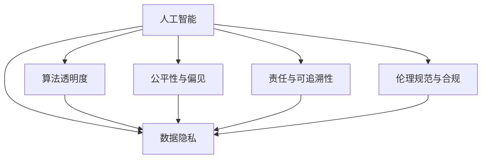

                 

## 1. 背景介绍

在当今数字化时代，人工智能（AI）和大数据技术在商业决策中扮演着越来越重要的角色。从推荐系统到预测分析，再到自动化决策支持，这些技术极大地提升了企业运营效率和决策质量。然而，技术的快速发展也带来了新的伦理挑战，如何在商业决策中保持道德标准，成为了一个亟待解决的重要问题。

### 1.1 问题由来
随着AI技术的深入应用，一些企业开始依赖AI算法进行决策，这不仅涉及技术层面，也涉及到伦理道德层面。例如，基于用户行为的推荐系统可能加剧用户隐私泄露的风险，自动化决策系统可能会因算法偏见导致不公正的决策。这些问题不仅影响企业声誉，还可能对用户权益和社会公平产生负面影响。

### 1.2 问题核心关键点
伦理管理在商业决策中的核心关键点包括：
1. **数据隐私与安全**：如何保护用户隐私，防止数据滥用。
2. **算法透明度与可解释性**：如何确保算法的决策过程透明，能够被用户理解。
3. **公平性与偏见**：如何避免算法偏见，确保决策的公平性。
4. **责任与可追溯性**：在出现决策错误时，如何追责，确保可追溯性。
5. **伦理规范与合规**：如何制定和遵循伦理规范，确保符合法律法规。

这些关键点要求企业在应用AI技术时，不仅要关注技术实现，还要考虑伦理道德问题，确保决策过程的公正、透明和负责任。

### 1.3 问题研究意义
研究和实践伦理管理对商业决策具有重要意义：
1. **提升企业声誉**：遵循伦理规范，有助于提升企业的公众形象和社会信任。
2. **减少法律风险**：遵循法律法规，避免因违规决策带来的法律风险和罚款。
3. **增强决策质量**：通过伦理管理，确保决策过程更加公正和透明，提升决策质量。
4. **促进公平竞争**：遵循伦理规范，有助于形成公平的商业环境，促进市场健康发展。
5. **推动技术进步**：在伦理框架下应用AI技术，有助于推动技术的健康发展，避免伦理问题的出现。

## 2. 核心概念与联系

### 2.1 核心概念概述

为了更好地理解伦理管理在商业决策中的应用，本节将介绍几个密切相关的核心概念：

1. **人工智能（AI）**：通过机器学习、深度学习等技术，使计算机能够模拟人类的认知、决策能力。AI在商业决策中的应用包括但不限于推荐系统、预测分析、自动化决策等。

2. **伦理管理（Ethical Management）**：在商业决策过程中，遵循伦理规范，确保决策的公正、透明和负责任。

3. **数据隐私（Data Privacy）**：保护用户数据，防止未经授权的访问、使用和泄露。

4. **算法透明度（Algorithm Transparency）**：确保算法的决策过程透明，能够被用户理解。

5. **公平性与偏见（Fairness and Bias）**：避免算法偏见，确保决策的公平性。

6. **责任与可追溯性（Accountability and Traceability）**：在出现决策错误时，能够追责，确保可追溯性。

7. **伦理规范与合规（Ethical Norms and Compliance）**：制定和遵循伦理规范，确保符合法律法规。

这些核心概念之间的逻辑关系可以通过以下Mermaid流程图来展示：



这个流程图展示了几大核心概念之间的关系：

1. AI技术在数据隐私、算法透明度、公平性、责任性和合规性等方面都有应用。
2. 数据隐私、算法透明度、公平性、责任性和合规性都与AI技术密切相关，互相影响。

## 3. 核心算法原理 & 具体操作步骤
### 3.1 算法原理概述

在商业决策中应用伦理管理，首先需要理解AI技术的工作原理和决策过程。AI算法的决策通常基于训练数据，通过机器学习模型进行预测或分类。这些模型的决策过程往往难以解释，但可以通过伦理管理手段进行优化和规范。

### 3.2 算法步骤详解

基于伦理管理的应用AI算法，主要包括以下几个关键步骤：

**Step 1: 数据收集与预处理**
- 确定所需的数据类型和来源，确保数据的多样性和代表性。
- 对数据进行清洗和标注，确保数据的质量和完整性。

**Step 2: 算法设计与训练**
- 选择合适的算法和模型，确保其适用于具体的商业决策任务。
- 设计算法的训练流程，确保数据隐私保护和算法透明度。

**Step 3: 模型验证与评估**
- 在验证集上进行模型验证，确保模型的准确性和可靠性。
- 对模型的性能进行评估，确保其符合商业决策需求。

**Step 4: 部署与监控**
- 将模型部署到实际应用中，确保模型的可追溯性和责任明确。
- 对模型的决策过程进行监控，确保其符合伦理规范和合规要求。

### 3.3 算法优缺点

应用伦理管理的AI算法具有以下优点：
1. **提升决策质量**：通过伦理管理，确保算法的公正性和透明度，提升决策质量。
2. **降低法律风险**：遵循伦理规范和法律法规，减少法律风险和罚款。
3. **增强用户信任**：确保算法的决策过程透明，增强用户信任和满意度。
4. **促进社会公平**：避免算法偏见，促进社会公平和公正。

同时，该方法也存在一定的局限性：
1. **技术复杂性**：实施伦理管理需要一定的技术手段，对企业技术团队要求较高。
2. **成本较高**：伦理管理的实施需要额外的资源投入，包括时间和金钱。
3. **效果受限**：伦理管理的效果受限于算法的复杂性和数据的质量。

尽管存在这些局限性，但就目前而言，伦理管理的应用AI算法是提升商业决策质量的重要手段。未来相关研究的重点在于如何进一步降低伦理管理的成本，提高模型的可解释性和公平性。

### 3.4 算法应用领域

基于伦理管理的应用AI算法在商业决策中已经得到了广泛的应用，例如：

- **金融风控**：利用AI算法进行风险评估，确保决策的公正性和透明度。
- **医疗诊断**：使用AI算法进行疾病诊断，确保医疗决策的公平性和责任明确。
- **人力资源管理**：通过AI算法进行人才评估和招聘，避免算法偏见，确保公平。
- **市场营销**：利用AI算法进行客户细分和个性化推荐，确保客户数据隐私保护。
- **供应链管理**：使用AI算法进行需求预测和库存管理，确保决策的准确性和可靠性。

除了上述这些经典应用外，AI算法在更多领域中也有应用，如智能交通、智能制造、智能家居等，为企业的智能化转型提供了新的解决方案。

## 4. 数学模型和公式 & 详细讲解 & 举例说明

### 4.1 数学模型构建

在商业决策中应用伦理管理的AI算法，通常需要构建如下数学模型：

设商业决策问题为：给定数据集 $D=\{(x_i, y_i)\}_{i=1}^N$，其中 $x_i$ 为特征向量，$y_i$ 为标签。

目标为训练一个模型 $M$，使得模型在测试集上的预测准确率 $acc$ 最大化：

$$
acc = \frac{1}{N} \sum_{i=1}^N \mathbb{I}[M(x_i) = y_i]
$$

其中 $\mathbb{I}$ 为示性函数，表示预测结果与标签是否一致。

### 4.2 公式推导过程

以下以二分类问题为例，推导算法的损失函数和优化目标。

设模型 $M$ 在输入 $x$ 上的输出为 $\hat{y}=M(x) \in [0,1]$，表示样本属于正类的概率。真实标签 $y \in \{0,1\}$。

则二分类交叉熵损失函数定义为：

$$
\ell(M(x),y) = -[y\log \hat{y} + (1-y)\log (1-\hat{y})]
$$

在训练集 $D$ 上，经验风险为：

$$
\mathcal{L}(M) = -\frac{1}{N}\sum_{i=1}^N [y_i\log M(x_i)+(1-y_i)\log(1-M(x_i))]
$$

为了在训练过程中优化模型 $M$，我们需要最小化经验风险：

$$
\theta^* = \mathop{\arg\min}_{\theta} \mathcal{L}(M)
$$

其中 $\theta$ 为模型的可调参数，可以通过梯度下降等优化算法更新。

### 4.3 案例分析与讲解

以医疗诊断为例，分析如何在应用AI算法时进行伦理管理。

医疗诊断算法通常依赖于患者的历史医疗记录和当前的临床数据，进行疾病预测或分类。在这个过程中，需要考虑以下伦理问题：

1. **数据隐私**：患者医疗记录涉及个人隐私，需要在数据收集和使用过程中进行隐私保护，避免数据泄露。
2. **算法透明度**：算法的决策过程复杂，需要确保其透明度，使医生和患者能够理解和信任。
3. **公平性与偏见**：算法的预测结果应避免因种族、性别等因素产生的偏见，确保公平性。
4. **责任与可追溯性**：在出现诊断错误时，需要明确责任，确保可追溯性。
5. **伦理规范与合规**：遵循医疗伦理规范和法律法规，确保算法的合法合规使用。

针对这些伦理问题，可以采取以下措施：

1. **数据加密与匿名化**：在数据收集和使用过程中，对敏感数据进行加密和匿名化处理，保护患者隐私。
2. **可解释性算法**：使用可解释性算法（如决策树、规则系统），确保算法的决策过程透明，使医生和患者能够理解。
3. **公平性校验**：在算法设计过程中，引入公平性校验机制，确保算法的预测结果不受种族、性别等因素影响。
4. **责任分配与追溯**：在算法部署后，明确算法的责任分配，建立追溯机制，确保在出现错误时能够追责。
5. **伦理审查与合规**：在算法开发和应用过程中，进行伦理审查，确保符合医疗伦理规范和法律法规。

## 5. 项目实践：代码实例和详细解释说明
### 5.1 开发环境搭建

在进行伦理管理的AI算法实践前，我们需要准备好开发环境。以下是使用Python进行Scikit-learn开发的开发环境配置流程：

1. 安装Anaconda：从官网下载并安装Anaconda，用于创建独立的Python环境。

2. 创建并激活虚拟环境：
```bash
conda create -n ethics-env python=3.8 
conda activate ethics-env
```

3. 安装Scikit-learn：从官网获取安装命令。例如：
```bash
conda install scikit-learn
```

4. 安装各类工具包：
```bash
pip install numpy pandas scikit-learn matplotlib tqdm jupyter notebook ipython
```

完成上述步骤后，即可在`ethics-env`环境中开始伦理管理的AI算法实践。

### 5.2 源代码详细实现

这里我们以医疗诊断为例，给出使用Scikit-learn对决策树模型进行伦理管理的代码实现。

首先，定义数据集：

```python
import pandas as pd
from sklearn.model_selection import train_test_split
from sklearn.metrics import accuracy_score

# 读取医疗数据
data = pd.read_csv('medical_data.csv')
X = data.drop('label', axis=1)
y = data['label']

# 划分训练集和测试集
X_train, X_test, y_train, y_test = train_test_split(X, y, test_size=0.2, random_state=42)
```

然后，定义模型和优化器：

```python
from sklearn.tree import DecisionTreeClassifier
from sklearn.model_selection import GridSearchCV

model = DecisionTreeClassifier()
param_grid = {
    'criterion': ['gini', 'entropy'],
    'max_depth': [None, 10, 20],
    'min_samples_split': [2, 5, 10],
    'min_samples_leaf': [1, 2, 4]
}

# 网格搜索优化参数
grid_search = GridSearchCV(model, param_grid, cv=5, scoring='accuracy')
grid_search.fit(X_train, y_train)
best_model = grid_search.best_estimator_
```

接着，定义训练和评估函数：

```python
def train_model(model, X_train, y_train):
    model.fit(X_train, y_train)
    return model

def evaluate_model(model, X_test, y_test):
    y_pred = model.predict(X_test)
    accuracy = accuracy_score(y_test, y_pred)
    return accuracy
```

最后，启动训练流程并在测试集上评估：

```python
from sklearn.metrics import confusion_matrix

# 训练模型
model = train_model(best_model, X_train, y_train)

# 在测试集上评估模型
accuracy = evaluate_model(model, X_test, y_test)
print(f"模型在测试集上的准确率为：{accuracy:.3f}")
```

以上就是使用Scikit-learn对决策树模型进行伦理管理的完整代码实现。可以看到，Scikit-learn的强大封装使得伦理管理的AI算法实现变得简洁高效。

### 5.3 代码解读与分析

让我们再详细解读一下关键代码的实现细节：

**数据集定义**：
- 使用Pandas库读取医疗数据集，提取特征和标签。
- 使用Scikit-learn的train_test_split函数将数据集划分为训练集和测试集。

**模型定义**：
- 使用Scikit-learn的决策树分类器，设置不同的参数组合。
- 使用GridSearchCV进行参数优化，选择最优模型。

**训练和评估函数**：
- 定义train_model函数，用于训练模型。
- 定义evaluate_model函数，用于评估模型在测试集上的准确率。
- 在train_model函数中使用fit方法进行模型训练。
- 在evaluate_model函数中使用accuracy_score计算准确率。

**训练流程**：
- 使用best_model获取最优的决策树模型。
- 调用train_model函数训练模型，并返回训练好的模型。
- 调用evaluate_model函数评估模型在测试集上的准确率。

可以看到，Scikit-learn提供的工具和函数，极大地方便了伦理管理的AI算法开发和部署。

## 6. 实际应用场景
### 6.1 金融风控

基于伦理管理的AI算法在金融风控中具有重要应用。金融行业数据量庞大且复杂，涉及大量用户隐私和敏感信息。AI算法可以通过数据分析，预测用户信用风险，帮助金融机构进行贷款审批和风险控制。

具体而言，可以收集用户的历史贷款数据、信用记录、交易记录等，构建预测模型。在模型训练过程中，需要对数据进行加密和匿名化处理，确保用户隐私保护。同时，使用可解释性算法（如决策树、规则系统），确保算法的决策过程透明，使贷款审批人员能够理解和信任。

### 6.2 医疗诊断

医疗诊断算法通常依赖于患者的病历记录、实验室检查结果等数据，进行疾病预测和分类。在应用过程中，需要考虑以下伦理问题：

1. **数据隐私**：患者的病历记录涉及个人隐私，需要在数据收集和使用过程中进行隐私保护，避免数据泄露。
2. **算法透明度**：算法的决策过程复杂，需要确保其透明度，使医生和患者能够理解和信任。
3. **公平性与偏见**：算法的预测结果应避免因种族、性别等因素产生的偏见，确保公平性。
4. **责任与可追溯性**：在出现诊断错误时，需要明确责任，确保可追溯性。
5. **伦理规范与合规**：遵循医疗伦理规范和法律法规，确保算法的合法合规使用。

针对这些伦理问题，可以采取以下措施：

1. **数据加密与匿名化**：在数据收集和使用过程中，对敏感数据进行加密和匿名化处理，保护患者隐私。
2. **可解释性算法**：使用可解释性算法（如决策树、规则系统），确保算法的决策过程透明，使医生和患者能够理解。
3. **公平性校验**：在算法设计过程中，引入公平性校验机制，确保算法的预测结果不受种族、性别等因素影响。
4. **责任分配与追溯**：在算法部署后，明确算法的责任分配，建立追溯机制，确保在出现错误时能够追责。
5. **伦理审查与合规**：在算法开发和应用过程中，进行伦理审查，确保符合医疗伦理规范和法律法规。

### 6.3 人力资源管理

人力资源管理中，AI算法可以用于人才评估和招聘，提高招聘效率和决策质量。在应用过程中，需要考虑以下伦理问题：

1. **数据隐私**：应聘者的个人信息涉及隐私，需要在数据收集和使用过程中进行隐私保护，避免数据滥用。
2. **算法透明度**：算法的决策过程复杂，需要确保其透明度，使应聘者和招聘人员能够理解和信任。
3. **公平性与偏见**：算法的评估结果应避免因种族、性别等因素产生的偏见，确保公平性。
4. **责任与可追溯性**：在出现评估错误时，需要明确责任，确保可追溯性。
5. **伦理规范与合规**：遵循人力资源管理伦理规范和法律法规，确保算法的合法合规使用。

针对这些伦理问题，可以采取以下措施：

1. **数据加密与匿名化**：在数据收集和使用过程中，对敏感数据进行加密和匿名化处理，保护应聘者隐私。
2. **可解释性算法**：使用可解释性算法（如决策树、规则系统），确保算法的决策过程透明，使应聘者和招聘人员能够理解。
3. **公平性校验**：在算法设计过程中，引入公平性校验机制，确保算法的评估结果不受种族、性别等因素影响。
4. **责任分配与追溯**：在算法部署后，明确算法的责任分配，建立追溯机制，确保在出现错误时能够追责。
5. **伦理审查与合规**：在算法开发和应用过程中，进行伦理审查，确保符合人力资源管理伦理规范和法律法规。

## 7. 工具和资源推荐
### 7.1 学习资源推荐

为了帮助开发者系统掌握伦理管理在商业决策中的应用，这里推荐一些优质的学习资源：

1. **《人工智能伦理》系列课程**：由知名伦理学家和AI专家讲授，全面介绍AI伦理的基本概念和原则，探讨AI技术在各个领域的伦理问题。

2. **《数据隐私保护》书籍**：介绍数据隐私的基本概念和保护技术，涵盖数据加密、匿名化、访问控制等方面。

3. **《可解释性AI》书籍**：探讨如何使AI算法具备可解释性，使决策过程透明，增强用户信任和理解。

4. **《公平性与偏见》报告**：由知名研究机构发布的公平性与偏见研究报告，详细分析AI算法在不同数据集上的表现，提供改进建议。

5. **《伦理规范与合规》文章**：由法律法规专家撰写的伦理规范和合规指南，指导企业在应用AI技术时遵循法律法规。

通过对这些资源的学习实践，相信你一定能够快速掌握伦理管理在商业决策中的精髓，并用于解决实际的伦理问题。

### 7.2 开发工具推荐

高效的开发离不开优秀的工具支持。以下是几款用于伦理管理AI算法开发的常用工具：

1. Python：基于Python的开源深度学习框架，灵活动态的计算图，适合快速迭代研究。

2. Scikit-learn：基于Python的机器学习库，提供了多种经典机器学习算法和工具，支持模型训练、评估和优化。

3. TensorFlow：由Google主导开发的开源深度学习框架，生产部署方便，适合大规模工程应用。

4. PyTorch：基于Python的开源深度学习框架，灵活易用，支持动态计算图和自动微分。

5. Weights & Biases：模型训练的实验跟踪工具，可以记录和可视化模型训练过程中的各项指标，方便对比和调优。

6. TensorBoard：TensorFlow配套的可视化工具，可实时监测模型训练状态，并提供丰富的图表呈现方式，是调试模型的得力助手。

合理利用这些工具，可以显著提升伦理管理AI算法开发的效率，加快创新迭代的步伐。

### 7.3 相关论文推荐

伦理管理在商业决策中的应用源于学界的持续研究。以下是几篇奠基性的相关论文，推荐阅读：

1. "AI与伦理：技术、社会与伦理"：探讨AI技术在各个领域的伦理问题，提出伦理管理的解决方案。

2. "数据隐私保护：技术与管理"：分析数据隐私的基本概念和保护技术，提供实际应用建议。

3. "可解释性AI：方法与实践"：探讨如何使AI算法具备可解释性，使决策过程透明。

4. "公平性与偏见：理论与实验"：分析AI算法在不同数据集上的表现，提出改进公平性的方法。

5. "伦理规范与合规：理论与实践"：介绍伦理规范和合规的基本概念和实践建议。

这些论文代表了大语言模型微调技术的发展脉络。通过学习这些前沿成果，可以帮助研究者把握学科前进方向，激发更多的创新灵感。

## 8. 总结：未来发展趋势与挑战

### 8.1 总结

本文对伦理管理在商业决策中的应用进行了全面系统的介绍。首先阐述了AI技术在商业决策中的广泛应用，明确了伦理管理在提升决策质量、降低法律风险、增强用户信任等方面的重要意义。其次，从原理到实践，详细讲解了伦理管理的数学模型和核心算法，给出了伦理管理的完整代码实例。同时，本文还广泛探讨了伦理管理在金融风控、医疗诊断、人力资源管理等多个领域的应用前景，展示了伦理管理范式的巨大潜力。此外，本文精选了伦理管理的各类学习资源，力求为读者提供全方位的技术指引。

通过本文的系统梳理，可以看到，伦理管理在商业决策中的应用已经成为推动AI技术发展的重要保障。这一范式不仅提升了商业决策的公正性和透明度，也促进了AI技术的健康发展，为构建更加安全、可靠、可解释、可控的智能系统铺平了道路。

### 8.2 未来发展趋势

展望未来，伦理管理在商业决策中的应用将呈现以下几个发展趋势：

1. **技术手段更加丰富**：随着AI技术的不断进步，伦理管理的手段将更加多样化，如引入因果推断、博弈论等方法，增强决策的公正性和可追溯性。

2. **跨领域协同应用**：伦理管理将与数据隐私、公平性、可解释性等更多领域进行协同，形成更加全面的伦理治理体系。

3. **法律法规不断完善**：随着AI技术的普及，相关法律法规将不断完善，为伦理管理提供更严格的法律保障。

4. **伦理审查与评估机制**：企业内部将建立更加完善的伦理审查与评估机制，确保算法的合法合规使用。

5. **伦理培训与教育**：AI技术的应用将涉及更多人员，伦理培训与教育将成为提升伦理管理水平的重要手段。

这些趋势凸显了伦理管理在商业决策中的重要性和未来发展方向，伦理管理将与AI技术深度融合，共同推动智能社会的进步。

### 8.3 面临的挑战

尽管伦理管理在商业决策中的应用已经取得了显著进展，但在迈向更加智能化、普适化应用的过程中，它仍面临着诸多挑战：

1. **技术复杂性**：伦理管理的实施需要综合考虑数据隐私、算法透明度、公平性、责任性等多个方面，技术复杂性较高。

2. **成本较高**：伦理管理的实施需要额外的资源投入，包括时间和金钱，成本较高。

3. **效果受限**：伦理管理的效果受限于算法的复杂性和数据的质量，难以全面解决所有伦理问题。

4. **法律风险**：伦理管理需要遵循法律法规，但相关法律法规仍在不断完善中，存在一定的法律风险。

5. **技术迭代**：AI技术的发展速度较快，伦理管理的方法和技术也需要不断更新和优化，以应对新的伦理挑战。

尽管存在这些挑战，但随着学界和产业界的共同努力，伦理管理在商业决策中的应用必将继续深化，为智能系统的健康发展提供坚实保障。

### 8.4 研究展望

未来，伦理管理在商业决策中的应用需要在以下几个方面寻求新的突破：

1. **跨学科融合**：将伦理管理与数据科学、法律、社会学等多个学科进行深度融合，形成更加全面、系统的伦理治理体系。

2. **伦理技术创新**：开发更多伦理管理的技术手段，如因果推断、博弈论等方法，增强决策的公正性和可追溯性。

3. **伦理规范建设**：制定和推广伦理规范，提升全社会的伦理意识，形成良好的伦理氛围。

4. **伦理教育普及**：在AI技术应用过程中，加强伦理教育，提升从业人员和用户对伦理问题的认知和应对能力。

这些研究方向的探索，必将引领伦理管理在商业决策中的进一步发展，为构建安全、可靠、可解释、可控的智能系统铺平道路。面向未来，伦理管理将与AI技术深度融合，共同推动智能社会的进步，为人类社会的可持续发展提供新的动力。

## 9. 附录：常见问题与解答

**Q1：伦理管理是否适用于所有商业决策？**

A: 伦理管理在大多数商业决策中都适用，尤其是在涉及用户隐私、公平性、责任性等方面。但对于一些特定的决策场景，如紧急情况下的自动化决策，可能需要根据实际情况进行灵活调整。

**Q2：如何进行伦理管理的实施？**

A: 伦理管理的实施需要以下步骤：
1. 明确决策过程涉及的伦理问题，如数据隐私、算法透明度、公平性、责任性等。
2. 选择合适的算法和模型，确保其公正性和可解释性。
3. 进行数据预处理，确保数据隐私保护和算法透明度。
4. 在模型训练过程中，引入公平性校验机制，确保算法预测的公平性。
5. 在模型部署后，建立责任分配与追溯机制，确保在出现错误时能够追责。
6. 遵循法律法规，确保算法的合法合规使用。

**Q3：如何评估伦理管理的效果？**

A: 伦理管理的效果可以通过以下指标进行评估：
1. 数据隐私保护：通过数据加密和匿名化等技术，确保用户数据的安全。
2. 算法透明度：通过可解释性算法，使决策过程透明，增强用户信任和理解。
3. 公平性与偏见：通过公平性校验机制，确保算法预测结果不受种族、性别等因素影响。
4. 责任与可追溯性：在出现决策错误时，能够明确责任，确保可追溯性。
5. 遵循伦理规范与合规：通过伦理审查和合规审查，确保算法合法合规使用。

**Q4：如何应对伦理管理中的技术挑战？**

A: 应对伦理管理中的技术挑战，可以采取以下措施：
1. 引入因果推断和博弈论等方法，增强决策的公正性和可追溯性。
2. 开发更多伦理管理的技术手段，如公平性校验机制、责任分配与追溯机制等。
3. 加强伦理教育和培训，提升从业人员和用户对伦理问题的认知和应对能力。
4. 制定和推广伦理规范，形成良好的伦理氛围。

**Q5：如何平衡伦理管理与AI技术发展？**

A: 在平衡伦理管理与AI技术发展时，可以采取以下措施：
1. 引入跨学科融合的思维方式，将伦理管理与数据科学、法律、社会学等多个学科进行深度融合。
2. 开发更多伦理管理的技术手段，增强决策的公正性和可追溯性。
3. 制定和推广伦理规范，提升全社会的伦理意识。
4. 在AI技术应用过程中，加强伦理教育，提升从业人员和用户对伦理问题的认知和应对能力。

这些措施将有助于在AI技术发展过程中，平衡伦理管理与技术进步，推动智能社会的健康发展。

---

作者：禅与计算机程序设计艺术 / Zen and the Art of Computer Programming

