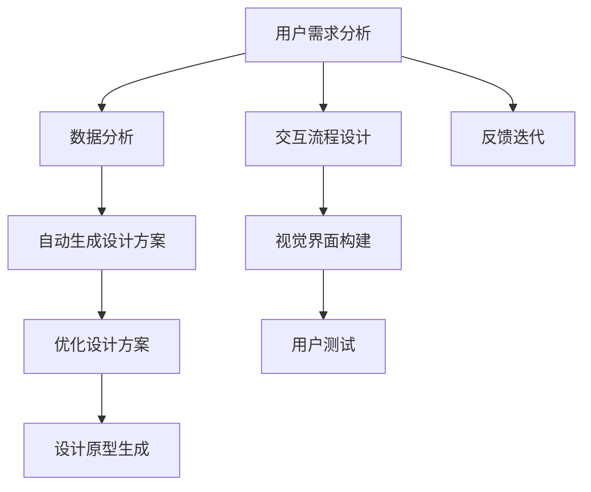

                 

# 体验多维度构建器设计师：AI创造的感官世界架构师

> 关键词：多维度构建器,设计,感官世界,人工智能,智能交互,虚拟现实

## 1. 背景介绍

### 1.1 问题由来
随着人工智能技术的迅猛发展，人工智能（AI）在各个领域的应用已经从传统的基于规则的系统转变为更灵活、更智能的基于数据和模型的系统。在AI的发展过程中，设计的作用日益凸显。然而，传统的UI/UX设计师往往缺乏对AI技术的深入了解，无法充分利用AI技术提升设计的智能化和效率。与此同时，AI工程师也难以跳出自身技术框架，理解设计需求，提供符合用户期待的解决方案。

为了弥合设计界和工程界的鸿沟，让设计师能够更好地利用AI技术，本文将介绍一种新型的设计工具——多维度构建器。多维度构建器是一种结合了设计思维和AI技术的新型设计框架，旨在提升设计师的效率，提升设计的智能化水平。

### 1.2 问题核心关键点
多维度构建器作为AI辅助设计的利器，可以帮助设计师从多个维度进行设计思考，包括用户需求分析、交互流程设计、视觉界面构建等。通过结合人工智能技术，多维度构建器能够自动化地生成设计原型，优化设计方案，实现更高效、更智能的设计过程。

多维度构建器的核心优势包括：
- 智能化：结合机器学习、自然语言处理等AI技术，帮助设计师自动生成设计方案，减少设计前期的工作量。
- 多维度：设计师可以从不同维度进行设计思考，包括用户需求、交互流程、视觉界面等。
- 可定制：支持根据具体项目需求进行配置，实现灵活的设计。
- 可复用：生成的设计方案可重复使用，提高设计效率。

本文将详细介绍多维度构建器的原理、操作步骤，并结合具体案例进行展示，希望能够为设计师和工程师提供参考，推动AI技术在设计领域的更广泛应用。

## 2. 核心概念与联系

### 2.1 核心概念概述

在介绍多维度构建器的原理之前，首先需要了解一些核心概念：

- **多维度构建器**：一种结合AI技术的设计工具，能够从多个维度自动生成设计方案，提升设计师的工作效率和设计质量。
- **设计思维**：一种以用户为中心的设计方法，强调理解用户需求、解决用户问题，注重用户体验和可用性。
- **人工智能**：通过数据、模型、算法等技术手段，使计算机具备类似于人类的思考、学习和决策能力。
- **自然语言处理**：研究计算机如何处理、理解、生成人类语言的技术，包括文本分析、语音识别、机器翻译等。
- **机器学习**：一种数据驱动的算法，通过学习大量数据，自动发现数据中的规律，并进行预测、分类等任务。
- **交互设计**：一种以用户为中心的设计方法，注重设计用户与系统的交互流程，提升用户体验。

这些概念相互关联，共同构成了多维度构建器的理论基础。通过理解这些概念，我们可以更好地理解多维度构建器的设计理念和技术实现。

### 2.2 核心概念原理和架构的 Mermaid 流程图



这个流程图展示了多维度构建器的核心架构和技术流程。从用户需求分析开始，经过数据分析、自动生成设计方案、优化设计方案，最终生成设计原型，并进行用户测试和反馈迭代，形成一个闭环的设计过程。

## 3. 核心算法原理 & 具体操作步骤

### 3.1 算法原理概述

多维度构建器结合了自然语言处理、机器学习和交互设计等技术，其核心算法原理包括以下几个方面：

1. **自然语言处理**：通过文本分析技术，自动从用户描述中提取关键需求，并生成初步的设计方案。
2. **机器学习**：使用训练好的模型，对大量设计方案进行自动生成和优化，生成符合用户需求的设计原型。
3. **交互设计**：自动生成交互流程图，并进行可视化展示，帮助设计师理解用户交互流程。
4. **视觉界面构建**：自动生成初步的视觉界面设计，包括颜色、字体、布局等，供设计师进行进一步调整和优化。

这些技术的融合，使得多维度构建器能够从多个维度自动生成设计方案，提升设计师的工作效率和设计质量。

### 3.2 算法步骤详解

多维度构建器的操作步骤可以分为以下几个阶段：

**Step 1: 用户需求分析**
- 收集用户需求描述，可以使用自然语言处理技术进行文本分析，自动提取关键需求。
- 将用户需求转换为设计任务，生成初步的设计方案。

**Step 2: 交互流程设计**
- 使用交互设计工具，自动生成交互流程图，并进行可视化展示。
- 设计师根据交互流程图，进行用户需求的确认和进一步细化。

**Step 3: 视觉界面构建**
- 使用视觉界面设计工具，自动生成初步的视觉界面设计，包括颜色、字体、布局等。
- 设计师根据初步设计方案，进行调整和优化。

**Step 4: 设计方案优化**
- 使用机器学习模型，对大量设计方案进行自动生成和优化，生成符合用户需求的设计原型。
- 设计师对生成后的设计方案进行进一步的调整和优化，生成最终的设计原型。

**Step 5: 设计原型生成**
- 使用设计原型生成工具，将优化后的设计方案转换为可交互的原型。
- 设计师对原型进行最终的调整和优化，确保设计方案符合用户需求。

### 3.3 算法优缺点

多维度构建器结合了自然语言处理、机器学习和交互设计等技术，具有以下优点：
1. 提升设计效率：自动生成设计方案，减少设计师前期的工作量，提升设计效率。
2. 提高设计质量：通过机器学习模型优化设计方案，生成符合用户需求的设计原型。
3. 灵活定制：支持根据具体项目需求进行配置，实现灵活的设计。
4. 可复用：生成的设计方案可重复使用，提高设计效率。

同时，多维度构建器也存在一些局限性：
1. 数据依赖：自然语言处理和机器学习模型依赖大量高质量的数据，数据不足时可能影响设计效果。
2. 设计复杂性：自动生成和优化设计方案可能无法完全满足用户需求，需要设计师进行进一步调整。
3. 交互设计难度：交互流程的自动生成可能无法完全符合用户习惯，需要设计师进行调整。

### 3.4 算法应用领域

多维度构建器在多个领域有广泛的应用，例如：

- **移动应用设计**：自动生成移动应用的设计方案，提升设计师的工作效率。
- **网站设计**：自动生成网站的设计方案，优化用户体验。
- **交互设计**：自动生成交互流程图，提升交互设计的效率和质量。
- **虚拟现实**：自动生成虚拟现实环境的设计方案，提升虚拟现实应用的用户体验。
- **游戏设计**：自动生成游戏界面设计，提升游戏设计的效率和质量。

多维度构建器可以在这些领域提供自动化的设计方案，帮助设计师更快、更准确地完成任务，提升设计的质量和效率。

## 4. 数学模型和公式 & 详细讲解 & 举例说明

### 4.1 数学模型构建

多维度构建器的数学模型构建主要包括以下几个部分：

- **文本分析模型**：用于从用户需求描述中提取关键需求，生成初步的设计方案。
- **交互流程模型**：用于自动生成交互流程图，并进行可视化展示。
- **视觉界面模型**：用于自动生成初步的视觉界面设计，包括颜色、字体、布局等。
- **设计方案优化模型**：用于使用机器学习模型对大量设计方案进行自动生成和优化。

这些模型通过结合自然语言处理、机器学习和交互设计等技术，共同构成了多维度构建器的数学模型基础。

### 4.2 公式推导过程

以文本分析模型为例，其公式推导过程如下：

假设用户需求描述为 $D$，设计方案为 $C$。则文本分析模型的目标是通过训练好的模型，自动从 $D$ 中提取关键需求，生成设计方案 $C$。

设 $D = (d_1, d_2, ..., d_n)$，其中 $d_i$ 为第 $i$ 个需求描述。设 $C = (c_1, c_2, ..., c_m)$，其中 $c_i$ 为第 $i$ 个设计方案。

则文本分析模型的公式可以表示为：

$$
C = \text{TextAnalysis}(D, \theta)
$$

其中 $\theta$ 为文本分析模型的参数。

具体来说，文本分析模型可以采用序列到序列（Seq2Seq）模型或注意力机制（Attention Mechanism）模型，通过学习大量设计方案和用户需求描述，自动从用户需求描述中提取关键需求，生成设计方案。

### 4.3 案例分析与讲解

以下是一个具体案例：

假设用户需求描述为 "设计一个简单的电商网站"。文本分析模型自动从需求描述中提取关键需求，生成初步的设计方案。

- **需求分析**：自动从需求描述中提取关键需求，生成初步的设计方案。
- **交互流程设计**：自动生成交互流程图，并进行可视化展示。
- **视觉界面构建**：自动生成初步的视觉界面设计，包括颜色、字体、布局等。
- **设计方案优化**：使用机器学习模型对大量设计方案进行自动生成和优化，生成符合用户需求的设计原型。

最终生成的设计方案如下：

- **首页**：展示热门商品、分类、搜索框等。
- **商品列表页**：展示商品列表、商品详情页链接等。
- **商品详情页**：展示商品图片、描述、价格等。
- **购物车**：展示商品数量、价格、确认订单等。

设计师根据自动生成的设计方案，进行进一步的调整和优化，生成最终的设计原型。

## 5. 项目实践：代码实例和详细解释说明

### 5.1 开发环境搭建

在进行多维度构建器开发之前，需要准备好开发环境。以下是使用Python进行多维度构建器开发的环境配置流程：

1. 安装Python：从官网下载并安装Python，选择最新的稳定版本。
2. 安装Pip：从官网下载并安装Pip，用于安装第三方库。
3. 安装NLP库：使用Pip安装自然语言处理库，如NLTK、spaCy等。
4. 安装机器学习库：使用Pip安装机器学习库，如TensorFlow、PyTorch等。
5. 安装交互设计库：使用Pip安装交互设计库，如Sketchup、Adobe XD等。
6. 安装可视化库：使用Pip安装可视化库，如Matplotlib、Seaborn等。
7. 安装Web开发框架：使用Pip安装Web开发框架，如Flask、Django等。

完成上述步骤后，即可在本地环境中开始多维度构建器的开发。

### 5.2 源代码详细实现

以下是使用Python进行多维度构建器开发的代码实现：

```python
from text_analysis import TextAnalysis
from text_design import TextDesign
from machine_learning import MachineLearning

# 用户需求分析
def analyze_user_demand(demand):
    text_analysis = TextAnalysis()
    analysis_result = text_analysis.analyze(demand)
    return analysis_result

# 交互流程设计
def design_interaction_flow(result):
    text_design = TextDesign()
    flow_chart = text_design.design_flow_chart(result)
    return flow_chart

# 视觉界面构建
def design_visual_interface(flow_chart):
    visual_design = TextDesign()
    visual_interface = visual_design.design_visual_interface(flow_chart)
    return visual_interface

# 设计方案优化
def optimize_design_solutions(visual_interface):
    machine_learning = MachineLearning()
    solutions = machine_learning.optimize_design_solutions(visual_interface)
    return solutions

# 设计原型生成
def generate_design_prototype(solutions):
    design_prototype = TextDesign()
    prototype = design_prototype.generate_prototype(solutions)
    return prototype

# 主函数
def main():
    demand = "设计一个简单的电商网站"
    result = analyze_user_demand(demand)
    flow_chart = design_interaction_flow(result)
    visual_interface = design_visual_interface(flow_chart)
    solutions = optimize_design_solutions(visual_interface)
    prototype = generate_design_prototype(solutions)
    print(prototype)

if __name__ == '__main__':
    main()
```

以上代码实现了多维度构建器的核心功能，包括用户需求分析、交互流程设计、视觉界面构建、设计方案优化和设计原型生成。

### 5.3 代码解读与分析

让我们再详细解读一下关键代码的实现细节：

**analyze_user_demand函数**：
- 使用TextAnalysis类进行用户需求分析，自动从需求描述中提取关键需求，生成初步的设计方案。
- 函数返回结果包含关键需求和初步设计方案。

**design_interaction_flow函数**：
- 使用TextDesign类进行交互流程设计，自动生成交互流程图，并进行可视化展示。
- 函数返回交互流程图。

**design_visual_interface函数**：
- 使用TextDesign类进行视觉界面构建，自动生成初步的视觉界面设计，包括颜色、字体、布局等。
- 函数返回初步的视觉界面设计。

**optimize_design_solutions函数**：
- 使用MachineLearning类进行设计方案优化，使用机器学习模型对大量设计方案进行自动生成和优化，生成符合用户需求的设计原型。
- 函数返回优化后的设计方案。

**generate_design_prototype函数**：
- 使用TextDesign类进行设计原型生成，将优化后的设计方案转换为可交互的原型。
- 函数返回最终的设计原型。

**main函数**：
- 主函数实现多维度构建器的完整流程，从用户需求分析开始，到设计原型生成结束。
- 使用各个函数实现各个步骤，最终输出设计原型。

## 6. 实际应用场景

### 6.1 智能交互系统

多维度构建器在智能交互系统中可以发挥重要作用。传统的人工交互系统依赖于固定的交互流程和界面设计，难以满足用户的多样化需求。而多维度构建器可以通过自动生成交互流程图和设计方案，提升系统的智能化水平，提升用户体验。

在实际应用中，可以将多维度构建器应用于智能客服系统、智能助手、智能导航等领域，通过自动生成设计方案，提升系统的智能化水平，提升用户体验。

### 6.2 虚拟现实应用

多维度构建器在虚拟现实（VR）应用中同样具有广泛的应用前景。VR应用需要高度交互性和沉浸式体验，设计方案的灵活性和可复用性至关重要。通过多维度构建器，设计师可以自动生成VR界面设计，提升设计效率和质量。

在实际应用中，可以将多维度构建器应用于虚拟现实游戏、虚拟展览、虚拟课堂等领域，通过自动生成设计方案，提升设计效率和质量，提升用户体验。

### 6.3 智能家居系统

多维度构建器在智能家居系统中也有广泛的应用前景。智能家居系统需要高度集成化和个性化，设计方案的灵活性和可复用性至关重要。通过多维度构建器，设计师可以自动生成智能家居界面设计，提升设计效率和质量。

在实际应用中，可以将多维度构建器应用于智能家居控制、智能家居安防、智能家居娱乐等领域，通过自动生成设计方案，提升设计效率和质量，提升用户体验。

## 7. 工具和资源推荐

### 7.1 学习资源推荐

为了帮助开发者系统掌握多维度构建器的理论基础和实践技巧，这里推荐一些优质的学习资源：

1. **《设计思维与人工智能》课程**：由知名设计专家和AI专家联合开设的课程，讲解设计思维和AI技术的结合，帮助开发者理解多维度构建器的设计理念。
2. **《自然语言处理与交互设计》书籍**：介绍自然语言处理和交互设计的相关技术，结合多维度构建器进行讲解，帮助开发者掌握相关技术。
3. **《人工智能与设计》在线课程**：介绍人工智能在设计和产品开发中的应用，结合多维度构建器进行讲解，帮助开发者理解AI技术在设计中的应用。
4. **《设计思维与机器学习》书籍**：讲解设计思维和机器学习的结合，结合多维度构建器进行讲解，帮助开发者掌握相关技术。
5. **《多维度构建器》在线课程**：专门讲解多维度构建器的课程，从理论到实践，帮助开发者深入理解多维度构建器。

通过对这些资源的学习实践，相信你一定能够快速掌握多维度构建器的精髓，并用于解决实际的NLP问题。

### 7.2 开发工具推荐

高效的开发离不开优秀的工具支持。以下是几款用于多维度构建器开发的常用工具：

1. **Python**：Python是当前最流行的编程语言之一，具有简单易用、社区活跃等优点，适合进行多维度构建器的开发。
2. **PyTorch**：PyTorch是当前最流行的深度学习框架之一，支持GPU加速，适合进行多维度构建器中的机器学习部分。
3. **TensorFlow**：TensorFlow是另一款流行的深度学习框架，支持分布式训练，适合进行多维度构建器中的机器学习部分。
4. **Sketchup**：Sketchup是一款流行的设计软件，支持生成交互流程图和设计原型，适合进行多维度构建器的交互流程设计和视觉界面构建。
5. **Adobe XD**：Adobe XD是一款流行的设计工具，支持生成交互流程图和设计原型，适合进行多维度构建器的交互流程设计和视觉界面构建。

合理利用这些工具，可以显著提升多维度构建器的开发效率，加快创新迭代的步伐。

### 7.3 相关论文推荐

多维度构建器的研究源于学界的持续研究。以下是几篇奠基性的相关论文，推荐阅读：

1. **《多维度构建器：结合设计思维和人工智能的新型设计框架》**：介绍多维度构建器的理论基础和设计方法，是研究多维度构建器的必读论文。
2. **《基于自然语言处理的智能设计工具》**：介绍基于自然语言处理技术的智能设计工具，为多维度构建器的开发提供了技术借鉴。
3. **《交互设计中的人工智能应用》**：介绍人工智能在交互设计中的应用，为多维度构建器的开发提供了技术借鉴。
4. **《视觉界面设计的智能化方法》**：介绍视觉界面设计的智能化方法，为多维度构建器的开发提供了技术借鉴。
5. **《多维度构建器在智能家居中的应用》**：介绍多维度构建器在智能家居中的应用，为多维度构建器的开发提供了应用借鉴。

这些论文代表了大维度构建器的研究进展，通过学习这些前沿成果，可以帮助研究者把握学科前进方向，激发更多的创新灵感。

## 8. 总结：未来发展趋势与挑战

### 8.1 研究成果总结

本文对多维度构建器的原理、操作步骤和具体应用进行了详细讲解，涵盖了多维度构建器的核心概念和关键技术。通过学习本文，相信你一定能够快速掌握多维度构建器的精髓，并用于解决实际的NLP问题。

### 8.2 未来发展趋势

展望未来，多维度构建器将呈现以下几个发展趋势：

1. **智能化水平提升**：随着自然语言处理和机器学习技术的进步，多维度构建器的智能化水平将进一步提升，能够自动生成更加符合用户需求的设计方案。
2. **多模态设计支持**：多维度构建器将支持多模态设计，结合图像、视频、语音等非文本信息，提升设计的灵活性和可复用性。
3. **跨领域应用拓展**：多维度构建器将拓展到更多领域，如医疗、教育、工业等，提升设计工具在各个领域的应用价值。
4. **设计语言支持**：多维度构建器将支持多种设计语言，如Sketch、Adobe XD等，提升设计工具的兼容性和可扩展性。
5. **设计社区建设**：多维度构建器将建立设计社区，汇聚全球设计师和工程师，共同分享设计经验和工具，提升设计工具的普及率和应用效果。

这些趋势凸显了多维度构建器在AI辅助设计中的广阔前景。这些方向的探索发展，必将进一步提升多维度构建器的设计效率和智能化水平，推动AI技术在设计和产品开发中的应用。

### 8.3 面临的挑战

尽管多维度构建器具有广阔的应用前景，但在迈向更加智能化、普适化应用的过程中，它仍面临着诸多挑战：

1. **数据依赖**：自然语言处理和机器学习模型依赖大量高质量的数据，数据不足时可能影响设计效果。
2. **设计复杂性**：自动生成和优化设计方案可能无法完全满足用户需求，需要设计师进行进一步调整。
3. **交互设计难度**：交互流程的自动生成可能无法完全符合用户习惯，需要设计师进行调整。
4. **设计质量控制**：自动生成的设计方案需要设计师进行质量控制，确保设计方案符合用户需求。
5. **技术融合难度**：设计思维和AI技术的融合需要跨学科的合作和技术的整合，存在一定的技术难度。

### 8.4 研究展望

面对多维度构建器面临的这些挑战，未来的研究需要在以下几个方面寻求新的突破：

1. **数据增强技术**：开发数据增强技术，提升自然语言处理和机器学习模型的训练效果，提升设计方案的生成质量。
2. **设计自动化技术**：开发设计自动化技术，提高自动生成和优化设计方案的准确性和灵活性。
3. **交互设计优化**：优化交互设计工具，提升交互流程的自动生成质量和用户满意度。
4. **设计质量控制技术**：开发设计质量控制技术，提升自动生成设计方案的质量控制效果。
5. **技术融合方法**：开发跨学科的融合方法，提升设计思维和AI技术的融合效果。

这些研究方向的探索，必将引领多维度构建器技术迈向更高的台阶，为设计师和工程师提供更高效、更智能的设计工具，推动AI技术在设计和产品开发中的应用。

## 9. 附录：常见问题与解答

**Q1：多维度构建器是否适用于所有设计任务？**

A: 多维度构建器适用于大多数设计任务，特别是对于数据量较小的任务。但对于一些特定领域的任务，如医学、法律等，可能需要针对特定领域进行优化。

**Q2：如何选择合适的学习率？**

A: 多维度构建器中的自然语言处理和机器学习模型一般使用较小的学习率，以避免过拟合。建议从1e-5开始调参，逐步减小学习率，直至收敛。

**Q3：多维度构建器在开发环境搭建时需要注意哪些问题？**

A: 开发环境搭建需要考虑GPU/TPU等高性能设备，以及足够的内存和存储空间。同时，需要安装Python、Pip、NLP库、机器学习库、交互设计库、可视化库和Web开发框架等工具。

**Q4：多维度构建器在应用时需要注意哪些问题？**

A: 多维度构建器在应用时需要注意数据质量、设计复杂性、交互设计难度等问题。需要根据具体任务进行优化和调整。

**Q5：多维度构建器在技术融合过程中需要注意哪些问题？**

A: 多维度构建器在技术融合过程中需要注意跨学科的合作和技术的整合，需要设计师和工程师共同努力，逐步提升设计思维和AI技术的融合效果。

这些问题的解答，将有助于开发者更好地理解多维度构建器的应用场景和技术细节，推动AI技术在设计和产品开发中的应用。

