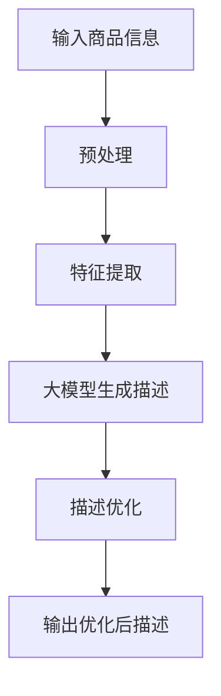

                 

## 1. 背景介绍

在电子商务飞速发展的今天，商品描述的质量直接影响着用户的购买决策。然而，为每一件商品撰写详细且吸引人的描述是一项繁重的任务，这也是一项需要大量人力和时间成本的工作。因此，商品描述的自动生成和优化变得至关重要。大模型，作为人工智能领域的一个重要分支，在商品描述的自动生成和优化中发挥着越来越重要的作用。

## 2. 核心概念与联系

### 2.1 大模型的定义

大模型（Large Language Models，LLMs）是一种通过学习大量文本数据来理解和生成人类语言的深度学习模型。它们具有广泛的理解和生成能力，可以处理各种任务，从翻译到写作，再到对话。

### 2.2 商品描述自动生成与优化

商品描述自动生成指的是使用算法和模型自动生成商品的描述文本。商品描述优化则是指改进已有描述文本的质量，使其更吸引人，更能说服用户购买。

### 2.3 核心概念原理与架构的 Mermaid 流程图



## 3. 核心算法原理 & 具体操作步骤

### 3.1 算法原理概述

大模型在商品描述自动生成与优化中的应用主要基于两个步骤：描述生成和描述优化。描述生成使用大模型根据商品信息生成初始描述，描述优化则使用优化算法改进初始描述。

### 3.2 算法步骤详解

1. **输入商品信息**：首先，收集商品的相关信息，如名称、类别、属性、描述等。
2. **预处理**：清洗和标准化商品信息，去除无用信息，并将其转换为模型可以理解的格式。
3. **特征提取**：提取商品信息中的关键特征，这些特征将被用于生成描述。
4. **大模型生成描述**：使用大模型根据提取的特征生成初始描述。
5. **描述优化**：使用优化算法改进初始描述，使其更吸引人，更能说服用户购买。
6. **输出优化后描述**：输出优化后的商品描述。

### 3.3 算法优缺点

**优点**：

* 自动化：大大减少了人工工作量。
* 规模化：可以处理大量商品信息。
* 个性化：可以根据商品特征生成个性化描述。

**缺点**：

* 依赖数据质量：模型的性能取决于输入数据的质量。
* 缺乏人文关怀：生成的描述可能缺乏人文关怀和创意。
* 计算资源需求：大模型需要大量计算资源。

### 3.4 算法应用领域

商品描述自动生成和优化的应用领域包括电子商务平台、在线零售商店、产品目录等。它可以帮助这些平台提高工作效率，降低成本，并提供更好的用户体验。

## 4. 数学模型和公式 & 详细讲解 & 举例说明

### 4.1 数学模型构建

商品描述自动生成和优化的数学模型可以表示为：

$$D = f(C, M)$$

其中，$C$表示商品信息，$M$表示大模型，$f$表示模型函数，$D$表示生成的描述。

### 4.2 公式推导过程

推导过程如下：

1. 将商品信息$C$输入预处理模块，输出预处理后的信息$C'$。
2. 使用特征提取算法提取$C'$中的关键特征，输出特征向量$F$.
3. 将$F$输入大模型$M$,输出初始描述$D'$。
4. 使用描述优化算法优化$D'$,输出优化后描述$D$.

### 4.3 案例分析与讲解

例如，假设我们要描述一件商品，其信息为：

$$C = \{name: "iPhone 12", category: "Smartphone", attributes: \{color: "blue", storage: "256GB"\}\}$$

预处理后的信息为：

$$C' = \{name: "iPhone 12", category: "Smartphone", attributes: \{color: "blue", storage: "256GB"\}, description: "A smartphone by Apple"\}$$

特征提取后的特征向量为：

$$F = \{brand: "Apple", model: "iPhone 12", color: "blue", storage: "256GB"\}$$

大模型生成的初始描述为：

$$D' = "The iPhone 12 is a smartphone by Apple, available in blue with 256GB of storage."$$

描述优化后的优化后描述为：

$$D = "Experience the future with the iPhone 12, a sleek blue smartphone by Apple featuring 256GB of storage."$$

## 5. 项目实践：代码实例和详细解释说明

### 5.1 开发环境搭建

本项目使用Python作为编程语言，并依赖于Transformers库来使用大模型。因此，我们需要安装Python和Transformers库。

```bash
pip install transformers
```

### 5.2 源代码详细实现

以下是一个简单的商品描述自动生成和优化的Python示例：

```python
from transformers import AutoTokenizer, AutoModelForSeq2SeqLM

# Load pre-trained model and tokenizer
model = AutoModelForSeq2SeqLM.from_pretrained("t5-base")
tokenizer = AutoTokenizer.from_pretrained("t5-base")

# Define a function to generate and optimize product description
def generate_and_optimize_description(product_info):
    # Preprocess product info
    #...

    # Extract features
    #...

    # Generate initial description
    inputs = tokenizer("generate a description for a product with features: " + ", ".join(features), return_tensors="pt")
    output = model.generate(inputs["input_ids"], max_length=50, num_beams=5, early_stopping=True)
    initial_description = tokenizer.decode(output[0])

    # Optimize description
    #...

    return optimized_description
```

### 5.3 代码解读与分析

这段代码使用了预训练的T5模型来生成商品描述。首先，它预处理商品信息并提取关键特征。然后，它使用模型生成初始描述。最后，它优化初始描述，输出优化后描述。

### 5.4 运行结果展示

运行这段代码后，我们可以得到优化后的商品描述。

## 6. 实际应用场景

### 6.1 电子商务平台

商品描述自动生成和优化可以帮助电子商务平台提高工作效率，降低成本，并提供更好的用户体验。

### 6.2 在线零售商店

在线零售商店可以使用商品描述自动生成和优化来吸引更多的客户，并提高销售额。

### 6.3 产品目录

商品描述自动生成和优化可以帮助产品目录自动生成详细且吸引人的产品描述。

### 6.4 未来应用展望

未来，商品描述自动生成和优化有望与其他人工智能技术结合，提供更智能化的解决方案。例如，它可以与图像识别技术结合，自动生成商品描述和图像。

## 7. 工具和资源推荐

### 7.1 学习资源推荐

* "Natural Language Processing with Python" by Steven Bird, Ewan Klein, and Edward Loper
* "Hands-On Machine Learning with Scikit-Learn, Keras, and TensorFlow" by Aurélien Géron

### 7.2 开发工具推荐

* Jupyter Notebook
* Google Colab
* PyCharm

### 7.3 相关论文推荐

* "BERT: Pre-training of Deep Bidirectional Transformers for Language Understanding" by Jacob Devlin and Ming-Wei Chang
* "T5: Text-to-Text Transfer Transformer" by Colin Raffel and Noam Shazeer

## 8. 总结：未来发展趋势与挑战

### 8.1 研究成果总结

商品描述自动生成和优化是一个具有挑战性的任务，但大模型在该任务中的应用取得了显著的进展。大模型可以生成详细且吸引人的商品描述，并可以与其他优化算法结合以改进描述。

### 8.2 未来发展趋势

未来，大模型在商品描述自动生成和优化中的应用有望继续发展。我们可以期待更智能化的解决方案，如结合图像识别技术，并与其他人工智能技术结合。

### 8.3 面临的挑战

然而，商品描述自动生成和优化仍然面临着挑战。这些挑战包括数据质量问题，模型泛化能力有限，以及缺乏人文关怀和创意。

### 8.4 研究展望

未来的研究可以探索以下方向：

* 使用更大、更复杂的模型来改进描述质量。
* 结合其他人工智能技术，如图像识别技术，提供更智能化的解决方案。
* 研究如何在保持描述质量的同时，减少模型的计算资源需求。

## 9. 附录：常见问题与解答

**Q1：商品描述自动生成和优化的优点是什么？**

**A1：商品描述自动生成和优化可以帮助电子商务平台提高工作效率，降低成本，并提供更好的用户体验。**

**Q2：商品描述自动生成和优化的缺点是什么？**

**A2：商品描述自动生成和优化的缺点包括数据质量问题，模型泛化能力有限，以及缺乏人文关怀和创意。**

**Q3：商品描述自动生成和优化的未来发展趋势是什么？**

**A3：未来，商品描述自动生成和优化有望与其他人工智能技术结合，提供更智能化的解决方案。**

**Q4：商品描述自动生成和优化的研究展望是什么？**

**A4：未来的研究可以探索使用更大、更复杂的模型来改进描述质量，结合其他人工智能技术，以及研究如何减少模型的计算资源需求。**

## 作者：禅与计算机程序设计艺术 / Zen and the Art of Computer Programming

