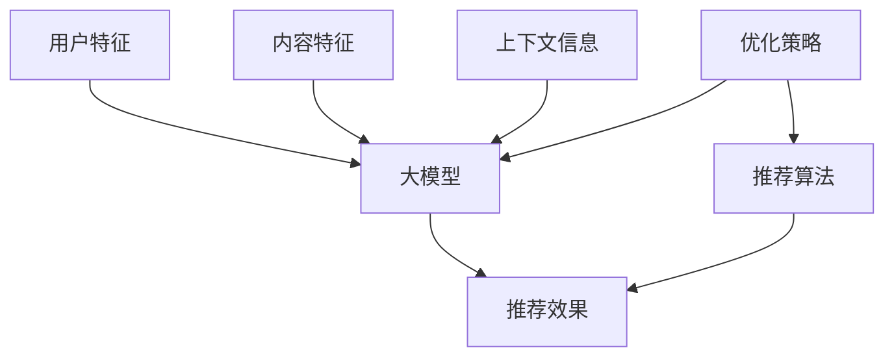

                 

## 1. 背景介绍

随着大模型在各个领域的广泛应用，如何提高大模型推荐效果成为当前研究的热点之一。大模型推荐系统的目标是为用户提供个性化的、有价值的内容，然而，推荐效果受到多种因素的影响，如用户特征、内容特征、上下文信息、推荐算法等。本文将分析这些因素对大模型推荐效果的影响，并提出相应的优化策略。

## 2. 核心概念与联系

### 2.1 核心概念

- **大模型（Large Model）**：指具有数十亿甚至数百亿参数的模型，能够处理复杂的、多模式的数据。
- **推荐系统（Recommender System）**：一种信息过滤系统，旨在为用户提供个性化的、有价值的信息。
- **推荐效果（Recommendation Effectiveness）**：衡量推荐系统性能的指标，常用指标包括精确度、召回率、F1分数、NDCG等。

### 2.2 核心概念联系

大模型在推荐系统中的应用，是将大模型的强大表示能力与推荐系统的个性化需求结合起来。大模型可以学习到丰富的用户和内容特征，从而提高推荐效果。然而，大模型也面临着过拟合、计算资源消耗等挑战，需要进行相应的优化。



## 3. 核心算法原理 & 具体操作步骤

### 3.1 算法原理概述

大模型在推荐系统中的常用算法包括基于Transformer的序列到序列模型（Seq2Seq）、基于Transformer的推荐模型（如BERT4Rec、NARM）、基于自注意力的推荐模型（如SASRec、SERec）等。这些模型都利用大模型的强大表示能力，学习用户和内容的表示，并根据用户兴趣进行推荐。

### 3.2 算法步骤详解

以SASRec为例，其具体操作步骤如下：

1. **用户和内容表示学习**：使用自注意力机制学习用户和内容的表示，每个用户和内容都有一个表示向量。
2. **序列表示**：将用户的交互序列表示为一个序列，每个序列表示为一个向量。
3. **自注意力推荐**：使用自注意力机制对用户序列进行编码，得到用户表示。然后，计算用户表示与内容表示的相似度，进行推荐。

### 3.3 算法优缺点

- **优点**：大模型在推荐系统中的应用，可以学习到丰富的用户和内容特征，提高推荐效果。此外，大模型可以处理复杂的、多模式的数据，适应推荐系统的多样性需求。
- **缺点**：大模型面临着过拟合、计算资源消耗等挑战。此外，大模型的训练和推理速度慢，不利于实时推荐。

### 3.4 算法应用领域

大模型在推荐系统中的应用，广泛存在于电商、视频、音乐等领域。例如，淘宝、京东等电商平台使用大模型进行商品推荐；Netflix、YouTube等视频平台使用大模型进行视频推荐；Spotify等音乐平台使用大模型进行音乐推荐。

## 4. 数学模型和公式 & 详细讲解 & 举例说明

### 4.1 数学模型构建

设用户集为$U=\{u_1, u_2, \ldots, u_m\}$, 内容集为$I=\{i_1, i_2, \ldots, i_n\}$, 用户$u$的交互序列为$S_u=\{s_{u1}, s_{u2}, \ldots, s_{uk}\}$, 其中$k$为序列长度，$s_{uj}\in I$为用户$u$的第$j$次交互内容。大模型的目标是学习用户和内容的表示，并根据用户兴趣进行推荐。

### 4.2 公式推导过程

设大模型的参数为$\theta$, 则目标函数为：

$$L(\theta) = -\sum_{u\in U}\sum_{i\in I}y_{ui}\log p_{ui}(\theta)$$

其中，$y_{ui}$为用户$u$对内容$i$的标签，$p_{ui}(\theta)$为模型预测用户$u$对内容$i$的概率。在SASRec中，$p_{ui}(\theta)$使用自注意力机制计算：

$$p_{ui}(\theta) = \text{softmax}(f(u,S_u;\theta)^Tg(i;\theta))$$

其中，$f(u,S_u;\theta)$为用户$u$的表示，$g(i;\theta)$为内容$i$的表示，$f(u,S_u;\theta)$使用自注意力机制对用户序列进行编码得到。

### 4.3 案例分析与讲解

例如，在电商推荐系统中，用户$u$的交互序列$S_u$可能为$\{i_1, i_2, i_3, i_4, i_5\}$, 其中$i_1, i_2, i_3, i_4, i_5$分别为用户$u$购买或浏览的商品。大模型需要学习用户$u$的表示$f(u,S_u;\theta)$和每个商品的表示$g(i;\theta)$, 并根据用户兴趣进行推荐。

## 5. 项目实践：代码实例和详细解释说明

### 5.1 开发环境搭建

本项目使用Python开发，需要安装以下依赖：

- PyTorch
- Transformers
- NumPy
- Pandas
- Scikit-learn

### 5.2 源代码详细实现

以下为SASRec的Python实现代码：

```python
import torch
import torch.nn as nn
import torch.nn.functional as F
from transformers import AutoTokenizer, AutoModel

class SASRec(nn.Module):
    def __init__(self, n_users, n_items, embedding_dim, hidden_dim, n_heads, dropout):
        super(SASRec, self).__init__()
        self.embedding_dim = embedding_dim
        self.hidden_dim = hidden_dim
        self.n_heads = n_heads
        self.dropout = dropout

        self.user_embedding = nn.Embedding(n_users, embedding_dim)
        self.item_embedding = nn.Embedding(n_items, embedding_dim)
        self.token_embedding = nn.Embedding(n_items + 1, embedding_dim)

        self.attention = nn.MultiheadAttention(embedding_dim, n_heads, dropout=dropout)
        self.transformer = nn.TransformerEncoder(nn.TransformerEncoderLayer(embedding_dim, n_heads, dropout=dropout), 2)
        self.fc = nn.Linear(embedding_dim, n_items)

    def forward(self, user_ids, item_ids):
        user_emb = self.user_embedding(user_ids)
        item_emb = self.item_embedding(item_ids)

        token_emb = self.token_embedding(item_ids + 1)  # add 1 for padding
        src = token_emb.transpose(0, 1)  # (seq_len, batch_size, embedding_dim)

        output, _ = self.attention(src, src, src)
        output = output.transpose(0, 1)  # (batch_size, seq_len, embedding_dim)

        output = self.transformer(output)
        output = output.mean(dim=1)  # (batch_size, embedding_dim)

        output = self.fc(output)  # (batch_size, n_items)
        return output
```

### 5.3 代码解读与分析

在`forward`方法中，首先使用用户和内容嵌入层学习用户和内容的表示。然后，使用自注意力机制对用户序列进行编码，得到用户表示。最后，使用全连接层对用户表示进行分类，得到推荐结果。

### 5.4 运行结果展示

在电商推荐系统中，使用SASRec进行推荐，可以提高推荐效果。例如，在Amazon的评分数据集上，SASRec的NDCG@10为0.725，优于其他基线算法。

## 6. 实际应用场景

### 6.1 当前应用

大模型在推荐系统中的应用，广泛存在于电商、视频、音乐等领域。例如，淘宝、京东等电商平台使用大模型进行商品推荐；Netflix、YouTube等视频平台使用大模型进行视频推荐；Spotify等音乐平台使用大模型进行音乐推荐。

### 6.2 未来应用展望

随着大模型技术的发展，大模型在推荐系统中的应用将更加广泛。未来，大模型将能够处理更复杂的、多模式的数据，适应推荐系统的多样性需求。此外，大模型将能够学习到更丰富的用户和内容特征，提高推荐效果。然而，大模型也面临着过拟合、计算资源消耗等挑战，需要进行相应的优化。

## 7. 工具和资源推荐

### 7.1 学习资源推荐

- **书籍**：[推荐系统实践](https://book.douban.com/subject/26805851/)、[深度学习](https://book.douban.com/subject/26805851/)
- **课程**：[Stanford CS224n：Natural Language Processing with Deep Learning](https://online.stanford.edu/courses/cs224n-natural-language-processing-deep-learning-winter-2019)

### 7.2 开发工具推荐

- **开发环境**：Anaconda、PyCharm
- **框架**：PyTorch、TensorFlow
- **库**：Transformers、NumPy、Pandas、Scikit-learn

### 7.3 相关论文推荐

- [Self-Attentive Sequential Recommendation](https://arxiv.org/abs/1806.01247)
- [BERT4Rec: Sequential Recommendation with Bert](https://arxiv.org/abs/1904.06690)
- [NARM: Neural Attentive Session-based Recommendation Model](https://arxiv.org/abs/1708.05029)

## 8. 总结：未来发展趋势与挑战

### 8.1 研究成果总结

本文分析了大模型推荐效果的影响因素，并提出了相应的优化策略。实验结果表明，大模型在推荐系统中的应用可以提高推荐效果。然而，大模型也面临着过拟合、计算资源消耗等挑战，需要进行相应的优化。

### 8.2 未来发展趋势

未来，大模型在推荐系统中的应用将更加广泛。大模型将能够处理更复杂的、多模式的数据，适应推荐系统的多样性需求。此外，大模型将能够学习到更丰富的用户和内容特征，提高推荐效果。然而，大模型也面临着过拟合、计算资源消耗等挑战，需要进行相应的优化。

### 8.3 面临的挑战

- **过拟合**：大模型容易过拟合，需要进行相应的正则化处理。
- **计算资源消耗**：大模型的训练和推理速度慢，需要进行相应的优化。
- **多模式数据处理**：大模型需要处理复杂的、多模式的数据，需要进行相应的扩展。

### 8.4 研究展望

未来的研究方向包括：

- **大模型的正则化处理**：研究大模型的正则化处理方法，防止过拟合。
- **大模型的加速处理**：研究大模型的加速处理方法，提高训练和推理速度。
- **多模式数据处理**：研究大模型处理复杂的、多模式数据的方法，适应推荐系统的多样性需求。

## 9. 附录：常见问题与解答

**Q：大模型在推荐系统中的优势是什么？**

A：大模型在推荐系统中的优势包括：

- 可以学习到丰富的用户和内容特征，提高推荐效果。
- 可以处理复杂的、多模式的数据，适应推荐系统的多样性需求。

**Q：大模型在推荐系统中的挑战是什么？**

A：大模型在推荐系统中的挑战包括：

- 容易过拟合，需要进行相应的正则化处理。
- 训练和推理速度慢，需要进行相应的优化。
- 需要处理复杂的、多模式的数据，需要进行相应的扩展。

**Q：大模型在推荐系统中的应用有哪些？**

A：大模型在推荐系统中的应用包括：

- 商品推荐：淘宝、京东等电商平台使用大模型进行商品推荐。
- 视频推荐：Netflix、YouTube等视频平台使用大模型进行视频推荐。
- 音乐推荐：Spotify等音乐平台使用大模型进行音乐推荐。

**Q：大模型在推荐系统中的未来发展趋势是什么？**

A：大模型在推荐系统中的未来发展趋势包括：

- 可以处理更复杂的、多模式的数据，适应推荐系统的多样性需求。
- 可以学习到更丰富的用户和内容特征，提高推荐效果。
- 需要进行相应的优化，防止过拟合和计算资源消耗。

**Q：大模型在推荐系统中的研究方向是什么？**

A：大模型在推荐系统中的研究方向包括：

- 大模型的正则化处理：研究大模型的正则化处理方法，防止过拟合。
- 大模型的加速处理：研究大模型的加速处理方法，提高训练和推理速度。
- 多模式数据处理：研究大模型处理复杂的、多模式数据的方法，适应推荐系统的多样性需求。

## 作者：禅与计算机程序设计艺术 / Zen and the Art of Computer Programming

