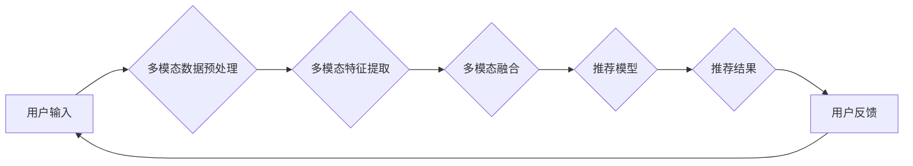

                 

## 大模型驱动的推荐系统多模态内容推荐

> 关键词：大模型、推荐系统、多模态、内容推荐、深度学习、Transformer、BERT、视觉理解、自然语言处理

## 1. 背景介绍

随着互联网信息爆炸式增长，用户面临着海量内容的筛选难题。传统的基于内容或协同过滤的推荐系统，由于单一特征的局限性，难以满足用户个性化需求和多样的内容形式。大模型的出现为推荐系统带来了新的机遇，其强大的语义理解和泛化能力，能够有效处理多模态内容，提升推荐精准度和用户体验。

多模态内容是指包含多种数据类型（如文本、图像、音频、视频）的信息，它更贴近真实世界，能够更全面地表达用户需求和内容特征。大模型驱动的多模态推荐系统，通过融合不同模态信息，能够更深入地理解用户偏好和内容语义，从而提供更个性化、更精准的推荐结果。

## 2. 核心概念与联系

### 2.1 多模态内容推荐

多模态内容推荐是指利用文本、图像、音频等多种数据类型，为用户提供个性化、精准的内容推荐。

### 2.2 大模型

大模型是指参数规模庞大、训练数据海量的人工智能模型，其强大的学习能力能够处理复杂的任务，例如自然语言理解、图像识别、语音合成等。

### 2.3 核心架构

大模型驱动的多模态内容推荐系统通常包含以下核心组件：

* **多模态数据预处理模块:** 对不同模态数据进行清洗、转换、编码等预处理，使其能够被模型理解。
* **多模态特征提取模块:** 利用深度学习模型（如Transformer、BERT等）提取不同模态数据的特征表示。
* **多模态融合模块:** 将不同模态的特征进行融合，形成综合的表示。
* **推荐模型模块:** 基于融合后的特征，预测用户对不同内容的兴趣。
* **结果展示模块:** 将推荐结果以用户友好的方式展示给用户。

**Mermaid 流程图**



## 3. 核心算法原理 & 具体操作步骤

### 3.1 算法原理概述

大模型驱动的多模态内容推荐系统，通常采用以下算法原理：

* **Transformer模型:** Transformer模型是一种强大的序列建模模型，能够有效捕捉文本序列中的长距离依赖关系。
* **BERT模型:** BERT模型是一种基于Transformer的预训练语言模型，能够理解文本语义和上下文关系。
* **多模态融合:** 将不同模态的特征进行融合，可以采用多种方法，例如拼接、注意力机制、多层感知机等。

### 3.2 算法步骤详解

1. **数据预处理:** 对文本、图像、音频等多模态数据进行清洗、转换、编码等预处理，使其能够被模型理解。
2. **特征提取:** 利用预训练的Transformer模型（如BERT）提取文本特征，利用预训练的视觉模型（如ResNet）提取图像特征。
3. **多模态融合:** 将文本特征和图像特征进行融合，可以使用拼接、注意力机制等方法。
4. **推荐模型训练:** 利用融合后的特征，训练推荐模型，例如基于深度学习的推荐模型（如多层感知机、深度神经网络等）。
5. **推荐结果输出:** 将训练好的推荐模型应用于新的用户数据和内容数据，预测用户对不同内容的兴趣，并输出推荐结果。

### 3.3 算法优缺点

**优点:**

* 能够处理多模态数据，更全面地理解用户需求和内容特征。
* 大模型的强大学习能力，能够提升推荐精准度和用户体验。
* 能够个性化推荐，满足不同用户的需求。

**缺点:**

* 数据预处理和特征提取需要大量计算资源和时间。
* 模型训练需要海量数据和强大的计算能力。
* 多模态融合算法的选取和设计对推荐效果有重要影响。

### 3.4 算法应用领域

大模型驱动的多模态内容推荐系统，广泛应用于以下领域：

* **电商推荐:** 为用户推荐商品、优惠券等。
* **视频推荐:** 为用户推荐视频、直播等。
* **音乐推荐:** 为用户推荐歌曲、专辑等。
* **新闻推荐:** 为用户推荐新闻、文章等。
* **社交媒体推荐:** 为用户推荐好友、话题等。

## 4. 数学模型和公式 & 详细讲解 & 举例说明

### 4.1 数学模型构建

假设我们有一个包含用户、物品和特征的三元组 (u, i, f)，其中 u 代表用户， i 代表物品， f 代表特征。

* **用户特征向量:**  $u = [u_1, u_2, ..., u_n]$
* **物品特征向量:** $i = [i_1, i_2, ..., i_m]$
* **特征向量:** $f = [f_1, f_2, ..., f_k]$

### 4.2 公式推导过程

**协同过滤模型:**

$$
\hat{r}_{ui} = \alpha \cdot \frac{u \cdot i}{\|u\| \|i\|} + (1-\alpha) \cdot \frac{u \cdot f_i}{\|u\| \|f_i\|}
$$

其中:

* $\hat{r}_{ui}$ 是模型预测的用户 u 对物品 i 的评分。
* $\alpha$ 是权重参数，控制着协同过滤和内容过滤的比例。
* $u \cdot i$ 是用户 u 和物品 i 的点积。
* $\|u\|$ 和 $\|i\|$ 是用户 u 和物品 i 的特征向量的范数。
* $u \cdot f_i$ 是用户 u 和物品 i 的特征向量的点积。
* $\|f_i\|$ 是物品 i 的特征向量的范数。

**注意力机制:**

$$
\text{Attention}(Q, K, V) = \frac{\text{softmax}(\frac{Q K^T}{\sqrt{d_k}}) V}{\text{softmax}(\frac{Q K^T}{\sqrt{d_k}})}
$$

其中:

* $Q$, $K$, $V$ 分别是查询矩阵、键矩阵和值矩阵。
* $d_k$ 是键向量的维度。

### 4.3 案例分析与讲解

**案例:**

假设我们有一个电商平台，需要推荐商品给用户。

* 用户特征: 年龄、性别、购买历史等。
* 商品特征: 类别、价格、描述等。

我们可以使用协同过滤模型和内容过滤模型结合，构建一个多模态推荐系统。

* 协同过滤模型: 根据用户的购买历史，推荐与其他用户购买相似商品的用户。
* 内容过滤模型: 根据用户的特征和商品特征，推荐与用户兴趣相符的商品。

我们可以使用注意力机制，将文本特征和图像特征进行融合，提升推荐精准度。

## 5. 项目实践：代码实例和详细解释说明

### 5.1 开发环境搭建

* Python 3.7+
* PyTorch 1.7+
* TensorFlow 2.0+
* CUDA 10.2+
* GPU

### 5.2 源代码详细实现

```python
# 导入必要的库
import torch
import torch.nn as nn

# 定义多模态融合网络
class MultiModalFusionNetwork(nn.Module):
    def __init__(self, text_dim, image_dim):
        super(MultiModalFusionNetwork, self).__init__()
        self.text_embedding = nn.Linear(text_dim, 128)
        self.image_embedding = nn.Linear(image_dim, 128)
        self.fusion_layer = nn.Linear(256, 64)

    def forward(self, text, image):
        text_embedding = self.text_embedding(text)
        image_embedding = self.image_embedding(image)
        fused_embedding = self.fusion_layer(torch.cat((text_embedding, image_embedding), dim=1))
        return fused_embedding

# 定义推荐模型
class RecommenderModel(nn.Module):
    def __init__(self, embedding_dim, num_items):
        super(RecommenderModel, self).__init__()
        self.embedding = nn.Embedding(num_items, embedding_dim)
        self.fusion_network = MultiModalFusionNetwork(embedding_dim, embedding_dim)
        self.output_layer = nn.Linear(64, 1)

    def forward(self, user_embedding, item_embedding):
        fused_embedding = self.fusion_network(user_embedding, item_embedding)
        prediction = self.output_layer(fused_embedding)
        return prediction

# 实例化模型
model = RecommenderModel(embedding_dim=64, num_items=1000)

# 训练模型
# ...

# 推理模型
# ...
```

### 5.3 代码解读与分析

* **MultiModalFusionNetwork:** 该网络负责融合文本和图像特征。
* **RecommenderModel:** 该模型负责预测用户对物品的评分。
* **embedding:** 将物品ID映射到低维向量空间。
* **fusion_network:** 将用户特征和物品特征进行融合。
* **output_layer:** 输出预测评分。

### 5.4 运行结果展示

* 训练完成后，可以利用模型预测用户对不同物品的评分。
* 将预测评分排序，输出推荐结果。

## 6. 实际应用场景

### 6.1 电商推荐

大模型驱动的多模态内容推荐系统，可以为电商平台提供更精准的商品推荐，提升用户购物体验和转化率。例如，可以根据用户的浏览历史、购买记录、兴趣标签等信息，推荐与用户需求相符的商品。

### 6.2 视频推荐

视频平台可以利用大模型驱动的多模态内容推荐系统，推荐用户感兴趣的视频内容。例如，可以根据用户的观看历史、点赞记录、评论内容等信息，推荐与用户兴趣相符的视频。

### 6.3 音乐推荐

音乐平台可以利用大模型驱动的多模态内容推荐系统，推荐用户喜欢的音乐。例如，可以根据用户的播放历史、收藏歌曲、评论内容等信息，推荐与用户口味相符的音乐。

### 6.4 未来应用展望

大模型驱动的多模态内容推荐系统，未来将应用于更多领域，例如：

* 教育推荐: 为学生推荐个性化的学习资源。
* 医疗推荐: 为患者推荐合适的医疗方案。
* 旅游推荐: 为游客推荐个性化的旅游路线。

## 7. 工具和资源推荐

### 7.1 学习资源推荐

* **书籍:**
    * Deep Learning by Ian Goodfellow
    * Natural Language Processing with Python by Steven Bird
    * Hands-On Machine Learning with Scikit-Learn, Keras & TensorFlow by Aurélien Géron
* **在线课程:**
    * Stanford CS224N: Natural Language Processing with Deep Learning
    * DeepLearning.AI TensorFlow Specialization
    * fast.ai Practical Deep Learning for Coders

### 7.2 开发工具推荐

* **深度学习框架:** PyTorch, TensorFlow
* **自然语言处理库:** NLTK, spaCy, Hugging Face Transformers
* **图像处理库:** OpenCV, Pillow

### 7.3 相关论文推荐

* BERT: Pre-training of Deep Bidirectional Transformers for Language Understanding
* Transformer: Attention Is All You Need
* Multimodal Learning with Deep Neural Networks: A Survey

## 8. 总结：未来发展趋势与挑战

### 8.1 研究成果总结

大模型驱动的多模态内容推荐系统，取得了显著的成果，能够有效提升推荐精准度和用户体验。

### 8.2 未来发展趋势

* **模型规模和能力提升:** 未来，大模型规模将进一步扩大，模型能力将更加强大，能够处理更复杂的多模态数据。
* **多模态融合算法创新:** 将探索更有效的多模态融合算法，提升推荐效果。
* **个性化推荐增强:** 将进一步增强个性化推荐能力，为用户提供更精准、更符合其需求的推荐结果。
* **跨模态理解:** 将探索跨模态理解能力，例如将文本理解为图像，将图像理解为文本。

### 8.3 面临的挑战

* **数据获取和标注:** 多模态数据获取和标注成本高，需要更有效的解决方案。
* **模型训练和部署:** 大模型训练和部署需要强大的计算资源，需要更有效的训练和部署方法。
* **公平性和可解释性:** 需要保证推荐系统的公平性和可解释性，避免算法偏见和歧视。

### 8.4 研究展望

未来，大模型驱动的多模态内容推荐系统将继续发展，为用户提供更智能、更个性化的体验。


## 9. 附录：常见问题与解答

**Q1: 大模型驱动的多模态内容推荐系统与传统的推荐系统相比，有哪些优势？**

**A1:** 大模型驱动的多模态内容推荐系统能够处理多模态数据，更全面地理解用户需求和内容特征，从而提升推荐精准度和用户体验。

**Q2: 如何选择合适的多模态融合算法？**

**A2:** 选择合适的多模态融合算法需要根据具体应用场景和数据特点进行选择。常见的融合算法包括拼接、注意力机制、多层感知机等。

**Q3: 大模型驱动的多模态内容推荐系统有哪些应用场景？**

**A3:** 大模型驱动的多模态内容推荐系统广泛应用于电商推荐、视频推荐、音乐推荐等领域。

**Q4: 如何解决大模型训练和部署的挑战？**

**A4:** 可以利用云计算平台进行大模型训练和部署，并采用模型压缩和量化等技术，降低模型规模和部署成本。


作者：禅与计算机程序设计艺术 / Zen and the Art of Computer Programming<end_of_turn>

