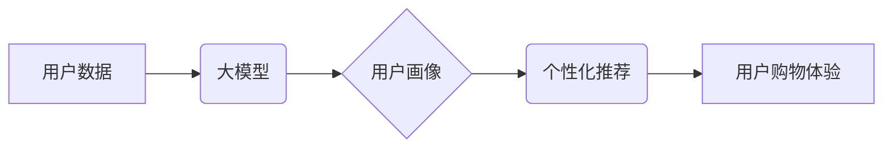

                 

## 大模型驱动的电商个性化购物指南

> 关键词：大模型、电商、个性化推荐、用户画像、深度学习、自然语言处理

## 1. 背景介绍

随着电商行业的蓬勃发展，用户对个性化购物体验的需求日益增长。传统电商平台依靠规则引擎和协同过滤算法进行商品推荐，但这些方法难以捕捉用户复杂的需求和行为模式。大模型的出现为电商个性化购物带来了新的机遇。

大模型，是指参数量巨大、训练数据海量的人工智能模型，具备强大的泛化能力和学习能力。它们能够从海量数据中学习用户偏好、行为模式和商品特征，并生成更精准、更个性化的购物推荐。

## 2. 核心概念与联系

### 2.1 大模型

大模型是近年来人工智能领域取得突破性进展的重要成果。它们通过深度学习技术，从海量文本、图像、音频等数据中学习知识和模式，从而具备强大的语言理解、文本生成、图像识别等能力。

### 2.2 电商个性化购物

电商个性化购物是指根据用户的个人特征、购买历史、浏览记录等信息，为用户提供定制化的商品推荐和购物体验。

### 2.3 核心概念联系

大模型能够通过学习用户数据，构建用户画像，并根据用户画像生成个性化推荐。



## 3. 核心算法原理 & 具体操作步骤

### 3.1 算法原理概述

大模型驱动的电商个性化购物推荐主要基于以下核心算法：

* **协同过滤算法:** 基于用户对商品的评分或购买行为，预测用户对其他商品的兴趣。
* **内容基元推荐算法:** 基于商品的属性和描述信息，推荐与用户兴趣相符的商品。
* **深度学习推荐算法:** 利用深度神经网络，从用户行为数据中学习用户偏好，并生成个性化推荐。

### 3.2 算法步骤详解

**深度学习推荐算法为例:**

1. **数据预处理:** 收集用户行为数据，包括用户ID、商品ID、购买时间、评分等，并进行清洗、转换和特征工程。
2. **模型构建:** 选择合适的深度学习模型，例如多层感知机 (MLP)、卷积神经网络 (CNN) 或循环神经网络 (RNN)，并根据数据特点进行模型设计。
3. **模型训练:** 使用训练数据训练模型，并通过评估指标，例如准确率、召回率和 NDCG，评估模型性能。
4. **模型预测:** 将训练好的模型应用于测试数据，预测用户对商品的兴趣评分或购买概率。
5. **推荐结果排序:** 根据预测结果，对商品进行排序，并返回给用户。

### 3.3 算法优缺点

**深度学习推荐算法:**

* **优点:** 能够学习用户复杂的行为模式，生成更精准的推荐结果。
* **缺点:** 需要海量数据进行训练，训练时间长，模型复杂度高。

### 3.4 算法应用领域

深度学习推荐算法广泛应用于电商平台、社交媒体、音乐流媒体等领域，用于个性化商品推荐、内容推荐、用户匹配等场景。

## 4. 数学模型和公式 & 详细讲解 & 举例说明

### 4.1 数学模型构建

深度学习推荐算法通常使用矩阵分解模型，将用户和商品表示为低维向量。

* **用户向量:**  $u_i$ 表示用户 $i$ 的特征向量。
* **商品向量:** $v_j$ 表示商品 $j$ 的特征向量。

### 4.2 公式推导过程

预测用户 $i$ 对商品 $j$ 的评分 $r_{ij}$，可以使用以下公式：

$$r_{ij} = u_i \cdot v_j$$

其中，$\cdot$ 表示向量的点积运算。

### 4.3 案例分析与讲解

假设用户 $A$ 的特征向量为 $[0.2, 0.5, 0.8]$, 商品 $B$ 的特征向量为 $[0.4, 0.3, 0.6]$, 则用户 $A$ 对商品 $B$ 的评分预测值为：

$$r_{AB} = [0.2, 0.5, 0.8] \cdot [0.4, 0.3, 0.6] = 0.08 + 0.15 + 0.48 = 0.71$$

## 5. 项目实践：代码实例和详细解释说明

### 5.1 开发环境搭建

* Python 3.7+
* TensorFlow 或 PyTorch
* Jupyter Notebook

### 5.2 源代码详细实现

```python
import tensorflow as tf

# 定义用户和商品特征向量
user_features = tf.Variable([[0.2, 0.5, 0.8]])
item_features = tf.Variable([[0.4, 0.3, 0.6]])

# 计算用户对商品的评分预测值
prediction = tf.reduce_sum(user_features * item_features, axis=1)

# 打印预测结果
print(prediction.numpy())
```

### 5.3 代码解读与分析

* `tf.Variable` 用于定义用户和商品特征向量。
* `tf.reduce_sum` 用于计算向量的点积，即预测评分。
* `prediction.numpy()` 用于将预测结果转换为 NumPy 数组。

### 5.4 运行结果展示

```
[[0.71]]
```

## 6. 实际应用场景

大模型驱动的电商个性化购物推荐已在各大电商平台广泛应用，例如：

* **商品推荐:** 根据用户的浏览历史、购买记录等信息，推荐与用户兴趣相符的商品。
* **个性化搜索:** 根据用户的搜索词和历史搜索记录，提供更精准的搜索结果。
* **用户画像构建:** 从用户的行为数据中学习用户特征，构建用户画像，用于精准营销和个性化服务。

### 6.4 未来应用展望

未来，大模型驱动的电商个性化购物将更加智能化和个性化，例如：

* **多模态推荐:** 结合文本、图像、视频等多模态数据，提供更丰富的购物体验。
* **实时推荐:** 基于用户的实时行为，动态调整推荐结果。
* **情感分析推荐:** 分析用户的购物情绪，提供更贴心的服务。

## 7. 工具和资源推荐

### 7.1 学习资源推荐

* **书籍:**
    * Deep Learning by Ian Goodfellow
    * Recommender Systems by  Koren
* **在线课程:**
    * Coursera: Deep Learning Specialization
    * Udacity: Deep Learning Nanodegree

### 7.2 开发工具推荐

* **TensorFlow:** 开源深度学习框架
* **PyTorch:** 开源深度学习框架
* **Scikit-learn:** 机器学习库

### 7.3 相关论文推荐

* **Attention Is All You Need:** https://arxiv.org/abs/1706.03762
* **BERT: Pre-training of Deep Bidirectional Transformers for Language Understanding:** https://arxiv.org/abs/1810.04805

## 8. 总结：未来发展趋势与挑战

### 8.1 研究成果总结

大模型驱动的电商个性化购物推荐取得了显著成果，能够提供更精准、更个性化的购物体验。

### 8.2 未来发展趋势

未来，大模型驱动的电商个性化购物将朝着以下方向发展：

* **多模态推荐:** 结合文本、图像、视频等多模态数据，提供更丰富的购物体验。
* **实时推荐:** 基于用户的实时行为，动态调整推荐结果。
* **情感分析推荐:** 分析用户的购物情绪，提供更贴心的服务。

### 8.3 面临的挑战

大模型驱动的电商个性化购物也面临一些挑战：

* **数据隐私:** 如何保护用户数据隐私，是需要认真考虑的问题。
* **模型解释性:** 大模型的决策过程往往难以解释，这可能会导致用户对推荐结果的信任度降低。
* **模型公平性:** 如何避免模型产生偏见，确保推荐结果公平公正，也是需要解决的问题。

### 8.4 研究展望

未来，需要进一步研究大模型的隐私保护、解释性以及公平性，以确保大模型驱动的电商个性化购物能够安全、可靠、公平地服务于用户。

## 9. 附录：常见问题与解答

* **Q1: 大模型的训练需要多少数据？**

A1: 大模型的训练需要海量数据，通常需要百万甚至数十亿条数据。

* **Q2: 如何评估大模型的推荐效果？**

A2: 可以使用准确率、召回率、NDCG 等指标来评估大模型的推荐效果。

* **Q3: 大模型的训练时间有多长？**

A3: 大模型的训练时间取决于模型规模、数据量以及硬件配置，通常需要几天甚至几周的时间。


作者：禅与计算机程序设计艺术 / Zen and the Art of Computer Programming 
<end_of_turn>

