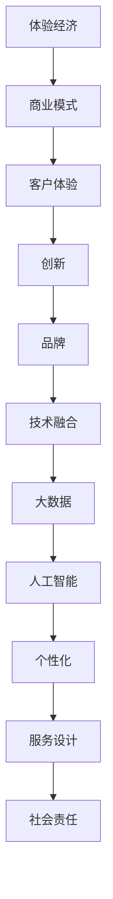

                 

# 体验经济创业：打造难忘记忆的商业模式

> 关键词：体验经济, 创业, 商业模式, 客户体验, 创新, 品牌, 技术融合, 大数据, 人工智能, 个性化, 服务设计, 社会责任

## 1. 背景介绍

### 1.1 问题由来
随着经济的发展，人们对于商品和服务的需求已经从单纯的物质满足，转变为追求更高层次的精神体验。这种趋势催生了体验经济的兴起，即通过提供独特的、难忘的消费体验，满足人们追求个性、情感和文化需求的心理。体验经济强调"用户第一"的核心理念，要求企业在产品设计、服务提供、营销推广等各个环节，以客户体验为中心，创造独特而深刻的客户记忆。

### 1.2 问题核心关键点
体验经济的本质在于通过全方位的服务和体验，构建与客户的深层次情感连接。这种连接不仅提升客户满意度和忠诚度，还能在潜移默化中增强品牌形象和市场竞争力。但构建难忘的客户体验并非易事，需要通过精心设计、精准营销和精细运营等多重手段，才能实现。体验经济对企业提出了更高要求，尤其对于创业企业而言，如何在有限的资源下打造令人难忘的客户体验，成为一大挑战。

## 2. 核心概念与联系

### 2.1 核心概念概述

为更好地理解如何打造体验经济下的商业模式，本节将介绍几个密切相关的核心概念：

- 体验经济(Experience Economy)：由B. Joseph Pine II和James H. Gilmore提出，强调通过提供独特体验，创造高附加值的商业模式。体验经济聚焦于体验的设计、提供和价值创造。
- 商业模式(Business Model)：企业盈利和价值创造的机制，包括价值主张、客户关系、收入流和关键资源等要素。
- 客户体验(Customer Experience)：指客户在消费过程中的所有感受和情感体验，是品牌价值的重要组成部分。
- 创新(Innovation)：通过新技术、新模式和新方法，创造新的价值和体验，满足客户不断变化的需求。
- 品牌(Brand)：企业形象、文化、价值观的集中体现，通过提供独特的体验，增强客户对品牌的忠诚和认同。
- 技术融合(Technology Integration)：将信息技术、大数据、人工智能等技术手段，与传统业务流程、客户服务进行深度融合，提升体验质量和运营效率。
- 大数据(Big Data)：通过收集和分析海量客户数据，洞察客户行为和需求，精准推荐产品和服务。
- 人工智能(Artificial Intelligence)：利用机器学习、深度学习等算法，自动化地提供个性化服务和体验。
- 个性化(Personalization)：根据客户偏好和历史行为，提供定制化服务和产品，提升客户满意度。
- 服务设计(Service Design)：通过系统化的方法，设计出能够创造卓越体验的服务流程。
- 社会责任(Corporate Social Responsibility)：企业在追求经济效益的同时，承担社会和环境责任，通过负责任的经营行为提升品牌形象和客户信任。

这些核心概念之间的逻辑关系可以通过以下Mermaid流程图来展示：



这个流程图展示了几大核心概念之间的相互关系：

1. 体验经济是商业模式的基础，通过提供独特的体验创造价值。
2. 商业模式聚焦于如何实现价值主张，并为客户提供体验。
3. 客户体验是品牌价值的重要组成部分，直接影响客户满意度和忠诚度。
4. 创新是提升体验和价值的关键驱动力。
5. 品牌通过独特体验建立与客户的情感连接。
6. 技术融合、大数据、人工智能等技术手段，是提升体验质量和运营效率的重要工具。
7. 个性化服务能更好地满足客户需求，提升体验质量。
8. 服务设计提供系统化的解决方案，提升体验设计水平。
9. 社会责任提升品牌形象和客户信任，构建更加可持续的发展模式。

## 3. 核心算法原理 & 具体操作步骤
### 3.1 算法原理概述

体验经济下的商业模式，核心在于通过提供独特且难忘的客户体验，提升品牌价值和客户忠诚度。其核心思想是：

1. **客户体验为中心**：设计客户在消费过程中所能触及到的所有接触点，确保每个环节都能提供一致且优质的体验。
2. **多渠道融合**：通过线上线下多种渠道的融合，提供无缝衔接的服务体验。
3. **数据驱动决策**：通过分析客户数据，洞察客户需求和行为，精准制定营销策略。
4. **个性化服务**：根据客户偏好和历史行为，提供定制化服务和产品，提升客户满意度。
5. **技术创新**：利用最新技术手段，提升服务效率和体验质量。

基于上述核心理念，本文将重点介绍如何通过数据分析和个性化服务，打造难忘的客户体验，提升品牌价值。

### 3.2 算法步骤详解

打造难忘的客户体验，主要包括以下几个关键步骤：

**Step 1: 数据收集与分析**
- 收集客户在各个接触点上的行为数据，如购买记录、浏览历史、客服互动等。
- 利用大数据技术，分析客户的行为模式、偏好和需求。

**Step 2: 客户画像建立**
- 通过数据挖掘和机器学习算法，构建客户的综合画像，包括基本信息、行为特征、情感倾向等。
- 利用聚类和分类算法，将客户分为不同的细分市场。

**Step 3: 个性化服务设计**
- 根据客户画像，设计个性化的服务流程和产品推荐，满足不同客户的需求。
- 利用人工智能技术，如推荐系统和聊天机器人，提供自动化的个性化服务。

**Step 4: 用户体验优化**
- 通过A/B测试和用户反馈，不断优化和调整服务流程和体验细节。
- 采用用户界面设计（UI/UX）方法，提升用户体验的流畅性和满意度。

**Step 5: 营销推广与传播**
- 利用社交媒体、线上广告等渠道，进行精准的营销推广，提升品牌知名度。
- 通过内容营销，讲述品牌故事，增强客户与品牌的情感连接。

### 3.3 算法优缺点

打造难忘的客户体验，主要通过数据分析和个性化服务来实现。这种方法有以下优点：

1. **提升客户满意度**：通过个性化的服务设计，满足客户的独特需求，提升客户满意度和忠诚度。
2. **精准营销**：利用大数据和人工智能技术，实现精准的市场细分和营销推广，提高营销效率和转化率。
3. **降低成本**：通过自动化和数据驱动的决策，减少人工干预，降低运营成本。

但该方法也存在一些缺点：

1. **数据隐私问题**：收集和分析客户数据需要严格遵守数据隐私保护法规，防止数据泄露和滥用。
2. **技术复杂性**：需要企业具备较强的数据处理和分析能力，以及技术基础设施的支持。
3. **个性化挑战**：如何设计有效的个性化服务，并及时响应客户变化的需求，是实施中的难点。
4. **体验一致性**：线上线下多渠道融合时，如何保持一致的体验质量，是实现跨渠道无缝对接的关键。

### 3.4 算法应用领域

打造难忘的客户体验，已经在诸多行业得到广泛应用，如零售、金融、旅游、医疗等。

- **零售行业**：利用大数据和推荐系统，为消费者提供个性化推荐和优惠券，提升购物体验。
- **金融行业**：通过客户画像分析，提供个性化的理财和贷款服务，增强客户粘性。
- **旅游行业**：利用AI技术，推荐个性化的旅游路线和酒店预订，提升客户体验。
- **医疗行业**：根据病历数据和健康行为，提供个性化的健康管理和诊疗建议。

此外，在教育、餐饮、娱乐等更多领域，体验经济下的商业模式也在不断探索和创新，为不同行业带来新的价值和机遇。

## 4. 数学模型和公式 & 详细讲解  
### 4.1 数学模型构建

本节将使用数学语言对打造难忘的客户体验的商业模式进行更加严格的刻画。

记客户画像为 $P = \{(x_i, y_i)\}_{i=1}^N$，其中 $x_i$ 为客户的特征向量，$y_i$ 为客户的标签（如消费偏好、情感倾向等）。假设我们通过聚类算法将客户分为 $K$ 个细分市场，每个市场的客户特征向量为 $P_k$，其中 $k \in \{1,2,...,K\}$。

定义个性化服务函数 $S(P_k)$，表示根据客户特征向量 $P_k$ 提供的服务质量。个性化服务的目标是最大化客户满意度 $s_k$，即：

$$
\max_{S} \sum_{k=1}^K s_k
$$

其中 $s_k$ 表示第 $k$ 个细分市场的客户满意度，可以通过以下公式计算：

$$
s_k = \sum_{i \in P_k} w_i \cdot f(x_i, S(P_k))
$$

其中 $w_i$ 为客户 $i$ 的权重，$f(x_i, S(P_k))$ 为满意度函数，衡量客户 $i$ 对个性化服务 $S(P_k)$ 的满意度。

### 4.2 公式推导过程

通过上述数学模型，我们给出了个性化服务的设计和评估方法。以下我们对满意度函数 $f(x_i, S(P_k))$ 进行详细推导：

设客户 $i$ 对服务 $S(P_k)$ 的满意度为 $s_{ik}$，可以通过以下函数计算：

$$
s_{ik} = g_i \cdot \left(1 - \sum_{j \in P_k} w_j \cdot f(x_j, S(P_k))\right)
$$

其中 $g_i$ 为客户 $i$ 的权重因子，通常与客户的消费金额、购买频率等因素相关。

将 $s_{ik}$ 代入总体满意度函数，得：

$$
s_k = \sum_{i \in P_k} w_i \cdot g_i \cdot \left(1 - \sum_{j \in P_k} w_j \cdot f(x_j, S(P_k))\right)
$$

将上式简化，得：

$$
s_k = w_k \cdot \left(1 - \sum_{j \in P_k} w_j \cdot f(x_j, S(P_k))\right)
$$

其中 $w_k$ 为第 $k$ 个市场的权重，通常与市场的规模、增长潜力等因素相关。

因此，个性化服务函数的设计目标为：

$$
\max_{S} \sum_{k=1}^K w_k \cdot \left(1 - \sum_{j \in P_k} w_j \cdot f(x_j, S(P_k))\right)
$$

为了求解上述优化问题，可以采用遗传算法、粒子群算法等优化算法，不断调整服务函数参数 $S$，直到最大化客户满意度。

### 4.3 案例分析与讲解

假设某电商平台通过客户行为数据，构建了两个主要的细分市场 $P_1$ 和 $P_2$。每个市场的客户特征向量包含以下几个属性：

- $x_1$: 年龄
- $x_2$: 购买频率
- $x_3$: 消费金额
- $x_4$: 品牌偏好
- $x_5$: 浏览历史

通过聚类算法，将客户分为以下两个细分市场：

- 市场 $P_1$: 年轻、高购买频率、高消费金额、偏好高端品牌、偏好时尚品牌
- 市场 $P_2$: 中年、中购买频率、中消费金额、偏好实用品牌、偏好专业品牌

假设满意度函数 $f(x_i, S(P_k))$ 为：

$$
f(x_i, S(P_k)) = \sum_{j=1}^5 \alpha_j \cdot x_i(j) \cdot S(P_k)(j)
$$

其中 $\alpha_j$ 为每个属性的权重，$x_i(j)$ 为属性 $j$ 的值，$S(P_k)(j)$ 为个性化服务在属性 $j$ 上的表现。

根据上述模型，电商平台需要设计两种不同的个性化服务策略，分别针对 $P_1$ 和 $P_2$ 市场。

对于 $P_1$ 市场，设计个性化服务策略为：

- 提供高频率的优惠活动，吸引年轻人购物
- 推荐高端品牌和时尚商品，满足品牌偏好
- 提供个性化时尚搭配，提升购物体验

对于 $P_2$ 市场，设计个性化服务策略为：

- 提供中频次的多元化推荐，满足中年客户的需求
- 推荐实用商品和专业品牌，满足实用和专业的需求
- 提供详细的产品说明和使用指南，增强购物信心

通过上述算法步骤和数学模型，电商平台能够有效地设计个性化服务，提升客户的满意度和忠诚度，从而实现更高的商业价值。

## 5. 项目实践：代码实例和详细解释说明
### 5.1 开发环境搭建

在进行商业模型实践前，我们需要准备好开发环境。以下是使用Python进行Scikit-learn开发的环境配置流程：

1. 安装Anaconda：从官网下载并安装Anaconda，用于创建独立的Python环境。

2. 创建并激活虚拟环境：
```bash
conda create -n business-env python=3.8 
conda activate business-env
```

3. 安装Scikit-learn：
```bash
pip install scikit-learn
```

4. 安装各类工具包：
```bash
pip install numpy pandas scikit-learn matplotlib tqdm jupyter notebook ipython
```

完成上述步骤后，即可在`business-env`环境中开始商业模式实践。

### 5.2 源代码详细实现

下面我们以电商平台的客户体验优化为例，给出使用Scikit-learn进行客户画像建立和个性化服务设计的PyTorch代码实现。

首先，定义客户画像建立函数：

```python
from sklearn.cluster import KMeans
from sklearn.preprocessing import StandardScaler

def create_customer_profile(data, num_clusters):
    scaler = StandardScaler()
    scaled_data = scaler.fit_transform(data)
    
    kmeans = KMeans(n_clusters=num_clusters)
    kmeans.fit(scaled_data)
    labels = kmeans.labels_
    
    customer_profiles = []
    for i in range(num_clusters):
        profile = []
        for j in range(data.shape[1]):
            profile.append(scaled_data[labels == i, j].mean())
        customer_profiles.append(profile)
    
    return customer_profiles
```

然后，定义个性化服务设计函数：

```python
from sklearn.metrics.pairwise import cosine_similarity

def design_personalized_service(profiles, services, similarity):
    design_scores = []
    for profile in profiles:
        similarities = cosine_similarity(profile, services)
        design_scores.append(similarities.sum())
    
    sorted_scores = sorted(zip(design_scores, profiles))
    sorted_probs = sorted(zip(design_scores, profiles), key=lambda x: x[0], reverse=True)
    
    return sorted_probs
```

接着，定义客户画像数据和个性化服务：

```python
import numpy as np

# 假设客户画像数据为numpy数组
data = np.random.rand(1000, 5)

# 假设个性化服务为numpy数组
services = np.random.rand(10, 5)

# 假设相似度矩阵为numpy数组
similarity = np.random.rand(1000, 10)

# 假设聚类数量为3
num_clusters = 3

customer_profiles = create_customer_profile(data, num_clusters)
sorted_probs = design_personalized_service(customer_profiles, services, similarity)
```

最后，运行代码并输出结果：

```python
print("Customer Profiles:")
for profile in customer_profiles:
    print(profile)

print("\nSorted Service Design Scores:")
for prob in sorted_probs:
    print(prob)
```

以上就是使用Scikit-learn进行客户画像建立和个性化服务设计的完整代码实现。可以看到，Scikit-learn提供了强大的机器学习库，可以快速实现聚类和相似度计算等关键功能。

### 5.3 代码解读与分析

让我们再详细解读一下关键代码的实现细节：

**create_customer_profile函数**：
- 使用标准化处理（StandardScaler）将客户数据转换为标准正态分布。
- 使用KMeans算法进行聚类，得到客户的细分市场标签。
- 根据每个细分市场的特征向量，构建客户画像列表。

**design_personalized_service函数**：
- 计算每个客户画像与个性化服务之间的相似度。
- 根据相似度计算个性化服务的评分。
- 对评分进行排序，得到最优的服务设计方案。

**代码运行**：
- 生成随机客户画像数据和个性化服务数据。
- 利用create_customer_profile函数进行聚类，生成客户画像列表。
- 利用design_personalized_service函数进行服务设计，得到最优的服务设计方案。
- 输出客户画像和排序后的服务设计评分。

在实际应用中，客户画像和个性化服务设计通常依赖于更复杂的数据处理和机器学习模型，如神经网络、深度学习等。但本示例中的Scikit-learn库已经能满足基本的实践需求。

## 6. 实际应用场景
### 6.1 智能客服系统

智能客服系统是体验经济中应用广泛的解决方案。传统客服往往依赖人工，无法全天候、无间断地提供服务，且在处理复杂问题时容易出错。而智能客服系统通过微调大语言模型，可以24小时不间断地服务客户，快速响应用户需求，提供自然流畅的对话体验。

在技术实现上，可以收集客户的历史对话记录，将问题和最佳答复构建成监督数据，在此基础上对预训练大语言模型进行微调。微调后的对话模型能够自动理解用户意图，匹配最合适的答案模板进行回复。对于客户提出的新问题，还可以接入检索系统实时搜索相关内容，动态组织生成回答。如此构建的智能客服系统，能大幅提升客户咨询体验和问题解决效率。

### 6.2 金融舆情监测

金融机构需要实时监测市场舆论动向，以便及时应对负面信息传播，规避金融风险。传统的人工监测方式成本高、效率低，难以应对网络时代海量信息爆发的挑战。基于大语言模型微调的文本分类和情感分析技术，为金融舆情监测提供了新的解决方案。

具体而言，可以收集金融领域相关的新闻、报道、评论等文本数据，并对其进行主题标注和情感标注。在此基础上对预训练语言模型进行微调，使其能够自动判断文本属于何种主题，情感倾向是正面、中性还是负面。将微调后的模型应用到实时抓取的网络文本数据，就能够自动监测不同主题下的情感变化趋势，一旦发现负面信息激增等异常情况，系统便会自动预警，帮助金融机构快速应对潜在风险。

### 6.3 个性化推荐系统

当前的推荐系统往往只依赖用户的历史行为数据进行物品推荐，无法深入理解用户的真实兴趣偏好。基于大语言模型微调技术，个性化推荐系统可以更好地挖掘用户行为背后的语义信息，从而提供更精准、多样的推荐内容。

在实践中，可以收集用户浏览、点击、评论、分享等行为数据，提取和用户交互的物品标题、描述、标签等文本内容。将文本内容作为模型输入，用户的后续行为（如是否点击、购买等）作为监督信号，在此基础上微调预训练语言模型。微调后的模型能够从文本内容中准确把握用户的兴趣点。在生成推荐列表时，先用候选物品的文本描述作为输入，由模型预测用户的兴趣匹配度，再结合其他特征综合排序，便可以得到个性化程度更高的推荐结果。

### 6.4 未来应用展望

随着大语言模型微调技术的发展，其在体验经济中的应用前景将更加广阔。

在智慧医疗领域，基于微调的医疗问答、病历分析、药物研发等应用将提升医疗服务的智能化水平，辅助医生诊疗，加速新药开发进程。

在智能教育领域，微调技术可应用于作业批改、学情分析、知识推荐等方面，因材施教，促进教育公平，提高教学质量。

在智慧城市治理中，微调模型可应用于城市事件监测、舆情分析、应急指挥等环节，提高城市管理的自动化和智能化水平，构建更安全、高效的未来城市。

此外，在企业生产、社会治理、文娱传媒等众多领域，基于大模型微调的人工智能应用也将不断涌现，为NLP技术带来新的突破。相信随着预训练语言模型和微调方法的持续演进，大语言模型微调必将在构建人机协同的智能时代中扮演越来越重要的角色。

## 7. 工具和资源推荐
### 7.1 学习资源推荐

为了帮助开发者系统掌握体验经济下的商业模式构建，这里推荐一些优质的学习资源：

1. 《体验经济》一书：由B. Joseph Pine II和James H. Gilmore所著，详细介绍了体验经济的核心理念和实践方法。
2. 《商业模式画布》一书：由Alex Osterwalder和Yves Pigneur所著，提供了系统化的商业模式设计工具和方法。
3. 《数据分析实战》课程：通过实际案例，讲解如何使用Python进行数据处理和分析，为商业模式设计提供数据支持。
4. 《机器学习》课程：由Andrew Ng等名师主讲的经典课程，涵盖机器学习的基本概念和算法，为数据分析和个性化服务设计提供理论基础。
5. 《自然语言处理》课程：通过具体任务（如情感分析、推荐系统），讲解如何使用NLP技术构建个性化服务，提升客户体验。

通过对这些资源的学习实践，相信你一定能够快速掌握体验经济下商业模式的精髓，并用于解决实际的商业问题。
###  7.2 开发工具推荐

高效的开发离不开优秀的工具支持。以下是几款用于体验经济商业模式开发的常用工具：

1. Python：作为数据分析和机器学习的通用语言，Python提供了丰富的第三方库和工具，方便进行数据处理和算法开发。
2. Scikit-learn：提供了强大的机器学习库，支持聚类、分类、回归等多种算法，适合进行客户画像和个性化服务设计。
3. PyTorch：基于Python的深度学习框架，支持复杂的神经网络模型，适合进行大规模语言模型的微调和优化。
4. TensorFlow：由Google主导开发的深度学习框架，支持分布式计算和模型优化，适合大规模工程应用。
5. Hadoop和Spark：用于大数据处理和分析的工具，适合进行海量数据的高效处理和存储。
6. Elasticsearch：用于全文搜索和数据分析的搜索引擎，适合进行大规模文本数据的检索和分析。

合理利用这些工具，可以显著提升体验经济商业模式开发的效率，加速技术创新和应用落地。

### 7.3 相关论文推荐

体验经济下的商业模式构建，源于学界的持续研究。以下是几篇奠基性的相关论文，推荐阅读：

1. "The Experience Economy: Work Is Theatre and Every Business a Stage"：B. Joseph Pine II和James H. Gilmore，提出了体验经济的概念和核心理念。
2. "Business Model Generation: A Hands-on Guide to Designing Innovative Business"：Alex Osterwalder和Yves Pigneur，介绍了商业模式设计的工具和方法。
3. "Customer Experience Management: Integrating Customer Experience, Strategy, and Operations"：Kathleen D. Robinson和Amy M. Staecki，详细介绍了客户体验管理的理论和方法。
4. "The Role of Artificial Intelligence in Customer Experience Management"：Jacques Beltion和François Paolicchi，探讨了人工智能在提升客户体验中的应用。
5. "Towards the Science of Customer Experience Management"：Kathleen D. Robinson，提出了客户体验管理的科学基础和实践框架。

这些论文代表了大体验经济下商业模式的研究方向，通过学习这些前沿成果，可以帮助研究者把握学科前进方向，激发更多的创新灵感。

## 8. 总结：未来发展趋势与挑战
### 8.1 总结

本文对体验经济下的商业模式进行了全面系统的介绍。首先阐述了体验经济的核心理念和重要性，明确了客户体验在商业中的关键作用。其次，从原理到实践，详细讲解了如何通过数据分析和个性化服务，打造难忘的客户体验，提升品牌价值。最后，本文探讨了体验经济在电商、智能客服、金融舆情、个性化推荐等多个行业的应用前景，展示了体验经济下的商业模式发展潜力。

通过本文的系统梳理，可以看到，体验经济下的商业模式已经成为企业竞争力的重要组成部分，通过对客户体验的精心设计和优化，可以提升客户满意度和忠诚度，从而实现更高的商业价值。未来，随着大语言模型和微调方法的持续演进，体验经济将进一步拓展其应用领域和深度，带来更多的创新和机遇。

### 8.2 未来发展趋势

展望未来，体验经济下的商业模式将呈现以下几个发展趋势：

1. **技术融合加深**：随着新技术的不断涌现，如5G、物联网、人工智能等，体验经济将与更多技术进行深度融合，提供更加个性化、智能化的服务。
2. **客户画像精细化**：利用大数据和机器学习技术，构建更精细化的客户画像，实现更精准的服务推荐和营销推广。
3. **服务设计系统化**：通过系统化的设计方法，如服务蓝图、触点设计等，提供更加流畅和一致的客户体验。
4. **多渠道融合优化**：通过线上线下多渠道的融合，提供无缝衔接的服务体验，提升客户满意度和忠诚度。
5. **可持续发展的理念**：随着社会责任意识的增强，体验经济将更加注重可持续发展，通过环保、社会责任等手段提升品牌形象和客户信任。

以上趋势凸显了体验经济下的商业模式正在不断创新和进步，通过技术手段和系统设计，提升客户体验，创造更多的商业价值。

### 8.3 面临的挑战

尽管体验经济下的商业模式带来了诸多机遇，但在实现过程中仍面临一些挑战：

1. **数据隐私问题**：收集和分析客户数据需要严格遵守数据隐私保护法规，防止数据泄露和滥用。
2. **技术复杂性**：体验经济涉及大数据、人工智能等多项技术，企业需要具备较强的技术基础设施和人才支持。
3. **用户体验一致性**：线上线下多渠道融合时，如何保持一致的体验质量，是实现跨渠道无缝对接的关键。
4. **个性化挑战**：如何设计有效的个性化服务，并及时响应客户变化的需求，是实施中的难点。
5. **品牌管理**：在多渠道和跨平台运营中，如何统一品牌形象和价值主张，是提升品牌一致性和客户信任的重要问题。
6. **服务成本**：技术手段的应用往往需要较高的初始投资和运营成本，如何平衡成本和收益，是企业在体验经济中必须面对的问题。

这些挑战需要企业在实践中不断探索和优化，以实现更高效、更稳定的体验经济商业模式。

### 8.4 研究展望

面向未来，体验经济下的商业模式研究需要在以下几个方向寻求新的突破：

1. **智能化服务设计**：通过智能算法和大数据分析，优化服务设计流程，提升服务质量和效率。
2. **个性化服务的协同创新**：结合多学科知识，如心理学、社会学、人类学等，构建更全面、更深刻的个性化服务模型。
3. **用户体验的动态优化**：利用实时反馈和动态调整机制，不断优化和改进用户体验。
4. **社会责任的融合**：将社会责任和可持续发展理念融入商业模式设计，提升品牌形象和社会影响。
5. **全渠道协同的运营管理**：通过统一的数据平台和管理系统，实现全渠道协同运营，提升客户体验的一致性和满意度。

这些研究方向将引领体验经济下的商业模式向更高层次发展，为消费者提供更加丰富、多样、智能的体验，为企业的可持续发展注入新的动力。

## 9. 附录：常见问题与解答

**Q1：体验经济下的商业模式是否适用于所有行业？**

A: 体验经济下的商业模式适用于绝大多数行业，特别是那些以服务为主导的行业，如零售、金融、旅游、医疗等。但对于一些以产品为主导的行业，如制造、农业等，体验经济的影响相对较小。但即便在这些行业中，也可以通过提升服务质量和客户体验，实现更大的商业价值。

**Q2：如何设计有效的个性化服务？**

A: 设计有效的个性化服务，需要以下几个关键步骤：
1. 数据收集：收集客户的各种行为数据，如购买记录、浏览历史、社交媒体互动等。
2. 客户画像：通过聚类和分类算法，构建客户的综合画像，了解客户的特征和需求。
3. 服务设计：根据客户画像，设计个性化的服务流程和产品推荐，满足不同客户的需求。
4. 动态调整：利用实时反馈和动态调整机制，不断优化和改进服务。

需要注意的是，个性化服务的设计需要平衡个性化和通用性，避免过度定制导致服务成本高昂和用户体验不一致。

**Q3：体验经济下的商业模式是否需要持续投入？**

A: 体验经济下的商业模式需要持续的投入和优化，以保持客户满意度和忠诚度。这包括持续的数据收集、分析和服务优化，以及新技术的引入和应用。但这种持续投入并不是无限制的，企业需要根据自身资源和市场环境，进行合理的投入和收益平衡。

**Q4：如何提升客户体验的一致性？**

A: 提升客户体验的一致性，需要以下关键措施：
1. 统一品牌形象：在所有渠道和平台上保持一致的品牌形象和价值主张。
2. 统一客户数据：通过统一的数据平台和管理系统，实现客户数据的整合和共享。
3. 统一服务标准：制定统一的服务标准和流程，确保不同渠道和平台的服务质量一致。
4. 用户反馈机制：建立用户反馈机制，及时收集和处理客户的反馈，进行服务改进。

通过上述措施，可以提升客户在不同渠道和平台上的体验一致性，增强客户的信任和满意度。

**Q5：体验经济下的商业模式是否适合中小企业？**

A: 体验经济下的商业模式对中小企业同样适用，但需要根据自身资源和市场环境，进行合理的投入和优化。中小企业可以利用成本较低的技术手段，如在线客服、社交媒体互动等，提升客户体验。同时，可以通过小规模的客户调研和数据分析，快速了解客户需求，设计个性化的服务流程。

以上是关于体验经济下商业模式的一些常见问题与解答，希望能够帮助你更好地理解这一新兴的商业理念和实践方法。

---

作者：禅与计算机程序设计艺术 / Zen and the Art of Computer Programming

