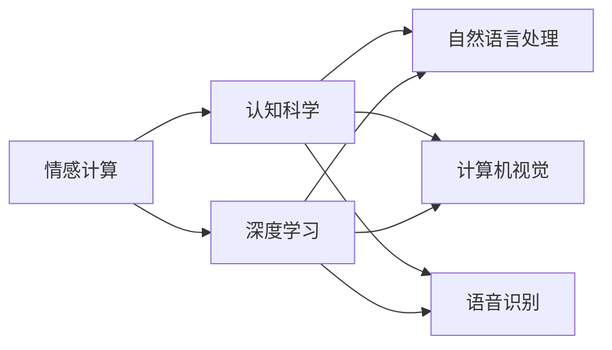
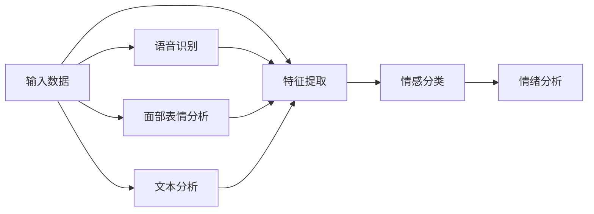

                 

## 1. 背景介绍

在人工智能时代，如何准确地量化和理解人的主观感受已成为一项至关重要的研究课题。传统的客观指标和统计方法，往往无法全面地反映人们的真实体验。而随着深度学习技术的发展，尤其是情感计算和认知科学的进步，量化主观感受变得越来越可行。

本文将探讨如何利用AI技术测量人的主观感受，特别是情感和认知。首先，我们将介绍几个核心概念，如情感计算、认知科学、深度学习，并讨论它们之间的联系。然后，我们将深入分析基于深度学习的主观感受量化算法原理，并给出具体操作步骤。最后，我们还将结合具体案例，展示这些技术在实际应用中的效果，并对未来发展趋势和挑战进行展望。

## 2. 核心概念与联系

### 2.1 核心概念概述

**情感计算**：情感计算（Affective Computing）是指使用计算机技术和数据分析方法，来识别、理解、表达和控制人类的情感状态。它是人工智能与心理学、神经科学等多学科交叉的产物，旨在通过分析人的面部表情、语音、文本等数据，推断其情感倾向。

**认知科学**：认知科学（Cognitive Science）研究人类的心智过程，包括感知、记忆、思维、决策等。它涉及心理学、神经科学、计算机科学等多个领域，旨在理解人类认知机制的本质。

**深度学习**：深度学习（Deep Learning）是机器学习的一种，通过多层神经网络模型，自动学习数据中的复杂特征。深度学习在计算机视觉、自然语言处理等领域取得了显著的成果。

这些核心概念之间的关系可以通过以下Mermaid流程图来展示：



### 2.2 核心概念原理和架构的 Mermaid 流程图

下面是一个简单的情感计算系统的Mermaid流程图，展示了情感识别和情绪分析的基本流程：



## 3. 核心算法原理 & 具体操作步骤

### 3.1 算法原理概述

基于深度学习的情感计算和认知科学量化，主要依赖于以下算法原理：

1. **数据预处理**：将原始数据（如语音、文本、图像等）转换为计算机能够理解的形式，如文本向量表示、频谱特征等。
2. **特征提取**：从预处理后的数据中提取出关键的特征向量，如时频特征、文本中的情感词汇等。
3. **情感分类**：使用分类算法（如支持向量机、深度神经网络等）对提取出的特征向量进行情感分类，如快乐、悲伤、愤怒等。
4. **情绪分析**：结合情感分类结果，使用更复杂的模型（如深度学习模型）进行情绪强度分析，如快乐程度、悲伤程度等。

### 3.2 算法步骤详解

1. **数据预处理**：
   - 语音数据：使用MFCC、STFT等技术，将语音信号转换为频谱特征或梅尔倒谱系数（MFCC）。
   - 文本数据：使用词嵌入（如Word2Vec、GloVe）、BERT等技术，将文本转换为向量表示。
   - 图像数据：使用CNN等技术，提取图像中的特征向量。

2. **特征提取**：
   - 语音特征：提取MFCC特征，可以使用PCA降维。
   - 文本特征：提取情感词汇，可以使用TF-IDF、Word2Vec等技术。
   - 图像特征：使用CNN提取卷积特征，再使用池化层降维。

3. **情感分类**：
   - 使用支持向量机（SVM）、逻辑回归、朴素贝叶斯等传统算法进行初步分类。
   - 使用深度神经网络（如CNN、RNN、LSTM等）进行更加复杂的分类。

4. **情绪分析**：
   - 结合情感分类结果，使用深度学习模型（如RNN、LSTM、Transformer等）进行情绪强度分析。
   - 使用情感词典、情绪表达模型等方法，进一步细化情绪强度。

### 3.3 算法优缺点

**优点**：
1. 高精度：深度学习模型能够自动学习复杂的特征表示，尤其在情感分类和情绪分析方面具有较高的精度。
2. 可扩展性：深度学习模型可以处理多种类型的数据，如图像、语音、文本等。
3. 自适应性：深度学习模型能够适应不同的数据分布和情感表达方式。

**缺点**：
1. 计算资源需求高：深度学习模型通常需要大量的计算资源和训练数据，模型训练和推理的速度较慢。
2. 过拟合风险：深度学习模型容易过拟合，需要额外的正则化技术来避免过拟合。
3. 可解释性差：深度学习模型通常是黑盒模型，难以解释其内部工作机制。

### 3.4 算法应用领域

基于深度学习的情感计算和认知科学量化技术，已在多个领域得到了广泛应用，例如：

1. **医疗**：用于心理健康诊断、情感障碍评估等，帮助医生更准确地理解患者的情感状态。
2. **教育**：用于学生情感状态的监测和分析，帮助教师更好地关注学生的情感需求。
3. **金融**：用于客户情绪分析，帮助金融机构识别潜在风险和客户满意度。
4. **广告**：用于评估广告效果，分析用户对广告内容的情感反应。
5. **娱乐**：用于分析用户的情感体验，优化影视、游戏等娱乐产品的体验。

## 4. 数学模型和公式 & 详细讲解 & 举例说明

### 4.1 数学模型构建

我们以情感分类为例，构建基于深度学习的情感分类模型。假设我们的数据集为 $D=\{(x_i,y_i)\}_{i=1}^N$，其中 $x_i$ 为输入特征，$y_i$ 为情感标签。我们的目标是构建一个深度学习模型 $M$，使得其能够最小化损失函数 $\mathcal{L}(M)$：

$$
\mathcal{L}(M) = \frac{1}{N}\sum_{i=1}^N\ell(M(x_i),y_i)
$$

其中 $\ell$ 为损失函数，如交叉熵损失。

### 4.2 公式推导过程

以CNN模型为例，其结构包括卷积层、池化层、全连接层等。假设我们的模型结构为：

$$
M(x) = \sigma(\text{FC}(\text{Pooling}(\text{Conv}(x))))
$$

其中 $\text{Conv}$ 为卷积层，$\text{Pooling}$ 为池化层，$\text{FC}$ 为全连接层，$\sigma$ 为激活函数。我们的目标是最小化交叉熵损失函数：

$$
\mathcal{L}(M) = -\frac{1}{N}\sum_{i=1}^N\sum_{j=1}^C y_{ij}\log M(x_i)^{(j)}
$$

其中 $C$ 为情感类别数。使用梯度下降等优化算法，我们求解 $M$ 的最小值，从而得到最优模型参数。

### 4.3 案例分析与讲解

我们以面部表情识别为例，展示基于深度学习的情感计算模型的应用。面部表情识别是一个二分类问题，即识别面部表情是否为微笑。我们可以使用以下步骤进行建模：

1. **数据预处理**：使用OpenFace工具，将面部图像转换为特征向量。
2. **特征提取**：使用PCA降维，将特征向量进一步压缩。
3. **情感分类**：使用SVM或CNN模型进行分类，得到微笑与否的预测结果。
4. **结果评估**：使用准确率、精确率、召回率等指标评估模型的性能。

## 5. 项目实践：代码实例和详细解释说明

### 5.1 开发环境搭建

为了进行情感计算和认知科学的量化，我们需要以下开发环境：

1. Python 3.x
2. TensorFlow 或 PyTorch
3. OpenFace（用于面部表情识别）
4. Scikit-learn（用于数据预处理和特征提取）

### 5.2 源代码详细实现

以下是一个简单的情感分类模型的PyTorch代码实现：

```python
import torch
import torch.nn as nn
import torch.optim as optim
from sklearn.datasets import fetch_olivetti_faces
from sklearn.model_selection import train_test_split
from sklearn.preprocessing import LabelBinarizer
from openface import PyFaceAPI
from sklearn.decomposition import PCA

# 加载数据集
data = fetch_olivetti_faces()
X, y = data.data, data.target
X = X.reshape((-1, 64*64))
X_train, X_test, y_train, y_test = train_test_split(X, y, test_size=0.2, random_state=42)

# 加载OpenFace模型
api = PyFaceAPI("path/to/openface-model")

# 特征提取
def extract_features(X):
    features = []
    for img in X:
        features.append(api.faceRep(img))
    return features

X_train = extract_features(X_train)
X_test = extract_features(X_test)

# 降维
pca = PCA(n_components=100)
X_train = pca.fit_transform(X_train)
X_test = pca.transform(X_test)

# 数据标准化
X_train = (X_train - X_train.mean()) / X_train.std()
X_test = (X_test - X_train.mean()) / X_train.std()

# 标签编码
encoder = LabelBinarizer()
y_train = encoder.fit_transform(y_train)
y_test = encoder.transform(y_test)

# 模型构建
model = nn.Sequential(
    nn.Linear(100, 256),
    nn.ReLU(),
    nn.Linear(256, 128),
    nn.ReLU(),
    nn.Linear(128, 2),
    nn.Softmax()
)

# 损失函数和优化器
criterion = nn.BCELoss()
optimizer = optim.Adam(model.parameters(), lr=0.001)

# 训练模型
for epoch in range(100):
    optimizer.zero_grad()
    outputs = model(X_train)
    loss = criterion(outputs, y_train)
    loss.backward()
    optimizer.step()
    print("Epoch {}, Loss: {:.4f}".format(epoch, loss.item()))

# 评估模型
outputs = model(X_test)
y_pred = (outputs > 0.5).int()
accuracy = (y_pred == y_test).mean()
print("Accuracy: {:.4f}".format(accuracy))
```

### 5.3 代码解读与分析

**数据预处理**：
- 使用Scikit-learn的`fetch_olivetti_faces`函数加载数据集。
- 将数据集划分为训练集和测试集。
- 使用OpenFace工具提取面部特征向量。
- 使用PCA降维。
- 数据标准化，使得均值为0，标准差为1。

**模型构建**：
- 使用PyTorch构建一个简单的深度神经网络模型，包含两个全连接层和两个ReLU激活函数。
- 使用Softmax函数输出分类概率。

**训练模型**：
- 使用交叉熵损失函数进行训练。
- 使用Adam优化器优化模型参数。
- 打印每个epoch的损失值。

**评估模型**：
- 使用准确率评估模型性能。

## 6. 实际应用场景

### 6.1 医疗

在医疗领域，情感计算和认知科学量化可以用于心理健康诊断和情感障碍评估。例如，使用情感计算技术，可以分析患者的面部表情、语音、文本等数据，判断其情绪状态，从而辅助医生进行诊断和治疗。

### 6.2 教育

在教育领域，情感计算和认知科学量化可以用于学生情感状态的监测和分析。例如，使用情感计算技术，可以分析学生的语音、表情、文本等数据，判断其情感状态和学习态度，从而帮助教师更好地关注学生的情感需求，提高教学效果。

### 6.3 金融

在金融领域，情感计算和认知科学量化可以用于客户情绪分析。例如，使用情感计算技术，可以分析客户的语音、表情、文本等数据，判断其情绪状态和满意度，从而帮助金融机构识别潜在风险和提高客户满意度。

### 6.4 广告

在广告领域，情感计算和认知科学量化可以用于评估广告效果。例如，使用情感计算技术，可以分析用户对广告内容的情感反应，从而优化广告设计和投放策略。

## 7. 工具和资源推荐

### 7.1 学习资源推荐

为了帮助开发者系统掌握基于深度学习的情感计算和认知科学量化技术，这里推荐一些优质的学习资源：

1. **《Deep Learning》书籍**：Ian Goodfellow等人编写的经典深度学习教材，涵盖了深度学习的基本原理和应用。
2. **《Affective Computing》书籍**：Bruce Blake等人编写的情感计算教材，介绍了情感计算的基本概念和应用。
3. **《Cognitive Science》期刊**：ACM出版的认知科学期刊，涵盖了认知科学的多方面内容。
4. **Coursera《Deep Learning》课程**：由Andrew Ng主讲的深度学习课程，内容全面，覆盖了深度学习的基本原理和应用。
5. **Kaggle情感分析竞赛**：Kaggle上举办的多项情感分析竞赛，可以帮助开发者实践和提高情感计算技能。

### 7.2 开发工具推荐

为了进行情感计算和认知科学的量化，我们需要以下开发工具：

1. Python 3.x
2. TensorFlow 或 PyTorch
3. OpenFace（用于面部表情识别）
4. Scikit-learn（用于数据预处理和特征提取）
5. Keras（用于深度学习模型的构建和训练）

### 7.3 相关论文推荐

情感计算和认知科学量化领域的研究正在不断推进，以下是几篇奠基性的相关论文，推荐阅读：

1. **《Deep Learning》书籍**：Ian Goodfellow等人编写的经典深度学习教材，涵盖了深度学习的基本原理和应用。
2. **《Affective Computing》书籍**：Bruce Blake等人编写的情感计算教材，介绍了情感计算的基本概念和应用。
3. **《Cognitive Science》期刊**：ACM出版的认知科学期刊，涵盖了认知科学的多方面内容。
4. **Coursera《Deep Learning》课程**：由Andrew Ng主讲的深度学习课程，内容全面，覆盖了深度学习的基本原理和应用。
5. **Kaggle情感分析竞赛**：Kaggle上举办的多项情感分析竞赛，可以帮助开发者实践和提高情感计算技能。

## 8. 总结：未来发展趋势与挑战

### 8.1 总结

本文对基于深度学习的情感计算和认知科学量化技术进行了全面系统的介绍。首先，我们介绍了情感计算、认知科学、深度学习等核心概念，并讨论了它们之间的联系。然后，我们详细讲解了情感计算和认知科学量化技术的算法原理和操作步骤，并给出了具体的代码实例。最后，我们展示了这些技术在实际应用中的效果，并对未来发展趋势和挑战进行了展望。

通过本文的系统梳理，我们可以看到，基于深度学习的情感计算和认知科学量化技术正在成为人工智能技术的重要组成部分，广泛应用于医疗、教育、金融、广告等多个领域，为人类认知智能的进步带来了新的可能性。未来，随着深度学习技术的不断进步和应用领域的拓展，情感计算和认知科学量化技术将发挥更大的作用，推动人工智能技术的进一步发展。

### 8.2 未来发展趋势

未来，情感计算和认知科学量化技术将呈现以下几个发展趋势：

1. **更高效的数据处理**：随着计算资源和硬件技术的不断提升，情感计算和认知科学量化技术将能够处理更多类型和规模的数据。
2. **更精确的情感分类**：深度学习模型将继续优化，实现更精确的情感分类和情绪分析。
3. **跨领域应用拓展**：情感计算和认知科学量化技术将拓展到更多领域，如金融、教育、广告等。
4. **多模态数据融合**：情感计算和认知科学量化技术将能够整合语音、图像、文本等多种数据，提供更加全面和准确的情感分析。
5. **交互式情感反馈**：通过实时情感分析，系统可以提供个性化推荐和反馈，增强用户体验。

### 8.3 面临的挑战

尽管情感计算和认知科学量化技术已经取得了显著进展，但在未来发展过程中，仍面临以下挑战：

1. **数据隐私和安全**：情感计算和认知科学量化技术需要处理大量个人数据，如何保护用户隐私和安全是一个重要问题。
2. **伦理和社会影响**：情感计算和认知科学量化技术可能被滥用，带来伦理和社会问题，如隐私泄露、情感操纵等。
3. **模型可解释性**：情感计算和认知科学量化技术通常是黑盒模型，难以解释其内部工作机制，缺乏可解释性。
4. **跨文化差异**：情感计算和认知科学量化技术在不同文化背景下的应用效果可能存在差异，需要进行文化适应性研究。
5. **模型鲁棒性**：情感计算和认知科学量化技术需要具备较强的鲁棒性，能够适应不同的数据分布和表达方式。

### 8.4 研究展望

未来，情感计算和认知科学量化技术需要在以下几个方面进行更多的研究：

1. **数据隐私保护**：研究如何在情感计算和认知科学量化技术中保护用户隐私，确保数据安全。
2. **伦理和社会影响研究**：研究情感计算和认知科学量化技术可能带来的伦理和社会影响，制定相关规范和标准。
3. **模型可解释性研究**：研究如何增强情感计算和认知科学量化技术的可解释性，使其更具可信度。
4. **跨文化差异研究**：研究情感计算和认知科学量化技术在不同文化背景下的应用效果，提升跨文化适应性。
5. **鲁棒性研究**：研究如何提高情感计算和认知科学量化技术的鲁棒性，使其在不同数据分布和表达方式下仍能取得良好的效果。

## 9. 附录：常见问题与解答

**Q1：情感计算和认知科学量化技术是否适用于所有应用场景？**

A: 情感计算和认知科学量化技术在许多应用场景中都有广泛的应用前景，如医疗、教育、金融、广告等。但需要根据具体场景和需求进行适应性调整，以达到最佳效果。

**Q2：如何保护用户隐私和安全？**

A: 在情感计算和认知科学量化技术中，需要采取多种隐私保护和安全措施，如数据匿名化、加密传输、访问控制等，确保用户数据的安全。

**Q3：情感计算和认知科学量化技术是否有伦理问题？**

A: 情感计算和认知科学量化技术可能会带来伦理问题，如隐私泄露、情感操纵等。需要制定相应的伦理规范和标准，确保技术应用的安全性和合法性。

**Q4：如何提高情感计算和认知科学量化技术的可解释性？**

A: 可以通过增加模型的透明度、提供解释性特征、建立可解释性模型等方法，提高情感计算和认知科学量化技术的可解释性。

**Q5：情感计算和认知科学量化技术是否适合跨文化应用？**

A: 情感计算和认知科学量化技术在跨文化应用中需要进行适应性研究，考虑不同文化背景下的情感表达方式和数据特点。

**Q6：如何提高情感计算和认知科学量化技术的鲁棒性？**

A: 可以通过增加数据量、优化模型结构、引入正则化技术等方法，提高情感计算和认知科学量化技术的鲁棒性。

---

作者：禅与计算机程序设计艺术 / Zen and the Art of Computer Programming

